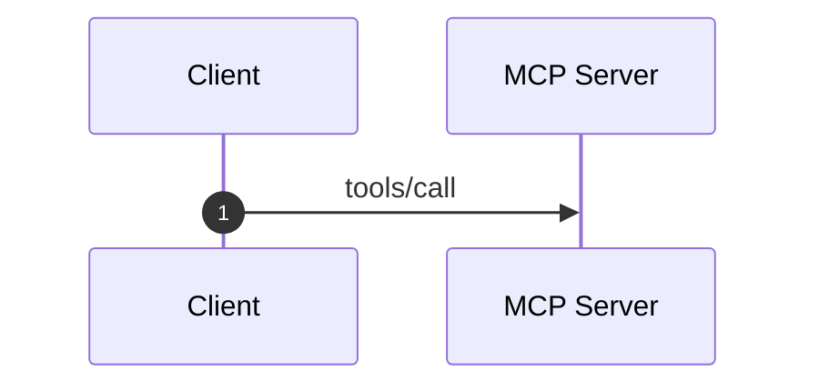

# Docusaurus/MDX Component Snippets (load on demand)

## Admonitions
:::info At a glance
- **Scope:** …
- **Prerequisites:** …
- **Outcome:** …
:::

:::warning Breaking change in spec 2026-07-28
…
:::

## Tabs (per-cloud variants)
```mdx
import Tabs from '@theme/Tabs';
import TabItem from '@theme/TabItem';

<Tabs groupId="cloud">
  <TabItem value="aws" label="AWS" default>…</TabItem>
  <TabItem value="azure" label="Azure">…</TabItem>
  <TabItem value="gcp" label="Google Cloud">…</TabItem>
</Tabs>
```
`groupId` syncs the selection across the whole site — always set it for
recurring dimensions (cloud, language, framework).

## Collapsible
```mdx
<details>
<summary>Full Terraform module (120 lines)</summary>

```hcl title="main.tf"
…
```

</details>
```

## Code block with title + highlight
```mdx
```python title="scripts/dedup_check.py" {4-6}
…
```
```

## Hub card grid (domain index pages)
```mdx
import DocCardList from '@theme/DocCardList';

<DocCardList />
```
Prefer hand-curated link sections for hubs (per stage-06); use DocCardList only
as a fallback for auto-listing a folder.

## Mermaid with caption
````mdx

*Figure: Tool invocation round-trip (MCP spec 2026-07-28).*
````
