# Agent UX Patterns

**Audience:** UX leads, product owners, and principal AI architects designing the human-facing layer of enterprise agentic applications.

**Related:**
[HITL Gates](../../architecture/49-enterprise-ai-architecture-patterns.md) |
[Memory Architecture](../../architecture/41-agent-memory-planning-architecture.md) |
[Security/OWASP](pathname:///archon/trust/05-agentic-ai-security-identity) |
[Governance](../../architecture/51-enterprise-ai-governance-compliance.md) |
[Observability](../../architecture/43-agentic-ai-reliability-observability-governance.md)

## 1. Copilot Pattern Taxonomy

Twelve canonical deployment archetypes. Every enterprise agentic application maps to one or more of these patterns. Use the table as a first-pass filter, then consult the detailed profiles below.

### 1.1 Summary Table

| # | Pattern | Autonomy Level | UX Surface | Primary Audience | Integration Point |
| --- | --------- | --------------- | ------------ | ----------------- | ------------------- |
| 1 | Chat Copilot | Low | Full-page chat | End users, knowledge workers | Standalone app or tab |
| 2 | Embedded Copilot | Low–Medium | Inline within host app | Power users, developers | Host app sidebar/toolbar |
| 3 | Floating Copilot | Low–Medium | Overlay on any page | All users | Browser extension / iframe |
| 4 | Workspace Copilot | Medium | Unified workspace panel | Knowledge workers | Document, calendar, email |
| 5 | Workflow Copilot | Medium–High | Step-driven wizard | Process workers | BPM / workflow engine |
| 6 | Decision Copilot | Medium | Structured recommendation panel | Analysts, managers | BI / dashboards |
| 7 | Coding Copilot | Medium | IDE inline + chat | Developers | IDE extension |
| 8 | Search Copilot | Low–Medium | SERP augmentation | All users | Search results page |
| 9 | Voice Agent | Medium | Voice + minimal visual | Field workers, drivers | Audio channel |
| 10 | Visual Agent | Medium | Image canvas + chat | Designers, analysts | Design / data tools |
| 11 | Multi-agent Dashboard | High | Status board | AI ops, platform teams | Orchestration layer |
| 12 | Autonomous Copilot | Very High | Notification surface only | Managers, approvers | Background process |

```mermaid
graph LR
    subgraph Low["Low Autonomy"]
        P1[Chat Copilot]
        P3[Floating Copilot]
        P8[Search Copilot]
    end
    subgraph LowMed["Low–Medium"]
        P2[Embedded Copilot]
    end
    subgraph Med["Medium"]
        P4[Workspace Copilot]
        P6[Decision Copilot]
        P7[Coding Copilot]
        P9[Voice Agent]
        P10[Visual Agent]
    end
    subgraph MedHigh["Medium–High"]
        P5[Workflow Copilot]
    end
    subgraph High["High / Very High"]
        P11[Multi-agent Dashboard]
        P12[Autonomous Copilot]
    end
    Low --> LowMed --> Med --> MedHigh --> High
```

*The 12 copilot patterns arranged by autonomy level, low to very high — as autonomy increases the UX surface shifts from full conversational chat toward status boards and background notification-only interfaces.*

### 1.2 Pattern Profiles

#### Pattern 1 — Chat Copilot

**Definition:** A standalone conversational interface. The agent has no ambient context beyond what the user types and what is injected into the system prompt.

**Deployment Context:** Dedicated app, enterprise portal tab, or public-facing chatbot.

**UX Characteristics:**

- Linear conversation history
- Turn-by-turn interaction model
- Persistent message list with timestamps
- File/image upload support for multimodal input
- Copy, cite, and regenerate controls per message

**AG-UI Integration Pattern:** Bidirectional streaming via AG-UI `TEXT_MESSAGE_CONTENT` and `TOOL_CALL_START/END` events. Session stored client-side or in backend session store keyed to user identity.

**A2UI Integration Pattern:** Agent may emit `GenerateUI` events to render structured forms, cards, or data tables inline in the chat thread.

**Recommended Approval Model:** Human-on-the-loop (HOTL) for read-only operations. Human-in-the-loop (HITL) for any write action (send email, create ticket, post to Slack).

**Example Products:** Claude.ai, ChatGPT, Microsoft Copilot standalone.

**When to use:**

- Users need an open-ended conversational interface
- No ambient host application context is available
- First deployment of AI — minimizes integration complexity
- Use case is primarily knowledge retrieval, writing, or analysis

#### Pattern 2 — Embedded Copilot

**Definition:** The agent UI is embedded within an existing application as a persistent sidebar, inline suggestion overlay, or contextual panel. The host application passes ambient context (current document, selected code, open ticket) to the agent automatically.

**Deployment Context:** IDE plugins, document editors, CRM panels, ticketing systems.

**UX Characteristics:**

- Triggered by hotkey, selection, or ambient context change
- Inline suggestion acceptance (Tab / ESC)
- Contextual actions: "Explain this", "Fix this", "Summarize"
- Minimal chrome — blends into host app design system
- Side-by-side view (agent output adjacent to work surface)

**AG-UI Integration Pattern:** Host app injects AG-UI context events (`STATE_SNAPSHOT`, `MESSAGES_SNAPSHOT`) with current document/selection. Agent streams responses back. CopilotKit `useCopilotReadable` API is the standard mechanism to synchronize host app state.

**A2UI Integration Pattern:** Agent can generate structured output components (diff views, suggestion cards) that slot into the host app's design system using A2UI `ComponentSpec`.

**Recommended Approval Model:** Invisible AI for read-only suggestions. Single-click HITL for mutations (apply diff, insert text, update field).

**Example Products:** GitHub Copilot, JetBrains AI Assistant, Salesforce Einstein, Notion AI.

**When to use:**

- Users work primarily within one host application
- Ambient context (current document, code, record) makes suggestions immediately relevant
- Disruption to existing workflows must be minimized
- The host app vendor provides an extension API

#### Pattern 3 — Floating Copilot

**Definition:** A floating panel or sidebar that overlays any page in a browser or desktop application. The agent can observe the current page context but is not embedded in the host app.

**Deployment Context:** Browser extensions, desktop overlay apps, enterprise intranet widgets.

**UX Characteristics:**

- Draggable / collapsible floating panel
- "What can I help with on this page?" entry point
- Page content summarization, form filling, extraction
- Context injected via DOM scraping or MCP NLWeb adapter
- Minimal footprint — does not replace the underlying page

**AG-UI Integration Pattern:** The overlay connects to an AG-UI backend. Page context is injected as a `STATE_SNAPSHOT` event via a content script or NLWeb MCP server. Microsoft NLWeb enables website owners to expose a structured MCP endpoint so the overlay agent can query content rather than scraping.

**Recommended Approval Model:** HITL for any form fills or page mutations. HOTL for read/summarize.

**Example Products:** Copilot in Edge, Arc AI, Siri on iOS Safari.

**When to use:**

- Users work across many different web applications
- No host-app extension API exists
- The primary use case is read, summarize, extract — not write
- Deployment must not require changes to any backend system

#### Pattern 4 — Workspace Copilot

**Definition:** The agent has access to the user's full workspace context — documents, calendar, email, tasks, and people graph — and can act across all of them in a single conversation turn.

**Deployment Context:** M365 Copilot, Google Workspace Duet, enterprise digital assistant.

**UX Characteristics:**

- Unified "Ask about my work" entry point
- Cross-app context stitching (email → calendar → document)
- "Catch me up" and "Prepare me for my meeting" entry points
- Permission model: shows what data was accessed per response
- Citation of source documents in every response

**AG-UI Integration Pattern:** Workspace Copilot uses AG-UI `STATE_SNAPSHOT` events to pass workspace context (recent emails, current document, upcoming calendar) at conversation start. Tool calls use MCP servers for each workspace service (Graph API, Drive API, etc.).

**Recommended Approval Model:** HITL for sends and mutations. HOTL for read/summarize. Data access logged to compliance audit trail.

**Example Products:** Microsoft 365 Copilot, Google Duet AI, Salesforce Agentforce.

**When to use:**

- Users need synthesis across multiple systems of record
- Meeting prep, status updates, and drafting cover 80%+ of use cases
- Enterprise SSO and permissions infrastructure already exists
- Data residency and audit requirements are met by platform provider

#### Pattern 5 — Workflow Copilot

**Definition:** The agent is embedded in a business process and guides users through defined steps. Unlike a chat copilot, the state machine is the process — not the conversation.

**Deployment Context:** Loan origination, insurance underwriting, HR onboarding, procurement approval.

**UX Characteristics:**

- Step-driven wizard with agent assistance at each step
- "What should I fill in here?" contextual help
- Data validation with natural language explanations
- Agent fills fields from documents, user confirms
- Progress bar shows process position
- Exit and save-progress controls

**AG-UI Integration Pattern:** The workflow engine emits `STATE_SNAPSHOT` events at each step transition. The agent receives current form state and can pre-fill or validate fields. User actions emit `USER_ACTION` events that advance the state machine.

**Recommended Approval Model:** HITL at each step boundary. Supervisor review for exceptions. Full audit trail mandatory for regulated processes.

**Example Products:** ServiceNow AI Agents, Pega GenAI, Camunda Copilot.

**When to use:**

- The business process is well-defined and compliance-regulated
- Errors in data entry carry financial or legal risk
- Users vary widely in expertise — novices need guidance
- Audit trail is a compliance requirement, not an option

#### Pattern 6 — Decision Copilot

**Definition:** The agent provides structured decision support: recommendation, confidence score, supporting evidence, and alternative options. The human retains decision authority — the agent makes the evidence structure explicit.

**Deployment Context:** Credit scoring review, medical triage support, security alert triage, investment recommendation.

**UX Characteristics:**

- Recommendation card: primary recommendation + confidence %
- Ranked alternative list with trade-off summary
- Evidence citations (documents, data, precedents)
- "Challenge this recommendation" conversational entry
- Decision capture: record human decision + rationale
- Audit trail: recommendation vs. human decision delta

**AG-UI Integration Pattern:** Agent emits structured `TOOL_CALL_END` events with JSON payloads matching A2UI `DecisionCard` component spec. The host app renders native decision UI. Streaming is used only for the reasoning explanation; the decision card is rendered as a final structured response.

**Recommended Approval Model:** Human-in-the-loop is mandatory. Every recommendation requires explicit human decision capture. No auto-approve.

**Example Products:** Salesforce Einstein Decision, IBM Watson Assistant for financial services, custom underwriting platforms.

**When to use:**

- Consequential decisions with regulatory or financial accountability
- The decision-maker is accountable but needs AI synthesis of evidence
- Auditability of the decision process is a compliance requirement
- False positive / false negative costs are asymmetric

#### Pattern 7 — Coding Copilot

**Definition:** An IDE-integrated agent providing code completion, generation, review, test writing, documentation, and refactoring.

**Deployment Context:** VS Code, JetBrains IDEs, Neovim, GitHub web editor.

**UX Characteristics:**

- Ghost text completions (gray inline suggestions)
- Chat panel for multi-line generation
- Right-click → "Ask AI" context menu
- Diff view for suggested changes
- Inline comment explanation for generated code
- Test generation with coverage visualization

**AG-UI Integration Pattern:** IDE extension exposes current file, selection, and project context via `STATE_SNAPSHOT` events. GitHub Copilot uses a proprietary protocol; open alternatives use AG-UI or Copilot Kit. The CopilotKit React components can render inside IDE webview panels.

**Recommended Approval Model:** Invisible AI for completions (Tab to accept, ESC to reject). HITL for refactoring across multiple files. HOTL for test runs triggered by agent.

**Example Products:** GitHub Copilot, Cursor, Windsurf, JetBrains AI, Claude Code.

**When to use:**

- Development team productivity is the primary ROI driver
- Codebase has enough context (docs, tests, comments) for grounding
- Security review process exists for AI-generated code
- Code review gates are in place to catch AI errors

#### Pattern 8 — Search Copilot

**Definition:** The agent augments or replaces keyword search with semantic understanding, synthesis, and conversational follow-up.

**Deployment Context:** Enterprise knowledge base, intranet, documentation portal, e-commerce, customer support.

**UX Characteristics:**

- Answer at the top of search results (not just links)
- Cited sources beneath the answer
- Conversational follow-up ("Tell me more about X")
- "This answer might be outdated" freshness indicator
- Confidence indicators on answer cards
- Feedback buttons (Helpful / Not Helpful)

**AG-UI Integration Pattern:** Search query triggers an AG-UI streaming response with citations. NLWeb MCP enables website content to be queryable by the agent backend. `STATE_SNAPSHOT` includes current search filters and query history.

**Recommended Approval Model:** No approval needed (read-only). Feedback loop is the primary quality control mechanism.

**Example Products:** Perplexity, Bing Copilot search, Glean, Notion AI search, Elastic ESRE.

**When to use:**

- Existing search returns too many results without synthesis
- Users need cross-document summarization, not just retrieval
- Content corpus changes frequently (RAG preferred over fine-tuning)
- User intent is primarily informational, not transactional

#### Pattern 9 — Voice Agent

**Definition:** A voice-first interface where the primary input is speech and the primary output is audio, with minimal or no visual UI.

**Deployment Context:** Contact center IVR, hands-free field worker tools, automotive assistants, smart speaker skills.

**UX Characteristics:**

- Wake word or push-to-talk activation
- Spoken confirmation of actions ("I've created that ticket. Should I assign it to you?")
- Conversational repair ("Sorry, could you repeat that?")
- Short response format — no lists, no markdown
- Barge-in support (user can interrupt mid-response)
- Silence detection and graceful timeout

**AG-UI Integration Pattern:** STT layer converts audio to text → AG-UI event stream → LLM → TTS converts response back to audio. Streaming is critical: the LLM must begin speaking while still generating. `TEXT_MESSAGE_CHUNK` events are piped to a streaming TTS service.

**Recommended Approval Model:** Verbal confirmation for all actions ("Say 'yes' to confirm"). No irreversible actions without spoken double-confirmation.

**Example Products:** Amazon Alexa for Business, Google CCAI, Twilio Voice AI, Bland.ai, Vapi.

**When to use:**

- Users' hands are occupied (warehouse, field service, driving)
- Screen real estate is absent or minimal
- Response latency below 1.5 seconds is critical for natural conversation
- The use case involves structured transactions, not open-ended reasoning

#### Pattern 10 — Visual Agent

**Definition:** An agent that can understand images, diagrams, and charts, and can generate or annotate visual content.

**Deployment Context:** Design review, architecture diagram analysis, medical imaging support, quality control inspection.

**UX Characteristics:**

- Image upload / screenshot paste into chat
- Agent-generated image annotations (bounding boxes, labels)
- Side-by-side view (original image | agent analysis)
- Chart interpretation with natural language explanation
- "Describe what you see" and "Identify anomalies" entry points

**AG-UI Integration Pattern:** Images are included in AG-UI `TEXT_MESSAGE_CONTENT` events as base64 or pre-signed URLs. Agent returns bounding box coordinates in structured JSON which the UI renders as SVG overlays on the original image.

**Recommended Approval Model:** HOTL for annotations (user can correct). HITL for any downstream actions triggered by image analysis (flag defect, reject shipment).

**Example Products:** GPT-4o Canvas, Claude with vision, AWS Rekognition + LLM overlay, custom quality-control platforms.

**When to use:**

- The source data is inherently visual (images, diagrams, charts, scans)
- Textual description alone is insufficient for the decision
- Existing vision ML models lack the reasoning capability for the task
- Users need to understand the agent's visual interpretation, not just the conclusion

#### Pattern 11 — Multi-agent Dashboard

**Definition:** A UI that visualizes multiple collaborating agents, their current tasks, inter-agent communication, and aggregate outputs.

**Deployment Context:** AI ops platforms, enterprise automation centers, research orchestration, automated DevOps pipelines.

**UX Characteristics:**

- Agent status grid: name, current task, progress, last action
- Message bus visualization: inter-agent messages in real time
- Supervisor agent panel: current plan, sub-task delegation
- Task output aggregation: collated results from all agents
- Intervention controls: pause agent, reassign task, inject instruction
- Alert surface: failed agents, stuck tasks, budget warnings

**AG-UI Integration Pattern:** Each agent in the topology connects to AG-UI independently. A supervisor UI component subscribes to all agent event streams simultaneously. `RUN_STARTED`, `RUN_FINISHED`, `TOOL_CALL_START`, `TOOL_CALL_END` events from all agents are muxed into a single timeline.

**Recommended Approval Model:** HITL at supervisor level for cross-agent decisions. Human-over-the-loop (HOOL) for individual agent actions within policy.

**Example Products:** LangGraph Studio, Microsoft Autogen Studio, CopilotKit multi-agent dashboard.

**When to use:**

- Multiple specialized agents must collaborate on a single user goal
- Human oversight of the overall system is required without micromanaging each agent
- Debugging and observability of agent behavior are primary concerns
- The business process involves parallel workstreams requiring coordination

#### Pattern 12 — Autonomous Copilot

**Definition:** The agent operates largely independently, completing multi-step tasks with minimal human interaction. The UX is primarily a notification and exception management surface.

**Deployment Context:** Automated report generation, background data enrichment, scheduled compliance checks, autonomous PR review, email triage.

**UX Characteristics:**

- Task submission: describe task + parameters + schedule
- Progress notification (email, Slack, push)
- Exception queue: items requiring human judgment
- Output review: view completed work before publishing
- Audit log: every decision, tool call, and data access
- Kill switch: emergency stop for all autonomous tasks

**AG-UI Integration Pattern:** AG-UI events are consumed asynchronously. The frontend subscribes to a task status WebSocket, not a live streaming session. `RUN_FINISHED` event triggers a notification. Exception events (`TOOL_CALL_START` for high-risk tools) route to an approval queue.

**Recommended Approval Model:** Human-over-the-loop (HOOL). Exceptions surface to human automatically. Irreversible actions require approval even in HOOL mode.

**Example Products:** Devin (software engineering agent), Harvey AI (legal document review), custom autonomous workflows.

**When to use:**

- The task is well-defined, repetitive, and time-consuming
- Human review of the final output (not each step) is sufficient
- Risk of individual step error is low and recoverable
- Volume of work exceeds human capacity

