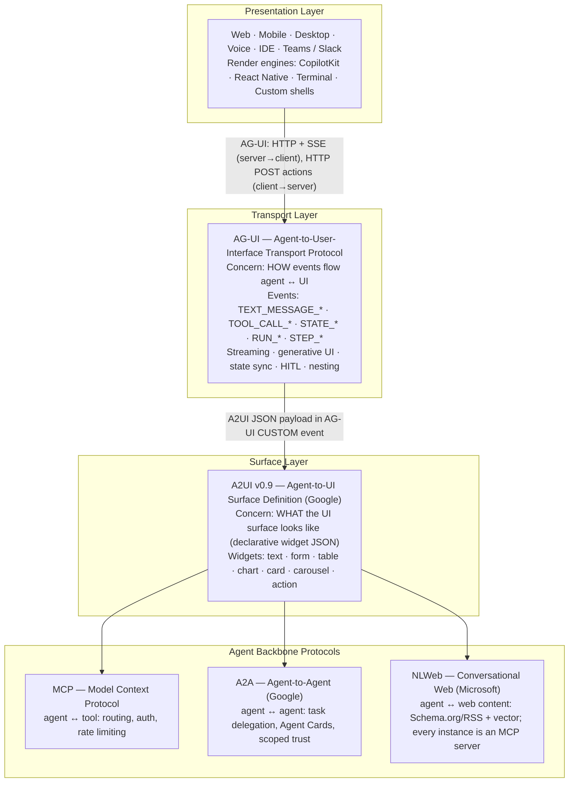
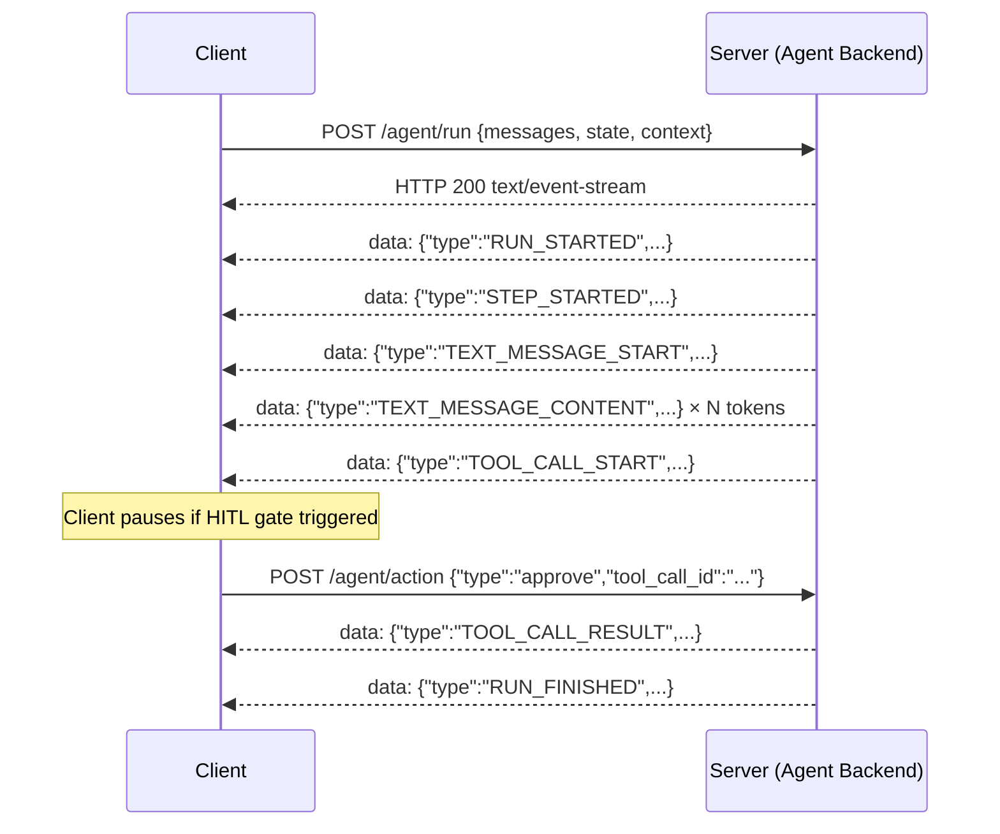
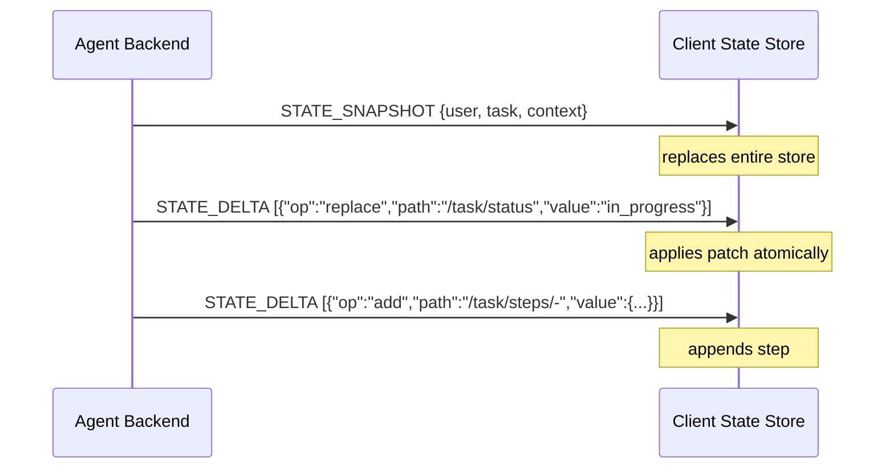
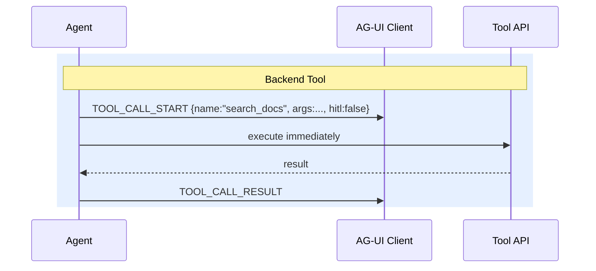
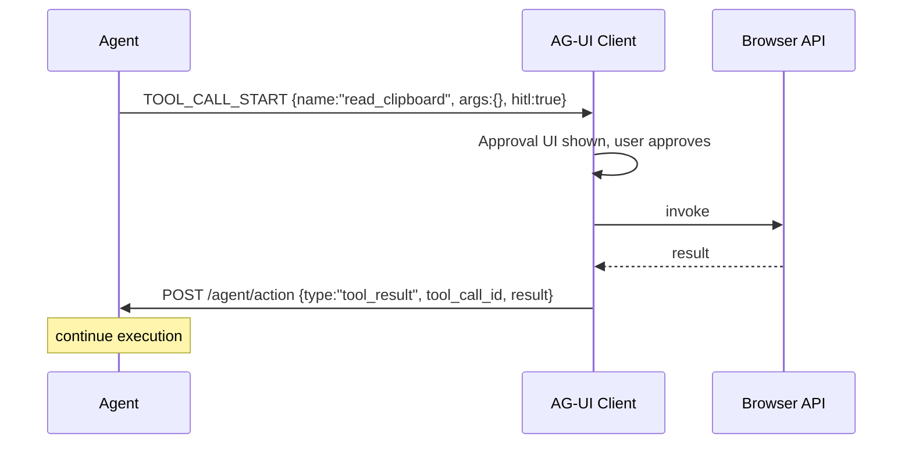
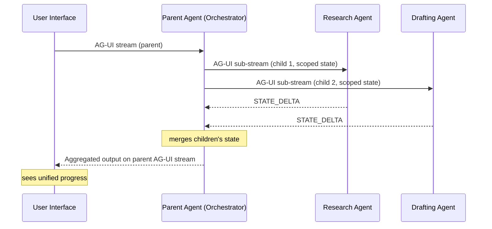
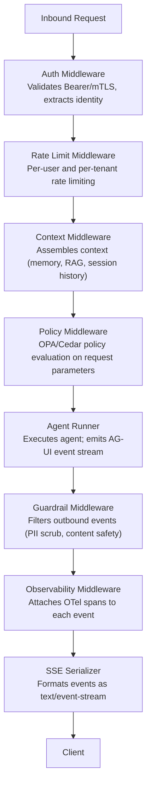

# AGUI Standards & Ecosystem Landscape

Principal AI Architects and AI Platform Teams will find here the authoritative technical reference for every protocol, standard, and framework in the agentic UI ecosystem as of July 2026 — including AG-UI, A2UI v0.9, MCP Apps, NLWeb, OpenAI Apps SDK, and Microsoft Agent Framework 1.0, with production code examples, a 15-framework comparison matrix, and a selection decision tree.

:::info Protocol Maturity Status — July 2026
    AG-UI: production-ready open standard. A2UI: v0.9 experimental (Google). NLWeb: production open project (Microsoft). MCP Apps: production (CopilotKit/Anthropic ecosystem). OpenAI Apps SDK: production (later standardized into MCP Apps). Microsoft Agent Framework 1.0: production-ready (released April 2026). Amazon Bedrock AgentCore AG-UI support: infrastructure-level production.


## 1. Protocol Layer Map

The agentic UI protocol stack as of July 2026 comprises five distinct but interoperating standards. Each operates at a different layer of the stack and solves a different problem. Understanding the boundaries between them is essential for correct architecture decisions.




**Agentic UI protocol stack — layer model**

*The five interoperating standards, top to bottom: presentation hosts render surfaces, AG-UI transports events, A2UI defines the surface, and MCP/A2A/NLWeb form the agent backbone underneath.*

### 1.1 Protocol Responsibility Matrix

| Concern | AG-UI | A2UI | MCP | A2A | NLWeb | MCP Apps |
| --- | --- | --- | --- | --- | --- | --- |
| Text streaming | Primary | No | No | No | No | No |
| Generative UI rendering | Carries payload | Primary definition | No | No | No | Renders alongside tool |
| Tool invocation (backend) | Event emission | No | Primary | No | No | Yes (bundled) |
| Tool invocation (frontend) | Primary | No | No | No | No | Yes |
| State synchronization | Primary | No | No | No | No | No |
| Agent-to-agent delegation | No | No | No | Primary | No | No |
| Human-in-the-loop | Primary | Via A2UI forms | No | No | No | Via approval gate |
| Web content querying | No | No | Via NLWeb MCP | No | Primary | No |
| Authentication / authorization | Transport-level | No | Primary | Scoped | MCP-inherited | Primary |
| Nested agent composition | Primary | No | No | Complementary | No | No |


## 2. AG-UI Deep Dive

AG-UI (Agent-User Interface Protocol) is an open, lightweight, event-based protocol that standardizes communication between AI agents and user-facing applications. It builds atop HTTP and WebSockets as an abstraction layer, handling the complexities of streaming intermediate agent work, nondeterministic execution behavior, and mixed structured/unstructured I/O.

**GitHub:** `ag-ui-protocol/ag-ui` (Apache 2.0)  
**First-party backend integrations:** LangGraph, CrewAI, Microsoft Agent Framework 1.0, Google ADK, AWS Strands, Bedrock AgentCore, Mastra, PydanticAI, Agno, LlamaIndex, AG2  
**In-progress backends:** OpenAI Agent SDK, Cloudflare Agents  
**First-party client:** CopilotKit  
**Additional clients:** React Native, Terminal clients  
**Additional SDKs:** Kotlin, Golang, Dart, Java, Rust; .NET and Nim in progress

### 2.1 Event Taxonomy

AG-UI communication is entirely event-driven. The server emits a stream of typed events; the client renders incrementally as events arrive. Every event carries a `type` field that determines how it is processed.

| Event Type | Direction | Purpose | Carries |
| --- | --- | --- | --- |
| `RUN_STARTED` | Server → Client | Signals that an agent run has begun | `run_id`, `thread_id`, metadata |
| `RUN_FINISHED` | Server → Client | Signals successful run completion | `run_id`, final status, timing |
| `RUN_ERROR` | Server → Client | Signals agent run failure | `run_id`, error code, message, retry hint |
| `STEP_STARTED` | Server → Client | A named agent step has begun | `step_name`, `step_id`, description |
| `STEP_FINISHED` | Server → Client | A named agent step has completed | `step_id`, duration, result summary |
| `TEXT_MESSAGE_START` | Server → Client | A new text message stream has started | `message_id`, role |
| `TEXT_MESSAGE_CONTENT` | Server → Client | Incremental text token delivery | `message_id`, `delta` (string) |
| `TEXT_MESSAGE_END` | Server → Client | Text message stream complete | `message_id`, full message summary |
| `TOOL_CALL_START` | Server → Client | Agent is about to call a tool | `tool_call_id`, `tool_name`, pause hint |
| `TOOL_CALL_ARGS` | Server → Client | Streaming tool call arguments | `tool_call_id`, `delta` (JSON string) |
| `TOOL_CALL_END` | Server → Client | Tool call arguments complete | `tool_call_id`, full args |
| `TOOL_CALL_RESULT` | Server → Client | Tool execution result | `tool_call_id`, result, error |
| `STATE_SNAPSHOT` | Server → Client | Full state store snapshot | Typed state object |
| `STATE_DELTA` | Server → Client | Incremental state update (JSON Patch RFC 6902) | `delta` (JSON Patch operations array) |
| `MESSAGES_SNAPSHOT` | Server → Client | Full conversation history snapshot | Messages array |
| `RAW` | Server → Client | Pass-through of raw backend data | Arbitrary payload (for debugging / custom use) |
| `CUSTOM` | Server → Client | Protocol extension point | Typed payload including A2UI surface definitions |

#### Event Ordering Guarantees

- Events within a single run arrive in causal order (TCP-ordered SSE stream)
- `TOOL_CALL_START` always precedes `TOOL_CALL_ARGS` for the same `tool_call_id`
- `TOOL_CALL_ARGS` events stream incrementally; `TOOL_CALL_END` marks completion
- `STATE_DELTA` events are applied in order; each produces a new consistent state
- `RUN_ERROR` may arrive at any point; client must handle it from any state

### 2.2 Transport Architecture



*AG-UI transport model: the client opens a run over SSE and receives a typed event stream; a client-initiated action (e.g. HITL approval) round-trips over a separate POST while the stream continues.*

**Alternative transport — WebSocket** (bidirectional, long-lived): use for real-time bidirectional requirements (collaborative workspaces). SSE is preferred for standard request-response agentic patterns; WebSocket is required for multi-agent shared state with client-originated state writes.

### 2.3 State Synchronization Model

AG-UI implements an event-sourced state synchronization model. The state store is a typed key-value structure. The agent emits `STATE_SNAPSHOT` to initialize state and `STATE_DELTA` for incremental updates. Deltas use JSON Patch (RFC 6902) format.



*State synchronization: the agent initializes the client's state store with a full snapshot, then applies incremental JSON Patch (RFC 6902) deltas that the store applies atomically.*

**Client-to-server state writes** are handled via `POST /agent/action`, with actions like `{type: "state_update", path: "...", value: ...}`. The server validates and applies the write, then re-emits a `STATE_DELTA` to confirm — optimistic UI updates are allowed with server-authoritative conflict resolution.

### 2.4 Tool Lifecycle

AG-UI distinguishes two categories of tools:

| Category | Execution Location | Authorization | Streaming | Examples |
| --- | --- | --- | --- | --- |
| **Backend Tools** | Agent backend (Python/Node/Java process) | Bearer token / mTLS from backend to tool | Results streamed via TOOL_CALL_RESULT | database query, API call, file read |
| **Frontend Tools** | Browser / mobile client | User's browser session credentials | Synchronous (result returned via POST /action) | camera access, local file read, user geolocation, clipboard |





*Tool lifecycle for the two tool categories: backend tools execute immediately with results streamed back; frontend tools pause for an approval UI and a browser API call before the result posts back to the agent.*

### 2.5 Generative UI Modes

AG-UI supports two modes of generative UI:

| Mode | How It Works | When to Use | A2UI Role |
| --- | --- | --- | --- |
| **Static / Typed** | Agent returns structured JSON matching a known component schema registered in the client | When the UI component library is predefined and agent selects from known options | Optional; can use bespoke schema |
| **Declarative / Dynamic** | Agent emits an A2UI JSON surface definition in a CUSTOM event; client renders the declared widget tree | When the agent determines the optimal UI surface for the current data and task at runtime | Primary carrier of A2UI payloads |

**Static Mode Example Flow:** the agent emits a `CUSTOM` event naming a registered component:

```json
{
  "type": "CUSTOM",
  "name": "generative_ui",
  "value": {
    "component": "ApprovalCard",
    "props": {
      "title": "Invoice #4821",
      "amount": 94200.00,
      "vendor": "Acme Corp",
      "actions": ["approve", "reject", "request_info"]
    }
  }
}
```

The client looks up `"ApprovalCard"` in its component registry and renders it with the supplied `props`.

**Declarative Mode (A2UI) Flow:**

```json
{
  "type": "CUSTOM",
  "name": "a2ui_surface",
  "value": {
    "type": "card",
    "title": "Invoice #4821",
    "body": [
      {"type": "table", "columns": [...], "rows": [...]},
      {"type": "action", "label": "Approve", "style": "primary"},
      {"type": "action", "label": "Reject", "style": "danger"}
    ]
  }
}
```

The client renders this using its host widget library directly — no component registry required, unlike Static Mode.

### 2.6 HITL Interrupts

AG-UI's HITL model supports five interrupt types:

| Interrupt Type | Trigger | Client Action Required | Agent Behavior |
| --- | --- | --- | --- |
| `pause` | `TOOL_CALL_START` with `hitl: true` | Display tool args, await user decision | Halts execution, holds connection open |
| `approve` | User clicks Approve | `POST /agent/action {"type":"approve","tool_call_id":"..."}` | Executes the tool call with original args |
| `edit` | User modifies tool args | `POST /agent/action {"type":"edit","tool_call_id":"...","args":{...}}` | Executes the tool call with modified args |
| `retry` | User requests retry with different approach | `POST /agent/action {"type":"retry","instruction":"..."}` | Agent re-plans the current step |
| `escalate` | User escalates to human agent | `POST /agent/action {"type":"escalate","reason":"..."}` | Run is suspended; escalation record created |

### 2.7 Nested Agent Composition

AG-UI supports nested agent composition with scoped state. A parent agent can delegate to a child agent, which opens its own AG-UI sub-stream with independently scoped state.



*Nested agent composition: the parent orchestrator opens independently scoped sub-streams to child agents and merges their state before reporting unified progress upstream.*

**State scoping rules:** each child agent has its own STATE namespace; the parent can read child state via the child stream's `STATE_SNAPSHOT`; children cannot read parent or sibling state directly; the parent merges child outputs explicitly before writing to its own STATE.

### 2.8 Middleware Architecture



*AG-UI middleware chain: a request passes through auth, rate limiting, context assembly, and policy evaluation before the agent runs, then outbound events pass through guardrails and observability before serialization.*

CopilotKit's `MCPAppsMiddleware` sits between Agent Runner and Guardrail Middleware: it intercepts `TOOL_CALL_START` events, resolves UI resources from the MCP registry, and emits a `CUSTOM` `a2ui_surface` event before `TOOL_CALL_RESULT`.

### 2.9 Security Model

| Security Concern | AG-UI Treatment | Enterprise Requirement |
| --- | --- | --- |
| **Transport security** | TLS 1.3 required for all AG-UI connections | Mutual TLS for backend-to-agent connections |
| **Authentication** | Bearer token or API key in Authorization header | Short-lived JWTs with audience binding; OBO flow for delegated identity |
| **Event stream integrity** | SSE over TLS prevents tampering; no message-level signing in base spec | Add message signing for high-assurance contexts (see HMAC event signing pattern) |
| **State store access control** | Agent is authoritative; client reads only | Separate auth for client-initiated state writes |
| **Tool authorization** | Tool calls carry the agent's bearer token; tool API validates | Scoped tool tokens via MCP auth; Entra OBO for enterprise tools |
| **CUSTOM event injection** | No base-spec validation of CUSTOM payloads | Validate A2UI payloads against JSON Schema before rendering |
| **Prompt injection via tool results** | No base-spec protection | Implement output guardrails between TOOL_CALL_RESULT and TEXT_MESSAGE stream |
| **Rate limiting** | Not in base spec | Implement per-user token budget at middleware layer |
| **Audit logging** | Not in base spec | Emit all AG-UI events to append-only audit log with OTel correlation |

:::warning CUSTOM Event Injection Risk
    A compromised tool API or malicious MCP server could inject arbitrary CUSTOM events into the AG-UI stream, including A2UI surfaces with fraudulent approval buttons. Always validate CUSTOM event payloads against registered schemas before rendering. Never render unvalidated declarative UI from untrusted sources.

### 2.10 Code Examples

=== "Python"

    ```python
    # Minimal AG-UI server in Python using FastAPI + asyncio
    # Dependencies: pip install fastapi uvicorn sse-starlette

    import asyncio
    import json
    import uuid
    from fastapi import FastAPI, Request
    from fastapi.responses import StreamingResponse
    from sse_starlette.sse import EventSourceResponse

    app = FastAPI()

    def make_event(event_type: str, data: dict) -> str:
        """Format a single AG-UI event as SSE data."""
        return f"data: {json.dumps({'type': event_type, **data})}\n\n"

    async def run_agent(messages: list, state: dict, run_id: str):
        """Generator: yields AG-UI events for a simple agent run."""

        # 1. Signal run start
        yield make_event("RUN_STARTED", {"run_id": run_id, "thread_id": "thread-001"})

        # 2. Signal planning step
        step_id = str(uuid.uuid4())
        yield make_event("STEP_STARTED", {
            "step_id": step_id,
            "step_name": "plan",
            "description": "Decomposing task"
        })

        # 3. Stream a text message
        msg_id = str(uuid.uuid4())
        yield make_event("TEXT_MESSAGE_START", {"message_id": msg_id, "role": "assistant"})
        for token in ["Analyzing ", "your request...\n"]:
            yield make_event("TEXT_MESSAGE_CONTENT", {"message_id": msg_id, "delta": token})
            await asyncio.sleep(0.05)
        yield make_event("TEXT_MESSAGE_END", {"message_id": msg_id})

        # 4. Emit a tool call (with HITL pause signal)
        tool_call_id = str(uuid.uuid4())
        tool_args = {"query": "Q3 revenue data", "date_range": "2026-01-01/2026-09-30"}
        yield make_event("TOOL_CALL_START", {
            "tool_call_id": tool_call_id,
            "tool_name": "query_data_warehouse",
            "hitl": True,           # signal frontend to pause for approval
            "args_preview": tool_args
        })
        # Stream args incrementally
        args_str = json.dumps(tool_args)
        yield make_event("TOOL_CALL_ARGS", {"tool_call_id": tool_call_id, "delta": args_str})
        yield make_event("TOOL_CALL_END", {"tool_call_id": tool_call_id})

        # 5. (Real implementation: wait for /agent/action approval before executing)
        # For demo: emit mock result
        yield make_event("TOOL_CALL_RESULT", {
            "tool_call_id": tool_call_id,
            "result": {"revenue": 4200000, "currency": "USD"}
        })

        # 6. Emit state delta
        yield make_event("STATE_DELTA", {
            "delta": [{"op": "replace", "path": "/task/status", "value": "complete"}]
        })

        # 7. Finish step and run
        yield make_event("STEP_FINISHED", {"step_id": step_id, "duration_ms": 1200})
        yield make_event("RUN_FINISHED", {"run_id": run_id, "status": "success"})

    @app.post("/agent/run")
    async def agent_run(request: Request):
        body = await request.json()
        run_id = str(uuid.uuid4())
        return EventSourceResponse(
            run_agent(
                messages=body.get("messages", []),
                state=body.get("state", {}),
                run_id=run_id
            )
        )

    @app.post("/agent/action")
    async def agent_action(request: Request):
        action = await request.json()
        # Real implementation: look up the pending run by tool_call_id
        # and resume or cancel based on action.type
        return {"status": "accepted", "action_type": action.get("type")}

    if __name__ == "__main__":
        import uvicorn
        uvicorn.run(app, host="0.0.0.0", port=8000)
    ```

=== "TypeScript"

    ```typescript
    // Minimal AG-UI server in TypeScript using Express + Node streams
    // Dependencies: npm install express @types/express

    import express, { Request, Response } from "express";
    import { randomUUID } from "crypto";

    const app = express();
    app.use(express.json());

    type AgUiEvent = { type: string; [key: string]: unknown };

    function sseEvent(res: Response, event: AgUiEvent): void {
      res.write(`data: ${JSON.stringify(event)}\n\n`);
    }

    async function sleep(ms: number): Promise<void> {
      return new Promise((resolve) => setTimeout(resolve, ms));
    }

    async function runAgent(
      res: Response,
      messages: unknown[],
      state: Record<string, unknown>
    ): Promise<void> {
      const runId = randomUUID();
      const stepId = randomUUID();
      const msgId = randomUUID();
      const toolCallId = randomUUID();

      // 1. Run started
      sseEvent(res, { type: "RUN_STARTED", run_id: runId, thread_id: "thread-001" });

      // 2. Step started
      sseEvent(res, {
        type: "STEP_STARTED",
        step_id: stepId,
        step_name: "plan",
        description: "Decomposing task",
      });

      // 3. Stream text message
      sseEvent(res, { type: "TEXT_MESSAGE_START", message_id: msgId, role: "assistant" });
      for (const token of ["Analyzing ", "your request...\n"]) {
        sseEvent(res, { type: "TEXT_MESSAGE_CONTENT", message_id: msgId, delta: token });
        await sleep(50);
      }
      sseEvent(res, { type: "TEXT_MESSAGE_END", message_id: msgId });

      // 4. Tool call with HITL pause
      const toolArgs = { query: "Q3 revenue data", date_range: "2026-01-01/2026-09-30" };
      sseEvent(res, {
        type: "TOOL_CALL_START",
        tool_call_id: toolCallId,
        tool_name: "query_data_warehouse",
        hitl: true,
        args_preview: toolArgs,
      });
      sseEvent(res, {
        type: "TOOL_CALL_ARGS",
        tool_call_id: toolCallId,
        delta: JSON.stringify(toolArgs),
      });
      sseEvent(res, { type: "TOOL_CALL_END", tool_call_id: toolCallId });

      // 5. Mock tool result (real: await approval action)
      sseEvent(res, {
        type: "TOOL_CALL_RESULT",
        tool_call_id: toolCallId,
        result: { revenue: 4200000, currency: "USD" },
      });

      // 6. State delta
      sseEvent(res, {
        type: "STATE_DELTA",
        delta: [{ op: "replace", path: "/task/status", value: "complete" }],
      });

      // 7. Finish
      sseEvent(res, { type: "STEP_FINISHED", step_id: stepId, duration_ms: 1200 });
      sseEvent(res, { type: "RUN_FINISHED", run_id: runId, status: "success" });

      res.end();
    }

    app.post("/agent/run", (req: Request, res: Response) => {
      res.setHeader("Content-Type", "text/event-stream");
      res.setHeader("Cache-Control", "no-cache");
      res.setHeader("Connection", "keep-alive");
      res.flushHeaders();

      const { messages = [], state = {} } = req.body;
      runAgent(res, messages, state).catch((err) => {
        sseEvent(res, { type: "RUN_ERROR", message: String(err) });
        res.end();
      });
    });

    app.post("/agent/action", (req: Request, res: Response) => {
      const action = req.body;
      // Real: resume the pending run identified by action.tool_call_id
      res.json({ status: "accepted", action_type: action.type });
    });

    app.listen(8000, () => console.log("AG-UI server running on :8000"));
    ```

### 2.11 CopilotKit React Frontend Integration

=== "TypeScript"

    ```typescript
    // CopilotKit React frontend connecting to an AG-UI backend
    // Dependencies: npm install @copilotkit/react-ui @copilotkit/react-core @copilotkit/runtime

    import React from "react";
    import {
      CopilotKit,
      useCopilotAction,
      useCopilotReadable,
    } from "@copilotkit/react-core";
    import { CopilotSidebar } from "@copilotkit/react-ui";
    import "@copilotkit/react-ui/styles.css";

    // Root: wrap your app in CopilotKit pointing at your AG-UI backend
    export function App() {
      return (
        <CopilotKit runtimeUrl="/api/copilotkit" agent="my-agent">
          <CopilotSidebar
            defaultOpen={true}
            labels={{ title: "Enterprise AI Assistant" }}
          >
            <MainContent />
          </CopilotSidebar>
        </CopilotKit>
      );
    }

    // Example: expose app state to the agent (readable context)
    function MainContent() {
      const [invoices, setInvoices] = React.useState<Invoice[]>([]);

      // Make invoices readable by the agent
      useCopilotReadable({
        description: "Current invoice queue awaiting approval",
        value: invoices,
      });

      // Register a frontend tool the agent can call
      useCopilotAction({
        name: "approve_invoice",
        description: "Approve an invoice from the current queue",
        parameters: [
          { name: "invoice_id", type: "string", description: "Invoice identifier" },
          { name: "comment", type: "string", description: "Approval comment" },
        ],
        // HITL: render = present UI before executing
        render: ({ args, status, result }) => (
          <ApprovalCard
            args={args}
            status={status}
            onApprove={() => { /* trigger approve */ }}
            onReject={() => { /* trigger reject */ }}
          />
        ),
        handler: async ({ invoice_id, comment }) => {
          // Called only after user approves in the render panel
          const result = await fetch(`/api/invoices/${invoice_id}/approve`, {
            method: "POST",
            body: JSON.stringify({ comment }),
          });
          return result.json();
        },
      });

      return <InvoiceList invoices={invoices} />;
    }

    interface Invoice { id: string; vendor: string; amount: number; }
    function InvoiceList({ invoices }: { invoices: Invoice[] }) {
      return <div>{invoices.map(i => <div key={i.id}>{i.vendor}: ${i.amount}</div>)}</div>;
    }
    function ApprovalCard({ args, status, onApprove, onReject }: any) {
      return (
        <div className="approval-card">
          <p>Approve invoice {args?.invoice_id}?</p>
          <button onClick={onApprove}>Approve</button>
          <button onClick={onReject}>Reject</button>
        </div>
      );
    }
    ```

## Related

- [Agent UX Patterns: Copilot Taxonomy](01-agent-ux-patterns.md) — the UX patterns these standards aim to support.
- [AG-UI & UTCP — Enterprise Architecture Deep Dive](../../protocols/19-emerging-protocols-agui-utcp.md) — protocol-level deep dive on AG-UI specifically.
