# Agentic Application Lifecycle

**Audience:** Enterprise architects, AI platform teams, and product owners governing the full delivery journey of production agentic applications from ideation through retirement.

**Related:**
[Architecture Patterns](../../architecture/49-enterprise-ai-architecture-patterns.md) |
[Governance &amp; Compliance](../../architecture/51-enterprise-ai-governance-compliance.md) |
[Security &amp; Identity](../../trust/index.md) |
[Observability](../../architecture/43-agentic-ai-reliability-observability-governance.md) |
[Memory Architecture](../../architecture/41-agent-memory-planning-architecture.md) |
[Auth Implementation](../../protocols/index.md)

---

## Lifecycle Overview

```mermaid
graph LR
    IDEA["IDEATION<br/>↓"] --> DISC["DISCOVERY<br/>↓"]
    DISC --> BCASE["BUSINESS CASE<br/>↓"]
    BCASE --> ARCH["ARCHITECTURE<br/>↓"]
    ARCH --> UXD["UX DESIGN<br/>↓"]
    UXD --> CTX["CONTEXT ENG<br/>↓"]
    CTX --> AGNT["AGENT DESIGN<br/>↓"]
    AGNT --> EVAL["EVAL DESIGN<br/>↓"]
    EVAL --> SEC["SECURITY<br/>↓"]
    SEC --> DEV["DEVELOPMENT<br/>↓"]
    DEV --> TEST["TESTING<br/>↓"]
    TEST --> DEPLOY["DEPLOYMENT<br/>↓"]
    DEPLOY --> OPS["OPERATIONS<br/>↓"]
    OPS --> CONT["CONTINUOUS<br/>IMPROVEMENT<br/>↓"]
    CONT --> VER["VERSIONING<br/>↓"]
    VER --> MIG["MIGRATION<br/>↓"]
    MIG --> SUN["SUNSETTING<br/>↓"]
    SUN --> RET["RETIREMENT"]
```



| Stage | Typical Duration | Primary Owner | Key Gate |
| ------- | ----------------- | --------------- | ---------- |
| 1. Ideation | 1–2 weeks | Product Owner | AI Applicability Score ≥ 6/10 |
| 2. Discovery | 2–4 weeks | Architect + UX | Discovery Report signed off |
| 3. Business Case | 2–3 weeks | Product Owner + Finance | IRR/NPV approved by sponsor |
| 4. Architecture | 3–6 weeks | Principal Architect | ARB approval |
| 5. UX Research &amp; Design | 3–6 weeks | UX Lead | Usability test pass rate ≥ 80% |
| 6. Context Engineering | 2–4 weeks | AI Engineer | Eval baseline established |
| 7. Agent Design | 2–4 weeks | AI Architect | Agent spec signed off |
| 8. Evaluation Design | 2–3 weeks | AI Engineer | Eval harness green |
| 9. Security Review | 2–3 weeks | Security Architect | No Critical findings open |
| 10. Development | 8–16 weeks | Engineering Team | All acceptance criteria met |
| 11. Testing | 3–6 weeks | QA + Red Team | All blockers resolved |
| 12. Deployment | 1–3 weeks | Platform / SRE | Canary stable at 10% |
| 13. Operations | Ongoing | SRE + Product | SLOs met for 30 days |
| 14. Continuous Improvement | Ongoing | AI Engineer + Product | Eval regression &lt; 2% |
| 15. Versioning | Ongoing | AI Engineer | No breaking changes unannounced |
| 16. Migration | Variable | Architect + Engineering | Zero data loss; rollback tested |
| 17. Sunsetting | 4–8 weeks | Product + Legal | Compliance archive complete |

---

## Stage 1 — Ideation

### Objectives

Identify a business problem that AI can solve, validate it is worth pursuing, and produce a clear problem statement before significant investment.

### Key Activities

| Activity | Owner | Output |
| ---------- | ------- | -------- |
| Business problem articulation | Product Owner | 1-page problem statement |
| AI applicability assessment | Architect | Applicability score card |
| Agent vs. rule-based vs. ML decision | Architect | ADR-00: Technology Category |
| Value hypothesis | Product + Finance | Value Hypothesis Canvas |
| Feasibility scan | Architect + Data | Feasibility Assessment |
| Stakeholder alignment | Product Owner | Sponsor sign-off |

### AI Applicability Assessment Scorecard

Score each criterion 0 (none) – 2 (strong). Total ≥ 8 proceeds to Discovery.

| Criterion | 0 | 1 | 2 |
| ----------- | --- | --- | --- |
| **Unstructured input** | Fully structured | Mixed | Primarily unstructured (text, image, speech) |
| **Natural language required** | No NL | Partial | Core of the interaction is NL |
| **Context sensitivity** | No context needed | Some context | Rich multi-source context required |
| **Reasoning required** | No reasoning | Simple rules | Multi-step reasoning required |
| **Data availability** | No relevant data | Some data | Rich, accessible relevant data |
| **Failure tolerance** | Zero tolerance | Low | Acceptable to verify AI output |
| **Volume** | &lt; 100/month | 100–10K | &gt; 10K interactions/month |
| **Existing automation** | Fully automated | Partially | Not feasible with rules/ML alone |

### Agent vs. Rule-based vs. ML Decision

| Dimension | Rules Engine | Traditional ML | Agentic AI |
| ----------- | ------------- | --------------- | ------------ |
| Input type | Structured | Structured/tabular | Unstructured / mixed |
| Explanation | Full auditability | Feature importance | Reasoning chain (variable) |
| Task variability | Low — fixed rules | Medium | High — adaptive behavior |
| Training data needed | None | Large labeled dataset | Few-shot or zero-shot |
| Maintenance | Update rules manually | Retrain periodically | Prompt + eval iteration |
| Cost per interaction | &lt; $0.001 | &lt; $0.01 | $0.01–$0.50 |
| Latency | &lt; 10ms | &lt; 100ms | 500ms–30s |

**Choose Agent when:** the task requires natural language understanding, multi-step reasoning, tool use, or handling of novel inputs not anticipated at build time.

**Choose Rules Engine when:** the decision logic is fully specified, stable, and must be 100% auditable without LLM variance.

**Choose ML when:** the task is classification, regression, or ranking over structured data with a large labeled training set.

### Value Hypothesis Canvas Template

| Value Hypothesis Canvas | |
| --- | --- |
| Problem | [One sentence] |
| Current state cost | $X per [unit] × Y volume = $Z/yr |
| AI proposed state | [What the agent will do] |
| Projected saving | X% reduction = $Z saved/yr |
| Investment estimate | Build: $X, Run: $Y/yr |
| Payback period | [months] |
| Biggest risk | [One-line risk statement] |
| Confidence | Low / Medium / High |

### Go / No-Go Criteria

| Criterion | Minimum Threshold |
| ----------- | ------------------ |
| AI Applicability Score | ≥ 8 / 16 |
| Business problem clearly articulated | Yes |
| Executive sponsor identified | Yes |
| Preliminary value hypothesis positive | Yes |
| No show-stopping regulatory barrier identified | Yes |

### Common Anti-patterns at Ideation

- **Technology-first ideation:** Starting with "we want to use AI" before identifying the business problem. AI is a solution looking for a problem here.
- **Over-scoping:** Designing a platform when a targeted tool is needed. Start with one workflow.
- **Ignoring data readiness:** Assuming required data is accessible without checking access, quality, or governance.
- **Underestimating prompt brittleness:** Treating AI as software with deterministic behavior.

---

## Stage 2 — Discovery

### Objectives

Build a deep, evidence-based understanding of the problem space, users, data, tools, and constraints before committing to a solution.

### Key Activities

| Activity | Method | Output |
| ---------- | -------- | -------- |
| Stakeholder interviews | 30–60 min structured interviews | Interview synthesis |
| Current-state journey mapping | Process walkthrough + shadowing | AS-IS journey map |
| Pain point taxonomy | Affinity mapping | Pain point priority matrix |
| User archetypes | Interview clustering | 3–5 persona cards |
| Data discovery | Schema review + data sampling | Data inventory |
| Tool landscape assessment | API catalog review | Tool availability matrix |
| Regulatory scan | Legal + compliance interview | Regulatory risk register |

### Pain Point Taxonomy

Classify all discovered pain points across four categories:

| Category | Description | AI Applicability |
| ---------- | ------------- | ----------------- |
| **Volume pain** | Too many items to process manually | High — AI scales |
| **Complexity pain** | Decisions require synthesizing many sources | High — LLM strength |
| **Consistency pain** | Humans vary; AI applies rules uniformly | Medium — depends on task |
| **Knowledge pain** | Expertise is scarce or concentrated in individuals | High — knowledge democratization |
| **Speed pain** | Process too slow; waiting for humans | Medium — AI + async approval |
| **Access pain** | Finding information is hard | High — search copilot |

### Data Discovery Template

For each data source:

| Field | Content |
| ------- | --------- |
| Source name | System name (e.g., Salesforce, SharePoint, Oracle ERP) |
| Data type | Structured / semi-structured / unstructured |
| Estimated volume | Records or documents |
| Update frequency | Real-time / daily / weekly / static |
| Access method | REST API / JDBC / file export / no API |
| Quality assessment | High / Medium / Low (with notes) |
| PII / sensitive data | Yes / No — type of sensitivity |
| Owner | System owner name and contact |
| Access process | How to get read access |
| Governance classification | Public / Internal / Confidential / Restricted |

### Regulatory Risk Register (Initial)

| Regulation | Applicability | Risk Level | Implication |
| ------------ | -------------- | ------------ | ------------- |
| EU AI Act | If EU users, or if "high-risk" system | High | Conformity assessment, logging, human oversight |
| GDPR / CCPA | Any personal data processed | High | Data minimization, retention, right to explanation |
| HIPAA | Healthcare data | Critical | PHI controls, BAA required |
| SOX | Financial controls | High | Audit trail, change management |
| FINRA / MiFID II | Financial services | High | Explainability, record-keeping |
| Industry-specific | Varies | Review | Legal counsel required |

See [Governance &amp; Compliance](../../architecture/51-enterprise-ai-governance-compliance.md) for full regulatory matrix.

### Go / No-Go Criteria

| Criterion | Threshold |
| ----------- | ----------- |
| At least 3 users interviewed | Yes |
| Primary pain points validated with evidence | Yes |
| Data availability confirmed for primary use case | Yes |
| No blocking regulatory constraint | Yes |
| UX feasibility: interaction model identified | Yes |

### Common Anti-patterns at Discovery

- **Survey-only discovery:** Surveys don't reveal what users actually do vs. what they say they do. Shadowing is mandatory.
- **Skipping data sampling:** Assuming data quality without pulling samples and checking for nulls, inconsistencies, and coverage gaps.
- **Single user persona:** Most enterprise tools serve multiple archetypes with conflicting needs.
- **Ignoring the regulatory scan:** Finding a GDPR or EU AI Act blocker at architecture stage is 10× more expensive than finding it here.

---

## Stage 3 — Business Case

### Objectives

Quantify the value, validate the investment, make the build/buy/partner decision, and secure funding approval.

### Value Model Framework

| Value Category | Formula | Example |
| ---------------- | --------- | --------- |
| **Productivity gain** | (Hours saved/user/week × users × hourly rate × 50 weeks) | 2h × 500 users × $60/h × 50 = $3M/yr |
| **Cost reduction** | (Current cost − projected cost) | $2M process cost → $800K = $1.2M/yr |
| **Error reduction** | (Error rate reduction × cost-per-error × volume) | 5% → 1% × $500 × 10K = $200K/yr |
| **Revenue uplift** | (Conversion rate improvement × revenue per conversion × volume) | +0.5% × $1,000 × 100K = $500K/yr |
| **Risk reduction** | (Probability reduction × expected loss) | 10% risk × $5M loss × 30% reduction = $150K/yr |
| **Opportunity capture** | (New capability × market size × capture %) | New use case × $10M × 5% = $500K/yr |

### ROI Model Template

```text
YEAR          0      1      2      3

INVESTMENT
Build cost  ($600K)
Run cost             ($120K) ($120K) ($120K)
Total cost  ($600K) ($120K) ($120K) ($120K)

BENEFITS
Productivity          $800K   $900K   $1.0M
Cost reduction        $400K   $450K   $500K
Total benefit         $1.2M   $1.35M  $1.5M

NET CASH FLOW ($600K) $1.08M  $1.23M  $1.38M
CUMULATIVE    ($600K) $480K   $1.71M  $3.09M

IRR: 180%   NPV (3yr, 10% disc): $2.4M   Payback: 7 months
```

### Build vs. Buy vs. Partner Analysis

| Option | When to Choose | Risks | Examples |
| -------- | --------------- | ------- | --------- |
| **Buy (SaaS)** | Commodity function; vendor has deep domain expertise; speed &gt; control | Vendor lock-in; data residency; customization limits | Microsoft 365 Copilot, Salesforce Agentforce |
| **Buy (platform, self-host)** | Need control + managed components; hybrid cloud | Integration effort; maintenance burden | CopilotKit, LangGraph Cloud |
| **Build (custom)** | Differentiating capability; unique data/workflow; compliance requires full control | High cost; skills gap; long time-to-value | Custom AG-UI agent with RAG |
| **Partner (SI/ISV)** | Speed of delivery + customization + support | IP ownership; ongoing dependency | SI builds on your data; you own the output |

### Platform Selection Criteria

| Criterion | Weight | Notes |
| ----------- | -------- | ------- |
| Enterprise security posture | 25% | SOC 2 Type II, ISO 27001, FedRAMP if required |
| Data residency compliance | 20% | Where does data go at rest and in transit? |
| Streaming / agentic capabilities | 15% | AG-UI support, multi-agent, tool use |
| Total cost of ownership | 15% | Per-seat, per-token, and infrastructure costs |
| Integration with existing stack | 10% | SSO, ITSM, data platforms |
| Vendor financial stability | 10% | Key-person risk for startups |
| Open-source / portability | 5% | Can you exit without full rewrite? |

### Go / No-Go Criteria

| Criterion | Threshold |
| ----------- | ----------- |
| IRR or NPV positive | Yes (or strategic rationale documented) |
| Funding approved by financial sponsor | Yes |
| Build/buy/partner decision made | Yes |
| Platform selected | Yes |
| Risk assessment reviewed by legal/compliance | Yes |

### Common Anti-patterns at Business Case

- **Optimistic sensitivity analysis:** Only modeling the upside scenario. Require a pessimistic (50% benefits realized) scenario in every business case.
- **Ignoring run costs:** LLM API costs can be 5–10× the build cost in year 2 at scale.
- **No exit clause in vendor contracts:** If the SaaS vendor raises prices 5× in year 3, what is the cost to exit?
- **Counting fully-loaded productivity gain:** Users rarely save 100% of the projected hours — they fill with other work. Apply a 30–50% realization factor.

---

## Stage 4 — Architecture

### Objectives

Produce a complete, defensible architecture that satisfies functional requirements, non-functional requirements, security, compliance, and operability constraints.

### Architecture Artifacts Required

| Artifact | Description | Tool |
| ---------- | ------------- | ------ |
| Context diagram | System in context with external actors | C4 Level 1 (Mermaid/Structurizr) |
| Container diagram | Internal service decomposition | C4 Level 2 |
| Integration map | All external systems and APIs | Swimlane diagram |
| Data flow diagram | Data flows with trust boundaries | DFD with boundary annotations |
| Security architecture | Auth flows, network zones, encryption | Sequence + zone diagram |
| Deployment architecture | Cloud resources, IaC topology | Cloud provider diagram |
| Technology radar entry | Stack decisions with justification | ADR set |

### Technology Decision Checklist

For each technology component, an ADR must answer:

| Question | Must Address |
| ---------- | ------------- |
| What problem does this solve? | Specific, not generic |
| What alternatives were considered? | Minimum 2 alternatives |
| Why this option? | Weighted trade-off analysis |
| What are the risks? | Vendor lock-in, operational, security, cost |
| What are the constraints? | License, data residency, compliance |
| How do we exit? | Migration path if this choice fails |

### Standard ADR Template

```markdown
# ADR-[number]: [Title]

**Status:** [Proposed | Accepted | Deprecated | Superseded by ADR-XXX]
**Date:** YYYY-MM-DD
**Deciders:** [Names and roles]
**Consulted:** [Names and roles]
**Informed:** [Teams]

## Context
[2–4 sentences: the situation that requires a decision]

## Decision Drivers
- [Most important criterion]
- [Second criterion]
- [Third criterion]

## Considered Options
| Option | Pros | Cons |
|--------|------|------|
| Option A | ... | ... |
| Option B | ... | ... |
| Option C | ... | ... |

## Decision
**Chosen option: [Option X]**

Justification: [2–3 sentences referencing the decision drivers]

## Consequences
**Positive:** [What becomes easier]
**Negative:** [What becomes harder / risks accepted]
**Neutral:** [What changes but is neither good nor bad]

## Compliance Notes
[Any regulatory or governance implications]

## Review Date
[Date when this decision should be reassessed]
```

### Reference Architecture Selection

Match your use case to the enterprise reference architecture patterns:

| Use Case | Reference Architecture | Key Components |
| ---------- | ---------------------- | ---------------- |
| Knowledge Q&A | RAG pattern | Vector DB + embedder + LLM + guardrails |
| Workflow automation | Agentic RAG + tool use | Orchestrator + tools + HITL gate |
| Multi-department collaboration | Multi-agent orchestration | Supervisor + worker agents + shared memory |
| Enterprise search | Search copilot | NLWeb + AG-UI + streaming |
| Code generation | Coding copilot | IDE plugin + context injection + eval harness |
| Decision support | Decision copilot | Structured output + confidence scoring + audit |

See [Enterprise Reference Architectures](../../architecture/20-ai-native-architecture-evolution-report.md).

### Non-functional Requirements Baseline

| NFR | Target | Measurement |
| ---- | -------- | ------------- |
| P50 response latency | &lt; 2 seconds (first token) | P50 of streaming start |
| P95 response latency | &lt; 8 seconds (first token) | P95 of streaming start |
| Availability | 99.5% | Monthly uptime excluding planned |
| Throughput | [X] concurrent sessions | Load test results |
| Context window usage | &lt; 80% of model limit | Average tokens per session |
| LLM API cost | &lt; $[X] per interaction | Cost tracking per session |
| Time-to-first-token | &lt; 800ms | P95 measurement |

### Go / No-Go Criteria (ARB Gate)

| Criterion | Requirement |
| ----------- | ------------- |
| Architecture review board approval | Yes |
| No unmitigated Critical security risks | Yes |
| Data residency requirements met | Yes |
| All ADRs reviewed and accepted | Yes |
| NFRs documented and testable | Yes |
| Exit strategy documented for all vendor dependencies | Yes |

### Common Anti-patterns at Architecture

- **Single-point-of-failure LLM:** All agents hit one LLM endpoint with no fallback. Model outages become application outages.
- **Synchronous everything:** Long-running agentic tasks held in HTTP connections. Use async job queues for tasks &gt; 10 seconds.
- **Missing context window budget:** No analysis of context window consumption at scale. Context overflow causes silent truncation errors.
- **Shared mutable memory:** Multiple agents writing to the same memory store without conflict resolution. See [Memory Architecture](../../architecture/41-agent-memory-planning-architecture.md).

---

**[Continue to Part 2 →](./parts/04-application-lifecycle-part2.md)**

## Related

- [Anti-pattern Catalog for Agentic Applications](03-anti-patterns.md) — failure modes that show up across this lifecycle.
- [DevSecOps for Agentic Applications](07-devsecops.md) — how security integrates across this lifecycle.
