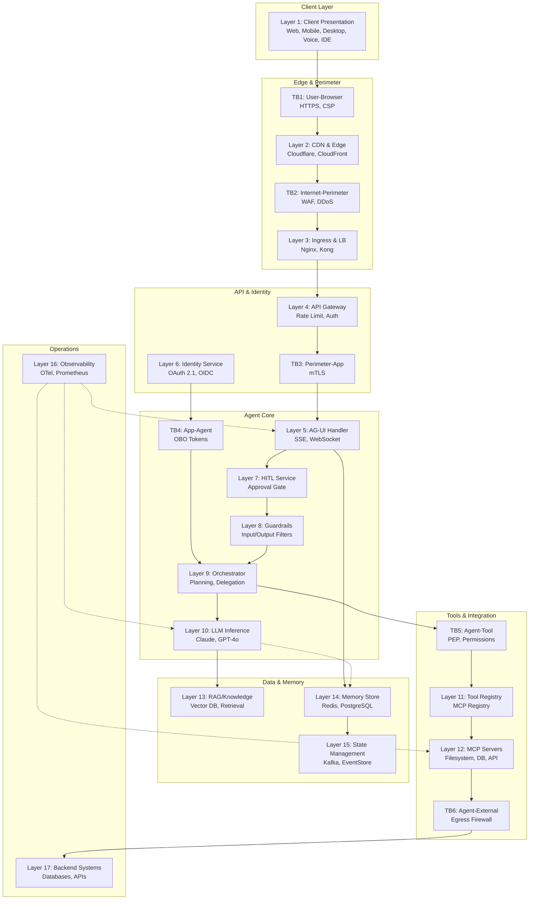
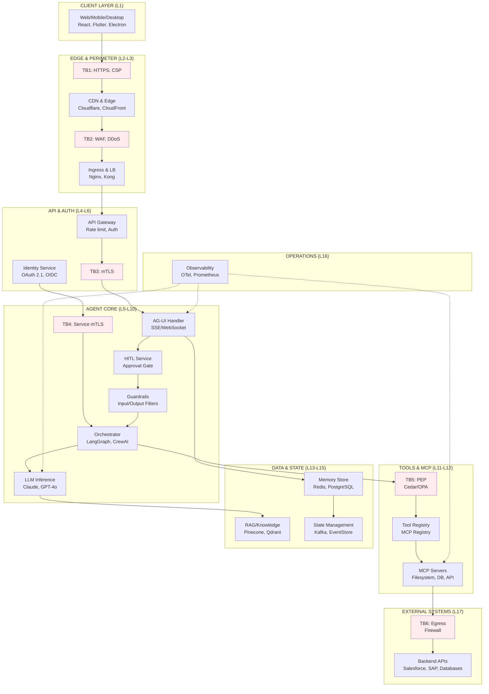

# Enterprise Reference Architecture

Principal AI Architects and AI Platform Leads will find here the authoritative 17-layer enterprise reference architecture for agentic UI systems — including trust boundary mapping, a full technology selection table, a step-by-step request journey, and production deployment topologies (Kubernetes, multi-region, and edge variants) as of July 2026.

:::info Architecture Scope
    This reference architecture covers the complete stack for an AG-UI–compliant agentic application: from the browser client through the AG-UI transport layer, agent orchestration, LLM inference, tool execution, MCP server cluster, RAG retrieval, memory, state management, observability, and backend integration. Trust boundaries TB1–TB8 are called out explicitly at each layer boundary. The Kubernetes deployment topology maps each layer to a namespace, service, and ingress configuration.

---

## Architecture Diagram



---

## 1. Architecture Overview

**17-Layer Enterprise Agentic UI Architecture (July 2026)**



**Additional Trust Boundaries:**
- **TB7** (Agent ↔ Agent): Signed Agent Cards, scoped delegation tokens
- **TB8** (Human Approval Gate): HITL pause/approve/reject, SLA enforcement

---

## 2. Layer Detail: Components, Responsibilities, and Anti-Patterns

### Layer 1 — Client Presentation

**Primary responsibility:** Render the AG-UI event stream as progressive UI. Display streaming text, tool call notifications, generative UI components, and HITL approval dialogs. Manage optimistic state updates via `STATE_DELTA`.

**Key frameworks:** CopilotKit (`@copilotkit/react-ui`, `@copilotkit/react-core`), custom React hooks consuming SSE streams, Vue/Angular equivalents, React Native for mobile.

**Anti-patterns:**

- Rendering agent tool call arguments as HTML without sanitization (XSS via tool output)
- Displaying raw `STATE_SNAPSHOT` values in DOM without escaping
- Blocking the UI thread during SSE stream parsing (use a Web Worker)
- Polling `/agent/status` instead of consuming the SSE stream
- Embedding agent tokens or API keys in frontend bundle

### Layer 2 — CDN & Edge

**Primary responsibility:** TLS termination, DDoS mitigation, WAF rule enforcement, static asset delivery. SSE streams must bypass caching — ensure `Cache-Control: no-cache` propagates through the CDN.

**Anti-patterns:**

- Caching SSE responses (breaks streaming; silently delivers stale snapshots)
- Terminating TLS at the CDN without re-encrypting to origin (breaks mTLS assumptions)
- Missing WAF rules for prompt injection in request bodies

### Layer 3 — Ingress & Load Balancing

**Primary responsibility:** Route HTTP requests to appropriate services. Maintain connection affinity for SSE streams (a client must reconnect to the same backend pod to resume a stream, unless state is stored in Redis).

**Anti-patterns:**

- Round-robin load balancing for SSE streams without sticky sessions (stream disconnect on every LB rotation)
- Missing connection timeout tuning for long-lived SSE connections (default 60s timeout kills multi-minute agent runs)

### Layer 4 — API Gateway

**Primary responsibility:** Rate limiting (per user, per model, per token), API key / JWT validation, request routing by path, AG-UI action type routing, token budget enforcement.

**Recommended:** Kong AI Gateway (native token metering), AWS API Gateway (managed), Azure API Management (enterprise APIM policies).

**Anti-patterns:**

- No per-user token budget cap (unbounded LLM cost exposure)
- Sharing API keys across tenants (no isolation for multi-tenant deployments)
- Allowing unauthenticated access to `/agent/run` in staging environments that share production data

### Layer 5 — AG-UI Protocol Handler

**Primary responsibility:** Accept `POST /agent/run` with `{messages, state, context}`, emit the SSE event stream, accept `POST /agent/action` for HITL interactions. Manage stream lifecycle and reconnection.

**Anti-patterns:**

- Returning raw LLM provider errors in the SSE stream (information leakage)
- Not validating the `Content-Type: text/event-stream` Accept header before streaming
- Missing `retry:` directive in SSE response (client cannot reconnect)
- Not correlating `RUN_STARTED.run_id` through to all downstream spans

### Layer 6 — Identity & Token Service

**Primary responsibility:** Issue agent identity tokens, manage OBO delegation chains, validate OIDC tokens from clients, enforce MCP Resource Indicators (RFC 8707) token binding.

**Anti-patterns:**

- Long-lived static agent credentials (violates least-privilege; not rotatable)
- Cloning the human user's full identity onto the agent (excess privilege)
- Missing RFC 8707 resource binding (token replayable against unintended MCP server)

### Layer 7 — HITL Service

**Primary responsibility:** Implement the pause/approve/edit/retry/escalate state machine. Maintain timeout SLAs. Emit audit events on every human decision. Route notifications via email/Slack/Teams.

**Anti-patterns:**

- Auto-approving on timeout instead of blocking (security regression under load)
- No audit trail for approval decisions (compliance failure)
- HITL bypass via direct tool invocation endpoint (architecture flaw: tool endpoint must require agent context, not be independently callable)

### Layer 8 — AI Guardrails

**Primary responsibility:** Input validation (detect prompt injection, jailbreaks, PII in user input), output filtering (toxicity, PII in agent responses, off-topic content), structured output validation.

**Anti-patterns:**

- Only applying guardrails on user input, not on tool call results flowing back into the context (tool result injection)
- Using the LLM itself as the sole guardrail evaluator (cannot self-check)
- No latency budget for guardrails (blocking calls add 200–500 ms per turn if synchronous)

### Layer 9 — Agent Orchestrator

**Primary responsibility:** Execute the agent planning loop. Delegate tasks to sub-agents via A2A. Emit AG-UI events at each step. Enforce tool permission manifest.

**Anti-patterns:**

- Allowing sub-agents to acquire credentials from parent agent context without explicit delegation (privilege escalation)
- No planning horizon limit (unbounded loops consuming tokens)
- Sub-agent results treated as trusted input (they may be compromised; apply guardrails on A2A responses)

### Layer 10 — LLM Inference

**Primary responsibility:** Generate text, tool call arguments, and structured output. Route to appropriate model based on task (Haiku for classification, Sonnet for reasoning, Opus for complex planning).

**Anti-patterns:**

- Single model for all tasks (cost inefficiency; 10–100× overpaying for classification tasks)
- No fallback model configured (single-provider outage takes down the agent)
- Sending full conversation history without context management (hitting token limits, excessive cost)

### Layer 11 — Tool Registry & Dispatcher

**Primary responsibility:** Maintain the registry of available tools. Route tool calls to appropriate MCP servers. Enforce `permission_manifest`. Log every tool invocation with correlation ID.

**Anti-patterns:**

- Registry accessible without authentication (tool enumeration by untrusted agents)
- No rate limiting on tool invocations (tool abuse by prompt-injected agents)
- Skipping permission_manifest check under "trusted" internal agent conditions

### Layer 12 — MCP Server Cluster

**Primary responsibility:** Execute tool calls against backend systems. Enforce per-server authorization. Return structured results. OAuth 2.1 + RFC 9728 + RFC 8707 required per server.

**Anti-patterns:**

- Sharing one MCP server connection across all agents (no isolation)
- No connection pooling (connection exhaustion under load)
- Broad filesystem/network access for MCP servers that only need narrow access

### Layer 13 — RAG / Knowledge Retrieval

**Primary responsibility:** Retrieve relevant documents, code snippets, or structured data to inject into agent context. Apply access-control filtering (users can only retrieve documents they can access).

**Anti-patterns:**

- No per-user access filtering on retrieval results (all users retrieve all documents)
- Injecting retrieved content without source attribution (hallucination debugging impossible)
- No retrieval quality gate (injecting low-relevance chunks degrades response quality)

### Layer 14 — Memory Store

**Primary responsibility:** Persist and retrieve working memory (session-scoped Redis), episodic memory (conversation history in PostgreSQL), semantic memory (vector DB), procedural memory (skill/tool registry).

**Anti-patterns:**

- Storing sensitive data in working memory without encryption-at-rest
- No TTL on working memory (unbounded memory growth under concurrent users)
- Cross-session memory bleed (one user's episodic memory accessible to another)

### Layer 15 — State Management

**Primary responsibility:** Event-source the AG-UI `STATE_DELTA` stream. Maintain the canonical state store. Replay events for debugging and audit. Support multi-agent shared state.

**Anti-patterns:**

- Mutable state store without event log (cannot audit what changed, when, and why)
- Not validating JSON Patch RFC 6902 before application (malformed deltas corrupt state)
- No conflict resolution for concurrent agent state writes (multi-agent shared workspace)

### Layer 16 — Observability & Audit

**Primary responsibility:** Emit OpenTelemetry spans for every AG-UI event, tool call, model invocation, and HITL decision. Persist an immutable audit log. Feed into SIEM for anomaly detection.

**Anti-patterns:**

- Sampling traces in production without keeping 100% of HITL and tool call spans (compliance gap)
- Logging raw LLM prompts without PII redaction
- No latency SLO defined for agent runs (cannot distinguish slow from broken)

### Layer 17 — Backend Systems & External APIs

**Primary responsibility:** Expose data and actions to the agent stack. Enforce their own authorization independent of the agent layer (defense in depth). Never trust that the calling agent has already authorized the action.

**Anti-patterns:**

- Backend APIs trusting `X-Agent-Authorized: true` header (trivially forgeable)
- Allowing broad SQL queries from MCP servers (SQL injection via tool arguments)
- No per-agent rate limiting at the backend (one rogue agent can DoS the backend)

---

## 3. Trust Boundary Map (TB1–TB8)

```text
TRUST BOUNDARY REFERENCE — TB1 through TB8

TB1  User ↔ Browser
     What crosses: User input, rendered HTML, JavaScript
     Attack surface: XSS via rendered agent output, clickjacking, credential theft
     Controls: CSP headers, Subresource Integrity, HTTPS-only, iframe sandbox

TB2  Browser ↔ CDN/Perimeter
     What crosses: HTTPS requests, SSE stream
     Attack surface: DDoS, WAF bypass, prompt injection in HTTP body
     Controls: WAF rules, rate limiting, TLS 1.3 minimum, DDoS mitigation

TB3  CDN/Perimeter ↔ Application Services
     What crosses: Authenticated API requests, SSE streams
     Attack surface: API key theft, JWT forgery, SSRF
     Controls: mTLS, API key rotation, JWT validation, IP allowlisting

TB4  Application ↔ Agent Service
     What crosses: Agent context (messages, state, tool results), identity tokens
     Attack surface: Context injection, privilege escalation, identity spoofing
     Controls: Service mesh mTLS, OBO token scoping, input sanitization

TB5  Agent ↔ Tool/MCP
     What crosses: Tool call arguments, tool results
     Attack surface: Tool argument injection, confused deputy, permission escalation
     Controls: Policy Enforcement Point (Cedar/OPA), permission_manifest, tool arg validation

TB6  Agent Stack ↔ External Systems
     What crosses: Outbound API calls, database queries
     Attack surface: SSRF, data exfiltration, external prompt injection
     Controls: Egress firewall, allowlisted endpoints, short-lived scoped credentials

TB7  Agent ↔ Agent (A2A)
     What crosses: Task delegations, tool call forwards, state shares
     Attack surface: Rogue agent impersonation, task hijacking, cascading failure
     Controls: Signed Agent Cards, scoped delegation tokens, A2A message integrity

TB8  Human Approval Gate (HITL)
     What crosses: Approval decisions, edits, escalations
     Attack surface: Social engineering of approver, approval fatigue, bypass via timeout
     Controls: Audit trail, SLA with block-on-timeout default, approver identity verified
```

| TB | Boundary | Primary Controls | OWASP ASI Mapping |
| --- | --- | --- | --- |
| TB1 | User ↔ Browser | CSP, HTTPS, SRI | ASI10 (Human-Agent Trust) |
| TB2 | Browser ↔ Perimeter | WAF, DDoS, rate limit | ASI02 (Tool Misuse via crafted inputs) |
| TB3 | Perimeter ↔ App | mTLS, JWT validation | ASI03 (Identity & Privilege Abuse) |
| TB4 | App ↔ Agent | OBO tokens, mesh mTLS | ASI03, ASI07 (Inter-Agent Communication) |
| TB5 | Agent ↔ Tool | Cedar/OPA PEP, permission manifest | ASI02, ASI03 |
| TB6 | Agent ↔ External | Egress firewall, scoped creds | ASI04 (Supply Chain), ASI05 (Code Exec) |
| TB7 | Agent ↔ Agent | Signed Agent Cards, delegation | ASI07, ASI10 |
| TB8 | Human Approval | Audit trail, block-on-timeout | ASI09 (Human-Agent Trust) |

---

## 4. Technology Mapping Table (17 Layers)

| Layer | OSS / Community | Cloud-Native (AWS) | Cloud-Native (Azure) | Cloud-Native (GCP) | Enterprise Commercial |
| --- | --- | --- | --- | --- | --- |
| 1 — Client | CopilotKit, React, Vue, Angular | - | - | - | Microsoft Teams AI, Salesforce Einstein |
| 2 — CDN/Edge | Cloudflare (free tier) | CloudFront + Shield | Azure Front Door | Cloud CDN | Akamai, Fastly |
| 3 — Ingress | Nginx, Traefik, HAProxy | ALB, NLB | Application Gateway | Cloud Load Balancing | F5 BIG-IP |
| 4 — API Gateway | Kong (OSS), Tyk | AWS API Gateway | Azure API Management | Apigee | Kong Enterprise |
| 5 — AG-UI Handler | CopilotKit Runtime, FastAPI | Lambda (Streaming) | Azure Container Apps | Cloud Run | - |
| 6 — Identity | Keycloak, Authentik | Cognito + IAM | Entra ID + MSAL | Firebase Auth + IAP | Okta, Ping Identity |
| 7 — HITL | Custom (LangGraph interrupt) | Step Functions | Logic Apps | Workflows | Camunda, ServiceNow |
| 8 — Guardrails | LLM Guard, Presidio | Bedrock Guardrails | Azure AI Content Safety | Vertex Model Armor | Guardrails AI |
| 9 — Orchestrator | LangGraph, CrewAI, Mastra | Bedrock AgentCore | Agent Framework 1.0 | Google ADK | Microsoft Copilot Studio |
| 10 — LLM | Ollama, vLLM (on-prem) | Bedrock (Claude/Titan) | Azure OpenAI | Vertex AI (Gemini) | Anthropic API direct |
| 11 — Tool Registry | MCP Registry (OSS) | Bedrock Agent Actions | - | - | CopilotKit Cloud |
| 12 — MCP Servers | mcp-filesystem, mcp-postgres | MCP on Lambda | MCP on Container Apps | MCP on Cloud Run | Custom enterprise MCP |
| 13 — RAG | LlamaIndex, LangChain | Kendra, Bedrock KB | Azure AI Search | Vertex AI Search | Pinecone, Weaviate |
| 14 — Memory | Redis (OSS), Chroma | ElastiCache, MemoryDB | Azure Cache for Redis | Memorystore | Zep, Mem0 |
| 15 — State | EventStoreDB, Apache Kafka | Kinesis, DynamoDB Streams | Event Hubs | Pub/Sub | Confluent |
| 16 — Observability | OpenTelemetry, Prometheus, Grafana | CloudWatch, X-Ray | Azure Monitor | Cloud Trace | Datadog, Dynatrace |
| 17 — Backend | PostgreSQL, MySQL, MongoDB | RDS, DynamoDB, S3 | Azure SQL, Cosmos DB | Cloud SQL, BigQuery | SAP, Salesforce, ServiceNow |

---

## 5. Request Journey — Step-by-Step Trace

The following traces a single user-initiated agent request from browser to backend and back, through all 17 layers.

```text
REQUEST JOURNEY — "Analyze last quarter's revenue by region and draft a summary"

STEP 1  User types message in browser (Layer 1)
        CopilotKit useCopilotAction() captures input
        Client state: messages = [..., {role: "user", content: "Analyze..."}]

STEP 2  Client sends POST /agent/run (Layer 1 → TB1 → CDN → TB2 → ALB → TB3 → API GW)
        Headers: Authorization: Bearer <user-OIDC-token>
        Body: {messages: [...], state: {userId, sessionId}, context: {}}
        API Gateway (Layer 4): validates JWT, checks rate limit (OK), routes to AG-UI handler

STEP 3  AG-UI handler authenticates and initializes run (Layer 5)
        Validates Bearer token → Identity Service (Layer 6)
        Identity Service: exchanges user OIDC token for scoped agent OBO token
        Emits SSE: data: {"type":"RUN_STARTED","run_id":"run_9f3a","thread_id":"t_82b"}

STEP 4  HITL service evaluates run policy (Layer 7)
        Rule: revenue data access → no automatic approval required for read operations
        Approval gate: skipped (read-only task)

STEP 5  Guardrails: input scan (Layer 8)
        Input classifier: no prompt injection detected
        PII scan: no PII in query → pass
        Emits: no blocking event

STEP 6  Agent Orchestrator receives request (Layer 9)
        LangGraph planner decomposes task into steps:
          Step A: retrieve revenue data (tool: analytics.query_revenue)
          Step B: draft summary (tool: llm.generate — internal)
        Emits SSE: data: {"type":"STEP_STARTED","step_name":"Retrieve Revenue Data"}

STEP 7  LLM generates tool call (Layer 10)
        Model: Claude Sonnet (cost/quality balance for structured data + text)
        Output: {"tool_call_id":"tc_1","name":"analytics.query_revenue","args":{"period":"Q4 2025","groupby":"region"}}
        Emits SSE: data: {"type":"TOOL_CALL_START","tool_call_id":"tc_1","tool_name":"analytics.query_revenue"}
        Emits SSE: data: {"type":"TOOL_CALL_ARGS","tool_call_id":"tc_1","delta":"{\"period\":\"Q4 2025\"..."}

STEP 8  Tool Registry validates and dispatches (Layer 11)
        Lookup: analytics.query_revenue → analytics-mcp-server
        Permission check (Cedar): agent identity has permission analytics:read — ALLOW
        Dispatches to analytics MCP server

STEP 9  MCP Server executes query (Layer 12 → TB5 → TB6 → Layer 17)
        Authenticates to data warehouse with scoped OBO token (RFC 8707 bound)
        Executes parameterized query: SELECT region, SUM(revenue) FROM sales WHERE quarter='Q4 2025' GROUP BY region
        Returns: {rows: [{region: "APAC", revenue: 12400000}, ...]}
        Emits SSE: data: {"type":"TOOL_CALL_RESULT","tool_call_id":"tc_1","result":{...}}

STEP 10 Guardrails: output scan (Layer 8)
        PII scan on tool result: no PII detected → pass
        Sensitivity check: revenue data flagged as CONFIDENTIAL → mark for audit

STEP 11 LLM generates text response (Layer 10)
        Context now includes tool result
        Generates streaming summary text
        Emits SSE: data: {"type":"TEXT_MESSAGE_START","message_id":"msg_3"}
        Emits SSE: data: {"type":"TEXT_MESSAGE_CONTENT","message_id":"msg_3","delta":"In Q4 2025..."} × N

STEP 12 State update (Layer 15)
        Agent emits: data: {"type":"STATE_DELTA","delta":[{"op":"add","path":"/task/status","value":"complete"}]}
        Client applies JSON Patch → UI updates task status indicator

STEP 13 Observability (Layer 16, running throughout)
        OTel spans emitted: run_started, tool_call, mcp_execution, llm_inference, run_finished
        All spans correlated by run_id and thread_id
        Audit log entry: {run_id, user_id, tool_calls: ["analytics.query_revenue"], data_sensitivity: "CONFIDENTIAL"}

STEP 14 Run completes
        Emits SSE: data: {"type":"STEP_FINISHED","step_name":"Draft Summary"}
        Emits SSE: data: {"type":"RUN_FINISHED","run_id":"run_9f3a"}
        Client: SSE stream ends, UI transitions from "thinking" to complete state

TOTAL LATENCY BUDGET (reference targets)
  Auth validation:      ~30ms (cached JWT)
  Guardrails (input):   ~50ms (async, parallel with orchestrator init)
  LLM tool call gen:    ~400ms (Claude Sonnet, fast tool calling)
  MCP tool execution:   ~200ms (query + network)
  Guardrails (output):  ~50ms (async, parallel)
  LLM text generation:  ~800ms to first token, streaming thereafter
  Total to first token: ~1.5s
```

---

## 6. Kubernetes Reference Deployment

```yaml
# AGENTIC UI KUBERNETES TOPOLOGY — Reference Namespaces

# Namespace: agui-edge
# Ingress Controller + API Gateway
---
apiVersion: v1
kind: Namespace
metadata:
  name: agui-edge

# Namespace: agui-core
# AG-UI Handler, HITL Service, Guardrails, Orchestrator
---
apiVersion: v1
kind: Namespace
metadata:
  name: agui-core

# Namespace: agui-inference
# LLM proxy, model routing, token budget management
---
apiVersion: v1
kind: Namespace
metadata:
  name: agui-inference

# Namespace: agui-tools
# Tool Registry, MCP Server cluster
---
apiVersion: v1
kind: Namespace
metadata:
  name: agui-tools

# Namespace: agui-data
# Memory store (Redis), State (Kafka/EventStore), RAG (vector DB)
---
apiVersion: v1
kind: Namespace
metadata:
  name: agui-data

# Namespace: agui-observability
# OTel Collector, Prometheus, Grafana, Jaeger
---
apiVersion: v1
kind: Namespace
metadata:
  name: agui-observability
```

```text
KUBERNETES SERVICE MAP

agui-edge namespace:
  kong-gateway          (Deployment, 3 replicas)
  nginx-ingress         (DaemonSet)
  cert-manager          (ClusterIssuer for TLS)

agui-core namespace:
  agui-handler          (Deployment, HPA: 2–20 replicas, CPU 70%)
  hitl-service          (Deployment, 2 replicas — stateful, needs Redis)
  guardrails-service    (Deployment, 3 replicas — async, P99 < 100ms)
  agent-orchestrator    (Deployment, HPA: 2–10 replicas, memory-bound)

agui-inference namespace:
  llm-proxy             (Deployment, 2 replicas — thin proxy, handles model routing)
  token-budget-svc      (Deployment, 2 replicas — Redis-backed per-user counters)

agui-tools namespace:
  tool-registry         (Deployment, 2 replicas — read-heavy, cache aggressively)
  mcp-filesystem        (Deployment, 2 replicas — namespace-isolated, ReadOnlyMany PVC)
  mcp-database          (Deployment, 2 replicas — connection pool to backend DBs)
  mcp-api               (Deployment, 2 replicas — outbound calls to external APIs)

agui-data namespace:
  redis-cluster         (StatefulSet, 6 nodes — primary data store for memory + state)
  kafka                 (StatefulSet, 3 brokers — event log for STATE_DELTA)
  qdrant                (StatefulSet, 3 replicas — vector DB for semantic memory + RAG)
  postgres              (StatefulSet, 1 primary + 2 read replicas — episodic memory)

agui-observability namespace:
  otel-collector        (DaemonSet — collects from all nodes)
  prometheus            (StatefulSet, 2 replicas)
  grafana               (Deployment, 1 replica + PVC for dashboards)
  jaeger-collector      (Deployment, 2 replicas)

NETWORK POLICIES (key rules)
  agui-core → agui-inference: ALLOW (tool call routing)
  agui-core → agui-tools:     ALLOW (tool dispatch)
  agui-core → agui-data:      ALLOW (memory/state read-write)
  agui-tools → agui-data:     ALLOW (tool result caching)
  agui-* → agui-observability: ALLOW egress port 4317 (OTel GRPC)
  agui-tools → internet:       DENY (default) — allowlisted egress only
  agui-inference → internet:   ALLOW to [api.anthropic.com, api.openai.com, ...] ONLY

SERVICE MESH: Istio
  mTLS: STRICT mode for all pod-to-pod communication in agui-core + agui-tools
  Authorization policies: namespace-scoped, deny-by-default
  Traffic management: circuit breaking on mcp-* services (5xx > 20% → open)
```

---

## 7. Multi-Region Architecture Variant

For enterprise deployments requiring < 100ms latency globally or HA across cloud region failures:

```text
MULTI-REGION TOPOLOGY — Active/Active


  GLOBAL LAYER (Cloudflare / Azure Front Door / AWS Route 53)       
  GeoDNS routing · Anycast IP · Health check failover (< 30s)       

                                            
          ▼   ▼
            REGION A (US-East)    REGION B (EU-West) 
            Primary (Active)      Primary (Active)   
                 
            agui-edge             agui-edge          
            agui-core             agui-core          
            agui-inference        agui-inference     
            agui-tools            agui-tools         
            agui-data (local)     agui-data (local)  
             
                                              
          ▼▼
            GLOBAL DATA LAYER                            
            CockroachDB / Spanner (episodic memory)     
            Redis Global (via Upstash or ElastiCache GR)
            Kafka MirrorMaker (event log replication)   
          

DESIGN DECISIONS
  State: agent session is region-pinned via sticky routing on run_id
         If region fails, client reconnects → new region replays from Kafka log
  Memory: episodic memory syncs globally (CockroachDB multi-region tables)
           working memory is local-region only (Redis, TTL 30 min)
  LLM: each region routes to nearest Anthropic/OpenAI regional endpoint
  MCP: mcp-api servers in each region call local SaaS endpoints where available
  Compliance: EU data stays in EU region (GDPR) via route-based data residency
```

---

## 8. Edge Deployment Variant

For latency-sensitive, bandwidth-constrained, or air-gapped deployments:

```text
EDGE TOPOLOGY


  EDGE NODE (factory floor / hospital / retail store / branch)   
  Hardware: 8-core CPU, 32GB RAM, GPU optional                  
                                                                 
  Layer 1: Thin Web Client (local React app or Electron shell)  
  Layer 5: AG-UI Handler (lightweight FastAPI, no cloud dep)    
  Layer 9: Orchestrator (CrewAI or LangGraph, local Python)     
  Layer 10: LLM (Ollama: Llama 3.1 8B or Phi-3 Mini)           
  Layer 11: Tool Registry (local file-based registry)           
  Layer 12: MCP Servers (local: filesystem, local DB, sensors)  
  Layer 14: Memory (local Redis or SQLite)                      
  Layer 16: Observability (OTel Agent → central collector)      

                                Periodic sync (when connected)
                                Episodic memory upload
                                Audit log export
                                Model update pull
                               ▼
                        CENTRAL CLOUD
                        (Layers 2–4, 6–8, 15 state replay, 17)

EDGE DESIGN CONSTRAINTS
  No cloud dependency for core agent operations
  LLM: quantized 4-bit model (GGUF) fits in 8GB RAM without GPU
  Guardrails: rule-based only (no heavy classifier — latency budget is tight)
  State: local EventStore, syncs to Kafka on reconnect
  Security: local mTLS between edge services; air-gap means no OAuth discovery
            pre-provisioned certificates, local Keycloak instance
```

---

## 9. Anti-Pattern Catalog Summary

The 51+ anti-patterns documented in §2 per layer fall into six families:

| Family | Count | Example Pattern | Impact |
| --- | --- | --- | --- |
| **Authentication bypass** | 9 | Trusting `X-Agent-Authorized` header from agent call | Complete authorization bypass |
| **Context leakage** | 11 | Returning raw LLM prompts in error responses | System prompt / credential exposure |
| **Streaming misconfigurations** | 7 | CDN caching SSE stream | Silent state delivery failure |
| **Identity design errors** | 8 | Cloning human user identity onto agent | Excess privilege, audit confusion |
| **State management failures** | 9 | Mutable state without event log | Cannot audit, cannot replay, cannot debug |
| **Resource exhaustion** | 7 | No per-user token budget cap | Unbounded LLM cost; one user takes system down |

---

## Related Pages

- [AGUI Standards & Ecosystem Landscape](agui-standards-landscape.md) — AG-UI event taxonomy, A2UI, protocol comparison
- [Identity & Auth Architecture](identity-auth-architecture.md) — OBO delegation, RFC 8707, Entra Agent ID
- [Security Architecture](security-architecture.md) — TB1–TB8 attack surfaces, OWASP ASI mapping
- [Observability](observability.md) — OTel spans, AG-UI audit schema
- [Evolution of Human-AI Interfaces](evolution-human-ai-interfaces.md) — Why this architecture exists
