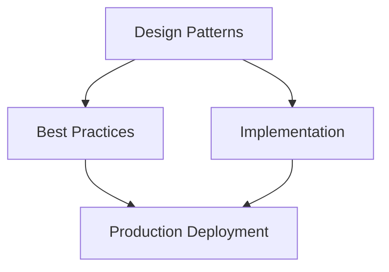

# Governance for Agentic Applications


Technical blueprint for agentic systems.

**Audience:** Enterprise Architects, Principal AI Architects, AI Platform Teams, and AI Governance Leads who must design, operate, and audit the governance structures for production agentic UIs and applications — covering decision rights, ownership, processes, and maturity progression across all 16 governance domains.

:::note Scope Boundary
    This file covers governance **structures, processes, and decision rights**. Compliance requirements (EU AI Act obligations, NIST AI RMF, ISO 42001 conformity assessment) are covered in [responsible-ai.md](17-responsible-ai.md). Regulatory framework details are in [Enterprise AI Governance & Compliance](../../architecture/51-enterprise-ai-governance-compliance.md).

---

## Architecture Overview




## 1. Governance Architecture Overview

### 1.1 Why Traditional IT Governance Fails for Agentic Systems

Traditional IT governance was designed for deterministic systems: a change request produces a known output, a code deployment is testable before release, a database query returns predictable results. Agentic systems break every one of these assumptions.

| Governance Challenge | Traditional IT Systems | Agentic AI Systems |
| --- | --- | --- |
| **Output predictability** | Deterministic for same inputs | Non-deterministic; same prompt may produce different actions |
| **Change boundary** | Code + config is the system | Prompt, model, memory, tools, context, and retrieved data all affect behavior |
| **Testing completeness** | Full coverage achievable | Behavior space is effectively infinite; combinatorial explosion |
| **Actor identity** | Human or service account | Agent acts autonomously, may spawn sub-agents, delegates authority |
| **Audit completeness** | Every action logged by system code | Agent reasoning invisible unless explicitly instrumented |
| **Change velocity** | Quarterly release cycles | Prompt changes can deploy in minutes; model updates out of band |
| **Blast radius** | Bounded to changed component | Agent with financial/data tools can cause cross-system damage in one run |
| **Third-party risk** | Known vendor libraries | LLM provider, MCP tool authors, vector DB operators all affect agent behavior |
| **Regulatory clarity** | Decades of established precedent | EU AI Act, NIST AI RMF, ISO 42001 are all post-2023 and still evolving |
| **Human oversight** | Human approves each action | Agent executes multi-step plans; oversight points must be explicitly designed |

**The three governance gaps that cause agentic failures in practice:**

1. **Gap 1 — Decision rights ambiguity:** When an agent acts autonomously and causes harm, no one owns the decision. Was it the prompt author, the model vendor, the platform team, or the business owner?
2. **Gap 2 — Change velocity without governance:** Prompt changes bypass change management entirely because they "aren't code." An unreviewed system prompt change can alter agent behavior across all users instantly.
3. **Gap 3 — No lifecycle for AI artifacts:** Models, prompts, knowledge bases, and memory stores all have lifecycles that traditional CMDB/ITAM tooling cannot track.

### 1.2 The 16 Governance Domains

Agentic systems require governance across 16 distinct domains. Each domain has a primary owner, a governance body, and a set of processes:

| # | Domain | Primary Owner | Governance Body | Key Process |
| --- | --- | --- | --- | --- |
| 1 | Architecture | Principal AI Architect | Platform Architecture Board (PAB) | ARB review, exception process |
| 2 | Platform | AI Platform Lead | Platform Product Team | SLA management, versioning |
| 3 | Prompt | AI Application Owner | Prompt Review Committee | Prompt versioning, review, deploy |
| 4 | Context | Data Governance Lead | Data Governance Council | Context policy, PII controls |
| 5 | Memory | AI Application Owner + DPO | Privacy Review Board | Retention policy, erasure |
| 6 | Tool | AI Platform Lead | Tool Approval Board | Tool approval, classification |
| 7 | Policy | AI Governance Lead | AI Policy Committee | Policy-as-code lifecycle |
| 8 | Knowledge | Knowledge Owner + DPO | Knowledge Governance Council | Content approval, freshness |
| 9 | Model | AI Platform Lead | Model Review Committee | Model selection, upgrade approval |
| 10 | Agent | AI Application Owner | Agent Registry Team | Agent registration, monitoring |
| 11 | Data | Chief Data Officer | Data Governance Council | Classification, access request |
| 12 | Lifecycle | AI Portfolio Manager | AI CoE | Portfolio review, EOL process |
| 13 | Approval | Business Process Owner | Approval Authority Matrix | Delegated approval, bypass audit |
| 14 | Change | Change Manager | Change Advisory Board (CAB) | Change request, rollback |
| 15 | Compliance | Chief Compliance Officer | Compliance Committee | Evidence collection, audit |
| 16 | Security | CISO | Security Review Board | Threat modeling, pen test |

### 1.3 Governance Operating Model

```text
GOVERNANCE OPERATING MODEL — AGENTIC SYSTEMS

                    +-------------------------------------+
                        AI GOVERNANCE COMMITTEE (Strategic)   
                        CTO, CDO, CISO, CCO, CRO             
                        Meets: quarterly                      
                        Owns: risk appetite, policy           
                      * -------------+----------------------+
                                      charters
              +--------------------+--------------------+
                                                            
   +----------▼-----+   +---------▼-------+  +--------▼--------+
     PLATFORM ARCH.         AI POLICY               COMPLIANCE &       
     BOARD (PAB)            COMMITTEE               RISK COMMITTEE     
     Principal AI           Governance Lead,        CCO, CRO, Legal    
     Architect,             Legal, DPO, Risk        Meets: monthly     
     Tech Leads             Meets: monthly          Owns: audit,       
     Meets: bi-weekly       Owns: policies,         evidence,          
     Owns: arch,            standards,              regulatory         
     standards, ARB         exceptions              reporting          
     * ---------+-----+     * --------+-------+    * -------+--------+
                                                           
                * ----------+-------+                      
                                                          
              +-----------▼----------------------------▼--+
                         AI CENTER OF EXCELLENCE (CoE)        
                  Pattern library · Tooling · Education        
                  Community of practice · Architecture docs    
                  Meets: weekly stand-up, monthly all-hands    
                * -------------------+----------------------+
                                      enables
              +--------------------+----------------------+
                                                               
   +----------▼-----+   +---------▼-------+   +----------▼-----+
     LOB AI TEAMS           AI PLATFORM TEAM         SECURITY &        
     Application            Infrastructure,          COMPLIANCE TEAM   
     owners,                model access,            Threat modeling,   
     developers,            SDK, gateway,            pen testing,      
     prompt authors         observability            audit, DLP        
     * ---------------+     * ----------------+     * ---------------+

OPERATING MODES
  Federated:  LOB teams own their agent governance; CoE sets standards
  Centralized: AI Platform team governs all agents centrally
  Hybrid:     Platform governs infrastructure; LOB governs applications (recommended for >500-employee enterprises)
```

**Choose centralized when:** You have fewer than 5 AI applications, a small AI team, or are in the first year of AI adoption. Speed of governance > consistency of application.

**Choose federated when:** You have multiple LOBs with different risk profiles, regulatory domains (banking + insurance + wealth), or geography-specific compliance requirements.

**Choose hybrid when:** You have a maturing AI program (>10 applications), need to scale AI development without bottlenecking on central team, and want consistent platform governance with distributed application governance.

### 1.4 RACI Framework for Agentic Governance

| Domain | AI Gov Committee | PAB | AI CoE | AI Platform Team | LOB AI Team | DPO | CISO | CCO | CAB |
| --- | --- | --- | --- | --- | --- | --- | --- | --- | --- |
| **Architecture** | A | R | C | C | I | I | C | I | I |
| **Platform** | I | A | C | R | C | I | C | I | I |
| **Prompt** | I | C | C | I | R | C | I | I | A |
| **Context** | I | C | C | C | R | A | C | I | I |
| **Memory** | I | I | C | C | R | A | C | C | I |
| **Tool** | I | A | C | R | C | I | C | I | C |
| **Policy** | A | C | C | I | I | C | C | R | I |
| **Knowledge** | I | I | C | I | R | A | I | C | I |
| **Model** | A | R | C | C | I | I | C | I | I |
| **Agent** | I | C | C | C | R | I | C | I | A |
| **Data** | I | C | C | C | R | A | C | C | I |
| **Lifecycle** | A | C | R | C | C | I | I | I | I |
| **Approval** | A | I | I | I | R | I | I | C | I |
| **Change** | I | C | I | C | R | I | C | I | A |
| **Compliance** | A | C | C | I | C | C | C | R | I |
| **Security** | A | C | C | C | C | I | R | C | C |

*R = Responsible, A = Accountable, C = Consulted, I = Informed*

---

## 2. Architecture Governance

### 2.1 Platform Architecture Board (PAB) Structure

The PAB is the highest architectural authority for agentic system design. It evaluates and approves reference architectures, sets technology standards, adjudicates exceptions, and manages the technology radar.

| PAB Role | Member | Meeting Cadence | Voting Rights |
| --- | --- | --- | --- |
| **Chair** | Principal AI Architect | Every meeting | Yes |
| **Platform Lead** | AI Platform Engineering Lead | Every meeting | Yes |
| **Security Architect** | AI-focused Security Architect | Every meeting | Yes |
| **Data Architect** | Chief Data Architect | Every meeting | Yes |
| **Application Architect** | Senior Application Architect (rotating) | Every meeting | Yes |
| **LOB Representative** | Senior developer from highest-volume LOB (rotating) | Every meeting | Advisory |
| **Compliance** | AI Compliance Lead | As needed | Advisory |
| **CoE Lead** | AI CoE Director | Every meeting | Advisory |

**PAB Operating Rules:**

- Decisions require quorum of 4 voting members
- Disputed decisions escalate to AI Governance Committee within 5 business days
- All decisions recorded in Architecture Decision Record (ADR) format
- ADRs published to team wiki within 48 hours of decision
- Emergency decisions (within 24 hours) require CTO approval + post-hoc PAB ratification within 2 weeks

### 2.2 Architecture Review Board (ARB) for Agentic Systems

The ARB reviews individual agentic applications before production deployment. Review thresholds:

| Application Type | Review Required | Reviewers | SLA |
| --- | --- | --- | --- |
| **New agentic application (any tier)** | Full ARB review | PAB quorum + CISO | 10 business days |
| **New tool integration (financial/external/execute-class)** | ARB review | Platform Lead + Security | 5 business days |
| **New MCP server integration** | Light-touch review | Platform Lead | 3 business days |
| **Prompt change (system prompt)** | Prompt Review Committee | App Owner + CoE | 2 business days |
| **Model upgrade (same provider)** | Model Review Committee | Platform Lead | 2 business days |
| **Model change (new provider)** | Full ARB review | PAB quorum | 5 business days |
| **Major knowledge base update (>10% content change)** | Knowledge Governance | Knowledge Owner + DPO | 3 business days |
| **New agent deployment** | Agent Registry | App Owner + Platform | 1 business day |

**ARB Review Checklist for Agentic Applications:**

- [ ] Architecture diagram with all trust boundaries labeled
- [ ] Data flow diagram showing PII and classified data paths
- [ ] Tool capability matrix (tool name, capability class, auth mechanism, rate limits)
- [ ] Prompt classification (sensitivity level, topics handled, escalation paths)
- [ ] Human oversight model (HITL / HOTL / HOOL — documented and justified)
- [ ] EU AI Act risk tier classification (with justification)
- [ ] Threat model (STRIDE or PASTA)
- [ ] Authentication and authorization design
- [ ] Audit logging plan (what is logged, retention, access controls)
- [ ] Failure mode analysis (what happens when LLM is unavailable, tool fails, context is poisoned)
- [ ] Cost model (estimated token spend, tool call volume, storage)
- [ ] Observability plan (metrics, traces, alerts)

### 2.3 Technology Radar for Agentic Stack

| Tier | Technology/Pattern | Status | Notes |
| --- | --- | --- | --- |
| **ADOPT** | AG-UI protocol (open standard) | Adopt | Production-ready; CopilotKit reference implementation |
| **ADOPT** | MCP v0.7+ (tool protocol) | Adopt | Production standard for tool connectivity |
| **ADOPT** | OAuth 2.1 + PKCE | Adopt | Mandatory for user-interactive agents |
| **ADOPT** | OTel GenAI semantic conventions | Adopt | Observability standard |
| **ADOPT** | Policy-as-code (OPA/Cedar) | Adopt | Governance automation |
| **TRIAL** | A2UI v0.9 (declarative UI) | Trial | Google experimental; production for Google ADK apps |
| **TRIAL** | A2A v1.x (agent-to-agent) | Trial | Maturing; use for internal agent orchestration |
| **TRIAL** | SPIFFE/SPIRE workload identity | Trial | For containerized agent microservices |
| **TRIAL** | NLWeb (conversational web) | Trial | Microsoft open project; evaluate for knowledge discovery |
| **ASSESS** | Agent Cards (A2A spec) | Assess | Draft spec; assess for cross-org agent federation |
| **ASSESS** | RFC 8693 Token Exchange | Assess | For multi-hop delegation; prototype with Entra |
| **ASSESS** | LLM-native UI generation | Assess | High promise; evaluate A2UI vs. custom approaches |
| **HOLD** | Direct prompt engineering for complex workflows | Hold | Use structured agent frameworks instead |
| **HOLD** | Embedding API keys in agent prompts | Hold | Hard security prohibition |
| **HOLD** | Agentic applications without human oversight gates | Hold | Regulatory risk for high-risk AI applications |

### 2.4 Architecture Exception Process

When a team needs to deviate from the approved reference architecture:

```text
EXCEPTION PROCESS FLOW

Team identifies need to deviate from reference architecture
                
              ▼
  Team submits Exception Request to PAB
  (Form: deviation description, business justification,
   risk assessment, compensating controls, proposed review date)
                
              ▼
  PAB reviews within 5 business days
  (Can fast-track to 2 days with PAB Chair approval)
                
         +----+----+
                      
    APPROVED    REJECTED
                      
         ▼         ▼
  Exception       Team must conform to
  recorded in ADR  reference architecture
  with:            OR submit revised proposal
  - Expiry date
  - Owner
  - Compensating controls
  - Review trigger conditions
           
         ▼
  Exception tracked in Architecture Exception Register
  Reviewed at quarterly PAB
  Expired exceptions trigger automatic conformance review
```

**Exception severity levels:**

| Severity | Criteria | Approval Authority | Max Duration |
| --- | --- | --- | --- |
| **Low** | Minor deviation from style/pattern, no security or compliance impact | PAB Chair only | 12 months |
| **Medium** | Deviation from reference architecture with compensating controls | PAB quorum | 6 months |
| **High** | Deviation from security or compliance requirements | PAB + CISO + CCO | 3 months with monthly review |
| **Critical** | Waiver of core security control or regulatory obligation | AI Governance Committee | 30 days emergency only |

---

## 3. Platform Governance

### 3.1 AI Platform as a Product

The AI Platform team must manage the platform as a product with formal SLAs, versioning, and deprecation policies — not as an informal shared service.

| Platform SLA Category | Target | Measurement | Escalation |
| --- | --- | --- | --- |
| **Agent runtime availability** | 99.9% monthly | Uptime monitoring | P1 alert at 99.5% |
| **API gateway latency (p99)** | &lt; 500ms (excluding LLM) | APM tracing | P2 alert at 800ms |
| **LLM proxy latency overhead** | &lt; 50ms added | APM tracing | P2 alert at 100ms |
| **Tool registry lookup** | &lt; 10ms p99 | APM tracing | P3 alert at 50ms |
| **Memory read latency** | &lt; 20ms p99 | APM tracing | P3 alert at 50ms |
| **Platform deployment lead time** | &lt; 2 hours | CI/CD metrics | P3 if > 4 hours |
| **Security patch deployment** | &lt; 4 hours (critical) | Deployment records | P1 if > 8 hours |
| **Incident response SLA** | P1: 15 min, P2: 1 hr | On-call logs | Executive escalation |

### 3.2 Tenant Governance in Multi-Tenant AI Platforms

| Governance Dimension | Policy | Enforcement Mechanism |
| --- | --- | --- |
| **Tenant isolation** | Complete isolation of context, memory, tools, and audit logs between tenants | Namespace-level isolation in Kubernetes; tenant ID as partition key in all data stores |
| **Resource quotas** | Per-tenant token budgets, tool call limits, concurrent session limits | API gateway rate limiting with tenant-aware policies |
| **Tool access** | Each tenant only sees tools explicitly granted to them | Tool registry ACL with tenant scope |
| **Model access** | Tenants may be restricted to specific models or tiers | Model access policy in AI gateway |
| **Audit access** | Tenant admins can only see their own tenant's audit logs | Row-level security in audit log store |
| **Data residency** | Per-tenant data residency config (EU, US, APAC) | Regional routing rules in AI gateway |
| **Prompt governance** | Platform-wide prohibited topics; tenant-specific restrictions additive | OPA policy evaluation at ingress |
| **Onboarding** | New tenant requires platform team approval and security review | Tenant provisioning checklist |
| **Offboarding** | Tenant data deletion within 30 days of offboarding; cryptographic verification | Offboarding runbook with DPO sign-off |

### 3.3 Platform API Versioning

| Version Policy | Rule |
| --- | --- |
| **Major versions (v1 → v2)** | Breaking changes; 12-month deprecation notice; migration guide published |
| **Minor versions (v1.1 → v1.2)** | Additive changes only; no notice required; backward compatible |
| **Patch versions** | Bug fixes, security patches; no API change; deployed immediately |
| **Deprecation notice** | Email to all tenant primary contacts + in-platform banner |
| **End-of-life** | After deprecation period: 503 for deprecated endpoint with migration URL |
| **Emergency breaks** | Security vulnerability requiring immediate change: 24-hour notice + compensating support |

### 3.4 Resource Quotas and Fair Use Policy

| Resource | Default Quota | Enterprise Tier Quota | Override Process |
| --- | --- | --- | --- |
| **Tokens per day** | 1M input + 500K output | 10M input + 5M output | Quota increase request to Platform Lead |
| **Concurrent agent sessions** | 20 | 200 | Architecture review if > 500 |
| **Tool calls per session** | 50 | 500 | Hard cap; exception requires PAB |
| **Memory entries per user** | 1,000 | 10,000 | Data governance review |
| **Knowledge base size** | 5 GB | 100 GB | Storage cost approval |
| **MCP servers per tenant** | 10 | 100 | Tool approval process |
| **Sub-agents per orchestration** | 5 | 25 | Architecture review |

---

## 4. Prompt Governance

### 4.1 Prompt Versioning

Prompts are first-class software artifacts that require version control, review, and deployment governance. Adopt semantic versioning for prompts:

| Version Change | When | Example | Approval Required |
| --- | --- | --- | --- |
| **Major (X.0.0)** | Fundamental change to agent persona, capability scope, or prohibited behaviors | 1.0.0 → 2.0.0 | Full ARB review |
| **Minor (x.X.0)** | New capability added, new topic handled, new escalation path | 1.3.0 → 1.4.0 | Prompt Review Committee |
| **Patch (x.x.X)** | Wording improvement, clarification, formatting — no behavior change | 1.3.0 → 1.3.1 | App Owner self-approval with peer review |

**Prompt registry requirements:**

- Every system prompt stored in version-controlled prompt registry (e.g., Git with signed commits)
- Each version tagged with: version number, author, reviewer, approval date, production deployment date, change summary
- Rollback capability within 15 minutes to any previous version
- Diff comparison between versions available to reviewers
- Production prompt immutable once deployed (changes require new version)

### 4.2 Prompt Review Process

```text
PROMPT REVIEW WORKFLOW

Prompt Author writes new/modified system prompt
                
              ▼
  Automated checks (&lt; 5 minutes):
    *  Injection pattern scan (known attack signatures)
    *  PII detection (names, account numbers, credentials)
    *  Prohibited topic inclusion check
    *  Persona consistency check vs. AI personality guidelines
    *  Length / token budget validation
                
         +----+----+
      PASS         FAIL → author notified with specific findings
           
         ▼
  Peer review (App team member ≠ author)
    *  Business logic accuracy
    *  Escalation path completeness
    *  Sensitive topic handling
    *  Consistency with previous version
                
         +----+----+
     APPROVED    NEEDS REVISION → back to author
           
         ▼
  Prompt Review Committee sign-off
  (Required for: major/minor version; new sensitive topics;
   financial/medical/legal domains)
                
              ▼
  Staging deployment → automated regression tests
  (Behavioral test suite: does agent still refuse prohibited requests?
   Does it still escalate correctly? Does sentiment/tone match guidelines?)
                
         +----+----+
    TESTS PASS  TESTS FAIL → escalate to author + reviewer
           
         ▼
  Production deployment with automatic audit log entry
```

### 4.3 Prompt Testing Requirements

Before any system prompt reaches production, it must pass:

| Test Category | What is Tested | Minimum Pass Threshold |
| --- | --- | --- |
| **Prohibited content refusal** | Jailbreak attempts, CSAM requests, violence, credential extraction | 100% refusal (zero tolerance) |
| **Sensitive topic handling** | Medical, legal, financial advice — correct escalation | 99% correct escalation |
| **PII handling** | User shares PII — agent handles per privacy policy | 100% compliant handling |
| **Persona consistency** | Agent stays in character across adversarial probing | >95% consistency score |
| **Escalation triggers** | High-risk actions — agent correctly pauses for human approval | 100% escalation (zero tolerance) |
| **Tool call accuracy** | Agent calls correct tool with correct parameters | >95% accuracy on test suite |
| **Adversarial robustness** | Prompt injection attempts via indirect vectors | >98% detection |
| **Regression** | Prior behavior preserved from previous prompt version | >99% behavioral consistency |

### 4.4 Prompt Change Management

| Change Type | Change Advisory Board? | Rollback Plan Required | Communication to Users |
| --- | --- | --- | --- |
| **Major version** | Yes — full CAB review | Yes — tested rollback within 15 min | Yes — advance notice per change comms policy |
| **Minor version** | Yes — abbreviated CAB review | Yes | Yes — if behavior visible to users |
| **Patch version** | No — App Owner authority | Yes — automated | No — unless tone/persona changes |
| **Emergency fix** | Post-hoc notification | Yes — immediate rollback tested before deploy | As needed |

### 4.5 Sensitive Topic Handling Policies

| Topic Category | Policy | Escalation Path |
| --- | --- | --- |
| **Medical advice** | Provide information only; recommend professional consultation; never diagnose | Escalate to human agent if urgency indicators present |
| **Legal advice** | Provide general information only; recommend legal counsel | Always recommend attorney for specific legal situations |
| **Financial advice** | Provide factual information; never recommend specific securities | Escalate to licensed advisor for investment decisions |
| **Mental health crisis** | Follow safe messaging guidelines; provide crisis resources immediately | Auto-escalate to human agent; provide hotline numbers |
| **Child safety** | Zero tolerance; immediate refusal and escalation | Escalate to Trust & Safety team; log for review |
| **Political content** | Neutral factual information only; no opinion generation | No escalation needed unless combined with other risk signals |
| **Competitor information** | Factual public information only | No disparagement; escalate if user seeks competitive intel for attack |

---

## 5. Context Governance

### 5.1 What Data Is Allowed in Agent Context

Context governance defines what data the agent runtime is permitted to include in the context window sent to the LLM provider.

| Data Category | Allowed in Context | Conditions / Controls |
| --- | --- | --- |
| **User's own messages** | Yes | User-provided content only; no injection from other users |
| **User's public profile data** | Yes | First-party data with user consent |
| **User's private profile data** | Conditional | Explicit user consent required; data minimization applied |
| **PII beyond what user provided** | No | Prohibited; DLP check at context assembly |
| **Third-party PII** | No | Prohibited; agent must not receive data about non-consenting individuals |
| **Financial account details** | Conditional | Masked tokens only; never raw account numbers |
| **Internal system data (non-classified)** | Yes | Must match user's authorization scope |
| **Classified / restricted data** | Conditional | Requires explicit data governance approval; audit required |
| **Credentials (API keys, passwords)** | No | Hard prohibition; DLP check at context assembly |
| **Health records (PHI)** | Conditional | HIPAA-compliant handling; BAA with LLM provider required |
| **Legal documents** | Conditional | Privilege review; no privileged communication without attorney review |
| **Competitive intelligence** | Conditional | Approved use cases only; not for general agent context |

### 5.2 PII Policies for Context

The context sent to any LLM provider must be processed through PII controls before transmission:

| PII Type | Treatment in Context | Technical Control |
| --- | --- | --- |
| **Email addresses** | Tokenize or mask | DLP scan at context assembly gateway |
| **Phone numbers** | Tokenize or mask | DLP scan |
| **National ID / SSN** | Always mask | DLP scan + output filter |
| **Financial account numbers** | Always mask | DLP scan + output filter |
| **Health identifiers** | Always mask | DLP scan + output filter |
| **Names (with other PII)** | Conditional masking | Context-sensitive DLP |
| **IP addresses** | Mask last octet | DLP scan |
| **Location data (precise)** | Generalize or omit | DLP scan |
| **Biometric references** | Never include | Hard block at context assembly |

### 5.3 Cross-Tenant Context Isolation

| Isolation Requirement | Implementation | Verification |
| --- | --- | --- |
| **No cross-tenant context bleed** | Tenant ID partition key on all context stores | Automated isolation test suite run nightly |
| **Session isolation within tenant** | Session ID partition key; no shared context between sessions | Session boundary validation at context assembly |
| **No context persistence beyond session** | Default context TTL = session duration; explicit long-term memory requires opt-in | Automated context expiry validation |
| **Audit trail per context assembly** | Every context assembly event logged with: tenant ID, session ID, data sources accessed, PII detection results | Immutable audit log |
| **Cross-tenant escalation isolation** | Human review queues partitioned by tenant | Review queue ACL |

### 5.4 Context Retention and Deletion Policies

| Retention Period | Data Type | Legal Basis | Deletion Mechanism |
| --- | --- | --- | --- |
| **Session duration only** | Default conversational context | Operational necessity | Auto-expire on session close |
| **30 days** | Audit logs for operational debugging | Operational necessity | Automated deletion job |
| **90 days** | Security incident investigation data | Security necessity | Deletion with CISO sign-off |
| **7 years** | Compliance-required audit trails (EU AI Act, financial services) | Legal obligation | Archived; restricted access |
| **User-requested retention** | Long-term memory (explicit opt-in) | Consent | User-controlled deletion via API |
| **Immediate on request** | Any context on GDPR erasure request | GDPR Article 17 | Erasure cascade across all stores |

---

## 6. Memory Governance

### 6.1 Memory Retention Policies by Memory Type

| Memory Type | Description | Default Retention | User Control | Audit |
| --- | --- | --- | --- | --- |
| **Working memory** | In-session conversation context | Session only | None needed | Session log |
| **Episodic memory** | Past interaction summaries | 90 days | View + delete | Access log |
| **Semantic memory** | Learned user preferences, facts | 1 year with renewal | View + edit + delete | Access log |
| **Procedural memory** | Learned workflows, agent skills | Indefinite (versioned) | Not user-controlled | Change log |
| **Long-term personal memory** | Persistent user profile built by agent | User-defined | Full control via Memory API | Full audit |
| **Shared workspace memory** | Multi-user shared context | Project lifetime | Project admin control | Full audit |

### 6.2 User Consent for Long-Term Memory

Long-term memory is subject to consent requirements that vary by jurisdiction and data type:

| Memory Action | Consent Required | Consent Mechanism | Re-consent Trigger |
| --- | --- | --- | --- |
| **Enable long-term memory** | Explicit opt-in | Informed consent UI with clear description | First use; material change to what is stored |
| **Expand memory scope** | New consent | Re-consent notification | Any addition of new data category |
| **Share memory across agent instances** | Explicit consent | Separate consent for each sharing context | Each new sharing context |
| **Use memory for agent training** | Explicit consent | Separate clear consent | Each training cycle |
| **Retain memory beyond default period** | Explicit consent with reason | Consent with clear retention period stated | At renewal date |

### 6.3 Memory Access Controls

| Role | Access Level | Memory Types |
| --- | --- | --- |
| **End User (own memory)** | Read + Delete all own memory | All types for own user ID |
| **Agent (authorized)** | Read only | Types explicitly granted in agent capability scope |
| **Agent (authorized, learning)** | Read + Write | With explicit user consent for learning |
| **Application Admin** | Read own tenant's memory metadata (not content) | Episodic, semantic metadata |
| **Platform Admin** | Read all metadata; delete (GDPR compliance) | All types (emergency + compliance only) |
| **Auditor** | Read audit logs (not content) | Audit logs only |
| **DPO** | Read access for erasure verification | All types for erasure compliance |

### 6.4 Right to Forget — GDPR Erasure Cascade

When a GDPR erasure request is received, the following cascade must be executed within 30 days:

```text
GDPR ERASURE CASCADE

User submits erasure request (via API, UI, or email to DPO)
                
              ▼
  Identity verification (confirm requestor owns the data)
                
              ▼
  Erasure request logged with:
    *  Request ID
    *  Timestamp
    *  Requestor identity
    *  Verified scope (all data / specific data types)
                
              ▼
  +---------------------------------------------------+
     PARALLEL ERASURE JOBS                                
                                                         
     1. Working memory: auto-expired (immediate)          
     2. Episodic memory store: DELETE WHERE user_id=X    
     3. Semantic memory store: DELETE WHERE user_id=X    
     4. Long-term memory store: DELETE WHERE user_id=X   
     5. Vector store (embeddings): DELETE by user scope   
     6. Audit logs: ANONYMIZE (replace PII with token)   
     7. Backup stores: flag for deletion at next cycle    
     8. Derived data: assess and delete if identifiable   
     9. LLM provider data: submit deletion request        
    * --------------------------------------------------+
                
              ▼
  Completion verification across all stores
                
              ▼
  Erasure completion certificate issued to requestor
  (within 30 days of request; 3-month extension with notice
   for complex or high-volume requests)
```

### 6.5 Memory Audit Logs

Every memory operation must be logged:

| Event | Required Log Fields |
| --- | --- |
| **Memory write** | timestamp, user_id, agent_id, session_id, memory_type, data_category, size_bytes, source (user_provided / agent_derived), consent_reference |
| **Memory read** | timestamp, user_id, agent_id, session_id, memory_type, query_summary, records_returned |
| **Memory delete** | timestamp, actor (user / agent / admin / GDPR_cascade), memory_type, records_deleted, trigger_type |
| **Memory share** | timestamp, source_agent, target_agent, user_id, consent_reference, data_categories_shared |
| **Erasure completion** | timestamp, request_id, stores_verified, records_deleted_count, completion_status |

---

