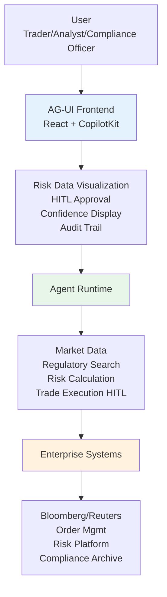

# Industry Reference Architectures for Agentic Applications — Part 1 of 2

Reference architectures for the AGUI/UX layer across 10 industry verticals — focusing on UX design, human oversight models, regulatory constraints, and enterprise system integrations unique to each domain.

**This is Part 1 of 2.** Part 1 covers Financial Services, Healthcare, Insurance, Retail & E-commerce, Manufacturing, and Developer Platforms. See [Part 2: Government, Telecom, Knowledge Management, and Life Sciences](pathname:///archon/agentic-systems/parts/13-industry-reference-architectures-part2) for the remaining 4 verticals and cross-industry patterns.

:::note Backend Platform Coverage
    For backend agent platform architecture (orchestration, memory, A2A, MCP), see [Enterprise Agent Reference Architectures](../../architecture/47-enterprise-agent-reference-architectures.md). This guide focuses on what's different at the UX and AGUI layer per industry.

---

## 1. Financial Services & Banking

### Top Use Cases

| Use Case | Expected Value | HITL Requirement |
| --- | --- | --- |
| Trading desk copilot | 30-40% reduction in research time; faster idea generation | Mandatory for all trade execution |
| Risk analysis assistant | 20-25% faster risk report generation | Required for risk limit breaches |
| Compliance research agent | 50-60% reduction in regulatory research time | Required for regulatory filings |

### Architecture



### UX Considerations

**Confidence and uncertainty display is non-negotiable.** Traders and analysts need to see the basis for every recommendation:

- Confidence score (0-100%) on every price target, risk assessment, or trade recommendation
- Data freshness indicator (market data timestamped to the second)
- Source attribution: every claim links to the underlying data source
- "What could go wrong" toggle: one click reveals bear-case reasoning

**Separation of duties (SOD) enforcement in UX:**

- Agents preparing trade recommendations must be a different agent identity from those authorized to execute
- Approval dialog explicitly shows: who prepared the recommendation vs. who is approving
- Four-eyes principle: approver must be different from the preparer; UX enforces this at the frontend

**Audit trail as a first-class UX element:**

- Every agent action is visible in an always-accessible timeline sidebar
- Actions include: query issued, tools called, data accessed, recommendation generated, approval status
- Timeline is immutable once a trading session closes; exportable for compliance review

### Regulatory Constraints Affecting UX

| Regulation | UX Requirement |
| --- | --- |
| MiFID II (EU) | Best execution evidence for every trade recommendation; agent audit trail required |
| FINRA 4370 | Business continuity — agent fallback mode when primary tools fail |
| GDPR | Personal client data handling disclosure; no PII in LLM context without consent |
| SOX | Complete audit trail for financial decision support; 7-year retention |
| Basel IV | Risk calculation transparency; model explainability for capital calculations |

### Human Oversight Model

- **HITL mandatory:** Trade execution, risk limit overrides, regulatory filing submission, client communication
- **HOTL (human-on-the-loop):** Research summary generation, market data analysis, portfolio monitoring alerts
- **HOOL (human-out-of-the-loop):** Market data ingestion, news summarization, watchlist monitoring

### Key Integrations

Bloomberg B-PIPE (market data), Reuters Elektron (news/data), FIS Horizon (banking core), Finastra (lending), DTCC (settlement), SWIFT (payments), Murex (derivatives), OpenPages (compliance)

---

## 2. Healthcare

### Top Use Cases

| Use Case | Expected Value | HITL Requirement |
| --- | --- | --- |
| Clinical decision support | Reduced diagnostic errors; 15-20% time savings for clinicians | Mandatory for diagnosis and treatment decisions |
| Patient Q&A and education | 30% reduction in call center volume; 24/7 patient access | Advisory only; escalate complex questions to clinician |
| Clinical documentation | 40-50% reduction in documentation time | Clinician reviews and signs every AI-generated note |

### Architecture

```text
Clinician / Patient
  
  
AG-UI Frontend
   HITL approval for every clinical recommendation
   Evidence panel (source guideline, confidence level)
   Differential diagnosis list with probability scores
   FHIR resource viewer (labs, vitals, medications)
   Accessibility: WCAG AA, large tap targets for tablet use
  
  
Agent Runtime
   Patient record retrieval (FHIR R4)
   Clinical knowledge search (UpToDate, PubMed)
   Drug interaction checker
   Documentation generation tools
  
  
EHR Layer (SMART on FHIR)
   Epic MyChart / Hyperspace
   Cerner Millennium
   Allscripts Sunrise
```

### UX Considerations

**Every clinical recommendation requires human confirmation.** The UX never auto-applies a clinical suggestion; it presents recommendations for clinician review and signature. This is not a usability choice — it is a patient safety requirement.

**Evidence and explainability panels are mandatory for clinical trust:**

- Every recommendation shows the supporting clinical guideline with a link to source
- Probability/confidence scores use plain language: "High confidence (92%) based on 3 matching criteria"
- "Why this recommendation" button opens a step-by-step reasoning trace
- Alternative diagnoses or treatments shown with probability comparison

**Documentation assistant UX pattern:**

- Agent generates draft; clinician reviews in split-screen view
- Clinician can accept, modify, or reject each sentence individually
- Changes tracked and signed with clinician's digital signature
- Generated vs. human-written sections clearly distinguished in final record

**Accessibility is not optional:**

- Large touch targets (48x48px minimum) for tablet and stylus use at the bedside
- High contrast mode for clinical environments with varying lighting
- Screen reader support for visually impaired clinicians
- No time-sensitive interactions (clinicians are often multitasking)

### Regulatory Constraints

| Regulation | UX Requirement |
| --- | --- |
| HIPAA (US) | No PHI in LLM context without BAA; minimum necessary standard; audit log of PHI access |
| 21 CFR Part 11 | Electronic signatures on AI-assisted documentation; audit trail |
| FDA SaMD | If agent provides diagnostic suggestions, may require FDA 510(k) clearance |
| EU MDR | Medical device software classification for diagnostic agents |
| GDPR | Patient consent for AI-assisted analysis; right to human review of AI decisions (Art. 22) |

### Key Integrations

Epic SMART on FHIR, Cerner Millennium FHIR API, HL7 FHIR R4 standard, UpToDate (clinical decision support), PubMed/MEDLINE, RxNorm (drug database), SNOMED CT, ICD-10/11

---

## 3. Insurance

### Top Use Cases

| Use Case | Expected Value | HITL Requirement |
| --- | --- | --- |
| Underwriting assistance | 30-40% faster quote generation; improved risk accuracy | Mandatory for large commercial policies |
| Claims triage | 50% reduction in time-to-first-payment for simple claims | Required for coverage denial decisions |
| Fraud detection | 15-20% improvement in fraud detection accuracy | Required before claim denial based on fraud flag |

### Architecture

```text
Underwriter / Claims Adjuster
  
  
AG-UI Frontend
   Risk score dashboard with factor breakdown
   HITL approval for coverage decisions
   Explainability panel (why this risk score)
   Comparable risk/claim history viewer
   Regulatory compliance checklist
  
  
Agent Runtime
   Risk data retrieval (property records, driving history)
   Loss history database lookup
   Fraud indicator analysis
   Policy document generation
  
  
Core Systems
   Guidewire PolicyCenter / ClaimCenter
   Duck Creek Technologies
   Majesco Insurance Suite
```

### UX Considerations

**Explainability is legally required for adverse decisions.** Any coverage denial, premium increase, or claim rejection influenced by AI must be explainable in plain language that a policyholder can understand and challenge:

- Risk factor breakdown: "Your premium is 15% higher than average because: commercial kitchen (40%), older building (35%), prior fire claim (25%)"
- Each factor links to the underwriting guideline that supports it
- "What would change this?" functionality: interactive what-if analysis

**Actuarial confidence display:**

- Loss ratio prediction: point estimate with confidence interval
- Historical comparison: "Similar risks had loss ratios of X–Y"
- Model version and training data vintage shown to actuaries

### Regulatory Constraints

| Regulation | Requirement |
| --- | --- |
| EU GDPR Art. 22 | Right to human review for automated adverse decisions |
| US state insurance regulations | State-specific disclosure requirements for AI-assisted underwriting |
| Fair Housing Act / ECOA (US) | No discriminatory factors in AI-assisted underwriting; bias testing required |
| IAIS (International) | Model explainability and validation requirements for insurance AI |

---

## 4. Retail & E-commerce

### Top Use Cases

| Use Case | Expected Value | HITL Requirement |
| --- | --- | --- |
| Personalized shopping assistant | 15-25% increase in basket size; higher conversion | Not required for recommendations |
| Inventory optimization | 20-30% reduction in stockouts | Required for large purchase commitments |
| Customer service automation | 40-60% reduction in contact center volume | Required only for complex refunds / exceptions |

### Architecture

```text
Shopper / Customer Service Rep
  
  
AG-UI Frontend
   Streaming product recommendations
   Conversational search interface
   Order management actions (self-service)
   Visual product search (multimodal)
  
  
Agent Runtime
   Product catalog search
   Personalization engine
   Order management tools
   Inventory tools
  
  
Commerce Platform
   Shopify / Salesforce Commerce Cloud
   SAP Commerce
   Custom OMS
```

### UX Considerations

**Minimal friction, maximum personalization.** Unlike healthcare or financial services, most retail agent interactions require no human approval. The goal is seamless task completion:

- Recommendations stream instantly without loading state
- Natural language return/exchange processing: "I want to return the blue jacket I ordered last week" → agent finds order, initiates return, streams confirmation
- Multimodal search: user takes a photo of an item they want to find → agent retrieves visually similar products

**Trust indicators for recommendations:**

- "Recommended because you viewed X" — transparent personalization signals
- Social proof integration: "87 people bought this together"
- Agent-generated outfit/bundle suggestions with styling rationale

### Regulatory Constraints

| Regulation | Requirement |
| --- | --- |
| GDPR / CCPA | Consent for personalization; opt-out mechanism prominently accessible |
| PCI DSS | No payment card data in agent context; tokenize all card references |
| Consumer protection laws | No deceptive urgency signals from agents; "only 2 left" must be accurate |
| EU AI Act Art. 50 | Disclosure if agent uses emotion recognition or biometric categorization for personalization |

---

## 5. Manufacturing

### Top Use Cases

| Use Case | Expected Value | HITL Requirement |
| --- | --- | --- |
| Predictive maintenance | 25-35% reduction in unplanned downtime | Required for maintenance decisions on safety-critical equipment |
| Quality control visual inspection | 20-30% improvement in defect detection | Required for final go/no-go decision on production batches |
| Supply chain orchestration | 15-20% reduction in lead times | Required for large purchase orders |

### Architecture

```text
Plant Operator / Maintenance Engineer
  
  
AG-UI Frontend (Ruggedized tablet or large touch screen)
   Large touch targets (48px+ for gloved hands)
   High-contrast display (bright factory environments)
   Voice interface (hands-free operation)
   Alert visualization with priority tiers
   Step-by-step maintenance guide generation
  
  
Agent Runtime
   IoT sensor data retrieval (temperature, vibration, pressure)
   Maintenance history lookup
   Part availability check
   Work order generation tools
  
  
Plant Systems
   SAP S/4HANA PM (Plant Maintenance)
   Siemens MindSphere / PTC ThingWorx (IoT)
   Azure IoT Hub / AWS IoT Core
   ERP / MES integration
```

### UX Considerations

**Factory floor UX is radically different from office UX:**

- Large touch targets (48x48px absolute minimum; 64px+ recommended for gloved operation)
- High contrast (4.5:1 minimum) because screens viewed in bright ambient light or direct sunlight
- Voice interface for hands-free operation at workstations — operator's hands may be occupied
- Auditory alerts (not just visual) for critical equipment alerts
- Offline-capable (plant floor may have spotty connectivity)
- Response time must be &lt; 3 seconds for safety-critical alerts (operator cannot wait)

**OT/IT network separation:**

- AGUI frontend deployed in IT network zone
- IoT data accessed via secure DMZ connector, not direct OT access
- Agent cannot write to OT systems directly; all commands go through IT/OT gateway with human authorization

### Regulatory Constraints

| Regulation | Requirement |
| --- | --- |
| IEC 62443 | Cybersecurity for OT systems; agent access to OT must go through security zones |
| EU Machinery Directive | Safety-critical control systems must have human in the loop |
| ISO 13849 / IEC 62061 | Functional safety requirements for automated systems controlling machinery |
| OSHA (US) | Hazardous operation approvals must be by qualified human |

---

## 6. Developer Platforms

### Top Use Cases

| Use Case | Expected Value | HITL Requirement |
| --- | --- | --- |
| Coding copilot | 30-50% productivity increase (GitHub data); reduced context switching | Not required for code suggestions; required for force-push/delete |
| Code review agent | 20-30% reduction in review cycle time | Developer approves before any automated merge |
| CI/CD agent | 40% reduction in pipeline configuration time | Required for production deployments |

### Architecture

```text
Developer
  
   IDE (VS Code / JetBrains / Neovim)
         Inline code completion and suggestions
  
   Terminal (CLI agent with streaming output)
  
   Web UI (PR review, CI/CD configuration)
  
  
AG-UI / LSP Protocol Layer
   Inline suggestion streaming
   Chat panel (explain, refactor, test generation)
   Terminal agent stream
  
  
Agent Runtime
   Code retrieval (repo, file, symbol search)
   GitHub / GitLab API tools
   CI/CD pipeline tools
   Documentation search
```

### UX Considerations

**IDE-first means zero context switch.** The entire interaction happens inline:

- Code completions appear inline without opening a new panel
- Explain/refactor via right-click context menu or keyboard shortcut
- Terminal agent streams output directly to terminal buffer — looks like a real command

**Developer trust is earned through transparency:**

- Show which files were read for each suggestion
- Diff view before applying any change (agent suggests; developer accepts/modifies/rejects)
- Approval only for destructive or irreversible operations: `git push --force`, `branch delete`, production deploy
- No approval for: code suggestions, search, explanation, test generation

**Terminal agent UX:**

- Commands streamed to a sub-shell with output shown in real time
- `--dry-run` flag by default; developer must explicitly `--execute` to apply
- Full command history in sidebar with ability to replay

### Regulatory Constraints

| Regulation | Requirement |
| --- | --- |
| SOC 2 Type II | Logging of all agent-executed git operations; access control to production repo |
| GDPR | Source code may contain personal data; no unexpected transmission to LLM providers |
| License compliance | Agent must not suggest code that reproduces GPL/copyleft code in proprietary context |

---

## Related Pages

- [Part 2: Government, Telecom, Knowledge Management, and Life Sciences](pathname:///archon/agentic-systems/parts/13-industry-reference-architectures-part2) — Sections 7–10 and cross-industry patterns
- [Security Architecture](19-agentic-ui-security-architecture.md) — Enterprise security controls across industries
- [Agent UX Patterns](01-agent-ux-patterns.md) — Human oversight models (HITL/HOTL/HOOL)
- [Governance](11-governance.md) — Compliance and governance frameworks
- [Enterprise Reference Architecture](08-enterprise-reference-architecture.md) — Backend platform architecture
