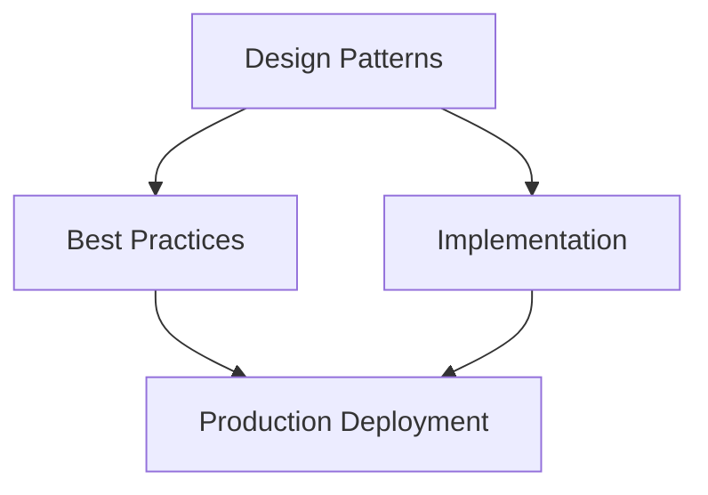

# Observability for Agentic Applications


Technical blueprint for agentic systems.

A reference guide for AI Platform Teams and Enterprise Architects on the full observability stack for agentic systems — from distributed tracing and AG-UI stream telemetry through frontend RUM, LLM cost attribution, safety signal monitoring, and business analytics.

:::note Build on the OTel GenAI foundation
    This guide extends the OpenTelemetry GenAI semantic conventions, the 5-dashboard reference set, and burn rate alerting strategy defined in [Reliability, Observability & Governance](../../architecture/43-agentic-ai-reliability-observability-governance.md). Read that guide first — this file builds the AGUI/streaming/UX telemetry layer on top of that foundation without re-explaining OTel span semantics, semantic conventions, or the dashboard scaffolding already covered there.

---

## Architecture Overview




## 1. The Four-Pillar Observability Model for Agentic Systems

Traditional observability rests on three pillars: traces, metrics, and logs. Agentic systems require a fourth pillar — **evaluation signals** — because semantic correctness is not observable from infrastructure metrics alone. A tool call can return HTTP 200 with hallucinated output; a planning span can complete in 200 ms producing a wrong plan. Without evaluation signals, your observability stack is blind to the failure class that matters most.

### 1.1 Four-Pillar Definitions

| Pillar | What It Captures | Instrumentation Point | Unique Challenge for Agentic |
| -------- | ----------------- | ---------------------- | ------------------------------ |
| **Traces** | Causal chain of work across components | OTel SDK in every agent component | Multi-hop propagation across A2A boundaries; async tool calls break linear trace trees |
| **Metrics** | Aggregated numerical measurements over time | OTel Metrics SDK, Prometheus, custom exporters | Token counts, cost, streaming throughput are new metric families not in standard dashboards |
| **Logs** | Structured event records with context | Structured logging + OTel log bridge | LLM request/response bodies are large; privacy constraints limit raw log retention |
| **Evaluation signals** | Semantic quality, safety, and helpfulness scores | LLM-as-judge pipelines, human feedback, regression eval harnesses | Delayed (not real-time); require separate pipeline from inference path |

### 1.2 Signal Taxonomy

```text
AGENTIC OBSERVABILITY SIGNAL TAXONOMY

Pillar 1: TRACES
    *  Request traces (user-request → response)
    *  Planning traces (planner span tree)
    *  Tool execution traces (per tool call)
    *  Memory traces (retrieval + write spans)
    *  A2A delegation traces (cross-agent)
    *  Streaming spans (chunk delivery)

Pillar 2: METRICS
    *  Infrastructure metrics (CPU, memory, latency)
    *  LLM metrics (TTFT, TPOT, token usage, cost)
    *  AG-UI stream metrics (event rate, throughput)
    *  Tool metrics (call rate, success/failure, latency)
    *  Memory metrics (retrieval latency, hit rate)
    *  Safety metrics (guardrail trigger rate)

Pillar 3: LOGS
    *  Agent action logs (structured, immutable)
    *  Tool invocation logs (inputs redacted where sensitive)
    *  Planning decision logs (reasoning summaries)
    *  Auth/approval event logs
    *  Error and exception logs

Pillar 4: EVALUATION SIGNALS
    *  Automated eval scores (LLM-as-judge: coherence, correctness, safety)
    *  Human feedback (thumbs up/down, corrections, replays)
    *  Regression eval results (CI eval gate outcomes)
    *  Adversarial eval results (red-team findings)
    *  Business outcome signals (task completion, CSAT, time-to-task)
```

### 1.3 Signal Priority Matrix

| Signal Type | Latency to Dashboard | Retention | Privacy Sensitivity | Cost to Collect |
| ------------- | --------------------- | ----------- | --------------------- | ----------------- |
| Infrastructure traces | &lt; 30s | 30 days hot, 1yr cold | Low | Low |
| LLM call spans | &lt; 30s | 30 days hot | Medium (contains query/response) | Medium |
| Token/cost metrics | &lt; 1 min | 90 days | Low | Low |
| AGUI stream metrics | &lt; 30s | 30 days | Medium | Low |
| Frontend RUM | &lt; 5 min | 30 days | High (user behavior) | Low |
| Safety/guardrail events | &lt; 30s | 1 year (compliance) | High | Low |
| Eval scores (automated) | 5–60 min lag | 1 year | Low | Medium |
| Human feedback | Hours to days | Indefinite | Medium | High (human time) |

---

## 2. Distributed Tracing for Agentic Workflows

### 2.1 Trace Hierarchy

Every agentic workflow generates a span tree anchored at the user request. Understanding the hierarchy is critical before designing instrumentation.

```text
ROOT SPAN: user.request
     trace_id: "4bf92f3577b34da6a3ce929d0e0e4736"
     span_id:  "00f067aa0ba902b7"
     session_id: "sess_abc123"
     user_id: "user_xyz" (hashed)
     request_id: "req_20260706_0001"
     duration: 8.4s
  
  *  PLANNING SPAN: agent.plan
          agent_id: "research-agent-v2"
          task_id: "task_research_001"
          plan_steps: 4
          duration: 0.9s
       
       *  LLM CALL SPAN: llm.call (planner call)
              model_id: "claude-sonnet-4-5"
              prompt_tokens: 1840
              completion_tokens: 312
              ttft_ms: 180
              cost_usd: 0.00621
       
       *  PLAN VALIDATION SPAN: agent.plan.validate
             policy_checks: 3
             result: "approved"
  
  *  TOOL CALL SPAN: tool.execute (web_search)
          tool_name: "web_search"
          tool_version: "2.1"
          input_size_bytes: 128
          output_size_bytes: 4096
          duration: 1.2s
          success: true
       
       *  EXTERNAL HTTP SPAN: http.client
             http.url: "https://api.search.example.com/v1/search"
             http.method: "GET"
             http.status_code: 200
  
  *  MEMORY SPAN: memory.retrieve
         memory_type: "semantic"
         query_tokens: 24
         results_returned: 5
         top_score: 0.92
         duration_ms: 45
  
  *  LLM CALL SPAN: llm.call (synthesis call)
         model_id: "claude-sonnet-4-5"
         prompt_tokens: 6240
         completion_tokens: 1100
         ttft_ms: 210
         cost_usd: 0.02187
         cache_hit: false
  
  *  GUARDRAIL SPAN: safety.check
         policy_ids: ["no_pii", "output_safety"]
         triggered: false
         duration_ms: 12
  
  *  STREAMING SPAN: agui.stream
        stream_id: "stream_001"
        chunks_sent: 88
        bytes_sent: 4096
        ttft_ms: 220
        completion_rate: "complete"
        duration: 5.1s
```

### 2.2 Mandatory Span Attributes

Every span in an agentic trace MUST carry a standard attribute set. Custom attributes go into the span attribute bag using the `gen_ai.*` namespace from OTel GenAI semantic conventions.

| Attribute | Type | Required On | Description |
| ----------- | ------ | ------------- | ------------- |
| `session.id` | string | All spans | User session identifier (stable, anonymizable) |
| `agent.id` | string | All spans | Agent identity (`research-agent-v2`) |
| `task.id` | string | Planning + child spans | Task/job identifier for correlation |
| `user.id` | string | Root span only | Hashed/pseudonymized user identifier |
| `gen_ai.system` | string | LLM spans | Provider: `anthropic`, `openai`, `azure_openai` |
| `gen_ai.request.model` | string | LLM spans | Model ID as requested |
| `gen_ai.response.model` | string | LLM spans | Model ID as actually used (may differ) |
| `gen_ai.usage.input_tokens` | int | LLM spans | Prompt token count |
| `gen_ai.usage.output_tokens` | int | LLM spans | Completion token count |
| `llm.cost.usd` | float | LLM spans | Estimated cost in USD |
| `tool.name` | string | Tool spans | Tool identifier |
| `tool.version` | string | Tool spans | Tool API version |
| `tool.success` | bool | Tool spans | Whether tool call succeeded |
| `agui.stream_id` | string | Streaming spans | Stream correlation ID |
| `agui.event_type` | string | AGUI event spans | AG-UI event type |
| `memory.type` | string | Memory spans | `semantic`, `episodic`, `working` |
| `safety.triggered` | bool | Guardrail spans | Whether a policy was triggered |
| `safety.policy_id` | string | Guardrail spans | Which policy triggered (if any) |

### 2.3 Trace Propagation Across A2A Boundaries

When an orchestrator delegates to a sub-agent via A2A, the trace context MUST propagate using W3C Trace Context headers.

```text
ORCHESTRATOR → SUB-AGENT DELEGATION

Orchestrator creates child span:
  span_kind: CLIENT
  span_name: "a2a.delegate"
  attributes:
    a2a.target_agent: "data-analyst-agent"
    a2a.task_type: "data_analysis"

Outbound HTTP headers to sub-agent:
  traceparent: "00-4bf92f3577b34da6a3ce929d0e0e4736-00f067aa0ba902b7-01"
  tracestate:  "enterprise=session_abc123"

Sub-agent receives headers:
  Extracts trace context
  Creates SERVER span as child of delegating span
  Continues the same trace tree
  Adds sub-agent-specific span attributes

Sub-agent returns response:
  Closes its SERVER span
  Returns traceparent in response headers (optional)
```

:::warning A2A Trace Propagation Anti-Pattern
    Never create a new root trace when receiving an A2A delegation. A new root severs the causal chain and makes the trace useless for debugging multi-agent failures. Always extract the incoming `traceparent` header and create a child span.

### 2.4 Sampling Strategy

| Scenario | Sampling Rate | Rationale |
| ---------- | -------------- | ----------- |
| Error responses (any span) | **100%** | All errors must be traced; no sampling |
| Safety/guardrail triggers | **100%** | Compliance and forensics requirement |
| Latency outliers (P95+) | **100%** | Tail latency debugging requires full traces |
| HITL approval events | **100%** | Audit requirement |
| Normal interactive sessions | **10%** | Reasonable cost/coverage balance |
| High-volume batch agents | **1%** | Cost control; errors still at 100% |
| Health check endpoints | **0%** | No value; noise |

Use **tail-based sampling** (decide to keep/drop after the full trace completes) rather than head-based sampling. This ensures error traces are always kept even if the error occurs late in the span tree.

### 2.5 Python Instrumentation Example

=== "Python"

    ```python
    from opentelemetry import trace, metrics
    from opentelemetry.sdk.trace import TracerProvider
    from opentelemetry.sdk.trace.export import BatchSpanProcessor
    from opentelemetry.exporter.otlp.proto.grpc.trace_exporter import OTLPSpanExporter
    from opentelemetry.trace.propagation.tracecontext import TraceContextTextMapPropagator
    import time

    # Provider setup
    provider = TracerProvider()
    provider.add_span_processor(
        BatchSpanProcessor(
            OTLPSpanExporter(endpoint="http://otel-collector:4317")
        )
    )
    trace.set_tracer_provider(provider)
    tracer = trace.get_tracer("agentic-app", "1.0.0")

    # Root span for user request
    def handle_user_request(session_id: str, user_id_hash: str, user_message: str):
        with tracer.start_as_current_span("user.request") as root_span:
            root_span.set_attributes({
                "session.id": session_id,
                "user.id": user_id_hash,
                "gen_ai.system": "anthropic",
            })
            result = run_agent_pipeline(session_id, user_message)
            root_span.set_attribute("task.success", result.success)
            return result

    # LLM call span with TTFT measurement
    def call_llm(model_id: str, messages: list, agent_id: str):
        with tracer.start_as_current_span("llm.call") as span:
            span.set_attributes({
                "agent.id": agent_id,
                "gen_ai.system": "anthropic",
                "gen_ai.request.model": model_id,
            })
            t0 = time.monotonic()
            response = anthropic_client.messages.create(
                model=model_id, messages=messages, stream=True
            )
            first_chunk_received = False
            for chunk in response:
                if not first_chunk_received:
                    ttft_ms = (time.monotonic() - t0) * 1000
                    span.set_attribute("llm.ttft_ms", ttft_ms)
                    first_chunk_received = True

            span.set_attributes({
                "gen_ai.usage.input_tokens": response.usage.input_tokens,
                "gen_ai.usage.output_tokens": response.usage.output_tokens,
                "llm.cost.usd": calculate_cost(model_id, response.usage),
                "llm.cache_hit": response.usage.cache_read_input_tokens > 0,
            })
            return response

    # Tool call span
    def execute_tool(tool_name: str, tool_version: str, inputs: dict):
        with tracer.start_as_current_span("tool.execute") as span:
            span.set_attributes({
                "tool.name": tool_name,
                "tool.version": tool_version,
                "tool.input_size_bytes": len(str(inputs)),
            })
            try:
                result = tool_registry.execute(tool_name, inputs)
                span.set_attributes({
                    "tool.success": True,
                    "tool.output_size_bytes": len(str(result)),
                })
                return result
            except Exception as e:
                span.set_attributes({"tool.success": False, "tool.error_type": type(e).__name__})
                span.record_exception(e)
                raise

    # A2A delegation with trace propagation
    def delegate_to_agent(target_agent_url: str, task: dict) -> dict:
        with tracer.start_as_current_span("a2a.delegate") as span:
            span.set_attribute("a2a.target_agent", target_agent_url)
            headers = {}
            TraceContextTextMapPropagator().inject(headers)
            response = http_client.post(target_agent_url, json=task, headers=headers)
            span.set_attribute("a2a.response_status", response.status_code)
            return response.json()
    ```

=== "TypeScript"

    ```typescript
    import { trace, context, SpanStatusCode } from '@opentelemetry/api';
    import { NodeTracerProvider } from '@opentelemetry/sdk-node';
    import { OTLPTraceExporter } from '@opentelemetry/exporter-trace-otlp-grpc';
    import { BatchSpanProcessor } from '@opentelemetry/sdk-trace-base';
    import { W3CTraceContextPropagator } from '@opentelemetry/core';

    const provider = new NodeTracerProvider();
    provider.addSpanProcessor(
      new BatchSpanProcessor(new OTLPTraceExporter({ url: 'http://otel-collector:4317' }))
    );
    provider.register({ propagator: new W3CTraceContextPropagator() });
    const tracer = trace.getTracer('agentic-app', '1.0.0');

    async function handleUserRequest(sessionId: string, userIdHash: string, message: string) {
      return tracer.startActiveSpan('user.request', async (rootSpan) => {
        rootSpan.setAttributes({
          'session.id': sessionId,
          'user.id': userIdHash,
          'gen_ai.system': 'anthropic',
        });
        try {
          const result = await runAgentPipeline(sessionId, message);
          rootSpan.setStatus({ code: SpanStatusCode.OK });
          return result;
        } catch (err) {
          rootSpan.recordException(err as Error);
          rootSpan.setStatus({ code: SpanStatusCode.ERROR });
          throw err;
        } finally {
          rootSpan.end();
        }
      });
    }

    async function callLlm(modelId: string, messages: Message[]) {
      return tracer.startActiveSpan('llm.call', async (span) => {
        span.setAttributes({ 'gen_ai.request.model': modelId, 'gen_ai.system': 'anthropic' });
        const t0 = performance.now();
        let ttftRecorded = false;
        const stream = await anthropic.messages.stream({ model: modelId, messages });
        for await (const chunk of stream) {
          if (!ttftRecorded) {
            span.setAttribute('llm.ttft_ms', performance.now() - t0);
            ttftRecorded = true;
          }
        }
        const usage = stream.finalUsage();
        span.setAttributes({
          'gen_ai.usage.input_tokens': usage.input_tokens,
          'gen_ai.usage.output_tokens': usage.output_tokens,
          'llm.cost.usd': calculateCost(modelId, usage),
        });
        span.end();
        return stream.finalMessage();
      });
    }
    ```

---

## 3. AG-UI Event Telemetry

### 3.1 AG-UI Event Type Taxonomy

AG-UI defines a structured event protocol between agent backend and frontend. Each event type carries distinct observability significance.

| AG-UI Event Type | Description | Key Metric | Alert Threshold |
| ----------------- | ------------- | ----------- | ----------------- |
| `RUN_STARTED` | Agent begins processing | Rate per minute | &lt; 0.1/min (dead) or > 1000/min (spike) |
| `RUN_FINISHED` | Agent completed normally | Completion rate % | &lt; 90% triggers investigation |
| `RUN_ERROR` | Agent encountered error | Error rate % | > 5% triggers PagerDuty |
| `TEXT_MESSAGE_START` | Streaming text begins | N/A | N/A |
| `TEXT_MESSAGE_CHUNK` | Streaming token delivery | Chunks/sec, bytes/sec | &lt; 1 chunk/sec (stalled stream) |
| `TEXT_MESSAGE_END` | Streaming text complete | Total duration | P99 > 30s triggers alert |
| `TOOL_CALL_START` | Agent invokes a tool | Tool call rate by name | Unexpected tool = security alert |
| `TOOL_CALL_END` | Tool returned result | Tool call duration | P99 > 10s triggers investigation |
| `STATE_SNAPSHOT` | Full agent state sync | Snapshot size bytes | > 1MB = context bloat warning |
| `STATE_DELTA` | Incremental state update | Delta frequency | > 10/sec = excessive state churn |
| `MESSAGES_SNAPSHOT` | Full conversation sync | Message count | > 100 messages = trim context |
| `STEP_STARTED` | Sub-task or plan step begins | Step count per run | > 20 steps = planning loop risk |
| `STEP_FINISHED` | Sub-task complete | Step duration | N/A |
| `CUSTOM` | Application-defined event | Custom metrics | Application-defined |

### 3.2 Streaming Performance Metrics

**Time to First Token (TTFT)** — measured from user submitting request to first `TEXT_MESSAGE_CHUNK` delivered to browser:

| TTFT Percentile | Target | Acceptable | Needs Investigation |
| ---------------- | -------- | ------------ | --------------------- |
| P50 | &lt; 800ms | &lt; 1.5s | > 3s |
| P90 | &lt; 2s | &lt; 4s | > 8s |
| P99 | &lt; 5s | &lt; 10s | > 15s |

**Streaming Throughput** — tokens per second after first token:

| Model Class | Expected | Slow Threshold | Stalled Threshold |
| ------------- | --------- | --------------- | ------------------- |
| Small (Haiku-class) | 80–120 tokens/sec | &lt; 40 tokens/sec | &lt; 5 tokens/sec |
| Medium (Sonnet-class) | 60–90 tokens/sec | &lt; 30 tokens/sec | &lt; 5 tokens/sec |
| Large (Opus-class) | 30–50 tokens/sec | &lt; 15 tokens/sec | &lt; 3 tokens/sec |

**Stream terminal state classification:**

```text
STREAM_COMPLETE    — agent finished naturally         target: > 92%
STREAM_CANCELLED   — user clicked cancel              informational
STREAM_ERROR       — backend error during stream      target: &lt; 3%
STREAM_TIMEOUT     — no activity for > 30s            target: &lt; 1%
STREAM_INTERRUPTED — connection dropped               target: &lt; 2%
```

### 3.3 AG-UI Server Instrumentation

=== "Python"

    ```python
    from opentelemetry import metrics, trace
    import time

    meter = metrics.get_meter("agui-server", "1.0.0")
    tracer = trace.get_tracer("agui-server", "1.0.0")

    agui_event_counter = meter.create_counter(
        "agui.events.total",
        description="Total AG-UI events emitted by type",
    )
    stream_ttft_histogram = meter.create_histogram(
        "agui.stream.ttft_ms", description="Time to first token", unit="ms"
    )
    stream_throughput_histogram = meter.create_histogram(
        "agui.stream.throughput_tokens_per_sec",
        description="Streaming throughput in tokens per second",
    )
    tool_call_histogram = meter.create_histogram(
        "agui.tool_call.duration_ms", unit="ms"
    )

    async def run_agent_stream(session_id: str, agent_id: str, user_message: str):
        stream_id = generate_stream_id()
        start_time = time.monotonic()
        first_chunk_time = None
        total_tokens = 0

        with tracer.start_as_current_span("agui.stream") as stream_span:
            stream_span.set_attributes({
                "session.id": session_id,
                "agent.id": agent_id,
                "agui.stream_id": stream_id,
            })
            agui_event_counter.add(1, {"event_type": "RUN_STARTED", "agent_id": agent_id})
            yield format_sse_event("RUN_STARTED", {"stream_id": stream_id})

            try:
                async for event in agent_runtime.run(session_id, user_message):
                    agui_event_counter.add(1, {"event_type": event.type, "agent_id": agent_id})

                    if event.type == "TEXT_MESSAGE_CHUNK":
                        if first_chunk_time is None:
                            first_chunk_time = time.monotonic()
                            ttft_ms = (first_chunk_time - start_time) * 1000
                            stream_ttft_histogram.record(ttft_ms, {"agent_id": agent_id})
                            stream_span.set_attribute("agui.ttft_ms", ttft_ms)
                        total_tokens += event.token_count or 0

                    elif event.type == "TOOL_CALL_END":
                        tool_call_histogram.record(event.duration_ms, {
                            "tool_name": event.tool_name,
                            "success": str(event.success),
                        })
                    yield format_sse_event(event.type, event.data)

                duration = time.monotonic() - start_time
                throughput = total_tokens / duration if duration > 0 else 0
                stream_throughput_histogram.record(throughput, {"agent_id": agent_id})
                stream_span.set_attributes({
                    "agui.tokens_sent": total_tokens,
                    "agui.throughput_tps": throughput,
                    "agui.terminal_state": "STREAM_COMPLETE",
                })
                agui_event_counter.add(1, {"event_type": "RUN_FINISHED", "agent_id": agent_id})
                yield format_sse_event("RUN_FINISHED", {})

            except Exception as e:
                stream_span.record_exception(e)
                agui_event_counter.add(1, {"event_type": "RUN_ERROR", "agent_id": agent_id})
                yield format_sse_event("RUN_ERROR", {"error": str(e)})
                raise
    ```

=== "TypeScript"

    ```typescript
    import { trace, metrics } from '@opentelemetry/api';

    const tracer = trace.getTracer('agui-server', '1.0.0');
    const meter = metrics.getMeter('agui-server', '1.0.0');
    const eventCounter = meter.createCounter('agui.events.total');
    const ttftHistogram = meter.createHistogram('agui.stream.ttft_ms', { unit: 'ms' });
    const throughputHistogram = meter.createHistogram('agui.stream.throughput_tokens_per_sec');

    export async function* runAgentStream(
      sessionId: string, agentId: string, message: string
    ): AsyncGenerator<AGUIEvent> {
      const streamId = crypto.randomUUID();
      const startTime = performance.now();
      let firstChunkTime: number | null = null;
      let totalTokens = 0;

      const span = tracer.startSpan('agui.stream');
      span.setAttributes({ 'session.id': sessionId, 'agent.id': agentId });
      eventCounter.add(1, { event_type: 'RUN_STARTED', agent_id: agentId });
      yield { type: 'RUN_STARTED', streamId };

      try {
        for await (const event of agentRuntime.run(sessionId, message)) {
          eventCounter.add(1, { event_type: event.type, agent_id: agentId });
          if (event.type === 'TEXT_MESSAGE_CHUNK') {
            if (firstChunkTime === null) {
              firstChunkTime = performance.now();
              ttftHistogram.record(firstChunkTime - startTime, { agent_id: agentId });
            }
            totalTokens += event.tokenCount ?? 0;
          }
          yield event;
        }
        const duration = (performance.now() - startTime) / 1000;
        throughputHistogram.record(totalTokens / duration, { agent_id: agentId });
        eventCounter.add(1, { event_type: 'RUN_FINISHED', agent_id: agentId });
        yield { type: 'RUN_FINISHED' };
      } catch (err) {
        span.recordException(err as Error);
        eventCounter.add(1, { event_type: 'RUN_ERROR', agent_id: agentId });
        yield { type: 'RUN_ERROR', error: String(err) };
      } finally {
        span.end();
      }
    }
    ```

---

## 4. Frontend / UI Telemetry

### 4.1 Browser Performance Metrics for Agentic Interfaces

| Metric | Collection Method | Target | Alert |
| -------- | ----------------- | -------- | ------- |
| App shell LCP | `PerformanceObserver` (LCP) | &lt; 2.5s | > 4s |
| Agent TTFT (custom) | `performance.mark` / `performance.measure` | &lt; 1s | > 3s |
| Streaming frame rate | `requestAnimationFrame` FPS during stream | > 30 FPS | &lt; 20 FPS |
| INP during streaming | `PerformanceObserver` (INP) | &lt; 200ms | > 500ms |
| CLS during token insertion | `PerformanceObserver` (layout-shift) | &lt; 0.1 | > 0.25 |

### 4.2 Core Web Vitals Adaptation for Streaming

| CWV Metric | Standard Definition | Agentic Adaptation | Target |
| ----------- | -------------------- | -------------------- | -------- |
| **LCP** | Largest image/text block rendered | First meaningful agent content chunk | &lt; 2.5s from request submit |
| **INP** | Worst interaction latency | Approve/cancel button response during streaming | &lt; 200ms |
| **CLS** | Unexpected layout movement | Layout shift score during token streaming | &lt; 0.1 |

### 4.3 User Interaction Event Taxonomy

```text
APPROVAL EVENTS
  agui.hitl.approval_presented  — modal shown, task_id, action_description
  agui.hitl.approval_approved   — user approved, time_to_decide_ms
  agui.hitl.approval_rejected   — user rejected, reason_code
  agui.hitl.approval_timeout    — approval expired without decision

NAVIGATION EVENTS
  agui.stream.cancel_clicked    — user cancelled, progress_pct_when_cancelled
  agui.stream.replay_clicked    — user replayed run, run_id
  agui.stream.expand_collapsed  — user toggled step details

FEEDBACK EVENTS
  agui.feedback.thumbs_up       — positive, session_id, turn_id
  agui.feedback.thumbs_down     — negative, session_id, turn_id, reason
  agui.feedback.correction_submitted — user edited agent output
  agui.feedback.copied          — user copied response (positive proxy)

TASK EVENTS
  agui.task.completed_success   — task marked done
  agui.task.abandoned           — user left page mid-task
  agui.task.restarted           — user started same task from scratch

ERROR RECOVERY
  agui.error.retry_clicked      — user clicked retry on error
  agui.error.refresh_clicked    — user refreshed page during failure
```

### 4.4 Rage Clicks and Abandonment Detection

| Signal | Definition | Collection Method | Action |
| -------- | ----------- | ------------------ | -------- |
| **Rage click on progress indicator** | 3+ clicks in 2s on non-interactive element | Click event listener + velocity detection | Log `agui.ux.rage_click`; tag session for review |
| **Abandonment during streaming** | Page hidden/unload during active stream | `visibilitychange` + `beforeunload` | Log `agui.ux.stream_abandoned` with progress_pct |
| **Repeated identical queries** | Same prompt within same session | Session query dedup | Quality signal; agent not solving problem |
| **Rapid input rewrites** | Type, delete, retype within 30s | Input change events | Input frustration; improve guidance |

### 4.5 RUM Setup with PII Scrubbing

=== "JavaScript"

    ```javascript
    const PII_PATTERNS = [
      /\b[A-Za-z0-9._%+-]+@[A-Za-z0-9.-]+\.[A-Z|a-z]{2,}\b/g,  // email
      /\b\d{3}[-.]?\d{3}[-.]?\d{4}\b/g,                           // phone
      /\b\d{3}-\d{2}-\d{4}\b/g,                                   // SSN
      /\b(?:\d[ -]*?){13,16}\b/g,                                  // credit card
    ];

    function scrubPii(value) {
      if (typeof value !== 'string') return value;
      return PII_PATTERNS.reduce((s, p) => s.replace(p, '[REDACTED]'), value);
    }

    // Measure agent TTFT from browser perspective
    export function measureAgentTTFT(requestId) {
      performance.mark(`agent_request_start_${requestId}`);
      return {
        recordFirstChunk() {
          performance.mark(`agent_first_chunk_${requestId}`);
          performance.measure(
            `agent_ttft_${requestId}`,
            `agent_request_start_${requestId}`,
            `agent_first_chunk_${requestId}`
          );
          const [entry] = performance.getEntriesByName(`agent_ttft_${requestId}`);
          analytics.track('agui.stream.ttft_ms', {
            duration_ms: entry.duration,
            request_id: requestId,   // never send user content
          });
        }
      };
    }

    // Rage click and abandonment tracking
    export function initInteractionTracking() {
      const clickHistory = [];
      document.addEventListener('click', (e) => {
        const now = Date.now();
        clickHistory.push({ time: now, target: e.target.className });
        const recent = clickHistory.filter(c => now - c.time &lt; 2000);
        if (recent.length >= 3 && recent.every(c => c.target === recent[0].target)) {
          analytics.track('agui.ux.rage_click', {
            element_class: scrubPii(recent[0].target),
            click_count: recent.length,
          });
        }
        if (clickHistory.length > 10) clickHistory.splice(0, clickHistory.length - 10);
      });

      document.addEventListener('visibilitychange', () => {
        if (document.hidden && window.__activeStreamId) {
          analytics.track('agui.ux.stream_abandoned', {
            stream_id: window.__activeStreamId,
            progress_pct: window.__streamProgressPct,
          });
        }
      });
    }
    ```

---

## Related

- [Reliability Engineering for Agentic Applications](16-reliability-engineering.md) — the discipline observability data feeds into.
- [Performance Engineering for Agentic Applications](15-performance-engineering.md) — a related non-functional discipline sharing the same telemetry.
