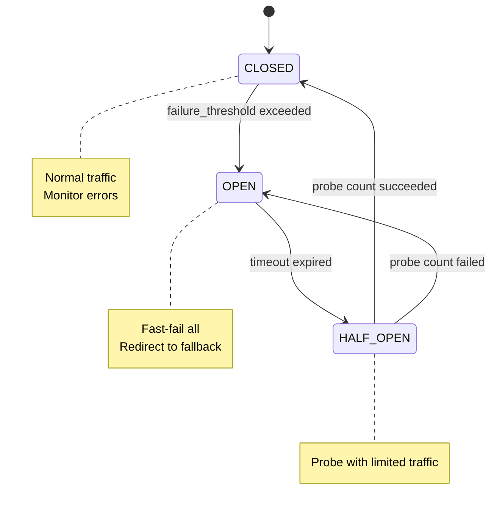
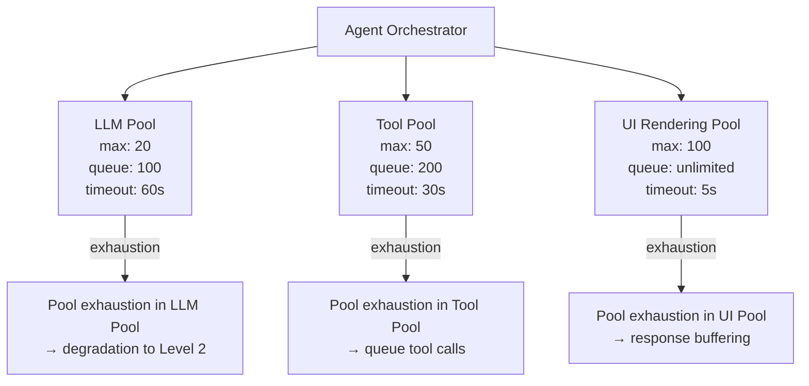

# Reliability Engineering for Agentic Applications

A comprehensive engineering reference for Enterprise Architects and AI Platform Teams designing production-grade reliability for agentic UIs and agent runtimes — covering SLO frameworks, fault tolerance patterns, saga orchestration, streaming recovery, and chaos engineering.

:::note Related Guides
    - Observability instrumentation (OTel GenAI spans, burn rate dashboards): Agentic AI Reliability &amp; Observability Governance
    - HITL gates and escalation architecture: Enterprise AI Architecture Patterns
    - AI Gateway circuit breaker configuration: Kong AI Gateway Guide

---

## 1. Why Agentic Reliability Is Fundamentally Different

Traditional web application reliability engineering operates on a foundation of stateless HTTP request-response pairs. Each request is independent, failures are local, and retries are safe by default. Agentic applications break every one of these assumptions.

### 1.1 The Five Dimensions of Agentic Unreliability

| Dimension | Traditional App | Agentic App | Reliability Impact |
| ----------- | ---------------- | ------------- | ------------------- |
| **Determinism** | Same input → same output | Same input → different output each call | Cannot rely on retry producing correct result |
| **State** | Stateless per-request | Stateful conversation, multi-turn history | Failure mid-conversation corrupts or orphans state |
| **Duration** | Milliseconds to seconds | Seconds to minutes per task | More exposure window; heartbeat + checkpoint required |
| **Dependency graph** | 2–3 hops (DB, cache) | 5–15 hops (LLM, tools, memory, reranker, guardrails) | Cascading failure probability compounds multiplicatively |
| **Failure semantics** | Error codes are definitive | LLM returns 200 OK with wrong answer | Semantic failures invisible to infrastructure monitors |

### 1.2 The Compound Failure Probability Problem

With a single dependency at 99.9% availability, system availability is 99.9%. With eight dependencies each at 99.9%, system availability drops to 99.2% — two hours of downtime per month. Agentic applications commonly chain 8–15 components:

```text
User → UI → AG-UI Gateway → Agent Orchestrator → LLM Provider
                                               → Tool Executor → Tool API
                                               → Memory Service → Vector DB
                                               → Guardrail Service
                                               → Reranker
```

At 99.9% per component, a 12-hop chain has theoretical availability of 98.8%. Engineering reliability in this environment requires defence in depth at every layer, not just endpoint monitoring.

### 1.3 Four Failure Classes That Require Different Machinery

| Failure Class | Trigger | Correct Response | Dangerous Incorrect Response |
| -------------- | --------- | ----------------- | ------------------------------ |
| **Transport** | Network timeout, HTTP 429, DNS failure | Retry with exponential backoff + jitter, honour `Retry-After` | Blind retry without jitter (thundering herd) |
| **Semantic** | Bad reasoning, hallucinated tool args, wrong plan | Re-plan with different strategy or context | Retry with identical input (same wrong output) |
| **Systemic** | Provider outage, quota exhaustion | Failover to alternate provider; activate degradation ladder | Retry hoping outage resolves |
| **Safety/Policy** | Guardrail trip, policy violation, scope exceeded | Halt immediately; escalate to HITL | **Never retry-around** — converts contained event to incident |

:::warning The Safety Retry Anti-Pattern
    Retrying around a guardrail trip with a rephrased prompt is the highest-severity reliability engineering mistake in agentic systems. It converts a contained security event into an active security incident. Safety-class failures must halt and escalate — never retry.

### 1.4 Why Observability Is a Reliability Prerequisite

You cannot build error budgets, tune SLOs, or fire alerts on events you cannot see. Before implementing any reliability pattern in this guide, confirm that OpenTelemetry GenAI semantic conventions are instrumented across every component. See the companion guide for implementation: Agentic AI Reliability &amp; Observability Governance.

---

## 2. SLA/SLO/SLI Definitions for Agentic Applications

### 2.1 Terminology

| Term | Definition | Agentic-Specific Note |
| ------ | ----------- | ---------------------- |
| **SLI** (Service Level Indicator) | A measurable signal of service behavior | Must include semantic quality signals, not just transport metrics |
| **SLO** (Service Level Objective) | Target threshold for an SLI | Set by product × reliability engineering jointly, not infrastructure alone |
| **SLA** (Service Level Agreement) | Contractual commitment to customer | Typically SLO minus a safety margin (10–20%) |
| **Error Budget** | SLO headroom before breach | 100% − SLO; the budget for experimentation and risk-taking |
| **Burn Rate** | Speed at which error budget is consumed | Alerts fire at 2× burn for fast consumption; 5× burn for slow consumption |

### 2.2 Availability SLOs by Workload Class

| Workload Class | Recommended Availability SLO | Rationale |
| ---------------- | ------------------------------ | ----------- |
| Interactive chat (best-effort) | 99.5% | Latency tolerance high; graceful degradation acceptable |
| Interactive chat (business-critical) | 99.9% | Revenue-impacting; enterprise SLA expectation |
| Autonomous workflows (batch) | 99.5% | Async; retry at workflow level is acceptable |
| Autonomous workflows (real-time) | 99.9% | Blocks downstream processes |
| HITL-assisted workflows | 99.95% | Human waiting in queue; time-sensitive |
| Embedded agent in SaaS product | 99.95% | Customer-facing; affects NPS and revenue |
| Regulated financial / healthcare agent | 99.99% | Regulatory and contractual requirement |

### 2.3 Latency SLIs: Full Taxonomy

| SLI Name | Measurement Point | P50 Target | P95 Target | P99 Target | Alert Threshold |
| ---------- | ------------------ | ----------- | ----------- | ----------- | ----------------- |
| **TTFT** (Time to First Token) | Server-sent first SSE event | 600ms | 1,200ms | 2,500ms | P95 &gt; 2,000ms for 5min |
| **Streaming Lag** | Gap between token generation and browser render | &lt; 50ms | &lt; 150ms | &lt; 500ms | P99 &gt; 500ms for 2min |
| **Tool Completion Latency** | Tool call start → result return | 300ms | 1,500ms | 5,000ms | Varies by tool |
| **End-to-End Task Latency** | User submit → task complete signal | 3s | 15s | 45s | P95 &gt; 30s for 5min |
| **Context Assembly Time** | Start build context → context ready | 100ms | 400ms | 1,000ms | P95 &gt; 600ms for 5min |
| **Memory Retrieval Latency** | Query sent → results ranked | 80ms | 250ms | 800ms | P95 &gt; 500ms for 5min |
| **Guardrail Latency** | Input received → guardrail decision | 50ms | 200ms | 600ms | P95 &gt; 400ms for 5min |
| **Planning Latency** | Plan request → plan ready | 800ms | 2,500ms | 6,000ms | P95 &gt; 4,000ms for 5min |

### 2.4 Quality SLIs: Semantic Reliability

Quality SLIs measure whether the agent is producing correct, useful outputs — not whether it responded at all. These require evaluation pipelines, not just infrastructure monitoring.

| Quality SLI | Definition | Measurement Method | Target | Alert Threshold |
| ------------- | ----------- | ------------------- | -------- | ----------------- |
| **Task Completion Rate** | % of tasks that reach a successful completion state | Automated judge + sampling | ≥ 92% | &lt; 88% for 1hr |
| **Tool Success Rate** | % of tool calls that return valid, usable results | Tool call outcome tracking | ≥ 97% | &lt; 94% for 15min |
| **Hallucination Rate** | % of responses containing factually incorrect claims | LLM judge evaluation on sample | &lt; 3% | &gt; 6% for 30min |
| **Context Faithfulness** | % of responses grounded in provided context | RAG faithfulness scorer | ≥ 90% | &lt; 85% for 1hr |
| **Plan Success Rate** | % of multi-step plans that execute without replanning | Plan outcome tracking | ≥ 85% | &lt; 78% for 1hr |
| **HITL Escalation Rate** | % of tasks escalated to human review | Escalation event count | 2–8% baseline | &gt; 15% for 30min |
| **User Satisfaction (CSAT)** | Post-task satisfaction score | In-product survey | ≥ 4.0/5.0 | &lt; 3.5 for 24hr |

### 2.5 Error Budget Calculation

```text
Error Budget Calculation:
-------------------------------------------------------------
SLO Target: 99.9% availability over 30-day window

Total minutes in 30 days: 43,200
Error budget (minutes): 43,200 × (1 - 0.999) = 43.2 minutes
Error budget (seconds): 2,592 seconds

Current period:
  Downtime events: 18 minutes (25th: 8min, 27th: 10min)
  Error budget consumed: 18/43.2 = 41.7%
  Error budget remaining: 25.2 minutes
  Days remaining in period: 12

Burn rate today: (18 min used) / (18 of 30 days) = 1.0× normal
Projected end-of-period: 30 minutes used (69% of budget)
Status: WITHIN BUDGET — monitoring for acceleration
-------------------------------------------------------------
```

### 2.6 Burn Rate Alert Configuration

| Alert Name | Condition | Window | Severity | Response |
| ------------ | ----------- | -------- | --------- | --------- |
| Fast Burn Critical | Burn rate &gt; 14.4× (2% budget in 1hr) | 1 hour | P1 | Immediate on-call page |
| Fast Burn Warning | Burn rate &gt; 6× (5% budget in 6hr) | 6 hours | P2 | Notify team lead |
| Slow Burn Warning | Burn rate &gt; 3× (10% budget in 3 days) | 3 days | P3 | Review in next standup |
| Budget at 50% | 50% of error budget consumed | Rolling | P3 | Freeze non-essential deployments |
| Budget at 75% | 75% of error budget consumed | Rolling | P2 | Halt all feature changes |
| Budget Exhausted | 100% consumed | Rolling | P1 | Full feature freeze; incident declared |

### 2.7 Sample SLO Dashboard Specification

```yaml
# SLO Dashboard — Agentic Chat Service
dashboard:
  name: "Chat Agent SLO Health"
  refresh: 60s
  panels:

    - title: "Availability SLO (30-day rolling)"
      type: stat
      metric: "availability_slo_30d"
      target: 99.9
      thresholds: [99.5, 99.9]  # red, yellow, green
      link: /runbooks/availability

    - title: "Error Budget Remaining"
      type: gauge
      metric: "error_budget_remaining_pct"
      thresholds: [25, 50, 100]  # red below 25%, yellow 25-50%

    - title: "Burn Rate (1h, 6h, 3d)"
      type: timeseries
      metrics: ["burn_rate_1h", "burn_rate_6h", "burn_rate_3d"]
      alert_lines: [14.4, 6.0, 3.0]

    - title: "TTFT P50/P95/P99"
      type: timeseries
      metrics: ["ttft_p50", "ttft_p95", "ttft_p99"]
      targets: [600, 1200, 2500]  # ms

    - title: "Task Completion Rate (hourly)"
      type: timeseries
      metric: "task_completion_rate_1h"
      target: 0.92
      alert_line: 0.88

    - title: "Tool Success Rate by Tool"
      type: heatmap
      group_by: tool_name
      metric: tool_success_rate

    - title: "Hallucination Rate (sampled)"
      type: stat
      metric: "hallucination_rate_24h"
      target: 0.03
      alert_threshold: 0.06

    - title: "Active Circuit Breakers"
      type: stat
      metric: "circuit_breakers_open"
      alert_on_nonzero: true
```

---

## 3. Fault Tolerance Patterns

### 3.1 Circuit Breaker for LLM Providers

The circuit breaker prevents cascade failures when an LLM provider is degraded. It operates in three states: Closed (normal), Open (failing fast), and Half-Open (testing recovery).



Configuration Parameters:
- failure_threshold: 5 consecutive failures → OPEN
- success_threshold: 3 consecutive successes (half-open) → CLOSED
- timeout: 30 seconds before OPEN → HALF_OPEN
- probe_request_limit: 5% of traffic in HALF_OPEN state
- fallback: Route to secondary provider (e.g., GPT-4o if Claude fails)

=== "Python"
    ```python
    import asyncio
    import time
    from enum import Enum
    from dataclasses import dataclass, field
    from typing import Callable, Optional, Any
    import logging

    logger = logging.getLogger(__name__)

    class CircuitState(Enum):
        CLOSED = "closed"
        OPEN = "open"
        HALF_OPEN = "half_open"

    @dataclass
    class CircuitBreakerConfig:
        failure_threshold: int = 5
        success_threshold: int = 3
        timeout_seconds: float = 30.0
        half_open_max_calls: int = 3
        excluded_exceptions: tuple = ()  # Don't count auth errors as failures

    class LLMCircuitBreaker:
        def __init__(self, name: str, config: CircuitBreakerConfig):
            self.name = name
            self.config = config
            self.state = CircuitState.CLOSED
            self.failure_count = 0
            self.success_count = 0
            self.half_open_calls = 0
            self.last_failure_time: Optional[float] = None
            self._lock = asyncio.Lock()

        async def call(
            self,
            func: Callable,
            fallback: Optional[Callable] = None,
            *args,
            **kwargs
        ) -> Any:
            async with self._lock:
                if self.state == CircuitState.OPEN:
                    if self._should_attempt_reset():
                        self.state = CircuitState.HALF_OPEN
                        self.half_open_calls = 0
                        logger.info(f"Circuit {self.name}: OPEN → HALF_OPEN")
                    else:
                        if fallback:
                            logger.warning(f"Circuit {self.name} OPEN — using fallback")
                            return await fallback(*args, **kwargs)
                        raise CircuitOpenError(f"Circuit {self.name} is OPEN")

                if self.state == CircuitState.HALF_OPEN:
                    if self.half_open_calls >= self.config.half_open_max_calls:
                        raise CircuitOpenError(f"Circuit {self.name} HALF_OPEN probe limit reached")
                    self.half_open_calls += 1

            try:
                result = await func(*args, **kwargs)
                await self._on_success()
                return result
            except Exception as e:
                if not isinstance(e, self.config.excluded_exceptions):
                    await self._on_failure()
                raise

        async def _on_success(self):
            async with self._lock:
                if self.state == CircuitState.HALF_OPEN:
                    self.success_count += 1
                    if self.success_count >= self.config.success_threshold:
                        self.state = CircuitState.CLOSED
                        self.failure_count = 0
                        self.success_count = 0
                        logger.info(f"Circuit {self.name}: HALF_OPEN → CLOSED (recovered)")
                elif self.state == CircuitState.CLOSED:
                    self.failure_count = 0  # Reset on success

        async def _on_failure(self):
            async with self._lock:
                self.failure_count += 1
                self.last_failure_time = time.monotonic()
                if self.state == CircuitState.HALF_OPEN:
                    self.state = CircuitState.OPEN
                    logger.warning(f"Circuit {self.name}: HALF_OPEN → OPEN (probe failed)")
                elif (self.state == CircuitState.CLOSED and
                      self.failure_count >= self.config.failure_threshold):
                    self.state = CircuitState.OPEN
                    logger.error(f"Circuit {self.name}: CLOSED → OPEN "
                                f"(failures: {self.failure_count})")

        def _should_attempt_reset(self) -> bool:
            if self.last_failure_time is None:
                return False
            return time.monotonic() - self.last_failure_time >= self.config.timeout_seconds

    class CircuitOpenError(Exception):
        pass
    ```

=== "TypeScript"
    ```typescript
    enum CircuitState {
      CLOSED = 'closed',
      OPEN = 'open',
      HALF_OPEN = 'half_open',
    }

    interface CircuitBreakerConfig {
      failureThreshold: number;
      successThreshold: number;
      timeoutMs: number;
      halfOpenMaxCalls: number;
    }

    const DEFAULT_CONFIG: CircuitBreakerConfig = {
      failureThreshold: 5,
      successThreshold: 3,
      timeoutMs: 30_000,
      halfOpenMaxCalls: 3,
    };

    export class LLMCircuitBreaker {
      private state: CircuitState = CircuitState.CLOSED;
      private failureCount = 0;
      private successCount = 0;
      private halfOpenCalls = 0;
      private lastFailureTime: number | null = null;

      constructor(
        private readonly name: string,
        private readonly config: CircuitBreakerConfig = DEFAULT_CONFIG
      ) {}

      async call&lt;T&gt;(
        fn: () => Promise&lt;T&gt;,
        fallback?: () => Promise&lt;T&gt;
      ): Promise&lt;T&gt; {
        if (this.state === CircuitState.OPEN) {
          if (this.shouldAttemptReset()) {
            this.state = CircuitState.HALF_OPEN;
            this.halfOpenCalls = 0;
            console.info(`Circuit ${this.name}: OPEN → HALF_OPEN`);
          } else {
            if (fallback) {
              console.warn(`Circuit ${this.name} OPEN — using fallback`);
              return fallback();
            }
            throw new Error(`Circuit ${this.name} is OPEN`);
          }
        }

        if (this.state === CircuitState.HALF_OPEN) {
          if (this.halfOpenCalls >= this.config.halfOpenMaxCalls) {
            throw new Error(`Circuit ${this.name} HALF_OPEN probe limit reached`);
          }
          this.halfOpenCalls++;
        }

        try {
          const result = await fn();
          this.onSuccess();
          return result;
        } catch (error) {
          this.onFailure();
          throw error;
        }
      }

      private onSuccess(): void {
        if (this.state === CircuitState.HALF_OPEN) {
          this.successCount++;
          if (this.successCount >= this.config.successThreshold) {
            this.state = CircuitState.CLOSED;
            this.failureCount = 0;
            this.successCount = 0;
            console.info(`Circuit ${this.name}: HALF_OPEN → CLOSED`);
          }
        } else if (this.state === CircuitState.CLOSED) {
          this.failureCount = 0;
        }
      }

      private onFailure(): void {
        this.failureCount++;
        this.lastFailureTime = Date.now();
        if (this.state === CircuitState.HALF_OPEN) {
          this.state = CircuitState.OPEN;
          console.warn(`Circuit ${this.name}: HALF_OPEN → OPEN`);
        } else if (
          this.state === CircuitState.CLOSED &&
          this.failureCount >= this.config.failureThreshold
        ) {
          this.state = CircuitState.OPEN;
          console.error(`Circuit ${this.name}: CLOSED → OPEN`);
        }
      }

      private shouldAttemptReset(): boolean {
        if (this.lastFailureTime === null) return false;
        return Date.now() - this.lastFailureTime >= this.config.timeoutMs;
      }
    }
    ```

### 3.2 Bulkhead Pattern

The bulkhead isolates LLM calls, tool calls, and UI rendering into separate thread/async pools so that a stuck tool call cannot block LLM streaming.



### 3.3 Timeout Hierarchy

Timeouts must be nested: inner timeouts must be shorter than outer timeouts or the outer timeout can never fire.

| Timeout Type | Recommended Default | Scope | Behaviour on Expiry |
| ------------- | ------------------- | ------- | --------------------- |
| UI Response Timeout | 120s | Browser keeps connection alive | Display "still working" heartbeat |
| Agent Task Timeout | 300s | Max wall-clock time for a complete task | Task marked TIMEOUT; HITL escalation option |
| LLM API Call Timeout | 60s | Per LLM provider HTTP request | Circuit breaker increment; try fallback provider |
| Tool Call Timeout | 15–30s | Per individual tool execution | Tool result = `timeout_error`; plan replanning |
| Memory Retrieval Timeout | 3s | Vector DB query + reranking | Fall back to exact-match search |
| Guardrail Timeout | 2s | Input/output guardrail check | Fail open (configurable) or fail closed |
| Planning Timeout | 30s | Planner model response | Return partial plan; prompt user for clarification |

:::warning Timeout Nesting Violation
    If your tool call timeout (30s) equals your LLM call timeout (30s), both can expire simultaneously, making it impossible to determine which failed. Always set inner timeouts 20–40% shorter than outer timeouts.
