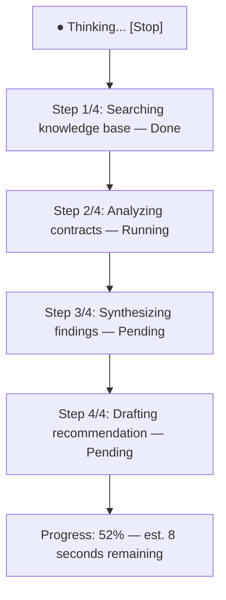
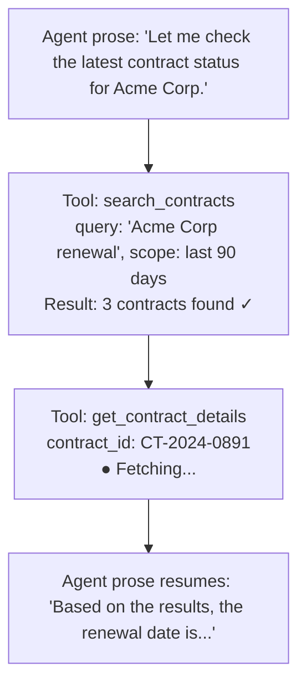
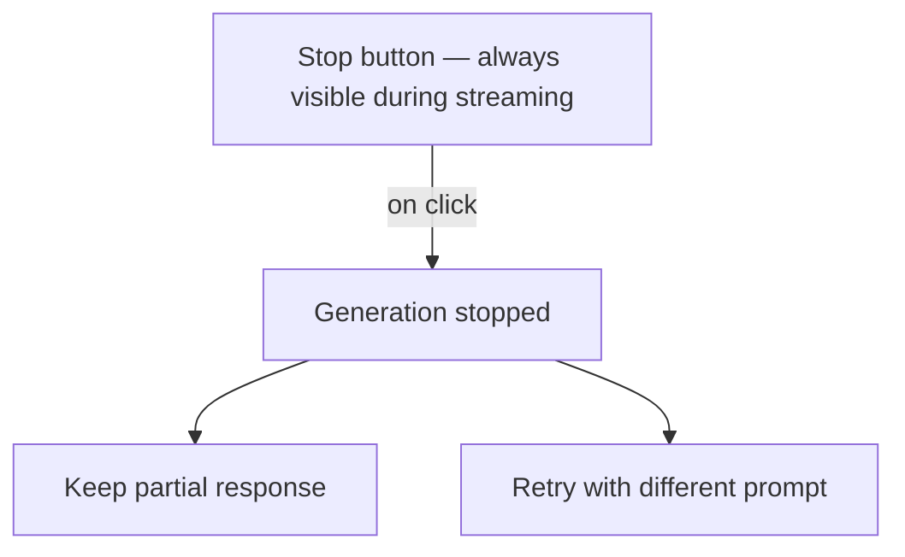
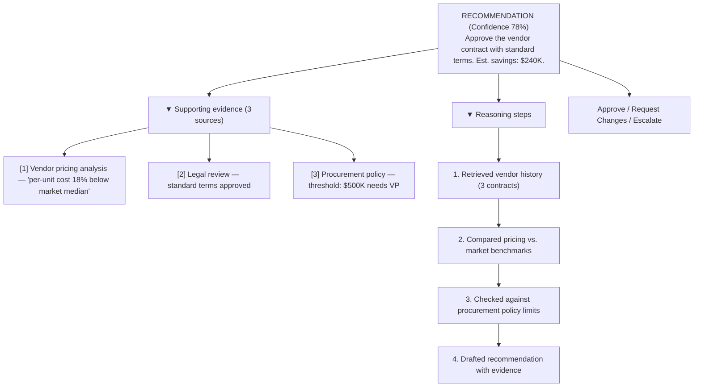
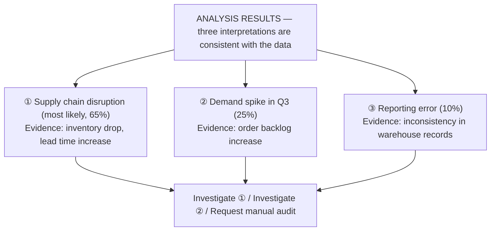
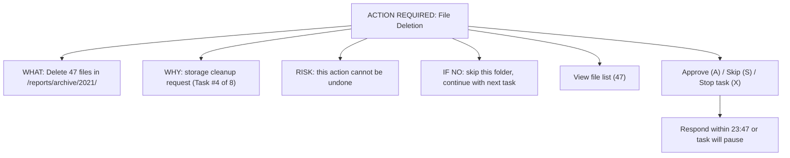
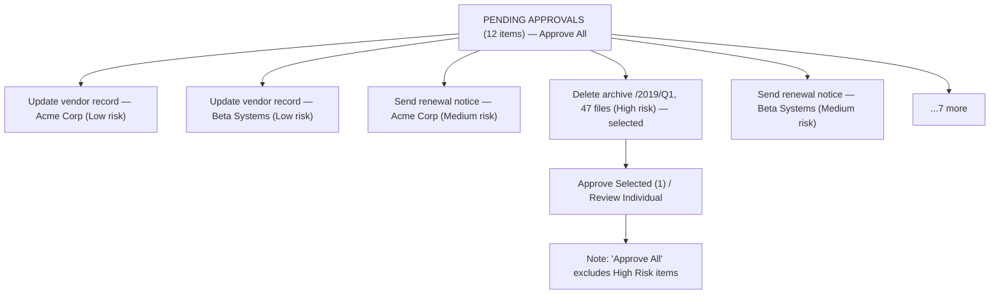

This is part 2 of 3.

**Related:** [Part 1](../01-agent-ux-patterns.md) · [Part 3](../parts/01-agent-ux-patterns-part3.md)

---

## 2. Streaming UX Design

Streaming is the default output mode for LLM-backed agents. Poor streaming UX is the #1 source of perceived quality regression from batch AI to agentic AI. These patterns address every dimension of streaming experience.

### 2.1 Progressive Text Rendering

| Rendering Mode | Behavior | When to Use | Risk |
| ---------------- | ---------- | ------------- | ------ |
| **Character stream** | Render every token as it arrives | Chat, conversational UX | Jitter on short tokens |
| **Word-buffered** | Buffer until word boundary, then render | Voice transcription overlay | 50–80ms added latency |
| **Sentence-buffered** | Hold until sentence end, flush | TTS pipelines, spoken output | Longer perceived latency |
| **Paragraph-buffered** | Hold until double newline | Document editors, code blocks | Best for structured content |
| **Hold-until-complete** | Never stream — wait for full response | Decision cards, structured JSON | Poor for long responses |
| **Hybrid** | Stream prose, buffer code/tables | Mixed content (chat + code) | Complexity in render logic |

**Choose Character stream when:** the response is conversational prose and the user benefit of seeing words appear outweighs the minor jitter of token-level rendering.

**Choose Hold-until-complete when:** the output is a structured data object (JSON decision card, table) that cannot be partially rendered without confusing the user.

---

### 2.2 Streaming Indicators

*Step-progress streaming indicator: each tool-driven step reports Done/Running/Pending state, with an overall percentage and time estimate.*

| Indicator Type | Best For | Avoid When |
| ---------------- | ---------- | ------------ |
| Animated ellipsis ("Thinking...") | Short waits < 3 seconds | Long multi-step tasks |
| Step progress list | Multi-tool tasks | Simple single-turn responses |
| Percentage progress bar | Tasks with known step count | Open-ended reasoning |
| Tool call callout | Developer-facing / power users | End-user consumer apps |
| Time estimate | Tasks > 15 seconds | Tasks with variable duration |
| Spinner on input field | Embedded copilot in form | Full-page chat (too subtle) |

---

### 2.3 Partial Result Surfacing

The central streaming tension: **show work in progress** vs. **hold until complete**.

| Approach | UX Benefit | UX Risk | Recommended For |
| ---------- | ----------- | --------- | ----------------- |
| **Show all partial output** | Fastest perceived completion | Confusing rewrites mid-stream | Chat, prose generation |
| **Show structured skeleton first** | Sets expectations for long output | Jarring if structure changes | Reports, documents |
| **Show partial sections as completed** | Best for long structured content | Requires section-boundary detection | Multi-section analysis |
| **Stream reasoning separately** | Users see the agent "thinking" | Cognitive overload for non-technical | Developer tools, high-stakes analysis |
| **Hold all, show spinner** | Clean final reveal | Longest perceived wait | Decision cards, forms, structured JSON |

---

### 2.4 Streaming Tool Call Visualization

When an agent executes tools during streaming, users need visibility without being overwhelmed.

*Streaming tool-call visualization: prose and tool-call cards interleave in one stream, each card showing its inputs and live status.*

**Tool call visualization levels:**

| Visibility Level | Shown | Audience |
| ----------------- | ------- | ---------- |
| **Invisible** | Nothing — seamless integration | End-user consumer apps |
| **Minimal** | "Checking data..." generic indicator | Business user apps |
| **Name only** | Tool name: `search_contracts` | Power users |
| **Name + params** | Tool name + sanitized input parameters | Developer tools |
| **Full trace** | Name + params + result + duration | Debug / audit mode |

---

### 2.5 Cancellation UX

*Cancellation UX: the Stop control is always visible mid-stream; clicking it surfaces a choice between keeping the partial response or retrying.*

| Cancellation Scenario | Recommended Behavior |
| ----------------------- | --------------------- |
| User clicks Stop | Halt stream immediately. Show partial content. Offer Keep/Retry/Discard. |
| User navigates away | Halt stream server-side. Do not persist partial output without user confirmation. |
| Mid-tool-call cancel | Complete tool call if < 1 second remaining. Abort if long-running. |
| Cancel in approval dialog | Treat as "reject" — do not execute the pending tool call. |
| Timeout (> 60s no completion) | Auto-cancel. Offer retry with context of how far it got. |

---

### 2.6 Error Recovery During Streaming

| Error Type | Detection Signal | UX Response |
| ------------ | ----------------- | ------------- |
| LLM API timeout | No tokens for > 30s | "The response timed out. [Retry] [Save what I have]" |
| Rate limit hit | 429 from LLM API | "Busy right now — retrying automatically... 1/3" |
| Tool call failure | `TOOL_CALL_END` with error | Inline tool error card with retry option |
| Partial JSON truncation | Incomplete structured output | Attempt repair; fallback to "Unable to generate structured output — [Retry]" |
| Context length exceeded | 400/413 from LLM API | "Conversation too long. [Summarize and continue] [Start new]" |
| Network interruption | WebSocket / SSE disconnect | Reconnect with session ID; resume from last `MESSAGE_ID` |

---

### 2.7 Streaming in Different Form Factors

| Form Factor | Streaming Approach | Special Considerations |
| ------------ | ------------------- | ---------------------- |
| **Full-page chat** | Character-level streaming, left-aligned | Scroll lock: auto-scroll while streaming, release on manual scroll |
| **Document editor** | Paragraph-buffered inline insertion | Preserve cursor position; undo stack integration required |
| **Dashboard widget** | Hold-until-complete for KPI cards | Stream narrative summary; hold structured data |
| **Mobile chat** | Word-buffered to reduce jitter | Battery-aware: reduce streaming frequency on low battery |
| **Sidebar panel** | Stream into fixed-height scrollable div | Truncate at max height with "Show more" |
| **Voice output** | Sentence-buffered → TTS | First sentence must begin TTS within 500ms for natural cadence |

---

## 3. Reasoning Visualization

Showing the agent's reasoning is a UX decision with significant downstream effects on trust, cognitive load, regulatory posture, and usability.

### 3.1 Decision Framework: When to Show Reasoning

| Confidence \ Stakes | Low Stakes | High Stakes |
| --- | --- | --- |
| **Low confidence** | Hide (show result only) | Collapsible summary |
| **High confidence** | Hide (clean UX) | Full structured reasoning required |

**Show full reasoning when:**

- Stakes are high AND confidence is uncertain (cell: HIGH stakes, LOW confidence)
- The user needs to validate the reasoning (regulated decision support)
- The output will be challenged by a downstream reviewer
- The user has explicitly requested an explanation

**Show collapsible summary when:**

- Stakes are high but confidence is high (senior expert validation scenario)
- The use case is developer / analyst tooling

**Hide reasoning when:**

- Simple fact retrieval (clutter > benefit)
- End-user consumer app with low technical literacy
- High-confidence, low-stakes generation (email autocomplete)
- Regulated contexts where showing reasoning implies AI autonomy (EU AI Act Art. 14 consideration — see [Governance](../../../architecture/51-enterprise-ai-governance-compliance.md))

---

### 3.2 Reasoning Visualization Formats

| Format | Description | Best For | Implementation |
| -------- | ------------- | ---------- | --------------- |
| **Chain-of-thought text** | Narrative reasoning shown in expandable block | General explanation | `

View reasoning
` |
| **Execution step log** | Numbered steps with timestamps and tool calls | Audit, debugging | Structured log panel |
| **Planning tree** | Visual tree: goal → sub-goals → tasks | Complex multi-step plans | D3.js / Mermaid tree diagram |
| **Confidence bar** | Horizontal bar 0-100% per claim | Fact-checking, verification | CSS progress bar per sentence |
| **Source citations** | [1], [2] footnotes linking to source documents | RAG-based responses | Superscript links + citation panel |
| **Scratchpad panel** | Agent's full internal monologue | Developer/debug mode only | Collapsible pre-formatted block |

---

### 3.3 ASCII Wireframe: Reasoning Panel

*Reasoning panel: a headline recommendation with confidence, expandable evidence and reasoning-step sections, and the approval actions.*

---

## 4. Confidence and Uncertainty Visualization

### 4.1 Visual Encodings for Confidence

| Encoding | How It Works | Accessible | Over-used Risk |
| ---------- | ------------- | ------------ | ---------------- |
| Color gradient (green → red) | Hue shifts with confidence | Fails for color blindness | High — use sparingly |
| Fill level (bar/circle) | Area proportional to confidence | Good | Medium |
| Text label ("High/Medium/Low") | Categorical language | Excellent | Low |
| Numeric percentage (78%) | Raw probability | Good for experts | May false-precision |
| Star rating (★★★☆☆) | Familiar consumer metaphor | Good | Trivializes for high-stakes |
| Icon (shield/warning/info) | Category indicator | Excellent with alt text | Low |
| Hedging language ("probably", "it appears") | Natural language | Excellent | Risk of legal ambiguity |

**Best practice:** Combine fill level (for quick scan) + text label (for accessibility) + hedging in prose. Avoid numeric percentages for non-expert audiences unless calibration is verified.

---

### 4.2 Calibration Considerations

:::warning Overconfidence is a UX hazard
    LLM confidence scores are frequently miscalibrated — a model that says 85% confidence may be right only 60% of the time in your domain. Always validate calibration on your golden dataset before displaying numeric confidence to users. Miscalibrated confidence erodes trust faster than no confidence display.

| Domain | Calibration Risk | Recommendation |
| -------- | ----------------- | ---------------- |
| Open-domain Q&A | High | Use categorical labels; no numeric |
| RAG over enterprise knowledge | Medium | Show after calibration on domain eval set |
| Structured extraction (form filling) | Low | Numeric % acceptable with validation |
| Medical / legal / financial | Very High | Never display confidence — show "verify with expert" |
| Code generation | Medium | Show test pass rate instead of confidence |

---

### 4.3 Multiple-Hypothesis Display

For decisions with genuine uncertainty, show multiple hypotheses rather than a single answer with confidence.

*Multiple-hypothesis display: instead of one answer with a confidence score, competing interpretations are ranked with their supporting evidence and per-hypothesis investigate actions.*

---

### 4.4 "I Don't Know" UX Patterns

The most trust-building thing an agent can do is accurately communicate the limits of its knowledge.

| Scenario | Poor Response | Better Response |
| ---------- | -------------- | ----------------- |
| Out-of-training-data question | Hallucinated answer | "I don't have information about this. [Search live sources]" |
| Ambiguous query | Best-guess answer | "I'm not sure what you mean. Did you mean A or B?" |
| Document not retrieved | Answer from training data | "I couldn't find relevant documents. I'm answering from general knowledge — verify before acting." |
| Conflicting sources | Arbitrary choice | "Sources disagree. Source A says X; Source B says Y. [Show both]" |
| Low confidence retrieval | Confident wrong answer | "I found this, but I'm not confident it's relevant. [Review source]" |

---

## 5. Human Approval UX

Approval UX is the most consequential pattern in agentic applications. Poor approval design leads to rubber-stamping (users approve without reading), approval fatigue, and compliance failures.

### 5.1 Approval Request Design Principles

Every approval request must answer four questions immediately visible without scrolling:

1. **What** is the agent asking to do?
2. **Why** is it asking to do this?
3. **What happens if I approve?** (Consequence)
4. **What happens if I reject?** (Alternative path)

*Approval request anatomy: what/why/risk/alternative are all visible without scrolling, alongside the response deadline.*

---

### 5.2 Approval Flow Types

| Flow Type | Description | When to Use | Risk |
| ----------- | ------------- | ------------- | ------ |
| **Single-click approve** | One button approves and executes | Low-risk, well-understood actions | Rubber-stamping |
| **Review-and-approve** | User must view detail before approve button activates | Medium-risk actions | Slower, more friction |
| **Dual confirmation** | Two separate "Approve" clicks required | High-risk irreversible actions | Friction may block legitimate use |
| **Typed confirmation** | User types action name to confirm | Catastrophic-risk actions (delete all, send to all) | High friction — reserve for nuclear options |
| **Delegated approval** | Routes to a different user (manager, admin) | Actions beyond user's authorization | Workflow delay |
| **Async approval** | Approval request sent via email/Slack/notification | User is not online / long-running tasks | Session management complexity |

---

### 5.3 Approval for High-Risk Tool Categories

| Tool Category | Risk Level | Required Approval Model | Audit Requirement |
| --------------- | ----------- | ------------------------ | ------------------- |
| Read data | None | No approval | Log only |
| Create (new record, new file) | Low | HOTL or HITL | Log |
| Update existing record | Medium | HITL | Log + before/after diff |
| Send communication (email, Slack) | Medium–High | HITL review-and-approve | Log + content capture |
| Delete data | High | Dual confirmation | Log + content backup |
| Financial transaction | Very High | Delegated approval (finance) | Full audit + reconciliation |
| Publish externally | High | Delegated approval (comms/legal) | Log + content snapshot |
| Grant access / permissions | Very High | Delegated approval (security) | Log + justification |
| Execute code | Very High | Typed confirmation | Log + code capture |

---

### 5.4 Batch Approval

For autonomous workflows generating multiple pending approvals:

*Batch approval list: items are grouped and risk-tagged, with High Risk items always excluded from the bulk "Approve All" action.*

**Batch approval rules:**

- "Approve All" must exclude HIGH RISK items — these always require individual review
- Group items by risk level for visual triage
- Show aggregate consequence ("this will send 23 emails")
- Provide bulk-reject for all low-risk items in one action

---

### 5.5 Approval Timeout and Escalation

| Timeout State | Duration | Behavior |
| -------------- | ---------- | ---------- |
| First warning | 80% of timeout | "This approval will expire in 5 minutes" |
| Second warning | 95% of timeout | Visual urgency indicator (amber) |
| Timeout | 100% | Task pauses. Escalation notification sent. |
| Escalation wait | Configurable | Routes to backup approver |
| Final timeout | Configurable | Task cancelled. Audit log entry. |

:::note Escalation Chain Design
    Define a 3-level escalation chain for every autonomous task: primary approver → manager → task owner. Undeclared escalation chains are an operational risk for long-running autonomous workflows. See [HITL patterns](../../../architecture/49-enterprise-ai-architecture-patterns.md).

---

### 5.6 Audit Trail for Approvals

Every approval decision must be persisted with:

| Field | Content |
| ------- | --------- |
| `approval_id` | UUID |
| `task_id` | Parent task or agent run ID |
| `tool_call_id` | Specific tool call being approved |
| `tool_name` | Name of the tool |
| `tool_parameters` | Exact parameters (sanitized for PII if required) |
| `approver_id` | User identity (not just display name) |
| `decision` | `approved` / `rejected` / `modified` / `escalated` |
| `decision_at` | ISO 8601 timestamp |
| `response_time_seconds` | Time from request to decision |
| `context` | Screenshot or structured snapshot at time of request |
| `notes` | Optional user comment |

---

