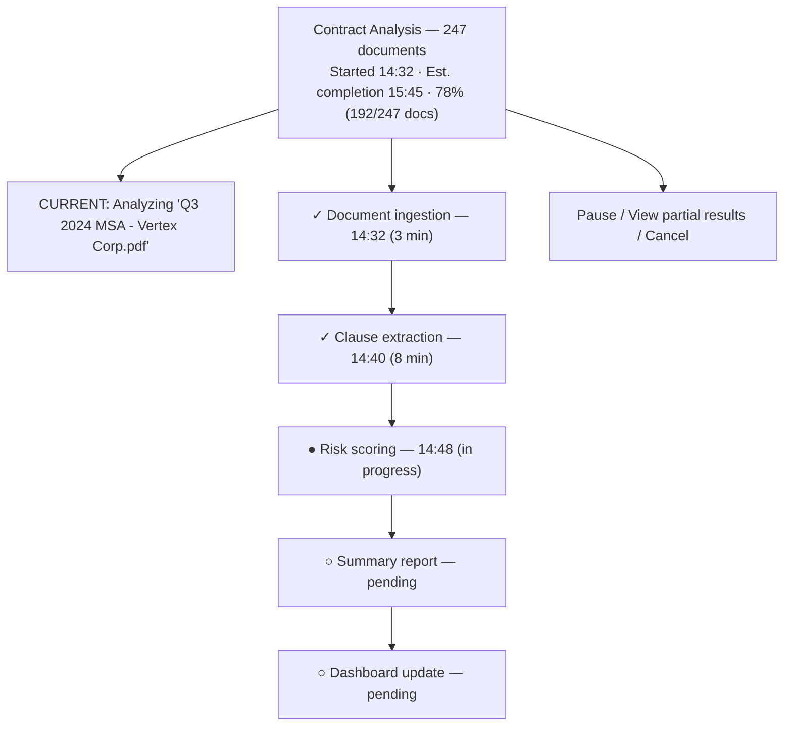
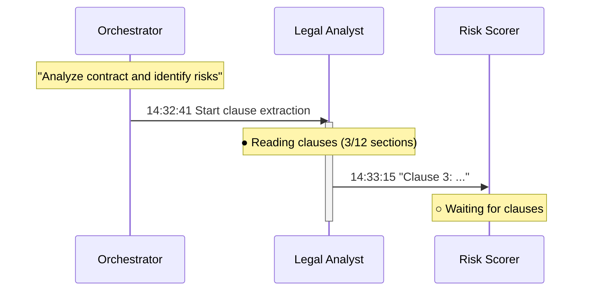
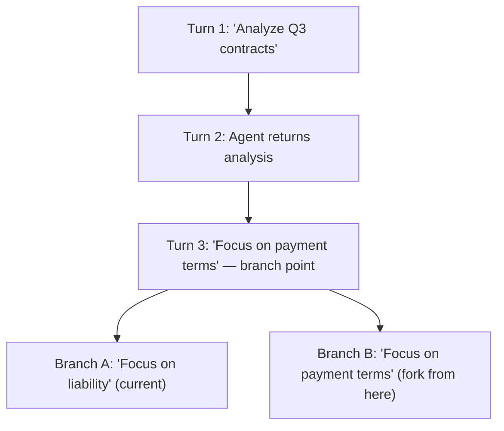
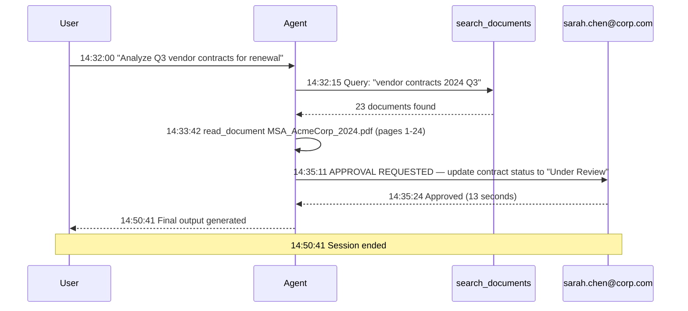

This is part 3 of 3.

**Related:** [Part 1](../01-agent-ux-patterns.md) · [Part 2](../parts/01-agent-ux-patterns-part2.md)

---

## 6. Long-running Task UX

### 6.1 Progress Visualization Patterns



*Long-running task progress view: overall percentage, current item, a milestone timeline, and controls to pause, inspect, or cancel.*

| Progress Element | Required | Recommended When |
| ----------------- | ---------- | ----------------- |
| Overall % bar | Always | Any task > 10 seconds |
| Milestone list | Yes | Tasks with 3+ distinct phases |
| Current item name | Yes | Batch processing tasks |
| Time elapsed / estimated | Yes | Tasks > 1 minute |
| Items completed / total | Yes | Enumerable batch tasks |
| Cost consumed (tokens/$ ) | Optional | Developer / admin view |

---

### 6.2 Background Task Management

**Minimized task bar:** `[Contract Analysis 78%]` `[Code Review Done ✓]`

**Background task lifecycle:**

| State | Visual | Action Available |
| ------- | -------- | ----------------- |
| Running | Animated progress indicator | Pause, View, Cancel |
| Paused | Static progress bar (amber) | Resume, Cancel |
| Awaiting approval | Bell icon (red badge) | Review + Approve |
| Completed | Green check | View results, Dismiss |
| Failed | Red X | View error, Retry |
| Cancelled | Gray dash | — |

---

### 6.3 Notification Fallback

When the user is not active in the application, task completion must reach them through ambient channels.

| Delivery Channel | Trigger | Content |
| ---------------- | --------- | --------- |
| In-app toast | User active, task completes | "Contract analysis complete — 12 high-risk clauses found" |
| Browser push notification | User has tab open, focus elsewhere | Title + one-line summary |
| Email digest | User offline > 15 minutes | Subject, summary, link to results |
| Slack DM | User has Slack integration configured | Summary card + "View Results" button |
| Mobile push | User has mobile app installed | Summary + deep link to task result |

---

## 7. Multi-agent Collaboration UX

### 7.1 Agent Handoff Visualization



*Multi-agent handoff view: the orchestrator delegates to specialist agents, whose status and inter-agent messages stream on a shared message bus, with Intervene / View log / Stop all controls.*

### 7.2 Multi-agent Status Dashboard

| Dashboard Element | Content | Refresh |
| ------------------ | --------- | --------- |
| Agent status grid | Name, state, current task, last action | Real-time |
| Inter-agent message feed | Timestamped messages between agents | Real-time |
| Shared workspace panel | Files/data being worked on | Real-time |
| Conflict alerts | When two agents modify the same resource | Immediate |
| Resource consumption | Token usage, API calls per agent | Per-turn |
| Human approval queue | Pending approvals from any agent | Real-time |

---

## 8. Undo, Replay, and Checkpoint UX

### 8.1 What Can and Cannot Be Undone

| Action Type | Undoable? | Recovery Path |
| ------------- | ----------- | --------------- |
| Text generation in chat | Yes | Delete message; regenerate |
| File created by agent | Yes | Agent-initiated delete |
| File modified by agent | Yes | Restore from agent checkpoint |
| Email sent by agent | No | Draft was stored; send notification only |
| Database record updated | Depends | If event-sourced: yes. CRUD: requires backup |
| External API call | No | Log the call; manual reversal only |
| Payment initiated | No | Cancellation via financial system; not agent |
| Slack message sent | No | Delete via Slack API (time-limited) |

---

### 8.2 Conversation Branching



*Conversation branching: a fork point after Turn 3 spawns two parallel branches sharing the same prefix.*

**Branch controls:**

- Every message in history shows a "Fork from here" icon on hover
- Branching creates a new conversation tab with the shared prefix
- Side-by-side comparison mode shows branch A vs. branch B responses
- Branches are named automatically ("Branch from Turn 3") and can be renamed

---

### 8.3 Checkpoint UX

| Checkpoint Feature | Description |
| ------------------- | ------------- |
| **Auto-checkpoint** | System creates checkpoint at every tool call and major milestone |
| **Named checkpoint** | User clicks "Save checkpoint" and names it ("Before risk analysis") |
| **Checkpoint list** | Timeline showing all checkpoints with metadata |
| **Restore** | One click loads checkpoint; current state is auto-saved before restore |
| **Compare** | Side-by-side view of agent state at two checkpoints |
| **Re-run from checkpoint** | Re-execute from a checkpoint with modified parameters |

---

## 9. Audit UX

### 9.1 Audit View Components

**Header:** Session `AGT-2024-09-15-0042` · User `sarah.chen@corp.com` · Started 2024-09-15 14:32 UTC · Duration 18m 42s · Status Completed · Risk Score 2/10 (Low)



*Audit view: every tool call, approval request, and decision is a timestamped event, exportable to CSV, PDF, or a compliance inbox.*

---

### 9.2 Compliance Evidence Export

| Export Format | Content | Use For |
| -------------- | --------- | --------- |
| CSV | Structured log of all tool calls and approvals | SIEM integration, bulk analysis |
| PDF report | Human-readable audit report with signatures | Regulatory submission, legal proceedings |
| JSON trace | Full structured event stream | Technical audit, LLM training |
| Screenshots | Visual captures of approval dialogs | Evidence in disputes |

---

## 10. Failure and Error UX

### 10.1 Error Classification by User Impact

| Error Class | Example | User Impact | UX Response |
| ------------- | --------- | ------------ | ------------- |
| **Transient** | API timeout | Minor delay | Auto-retry silently; show spinner |
| **Recoverable** | Rate limit | Short delay | "Retrying (1/3)..." |
| **Content error** | LLM refused request | Task fails | "I can't help with this. [Why?] [Try differently]" |
| **Tool failure** | Database connection lost | Partial result | "Could not access X. Showing partial results." |
| **Partial failure** | 4 of 8 steps completed | Incomplete result | "Completed 4/8 steps. Steps 5-8 failed. [View] [Retry failed steps]" |
| **Fatal** | Session corrupt | Full task failure | "Something went wrong. Your progress has been saved. [Resume] [Start over]" |

---

### 10.2 Error Message Design for Agentic Systems

**Good error messages** answer: what happened, why it happened, and what the user can do.

| Anti-pattern | Example | Better |
| ------------- | --------- | -------- |
| Technical jargon | "500 Internal Server Error" | "Something went wrong on our end. Please try again." |
| Vague failure | "An error occurred" | "The document search failed because the knowledge base is temporarily unavailable." |
| No action offered | "This failed." | "The search failed. [Retry] [Search differently] [Ask for help]" |
| Blaming the user | "Your request was malformed" | "I didn't understand that request. Could you rephrase it?" |
| Missing context | "Rate limit exceeded" | "I'm processing too many requests right now. I'll continue automatically in about 30 seconds." |

---

## 11. Accessibility for Agentic UIs

### 11.1 WCAG 2.1 AA Requirements Specific to Agentic UX

| Agentic UX Element | WCAG Criterion | Implementation |
| -------------------- | --------------- | ---------------- |
| Streaming text | 4.1.3 Status Messages | Use ARIA live region: `aria-live="polite"` for streaming, `"assertive"` for errors |
| Approval dialogs | 2.1.1 Keyboard, 2.4.3 Focus Order | Trap focus in modal; approve/reject on Enter/Escape |
| Confidence indicators | 1.4.1 Use of Color | Never use color alone; include text label or icon + text |
| Progress bars | 4.1.3 Status Messages | `role="progressbar"` with `aria-valuenow`, `aria-valuemin`, `aria-valuemax` |
| Tool call callouts | 1.3.1 Info and Relationships | Semantic `<aside>` or `role="status"` |
| Agent status icons | 1.1.1 Non-text Content | `aria-label` on all icon-only indicators |
| Cancel/stop button | 2.1.1 Keyboard | Always keyboard-accessible; never icon-only |
| Notification toasts | 4.1.3 Status Messages | `role="alert"` for urgent; `role="status"` for informational |

---

### 11.2 Screen Reader Support for Streaming Content

```text
RECOMMENDED ARIA PATTERN FOR STREAMING:

<div role="log" aria-live="polite" aria-label="Agent response">
  <!-- Token-by-token content appended here -->
  <!-- Screen reader announces at paragraph boundaries -->
</div>

<!-- For tool call status: -->
<div role="status" aria-live="polite" aria-atomic="true">
  Running: search_contracts...
</div>

<!-- For approval requests: -->
<dialog aria-modal="true" aria-labelledby="approval-title">
  <h2 id="approval-title">Action Required: Delete 47 files</h2>
  <!-- Dialog content -->
</dialog>
```

---

### 11.3 Color-blind Accessible Confidence Indicators

| Confidence Level | Color (WCAG AA) | Icon | Text Label |
| ----------------- | ---------------- | ------ | ------------ |
| Very High (90-100%) | #2E7D32 (green, 4.5:1) | ✓ shield | "Very High" |
| High (70-89%) | #1565C0 (blue, 5.1:1) | ↑ trend | "High" |
| Medium (40-69%) | #E65100 (orange, 3.1:1 on white) | ≈ wavy | "Medium" |
| Low (20-39%) | #B71C1C (red, 5.8:1) | ↓ trend | "Low" |
| Very Low (&lt;20%) | #4A148C (purple, 7.3:1) | ? question | "Very Low" |

Use fill level (progress bar) as the primary encoding. Color is secondary. Text label is always present.

---

## 12. Agent UX Anti-patterns

### 12.1 Complete Anti-pattern Catalog

| # | Anti-pattern | Severity | Description | Mitigation |
| --- | ------------- | ---------- | ------------- | ------------ |
| 1 | **Ghost approvals** | Critical | Approval dialogs auto-close or appear and disappear before user can read them | Set minimum display time (3s); no auto-close |
| 2 | **Confirmation fatigue** | High | Every trivial action requires approval, training users to click through without reading | Calibrate approval thresholds; use HOTL for low-risk |
| 3 | **Silent tool execution** | High | Agent calls external APIs or mutates data without any user visibility | Always surface tool calls to users |
| 4 | **Hallucinated citations** | High | Agent fabricates document references that appear in the citation list | Verify all citations against retrieved chunks |
| 5 | **Anthropomorphism overflow** | Medium | Agent uses first-person emotional language ("I feel", "I'm excited to") creating false relationship | Keep agent persona professional; avoid emotional language |
| 6 | **Streaming wall of text** | High | Agent streams 2000+ word responses with no structure | Enforce response length limits; use structured output |
| 7 | **Context collapse** | High | Agent appears to remember something it cannot (cross-session memory leak) | Clearly indicate what session context is in use |
| 8 | **Overconfident errors** | Critical | Agent states incorrect facts with high confidence indicators | Implement uncertainty-aware prompting; validate before rendering confidence |
| 9 | **Approval without consequence** | Critical | Approval dialog does not clearly state what happens if approved | Every approval dialog must show consequence |
| 10 | **No undo for mutations** | High | Agent modifies data with no way to reverse | Implement pre-action snapshots; offer undo within 30 seconds |
| 11 | **Invisible agent identity** | Medium | User cannot tell which AI/agent/model produced an output | Always show agent identity in response header |
| 12 | **Missing stop button** | High | User cannot cancel a running task | Stop button always visible during any active task |
| 13 | **Streaming jank on mobile** | Medium | Character-level streaming causes layout thrash on mobile browsers | Use word-buffered streaming on mobile |
| 14 | **Progress bar that never moves** | Medium | Progress bar stuck at 0% or 99% for long periods | Use milestone-based progress; reflect real state |
| 15 | **Error messages in logs only** | High | Errors visible only in browser console or server logs | Surface all user-impacting errors in the UI |
| 16 | **Reasoning shown always** | Medium | Every response shows full chain-of-thought regardless of need | Gate reasoning display on stakes × confidence matrix |
| 17 | **Multi-agent confusion** | Medium | User cannot tell which agent is speaking | Prefix each agent message with its name/role |
| 18 | **Async task orphan** | High | Background tasks continue after user logs out with no notification | Tie task lifecycle to session; email completion to user |
| 19 | **No audit export** | High | Audit log exists in the system but cannot be exported by the user | Provide CSV/PDF export from every audit view |
| 20 | **Color-only confidence** | Medium | Confidence shown only as green/red color with no text or icon | Add text label to all confidence indicators |
| 21 | **Keyboard trap in modal** | High | Approval dialog cannot be dismissed with keyboard | Implement focus trap with Escape to close/reject |
| 22 | **Streaming ARIA spam** | Medium | Screen reader announces every token, making speech unusable | Use `aria-live="polite"` only; batch updates |
| 23 | **Implied causality** | Medium | UI implies agent caused a business outcome that was coincidental | Be precise: "The agent suggested X" not "The agent achieved Y" |
| 24 | **Tool parameter leakage** | High | Internal system parameters (API keys, internal IDs) shown in tool call UI | Sanitize tool call display; show user-facing summaries only |
| 25 | **Perpetual loading state** | Medium | Task appears to be running forever with no update | Auto-escalate tasks > 2× estimated duration; notify user |
| 26 | **No empty state for agent list** | Low | Multi-agent dashboard shows blank page before agents start | Always show agent roster with pending/queued states |
| 27 | **Approval context missing** | High | Approval dialog shows action with no context on why the agent chose to take it | Include the task goal and reasoning summary in every approval |
| 28 | **Irreversible default** | High | The default action in an approval dialog is the destructive action | Place destructive action as secondary; safe action as primary/default |

---

:::tip Getting Started with UX Pattern Selection
    For a new agentic application, start with the **Copilot Pattern Taxonomy** (Section 1) to identify your deployment archetype, then use the **Decision Framework** guide at [decision-frameworks.md](../06-decision-frameworks.md) for technology selection. For lifecycle planning, see [application-lifecycle.md](../04-application-lifecycle.md).

:::note Protocol Reference
    AG-UI event types referenced throughout this document (`TEXT_MESSAGE_CONTENT`, `TOOL_CALL_START`, `STATE_SNAPSHOT`, etc.) are specified in the AG-UI open protocol. MCP integration patterns are detailed in [MCP Deep Research 2026](pathname:///archon/protocols/mcp-deep-research-2026).
