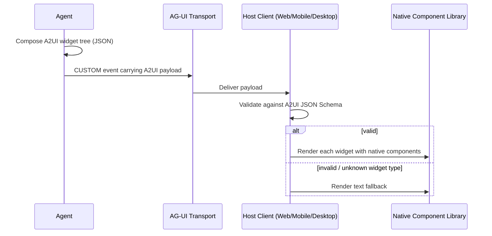
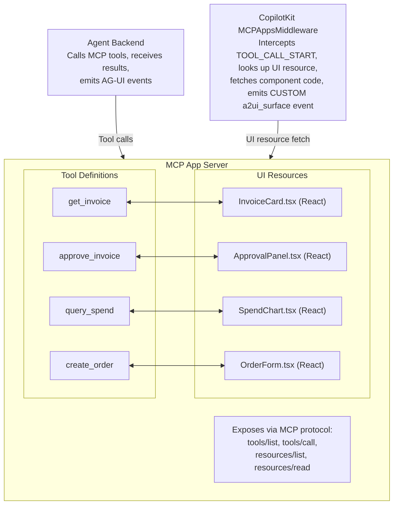
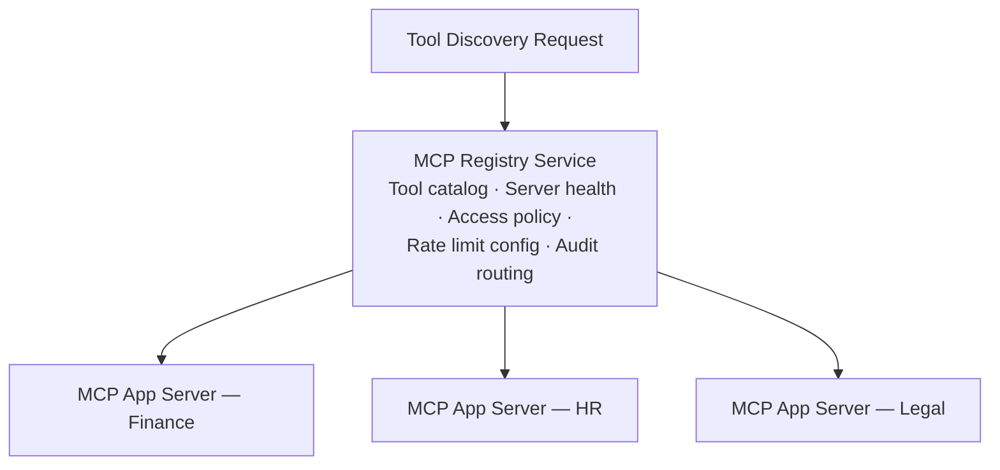

This is part 2 of 3.

**Related:** [Part 1](../02-agui-standards-landscape.md) · [Part 3](../parts/02-agui-standards-landscape-part3.md)

---

## 3. A2UI Deep Dive (v0.9)

A2UI (Agent-to-UI) is a declarative specification developed by Google for generative UI. An agent emits JSON describing UI surfaces; the frontend renders those surfaces using its native component library. A2UI is part of the Oracle Open Agent Spec three-layer model.

**Status:** v0.9 — experimental as of July 2026, not yet GA  
**Origin:** Google  
**Transport:** Carried inside AG-UI CUSTOM events  
**Design Philosophy:** Safe (no arbitrary code execution), declarative (fully described by JSON schema), framework-agnostic (identical JSON renders on web, mobile, and desktop)

### 3.1 Design Philosophy

| Principle | Implementation | What It Prevents |
| --- | --- | --- |
| **No arbitrary code execution** | A2UI widgets are JSON data, never executable code | XSS, code injection through generative UI surfaces |
| **Schema validation required** | Every A2UI payload must validate against the A2UI JSON Schema before rendering | Malformed or malicious widget trees reaching the render layer |
| **Framework-agnostic** | A2UI defines widget semantics, not implementation; each host renders with native components | Vendor lock-in; enables same agent to target web, mobile, and desktop |
| **Declarative over imperative** | Widgets describe WHAT to show, not HOW to show it | Non-portable rendering logic embedded in agent output |
| **Safe defaults** | Unknown widget types are rendered as text fallbacks | Breaking changes in A2UI spec versions do not crash existing clients |



*A2UI's declarative render path: an agent emits a JSON widget tree over an AG-UI CUSTOM event; the host client validates it against the A2UI schema before handing it to native components, falling back to plain text for unknown widget types.*

### 3.2 Widget Catalog

| Widget Type | Description | Key Properties | Renders As |
| --- | --- | --- | --- |
| `text` | Styled text block | `content`, `style` (heading/body/caption/code), `markdown` (bool) | Paragraph, heading, code block |
| `form` | Data collection form | `fields` (array), `submit_label`, `validation_rules` | Native form with labeled inputs |
| `table` | Tabular data display | `columns` (array), `rows` (array), `sortable` (bool), `filterable` (bool) | Data grid |
| `chart` | Data visualization | `chart_type` (bar/line/pie/scatter), `data`, `axis_labels` | Chart rendered by host library |
| `card` | Summary card with optional actions | `title`, `body` (widgets array), `actions` (array) | Card component |
| `carousel` | Swipeable card collection | `items` (array of cards), `orientation` | Horizontal/vertical scroller |
| `action` | Button or action trigger | `label`, `style` (primary/secondary/danger/ghost), `action_type` (approve/reject/navigate/custom), `payload` | Button |
| `progress` | Step progress indicator | `steps` (array), `current_step`, `style` (linear/circular/stepper) | Progress bar or stepper |
| `badge` | Status indicator | `text`, `color`, `icon` | Chip/tag |
| `divider` | Visual separator | `style` (horizontal/vertical), `weight` | HR or vertical rule |
| `image` | Image display | `url`, `alt`, `width`, `height` | Img element (URL must be allowlisted) |
| `link` | Hyperlink | `href`, `label`, `external` (bool) | Anchor (external links open new tab) |

### 3.3 JSON Schema Reference

```json
{
  "$schema": "https://a2ui.dev/schema/v0.9/surface.json",
  "type": "object",
  "required": ["type"],
  "properties": {
    "type": {
      "type": "string",
      "enum": ["text","form","table","chart","card","carousel","action",
               "progress","badge","divider","image","link"]
    },
    "id": { "type": "string" },
    "title": { "type": "string" },
    "style": { "type": "string" },
    "body": {
      "type": "array",
      "items": { "$ref": "#" }
    },
    "fields": {
      "type": "array",
      "items": {
        "type": "object",
        "required": ["name", "type"],
        "properties": {
          "name": { "type": "string" },
          "type": { "type": "string", "enum": ["text","number","date","select","multiselect","checkbox","textarea"] },
          "label": { "type": "string" },
          "required": { "type": "boolean" },
          "options": { "type": "array", "items": { "type": "string" } },
          "validation": { "type": "object" }
        }
      }
    },
    "columns": {
      "type": "array",
      "items": {
        "type": "object",
        "required": ["key", "label"],
        "properties": {
          "key": { "type": "string" },
          "label": { "type": "string" },
          "sortable": { "type": "boolean" },
          "type": { "type": "string", "enum": ["text","number","date","currency","badge","link"] }
        }
      }
    },
    "rows": {
      "type": "array",
      "items": { "type": "object" }
    },
    "actions": {
      "type": "array",
      "items": { "$ref": "#" }
    }
  }
}
```

### 3.4 A2UI vs. Comparable Technologies

| Dimension | A2UI v0.9 | React Server Components | JSON Schema Form | OpenAI Tool Cards |
| --- | --- | --- | --- | --- |
| **Execution model** | Pure declarative JSON, no execution | Server renders React components (JSX) | JSON Schema drives form generation | JSON definition, platform renders |
| **Arbitrary code** | Prohibited by design | Yes (server-side React) | Limited (validators) | No |
| **Framework dependency** | None (host renders with native widgets) | React (Next.js / Remix) | Various libraries | OpenAI platform |
| **Mobile support** | Yes (same JSON, different renderer) | Limited (RN not standard) | Library-dependent | No (web only) |
| **Widget completeness** | Forms, tables, charts, cards, actions | Arbitrary (full React) | Forms only | Card with two actions |
| **Agent-native** | Yes (designed for LLM output) | No (designed for web rendering) | No (designed for form generation) | Yes (designed for tool approval) |
| **Streaming** | Yes (A2UI travels in AG-UI stream) | Partial (server streaming) | No | No |
| **GA status** | v0.9 experimental | Production (Next.js 14+) | Production (various libs) | Production |
| **Validation** | JSON Schema required | TypeScript type checking | JSON Schema | Platform-enforced |

**Choose A2UI when:**

- The agent must render task-appropriate UI components dynamically without predefined templates
- The same agent output must be rendered across web, mobile, and desktop natively
- Arbitrary code execution in generative UI is a security concern
- The organization is building on top of AG-UI and wants a standardized declarative surface format

**Choose React Server Components when:**

- The application is React/Next.js exclusively; mobile is not a requirement
- Rich interactive server-rendered components are needed beyond A2UI's widget catalog
- The team has strong React expertise and wants maximum rendering flexibility

**Choose JSON Schema Form when:**

- The sole requirement is dynamic form generation from a schema
- A2UI's full widget catalog is not needed

### 3.5 Production Readiness Assessment (July 2026)

| Criterion | Status | Notes |
| --- | --- | --- |
| Schema stability | Low — v0.9 is pre-GA | Breaking schema changes expected before 1.0 |
| Widget coverage | Moderate — 12 widget types | Charts require host library integration |
| Accessibility | Partial — spec mentions ARIA roles | No conformance certification yet |
| Performance | Good — pure JSON, lightweight | No rendering performance guarantees in spec |
| Security audit | Not yet completed | Formal security review scheduled for 1.0 |
| Browser support | Host-dependent | Spec does not define minimum browser targets |
| Mobile support | Theoretical — no reference mobile renderer | Requires per-platform implementation |

:::warning A2UI v0.9 — Use with Caution in Production
    A2UI is experimental. For production enterprise deployments, either implement static/typed generative UI (using AG-UI CUSTOM events with your own component registry) or adopt A2UI with explicit version pinning and a migration plan for the 1.0 breaking changes.

---

## 4. MCP Apps

MCP Apps is an architectural pattern (originally standardized through CopilotKit and the OpenAI Apps SDK ecosystem) where MCP servers expose tools WITH associated UI resources bundled alongside them. When an agent calls a tool from an MCP App server, the frontend automatically fetches and renders the corresponding UI component.

### 4.1 Architecture



*MCP Apps architecture: each tool definition pairs with a matching UI resource on the server; the agent backend calls tools while the middleware fetches and emits the corresponding UI component.*

### 4.2 Frontend Tool Execution Lifecycle

```mermaid
sequenceDiagram
    participant Agent
    participant MW as MCPAppsMiddleware
    participant Server as MCP Server
    participant Client as CopilotKit Client
    participant User

    Agent->>MW: calls tool "approve_invoice" via MCP
    MW->>MW: intercepts TOOL_CALL_START
    MW->>Server: look up "approve_invoice" in resource registry
    Server-->>MW: InvoiceApprovalPanel.tsx
    MW->>Client: CUSTOM event {type:"mcp_app_ui", component, props: tool_args}
    Client->>Client: render InvoiceApprovalPanel with tool args as props
    User->>Client: interacts with panel (approve / reject / modify)
    Client->>Agent: POST /agent/action {type:"tool_result", result: {approved: true}}
    Agent->>Agent: receives tool result; continues execution
```

*Frontend tool execution lifecycle for MCP Apps: the middleware intercepts the tool call, fetches the matching UI resource, and the rendered panel's user interaction posts a result back to the agent.*

### 4.3 MCP Apps Security Model

| Security Layer | Implementation | Enterprise Requirement |
| --- | --- | --- |
| **UI resource sandboxing** | Components run in sandboxed iframe or isolated renderer | Content Security Policy; no access to parent DOM |
| **Component signing** | MCP server should sign UI resource bundles | Verify signature before rendering (not yet standard) |
| **Approval gate enforcement** | MCPAppsMiddleware enforces HITL for tools marked `requires_approval: true` | Cannot be bypassed by agent instruction |
| **Tool scope limiting** | Each MCP App server exposes only the tools it owns | MCP registry enforces per-server tool namespace |
| **Audit record** | Every tool call + UI interaction logged with correlation ID | OTel trace spans; append-only audit log |

### 4.4 Enterprise MCP Registry Pattern

For organizations operating multiple MCP App servers, a centralized registry provides discovery, governance, and access control:



*Enterprise MCP App registry: a central service governs discovery, health, access policy, and rate limits across per-domain MCP App servers. Policy enforced at the registry: role-based server access (e.g. Finance team → Finance MCP only), data classification gates (PII tools require DLP approval), per-team-per-server rate limiting, and versioned tool routing (e.g. canary 10% to v2, 90% to v1).*

### 4.5 Code Example: Minimal MCP App Server

=== "Python"

    ```python
    # Minimal MCP App server with bundled UI resource
    # Dependencies: pip install mcp fastapi uvicorn

    from mcp.server.fastmcp import FastMCP
    from pathlib import Path

    mcp = FastMCP("invoice-approval-mcp-app")

    # Define a tool
    @mcp.tool()
    def get_invoice(invoice_id: str) -> dict:
        """Retrieve invoice details for review."""
        # Real: fetch from ERP / finance system
        return {
            "id": invoice_id,
            "vendor": "Acme Corp",
            "amount": 94200.00,
            "currency": "USD",
            "line_items": [
                {"desc": "Cloud services", "amount": 80000},
                {"desc": "Support", "amount": 14200}
            ]
        }

    @mcp.tool()
    def approve_invoice(invoice_id: str, approved_by: str, comment: str) -> dict:
        """Approve an invoice after human review."""
        # Real: call finance API; create audit record
        return {"status": "approved", "invoice_id": invoice_id, "approved_by": approved_by}

    # Register UI resources alongside tools
    # The MCP Apps middleware fetches these and renders them when tools are called
    @mcp.resource("ui://approve_invoice")
    def invoice_approval_ui() -> str:
        """React component for invoice approval UI."""
        return Path("components/InvoiceApprovalPanel.tsx").read_text()

    @mcp.resource("ui://get_invoice")
    def invoice_display_ui() -> str:
        """React component for invoice display."""
        return Path("components/InvoiceCard.tsx").read_text()

    if __name__ == "__main__":
        mcp.run(transport="streamable-http", host="0.0.0.0", port=9000)
    ```

---

