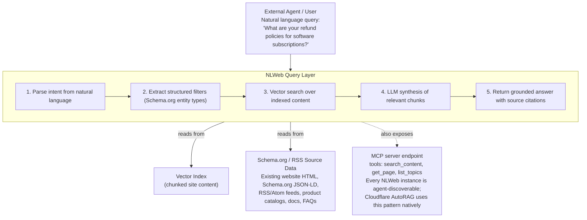
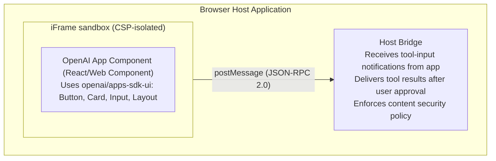
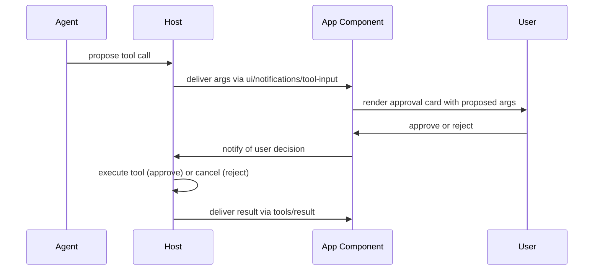
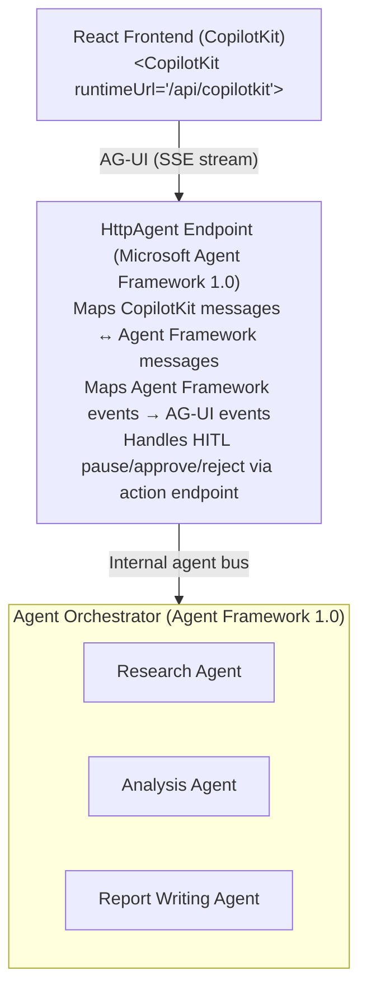
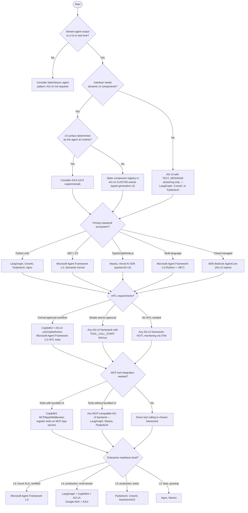

This is part 3 of 3.

**Related:** [Part 1](../02-agui-standards-landscape.md) · [Part 2](../parts/02-agui-standards-landscape-part2.md)

---

## 5. NLWeb

NLWeb is a Microsoft open project that makes any website queryable via natural language. It uses Schema.org markup, RSS feeds, and existing semi-structured web data as a knowledge source, adds vector search and an LLM query layer, and exposes the result via natural language API. Every NLWeb instance is simultaneously an MCP server, making website content discoverable by AI agents.

**GitHub:** `nlweb-ai/NLWeb` (MIT)  
**Reference implementation:** Python  
**Vision:** "Play a similar role to HTML in the emerging agentic web"  
**Cloudflare integration:** Native NLWeb support via AutoRAG (added early 2026)

### 5.1 Architecture



*NLWeb architecture: a query layer parses natural-language questions, searches a vector index built from the site's existing Schema.org/RSS data, and synthesizes a grounded answer — while the same instance also exposes itself as an MCP server.*

### 5.2 Cloudflare AutoRAG Integration

Cloudflare added native NLWeb support via AutoRAG in early 2026. This allows any Cloudflare-hosted website to become an NLWeb-compatible MCP server without self-hosting infrastructure:

| Deployment Model | Setup | Scalability | Cost | Governance |
| --- | --- | --- | --- | --- |
| **Self-hosted NLWeb (Python)** | Clone repo, configure data sources, deploy | Manual scaling | Self-managed | Full control |
| **Cloudflare AutoRAG** | Enable in Cloudflare dashboard, point at content | Auto-scaling (Cloudflare edge) | Usage-based | Cloudflare data processing |
| **Azure AI Search + NLWeb adapter** | Custom integration | Enterprise-scale | Azure consumption | Azure governance |

### 5.3 NLWeb vs. Competing Approaches

| Approach | Query Type | Data Source | Setup Complexity | Agent Integration | Governance |
| --- | --- | --- | --- | --- | --- |
| **NLWeb** | Natural language | Existing website content (Schema.org/RSS) | Low (uses existing markup) | Native MCP server | Content owner controlled |
| **Custom RAG** | Natural language | Any document corpus | High (ingestion, chunking, embedding) | Requires MCP wrapper | Fully custom |
| **Azure AI Search** | Keyword + semantic | Enterprise documents | Medium (index configuration) | Requires MCP wrapper | Microsoft/enterprise |
| **Enterprise portal (SharePoint)** | Keyword | SharePoint content | Low (built-in) | Requires Copilot plugin | Microsoft 365 governance |
| **Knowledge assistant (Guru, Confluence AI)** | Natural language | Internal wiki content | Low | Vendor-specific | Vendor governed |

**Choose NLWeb when:**

- The organization has an existing public-facing website with Schema.org markup or RSS
- The goal is to make existing web content queryable by AI agents without rebuilding the knowledge base
- Low-friction agent integration (every NLWeb instance is already an MCP server) is a priority
- The Cloudflare AutoRAG deployment model is acceptable for the data classification

**Choose Custom RAG when:**

- The knowledge base contains proprietary enterprise documents not suitable for a public-facing NLWeb instance
- Fine-grained access control per document/chunk is required
- The organization requires specific embedding models or retrieval strategies
- Compliance requirements prohibit processing through third-party infrastructure (Cloudflare)

**Do not use NLWeb when:**

- The content is classified or subject to regulatory data residency requirements
- The content is not already in a semi-structured form (Schema.org, RSS, HTML)
- Real-time data (stock prices, live inventory) is required — NLWeb is search-based, not live-query

### 5.4 Governance Considerations

:::warning Public Exposure Risk
    Every NLWeb instance is, by design, publicly queryable as an MCP server. This makes previously navigational-only website content fully extractable by any agent that discovers the MCP endpoint. Organizations must review their website content against data classification policies before enabling NLWeb.

| Governance Concern | Mitigation |
| --- | --- |
| Unintended data exposure | Audit all content indexed by NLWeb before enabling; use `noindex` meta tags for excluded content |
| Rate limit abuse | Implement per-caller rate limiting at the MCP server layer |
| Data freshness | Configure crawl/re-index frequency; stale content may produce incorrect agent responses |
| Competitive intelligence extraction | NLWeb makes structured extraction trivial; ensure no proprietary information is on the indexed website |
| PII in web content | Scan website content for PII before indexing; NLWeb does not automatically redact |

---

## 6. OpenAI Apps SDK

The OpenAI Apps SDK was an early standardization of the MCP Apps pattern, using JSON-RPC 2.0 over the browser's `postMessage` API as the transport layer between the host application and the AI-powered app component.

### 6.1 Architecture



*OpenAI Apps SDK architecture: the app component runs inside a CSP-isolated iframe and communicates with the host bridge exclusively via JSON-RPC 2.0 over `postMessage`.*

### 6.2 JSON-RPC 2.0 Transport

| Method | Direction | Purpose |
| --- | --- | --- |
| `ui/render` | App → Host | Request rendering of a UI component |
| `ui/notifications/tool-input` | Host → App | Deliver user-approved tool arguments |
| `tools/execute` | App → Host | Request tool execution |
| `tools/result` | Host → App | Deliver tool execution result |
| `user/approve` | Host → App | Signal user approval of a tool call |
| `user/reject` | Host → App | Signal user rejection |

### 6.3 Card UI Model

OpenAI Apps SDK cards support:

- **Title** — string
- **Body** — rich text or structured data
- **Up to two primary actions:** each action is either a conversation turn or a tool call
- **Metadata** — key-value pairs displayed below card body

The two-action limit was a deliberate UX constraint: avoid decision paralysis on approval cards.

### 6.4 Approval Flow



*OpenAI Apps SDK approval flow: the host mediates every step between the agent's tool proposal and the app component's approval card, only executing after explicit user approval.*

### 6.5 Relationship to MCP Apps

The OpenAI Apps SDK pattern (tool + UI bundle in a sandboxed component, approval gate required) was the precursor to the MCP Apps specification. Organizations using the OpenAI Apps SDK should plan migration to the MCP Apps standard when it reaches full production maturity, as MCP Apps provides:

- Protocol standardization across vendors (not OpenAI-specific)
- Native AG-UI integration (no postMessage bridge required)
- Richer widget catalog (A2UI) vs. fixed card schema
- Centralized enterprise MCP registry support

---

## 7. Microsoft Agent Framework 1.0

Microsoft Agent Framework 1.0 was released in April 2026 as a production-ready multi-agent orchestration framework for Python and .NET. It includes first-party AG-UI integration via the `HttpAgent` endpoint pattern.

### 7.1 Core Capabilities

| Capability | Python SDK | .NET SDK |
| --- | --- | --- |
| Multi-agent orchestration | Yes | Yes |
| Multi-provider model support | Yes (Azure OpenAI, OpenAI, Anthropic, Bedrock) | Yes |
| AG-UI transport (HttpAgent) | Yes | Yes |
| SSE streaming | Yes | Yes |
| HITL interrupt support | Yes | Yes |
| Azure managed identity | Yes | Yes |
| OpenTelemetry integration | Yes | Yes |
| Enterprise SLA | Yes (Azure support) | Yes |

### 7.2 AG-UI Integration Pattern



*Microsoft Agent Framework 1.0 integration: a CopilotKit frontend streams over AG-UI to an HttpAgent endpoint, which translates between CopilotKit and Agent Framework message formats and routes to a multi-agent orchestrator.*

### 7.3 Azure Deployment Targets

| Target | Use Case | AG-UI Connectivity | Scale |
| --- | --- | --- | --- |
| **Azure App Service** | Simple HTTP agent endpoint | Direct HTTPS + SSE | Up to 10 concurrent runs per instance |
| **Azure Container Apps** | Microservices architecture | Ingress controller + SSE | Auto-scale to zero; KEDA event-driven |
| **Azure Kubernetes Service (AKS)** | High-scale enterprise | Nginx ingress + SSE | Unlimited with HPA; best for >100 concurrent |
| **Azure Functions** | Event-driven agent triggers | HTTP trigger + SSE | Cold start latency; use Premium plan for SSE |

### 7.4 Code Example: Agent Framework with AG-UI

=== "Python"

    ```python
    # Microsoft Agent Framework 1.0 + AG-UI HttpAgent
    # pip install microsoft-agent-framework copilotkit-runtime

    from microsoft_agent_framework import (
        AgentApplication, Agent, HttpAgentEndpoint, AgentRunContext
    )
    from microsoft_agent_framework.ag_ui import AGUIAdapter
    from opentelemetry import trace

    tracer = trace.get_tracer("my-agent")

    # Define a specialized agent
    class ResearchAgent(Agent):
        name = "research_agent"
        description = "Searches internal knowledge base and external sources"

        async def run(self, ctx: AgentRunContext) -> str:
            with tracer.start_as_current_span("research_agent.run"):
                # Access AG-UI streaming context
                await ctx.emit_step("research", "Searching knowledge base")
                results = await ctx.call_tool("search_kb", query=ctx.goal)
                await ctx.emit_step_complete("research", f"Found {len(results)} results")
                return "\n".join(r["summary"] for r in results)

    # Orchestrator agent
    class OrchestratorAgent(Agent):
        name = "orchestrator"
        sub_agents = [ResearchAgent()]

        async def run(self, ctx: AgentRunContext) -> str:
            # Delegate to research agent via A2A
            research_result = await ctx.delegate(
                agent="research_agent",
                goal=ctx.goal,
                scoped_state={"session_id": ctx.session_id}
            )
            # Continue with analysis...
            return f"Analysis based on: {research_result}"

    # Create AG-UI-compatible HTTP endpoint
    app = AgentApplication()
    app.register(OrchestratorAgent())

    endpoint = HttpAgentEndpoint(
        app=app,
        adapter=AGUIAdapter(),
        hitl_tools=["write_report", "send_email"],  # tools requiring approval
        auth_provider="azure_managed_identity"
    )

    # Mount as FastAPI endpoint
    from fastapi import FastAPI
    api = FastAPI()
    api.include_router(endpoint.router, prefix="/agent")

    # Deploy with: uvicorn main:api --host 0.0.0.0 --port 8080
    ```

---

## 8. Framework Comparison Matrix

The following matrix covers 15 frameworks and protocols relevant to enterprise agentic UI architecture. Enterprise Readiness (L1–L5) is assessed across: production deployments, enterprise SLA, governance tooling, security certifications, and multi-tenant support.

| Framework / Protocol | Protocol | Frontend Framework | Backend Framework | Streaming | Generative UI | HITL Support | MCP Compatible | A2A Compatible | Enterprise Readiness | License | Maturity |
| --- | --- | --- | --- | --- | --- | --- | --- | --- | --- | --- | --- |
| **AG-UI** | AG-UI (own) | Any | Any | Native (SSE) | Yes (static + A2UI) | Native (pause/approve/edit/retry) | Complementary | Complementary | L4 | Apache 2.0 | Production |
| **CopilotKit** | AG-UI | React (primary) | Any AG-UI backend | AG-UI stream | Yes (component registry + A2UI) | Yes (useCopilotAction render) | Yes (MCPAppsMiddleware) | Via orchestrator | L4 | MIT | Production |
| **A2UI** | Carried in AG-UI | Host-rendered | AG-UI backend | Via AG-UI | Native (is the spec) | Via AG-UI | No | No | L2 (v0.9 experimental) | Google | Experimental |
| **NLWeb** | MCP (as server) | N/A (query API) | Python | No | No | No | Native (IS MCP server) | No | L3 | MIT | Production |
| **OpenAI Apps SDK** | JSON-RPC 2.0/postMessage | React | OpenAI platform | No (postMessage) | Card UI | Yes (approval gate) | Evolving → MCP Apps | No | L3 | MIT | Production |
| **Microsoft Agent Framework 1.0** | AG-UI (HttpAgent) | CopilotKit (via AG-UI) | Python, .NET | AG-UI SSE | Via AG-UI + A2UI | AG-UI HITL | Yes | Yes (A2A) | L5 | MIT | Production (Apr 2026) |
| **Vercel AI SDK** | Streaming (custom) | React/Next.js | Node.js | Yes (RSC + stream) | React Server Components | Partial (no standard) | Partial | No | L3 | Apache 2.0 | Production |
| **LangGraph** | AG-UI (1st party) | CopilotKit (via AG-UI) | Python, JS | AG-UI native | Via AG-UI | Via AG-UI | Yes | Yes | L4 | MIT | Production |
| **Semantic Kernel** | AG-UI (planned) | .NET/Python | .NET, Python | Partial | Partial (plugin UI) | Manual implementation | Yes | Partial | L4 | MIT | Production |
| **AutoGen / AG2** | AG-UI (1st party) | CopilotKit (via AG-UI) | Python | AG-UI native | Via AG-UI | Via AG-UI | Yes | Yes | L3 | MIT | Production |
| **CrewAI** | AG-UI (1st party) | CopilotKit (via AG-UI) | Python | AG-UI native | Via AG-UI | Via AG-UI | Yes | Yes | L3 | MIT | Production |
| **Agno** | AG-UI (1st party) | CopilotKit (via AG-UI) | Python | AG-UI native | Via AG-UI | Via AG-UI | Yes | No | L2 | Apache 2.0 | Beta |
| **Mastra** | AG-UI (1st party) | CopilotKit (via AG-UI) | TypeScript | AG-UI native | Via AG-UI | Via AG-UI | Yes | No | L2 | Apache 2.0 | Beta |
| **PydanticAI** | AG-UI (1st party) | CopilotKit (via AG-UI) | Python | AG-UI native | Via AG-UI | Via AG-UI | Yes | No | L3 | MIT | Production |
| **Google ADK** | AG-UI (1st party) + A2UI | Any (via AG-UI) | Python | AG-UI native | A2UI native | Via AG-UI | Yes | Yes (A2A native) | L4 | Apache 2.0 | Production |

**Enterprise Readiness Scale:**  
L1 = Proof of concept only · L2 = Experimental / early adopter · L3 = Production-ready, limited enterprise features · L4 = Production-ready, enterprise features (SLA, governance, multi-tenant) · L5 = Enterprise-grade, certified, full lifecycle support

---

## 9. Decision Tree: Which Protocol or Framework Should I Choose?



*Protocol/framework selection decision tree: from streaming and dynamic-UI needs, through backend ecosystem, HITL model, MCP integration, to enterprise readiness tier.*

**Special cases:** making website content agent-queryable → NLWeb; Cloudflare-hosted content → Cloudflare AutoRAG (NLWeb pattern); existing OpenAI platform investment → OpenAI Apps SDK, then plan migration to MCP Apps.

---

## 10. Production Considerations

### 10.1 Operational Requirements Checklist

**Transport**
- [ ] TLS 1.3 on all AG-UI connections
- [ ] Mutual TLS for backend-to-agent connections
- [ ] Connection timeout configured (idle SSE connections)
- [ ] SSE reconnection logic in client (EventSource retry)
- [ ] WebSocket fallback for environments blocking SSE

**Authentication**
- [ ] Short-lived JWTs with audience binding
- [ ] OBO flow configured for enterprise tool access
- [ ] API key rotation policy
- [ ] Rate limiting per user per tenant

**Reliability**
- [ ] AG-UI server behind load balancer with sticky sessions (SSE)
- [ ] Run state persisted to durable storage (not in-memory only)
- [ ] Interrupt handler does not leak resources on cancellation
- [ ] TOOL_CALL_RESULT retry on transient tool failures

**Observability**
- [ ] OTel spans on every AG-UI event (trace ID propagated)
- [ ] run_id and thread_id in all log lines
- [ ] Metrics: events/second, HITL approval rate, run duration, error rate
- [ ] Audit log: append-only, tool call args + user identity + decision

**Security**
- [ ] CUSTOM event payload validated against JSON Schema
- [ ] MCP App UI resources sandboxed (CSP iframe)
- [ ] Tool call args sanitized before execution
- [ ] Output guardrails on TEXT_MESSAGE stream (PII, safety)

**Testing**
- [ ] AG-UI conformance test suite against all event types
- [ ] Load test: 100 concurrent SSE streams
- [ ] Chaos test: mid-stream tool failure, SSE disconnect, timeout
- [ ] HITL approval latency test (P99 approval round-trip)

:::tip Cross-Reference: Observability
    For OTel span schema specific to AG-UI events (run spans, step spans, tool call spans), see [Reliability, Observability & Governance](../../../architecture/43-agentic-ai-reliability-observability-governance.md). For security hardening beyond this page, see [Agentic AI Security & Identity](pathname:///archon/trust/agentic-ai-security-identity) OWASP ASI mapping.
