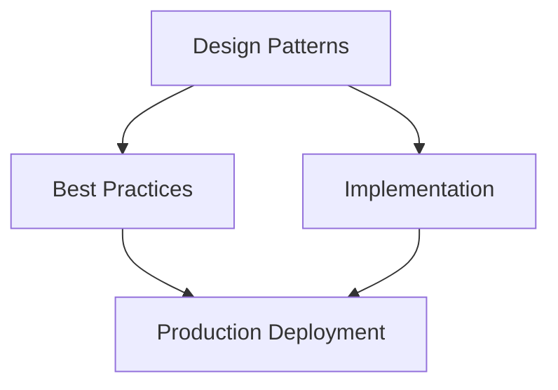

## Architecture Overview

## 5. Memory Anti-patterns

| Name | Description | Risk | Detection | Mitigation |
| --- | --- | --- | --- | --- |
| **Memory Leak** | Agent continuously adds to memory stores with no eviction, archival, or size limits. | Storage costs grow unboundedly. Memory retrieval quality degrades as noise accumulates. | Memory store size grows monotonically with no plateau. | Implement TTL-based eviction. Archive low-relevance memories. Cap memory store size per user. |
| **No TTL** | Memory entries have no expiry date and are retained indefinitely. | Memory about a user's job at Company X retained 3 years after they left. Irrelevant or wrong personalization. | Memory store contains entries with `created_at` but no `expires_at`. | Assign TTL to every memory type. Preferences: 6 months. Episodic: 90 days. Procedural: 1 year. Review periodically. |
| **Cross-tenant Contamination** | Shared memory pool across all users; no namespace isolation by tenant or user. | User A's memories leak to User B's sessions. PII exposure. Regulatory violation. | Memory queries return results from other users' sessions. | Namespace every memory entry with `tenant_id` + `user_id`. Enforce partition in every read/write operation. |
| **Memory Without Consent** | System stores personal data in long-term memory without explicit user consent or disclosure. | GDPR/CCPA violation. Privacy harm. Unable to fulfill erasure requests. | Memory stored before privacy notice displayed. No consent record linked to memory entries. | Obtain informed consent before storing any personal data in long-term memory. Link consent record to each memory entry. |
| **Can't Delete Memories** | No mechanism for users to view, correct, or delete their long-term memories. | GDPR Right to Erasure violation. Users cannot correct wrong or embarrassing stored information. | No "Your memories" UI panel. No erasure API. | Implement memory management UI. Support per-memory deletion and bulk erasure. Propagate deletion through all stores (vector DB, cache, backup). |
| **Over-personalization** | Agent recalls old, irrelevant, or embarrassing user interactions in unrelated contexts. | Unsettling "the AI is watching me" feeling. Trust erosion. User churn. | Users report feeling uncomfortable about specific details the agent remembers. | Implement relevance filtering before memory recall. Only surface memories relevant to the current task. Offer visibility into what's remembered. |
| **Under-personalization** | Agent ignores clear, repeated user preferences because they are not stored in memory. | Users re-state the same preferences every session. Perceived as poor quality product. | User says "I already told you I prefer bullet points" multiple times. | Extract preference signals from explicit statements and implicit behavior. Store in episodic memory. Apply on next session. |
| **Memory Without Access Control** | No authentication on memory service; any agent or service can read or write any user's memories. | Agent spoofing to read/poison target user's memory. Cross-tenant data leak. | Memory service has no auth; accessible by any internal service. | Require authentication on all memory API calls. Validate that caller has access to the target user's memory partition. |
| **No Memory Backup** | Long-term memory stores have no backup policy. | Disk failure or accidental deletion destroys all personalization data with no recovery path. | Memory store deployed without backup configuration. | Schedule automated backups. Test restoration procedure quarterly. |
| **Flat Memory (No Tiers)** | All memory stored in a single data store regardless of access frequency or latency requirement. | Either expensive (all in fast memory) or slow (all in cold storage). No optimization. | Same latency for recently accessed and rarely accessed memories. | Implement tiered memory: hot (Redis, &lt;10ms), warm (vector DB, &lt;100ms), cold (object storage, &lt;1s). Promote/demote based on access frequency. |
| **Synchronous Memory Writes Blocking Inference** | LLM inference waits for memory write to complete before returning response to user. | Memory write latency (50-200ms) added to every inference. Unnecessary user-facing latency. | P95 inference latency includes memory write time. | Fire-and-forget for memory writes. Return response immediately; write to memory asynchronously. |
| **Unencrypted Memory** | Memory stores containing personal data are not encrypted at rest. | Storage breach exposes all user memory data in plaintext. | Memory database has no encryption-at-rest configured. | Enable encryption at rest for all memory stores. Use customer-managed keys for enterprise deployments. |
| **Shared Memory Pool Across Users** | Memory pool shared across all users with only application-level filtering to separate them. | SQL injection, code path bug, or misconfiguration exposes all users' memories to a single query. | A single SQL query without a `user_id` WHERE clause can return all users' memories. | Enforce tenant isolation at the database level (separate tables, schemas, or namespaces per tenant). Never rely solely on application-layer filtering. |
| **No Memory Audit Log** | No record of when memories were created, modified, accessed, or deleted. | GDPR accountability requirement not met. Incident investigation impossible. | Memory store has no `created_at`, `last_accessed`, `modified_by` metadata. | Log all memory lifecycle events to immutable audit log: create, read, update, delete, expiry. |
| **Over-trusting Episodic Memory** | Agent treats past interaction memories as ground truth without recency validation. | User's job, employer, preferences, or situation may have changed. Agent gives advice based on outdated profile. | Agent says "As you mentioned last year, you work at [Company X]" to someone who has since changed jobs. | Add recency weighting to memory retrieval. Surface staleness indicators. Ask users to confirm outdated memories in relevant contexts. |

---

## 6. Tool Anti-patterns

| Name | Description | Risk | Detection | Mitigation |
| --- | --- | --- | --- | --- |
| **Tool Explosion** | Agent has 30, 50, or 100+ tools registered, all visible in the context window simultaneously. | LLM tool selection quality degrades measurably above 20 tools. Model picks wrong tool or combines tools incorrectly. | Tool selection accuracy in eval drops as tool count increases. | Group tools by domain. Dynamically load only relevant tools based on task routing. Keep active tool list under 15-20. |
| **Tool Ambiguity** | Multiple tools have overlapping descriptions or nearly identical capabilities, making it unclear which to choose. | LLM picks the wrong tool, or alternates between tools inconsistently. | Two tools called `search_documents` and `find_documents` with similar descriptions. | Audit tool descriptions for uniqueness. Consolidate overlapping tools. Make descriptions explicitly exclusive. |
| **Idempotency Failure** | Tools that write data are not idempotent; calling them twice creates duplicate records, sends duplicate emails, or charges twice. | Agent retries on timeout and the action executes twice. Duplicate records, double charges, spam. | Tool has no deduplication key. Retries on failure are unguarded. | Design all write tools to be idempotent via idempotency key. Return the original result on duplicate call. |
| **No Tool Error Handling** | Tool failure propagates as an unhandled exception, crashing the agent run. | One failing tool terminates the entire multi-step task with data loss. | Tool errors appear as unhandled exceptions in traces. | Wrap all tool calls with structured error handling. Return typed error results. Allow agent to reason about failures and recover. |
| **No Tool Timeout** | Tool calls have no maximum execution time. | Slow external API or database query hangs the entire agent indefinitely. | Tool calls with no `timeout` parameter. P99 tool latency >> P95 (long tail hangs). | Set timeout on every tool call. Surface timeout as a structured error for agent to handle gracefully. |
| **Tool Call Loop** | Agent retries a failing tool indefinitely without an exit condition. | Infinite cost accumulation. System resource exhaustion. Tool rate limit triggers. | Agent makes 50+ calls to the same tool in one session. | Implement maximum retry count (recommended: 3). Exponential backoff. After max retries, surface error to user. |
| **Sync Tool in Async Pipeline** | Tool is implemented as a blocking synchronous function in an otherwise async agent pipeline. | Blocks the entire event loop during tool execution. Other concurrent tasks are starved. | Event loop blocking detected in APM; high P50 latency on all operations when specific tool is called. | Convert tool to async. If using third-party sync SDK, run in thread pool executor. |
| **Hardcoded Tool Credentials** | API keys, database passwords, or connection strings for tool backends are hardcoded in tool configuration files. | Credentials exposed in version control, container images, or logs. | Secret scanning finds credentials in source code or config files. | Use vault integration (HashiCorp Vault, AWS Secrets Manager). Inject credentials at runtime via environment variables or sidecar. |
| **No Tool Rate Limiting** | Tools make unlimited calls to rate-limited external APIs. | API rate limit hit → tool failures → cascading agent failures → poor user experience. | External API returns 429 errors. No backoff in tool implementation. | Implement per-tool rate limiting with token bucket. Surface rate limit state as tool metadata. |
| **Tool Output Injection** | Tool responses injected verbatim into agent context without content safety checks. | Tool returns data containing injected instructions that the agent executes as commands. | Agent behaves unexpectedly after processing certain tool responses. | Apply content safety filter to all tool responses before context injection. |
| **Missing Tool Schema Validation** | Tool input/output schemas are not validated; any value is accepted or returned. | Agent passes malformed arguments; tool executes with unexpected inputs; security vulnerabilities. | Tool accepts requests with missing required fields or unexpected types without error. | Define strict JSON Schema for every tool. Validate inputs before execution. Validate outputs before injection into context. |
| **Version-locked Tools** | Tool clients are pinned to a specific API version with no mechanism to update. | External API deprecates the version; tool breaks silently or with cryptic errors. | Tool client uses hardcoded API version string with no update process. | Support configurable API versions. Monitor for deprecation notices. Implement compatibility shims. |
| **Over-broad Tool Permissions** | Tool is granted permissions beyond what is needed for its stated purpose. | If tool is compromised or misused, blast radius is larger than necessary. | S3 read tool has `s3:*` permissions instead of `s3:GetObject` on specific prefix. | Scope permissions to minimum required for the tool's function. Review and narrow permissions quarterly. |
| **No Tool Health Monitoring** | No monitoring for tool availability, latency, or error rates. | Tool degradation is only discovered when users report problems, not proactively. | No metrics on tool call latency, success rate, or error type distribution. | Instrument every tool with Prometheus metrics: call count, duration, success/failure. Alert on error rate > 5% or latency P95 > threshold. |
| **God Tool** | One tool does everything — search, write, delete, send — providing no granularity for access control or monitoring. | No ability to give read-only access. No ability to audit specific action types. Security and monitoring blind spots. | Single tool with 20+ action types controlled by a `mode` parameter. | Split multi-function tools into single-purpose tools. Each tool should have one clear responsibility. |

---

## 7. Evaluation Anti-patterns

| Name | Description | Risk | Detection | Mitigation |
| --- | --- | --- | --- | --- |
| **No Evaluation** | Agent is deployed to production without any automated evaluation. | No quality baseline. Regressions go undetected. No data to improve the system. | No evaluation runs in CI/CD pipeline. No quality metrics in dashboard. | Implement minimum viable eval before first production deployment: 20-30 golden examples, basic quality metrics. |
| **Happy-path-only Tests** | Evaluation only covers well-formed, polite, in-scope requests. | Edge cases, adversarial inputs, and ambiguous queries fail silently in production. | Eval dataset contains only textbook-correct queries with unambiguous answers. | Include edge cases: ambiguous queries, out-of-scope requests, adversarial inputs, multi-turn conversations, recovery from errors. |
| **Golden Dataset Rot** | Golden evaluation dataset was created at launch and never updated as the system or world changed. | Baseline drifts from actual user behavior. Model optimized for old distribution underperforms on current queries. | Golden dataset accuracy improves over time while real-world quality declines. | Review and update golden dataset quarterly. Add examples from recent production failures. |
| **Uncalibrated LLM-as-Judge** | LLM judge used for automated evaluation without calibration against human judgments. | Judge has known biases (length preference, verbosity, self-preference) that inflate scores for certain models. | Judge scores consistently differ from human scores by > 20%. | Calibrate judge against human annotation. Test for known biases. Use ensemble of judges with different base models. |
| **Evaluating Prompts Not Behavior** | Evaluation tests prompts in isolation rather than the full agent loop with tools, memory, and real context. | Prompt-level eval passes; full-system eval fails due to tool integration issues. | Eval runs single-turn LLM call; production system is multi-turn with tool calls. | Evaluate the full system end-to-end: user query → planning → tool calls → final response. |
| **No Regression Testing** | New changes are deployed without checking whether they regress existing capabilities. | Prompt change that improves Task A silently breaks Tasks B, C, and D. | No eval gate in CI/CD. Quality metrics not tracked across deployments. | Run full eval suite on every deployment. Block deployment if quality metrics regress by > threshold. |
| **Eval Not Closing Feedback Loop** | Evaluation results are logged but not acted upon to improve the system. | Persistent quality issues never fixed because there is no process to route eval findings to improvement. | Eval results accessible in dashboard but no downstream process to address findings. | Route eval failures to a backlog with SLA. Hold regular calibration reviews where eval findings drive system improvements. |
| **Vanity Metrics** | System optimized for narrow benchmark accuracy that doesn't represent real-world quality. | Strong benchmark numbers, poor user experience. Engineering effort directed at wrong improvements. | System ranks high on standard benchmarks but user satisfaction is low. | Measure what matters: task completion rate in production, user satisfaction score, business outcome metrics. |
| **No Safety Evaluation** | Evaluation only measures helpfulness; never tests for harmful, biased, or unsafe outputs. | Agent passes all helpfulness evals and ships to production where it generates harmful content. | No adversarial safety tests (jailbreaks, sensitive topics, bias probes) in eval suite. | Add red team evaluation: jailbreak attempts, sensitive topic handling, demographic bias probes. Gate deployment on safety scores. |
| **No Baselines** | System evaluated in isolation with no comparison to a previous version, human performance, or simple baseline. | Impossible to know if the system is good or bad, improving or degrading. | Eval shows absolute score of 78% with no context for whether this is high or low. | Establish baselines: previous version, human performance, simple retrieval-only system. Report delta vs. baseline, not just absolute score. |
| **Gaming the Eval** | System is optimized directly for eval metric rather than real-world quality, causing eval to inflate while actual quality stagnates or declines. | Goodhart's Law: eval metric becomes target and ceases to measure what it was designed to measure. | Eval scores improve steadily; user satisfaction stays flat or declines. | Maintain held-out test sets not used for optimization. Rotate eval sets periodically. Use diverse human annotation. |
| **Over-reliance on Automated Eval** | All evaluation is automated; human judgment is never applied to agent outputs. | Subtle quality issues, tone problems, and edge case failures that automated metrics miss accumulate undetected. | No human annotation program. All quality decisions made on automated scores alone. | Schedule regular human annotation sessions (weekly for high-stakes applications). Use human eval to calibrate automated metrics. |
| **No Latency/Cost Evaluation** | Evaluation only measures response quality, not latency or cost. | High-quality but slow and expensive system deployed to production; SLOs breached; cost overruns. | No P95 latency or cost-per-query metrics in eval suite. | Add latency and cost dimensions to eval. Define budgets: max P95 latency, max cost per query. Block deployment if budgets exceeded. |
| **Single-metric Evaluation** | Agent ranked and optimized on a single score (e.g., accuracy) ignoring trade-offs with other dimensions. | High accuracy but unacceptable latency, cost, or safety profile. Blind spots in quality profile. | Evaluation dashboard shows one primary metric with no secondary metrics. | Use multi-dimensional scorecards: quality, safety, latency, cost, reliability, user satisfaction. Make trade-offs explicit. |
| **No Adversarial Cases** | Evaluation contains only well-intentioned user queries; no adversarial, malicious, or stress-test cases. | System fails under real-world conditions: prompt injection, jailbreaks, edge cases, high load. | Agent jailbroken on first day of production deployment. | Include adversarial eval: prompt injection attempts, jailbreaks, edge cases, ambiguous requests, maximum-length inputs. |

---

## 8. Governance Anti-patterns

| Name | Description | Risk | Detection | Mitigation |
| --- | --- | --- | --- | --- |
| **No AI Governance** | Agents deployed without any governance process: no review, no risk assessment, no oversight structure. | Compliance exposure. Unreviewed agents cause harm. No accountability when things go wrong. | Agents deployed without ARB review or risk assessment. | Establish minimum viable governance: registration, risk tier classification, review gate, lifecycle policy. |
| **Shadow AI** | Business units deploy agents without IT, security, or platform team knowledge. | Unvetted models, uncontrolled data access, no security review, no audit trail. | IT discovers agents in production they didn't know existed. | Establish AI governance program with discovery process. Create approved platform that makes "official" agents easy enough that shadow AI is unattractive. |
| **Approval-by-Committee** | Every governance decision requires a committee of 10+ people; approval takes weeks. | Teams bypass governance to meet delivery timelines. Governance theater develops. | Average time from submission to governance decision > 2 weeks. | Implement risk-tiered governance: low-risk agents self-service with checklist; high-risk agents get full review. Target 48-hour SLA for standard reviews. |
| **No Change Management** | Agent behavior changes (prompts, tools, models) deployed without change record, impact assessment, or stakeholder notification. | Behavior changes silently affect users who depend on current behavior. No rollback data. | Agent behavior changed without any change record or notification. | Treat agent behavior changes as production changes: change request, impact assessment, scheduled maintenance window, communication. |
| **Agent Sprawl** | Hundreds of agents deployed with no registry, no ownership tracking, no lifecycle management. | Decommissioned agents accumulate and consume resources. Security vulnerabilities in forgotten agents. No ability to audit AI surface area. | Platform team cannot enumerate all running agents and their owners. | Implement agent registry with mandatory registration. Assign owner to every agent. Trigger periodic ownership review. |
| **No Lifecycle Management** | Agents never formally deprecated or decommissioned; they run until they break. | Security vulnerabilities accumulate. Zombie agents consume resources. Users rely on unsupported agents. | Agents from 2+ years ago still serving traffic with no review since launch. | Define lifecycle policy: Active → Maintenance → Deprecated → Retired. Trigger lifecycle review when agent hasn't been updated in > 12 months. |
| **Treating AI Like Traditional Software** | Standard software SDLC applied to AI development without AI-specific processes (eval gates, drift monitoring, responsible AI review). | AI-specific failure modes (hallucination, bias, capability drift) not caught by traditional processes. | No eval gate in CI/CD. No drift monitoring in production. No AI-specific review checklist. | Add AI-specific gates to SDLC: eval gate, safety review, responsible AI checklist, post-deployment drift monitoring. |
| **Missing Audit Trail** | Agent actions not logged comprehensively enough to reconstruct decisions and outcomes for compliance or incident investigation. | Compliance failure. Incident investigation requires weeks because logs are insufficient. | Incident investigation reveals gaps in what was logged. | Define audit log schema: who, what, when, why (task context), what data was accessed, what actions were taken, what was the authorization. Store immutably. |
| **No Model Governance** | Any developer can upgrade the LLM model without a review process or regression testing. | Silent quality regression when model changes behavior. Compliance implications of changing model in regulated use case. | Model version changes deployed without eval regression testing or change record. | Require model upgrade proposals to go through same eval gate and change review as prompt changes. |
| **Perpetual Experimental Status** | Agents launched as "pilot" or "beta" never graduate to official production status; remain in perpetual experimental limbo. | No formal SLAs. Support responsibilities unclear. Security and governance standards not applied. | Agents labeled "beta" or "experimental" that have been running for > 12 months with production traffic. | Define graduation criteria for pilot → production. Time-box pilots (max 3 months). Require formal production readiness review to proceed. |
| **No Responsible AI Review** | Agents deployed without any assessment of fairness, bias, transparency, or potential for harm. | Biased outputs affect marginalized groups. EU AI Act compliance gap. Reputational damage. | No responsible AI review in deployment checklist. | Add responsible AI review gate: fairness testing, bias probing, transparency assessment, harm scenario analysis. |
| **Change Without Evaluation** | Agent behavior changed (prompt update, model upgrade, tool change) without running evaluation suite. | Silent regression. Quality degradation in production before anyone notices. | Change deployed directly without eval run. | Block deployment if eval suite has not been run and passed since last change. |
| **No Rollback Governance** | No defined process for rolling back agent behavior when a problem is detected in production. | Quality regression persists for days/weeks while rollback coordination chaos unfolds. | First time a rollback is needed, it takes 3 days to figure out the process. | Pre-define rollback procedure for each agent: rollback trigger criteria, rollback scope, authorization required, communication template. |
| **Non-immutable Audit Log** | Audit log records can be modified, deleted, or overwritten. | Tampered audit log fails regulatory audit. Evidence destroyed in incident investigation. | Audit log stored in mutable database table with no write-protection. | Store audit log in append-only data store (AWS CloudTrail, Azure Monitor, immutable S3). Sign log entries. |
| **No Third-party Assessment** | High-risk AI systems never subjected to external audit or red team assessment. | Internal blind spots persist. Regulatory compliance gaps undetected until regulator inspects. | No external security assessment or AI audit ever commissioned. | Schedule annual third-party security and responsible AI assessment for high-risk systems. |

---

## 9. Operations Anti-patterns

| Name | Description | Risk | Detection | Mitigation |
| --- | --- | --- | --- | --- |
| **No Rollback Plan** | Agent deployed with no documented rollback procedure. | When things go wrong, rollback coordination takes hours; problem persists while team figures out process. | Incident post-mortem reveals rollback took > 2 hours due to no documented procedure. | Before every deployment, document the rollback procedure: what triggers it, how to execute, who authorizes it. |
| **Deploy-and-Forget** | Agent deployed to production with no ongoing monitoring, quality tracking, or health checks. | Quality drift, performance degradation, and accumulating failures go unnoticed until user complaints spike. | No monitoring dashboard. No alerts. Problems first reported by users. | Implement minimum monitoring: task success rate, P95 latency, error rate, cost per session. Set alert thresholds. |
| **Alert Fatigue** | Every INFO log entry and minor warning triggers a PagerDuty alert. | On-call engineers ignore all alerts because they're overwhelmed with noise. Critical alerts missed. | On-call team acknowledges all alerts as false positives without investigation. | Tier alerts by severity. Only page on actionable, high-severity conditions. Route informational alerts to dashboard, not pager. |
| **Manual Prompt Deployments** | Prompt changes deployed by directly editing production configuration with no version control or deployment record. | Untraceable changes. No rollback capability. Production differs from source control. | Production prompt not in version control. Changes have no audit trail. | Treat prompts as code: version control, PR workflow, deployment pipeline, deployment record. |
| **No GitOps** | Agent configurations (prompts, tool lists, model settings) managed outside version control. | No history, no rollback, no review process, no deployment audit trail. | Config changes happen in a UI with no VCS record. | All agent configuration in version control. Configuration changes via PR. Deployment triggered by merge. |
| **No Feature Flags** | New agent features shipped to all users simultaneously with no ability to enable/disable per user or cohort. | Feature regression affects all users immediately. No gradual rollout. No kill switch. | No feature flag system. All users affected by every deployment simultaneously. | Implement feature flags. Launch new features to 1% → 10% → 50% → 100%. Include kill switches for all new features. |
| **Using Prod as Test Bed** | New features, prompt experiments, or model changes tested on production traffic. | Real users experience experimental behavior. Incidents caused by untested code. | Experimental features active in production environment. | Maintain a staging environment that mirrors production. Test all changes in staging before production. |
| **No Capacity Planning** | Agent platform deployed without analysis of expected load, cost, or resource requirements. | Unexpected traffic causes outage. Cost spikes unexpectedly. Platform not sized for peak load. | First major traffic event causes resource exhaustion or cost overrun. | Model expected throughput (RPS, concurrent sessions, tokens/day). Size infrastructure accordingly. Set cost budgets with alerts. |
| **Missing Health Checks** | Agent services have no `/health` or `/ready` endpoints; load balancer cannot distinguish live from dead instances. | Traffic routed to unhealthy instances; requests fail silently. | Load balancer sends traffic to instances that are not serving correctly. | Implement liveness probe (is the process running?) and readiness probe (is the process ready to serve traffic, including LLM provider connectivity?). |
| **No On-call Runbook** | Agents deployed without documented runbooks for common failure scenarios. | On-call engineer has no guidance when alerts fire; mean time to resolution is high. | Post-incident review reveals engineer didn't know what to do when the alert fired. | Create runbook for every alert: what does it mean, what to check, how to resolve. Link runbook from alert definition. |

---

## 10. Deployment Anti-patterns

| Name | Description | Risk | Detection | Mitigation |
| --- | --- | --- | --- | --- |
| **Big-bang Deployment** | New agent version deployed to 100% of users simultaneously with no gradual rollout. | Regression affects all users at once; rollback requires coordination while all users are impacted. | Deployment strategy is "all at once." | Canary release: 1% → 5% → 25% → 100% with automatic rollback if quality metrics regress. |
| **No Shadow Mode** | New agent version never run in shadow mode (parallel execution, results compared, no user impact). | First real traffic exposure reveals problems that shadow mode would have caught. | No shadow testing capability exists. | Run new agent version in shadow mode on 10% of production traffic before canary. Compare results against production version. |
| **Insufficient Load Testing** | Agent platform load-tested at expected average load, not at peak or stress scenarios. | 3x traffic spike causes outage. Auto-scaling doesn't respond fast enough. | Platform behaves correctly up to 100 concurrent users; crashes at 500. | Load test at 2-3x expected peak. Validate auto-scaling responds before limits are reached. Include streaming workloads in load tests. |
| **No Chaos Testing** | System never tested for component failure scenarios (LLM provider outage, tool failure, memory service unavailability). | First real failure reveals missing error handling, cascading failures, and lack of graceful degradation. | First LLM provider outage causes total platform failure. | Run chaos experiments: disable LLM provider, inject tool failures, simulate memory service timeout. Verify graceful degradation at each failure point. |
| **Missing Kubernetes Health Checks** | Agent containers deployed to Kubernetes without `livenessProbe` or `readinessProbe` configured. | Kubernetes routes traffic to pods that have started but are not yet ready. Crashed pods receive traffic. | Pods restart without Kubernetes restart count incrementing (missing liveness). New pod receives traffic before it's ready (missing readiness). | Configure `livenessProbe` (is the pod alive?) and `readinessProbe` (is the pod ready to serve?) for all agent containers. |
| **No Eval Gate Before Prod** | Changes deployed to production without running evaluation suite. | Silent quality regression deployed to all users before anyone detects the problem. | CI/CD pipeline has no eval stage. Changes go directly from tests to production. | Add eval stage to CI/CD. Block deployment if eval suite has not passed since the last change. |
| **No Progressive Delivery** | All changes deployed to all users at once; no canary, blue/green, or ring-based deployment. | Full user impact on any regression. No controlled blast radius. | Deployment to all users simultaneously with no staged rollout. | Implement progressive delivery: canary (1-5% initially), expand based on metrics, automated rollback on SLO breach. |
| **Skipping Staging** | Changes deployed directly from development to production environment. | Untested interactions between components only visible in production. Configuration differences between environments cause production-only bugs. | No staging environment. Changes go directly from local dev to production. | Maintain staging environment configured identically to production. All changes must pass in staging before production. |
| **Model Upgrade Without Regression Test** | LLM model upgraded (new version or different model) without running evaluation regression. | New model version has different behavior on edge cases; silent regression in production. | Model upgrade deployed without evaluation run. | Run full evaluation suite before any model upgrade. Compare scores against previous version baseline. Block upgrade on regression. |
| **No Smoke Tests Post-deploy** | After deployment completes, no automated checks verify the system is functioning correctly. | Silent deployment failure discovered by users, not operators. | Post-deployment period has no automated health check; first signal of failure is user complaint. | Run smoke tests after every deployment: submit 5 representative queries, verify successful tool calls, verify streaming works. Rollback automatically if smoke tests fail. |

---

:::tip Using This Catalog
    Start with **Critical** severity items. Each anti-pattern in this catalog has been observed in production agentic systems — not theoretical failures. Cross-reference:
    - Security patterns → [Security Architecture](security-architecture.md)
    - Context patterns → [Context Engineering](context-engineering.md)
    - Governance patterns → [Governance](governance.md)
    - Evaluation patterns → [Evaluation Framework](evaluation-framework.md)
    - DevSecOps patterns → [DevSecOps](devsecops.md)

## Related Links

- ../03-anti-patterns.md - Part 1
