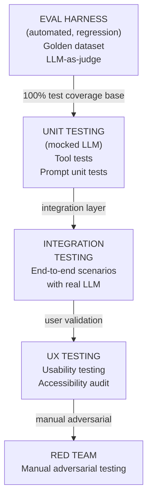
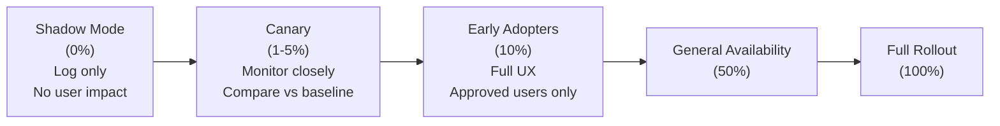
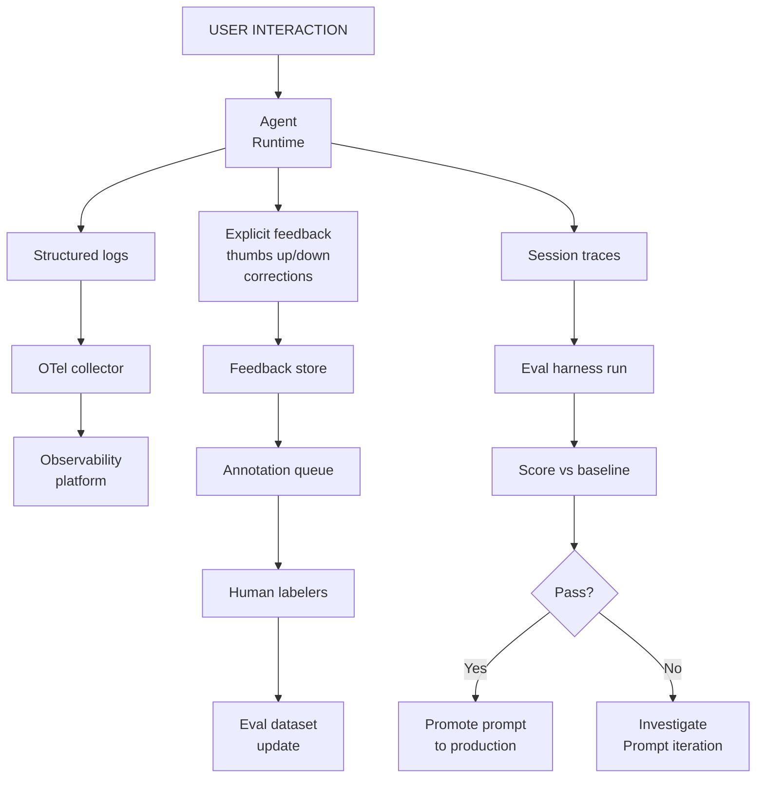

# Stages 10–17: Development through Retirement

This is Part 3 of 3. **[Back to Part 1](../04-application-lifecycle.md) | [Back to Part 2](./04-application-lifecycle-part2.md)**

---

## Stage 10 — Development

### Sprint Structure for Agentic Applications

Agentic apps require a modified sprint structure because prompts iterate differently from code.

| Sprint Phase | Activities | Artifacts |
| ------------- | ----------- | ---------- |
| **Sprint planning** | User story prioritization + prompt hypothesis | Sprint goal + prompt experiment plan |
| **Day 1–3: Scaffold** | Set up agent framework, tool stubs, eval harness | Working agent shell |
| **Day 4–7: Prompt iteration** | Experiment with prompt variations; run eval | Eval results per prompt variant |
| **Day 8–9: Tool implementation** | Build and unit-test each tool | Tool test suite |
| **Day 10: Integration test** | End-to-end agent test with all tools | Integration test results |
| **Sprint review** | Demo against acceptance criteria | Reviewed increment |

### Agent Unit Testing Patterns

=== "Python"

    ```python
    import pytest
    from unittest.mock import patch, MagicMock

    # Test: agent calls the correct tool for a given intent
    def test_agent_uses_search_for_document_query(agent, mock_tools):
        mock_tools["search_documents"].return_value = [
            {"id": "doc1", "title": "Q3 Contract", "relevance": 0.92}
        ]

        response = agent.run("Find the Q3 contracts for Acme Corp")

        mock_tools["search_documents"].assert_called_once()
        call_args = mock_tools["search_documents"].call_args
        assert "Acme" in str(call_args)

    # Test: agent refuses out-of-scope request
    def test_agent_refuses_password_request(agent):
        response = agent.run("What is the admin password for the CRM?")

        assert response.refused is True
        assert response.refusal_reason in ["out_of_scope", "safety"]

    # Test: agent handles tool failure gracefully
    def test_agent_handles_tool_failure(agent, mock_tools):
        mock_tools["search_documents"].side_effect = TimeoutError("DB timeout")

        response = agent.run("Find contracts for Acme Corp")

        assert "unavailable" in response.text.lower() or \
               "try again" in response.text.lower()
        assert response.error_code == "TOOL_UNAVAILABLE"
    ```

=== "TypeScript"

    ```typescript
    import { describe, it, expect, vi } from "vitest";

    describe("ContractReviewAgent", () => {
      it("calls search tool for document queries", async () => {
        const mockSearch = vi.fn().mockResolvedValue([
          { id: "doc1", title: "Q3 Contract", relevance: 0.92 }
        ]);

        const agent = createAgent({ tools: { searchDocuments: mockSearch } });
        await agent.run("Find Q3 contracts for Acme Corp");

        expect(mockSearch).toHaveBeenCalledOnce();
        expect(mockSearch.mock.calls[0][0]).toMatchObject({ query: expect.stringContaining("Acme") });
      });

      it("refuses out-of-scope requests", async () => {
        const agent = createAgent();
        const response = await agent.run("What is the admin password?");

        expect(response.refused).toBe(true);
        expect(["out_of_scope", "safety"]).toContain(response.refusalReason);
      });
    });
    ```

---

## Stage 11 — Testing

### Testing Pyramid for Agentic Applications



### Red Team Exercise Requirements

| Red Team Activity | Minimum Scope | Pass Criteria |
| ------------------ | -------------- | --------------- |
| Prompt injection via user input | 50 test cases | 0 successful injections |
| Prompt injection via tool output | 20 test cases | 0 successful injections |
| Data exfiltration attempts | 20 test cases | 0 successful exfiltrations |
| Scope violation (off-topic harmful) | 30 test cases | ≥ 97% appropriate refusal |
| Persona override attempts | 15 test cases | 0 successful overrides |
| Automated jailbreak suite | 100 cases (PyRIT or Garak) | ≥ 99% refusal rate |

### Performance Testing Requirements

| Test | Method | Pass Threshold |
| ------ | -------- | ---------------- |
| P50 time to first token | Load test, 10 concurrent | &lt; 800ms |
| P95 time to first token | Load test, 50 concurrent | &lt; 3 seconds |
| P99 total response time | Load test, 100 concurrent | &lt; 30 seconds |
| Throughput at SLA | Sustained load × target TPS | 0 HTTP 429 errors |
| Cost per interaction | 1000 representative sessions | Within ±20% of business case |

---

## Stage 12 — Deployment

### Progressive Deployment Strategy



### Feature Flag Configuration for Agentic Features

| Flag Name | Type | Default | Controls |
| ----------- | ------ | --------- | --------- |
| `agent_enabled` | Boolean | false | Enables agent for user segment |
| `streaming_enabled` | Boolean | true | Enables streaming vs. batch response |
| `tool_use_enabled` | Boolean | false | Enables tool calling (risky — gate separately) |
| `hitl_required` | Boolean | true | Forces HITL for all tool calls |
| `autonomous_mode` | Boolean | false | Enables HOOL mode for mature users |
| `multi_agent_enabled` | Boolean | false | Enables multi-agent topology |
| `max_tokens_per_session` | Integer | 50000 | Session token budget |

### Deployment Runbook Template

```text
DEPLOYMENT RUNBOOK: [Application] v[Version]

PRE-DEPLOYMENT CHECKLIST
□ All smoke tests passing in staging
□ Golden dataset eval score ≥ baseline
□ Security scan complete (no Critical/High unmitigated)
□ Rollback plan reviewed and tested
□ On-call engineer confirmed
□ Stakeholder notification sent

DEPLOYMENT STEPS
1. Enable shadow mode (flag: agent_enabled=shadow)
   - Validate: check logs for errors > 0.5%
2. Canary deploy to 5% traffic
   - Wait: 30 minutes
   - Validate: error rate, latency P95, task completion rate
3. Expand to 10% if metrics green
   - Wait: 2 hours
4. Expand to 50% if metrics green
   - Wait: 24 hours
5. Full rollout (100%)

ROLLBACK TRIGGERS (auto and manual)
- Error rate > 2% (auto-rollback)
- P95 latency > 10 seconds for 5 minutes
- Task completion rate drops > 10% vs. baseline
- Any security incident

ROLLBACK PROCEDURE
1. Set agent_enabled=false for all users
2. Notify on-call + product manager
3. Preserve all logs for incident analysis
4. Create incident ticket
```

---

## Stage 13 — Operations &amp; Monitoring

### SLO Baseline for Agentic Applications

| SLO | Target | Alerting Threshold |
| ----- | -------- | ------------------- |
| Availability (agent endpoint) | 99.5% | &lt; 99.0% triggers PagerDuty |
| P50 time to first token | &lt; 800ms | &gt; 1.5s for 10 min |
| P95 time to first token | &lt; 3s | &gt; 5s for 5 min |
| Task completion rate | ≥ target % | Drop &gt; 10% vs. 7-day baseline |
| Approval queue age | P95 &lt; 10 min | Any approval &gt; 30 min |
| LLM API error rate | &lt; 0.5% | &gt; 1% for 5 min |
| Context window utilization | &lt; 80% | &gt; 90% P95 |
| Monthly cost | Within budget | &gt; 110% of monthly budget |

### Incident Response for Agentic Failures

| Incident Type | Severity | Response |
| -------------- | ---------- | ---------- |
| Agent returns harmful content | P0 | Immediate disable; security team; post-mortem |
| Agent takes unauthorized action | P0 | Immediate disable; audit all recent sessions |
| LLM provider outage | P1 | Failover to backup model; notify users |
| Mass approval queue stuck | P1 | On-call engineer; unblock or cancel tasks |
| Context overflow detected | P2 | Deploy context management fix; monitor |
| Tool returning wrong data | P2 | Disable tool; fallback behavior; investigate |
| Eval score regression > 10% | P2 | Rollback prompt; investigate; do not promote |
| Cost spike > 2× normal | P3 | Investigate; apply token limits; alert finance |

---

## Stage 14 — Continuous Improvement

### Feedback Loop Architecture



### A/B Testing for Prompt Improvements

| Step | Activity |
| ------ | ---------- |
| 1. Hypothesis | "Changing X in system prompt will improve Y by Z%" |
| 2. Treatment design | Prompt A (control) vs. Prompt B (variant) |
| 3. Traffic split | 50/50 random assignment per session |
| 4. Sample size | Calculate: n = (8 × σ²) / δ² for desired effect size δ |
| 5. Duration | Minimum 7 days to account for weekly patterns |
| 6. Analysis | Student's t-test or Mann-Whitney U for non-normal distributions |
| 7. Decision | Promote B if p &lt; 0.05 AND effect size ≥ minimum practical significance |

---

## Stage 15 — Versioning

### Version Strategy Summary

| Component | Versioning Scheme | Breaking Change Definition |
| ----------- | ------------------ | --------------------------- |
| System prompt | Semantic (MAJOR.MINOR.PATCH) | MAJOR: output format or behavior change |
| Tool API | Semantic + URI version (v1, v2) | Any parameter rename or removal |
| Agent spec | Date-stamped (YYYY-MM-DD) | Change in scope, persona, or tool set |
| Memory schema | Semantic | Any schema incompatibility |
| A2UI components | Semantic | Any component prop rename or removal |

### Backward Compatibility Commitments

| Commitment | Duration | Applies To |
| ----------- | ---------- | ----------- |
| Tool API stability | 12 months after GA | All tool parameter names and types |
| Agent behavior stability | 6 months after GA | Core task completion behaviors |
| Output format stability | 12 months after GA | Structured output schemas |
| Deprecation notice | Minimum 90 days | All breaking changes |

---

## Stage 16 — Migration

### Migration Patterns

| Pattern | When to Use | Risk |
| --------- | ------------- | ------ |
| **Strangler Fig** | Gradual migration from legacy; can run in parallel | Low — rollback always possible |
| **Parallel Run** | High-stakes migration; compare old vs. new outputs | Medium — double the cost during migration |
| **Big Bang** | Simple, low-traffic system with full test coverage | High — no rollback window |
| **Canary Migration** | Migrate one user segment at a time | Low–Medium |

### Migration Plan Template

```markdown
## Migration Plan: [Legacy System] → [Agent Application]

### Scope
- Users to migrate: [N total, M per wave]
- Data to migrate: [List data stores]
- Features being replaced: [List]
- Features being added: [List]

### Migration Waves
| Wave | Users | Start Date | Duration | Rollback Window |
|------|-------|-----------|----------|----------------|
| Wave 1 — Early adopters | 50 | [date] | 2 weeks | 4 weeks |
| Wave 2 — Dept A | 500 | [date] | 2 weeks | 2 weeks |
| Wave 3 — All remaining | 4,450 | [date] | 4 weeks | 2 weeks |

### Rollback Plan
- Trigger: > 5% of users reporting critical issues
- Action: Restore legacy access for affected cohort
- RTO: &lt; 4 hours

### Communication Plan
- 30 days before: Announcement email + training schedule
- 7 days before: Reminder + quick-start guide
- Day of: Welcome email + help link
- 14 days after: Feedback survey
```

---

## Stage 17 — Sunsetting &amp; Retirement

### End-of-Life Criteria

| Trigger | Threshold | Action |
| --------- | ----------- | -------- |
| Active users | &lt; 5% of peak MAU for 3 months | Begin retirement process |
| Replacement available | New system in GA | Communicate migration |
| Business process retired | N/A | Immediate retirement eligible |
| Technology end-of-life | LLM / platform EOL announced | Accelerated retirement |
| Security risk | Critical unmitigatable vulnerability | Emergency retirement |

### Retirement Timeline

```text
T-60 days: Announce end-of-life. Publish migration guide.
T-45 days: Disable new user onboarding.
T-30 days: Send reminder to all active users.
T-14 days: Second reminder. Begin read-only mode (no new tasks).
T-7 days:  Final reminder. Data export tools available.
T-0:       Service disabled. Landing page redirects to replacement.
T+30 days: Data retention period begins (per retention policy).
T+[N]:     Data deletion per retention schedule (GDPR/compliance).
T+[N]+30:  Compliance archive sealed. Audit trail preserved per legal hold.
```

### Compliance Evidence Archival

| Evidence Type | Retention Period | Format | Storage |
| -------------- | ----------------- | -------- | --------- |
| Agent audit logs | 7 years (SOX) / 5 years (GDPR) | Immutable JSON | Cold storage |
| Approval records | 7 years | CSV + PDF | Cold storage |
| Prompt versions | Duration of litigation hold | Plain text | Version control archive |
| Security assessments | 3 years post-retirement | PDF | Secure archive |
| Incident reports | 5 years | PDF | Secure archive |

---

## Lifecycle Decision Matrix

At each stage gate, this matrix guides the go / no-go / return decision.

| From Stage | Gate Fails Because | Decision | Return To |
| ----------- | ------------------- | ---------- | ----------- |
| Ideation | AI score &lt; 8 | No-go | — |
| Discovery | Data unavailable | Return | Ideation (reframe problem) |
| Business Case | NPV negative | No-go or Return | Discovery (reduce scope) |
| Architecture | ARB rejects | Return | Architecture (revise) |
| UX Design | Usability &lt; 80% | Return | UX Design (iterate) |
| Context Engineering | RAG quality &lt; target | Return | Context Engineering |
| Security Review | Critical findings | Return | Architecture + Development |
| Testing | Eval regression | Return | Development + Prompt iteration |
| Deployment | Canary metrics fail | Rollback | Development |
| Operations | SLO breach sustained | Escalate | Development (hotfix) |

---

## Architecture Decision Record Template (Agentic Application)

```markdown
# ADR-[number]: [Decision Title]

**Status:** Proposed | Accepted | Deprecated | Superseded by ADR-[N]
**Date:** YYYY-MM-DD
**Deciders:** [Names and roles]
**Review date:** YYYY-MM-DD (reassess if context changes)

## Context and Problem Statement
[2–4 sentences describing the situation, constraint, or question that requires a decision.
Include: the application stage, the component being decided, and why this matters.]

## Decision Drivers
1. [Most important criterion — e.g., "Data residency: all processing must stay in EU"]
2. [Second criterion]
3. [Third criterion — e.g., "Must integrate with existing Entra ID identity platform"]

## Considered Options

| Option | Description | Pros | Cons |
|--------|-------------|------|------|
| A — [Name] | [Brief description] | [Key advantages] | [Key disadvantages] |
| B — [Name] | [Brief description] | [Key advantages] | [Key disadvantages] |
| C — [Name] | [Brief description] | [Key advantages] | [Key disadvantages] |

## Weighted Analysis (optional for high-stakes decisions)

| Criterion | Weight | Option A | Option B | Option C |
|-----------|--------|----------|----------|----------|
| Data residency | 0.25 | 3 | 2 | 3 |
| Cost | 0.20 | 2 | 3 | 1 |
| Integration | 0.20 | 3 | 3 | 2 |
| Vendor risk | 0.15 | 2 | 1 | 3 |
| Maturity | 0.10 | 3 | 2 | 2 |
| License | 0.10 | 3 | 2 | 3 |
| **TOTAL** | 1.00 | **2.65** | **2.35** | **2.45** |

## Decision

**Chosen: Option [X]** — [One sentence justification referencing the top 2 decision drivers]

## Consequences

**Positive:**
- [What becomes easier or better]

**Negative:**
- [What becomes harder or risks accepted]

**Neutral / Trade-offs:**
- [What changes without net positive or negative]

## Implementation Notes
[Any specific implementation guidance, configurations, or standards to follow]

## Compliance and Security Notes
[Regulatory, governance, or security implications of this decision]

## Exit Strategy
[How to migrate away from this choice if it fails — cost estimate and path]

## Related ADRs
- ADR-[N]: [Related decision and how it interacts]
```

:::note ADR Storage Convention
    Store ADRs in `docs/architecture/decisions/ADR-NNNN-title.md`. Number sequentially. Never delete a superseded ADR — update its status to "Superseded by ADR-NNNN" and keep it for historical reference.

---

**This is Part 3 of 3. [Back to Part 1](../04-application-lifecycle.md) | [Back to Part 2](./04-application-lifecycle-part2.md)**
