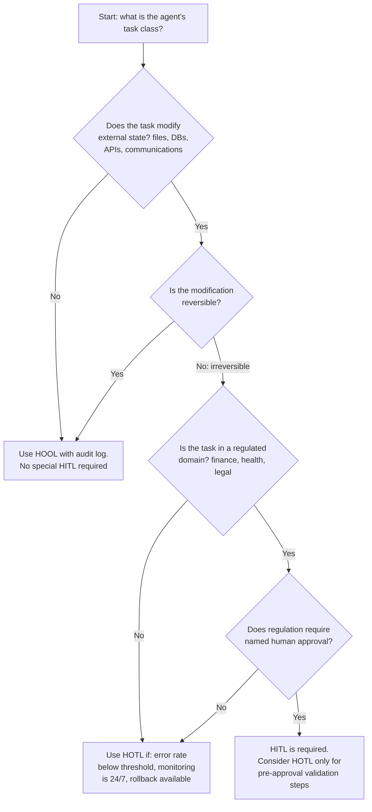

**[Back to Part 1 ←](pathname:///archon/agentic-systems/agentic-ui/09-evolution-human-ai-interfaces) — [Back to Part 2 ←](pathname:///archon/agentic-systems/agentic-ui/parts/09-evolution-human-ai-interfaces-part2) — Part 3 of 3: UX principles, anti-patterns, decision frameworks.**

# Evolution of Human-AI Interfaces — Part 3

## 4. AI-First UX Principles

Enterprise agentic applications need a UX philosophy that replaces principles inherited from desktop GUI and web design. The following 12 principles are architectural requirements for systems where the AI can take consequential actions, propose dynamic interfaces, and operate across extended time horizons.

### 4.1 The 12 Principles

#### Principle 1: Progressive Disclosure of Agent State

**Definition:** The user interface reveals agent state commensurate with user attention and task risk. Background operations are summarized; active operations are streamed; high-risk operations require explicit user focus.

**Implementation:**

- Background tasks: notification badge + summary on demand
- Active tasks: streaming step indicators with expandable detail
- High-risk operations (irreversible actions, large resource consumption): modal interruption requiring explicit acknowledgment

**Failure Mode:** Constant full-disclosure of every agent step creates attention overload and notification fatigue, training users to ignore agent output.

---

#### Principle 2: Reversibility as First-Class Primitive

**Definition:** Every state-modifying agent action must have an explicit undo path. Reversibility is not optional for "important" actions; it is required for all actions.

**Implementation:**

- All tool calls that modify state must implement a compensating transaction
- The UI must surface an "undo last action" control for a configurable window (minimum 30 seconds)
- Irreversible actions (email sends, financial transfers, external API calls) require a HITL gate and explicit irreversibility warning before execution
- Agent action log must retain all arguments necessary to reconstruct the undo operation

**Reference:** See [Enterprise Reference Architecture](enterprise-reference-architecture.md) §Layer 13 for tool executor design patterns that enforce reversibility.

---

#### Principle 3: Uncertainty Transparency

**Definition:** When the agent is uncertain, the interface makes that uncertainty visible and actionable — not hidden behind confident-sounding prose.

**Implementation:**

- Confidence scores surfaced on structured outputs (table cells, classification decisions)
- "I am uncertain about X — would you like me to proceed anyway, clarify, or escalate?" prompts at uncertainty thresholds
- Alternative answers or recommendations displayed when confidence is below threshold
- Source attribution for factual claims (RAG provenance metadata surfaced inline)

**Anti-Pattern:** Presenting uncertain outputs with the same visual treatment as high-confidence outputs. This calibrates users to over-trust the AI.

---

#### Principle 4: Interruptibility

**Definition:** Any agent execution must be interruptible at any point without data corruption, resource leakage, or inconsistent state.

**Implementation:**

- Interrupt button always visible and functional during agent execution (never disabled)
- Interrupt generates a graceful cancellation signal, not a hard kill
- Agent receives interrupt and completes the current atomic action (if safe) before halting
- All acquired resources (database locks, API rate limit reservations, partially allocated compute) are released on interrupt
- State at interrupt time is persisted and annotated, enabling resume or review

**Failure Mode:** Agents that cannot be interrupted cleanly are operationally dangerous. An agent running a 20-step task that cannot be stopped after step 3 will execute 17 more steps with no human recourse.

---

#### Principle 5: Provenance Visibility

**Definition:** Every agent output — every claim, every generated artifact, every proposed action — must carry a visible attribution path connecting it to the source data and reasoning that produced it.

**Implementation:**

- Inline source citations on RAG-grounded content (document name, page, excerpt)
- Tool call provenance: "This recommendation is based on the result of calling `get_customer_history` at 14:32:07 UTC"
- Chain-of-thought summary: collapsible panel showing agent's reasoning steps
- Diff annotation when the agent modifies an existing document: "Added by agent on [date] because [reason]"

**Compliance Note:** GDPR Article 22, EU AI Act Article 13 (transparency), and NIST AI RMF GV-4 all impose provenance requirements on automated decision-making systems.

---

#### Principle 6: Cognitive Load Reduction

**Definition:** The interface is designed to minimize the cognitive load imposed on the human at each interaction point, particularly at approval gates.

**Implementation:**

- Present only the information required to make the approval decision at each gate
- Pre-summarize long tool outputs; offer expandable detail on demand
- Group related actions into a single approval decision when safe to do so
- Provide a recommended default action at each decision point
- Progressive disclosure: summary → detail → raw on user demand

**Anti-Pattern:** Presenting the full agent reasoning trace at every approval gate. Decision quality does not increase with information volume beyond a threshold; it decreases.

---

#### Principle 7: Context Preservation

**Definition:** The agent maintains and surfaces the user's working context across sessions, interruptions, tab switches, and device changes.

**Implementation:**

- Session state serialized to durable storage at each step boundary
- Context summary surfaced when user returns after an interruption ("When you left, the agent was halfway through X. Here is where things stand.")
- Multi-tab and multi-device context synchronization with conflict resolution
- Explicit context handoff when the user delegates to a colleague ("Continue this task — here is the current state")

**Technical Reference:** See [Agent Memory & Planning Architecture](../enterprise-architecture/ai-architecture/agent-memory-planning-architecture.md) for the memory layer design that supports context preservation.

---

#### Principle 8: Failure-Friendly Design

**Definition:** The interface is designed to be useful and safe during agent failures, not just during successful execution.

**Implementation:**

- Every error state has a user-facing message, a recommended action, and a path to recovery
- Partial results are surfaced and labeled as such (not discarded silently)
- Agent failures do not corrupt user-visible state; the previous consistent state is restored
- Error context (model error, tool failure, timeout, policy violation) is distinguished and communicated distinctly
- "Retry", "Skip", "Escalate", and "Manual override" options are always available on failure

**Anti-Pattern:** Displaying a generic "Something went wrong" message. In an enterprise context, this provides no actionable information and is a compliance risk if errors relate to regulated operations.

---

#### Principle 9: Consent-First Interactions

**Definition:** Before the agent collects data, executes an action, or accesses a resource, explicit user consent is obtained and recorded.

**Implementation:**

- Permission grants are presented with scope, duration, and revocability clearly stated
- Consent is granular: "access read-only" vs. "access read-write" vs. "access read-write-delete"
- Consent records are persisted in the audit log alongside the action that relied on them
- Revocation UI is as accessible as consent UI
- Ambient operation requires a distinct, prominent consent flow separate from task-level approvals

**Compliance Reference:** GDPR Article 7 (conditions for consent), EU AI Act Article 9 (data governance), CCPA.

---

#### Principle 10: Graceful Degradation

**Definition:** When AI capabilities are unavailable (model outage, tool failure, context limit exceeded), the interface degrades to a functional state that preserves user productivity.

**Implementation:**

- AI-powered features fail open to manual equivalents (AI-assisted form → standard form)
- Context limit exhaustion triggers a graceful summarization and continuation, not a hard stop
- Tool unavailability triggers a "manual input requested" prompt rather than silent failure
- The interface clearly indicates which capabilities are currently degraded and why
- Offline mode: core UI functions without AI if model API is unavailable

**Anti-Pattern:** Designing an interface that is non-functional without AI. Pure AI-native interfaces have no degraded mode and become completely unusable during AI service incidents.

---

#### Principle 11: Multimodal Flexibility

**Definition:** The interface supports the modality most appropriate to the task context — text, voice, structured form, data visualization, code view — and allows the user to switch between modalities without losing state.

**Implementation:**

- Text chat for conversational queries
- Structured form for data collection where accuracy is paramount
- Data table/chart for structured data presentation
- Code diff view for code generation outputs
- Voice input for hands-free or mobile contexts
- All modalities share a single underlying state representation (the AG-UI state store)

**Technical Reference:** A2UI v0.9 provides the declarative widget definitions for dynamic modality switching. See [AGUI Standards & Ecosystem Landscape](agui-standards-landscape.md) §3.

---

#### Principle 12: Trust Calibration

**Definition:** The interface actively helps users develop accurate mental models of agent capabilities and limitations — preventing both over-trust (accepting all outputs uncritically) and under-trust (rejecting useful outputs reflexively).

**Implementation:**

- Onboarding flow demonstrates failure modes explicitly, not just successes
- Confidence indicators normalized against observable performance history
- "Why the AI suggested this" panel available on all major recommendations
- Regular calibration prompts: "The AI has been correct in this context X% of the time based on your feedback"
- Error rate dashboards visible to power users

**Research Background:** Studies in human-automation interaction (Parasuraman & Riley, 1997; Lee & See, 2004) demonstrate that trust miscalibration — in either direction — produces worse outcomes than appropriate human control alone.

---

## 5. UX Anti-Patterns Inherited from the Chatbot Era

The following 18 anti-patterns appear repeatedly in enterprise AI deployments that were designed by teams with chatbot experience. Each is described with its origin, its manifestation in agentic contexts, and the correct architectural treatment.

### 5.1 Anti-Pattern Catalog

| # | Anti-Pattern | Origin | Manifestation in Agentic Systems | Correct Treatment |
| --- | --- | --- | --- | --- |
| 1 | **Options Menu Chatbot** | Rule-based chatbot decision trees | "Please select: 1. Create task, 2. Check status, 3. Escalate" | Use natural language intent understanding + context-aware action suggestions |
| 2 | **Single-Response Bubble** | Turn-based chat | All agent output (progress, data, confirmations) rendered in same text bubble | Use appropriate native components (tables, progress bars, approval panels) per content type |
| 3 | **Silent Execution** | Background job model | Agent executes multi-step plan with no intermediate progress signals | Stream step indicators via AG-UI STEP_STARTED/STEP_FINISHED events |
| 4 | **Approval-as-Message** | Chat approval pattern | "Should I proceed? Reply 'yes' or 'no'" | Use structured HITL interrupt with typed approval panel, scope display, and undo option |
| 5 | **Context Amnesia** | Stateless HTTP / session-scoped memory | "I don't remember what we discussed last time. Please remind me." | Implement persistent memory layer with session handoff summary |
| 6 | **Confident Uncertainty** | LLM tendency to generate fluent text | Agent states uncertain information with the same visual confidence as verified facts | Surface confidence scores; distinguish grounded vs. synthesized content visually |
| 7 | **Error Wall** | Backend error propagation | "An error occurred. Please try again." with no recovery path | Distinguish error types; surface recovery options (retry, skip, manual, escalate) |
| 8 | **Forced Linearity** | Sequential conversation model | Multi-step task forces user through each step in sequence even when steps are independent | Support parallel execution with concurrent progress visualization |
| 9 | **Ghost Actions** | Invisible function calling | Agent calls APIs and modifies state without surfacing tool calls to user | Surface every tool call with arguments, result, and timestamp in expandable audit panel |
| 10 | **Permission Blindness** | Implicit auth propagation | Agent accesses user data and external APIs without surfacing what it accessed and why | Explicit permission grant UI before each new resource scope; revocation always available |
| 11 | **Verbose Reasoning Dump** | Chain-of-thought exposure | Agent prints full reasoning chain to chat, overwhelming the user | Default to summary + collapsible detail; never expose raw reasoning without explicit request |
| 12 | **No Undo** | Stateless transaction model | Agent executes write operations with no rollback capability | Implement compensating transactions for all state-modifying tool calls |
| 13 | **Perpetual Spinner** | Loading state UI | Task in progress shown as spinning indicator with no further information | Streaming step labels, elapsed time, estimated completion, and "what's happening" description |
| 14 | **All-or-Nothing Approval** | Binary yes/no approval | Approval gate requires approving an entire plan at once | Support step-by-step approval, selective approval, and edit-before-approve |
| 15 | **Escalation Desert** | No escalation path designed | When agent cannot complete a task, it fails silently or loops | Design explicit escalation paths: agent to human, agent to senior agent, agent to exception queue |
| 16 | **One-Size Interface** | Fixed chat layout | Same chat interface used regardless of task type (data analysis, code review, financial approval) | Use A2UI declarative rendering + generative UI to surface task-appropriate components |
| 17 | **No Attribution** | Text generation model | Agent presents synthesis of multiple sources with no citations | Implement inline source attribution for all RAG-grounded content |
| 18 | **Consent Afterthought** | Implicit permission models | Agent accesses sensitive resources (calendar, email, CRM) without explicit upfront consent | Consent-first design: display scope, duration, and revocability before first access |

### 5.2 Anti-Pattern Detection in Existing Systems

Before designing a new agentic UI or evaluating a vendor platform, use the following checklist to identify inherited chatbot anti-patterns:

```text
ANTI-PATTERN DETECTION CHECKLIST

Interface Layer
  [ ] Does the approval flow present a "yes/no" chat message?    → AP#4 Approval-as-Message
  [ ] Is all output rendered in a text bubble regardless of type? → AP#2 Single-Response Bubble
  [ ] Are numbered menus presented for action selection?          → AP#1 Options Menu Chatbot
  [ ] Is a spinner the only feedback during long operations?      → AP#13 Perpetual Spinner

Agent Execution
  [ ] Do tool calls execute without user visibility?              → AP#9 Ghost Actions
  [ ] Are API accesses made without surfaced permission grants?   → AP#10 Permission Blindness
  [ ] Is the full reasoning chain dumped to chat?                → AP#11 Verbose Reasoning Dump
  [ ] Are intermediate steps invisible?                          → AP#3 Silent Execution

State & Memory
  [ ] Does the agent lose context on session restart?             → AP#5 Context Amnesia
  [ ] Are write operations executed without undo capability?      → AP#12 No Undo

Error Handling
  [ ] Does failure produce a generic error with no path forward?  → AP#7 Error Wall
  [ ] Is there no escalation path for agent task failure?         → AP#15 Escalation Desert

Trust & Transparency
  [ ] Are uncertain outputs indistinguishable from confident ones?→ AP#6 Confident Uncertainty
  [ ] Does the agent cite no sources for factual claims?          → AP#17 No Attribution
  [ ] Was consent never explicitly requested for data access?     → AP#18 Consent Afterthought
```

### 5.3 Anti-Pattern Cost Model

Each anti-pattern carries measurable enterprise costs. The following estimates are based on industry case studies and published HCI research:

| Anti-Pattern Cluster | Typical Enterprise Cost | Evidence Type |
| --- | --- | --- |
| AP#3 Silent Execution + AP#13 Perpetual Spinner | 40–60% task abandonment rate on tasks >30 seconds | User research (Nielsen Norman Group, 2024) |
| AP#4 Approval-as-Message + AP#14 All-or-Nothing Approval | 2-4x higher approval error rate vs. structured approval UI | Internal A/B testing reported by financial services adopters |
| AP#5 Context Amnesia | 15–25% of agent sessions include redundant context re-specification | Session log analysis across enterprise deployments |
| AP#6 Confident Uncertainty + AP#17 No Attribution | Compliance violation risk in regulated industries | EU AI Act transparency requirement; GDPR Art. 22 |
| AP#9 Ghost Actions + AP#12 No Undo | Irreversible state corruption in 1-3% of agent runs in production | Post-incident analysis from early enterprise deployments |
| AP#18 Consent Afterthought | Regulatory exposure: GDPR, CCPA, EU AI Act Art. 9 | Regulatory enforcement actions 2024-2026 |

:::tip Prioritization for Existing Systems
    When retrofitting an existing chat-based agent system, eliminate AP#12 (No Undo), AP#9 (Ghost Actions), and AP#4 (Approval-as-Message) first — they carry the highest combined risk of irreversible harm and regulatory exposure.

---

## 6. Decision Framework: Selecting the Right Collaboration Model

### 6.1 Selection Flowchart



Task-duration override, applied after the model above is selected:

| Condition | Override |
| --- | --- |
| Task takes > 4 hours | HOOL (HITL is operationally infeasible) |
| Task takes > 2 weeks | HOOL with daily exception review |
| Task is continuous/ambient | Invisible AI with interrupt budget |

### 6.2 Maturity Progression Path

Organizations typically progress through collaboration models as follows:

```text
MATURITY PROGRESSION

Level 1 — Chat Copilot
  Model: Shared Cognition
  All AI outputs reviewed and accepted/rejected by human before use
  Suitable for: initial deployments, low-risk domains, building trust

Level 2 — Assisted Workflows
  Model: HITL for all external actions
  Human approves every tool call; agent handles only analysis and proposal
  Suitable for: medium-risk domains with defined approval policies

Level 3 — Monitored Automation
  Model: HOTL for routine steps; HITL for high-risk gates
  Human monitors live; can interrupt; approves only at defined boundaries
  Suitable for: high-volume, medium-risk, recoverable operations

Level 4 — Policy-Governed Autonomy
  Model: HOOL within policy boundaries
  Autonomous execution within verified policy envelope; human reviews outcomes
  Requires: validated agent reliability, machine-readable policies, audit trail

Level 5 — Ambient Enterprise Intelligence
  Model: Invisible AI
  Background monitoring, proactive execution; human manages by exception
  Requires: comprehensive consent architecture, interrupt budget, full audit trail
```

:::warning Premature Autonomy
    Organizations that deploy HOOL or Invisible AI patterns before establishing validated agent reliability (Level 3 threshold) at Level 2 create operational and compliance risk. The maturity progression is not optional — each level builds the evidence base required for the next.

---

## 7. Cross-References and Next Steps

| Topic | Where to Go |
| --- | --- |
| AG-UI protocol: event taxonomy, transport, state sync | [AGUI Standards & Ecosystem Landscape](agui-standards-landscape.md) |
| Enterprise reference architecture (17 layers) | [Enterprise Reference Architecture](enterprise-reference-architecture.md) |
| HITL gate implementation patterns | [Enterprise AI Architecture Patterns](../enterprise-architecture/ai-architecture/enterprise-ai-architecture-patterns.md) §8 |
| Agent memory supporting context preservation | [Agent Memory & Planning Architecture](../enterprise-architecture/ai-architecture/agent-memory-planning-architecture.md) |
| Security model for trust boundaries | [Agentic AI Security & Identity](../enterprise-architecture/ai-architecture/agentic-ai-security-identity.md) |
| EU AI Act transparency requirements | [Enterprise AI Governance & Compliance](../enterprise-architecture/ai-architecture/enterprise-ai-governance-compliance.md) |
| OTel observability for agent UX | [Reliability, Observability & Governance](../enterprise-architecture/ai-architecture/agentic-ai-reliability-observability-governance.md) |

---

**[Back to Part 1 ←](pathname:///archon/agentic-systems/agentic-ui/09-evolution-human-ai-interfaces) — [Back to Part 2 ←](pathname:///archon/agentic-systems/agentic-ui/parts/09-evolution-human-ai-interfaces-part2) — This is Part 3 of 3.**
