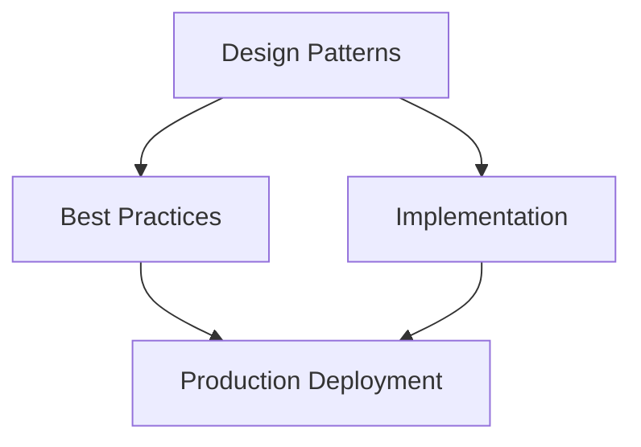

## Architecture Overview




## 8. Policy Governance

### 8.1 Policy-as-Code Lifecycle

All governance policies that can be expressed in code should be. Policy-as-code enables automated enforcement, testing, and audit.

```text
POLICY-AS-CODE LIFECYCLE

WRITE
  Policy author drafts policy in OPA Rego or Cedar
    *  Policy covers: prompt filtering, tool authorization, context rules
    *  Policy includes: test cases for expected allow/deny decisions
    *  Policy stored in version control (Git)
                
              ▼
REVIEW
  Policy Review Committee reviews:
    *  Correctness: does it express the intent?
    *  Coverage: are edge cases handled?
    *  Performance: does it evaluate in &lt; 10ms?
    *  Conflict: does it conflict with existing policies?
                
              ▼
TEST
  Automated policy test suite:
    *  Unit tests: individual rules
    *  Integration tests: policy with real context examples
    *  Regression tests: existing policies unchanged by new policy
    *  Load tests: policy evaluation under production load
                
              ▼
DEPLOY
  Policy deployed to Policy Decision Point (OPA or Cedar)
    *  Canary deployment: 5% of traffic for 24 hours
    *  Monitor: deny rate, latency, error rate
    *  Full rollout if metrics stable
                
              ▼
MONITOR
  Ongoing monitoring:
    *  Policy hit rate (which rules fire most?)
    *  Unexpected deny rate (new attack patterns?)
    *  Policy evaluation latency
    *  Policy coverage gaps (new scenarios not covered?)
                
              ▼
REVIEW & RETIRE
  Annual policy review:
    *  Is policy still necessary?
    *  Is business context still accurate?
    *  Are exceptions still valid?
    *  Retire or update based on review
```

### 8.2 Policy Conflict Resolution

| Conflict Type | Resolution Rule | Authority |
| --- | --- | --- |
| **Same-level policy conflict** | More restrictive policy wins | PAB + Policy Committee |
| **Platform vs. LOB policy** | Platform policy wins | Platform Architecture Board |
| **Security vs. usability conflict** | Escalate to AI Governance Committee | AI Governance Committee |
| **Legal/regulatory vs. internal policy** | Regulatory requirement wins | Legal + CCO |
| **Emergency policy override** | CISO/CCO can issue temporary override | Post-hoc ratification by committee |

### 8.3 Emergency Policy Override Process

When an urgent business or security situation requires bypassing normal policy:

| Step | Action | Time Limit |
| --- | --- | --- |
| 1 | Requester identifies specific policy blocking urgent business need | — |
| 2 | Requester contacts CISO or CCO (depending on policy type) for emergency override authorization | — |
| 3 | CISO/CCO issues time-limited override with: reason, scope, duration | Immediate |
| 4 | Override logged in immutable audit trail with authorizer identity | Within 1 hour |
| 5 | Override deployed to Policy Decision Point | Within 2 hours |
| 6 | Post-override review scheduled with Policy Committee | Within 5 business days |
| 7 | Override either ratified, modified, or revoked by Policy Committee | Within 10 business days |
| 8 | Lessons learned fed back into policy to prevent recurrence | Within 30 days |

---

## 9. Knowledge Governance

### 9.1 Content Approval for Knowledge Bases

All content added to agent knowledge bases requires review before ingestion:

| Content Type | Review Required | Reviewer | SLA |
| --- | --- | --- | --- |
| **Internal policies and procedures** | Yes | Business owner + Compliance | 3 business days |
| **Product documentation** | Yes | Product team + Legal | 2 business days |
| **Public regulatory documents** | Light-touch | Knowledge Lead | 1 business day |
| **Third-party content (licensed)** | Full review | Legal (licensing) + Knowledge Lead | 5 business days |
| **Third-party content (scraped/web)** | Full review | Legal + Knowledge Lead + DPO | 5 business days |
| **Employee-generated content** | Yes | Manager + Knowledge Lead | 2 business days |
| **AI-generated content** | Full review with human validation | Knowledge Lead + AI Lead | 3 business days |

### 9.2 Knowledge Freshness Policies

| Content Category | Max Age Before Review | Auto-Expiry | Staleness Alert |
| --- | --- | --- | --- |
| **Regulatory/compliance content** | 30 days | No — requires human review | Alert at 25 days |
| **Product pricing/features** | 7 days | No | Alert at 5 days |
| **Internal policies** | 90 days | No | Alert at 75 days |
| **Technical documentation** | 180 days | No | Alert at 150 days |
| **Reference/background content** | 1 year | No | Alert at 300 days |
| **Public web content** | 30 days | Re-crawl and re-review | Alert at 28 days |

### 9.3 Knowledge Access Controls by User Tier

| User Tier | Knowledge Access Level | Examples |
| --- | --- | --- |
| **Public / unauthenticated** | Public knowledge only | Product FAQs, general information |
| **Authenticated user** | Public + user-relevant internal content | Account-specific policies, user guides |
| **Premium/Enterprise user** | Public + extended internal content | Advanced product docs, configuration guides |
| **Internal employee** | All internal content appropriate to role | Full policy library, internal guides |
| **Agent (on behalf of user)** | Same scope as delegating user | Agent cannot exceed user's access level |
| **Admin** | All content in tenant | Administrative access |

---

## 10. Model Governance

### 10.1 Model Selection Approval Process

| Trigger | Review Required | Reviewers | SLA |
| --- | --- | --- | --- |
| **First model from a provider** | Full ARB review + security assessment | PAB + CISO + Legal | 10 business days |
| **New model from existing provider** | Model Review Committee | Platform Lead + AI Lead | 3 business days |
| **Model upgrade (same family)** | Platform Lead approval | Platform Lead | 1 business day |
| **Experimental/preview model** | Model Review Committee + risk waiver | Platform Lead + AI Lead + Risk | 5 business days |
| **Open-source/self-hosted model** | Full ARB review | PAB + CISO + Legal + Risk | 15 business days |
| **Fine-tuned model** | Full ARB review + data governance | PAB + DPO + AI Lead | 15 business days |

### 10.2 Model Evaluation Requirements Before Promotion

Before any model can be used in production:

| Evaluation Category | Minimum Requirement | Test Suite |
| --- | --- | --- |
| **Safety refusals** | Pass all prohibited content tests | OWASP LLM safety test suite |
| **Benchmark performance** | Maintain or improve on task benchmarks | Domain-specific benchmark suite |
| **Prompt injection resistance** | >95% resistance on injection test suite | Custom injection test suite |
| **Bias assessment** | No significant regression vs. current model | Bias evaluation suite |
| **Latency** | p99 latency within 20% of current model | Load test suite |
| **Cost** | Cost model documented and approved | Cost estimation model |
| **Behavioral regression** | >99% consistency on production prompt set | Regression test suite |
| **Privacy leakage** | No training data extraction on adversarial probing | Extraction resistance test |

### 10.3 Provider SLA Requirements

Before contracting with or deploying an LLM provider in production:

| SLA Requirement | Minimum Standard | Notes |
| --- | --- | --- |
| **Availability** | 99.9% monthly | Measured at API level |
| **API latency (p99)** | &lt; 30s for standard requests | Provider-published SLA |
| **Incident communication** | &lt; 30 minutes for P1 incidents | Status page + direct notification |
| **Data processing agreement** | Signed DPA with GDPR Article 28 compliance | Legal review required |
| **Data retention policy** | No training on customer data without consent | Explicit contractual clause |
| **EU data residency** | EU-based processing for EU data subjects | If required by data residency policy |
| **Security assessment** | SOC 2 Type II or equivalent | Current certification required |
| **Penetration testing** | Annual pen test results available | Under NDA review |

---

## 11. Agent Governance

### 11.1 Agent Registration and Identity Management

Every agent deployed in the enterprise must be registered in the Agent Registry:

| Registry Field | Required | Notes |
| --- | --- | --- |
| **Agent ID** | Yes | Unique identifier; used for all audit logging |
| **Agent Name** | Yes | Human-readable; must follow naming convention |
| **Owner** | Yes | Team + primary contact |
| **Capability Scope** | Yes | Declared capability classes (READ/WRITE/EXECUTE etc.) |
| **Authorized Tools** | Yes | List of approved tool IDs from Tool Registry |
| **Model Used** | Yes | LLM provider + model version |
| **Prompt Version** | Yes | Semantic version of system prompt |
| **Data Access Scope** | Yes | Data categories the agent may access |
| **Human Oversight Model** | Yes | HITL / HOTL / HOOL / Autonomous (with justification) |
| **Risk Tier** | Yes | T1 (minimal) to T4 (critical) |
| **Production Date** | Yes | Date of production deployment |
| **Review Date** | Yes | Next scheduled governance review |
| **EU AI Act Classification** | Yes | Risk tier (minimal/limited/high/unacceptable) |

### 11.2 Agent Behavior Monitoring

| Metric | Description | Alert Threshold | Response |
| --- | --- | --- | --- |
| **Tool call volume** | Number of tool calls per session | >150% of baseline | P2 alert + investigation |
| **Refusal rate** | % of user requests refused | > 20% or &lt; 2% | P3 alert + prompt review |
| **Escalation rate** | % of interactions requiring human review | >50% deviation from baseline | P2 alert + review |
| **Session duration** | Average session length | >200% of baseline | P3 alert |
| **Token spend per session** | Input + output token cost | >200% of baseline | P2 alert + quota check |
| **Error rate** | Tool call failures, context assembly errors | > 5% | P2 alert |
| **Anomalous tool sequences** | Unexpected tool call patterns | ML anomaly score > threshold | P1 alert + automated suspension |
| **PII detection rate** | PII detected in agent outputs | Any PII in output | P1 alert + immediate review |
| **Cross-tenant access attempts** | Attempts to access other tenants' data | Any occurrence | P1 alert + incident |

### 11.3 Rogue Agent Detection and Remediation

```text
ROGUE AGENT RESPONSE PLAYBOOK

DETECTION SIGNALS (any one triggers P1 incident):
  *  Agent making tool calls user did not request
  *  Agent attempting to access data outside its declared scope
  *  Agent sending data to external endpoints not in approved tool list
  *  Agent spawning sub-agents beyond its registered capability scope
  *  Agent exhibiting goal-directed behavior inconsistent with system prompt
  *  Anomaly ML model flags agent behavior as outlier (3+ sigma)

IMMEDIATE RESPONSE (within 15 minutes):
1. Automated: Suspend agent instance (stop accepting new requests)
2. Automated: Preserve all context and session data for investigation
3. Automated: Alert security team (P1 incident ticket)
4. Human: CISO and App Owner notified immediately

INVESTIGATION (within 2 hours):
1. Review all tool calls in session
2. Review all data accessed
3. Review context for prompt injection indicators
4. Review LLM outputs for anomalous reasoning chains
5. Assess blast radius (what was affected)

REMEDIATION:
1. If prompt injection: harden context sanitization; re-review prompt
2. If model misbehavior: escalate to model provider; consider model change
3. If configuration error: fix agent config; re-review before reactivation
4. If novel attack: add to security test suite; harden controls

REACTIVATION:
1. Root cause identified and documented
2. Fix implemented and tested
3. Security review approved
4. App Owner + CISO sign off
5. Phased reactivation with enhanced monitoring
```

---

## 12. Data Governance

### 12.1 Data Classification for Agent-Accessible Data

| Classification | Definition | Agent Access | Controls Required |
| --- | --- | --- | --- |
| **Public** | Intentionally public information | Unrestricted | None beyond standard |
| **Internal** | Business information for internal use | With authentication | Standard auth + audit |
| **Confidential** | Sensitive business, client, or employee data | Need-to-know basis | Explicit authorization + audit |
| **Restricted** | Highly sensitive: PHI, financial, legal, IP | Highly restricted | Explicit approval + human oversight gate |
| **Secret** | Credentials, encryption keys, PII archives | Prohibited from agent context | Never in context; vault access only |

### 12.2 Data Access Request Workflow

When an agent application requires access to a new data source:

| Step | Action | Owner | SLA |
| --- | --- | --- | --- |
| 1 | Data Access Request submitted with: data source, data categories, business justification, data volumes | App Owner | — |
| 2 | Data classification verified | Data Governance Lead | 1 day |
| 3 | Privacy impact assessment (if PII) | DPO | 3 days |
| 4 | Security review (if Confidential or above) | Security Architect | 3 days |
| 5 | Business owner approval for data source | Data Owner | 2 days |
| 6 | DPA or data sharing agreement review (if third-party) | Legal | 5 days |
| 7 | Access provisioned with time-bound scope | Platform Team | 1 day |
| 8 | Access logged in Data Access Register | Data Governance | Same day |

---

## 13. Lifecycle Governance

### 13.1 Agentic Application Portfolio Management

| Lifecycle Stage | Stage Entry Criteria | Stage Exit Criteria | Governance Actions |
| --- | --- | --- | --- |
| **Ideation** | Business need identified | Architecture concept approved by PAB | PAB pre-review |
| **Development** | Architecture approved | All ARB checklist items complete | ARB review |
| **Staging** | Development complete | All test suites pass; UAT complete | Pre-production security review |
| **Production** | Staging validated | App Owner sign-off; CISO sign-off | Production deployment approval |
| **Active** | In production | SLOs being met | Quarterly governance review |
| **Watch** | SLOs degraded or governance issues | SLOs restored; issues resolved | Enhanced monitoring; 30-day remediation |
| **Sunset** | EOL criteria met | All users migrated; data archived | EOL process |

### 13.2 Stage Gate Reviews

Every active agentic application undergoes quarterly governance review:

| Review Item | Green | Amber | Red |
| --- | --- | --- | --- |
| **SLO attainment** | >99% | 95–99% | &lt;95% |
| **Security vulnerabilities** | None open > 30 days | None critical > 7 days | Any critical open |
| **Compliance status** | All obligations met | Minor gaps with remediation plan | Any major gap |
| **User satisfaction** | NPS > 30 | NPS 10–30 | NPS &lt; 10 |
| **Cost efficiency** | Within budget ±10% | Within budget ±25% | > 25% over budget |
| **Prompt governance** | All prompts reviewed, no overdue reviews | Some reviews overdue | System prompt out of governance |
| **Tool governance** | All tools re-reviewed on schedule | Some tools pending re-review | Any unapproved tool in use |

**Red status triggers:** 30-day remediation plan required; next review accelerated to 30 days. Second consecutive red: escalation to AI Governance Committee and possible application suspension.

---

## 14. Approval Governance

### 14.1 Approval Authority Matrix

| Decision Type | Approver Level 1 | Approver Level 2 | Approver Level 3 | Emergency |
| --- | --- | --- | --- | --- |
| **New agentic application (low risk)** | AI App Owner | PAB | — | — |
| **New agentic application (high risk, EU AI Act)** | AI App Owner | PAB + CISO | AI Governance Committee | CTO (48h) |
| **Production model change** | App Owner | Platform Lead | — | Platform Lead (24h) |
| **New financial-class tool** | App Owner | Platform Lead + Finance | AI Governance Committee | — |
| **Agent suspension** | App Owner | CISO (parallel) | — | Security team (immediate) |
| **Data access for Restricted data** | App Owner | Data Owner | DPO + CISO | CISO (24h) |
| **Prompt emergency change** | App Owner | CoE Lead | — | App Owner (immediate; post-review) |
| **GDPR erasure** | DPO | — | — | DPO (immediate) |
| **Architecture exception (High severity)** | PAB | CISO + CCO | — | CTO (24h) |
| **Policy emergency override** | CISO or CCO | — | — | CISO or CCO (immediate) |

### 14.2 Approval Audit Trail Requirements

Every approval must be logged with:

| Field | Requirement |
| --- | --- |
| **Decision ID** | Unique, immutable identifier |
| **Decision type** | From approval authority matrix |
| **Requestor identity** | Authenticated identity, not just name |
| **Request timestamp** | UTC, millisecond precision |
| **Request details** | Full context of what was requested |
| **Approver identities** | All approvers, in order |
| **Approval timestamp(s)** | Separate timestamp per approver |
| **Decision outcome** | Approved / Rejected / Deferred |
| **Justification** | Approver's documented rationale |
| **Conditions** | Any conditions attached to approval |
| **Expiry** | If time-limited approval |
| **Audit log integrity** | Cryptographic hash of log entry |

---

## 15. Change Governance

### 15.1 Change Categories for Agentic Systems

| Change Category | Risk | CAB Required | Notification | Rollback Plan |
| --- | --- | --- | --- | --- |
| **Standard change** (pre-approved) | Low | No | None | Standard |
| **Normal change** (model patch, prompt patch) | Low–Medium | Light review | 48-hour notice | Required |
| **Significant change** (model upgrade, new tool) | Medium | Full review | 5-day notice | Required + tested |
| **Major change** (architecture change, new agent) | High | Full + extended review | 10-day notice | Required + rehearsed |
| **Emergency change** (security incident) | Variable | Post-hoc notification | As soon as practicable | Required |

### 15.2 Rollback Governance

| Rollback Scenario | Trigger | Rollback Time SLA | Approver |
| --- | --- | --- | --- |
| **Prompt rollback** | Behavioral regression detected | &lt; 15 minutes | App Owner or on-call |
| **Model rollback** | Significant quality/safety regression | &lt; 30 minutes | Platform Lead |
| **Tool configuration rollback** | Tool malfunction or security event | &lt; 15 minutes | Platform Lead or on-call |
| **Policy rollback** | Policy causing unacceptable deny rate | &lt; 30 minutes | Policy Committee Chair |
| **Agent configuration rollback** | Rogue behavior or customer impact | &lt; 15 minutes | App Owner + CISO |

### 15.3 Change Communication to Users

| Change Type | Communication Required | Lead Time | Channel |
| --- | --- | --- | --- |
| **Agent persona change** | Yes | 5 days | In-app notification + email |
| **New capability added** | Yes (positive) | At deploy | In-app notification |
| **Capability removed** | Yes | 14 days | Email + in-app + help article |
| **Tool access change (affects user)** | Yes | 5 days | In-app notification |
| **Memory policy change** | Yes | 30 days | Email + privacy notice update |
| **Maintenance window** | Yes | 48 hours | Status page + email |
| **Unplanned outage** | Yes | ASAP | Status page + email within 30 min |

---

## 16. Compliance Governance

### 16.1 Compliance Calendar

| Date | Obligation | Applies To | Action Required |
| --- | --- | --- | --- |
| **Aug 2, 2026** | EU AI Act Art. 50 transparency obligations; GPAI enforcement begins | All AI systems interacting with EU users | AI disclosure in UX; GPAI technical documentation complete |
| **Dec 2, 2026** | EU AI Act watermarking grace period ends for existing systems | AI-generated content systems | AI-generated content marking in production |
| **Dec 2, 2027** | EU AI Act Annex III high-risk obligations (Digital Omnibus deadline) | High-risk AI systems (Annex III) | Conformity assessment complete; HITL in production |
| **Aug 2, 2028** | EU AI Act Annex I high-risk obligations | Regulated-product high-risk AI | Full conformity assessment |
| **Annual** | ISO 42001 surveillance audit | ISO 42001 certified organizations | Evidence collection Q3; audit Q4 |
| **Annual** | NIST AI RMF program review | US federal-connected organizations | Governance program review |
| **Quarterly** | Internal compliance review | All active agentic applications | Compliance dashboard review; evidence update |

### 16.2 Evidence Collection Automation

Compliance evidence should be automatically collected wherever possible:

| Evidence Type | Automation Level | Collection Method | Storage |
| --- | --- | --- | --- |
| **Audit logs** | Fully automated | OTel → audit log store | Immutable log storage, 7 years |
| **Model documentation** | Semi-automated | Model card generation from registry | Compliance document store |
| **HITL records** | Fully automated | Approval workflow system → log | Audit log store |
| **Bias test results** | Fully automated | Evaluation pipeline → metrics store | Compliance document store |
| **Penetration test reports** | Manual | Security team → document store | Compliance document store |
| **Training records** | Semi-automated | LMS completion records | HR + compliance store |
| **Incident records** | Fully automated | Incident management system | Incident store + compliance copy |
| **Access reviews** | Semi-automated | IAM system + quarterly review | Access review store |
| **Vendor assessments** | Manual | Vendor assessment questionnaire | Vendor management store |
| **Data processing records** | Fully automated | Data governance platform | RoPA store |

---

## 17. Governance Maturity Assessment

Five-level maturity model for agentic AI governance:

| Level | Name | Characteristics | Indicators |
| --- | --- | --- | --- |
| **1 — Initial** | Ad hoc governance | No formal processes; governance reactive; individual heroics; no audit | Agents deployed without review; no prompt versioning; no audit logs |
| **2 — Developing** | Repeatable processes | Basic processes exist; inconsistently followed; key-person dependency; limited audit | ARB exists but not always followed; some prompt versioning; partial audit |
| **3 — Defined** | Standardized governance | Documented processes; consistently followed; roles defined; audit exists | Full ARB process; prompt governance; tool approval; basic audit trail |
| **4 — Managed** | Measured governance | Governance measured; KPIs tracked; continuous improvement; proactive risk | Governance metrics dashboard; compliance calendar tracked; trend analysis |
| **5 — Optimizing** | Adaptive governance | Governance automated; policy-as-code; self-assessing; industry-leading | Policy-as-code in production; automated evidence collection; governance as competitive advantage |

**Assessment questionnaire for each domain:**

| Domain | Level 1 | Level 3 | Level 5 |
| --- | --- | --- | --- |
| **Architecture** | No ARB | ARB exists, followed consistently | ADRs automated; architecture compliance checked in CI/CD |
| **Prompt** | Prompts edited directly in production | Prompt versioning with review | Automated prompt testing in CI/CD; ML-based anomaly detection |
| **Memory** | No memory governance | Retention policies defined and enforced | Automated GDPR erasure; consent management platform |
| **Tool** | Any tool added without review | Tool approval process exists | Tool capability scanning; automated security assessment |
| **Model** | Models changed without process | Model review committee in place | Automated model evaluation; continuous bias monitoring |
| **Compliance** | No compliance tracking | Compliance calendar maintained | Automated evidence collection; real-time compliance dashboard |

---

## 18. Governance Anti-Patterns

The following anti-patterns represent governance failures observed in enterprise agentic AI deployments:

| # | Anti-Pattern | Description | Consequence | Fix |
| --- | --- | --- | --- | --- |
| 1 | **Prompt as config, not code** | System prompts edited directly in production without version control | Untracked changes; no rollback; audit gaps | Prompt registry with semantic versioning |
| 2 | **Governance theater** | ARB process exists but always approves; rubber stamp committee | No real risk management; false safety | Empower committee to reject; track rejection rate |
| 3 | **One-time compliance sprint** | Compliance work done for initial audit then abandoned | Drift from requirements; failed re-audits | Compliance-as-continuous-process with calendar |
| 4 | **Tool sprawl without governance** | Teams add MCP tools without approval process | Unknown attack surface; uncontrolled data access | Tool registry with mandatory approval |
| 5 | **Model change as routine maintenance** | LLM model upgrades treated as patch deployments | Behavioral regressions; safety degradation without detection | Model governance process with regression testing |
| 6 | **GDPR erasure ignored for AI systems** | Data deletion doesn't cascade to vector stores, memory, audit logs | GDPR violations; regulatory risk | Erasure cascade process across all AI data stores |
| 7 | **Agent identity as service account** | Agent uses shared service account rather than unique agent identity | No attribution; cannot detect rogue agents; audit gaps | Agent identity management with unique IDs |
| 8 | **No memory retention policy** | Memory stores grow without bound; no deletion policy | GDPR risk; PII accumulation; data breach surface area | Memory retention policy with automated enforcement |
| 9 | **Security review as final gate only** | Security reviewed once at deployment; never revisited | Accumulating technical debt; new vulnerabilities not addressed | Continuous security review; quarterly threat model refresh |
| 10 | **LOB AI team with no governance oversight** | Business unit deploys agents without platform team involvement | Shadow AI; ungoverned data access; compliance risk | Federated governance with mandatory platform registration |
| 11 | **Context window as data dump** | Everything available injected into context without selection | PII exposure; cross-tenant leakage risk; unnecessary LLM access to sensitive data | Context assembly governance with data minimization |
| 12 | **Approval workflow bypass for emergencies** | Emergency bypass becomes default for urgent work | Governance abandoned; no audit trail | Emergency bypass with strict definition, time limit, and post-hoc review |
| 13 | **Compliance as legal's problem** | Technical teams assume compliance is legal/compliance team's responsibility | Technical controls missing; architecture non-compliant | Shared ownership model with technical compliance requirements |
| 14 | **Policy conflicts unresolved** | Multiple policies apply; which wins is unclear; enforcement inconsistent | Inconsistent behavior; potential safety gaps | Policy conflict resolution matrix; single policy authority |
| 15 | **Knowledge base without content governance** | Any employee can add content to agent knowledge base | Misinformation; sensitive data exposure; quality degradation | Content approval process with freshness policies |
| 16 | **No tool deprecation process** | Old tools remain in production long after vendor sunset | Security vulnerabilities; broken integrations | Tool lifecycle management with deprecation notices |
| 17 | **Governance maturity theater** | Organization claims Level 4 maturity without evidence | Over-confidence; gaps discovered at worst time | Evidence-based maturity assessment with external validation |
| 18 | **Rogue agent no-response plan** | No incident response plan for misbehaving agents | Slow response; extended blast radius; reputational damage | Rogue agent response playbook with automated detection |
| 19 | **Federated governance without standards** | LOBs govern independently with incompatible standards | Chaos at enterprise level; no aggregated risk view | Platform governance standards as non-negotiable minimum |
| 20 | **Change governance missing AI artifacts** | Change management tracks code but not prompts, models, knowledge | Invisible changes; audit gaps; regression root cause unknown | Extend CMDB/change management to cover AI artifacts |
| 21 | **Approval matrix not maintained** | Approval authority matrix written once, never updated | Wrong people approving; escalation confusion | Quarterly review of approval authority matrix |
| 22 | **No lifecycle tracking for agents** | Agents deployed with no EOL plan | Zombie agents; unmaintained security surface; technical debt | Agent portfolio management with lifecycle stage tracking |
| 23 | **HITL as checkbox** | Human approval gate exists but reviewer rubber-stamps everything | No real oversight; creates false compliance assurance | HITL reviewer training; review quality metrics; sampled audits |
| 24 | **Vendor SLA not tracked** | LLM provider SLAs not measured; issues discovered from users | Reactive incident response; poor user experience | Provider SLA monitoring with automated alerting |
| 25 | **Governance without tooling** | All governance processes manual | Governance doesn't scale; error-prone; slow | Governance automation: policy-as-code, automated evidence collection |

---

:::tip Getting Started: Governance Implementation Roadmap
    **Year 1 (Foundation):** Establish PAB and ARB; implement prompt versioning; create agent registry; define tool capability classification; establish basic audit logging.
    **Year 2 (Standardization):** Deploy policy-as-code; implement memory governance; automate compliance evidence collection; complete model governance process.
    **Year 3 (Optimization):** Full governance automation; continuous compliance dashboard; self-assessing governance maturity; governance as competitive advantage.

:::note Related Guides
    - [Responsible AI for Agentic Applications](../17-responsible-ai.md) — RAI principles, EU AI Act compliance requirements, OWASP LLM Top 10
    - [Security Architecture for Agentic Applications](../19-agentic-ui-security-architecture.md) — Security controls, threat models, AGUI-specific security
    - [Identity & Auth Architecture](../12-identity-auth-architecture.md) — Identity types, OAuth flows, authorization models
    - [Enterprise AI Governance & Compliance](../../../architecture/51-enterprise-ai-governance-compliance.md) — Regulatory framework details
    - [Reliability, Observability & Governance](../../../architecture/43-agentic-ai-reliability-observability-governance.md) — Operational governance, 5 registries


## Related Links

- ../11-governance.md - Part 1
