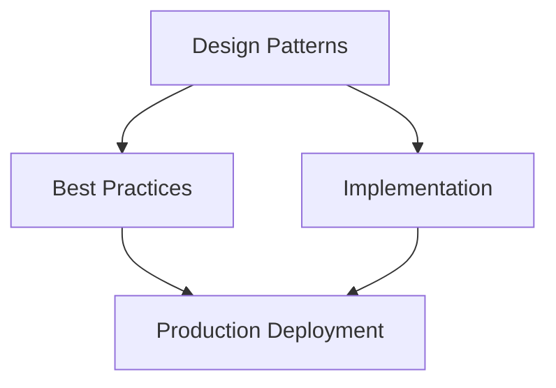

## Architecture Overview




## 6. Tool Observability

### 6.1 Tool Call SLOs

| Tool Category | Latency P50 SLO | Latency P99 SLO | Availability SLO | Retry Safe? |
| -------------- | ---------------- | ---------------- | ----------------- | ------------- |
| Search / web retrieval | &lt; 1s | &lt; 5s | 99% | Yes |
| Database query | &lt; 100ms | &lt; 500ms | 99.9% | Yes (read) |
| REST API call (external) | &lt; 500ms | &lt; 3s | 98% | Depends |
| Code execution sandbox | &lt; 5s | &lt; 30s | 99% | Yes |
| Email / calendar write | &lt; 2s | &lt; 10s | 99% | No (idempotency key required) |

### 6.2 Circuit Breaker State Metrics

```text
CIRCUIT BREAKER STATE MACHINE

CLOSED --(failure_rate > 50%)--► OPEN
  ▲                                   
                                (timeout 30s)
                                       
    * -(success_rate > 90%)-- HALF-OPEN ◄
```

| Metric | Description | Alert |
|--------|-------------|-------|
| `tool.circuit_breaker.state` | Current state: CLOSED/OPEN/HALF_OPEN | OPEN state for > 5 min |
| `tool.circuit_breaker.open.count` | Times circuit opened (rolling 1h) | > 3 opens/hour |

---

## 7. Memory Observability

### 7.1 Memory System Metrics

| Metric | Type | Description | Target |
| -------- | ------ | ------------- | -------- |
| `memory.retrieval.latency_ms` | Histogram | Vector similarity search duration | P99 &lt; 200ms |
| `memory.retrieval.results_count` | Histogram | Documents returned per query | Typically 3–10 |
| `memory.retrieval.top_score` | Gauge | Top similarity score | &lt; 0.7 = quality concern |
| `memory.cache.hit_rate` | Gauge | Semantic cache hits | Target > 30% |
| `memory.write.latency_ms` | Histogram | Memory write duration | P99 &lt; 500ms |
| `memory.store.size_docs` | Gauge | Total documents in memory store | Growing unboundedly = leak |
| `memory.context.utilization_pct` | Histogram | % of retrieved docs used in response | &lt; 20% = over-retrieval |
| `memory.eviction.count` | Counter | Documents evicted by TTL/LRU | Sudden spike = TTL too aggressive |

For memory architecture and tiering details, see [Memory & Planning Architecture](../../../architecture/41-agent-memory-planning-architecture.md).

---

## 8. Safety Observability

### 8.1 Safety Metrics

| Metric | Description | Alert Threshold | Retention |
| -------- | ------------- | ----------------- | ----------- |
| `safety.guardrail.trigger.count` | Total policy triggers by policy_id | Sudden 10x spike | 1 year |
| `safety.guardrail.trigger.rate` | Triggers per 1000 requests | > 50/1000 | 1 year |
| `safety.prompt_injection.detected` | Prompt injection attempts detected | Any | 1 year |
| `safety.pii.detected` | PII detected in inputs | Track trend | 90 days |
| `safety.policy_violation.attempt` | User attempted policy-violating action | Any | 1 year |

For OWASP ASI01–ASI10 security controls and guardrail policy design, see [Agentic AI Security & Identity](pathname:///archon/trust/05-agentic-ai-security-identity).

### 8.2 Safety Alert Tiers

| Tier | Trigger | Response Time | Who Gets Paged |
| ------ | --------- | -------------- | ---------------- |
| **SEV-1 Safety** | Active prompt injection / policy bypass | 5 min | CISO + On-call Security |
| **SEV-2 Safety** | 3x guardrail trigger spike in 15 min | 15 min | Security Engineer |
| **SEV-3 Safety** | Unusual policy trigger pattern | 1 hour | AI Security team |
| **Informational** | New user attempting restricted action | Next business day | Analyst review |

:::warning Safety Observability is a Compliance Requirement
    Under EU AI Act Article 26 and most financial regulators, safety event logs must be immutable, timestamped, and retained for audit. Route safety events through a separate write-once log store (append-only S3 with object lock or equivalent). Never co-mingle with performance logs on the same 30-day retention pipeline.

---

## 9. Conversation Analytics

### 9.1 Session-Level Metrics

| Metric | Definition | Use |
| -------- | ----------- | ----- |
| **Session length distribution** | Turns per session histogram | Bimodal (1 turn vs 10+) reveals distinct use cases |
| **Task success rate** | Sessions marked task_completed_success | Primary quality KPI |
| **First-turn resolution rate** | Task completed in exactly 1 turn | Directness quality signal |
| **Session abandonment rate** | Sessions with no completion event | Quality and UX concern |
| **Average turns to completion** | Mean turns per completed task | Lower = better for routine tasks |

### 9.2 Topic Clustering Pipeline

```text
TOPIC CLUSTERING PIPELINE

1. Extract first user message per session (or task description)
2. Embed with small model (text-embedding-3-small or equivalent)
3. Cluster with k-means or HDBSCAN (k=20–50 for enterprise)
4. Label clusters with LLM summarization
5. For each cluster: measure task success rate, avg turns, CSAT
6. Flag clusters with:
   - Success rate &lt; 60% (agent not equipped)
   - High volume + low CSAT (priority improvement)
   - Rapidly growing volume (new use case emerging)
```

---

## 10. Business Analytics Dashboard Specification

### 10.1 Real-Time Operations Dashboard

| Widget | Metric | Visualization | Refresh |
| -------- | -------- | -------------- | --------- |
| Active sessions | Live sessions with open streams | Gauge + sparkline | 30s |
| Requests/min | Incoming request rate | Time series (1h window) | 30s |
| Error rate | `run_error / (run_finished + run_error)` | Gauge with SLO line | 30s |
| TTFT P95 | 95th percentile time to first token | Gauge + trend arrow | 1 min |
| Cost/hour | LLM + tool costs (rolling 1h) | Gauge + daily budget bar | 5 min |
| Safety events | Guardrail triggers (rolling 1h) | Counter with alert indicator | 30s |

### 10.2 Product Analytics Dashboard (7-Day Trends)

| Widget | Metric | Visualization | Refresh |
| -------- | -------- | -------------- | --------- |
| Task completion rate | % sessions with task_completed_success | Line chart (7d) + WoW delta | Daily |
| DAU | Distinct users with ≥1 session | Line chart (7d) | Daily |
| MAU | Distinct users in 30d | Single stat + trend | Daily |
| Thumbs up rate | `thumbs_up / (thumbs_up + thumbs_down)` | Gauge + 7d trend | Daily |
| Avg turns to complete | Mean turns per completed task | Bar chart by topic cluster | Daily |

### 10.3 Cost Attribution Dashboard

| Widget | Metric | Visualization |
| -------- | -------- | -------------- |
| Cost per successful task | Total cost / completed tasks | Gauge + trend |
| Cost by tenant | LLM + tool costs by tenant_id | Stacked bar |
| Cost by model | Spend per model_id | Pie chart |
| Cost vs budget | Actual vs monthly budget | Bullet gauge |
| Cache savings | Estimated saved tokens | Gauge |

---

## 11. Alerting Strategy

### 11.1 Alert Severity Taxonomy

| Severity | Definition | Response SLA | Channel |
| --------- | ----------- | ------------- | --------- |
| **SEV-1 Critical** | Production down or active security incident | 5 min acknowledge | PagerDuty |
| **SEV-2 High** | SLO breach or severe degradation | 15 min | PagerDuty (business hours) |
| **SEV-3 Medium** | Quality degradation, approaching SLO | 2 hours | Slack #ai-platform-alerts |
| **SEV-4 Low** | Unusual pattern, informational | Next business day | Slack #ai-platform-weekly |

### 11.2 SLO Burn Rate Alert Configuration

| Alert | Burn Rate | Window | Severity |
| ------- | ---------- | -------- | --------- |
| Fast burn | 14× | 1h + 5min | SEV-2 |
| Slow burn | 3× | 6h + 1h | SEV-3 |
| Budget at 50% | N/A | Monthly | SEV-4 |

### 11.3 Prometheus Alert Rules

```yaml
groups:
  - name: agentic-slo
    rules:
      - alert: AgentStreamErrorRateHigh
        expr: |
          (rate(agui_events_total{event_type="RUN_ERROR"}[5m]) /
           rate(agui_events_total{event_type=~"RUN_FINISHED|RUN_ERROR"}[5m])) > 0.05
        for: 5m
        labels:
          severity: high
        annotations:
          summary: "Agent stream error rate > 5% for {{ $labels.agent_id }}"
          runbook: "https://wiki.example.com/runbooks/agent-stream-error"

      - alert: AgentTTFTP95High
        expr: |
          histogram_quantile(0.95, rate(agui_stream_ttft_ms_bucket[10m])) > 5000
        for: 10m
        labels:
          severity: high
        annotations:
          summary: "TTFT P95 > 5 seconds"

      - alert: ToolCircuitBreakerOpen
        expr: tool_circuit_breaker_state{state="OPEN"} == 1
        for: 2m
        labels:
          severity: high
        annotations:
          summary: "Circuit breaker OPEN for tool {{ $labels.tool_name }}"

      - alert: SafetyGuardrailSpike
        expr: |
          rate(safety_guardrail_trigger_count[15m]) >
          3 * rate(safety_guardrail_trigger_count[1h] offset 1h)
        for: 5m
        labels:
          severity: critical
        annotations:
          summary: "Safety guardrail trigger rate spiked 3x above baseline"

      - alert: LLMCostOverrun
        expr: |
          increase(llm_cost_usd_total[1h]) > (monthly_budget / 730) * 2
        for: 15m
        labels:
          severity: medium
        annotations:
          summary: "LLM cost running at 2x hourly budget pace"
```

---

## 12. Observability Tool Comparison

| Tool | Trace Support | LLM-Native Features | Cost Model | Self-Hostable | Open Source | Best For |
| ------ | ------------- | -------------------- | ----------- | ----------- | ----------- | ---- |
| **Datadog APM** | Full OTel + proprietary | LLM Observability — tokens, cost, prompts | Per host/user | No | No | Enterprise teams already on Datadog |
| **Grafana + Prometheus** | OTel via Tempo | None native; custom dashboards | Free OSS | Yes | Yes | Cost-sensitive, ops-heavy teams |
| **Honeycomb** | Native OTel, queryable | None native; flexible columns | Per event | No | No | High-cardinality trace exploration |
| **Elastic Observability** | OTel native | None; ML anomaly detection | Per GB + managed | Yes | Core OSS | Teams on Elasticsearch stack |
| **Arize AI** | Via OpenInference | Full LLM: eval scores, prompt quality, drift | Per model | No | No | LLM-first, eval integration |
| **Langfuse** | Trace + session replay | Full LLM: prompt versions, evals, cost, feedback | Free OSS / cloud | Yes | Yes | Dev-friendly, open source, fast setup |
| **LangSmith** | LangChain-native | Full LLM: eval, prompt registry, feedback | Per seat | No | No | LangChain-based teams |
| **Helicone** | Proxy-based, lightweight | Cost, latency, caching, user analytics | Free tier / per request | Yes (OSS) | Yes | Quick setup; minimal code change |
| **Braintrust** | Experiment + trace | Full eval platform: test datasets, CI integration | Per experiment | No | No | Eval-first teams; dataset management |
| **Phoenix (Arize OSS)** | OTel/OpenInference | LLM evals, UMAP embedding visualization | Free | Yes | Yes | Local dev, OSS-first |

:::tip Recommended Enterprise Stack
    For most enterprises: **Langfuse** (LLM observability, self-hosted) + **Grafana + Prometheus** (infrastructure metrics) + **Grafana Tempo** (distributed traces). This stack is fully open source, self-hostable for data sovereignty, and covers all four observability pillars. Add **Braintrust** for advanced eval pipelines or **Arize AI** for embedding drift detection.

---

## 13. Observability Anti-Patterns

| # | Anti-Pattern | Category | Severity | Detectability | Description | Risk | Mitigation |
| --- | ------------- | ---------- | ---------- | --------------- | ------------- | ------ | ----------- |
| 1 | **Logging raw prompts/responses** | Privacy | Critical | Easy | Storing user queries and agent responses verbatim | PII leak, GDPR violation | PII scrubbing before any log write; hash or truncate sensitive fields |
| 2 | **No trace correlation** | Tracing | High | Medium | Different IDs in logs, traces, and metrics — cannot correlate | Cannot debug multi-component failures | Propagate single trace_id + session_id through all layers |
| 3 | **Head-based sampling** | Tracing | High | Hard | Deciding to sample at request start, before knowing if errors occur | Errors and outliers get sampled out | Use tail-based sampling; always keep errors |
| 4 | **No safety metric retention** | Compliance | Critical | Easy | Deleting safety events with 30-day TTL | Compliance violation, no forensics | Separate safety event store with 1-year retention, write-once |
| 5 | **Alert fatigue** | Alerting | High | Easy | Every INFO log creates an alert | On-call ignores alerts; real incidents missed | Tier alerts; only page for actionable SEV-1/2 |
| 6 | **Token count without cost** | Cost | High | Easy | Measuring tokens but not USD cost | No cost governance or budget alerts | Enrich every LLM span with `llm.cost.usd` at collection time |
| 7 | **No TTFT measurement** | Performance | High | Medium | Only measuring total response time | Can't distinguish slow-start from slow-stream | Measure TTFT as first-class metric at browser and server |
| 8 | **Synchronous span flushing** | Performance | Medium | Hard | Flushing spans inline with request | Adds latency to every inference call | Use BatchSpanProcessor; never flush inline |
| 9 | **No eval signal** | Quality | High | Hard | Infrastructure green, no quality measurement | Model/prompt regression undetected | Instrument eval pipeline; track thumbs and regeneration rate |
| 10 | **One dashboard for all audiences** | Visualization | Medium | Easy | Single dashboard serving engineers, ops, and executives | Every audience gets what they don't need | Purpose-built dashboards per audience |
| 11 | **No A2A trace propagation** | Tracing | High | Medium | Sub-agents start new root traces on delegation | Multi-agent failures undebuggable | Always propagate `traceparent` header on A2A calls |
| 12 | **Metrics without labels** | Metrics | Medium | Easy | `llm_calls_total` with no agent_id or model_id | Cannot segment by agent or model | Every metric must have agent_id, model_id, tenant_id labels |
| 13 | **No streaming telemetry** | Performance | High | Medium | Only measuring full response time | Cannot detect stalled streams | Instrument TTFT, chunk rate, and stream completion state |
| 14 | **No cache hit tracking** | Cost | Medium | Easy | Not measuring prompt or semantic cache hit rates | Paying for cacheable tokens | Track `cache_read_input_tokens`; track semantic cache hits |
| 15 | **Tool calls untraced** | Tracing | High | Easy | Tool executions not instrumented | Tool failure root cause invisible | Every tool call: span with inputs (redacted), duration, success |
| 16 | **No circuit breaker telemetry** | Reliability | High | Medium | Circuit breaker state not exported | OPEN state invisible until cascading failure | Export circuit breaker state as Gauge; alert on OPEN > 2 min |
| 17 | **Frontend RUM without PII scrub** | Privacy | Critical | Easy | Raw user queries in browser analytics | PII in third-party vendor | Scrub all PII before shipping any client-side telemetry |
| 18 | **Memory growth unmonitored** | Operations | High | Medium | Memory store grows without alerting | Unbounded growth → high latency + cost | Track `memory.store.size_docs`; alert on exceeding budget |
| 19 | **Vanity SLOs** | Governance | Medium | Hard | SLOs set at current performance level, not user-required | SLOs always green; users still unhappy | Set SLOs from user research on acceptable thresholds |
| 20 | **No eval result retention** | Quality | Medium | Easy | Eval results not versioned and retained | Can't detect regression over weeks | Store eval results with timestamp, prompt version, model version |
| 21 | **Shared dashboard credentials** | Security | High | Easy | Observability dashboards without RBAC | Sensitive business metrics exposed | RBAC on all dashboards; SSO enforcement |
| 22 | **No cost anomaly detection** | Cost | High | Medium | Only static budget alerts | Cost spike takes hours to detect | ML-based anomaly detection on cost metrics |
| 23 | **Ignoring stream abandonment** | Quality | Medium | Hard | No tracking of session abandonment during streaming | Silent quality signal missed | Track `beforeunload` + `visibilitychange` during active streams |
| 24 | **Shallow health checks** | Reliability | Medium | Hard | Health endpoint returns 200 even when LLM unreachable | Traffic routed to broken instance | Deep health checks: ping LLM, tool, memory, guardrail services |
| 25 | **No semantic diff alerting** | Quality | High | Hard | No alert when eval scores drop after deployment | Quality regression takes days to detect | Run eval on golden set pre/post deployment; alert on regression |
| 26 | **No memory utilization tracking** | Cost | Medium | Hard | Not tracking what fraction of retrieved context is used | Over-retrieval wastes tokens | Track context_utilization_pct; alert on &lt; 20% |
| 27 | **Ignoring TPOT** | Performance | Medium | Medium | Only measuring TTFT; not time per output token | Can't detect mid-stream slowdowns | Add TPOT histogram alongside TTFT |
| 28 | **No tenant-level cost attribution** | Cost | High | Medium | All costs aggregated at org level | Can't do cross-team cost governance | Require tenant_id label on all LLM metrics |

---

*For the OTel GenAI baseline, burn rate SLO methodology, and 5-dashboard reference, see [Reliability, Observability & Governance](../../../architecture/43-agentic-ai-reliability-observability-governance.md). For eval pipeline architecture, see [AI Agent Evaluation Framework Guide](pathname:///archon/operations/01-agent-evaluation-framework). For EU AI Act Article 26 safety logging obligations, see [Enterprise AI Governance & Compliance](../../../architecture/51-enterprise-ai-governance-compliance.md).*


## Related Links

- ../14-observability.md - Part 1
