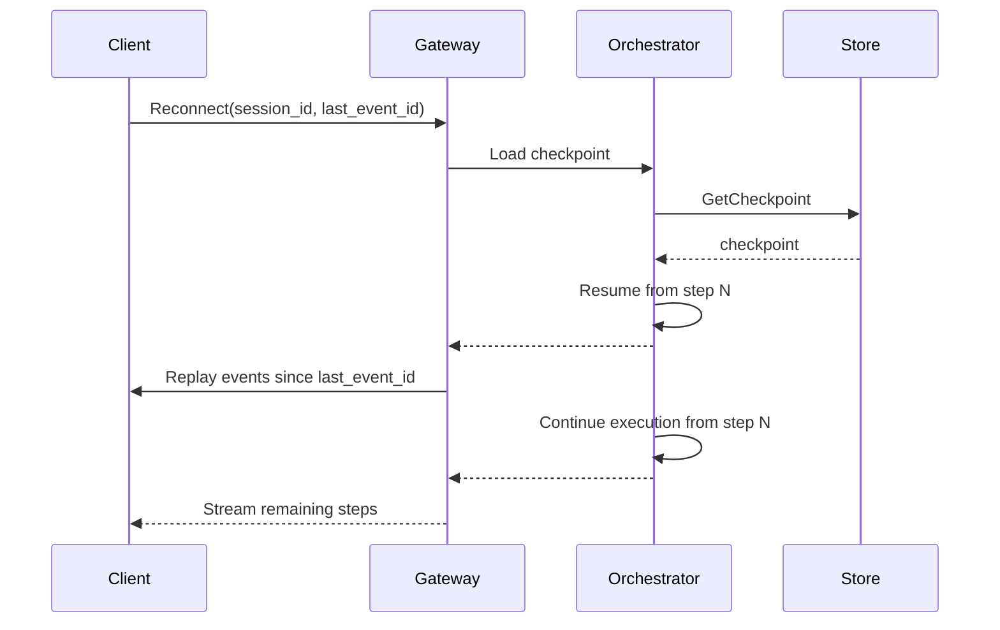
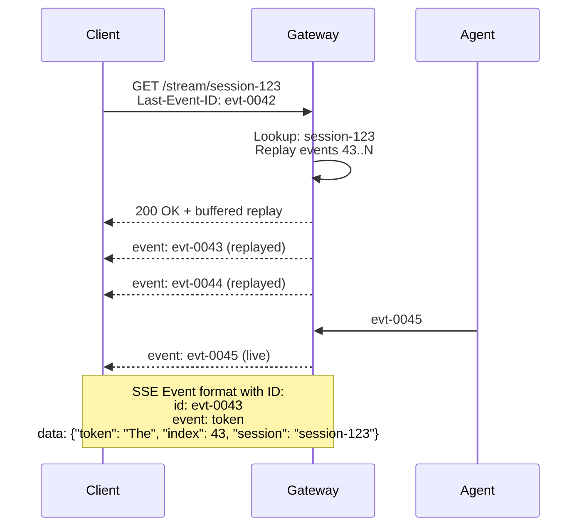
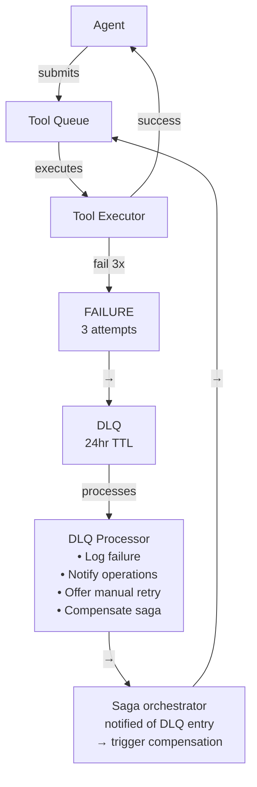
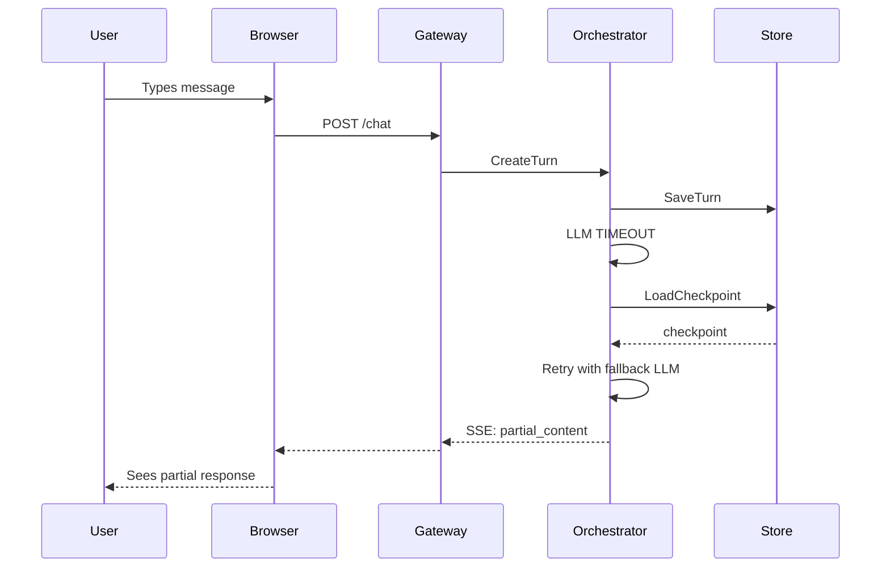
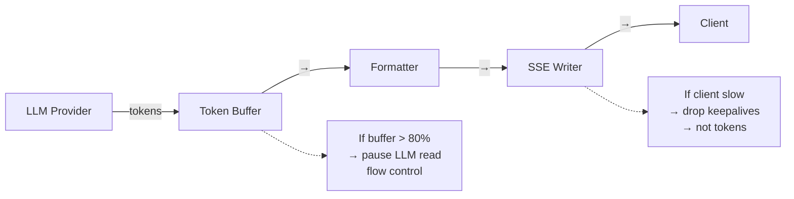

# Reliability Engineering for Agentic Applications — Part 2

Continuing the comprehensive engineering reference covering graceful degradation patterns, retry strategies, checkpoint and recovery mechanisms, multi-tool saga patterns, conversation recovery, and streaming reliability.

---

## 4. Graceful Degradation Ladder

The degradation ladder defines the service behavior at each level of impairment. The goal is to always return some value to the user rather than returning an error.

### 4.1 Degradation Levels

| Level | Name | Conditions for Entry | Active Capabilities | UX Behavior |
| ------- | ------ | --------------------- | ------------------- | ------------- |
| **L1** | Full Agentic Mode | All systems nominal | All tools, memory, planning, streaming | Full interactive agent experience |
| **L2** | Reduced Tool Set | 1–2 non-critical tools unavailable | Core tools only; non-essential tools disabled | Agent continues; mentions it "cannot perform X right now" |
| **L3** | Read-Only Mode | Write tools unavailable; DB or external APIs degraded | Read-only tools (search, retrieve, summarize) | Agent explains it's in "read-only mode"; no mutations |
| **L4** | Static / Cached | LLM provider degraded; streaming unavailable | Last-known-good cached responses; FAQ lookup | Non-streaming text responses; "using cached information" banner |
| **L5** | Human Handoff | All AI capabilities unavailable; critical failures | Zero AI capabilities | Transfer to human queue; ETA displayed; context handed off |

### 4.2 Degradation Decision Criteria

```mermaid
graph TD
    A["START: New request received"]
    B{"LLM circuit breaker OPEN?"}
    C{"Check fallback provider available?"}
    D["Use fallback<br/>stay L1 or demote to L2"]
    E["Demote to L4<br/>cached responses"]
    F{"Tool availability check:<br/>&gt; 50% tools unavailable?"}
    G["Demote to L3<br/>read-only"]
    H{"Check non-critical<br/>tools only affected"}
    I["L2"]
    J{"Memory service<br/>unavailable?"}
    K["Continue without<br/>long-term memory<br/>L2 degraded"]
    L["Continue normally"]
    M{"Guardrail service<br/>unavailable?"}
    N["Fail closed<br/>halt agent<br/>L5 if policy requires"]
    O["L1 full agentic mode"]
    
    A --> B
    B -->|YES| C
    C -->|YES| D
    C -->|NO| E
    B -->|NO| F
    F -->|YES| G
    F -->|NO| H
    H -->|non-critical only| I
    H -->|otherwise| J
    J -->|YES| K
    J -->|NO| M
    M -->|YES| N
    M -->|NO| O
```



### 4.3 UX Behavior at Each Level

| Level | UI Indicator | Message Pattern | Allow User Actions |
| ------- | ------------- | ----------------- | ------------------- |
| L1 | None (normal) | — | All |
| L2 | Yellow dot, tooltip on hover | "Some capabilities are temporarily limited." | All except unavailable tools |
| L3 | Amber banner | "Running in read-only mode. Changes require manual confirmation." | Read + explicit user-confirmed writes |
| L4 | Orange banner | "Responses may be based on recent cached information." | Read-only; no new tasks |
| L5 | Red banner + progress | "You're being connected to a human agent. Estimated wait: Xm." | View history; add context note |

### 4.4 Automatic Recovery

Degradation is not permanent. Recovery logic should:

1. Poll degraded services at increasing intervals (15s, 30s, 60s, 120s, 5min)
2. When a service recovers, promote to the next level up (not immediately to L1)
3. Soak at each intermediate level for at least 2 minutes before promoting further
4. Log all degradation transitions with duration, triggering condition, and recovery event

---

## 5. Retry Strategies

### 5.1 Exponential Backoff with Full Jitter

```python
import random
import asyncio
from typing import TypeVar, Callable, Awaitable

T = TypeVar("T")

async def retry_with_backoff(
    func: Callable[[], Awaitable[T]],
    max_attempts: int = 4,
    base_delay_ms: float = 200,
    max_delay_ms: float = 30_000,
    jitter: str = "full",   # "full", "equal", "decorrelated"
    retryable_exceptions: tuple = (TimeoutError, ConnectionError),
    non_retryable_exceptions: tuple = (ValueError, PermissionError),
) -> T:
    """
    Retry with exponential backoff. Uses full jitter to avoid
    synchronized retry storms from multiple callers.
    """
    delay_ms = base_delay_ms
    for attempt in range(max_attempts):
        try:
            return await func()
        except non_retryable_exceptions:
            raise  # Do not retry semantic or auth errors
        except retryable_exceptions as e:
            if attempt == max_attempts - 1:
                raise  # Exhausted all retries
            if jitter == "full":
                sleep_ms = random.uniform(0, delay_ms)
            elif jitter == "equal":
                sleep_ms = delay_ms / 2 + random.uniform(0, delay_ms / 2)
            else:  # decorrelated
                sleep_ms = min(max_delay_ms, random.uniform(base_delay_ms, delay_ms * 3))
            await asyncio.sleep(sleep_ms / 1000)
            delay_ms = min(delay_ms * 2, max_delay_ms)
    raise RuntimeError("Unreachable")
```

### 5.2 Retry Budget to Prevent Thundering Herd

A retry budget limits the fraction of requests that are retries at any given time, preventing a wave of failures from creating a larger wave of retries.

```python
import asyncio
from collections import deque
import time

class RetryBudget:
    """
    Token-bucket retry budget.
    Ensures retries never exceed budget_fraction of total requests.
    """
    def __init__(self, budget_fraction: float = 0.10, window_seconds: float = 60.0):
        self.budget_fraction = budget_fraction
        self.window_seconds = window_seconds
        self._request_times: deque = deque()
        self._retry_times: deque = deque()
        self._lock = asyncio.Lock()

    async def should_retry(self) -> bool:
        async with self._lock:
            now = time.monotonic()
            cutoff = now - self.window_seconds
            # Prune old entries
            while self._request_times and self._request_times[0] < cutoff:
                self._request_times.popleft()
            while self._retry_times and self._retry_times[0] < cutoff:
                self._retry_times.popleft()

            total = len(self._request_times) + 1  # +1 for current
            current_retry_rate = len(self._retry_times) / max(total, 1)

            if current_retry_rate >= self.budget_fraction:
                return False  # Budget exhausted
            return True

    async def record_request(self):
        async with self._lock:
            self._request_times.append(time.monotonic())

    async def record_retry(self):
        async with self._lock:
            self._retry_times.append(time.monotonic())
```

### 5.3 Retryable vs Non-Retryable Failures

| Category | Examples | Retry? | Action |
| ---------- | ---------- | -------- | -------- |
| **Transport — Transient** | HTTP 429, 503, 504, network timeout | Yes | Backoff with jitter; honour `Retry-After` |
| **Transport — Permanent** | HTTP 400 (bad request), 404, 405 | No | Fix request before retrying |
| **Auth** | HTTP 401, 403 | No | Refresh token first; then single retry |
| **Semantic — Reasoning Failure** | Agent returns wrong answer | No (retry) | Re-plan with different strategy |
| **Semantic — Tool Arg Error** | Tool returns arg validation error | Conditional | Fix arg; retry once only |
| **Safety / Guardrail** | Guardrail block | Never | Halt and escalate |
| **Quota Exhaustion** | Provider daily quota exceeded | No | Failover to alternate provider |
| **Context Overflow** | Token limit exceeded | No | Compress context; retry |
| **Model Unavailable** | Model deprecated or overloaded | Conditional | Failover to equivalent model |
| **Idempotency Conflict** | Duplicate tool call detected | No | Return cached result from first call |

### 5.4 Idempotency Keys for Tool Calls

Tool calls that cause side effects (database writes, email sends, file creation) must use idempotency keys to prevent duplicate execution on retry.

```python
import hashlib
import json
from datetime import datetime, timedelta
from typing import Optional, Any

class IdempotencyStore:
    """
    Stores tool call results by idempotency key.
    Prevents duplicate side effects on retry.
    """
    def __init__(self, store):  # Redis or similar
        self.store = store
        self.ttl_hours = 24

    def generate_key(
        self,
        tool_name: str,
        tool_args: dict,
        session_id: str,
        call_index: int
    ) -> str:
        """
        Idempotency key is deterministic from: session + call_index + tool + args.
        call_index prevents two different calls to the same tool in the same session
        from sharing a key.
        """
        content = json.dumps({
            "session": session_id,
            "index": call_index,
            "tool": tool_name,
            "args": tool_args,
        }, sort_keys=True)
        return f"idem:{hashlib.sha256(content.encode()).hexdigest()[:16]}"

    async def get_or_execute(
        self,
        key: str,
        executor: callable,
        *args,
        **kwargs
    ) -> Any:
        cached = await self.store.get(key)
        if cached:
            return json.loads(cached)  # Return cached result on retry
        result = await executor(*args, **kwargs)
        await self.store.setex(
            key,
            int(timedelta(hours=self.ttl_hours).total_seconds()),
            json.dumps(result)
        )
        return result
```

---

## 6. Checkpoint and Recovery

### 6.1 What to Checkpoint and When

| Checkpoint Type | What to Save | Trigger | Storage | Retention |
| ---------------- | ------------- | --------- | --------- | ----------- |
| **Turn Checkpoint** | User message + agent response + tool calls | Every conversation turn | Redis (hot) | 24 hours |
| **Step Checkpoint** | Individual agent action + state before/after | Every tool call | Redis + DB | 7 days |
| **Plan Checkpoint** | Current plan + completed steps + remaining steps | After planning phase | DB | Task lifetime |
| **Context Snapshot** | Full assembled context at inference time | Per LLM call (sampled) | Object storage | 30 days |
| **Session Checkpoint** | Session metadata, user ID, task queue | On session start/end | DB | 90 days |
| **Streaming Position** | Last SSE event ID sent to client | Per event | Redis | 1 hour |

### 6.2 Checkpoint Schema

```python
from dataclasses import dataclass, field
from datetime import datetime
from typing import Any, Optional
import uuid

@dataclass
class AgentStepCheckpoint:
    checkpoint_id: str = field(default_factory=lambda: str(uuid.uuid4()))
    session_id: str = ""
    task_id: str = ""
    step_number: int = 0
    created_at: datetime = field(default_factory=datetime.utcnow)

    # State
    plan: dict = field(default_factory=dict)          # Current plan
    completed_steps: list = field(default_factory=list)  # Completed steps
    remaining_steps: list = field(default_factory=list)  # Remaining steps
    tool_results: dict = field(default_factory=dict)  # Accumulated tool results

    # Context
    conversation_history: list = field(default_factory=list)
    user_preferences: dict = field(default_factory=dict)

    # Metadata
    last_tool_call: Optional[dict] = None
    last_tool_result: Optional[Any] = None
    error_count: int = 0
    last_error: Optional[str] = None

    # Recovery
    is_terminal: bool = False
    recovery_attempts: int = 0
    idempotency_keys_used: list = field(default_factory=list)
```

### 6.3 Workflow Resumption Sequence



### 6.4 Streaming Session Recovery



---

## 7. Saga Patterns for Multi-Tool Workflows

### 7.1 Choreography vs Orchestration Sagas

| Aspect | Choreography Saga | Orchestration Saga |
| -------- | ------------------- | ------------------- |
| **Control** | Distributed — each tool publishes events; next tool subscribes | Centralized — orchestrator directs each tool call |
| **Coupling** | Low — tools independent | Higher — tools depend on orchestrator |
| **Visibility** | Hard to trace end-to-end flow | Easy to trace; single execution log |
| **Failure handling** | Each tool handles own compensation; complex coordination | Orchestrator handles all compensation; simpler |
| **Scalability** | High — independent scaling | Orchestrator becomes bottleneck at scale |
| **Best for** | Loosely coupled, event-driven pipelines | Complex, sequential agent workflows |
| **Recommended for agentic UI** | Background data pipelines | Interactive agent tasks |

### 7.2 Compensation Actions

Every tool call that causes side effects must have a defined compensation (rollback) action.

| Tool Call | Side Effect | Compensation Action | Compensation Safety |
| ----------- | ------------ | --------------------- | --------------------- |
| `create_file` | File created in object store | `delete_file(file_id)` | Safe to retry |
| `send_email` | Email sent | Cannot unsend — log compensation failure | Requires deduplication |
| `write_database` | Row inserted/updated | `rollback_transaction(tx_id)` | Idempotent |
| `create_ticket` | Ticket created in Jira/ServiceNow | `cancel_ticket(ticket_id)` | Safe to retry |
| `schedule_meeting` | Meeting scheduled | `cancel_meeting(meeting_id)` | Safe to retry |
| `charge_payment` | Payment charged | `refund_payment(charge_id)` | External API; log if fails |
| `deploy_artifact` | Deployment triggered | `rollback_deployment(deploy_id)` | Complex; may require manual |
| `provision_resource` | Cloud resource created | `deprovision_resource(resource_id)` | Async; may take minutes |

### 7.3 Saga Rollback Sequence

```text
Saga Rollback — Multi-Tool Workflow Failure at Step 4

Step 1: create_ticket    --- SUCCESS --- compensation: cancel_ticket(T-001)
Step 2: fetch_data       --- SUCCESS --- compensation: (read-only, no compensation)
Step 3: write_database   --- SUCCESS --- compensation: rollback_transaction(TX-007)
Step 4: send_notification -- FAILURE --- (no side effect yet)
Step 5: create_report    --- NOT REACHED

ROLLBACK SEQUENCE (reverse order):
  4. send_notification → failed; no compensation needed
  3. rollback_transaction(TX-007) → SUCCESS
  2. fetch_data → read-only; skip
  1. cancel_ticket(T-001) → SUCCESS

Final state: Clean rollback achieved.
Log: saga_id=s-xyz, failed_at=step_4, rollback_status=complete
```

### 7.4 Dead Letter Queue Pattern



---

## 8. Conversation Recovery

### 8.1 Mid-Conversation Failure Recovery Sequence



### 8.2 Session Expiry Handling

| Expiry Scenario | Detection | Recovery | User Experience |
| ---------------- | ----------- | --------- | ----------------- |
| Idle timeout (&lt; 30min) | Session TTL check | Resume from last turn checkpoint | "Resuming your conversation..." |
| Idle timeout (30–120min) | Session TTL check | Reload full session from DB | Brief loading state; full context restored |
| Idle timeout (&gt; 2hr) | Session TTL check | Offer to summarize and restart | "Your session expired. Here's a summary of what we discussed." |
| Auth token expiry | 401 on next request | Silent token refresh + retry | Transparent (no UX interruption) |
| Server restart (rolling deploy) | Connection closed | Reconnect + replay from Last-Event-ID | Brief reconnecting indicator |
| Region failover | 503 on endpoint | Redirect to secondary region | 2–5s reconnect delay |

### 8.3 State Synchronization on Reconnect

```python
async def sync_state_on_reconnect(
    session_id: str,
    client_last_event_id: str,
    store: ConversationStore,
    stream: SSEStream
) -> None:
    """
    On client reconnect, replay any events the client missed
    since its last received event ID.
    """
    checkpoint = await store.load_checkpoint(session_id)
    if not checkpoint:
        await stream.send_event("error", {"code": "SESSION_NOT_FOUND"})
        return

    # Find events after last_event_id
    missed_events = await store.get_events_after(
        session_id=session_id,
        after_event_id=client_last_event_id,
        limit=1000  # Safety cap
    )

    # Replay missed events
    for event in missed_events:
        await stream.send_event(event.type, event.data, event_id=event.id)

    # Send current state snapshot
    await stream.send_event("state_sync", {
        "status": checkpoint.status,
        "current_step": checkpoint.step_number,
        "plan_summary": checkpoint.plan.get("summary", ""),
    })
```

---

## 9. Streaming Reliability

### 9.1 SSE Reconnect with Last-Event-ID

```mermaid
sequenceDiagram
    participant Browser
    participant Server
    
    Browser->>Server: GET /stream (EventSource)
    Server-->>Browser: 200 OK; text/event-stream
    Server-->>Browser: id: 001<br/>data: {"token": "Hello"}
    Server-->>Browser: id: 002<br/>data: {"token": " world"}
    Note over Browser: network interruption...
    Browser->>Server: GET /stream<br/>Last-Event-ID: 002
    Note over Server: Lookup: events after 002
    Server-->>Browser: id: 003 (replayed)<br/>data: {"token": " from"}
    Server-->>Browser: id: 004 (live)<br/>data: {"token": " server"}
    Note over Browser,Server: Server must:<br/>1. Assign monotonic IDs to every event<br/>2. Buffer last N events per session (default: 60s)<br/>3. Send retry: &lt;ms&gt; directive<br/>4. Flush ':keepalive' every 15s
```

### 9.2 Backpressure in Streaming Pipelines



### 9.3 Partial Content Recovery

When a stream is interrupted mid-response, partial content must be handled gracefully:

| Scenario | Detection | Recovery Strategy |
| ---------- | ----------- | ------------------ |
| Stream interrupted mid-sentence | Client received partial `delta` events without `done` | On reconnect, replay missing events; merge with partial |
| Stream interrupted mid-tool-call | `tool_call_start` received; no `tool_call_result` | Re-execute tool call with idempotency key |
| Stream interrupted during thinking | `thinking` block incomplete | Discard incomplete thinking block; restart from last turn checkpoint |
| SSE connection lost (no Last-Event-ID) | Fresh connection after error | Fall back to REST polling endpoint for task status |

---

## 10. Offline Support

### 10.1 Local State Caching Strategy

| Cache Type | Storage Mechanism | Scope | TTL | Eviction Policy |
| ------------ | ----------------- | ------- | ----- | ----------------- |
| Conversation history | IndexedDB | Session | 7 days | LRU per session |
| User preferences | localStorage | User | Permanent | Manual clear |
| Tool response cache | IndexedDB | Session | 1 hour | TTL expiry |
| Draft messages | sessionStorage | Tab | Session end | Auto-clear |
| Static UI assets | Service Worker cache | Global | Deploy cycle | Network-first |
| Agent output cache | IndexedDB | Session | 30 min | LRU |

### 10.2 Optimistic Updates with Rollback

```typescript
// Optimistic update pattern for agentic UI
interface OptimisticAction {
  id: string;
  type: string;
  payload: unknown;
  rollbackPayload: unknown;
  timestamp: number;
}

class OptimisticUpdateManager {
  private pending = new Map&lt;string, OptimisticAction&gt;();

  applyOptimistic(action: OptimisticAction, applyFn: (p: unknown) =&gt; void): void {
    this.pending.set(action.id, action);
    applyFn(action.payload);  // Immediately update UI
  }

  confirm(actionId: string): void {
    this.pending.delete(actionId);  // Server confirmed; discard rollback
  }

  rollback(actionId: string, rollbackFn: (p: unknown) =&gt; void): void {
    const action = this.pending.get(actionId);
    if (action) {
      rollbackFn(action.rollbackPayload);  // Revert UI to previous state
      this.pending.delete(actionId);
    }
  }
}
```

### 10.3 Queue-and-Sync Pattern

When the client is offline, queue user requests locally and sync when connectivity is restored:

User (offline) → Request queued in IndexedDB → UI shows "Will send when online"

Network restored → Service Worker: flush queue → POST each queued request in order → Handle conflicts (server state may have changed) → Update UI with server responses

Conflict resolution:
- Read-only requests: always safe to replay
- Write requests: use idempotency key + last-write-wins or user prompt
- Stale context: warn user that context was assembled while offline

---

## Related Links

- [Part 1: Reliability Engineering Fundamentals](../16-reliability-engineering.md)
- [Part 3: Multi-Region &amp; Chaos Engineering](./16-reliability-engineering-part3.md)
