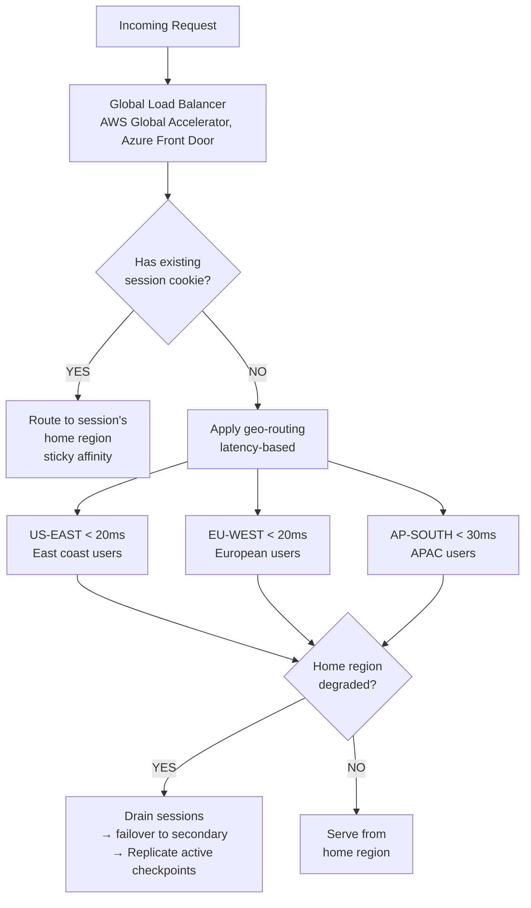

# Reliability Engineering for Agentic Applications — Part 3

Continuing with multi-region reliability, chaos engineering, error budget management, reliability maturity assessment, incident response runbooks, and architectural anti-patterns.

---

## 11. Multi-Region Reliability

### 11.1 Active-Active vs Active-Passive

| Architecture | Active-Active | Active-Passive |
| ------------- | -------------- | ---------------- |
| **Traffic distribution** | All regions serve traffic | Primary serves all; secondary on standby |
| **Failover time** | Seconds (load balancer reroute) | Minutes (DNS change + warm-up) |
| **State complexity** | High — state must be replicated across regions | Low — single authoritative primary |
| **Cost** | 2× active infrastructure | 1.5× (passive region has reduced capacity) |
| **RPO** | Near-zero (data already in all regions) | Minutes (last replication lag) |
| **RTO** | Seconds | 2–10 minutes |
| **Best for** | High-traffic consumer apps; &lt; 200ms latency required | Enterprise SaaS; cost-sensitive; data residency constraints |
| **Agentic session continuity** | Complex — session state must follow user | Simple — always reconnect to primary |

### 11.2 Session Affinity and Geo-Routing



### 11.3 State Replication Strategy

| State Type | Replication Method | RPO | Consistency Model |
| ------------ | ------------------- | ----- | ------------------- |
| Conversation checkpoints | Async replication (Redis Streams) | &lt; 5s | Eventual |
| User preferences | Synchronous write (primary + immediate replication) | 0 | Strong |
| Session metadata | Async replication | &lt; 2s | Eventual |
| Tool idempotency cache | Sync write to primary; read from any region | 0 (primary) | Primary-preferred reads |
| Vector memory index | Pre-computed; deployed as snapshot | Per-deploy | Snapshot |
| Authentication tokens | Multi-region KV (e.g., DynamoDB Global Tables) | &lt; 1s | Eventual |

---

## 12. Chaos Engineering for Agentic Systems

### 12.1 Chaos Test Catalog

| Experiment | Failure Mode | Hypothesis | Success Criteria |
| ------------ | ------------- | ----------- | ----------------- |
| **LLM Provider Timeout** | Inject 30s delay on all LLM calls | System degrades to L2 and uses fallback provider | TTFT degrades gracefully; no 500 errors to user |
| **Tool Failure Injection** | 50% failure rate on `search_web` tool | Agent replans using alternate information sources | Task completion rate drops &lt; 15%; no crashes |
| **Context Overflow Stress** | Force context to 95% of max token budget | Context compression activates; response quality maintained | No silent truncation of system prompt; latency &lt; 2× baseline |
| **Streaming Interruption** | Drop SSE connection every 30 seconds | Client reconnects and replays; no message loss | Zero message loss; reconnect time &lt; 3s |
| **Memory Service Outage** | Take vector DB offline | Agent operates without long-term memory; quality degraded but functional | No crashes; user informed; session memory still works |
| **Guardrail Service Slow** | Inject 5s latency on guardrail checks | Agent does not bypass guardrail; waits or fails safely | No unguarded LLM calls; latency acceptable |
| **Cascading Tool Failure** | Fail 3 of 5 tools simultaneously | Agent activates degradation ladder L3 (read-only) | Correct degradation level reached within 10s |
| **Region Failover** | Kill primary region instances | Traffic rerouted to secondary; checkpoints available | RTO &lt; 3 min; conversation history preserved |
| **Token Rate Limit Spike** | Exhaust provider token-per-minute limit | Circuit breaker opens; queued requests wait | No user-facing errors for first 2min; degraded after |
| **DLQ Overflow** | Overwhelm dead letter queue processor | DLQ drains in order; compensation executes correctly | No lost compensations; alerts fire |

### 12.2 Failure Injection Framework

```python
# Chaos engineering middleware for agentic runtime
import random
import asyncio
from dataclasses import dataclass
from typing import Optional

@dataclass
class ChaosConfig:
    enabled: bool = False
    environment: str = "staging"  # Only enable in non-production
    experiments: dict = None

class ChaosMiddleware:
    """
    Inject controlled failures into the agentic runtime.
    MUST only be enabled in staging/canary environments.
    """
    def __init__(self, config: ChaosConfig):
        assert config.environment != "production", \
            "FATAL: Chaos middleware must not run in production"
        self.config = config

    async def maybe_inject(self, component: str, **kwargs):
        if not self.config.enabled:
            return
        experiment = (self.config.experiments or {}).get(component)
        if not experiment:
            return

        fault_type = experiment.get("type")
        probability = experiment.get("probability", 0.0)

        if random.random() > probability:
            return  # No fault this time

        if fault_type == "timeout":
            delay = experiment.get("delay_seconds", 30)
            await asyncio.sleep(delay)
            raise TimeoutError(f"CHAOS: Injected timeout for {component}")

        elif fault_type == "error":
            error_class = experiment.get("error_class", "RuntimeError")
            raise RuntimeError(f"CHAOS: Injected error for {component}")

        elif fault_type == "slow":
            delay = experiment.get("delay_seconds", 5)
            await asyncio.sleep(delay)
            # Continue normally but slowly
```

### 12.3 Recovery Validation Playbook

For each chaos experiment, run the following validation sequence:

1. **Baseline measurement** — record P50/P95/P99 latency, task completion rate, error rate for 10 minutes
2. **Inject fault** — activate the chaos experiment
3. **Observe degradation** — verify that degradation matches hypothesis (correct level, correct UX)
4. **Measure recovery signals** — how long until circuit breaker opens, degradation ladder activates
5. **Remove fault** — deactivate chaos experiment
6. **Observe recovery** — verify system returns to L1 within expected time
7. **Post-experiment analysis** — compare baseline vs fault vs recovery metrics; document gaps

---

## 13. Error Budget Management

### 13.1 Error Budget Policy

| Budget Remaining | Engineering Stance | Allowed Activities | Prohibited Activities |
| ----------------- | ------------------ | -------------------- | ----------------------- |
| &gt; 75% | Feature velocity | All releases; A/B experiments; infrastructure changes | None |
| 50–75% | Normal caution | All releases with standard review | Risky infra migrations |
| 25–50% | Elevated caution | Features only with enhanced testing | Non-critical infra changes |
| 10–25% | Reliability focus | Bug fixes and reliability improvements only | New features; experiments |
| 0–10% | Reliability emergency | Hotfixes and rollbacks only | All new deployments |
| Exhausted | Feature freeze | Reliability remediation only | All feature work until recovered |

### 13.2 Automatic Feature Freeze Triggers

```yaml
# AlertManager rules for error budget enforcement
groups:
  - name: error_budget
    rules:
      - alert: ErrorBudgetFastBurn
        expr: |
          (
            1 - (
              sum(rate(http_requests_total{status!~"5.."}[1h]))
              / sum(rate(http_requests_total[1h]))
            )
          ) / (1 - 0.999) > 14.4
        for: 2m
        labels:
          severity: critical
          action: feature_freeze
        annotations:
          summary: "Fast burn: error budget consumed at 14.4× rate"
          runbook: "https://runbooks.internal/error-budget-fast-burn"

      - alert: ErrorBudgetSlowBurn
        expr: |
          (
            1 - (
              sum(rate(http_requests_total{status!~"5.."}[6h]))
              / sum(rate(http_requests_total[6h]))
            )
          ) / (1 - 0.999) > 6
        for: 15m
        labels:
          severity: warning
          action: deployment_pause
        annotations:
          summary: "Slow burn: error budget consumed at 6× rate"
```

### 13.3 Error Budget Recovery Plan

When the error budget is exhausted, the following recovery sequence applies:

1. **Declare reliability incident** — all stakeholders notified; feature work halted
2. **Root cause analysis** — identify the highest-impact error sources (Pareto: top 3 causes typically account for 80% of errors)
3. **Reliability sprint** — dedicated sprint for fixes; no new features
4. **Canary validation** — fixes deployed to canary (5% traffic) for 48 hours before full rollout
5. **Budget recovery confirmation** — require 72 hours of nominal burn rate before lifting freeze
6. **Post-mortem** — document causes, fixes, and process changes to prevent recurrence

---

## 14. Reliability Scorecard Template

Score each dimension 0–5 (0 = not implemented; 3 = partially implemented; 5 = fully implemented with monitoring and runbooks).

| # | Reliability Dimension | Score (0–5) | Evidence | Priority |
| --- | ---------------------- | ------------- | --------- | --------- |
| 1 | SLO defined for all critical paths | | | |
| 2 | SLI measurement automated and dashboarded | | | |
| 3 | Error budget calculated and tracked | | | |
| 4 | Burn rate alerts configured (fast + slow) | | | |
| 5 | Circuit breaker on LLM provider(s) | | | |
| 6 | Circuit breaker on all external tool APIs | | | |
| 7 | Bulkhead isolation (LLM pool / tool pool / UI pool) | | | |
| 8 | Timeout hierarchy defined and enforced | | | |
| 9 | Graceful degradation ladder implemented (5 levels) | | | |
| 10 | Retry strategy: backoff + jitter + budget | | | |
| 11 | Idempotency keys on all write-side tool calls | | | |
| 12 | Step-level checkpointing for agent tasks | | | |
| 13 | Streaming reconnect with Last-Event-ID | | | |
| 14 | Conversation history persisted (turn-level) | | | |
| 15 | Saga compensation actions defined for all tools | | | |
| 16 | Dead letter queue for failed tool calls | | | |
| 17 | Chaos test suite (≥ 5 experiments run quarterly) | | | |
| 18 | Multi-region failover tested (RTO validated) | | | |
| 19 | Offline mode / service worker caching | | | |
| 20 | Incident runbook published and rehearsed | | | |

**Scoring Guidance:**

| Total Score | Maturity Level | Recommended Action |
| ------------- | --------------- | ------------------- |
| 0–40 | Initial | Focus on SLOs, circuit breakers, and checkpointing first |
| 41–60 | Developing | Implement retry budgets, saga patterns, chaos tests |
| 61–80 | Defined | Tune multi-region, streaming recovery, offline support |
| 81–90 | Managed | Automate error budget policies; run quarterly game days |
| 91–100 | Optimizing | Continuous chaos engineering; predictive degradation |

---

## 15. Incident Response Runbook

### 15.1 Agentic System Incident Classification

| Severity | Criteria | Response Time | Escalation |
| ---------- | --------- | --------------- | ----------- |
| **SEV-1** | Total agent unavailability; data loss; safety guardrail bypassed | 5 minutes | On-call engineer + team lead + VP Engineering |
| **SEV-2** | &gt; 50% task failure rate; &gt; 5min TTFT for all users; LLM provider down | 15 minutes | On-call engineer + team lead |
| **SEV-3** | Degraded mode active; quality SLI breach; &gt; 20% tool failure rate | 1 hour | On-call engineer |
| **SEV-4** | Elevated error rate; single-user bug; performance regression | Next business day | Engineering team standup |

### 15.2 SEV-1 Runbook: Total Agent Unavailability

```text
INCIDENT RUNBOOK: SEV-1 — Total Agent Unavailability
=======================================================

DETECTION:
  • PagerDuty alert: ErrorBudgetFastBurn (circuit breaker count ≥ 3)
  • User reports: "agent not responding"
  • Availability SLO panel: red

STEP 1 — TRIAGE (0–5 min):
  □ Check status dashboard: which components are red?
  □ Check LLM provider status pages (Anthropic, OpenAI status URLs)
  □ Check circuit breaker states: GET /internal/circuit-breakers
  □ Check error logs: last 50 errors from agent orchestrator
  □ Determine: infrastructure failure OR provider failure OR code regression?

STEP 2 — IMMEDIATE MITIGATION (5–15 min):
  If provider failure:
    □ Enable fallback provider in AI Gateway config
    □ Verify fallback circuit breaker is CLOSED
    □ Monitor: task completion rate should recover within 2 min

  If code regression (recent deploy):
    □ Roll back last deploy: kubectl rollout undo deploy/agent-orchestrator
    □ Verify rollback completes: kubectl rollout status deploy/agent-orchestrator
    □ Monitor error rate for 5 min

  If infrastructure failure:
    □ Activate degradation Level 5 (human handoff mode)
    □ Notify customer success team: users being routed to human agents
    □ Escalate to infrastructure on-call

STEP 3 — COMMUNICATION (within 15 min):
  □ Post to #incidents Slack: SEV-1 declared, impact, mitigation in progress
  □ Update status page: "We are aware of issues affecting the AI assistant"
  □ Internal stakeholder update every 30 min

STEP 4 — RESOLUTION:
  □ Confirm error rate below SLO threshold for 10 consecutive minutes
  □ Confirm task completion rate ≥ 92% for 10 minutes
  □ Confirm no circuit breakers open
  □ Lift degradation mode
  □ Post resolution to status page

STEP 5 — POST-MORTEM:
  □ Timeline written within 24 hours
  □ Root cause identified
  □ Action items assigned with owners and due dates
  □ Runbook updated with learnings
```

### 15.3 SEV-2 Runbook: LLM Provider Degraded

```text
INCIDENT RUNBOOK: SEV-2 — LLM Provider Degraded
=================================================

DETECTION:
  • TTFT P95 &gt; 5s for 5+ minutes
  • Tool success rate for LLM-dependent tools &lt; 80%
  • Circuit breaker for primary LLM provider: OPEN

IMMEDIATE ACTIONS:
  1. Check AI Gateway circuit breaker status
  2. Verify fallback model configured in gateway routing rules
  3. If fallback not available: activate degradation L4
  4. Post to #incidents: "LLM provider degraded; fallback active"
  5. Monitor: task quality on fallback model (may differ from primary)

RECOVERY:
  1. Primary provider recovers: circuit breaker moves HALF_OPEN
  2. Monitor for 10 probe requests before closing
  3. Gradually shift traffic back: 10% → 25% → 50% → 100% over 20 min
  4. Remove fallback routing rule after 30 min of stability
```

---

## 16. Reliability Anti-Patterns

| # | Anti-Pattern | Description | Impact | Correct Pattern |
| --- | ------------- | ------------- | -------- | ----------------- |
| 1 | **Unbounded Retry Loop** | Agent retries indefinitely on the same failing step | Cost explosion; thundering herd | Retry budget ≤ 10%; 3-strike halt rule |
| 2 | **Safety Bypass Retry** | Rephrasing prompt to get around guardrail block | Security incident | Halt and escalate on any safety block |
| 3 | **Semantic Failure as Transport Retry** | Retrying same prompt after bad reasoning | Same wrong output | Detect failure class; re-plan for semantic failures |
| 4 | **Silent Context Truncation** | Dropping earlier context without telling the model | Agent forgets constraints; inconsistent decisions | Explicit context budget management; compression triggers |
| 5 | **Fan-Out Retry Storm** | Multiple sub-agents retry independently on shared provider | 10–100× provider load amplification | Centralized retry budget at gateway |
| 6 | **Timeout Nesting Violation** | Inner timeout ≥ outer timeout | Both expire simultaneously; unclear failure source | Inner timeout = 60–80% of outer timeout |
| 7 | **Missing Idempotency Keys** | Write-side tool calls retried without deduplication | Duplicate emails, double charges, duplicate records | Idempotency keys on all write operations |
| 8 | **Checkpoint Skipping** | No step-level checkpoints for long tasks | Task lost on crash; no recovery path | Checkpoint after every tool call |
| 9 | **Missing Compensation** | Saga has no rollback actions defined | Inconsistent state after partial failure | Compensation action required for every side effect |
| 10 | **Circuit Breaker on Wrong Scope** | Single circuit breaker for all tools | One bad tool opens breaker; all tools fail | Per-tool circuit breakers |
| 11 | **Health Check Lying** | Health endpoint returns 200 even when degraded | Load balancer sends traffic to unhealthy instance | Deep health checks (LLM reachable + tool reachable) |
| 12 | **No Graceful Degradation** | System returns 500 when any component fails | All-or-nothing failure; poor UX | Degradation ladder with partial functionality |
| 13 | **Full Context Reload on Reconnect** | Reloads entire conversation history on every reconnect | Latency spike; expensive | Replay only events since Last-Event-ID |
| 14 | **Synchronous Saga Rollback** | Blocking rollback of 10+ tool calls in sequence | Long user-visible delay on failure | Async rollback; return user to safe state immediately |
| 15 | **Unevaluated Fallback Model** | Switching to cheaper model without quality validation | Silent quality degradation | All fallback models must pass eval suite |
| 16 | **Missing DLQ** | Failed tool calls discarded with no reprocessing path | Silent data loss; incomplete sagas | DLQ with 24-hour retention and processor |
| 17 | **Hallucination Cascade** | Agent's bad output becomes next agent's assumed fact | Pipeline-wide incorrect output | Verification gates between agents |
| 18 | **Orphaned Work on Crash** | In-flight work has no recovery path after crash | Tasks lost; side effects partially executed | Durable workflow engine required |
| 19 | **Error Budget Ignored** | SLOs defined but error budget not tracked or acted on | Budget exhausted; no feature freeze; breach | Automated burn rate alerts with automatic freeze triggers |
| 20 | **Chaos Testing Not Practiced** | Reliability designed but never validated under failure | Untested recovery paths fail in production | Quarterly chaos game days |
| 21 | **Single-Region LLM Routing** | All LLM calls go to one provider region | Regional outage = full outage | Multi-region routing with active-active providers |
| 22 | **Streaming Without Heartbeat** | SSE stream with no keepalive messages | Proxies close idle connections; clients miss events | Heartbeat comment every 15s |
| 23 | **Missing Retry-After Respect** | Ignores `Retry-After` header on 429 responses | Immediate retry worsens rate limit situation | Always honour `Retry-After` |
| 24 | **Quality SLIs Not Measured** | Only transport metrics tracked; semantic quality ignored | Quality degradation invisible | LLM judge evaluation pipeline with quality SLIs |
| 25 | **HITL as Last Resort** | Human escalation only after complete failure | User already frustrated; too late | HITL proactively at quality SLI breach |

---

## Related Links

- [Part 1: Reliability Engineering Fundamentals](../16-reliability-engineering.md)
- [Part 2: Retry Strategies, Checkpointing &amp; Streaming](./16-reliability-engineering-part2.md)
