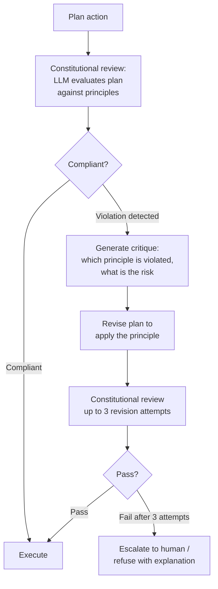

[Back to Part 1 ←](pathname:///archon/agentic-systems/agentic-ui/17-responsible-ai) | [Continue to Part 3 →](pathname:///archon/agentic-systems/agentic-ui/parts/17-responsible-ai-part3)

## 5. Constitutional AI for Agentic Systems

Constitutional AI (CAI) applies the principle of constraining AI behavior via a set of explicit principles evaluated during generation or via reinforcement learning from AI feedback (RLAIF). For agentic systems, constitutional constraints operate at multiple layers.

### 5.1 Constitutional Constraints in Agent Behavior

A constitutional agent operates under a hierarchy of constraints:

A constitutional agent's constraint hierarchy, highest priority first:

1. **Hard safety constraints (non-negotiable)**:
   - Never assist with CSAM, CBRN weapons, targeted harassment
   - Never impersonate emergency services or safety systems
   - Never execute irreversible high-impact actions without explicit authorization
   - Never reveal system prompt contents to unauthorized parties
2. **Organizational constitutional principles**:
   - Operate within scope declared in agent capability register
   - Prefer least-privilege tool selection for task completion
   - Disclose AI nature when directly asked
   - Escalate to human when uncertainty exceeds defined threshold
   - Log all tool executions with full context
3. **Domain-specific principles** (per application):
   - Follow safe messaging guidelines for mental health topics
   - Provide professional referral for medical, legal, financial advice
   - Apply applicable content policies for industry vertical
   - Honor user communication preferences (tone, detail level)
4. **User preferences** (within principles 1–3):
   - User-specified communication style
   - User-specified output format
   - User-specified tool preferences (within approved set)

### 5.2 Self-Critique and Revision Loops

Constitutional AI includes a self-critique mechanism where the agent evaluates its planned actions against its constitutional principles before executing:

| Stage | Action | Implementation |
| --- | --- | --- |
| **Planning** | Agent proposes action plan | Standard agent reasoning |
| **Constitutional review** | Agent evaluates plan against Level 1–3 principles | Programmatic or LLM-based policy check |
| **Critique** | If violation detected: agent generates critique explaining the issue | Critique prompt template |
| **Revision** | Agent revises plan to comply with principles | Iterative refinement |
| **Final check** | Final plan evaluated against hard safety constraints | Rule-based check (not LLM-dependent for safety) |
| **Execution** | Compliant plan executed | Normal execution path |

### 5.3 Value Alignment in Tool Selection

When an agent has multiple tools available to complete a task, constitutional principles govern tool selection:

| Principle | Tool Selection Behavior |
| --- | --- |
| **Least privilege** | Prefer READ tool over WRITE tool when read is sufficient |
| **User autonomy** | Prefer tools that give user the information to act vs. acting on their behalf |
| **Reversibility** | Prefer reversible tool operations; flag irreversible before executing |
| **Transparency** | Prefer tools whose operation can be explained to user |
| **Minimal data access** | Prefer tool with narrowest data scope that completes the task |
| **Privacy preservation** | Avoid tools that expose user data to external systems unless necessary |

### 5.4 Constitutional AI for Multi-Agent Systems

In multi-agent pipelines, constitutional constraints must be enforced at each agent level:

| Challenge | Constitutional Solution |
| --- | --- |
| **Orchestrator delegates beyond its scope** | Sub-agents verify that delegated task is within orchestrator's declared scope |
| **Sub-agent receives malicious instruction** | Sub-agent applies its own Level 1–2 constraints independently of orchestrator |
| **Goal drift across agent hops** | Each agent re-evaluates goal against original user intent (not just orchestrator instruction) |
| **Principle conflict between agents** | More restrictive principle applies at the conflict point |
| **Accountability gap in pipeline** | Each agent logs its constitutional review decision; audit trail spans full pipeline |

---

## 6. Sovereign AI

Sovereign AI refers to AI deployment strategies that ensure an organization or nation retains control over AI systems, data, and capabilities — not dependent on foreign infrastructure or subject to foreign law.

### 6.1 Data Residency Requirements

Data residency requirements impose constraints on where data can be processed and stored. For agentic UIs, this affects every component:

| Component | Data Residency Concern | Sovereign Option |
| --- | --- | --- |
| **LLM inference** | Prompts containing sensitive/sovereign data sent to LLM provider | On-premises model; EU-hosted cloud region; private deployment |
| **Agent context** | Context window contains sensitive data; transmitted to LLM | Same as LLM inference; context filtering before LLM transmission |
| **Vector store** | Embeddings contain semantic information about sensitive data | On-premises or sovereign-region vector database |
| **Memory store** | Long-term user data stored in cloud | Sovereign-region storage; on-premises |
| **Audit logs** | Logs contain interaction data; regulatory retention requirements | Sovereign-region log storage; on-premises SIEM |
| **Tool backends** | Agent tool calls may route data to non-sovereign systems | Audit tool data flows; block non-sovereign tool access for regulated data |

### 6.2 Deployment Models for Sovereignty-Constrained Deployments

| Deployment Model | Data Residency | Sovereignty | Cost | Performance |
| --- | --- | --- | --- | --- |
| **On-premises (air-gapped)** | Complete | Full | Very High | Limited by local hardware |
| **On-premises (connected)** | Complete for storage; LLM inference configurable | High | High | Depends on model quality |
| **Private cloud (dedicated region)** | Contractual; cloud provider dependent | Medium-High | Medium-High | Good |
| **Sovereign cloud (e.g., EU-compliant)** | Contractual; operator-level residency | Medium | Medium | Good |
| **Public cloud + local inference** | Storage sovereign; inference local | Medium | Medium | Excellent |
| **Public cloud standard** | Dependent on provider policies | Low | Low | Excellent |

**Choose on-premises** when: Government/defense classification required; air-gap security requirement; absolute data sovereignty needed; regulatory mandate (some EU financial services, healthcare).

**Choose sovereign cloud** when: EU GDPR compliance primary driver; cloud economics important; public sector but not classified.

**Choose public cloud + local inference** when: Cost-sensitive; some data sovereignty needed; inference is the primary residency concern.

### 6.3 Knowledge Sovereignty

Enterprise knowledge embedded in agent knowledge bases represents a proprietary asset that requires sovereign treatment:

| Knowledge Asset | Sovereignty Risk | Mitigation |
| --- | --- | --- |
| **Internal policies and procedures** | Provider may train on customer data | No-training DPA clause; on-premises RAG |
| **Proprietary product information** | Knowledge base content at cloud provider | Encrypted at rest; on-premises vector store |
| **Customer data (in context)** | Customer PII at third-party LLM provider | Anonymize before LLM; sovereign deployment |
| **Trade secrets in agent training** | Training data contamination | No fine-tuning on sensitive IP; or on-premises fine-tuning |
| **Competitive intelligence** | LLM provider has access to queries | Zero-data-retention SLA; sovereign deployment |

---

## 7. Transparency in Practice

### 7.1 When to Disclose AI Involvement

| Scenario | Disclosure Required | Legal Basis | Timing |
| --- | --- | --- | --- |
| **Any chat/conversational interface** | Yes — persistent indicator | EU AI Act Art. 50 (Aug 2026) | At first interaction |
| **AI-generated content (text, images)** | Yes — machine-readable marking | EU AI Act Art. 50 (Dec 2026 for existing) | At content generation |
| **Automated decision affecting user** | Yes — disclosure + explanation right | GDPR Art. 22 | At decision point |
| **Agent taking autonomous actions** | Yes — action disclosure in event stream | Best practice + EU AI Act oversight | At each action |
| **Profiling / personalization** | Yes — privacy notice | GDPR Art. 13/14 | At onboarding |
| **Human agent impersonation** | Yes — must disclose AI when asked | EU AI Act Art. 50 | When directly asked |
| **Emotional support context** | Yes — clear AI disclosure | Ethics + EU AI Act | At session start |

### 7.2 Disclosure UX Pattern Catalog

| Pattern | Description | Implementation | Compliance Strength |
| --- | --- | --- | --- |
| **Persistent badge** | Small "AI" indicator in UI header throughout session | CSS badge; always visible; not intrusive | Good — minimum baseline |
| **First-use modal** | Full disclosure at first interaction with agent | Modal dialog; must be actively dismissed; plain language | Excellent |
| **Contextual inline disclosure** | "This response was generated by AI" inline in chat | Inline label; appears with every agent message | Excellent |
| **Capability statement card** | Card explaining what agent can/cannot do | Onboarding step; revisitable from settings | Good |
| **Memory disclosure notice** | Explicit notice when agent has/uses memory about user | In-chat notification; privacy settings link | Excellent for memory |
| **Tool use notification** | Agent notifies user when using a specific tool | In-event-stream notification; collapsible | Good |
| **Action log panel** | Sidebar showing all actions agent has taken in session | Always-accessible log; exportable | Excellent for oversight |

### 7.3 System Transparency vs. User Transparency vs. Regulator Transparency

| Transparency Type | Audience | What is Disclosed | Format |
| --- | --- | --- | --- |
| **User transparency** | End users | AI nature; capabilities; memory; actions taken | UX disclosure patterns |
| **Operator transparency** | Application operators | Agent behavior; tool usage; session data; costs | Operator dashboard; API |
| **Regulator transparency** | EU/national AI regulators, auditors | Technical documentation; conformity assessment; incident reports | Structured reports; API access |
| **System transparency** | Internal teams | Full audit trail; model details; prompt versions; all events | Internal audit logs; developer tools |

---

## 8. Explainability vs. Reasoning Exposure

### 8.1 Explainability vs. Reasoning Exposure

These are distinct concepts that are frequently conflated:

| Concept | Definition | Examples | Audience |
| --- | --- | --- | --- |
| **Explainability** | Post-hoc account of why the agent produced a specific output or took a specific action; does not need to show internal reasoning | "I recommended X because your history shows Y and the policy allows Z" | Users, auditors, regulators |
| **Reasoning exposure** | Showing the agent's actual chain-of-thought or internal deliberation process | Displaying `&lt;thinking&gt;` tags; showing intermediate steps | Developers, power users |
| **Chain-of-thought disclosure** | Displaying the step-by-step reasoning process | Step-by-step visible in UI | Technical users |
| **Attribution** | Showing which sources contributed to the output | Citation links; document references | Research, knowledge work |

### 8.2 When Reasoning Exposure Makes Explainability Worse

| Problem | Description | Example | Mitigation |
| --- | --- | --- | --- |
| **Confidence inflation** | Users see confident-sounding reasoning and overestimate reliability | Model reasons "Based on strong evidence..." when evidence is weak | Calibrate uncertainty display; use confidence indicators |
| **Selective reasoning display** | Only part of reasoning shown; gives misleading picture | Showing only the supportive steps; not the uncertainty | Show complete reasoning or none |
| **Post-hoc rationalization** | Model generates plausible-sounding but inaccurate explanation of its actual process | Explanation doesn't match actual attention patterns | Caveat that explanations are approximate |
| **Reasoning gaming** | Users learn to phrase inputs to manipulate reasoning chain | User crafts prompt that guides model to "reason" to desired outcome | Input monitoring; intent detection |
| **Privacy leakage via reasoning** | Chain-of-thought reveals retrieved documents or context that shouldn't be visible | Reasoning mentions confidential document | Filter reasoning output; don't expose context in reasoning |

### 8.3 Explainability for Different Audiences

| Audience | What They Need | Level of Detail | Format |
| --- | --- | --- | --- |
| **End user** | Why did the agent recommend X? What actions did it take? | Plain language; no technical detail | Natural language explanation in chat |
| **Power user / operator** | What data sources? What tools? What confidence? | Medium technical detail | Expandable detail panel |
| **Developer** | What was the reasoning trace? What tools were called? What errors? | Full technical detail | Developer console; trace viewer |
| **Auditor** | Can I reconstruct the decision? Is the process compliant? | Full audit trail; structured data | Audit log export; conformity evidence |
| **Regulator** | Does this system comply with Art. 14 oversight requirements? | Architecture + process documentation | Technical documentation package |

---

## 9. Fairness and Bias in Agentic Applications

### 9.1 Bias Sources Specific to Agentic Applications

Agentic systems introduce bias sources not present in static model deployments:

| Bias Source | Description | Example | Detection |
| --- | --- | --- | --- |
| **Retrieval bias** | RAG pipeline over-retrieves documents matching majority group patterns | HR agent retrieves more resumes from one demographic | Retrieval audit; demographic analysis of retrieved results |
| **Tool selection bias** | Agent systematically selects different tools for different demographic groups | Agent uses basic search for some users, advanced analytics for others | Tool selection audit by group |
| **Personalization drift** | Memory-based personalization amplifies early differences | User's first interaction influences agent's tone; groups treated differently from session 1 | Longitudinal fairness monitoring |
| **Instruction-following differential** | Agent follows instructions more literally for some language patterns | Non-native language users get lower-quality responses | Multilingual benchmark evaluation |
| **Escalation bias** | Agent escalates to human more/less often based on user characteristics | Agent more likely to escalate if user appears distressed vs. confident | Escalation rate analysis by group |
| **Trust boundary differential** | Agent applies different trust levels to inputs based on surface cues | Same content from different users treated differently | Input handling audit |
| **Compounding bias in multi-agent** | Bias at each agent layer compounds through pipeline | Small bias in retrieval + small bias in ranking + small bias in response = significant disparity | End-to-end fairness audit |

### 9.2 Fairness Metrics for Agentic Systems

| Metric | Definition | Measurement Frequency | Alert Threshold |
| --- | --- | --- | --- |
| **Demographic parity** | Probability of positive outcome same across groups | Monthly | &gt; 20% disparity |
| **Equalized odds** | True positive and false positive rates same across groups | Monthly | &gt; 20% disparity |
| **Individual fairness** | Similar users receive similar treatment | Quarterly | Anomaly detection |
| **Counterfactual fairness** | Same outcome whether or not individual belongs to protected group | Semi-annual | Any systematic difference |
| **Tool access parity** | All groups have equal access to agent tools | Monthly | &gt; 10% disparity |
| **Response quality parity** | Response quality metric same across groups | Monthly | &gt; 15% disparity |
| **HITL escalation parity** | Escalation rate same across groups | Monthly | &gt; 15% disparity |

### 9.3 Bias Mitigation Strategies

| Strategy | Applies To | Implementation |
| --- | --- | --- |
| **Balanced retrieval** | RAG pipeline | Diversity-aware retrieval; re-ranking for demographic balance |
| **Memory fairness constraints** | Personalization | Constrained personalization; fairness-aware memory weighting |
| **Tool access audit** | Tool selection | Regular audit of tool access patterns; alert on disparity |
| **Multilingual quality parity** | Response quality | Benchmark across languages; targeted improvement for lagging languages |
| **Escalation calibration** | HITL escalation | Calibrate escalation thresholds across groups; audit regularly |
| **Counterfactual augmentation** | Training / fine-tuning | Augment training data with counterfactual examples |
| **Human review of edge cases** | Decision support | Flag low-confidence decisions for human review regardless of group |

---
