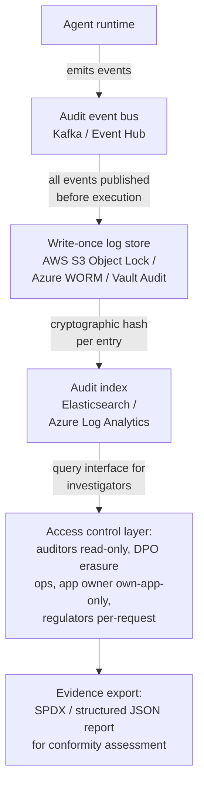

[Back to Part 2 ←](pathname:///archon/agentic-systems/agentic-ui/parts/17-responsible-ai-part2)

## 10. Human Oversight in Practice (UX + Architecture)

### 10.1 Implementing HITL/HOTL/HOOL as Required by EU AI Act Art. 14

| Oversight Model | Description | When Required | Architecture |
| --- | --- | --- | --- |
| **HITL — Human in the Loop** | Human approves each high-stakes action before execution | High-risk AI systems; financial/legal/medical actions; EU AI Act Art. 14 for Annex III | Approval gate in AG-UI event stream; async human review queue |
| **HOTL — Human on the Loop** | Human monitors and can intervene; agent acts but human can override | Medium-risk; operational workflows; business process automation | Monitoring dashboard; kill switch; intervention API |
| **HOOL — Human out of the Loop** | Fully autonomous; human reviews in aggregate | Low-risk; well-understood tasks; where speed is essential | Audit log; anomaly detection; periodic human review |

**Risk threshold matrix for oversight model selection:**

| Action Category | Impact Level | Reversibility | Required Model | Justification Required |
| --- | --- | --- | --- | --- |
| **Financial transaction &gt; threshold** | High | Low | HITL | EU AI Act; financial regulations |
| **Data deletion** | High | None | HITL | Irreversibility |
| **External communication** | Medium | Medium | HOTL | Reputation risk |
| **Internal record update** | Medium | High | HOTL or HOOL | Based on record sensitivity |
| **Information retrieval** | Low | N/A | HOOL | No external effect |
| **Document creation (draft)** | Low | High | HOOL | Easily reversible |
| **Code execution** | High | Low | HITL or HOTL | Security and stability risk |

### 10.2 Approval UX Design for Compliance

A compliant HITL approval UI must meet:

| Requirement | Implementation | Notes |
| --- | --- | --- |
| **Clear action description** | Plain language; what will happen | No technical jargon |
| **Impact preview** | Show what will change before approval | Diff view for data changes; preview for communications |
| **Reversibility indicator** | Clearly mark if action is irreversible | Warning icon + text for irreversible actions |
| **Approval is explicit** | No passive timeout approval; user must actively approve | Active approve button; no "do nothing = approve" |
| **Decline option** | Easy to decline | Decline as prominent as approve; not buried |
| **Edit capability** | User can modify before approving | Edit before approve for appropriate action types |
| **Audit trail** | Approval logged with user identity and timestamp | Immutable audit log |
| **Timeout behavior** | What happens if user doesn't respond | Define per action class: defer / cancel / escalate |

### 10.3 Human Oversight Logging for Audit

For EU AI Act conformity assessment, human oversight must be demonstrable through logs:

| Log Event | Required Fields | Retention |
| --- | --- | --- |
| **Approval gate triggered** | agent_id, action_type, action_details, timestamp, user_notified | 7 years (high-risk) |
| **User approved** | gate_id, approver_identity, approval_timestamp, modified_by_user | 7 years |
| **User declined** | gate_id, decliner_identity, decline_timestamp, reason_if_provided | 7 years |
| **Approval timeout** | gate_id, timeout_action, timestamp | 7 years |
| **Emergency override** | gate_id, overrider_identity, authorization_reference, timestamp | 7 years |
| **Human intervention (HOTL)** | agent_id, intervention_type, intervenor_identity, timestamp, context | 7 years |

---

## 11. Auditability Architecture

### 11.1 What Must Be Logged for EU AI Act Compliance

For high-risk AI systems under EU AI Act, the following events must be logged:

| Event Category | Required Events | Retention | Notes |
| --- | --- | --- | --- |
| **User interactions** | Each interaction start/end; user inputs (metadata); agent outputs (metadata) | 6 months minimum | Content may be anonymized; event types must be preserved |
| **Automated decisions** | Each decision with input factors, model version, output, timestamp | 7 years (financial/high-risk) | Enables post-hoc explanation |
| **Human oversight events** | All HITL/HOTL events; override events | 7 years | See §10.3 |
| **Model version** | Model ID and version used for each interaction | Lifetime of application | Enables reproducibility |
| **Serious incidents** | All incidents causing harm or near-misses | Indefinite | Regulatory reporting obligation |
| **Training data provenance** | Records of training/fine-tuning data sources | Lifetime of model deployment | Data governance audit |
| **Bias test results** | Periodic bias evaluation results | Lifetime of deployment | Evidence of ongoing monitoring |

### 11.2 Immutable Audit Log Architecture

**Immutability requirements:**

- Log entries cannot be deleted (except GDPR erasure: anonymize, not delete)
- Log entries cannot be modified
- Cryptographic hash of each entry
- Hash chain (each entry contains hash of previous entry)
- Off-site backup with integrity verification
- Tamper detection alerting

### 11.3 Evidence Packaging for Conformity Assessment

For EU AI Act conformity assessment, evidence packages must be assembled:

| Evidence Category | Contents | Automated | Source |
| --- | --- | --- | --- |
| **Architecture documentation** | System description, component diagram, data flow | Manual | Architecture team |
| **Risk assessment** | Risk register, threat model, residual risk | Semi-automated | Security team |
| **Bias evaluation** | Bias test results, fairness metrics, mitigation evidence | Automated | Evaluation pipeline |
| **Human oversight records** | HITL log sample, oversight rate, intervention records | Automated | Audit log |
| **Incident log** | All incidents in assessment period, severity, resolution | Automated | Incident management |
| **Training data records** | Data sources, data quality assessment | Semi-automated | Data governance |
| **Monitoring records** | Performance metrics, drift detection, anomaly events | Automated | Observability platform |
| **Change records** | All model, prompt, tool, configuration changes | Automated | CMDB + change management |
| **Access control records** | IAM review results, access requests, privilege audits | Semi-automated | IAM platform |

---

## 12. RAI Assessment Framework

### 12.1 Pre-Deployment RAI Checklist

**Transparency:**

- [ ] AI disclosure shown to all users before or at first interaction
- [ ] Agent name includes clear indication of AI nature
- [ ] Agent capabilities documented and accessible to users
- [ ] Memory usage disclosed; opt-in mechanism in place
- [ ] Tool usage notified to user at runtime

**Human Oversight:**

- [ ] HITL/HOTL/HOOL model documented and justified for each application
- [ ] Approval UI designed per §10.2 compliance requirements
- [ ] Override and intervention mechanisms functional and tested
- [ ] Human oversight logged for audit purposes
- [ ] Timeout behavior defined and tested for all approval gates

**Fairness and Bias:**

- [ ] Bias evaluation completed before deployment
- [ ] Fairness metrics baseline established
- [ ] Disparate impact assessment completed for primary demographic groups
- [ ] Retrieval bias assessment completed (if RAG is used)
- [ ] Tool selection audit completed
- [ ] Bias monitoring plan in place for post-deployment

**Privacy:**

- [ ] Data minimization applied at context assembly
- [ ] PII handling policy implemented and tested
- [ ] Memory consent mechanism implemented
- [ ] GDPR erasure cascade tested end-to-end
- [ ] DPA signed with all LLM providers and data processors
- [ ] Data residency requirements documented and implemented

**Safety:**

- [ ] Constitutional constraint hierarchy defined
- [ ] Safety refusal tests passed (100% for prohibited categories)
- [ ] Prompt injection resistance tested
- [ ] Sensitive topic handling tested
- [ ] Irreversible action warnings implemented
- [ ] Emergency stop / agent suspension mechanism tested

**Accountability:**

- [ ] Agent Registry entry complete with owner, capability scope, oversight model
- [ ] Audit logging implemented for all required event types
- [ ] Audit log immutability verified
- [ ] Incident response plan documented and rehearsed
- [ ] Accountability chain documented for multi-agent pipelines

**EU AI Act Compliance (if applicable):**

- [ ] Risk tier classification completed with justification
- [ ] Technical documentation prepared
- [ ] Conformity assessment initiated (if high-risk)
- [ ] GPAI usage documented per Art. 53 requirements
- [ ] Article 50 transparency obligations implemented (if applicable)

**Robustness:**

- [ ] Failure mode analysis completed
- [ ] Degraded-mode UX designed and tested
- [ ] Behavioral regression tests passing
- [ ] Load testing completed within SLO targets

### 12.2 Ongoing RAI Monitoring

| Monitoring Activity | Frequency | Owner | Output |
| --- | --- | --- | --- |
| **Bias metric review** | Monthly | AI CoE | Bias dashboard; alert if threshold crossed |
| **Safety refusal audit** | Monthly | Security team | Refusal rate report; prompt injection test results |
| **Fairness benchmark** | Quarterly | AI CoE | Fairness evaluation report |
| **Privacy audit** | Quarterly | DPO | Privacy compliance report; PII detection stats |
| **Transparency compliance check** | Quarterly | Compliance team | Disclosure compliance report |
| **Human oversight review** | Monthly | Compliance team | HITL compliance rate; override usage |
| **Incident review** | Monthly | AI Governance Committee | Incident trend report |
| **Full RAI review** | Annual | AI Governance Committee | Annual RAI assessment report |

### 12.3 RAI Incident Classification

| Severity | Criteria | Response Time | Notification |
| --- | --- | --- | --- |
| **Critical (P1)** | Harm to user; privacy breach; discriminatory action; unauthorized agent action with real-world impact | &lt; 1 hour | CISO, CCO, CTO; regulators if required |
| **High (P2)** | Near-miss for harm; bias detected at scale; unauthorized data access without confirmed breach | &lt; 4 hours | CISO, CCO; App Owner |
| **Medium (P3)** | Quality degradation; fairness metric breach; transparency failure at scale | &lt; 24 hours | App Owner; AI CoE |
| **Low (P4)** | Isolated quality issue; minor bias finding; improvement opportunity | &lt; 5 business days | App Owner |

---

## 13. RAI Anti-Patterns

| # | Anti-Pattern | Description | Consequence | Fix |
| --- | --- | --- | --- | --- |
| 1 | **AI disclosure buried in T&Cs** | AI nature disclosed only in terms of service; no runtime disclosure | EU AI Act Art. 50 violation from August 2026 | Persistent AI indicator; first-use modal |
| 2 | **Bias testing at deployment only** | Bias evaluated once before launch; never repeated | Drift undetected; potential discrimination at scale | Continuous fairness monitoring |
| 3 | **HITL as rubber stamp** | Human approval gate exists but reviewers never decline | False compliance; no real oversight; risk unmitigated | HITL reviewer training; review quality metrics |
| 4 | **Memory without consent** | Agent stores long-term memory without user awareness | GDPR violation; trust damage | Explicit memory opt-in with clear disclosure |
| 5 | **Explainability theater** | Agent provides explanation that sounds plausible but is not accurate | User trusts wrong information; over-reliance | Caveat that explanations are approximate; use attribution |
| 6 | **Constitutional principles as marketing** | RAI principles stated publicly but not technically enforced | No real protection; potential regulatory liability | Encode principles in policy-as-code; test enforcement |
| 7 | **Tool execution without audit** | Agent calls tools without logging; no audit trail | Cannot reconstruct decisions; compliance failure | Audit logging for all tool executions |
| 8 | **Sovereignty as afterthought** | Data residency considered after deployment | Regulatory violation; costly re-architecture | Data residency requirements in architecture stage |
| 9 | **Overreliance enabled by UX** | UX design reinforces over-trust in agent outputs | Users make high-stakes decisions based on unreliable AI | Uncertainty indicators; professional referral for high-stakes |
| 10 | **Personalization without fairness** | Memory-based personalization optimizes for engagement; ignores fairness | Differential treatment; potential discrimination | Fairness-constrained personalization |
| 11 | **Multi-agent accountability gap** | No clear accountability chain in orchestrated systems | Cannot attribute harm; regulatory violation | Accountability chain documentation; per-agent constitutional review |
| 12 | **RAI as compliance checkbox** | RAI work done to satisfy auditor; not integrated into development | Cosmetic compliance; real risks unmitigated | RAI embedded in SDLC; developer RAI training |
| 13 | **Reasoning exposure without caveats** | Chain-of-thought shown to users without caveat that it may be inaccurate | Confidence inflation; over-trust | Caveat all reasoning exposure |
| 14 | **No erasure cascade for AI data** | GDPR erasure processed in main database but not in vector stores, memory, embeddings | GDPR violation | Erasure cascade covering all AI data stores |
| 15 | **Minority language quality gap** | Agent quality significantly worse for minority languages | Unfair treatment; discriminatory outcomes | Multilingual quality benchmarking; targeted improvement |
| 16 | **Dark patterns in AI consent** | Consent UI designed to maximize opt-ins; not truly informed | GDPR violation; regulatory risk | Fair, clear consent UI; opt-out as easy as opt-in |
| 17 | **No professional referral for advice** | Agent provides medical/legal/financial advice without referral | Liability; potential harm | Safe messaging guidelines; professional referral triggers |
| 18 | **Autonomous action without recovery** | Agent takes irreversible action; no recovery mechanism | Irreversible harm | Require HITL for irreversible actions; implement undo where possible |
| 19 | **Model change without RAI re-evaluation** | Model upgraded; no bias or safety re-evaluation | RAI regression undetected | RAI evaluation required for any model change |
| 20 | **No incident learning loop** | RAI incidents responded to; no systemic learning | Same failures repeat | Incident → lessons learned → system improvement |
| 21 | **Sensitive topic detection only** | Detect when user mentions sensitive topic; no handling policy | Agent responds inconsistently; potential harm | Sensitive topic handling policy with escalation paths |
| 22 | **Fairness metrics without demographic data** | Wants to measure fairness but doesn't collect demographic data | Cannot detect disparate impact | Privacy-preserving demographic inference for fairness measurement |

---

:::note Related Guides
    - [Governance for Agentic Applications](../11-governance.md) — Governance structures, decision rights, 16 domains
    - [Security Architecture for Agentic Applications](../19-agentic-ui-security-architecture.md) — Security controls, threat models
    - [Identity &amp; Auth Architecture](../12-identity-auth-architecture.md) — Identity types, OAuth flows, authorization
    - [Enterprise AI Governance &amp; Compliance](../../../architecture/51-enterprise-ai-governance-compliance.md) — Full EU AI Act / NIST AI RMF / ISO 42001 details
    - [Agentic AI Security &amp; Identity](../../../trust/05-agentic-ai-security-identity.md) — OWASP ASI01–ASI10
    - [Sovereign AI Foundations](../../../trust/sovereign-constitutional-ai/11-sovereign-ai-foundations.md) — Sovereign AI deployment strategies
    - [Constitutional AI Engineering](../../../trust/sovereign-constitutional-ai/07-constitutional-ai-engineering.md) — Constitutional AI technical implementation
