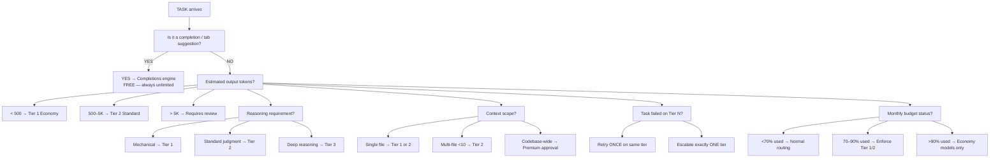

## Why This Matters

Enterprise-scale AI-assisted development requires rigorous governance of AI Credit spend, sophisticated model routing, and architectural patterns that prevent runaway token consumption. This guide provides principal architects, engineering leaders, and platform engineers with proven frameworks for maximizing engineering productivity while controlling costs in organizations deploying GitHub Copilot at scale.

## GitHub Copilot AI Credits Enterprise Mastery Guide

A principal architect's complete reference for maximizing engineering productivity, controlling AI Credit spend, and governing AI-assisted development at enterprise scale — post June 1, 2026 billing transition.

Assembled by: Distinguished Engineer · Principal AI Architect · Enterprise Architect · Staff Developer Productivity Engineer · AI FinOps Architect · Agentic Systems Architect · Platform Engineering Architect · DX Lead

Pricing as of June 4, 2026 · 1 AI Credit = $0.01 USD

**Contents:** 10 Sections · 100 Anti-Patterns · 9 Checklists · 3 Org Scales · 2026–2030 Roadmap

### Table of Contents

- **§ 01 GitHub Copilot Economics** — AI Credits model, token billing, model pricing, cost forecasting, ROI framework
- **§ 02 Coding Workflow Optimization** — Green Zone vs Red Zone activities, best practices, anti-patterns, role guidance
- **§ 03 Agent Mode Optimization** — Budget-aware agent architecture, stopping criteria, retry policies, token amplification
- **§ 04 Enterprise Governance** — Policy catalog, approved use cases, chargeback model, FinOps dashboard design
- **§ 05 Context Engineering** — RAG vs GraphRAG vs memory, context compression, hybrid architecture, AST indexing
- **§ 06 Model Routing Strategy** — 3-tier routing model, decision tree, cost ratios, enterprise routing configuration
- **§ 07 Developer Productivity Architecture** — Tool comparison matrix, enterprise platform design, consolidation strategy
- **§ 08 100 Anti-Patterns** — Root cause, impact, and mitigation for 100 patterns across 10 categories
- **§ 09 Principal Architect Playbook** — 7 checklists, scale recommendations for 500 / 5K / 50K developer organizations
- **§ 10 Future Outlook 2026–2030** — Token deflation, outcome billing, autonomous engineering, adoption roadmap

---

## SECTION 01 – GITHUB COPILOT ECONOMICS

### The AI Credits Cost Model

GitHub retired Premium Request Units (PRUs) and replaced them with GitHub AI Credits — a direct token-consumption billing model. One AI Credit = $0.01 USD. Code completions and Next Edit Suggestions remain unlimited on all paid plans. Everything else is metered.

#### Plan Inclusions (Post June 1, 2026)

| Plan | Seat Price | Base Credits | Total $Value | Promo Jun–Aug | Notes |
|---|---|---|---|---|---|
| Copilot Free | $0 | Limited | ~$0 | — | Limited features |
| Copilot Pro | $10/mo | 1,000 + 500 flex | $15 | — | Monthly subscribers |
| Copilot Pro+ | $39/mo | ~6,500 + 500 flex | $70 | — | Premium models included |
| Copilot Max | $100/mo | ~20,000 | $200 | — | High-volume agentic use |
| Copilot Business | $19/user/mo | 1,900/user pooled | $19/seat | +$30/seat | Org-pooled credits |
| Copilot Enterprise | $39/user/mo | ~3,900/user pooled | $39/seat | +$70/seat | Full enterprise controls |

**PROMOTIONAL PERIOD EXPIRES SEPTEMBER 1, 2026**

Business customers lose +$30/seat and Enterprise loses +$70/seat. Governance and budget planning must be based on postpromo rates — not the inflated promotional allocation.

#### Model Pricing Reference (per 1M tokens)

| Model | Input $/M | Output $/M | Tier | Notes |
|---|---|---|---|---|
| GPT-5.4 nano / GPT-5 mini | $0.25 | $1.67–$2.00 | Economy | Included on some plans. Use as org default. |
| Gemini 3 Flash | ~$0.10 | ~$0.40 | Economy | No long-context surcharge. Excellent economy tier. |
| MAI-Code-1-Flash | ~$0.20 | ~$0.82 | Economy | Code-specialized. Strong for mechanical tasks. |
| Gemini 3.5 Flash | $0.30 | $2.50 | Standard | Strong code tasks. Good price/performance. |
| GPT-5.5 / Codex variants | $1.75 | $14.00 | Premium | Long-context surcharge above 272K tokens. |
| Claude Sonnet 4.6 | $3.00 | $15.00 | Premium | Strong reasoning + code. Architecture tasks. |
| GPT-5 | $3.75 | $15.00 | Premium | Frontier. Use for complex multi-system work. |
| Claude Opus 4.7 | ~$15.00 | ~$75.00 | Ultra | Reserve for highest complexity only. Gate access. |
| Gemini 2.5 / 3.1 Pro | varies | varies | Premium | Long-context surcharge above 200K tokens. |

#### Token Billing Mechanics

**COST FORMULA**

AI Credits = (input_tokens × input_rate + output_tokens × output_rate + cached_tokens × cache_rate) ÷ 1,000,000 ÷ 0.01

**WHAT COUNTS AS TOKENS**

- **Input:** System prompt + conversation history + attached files + repository context
- **Output:** All generated text, code, explanations
- **Cached:** Reused context — discounted rate
- **FREE (unlimited):** Code completions, Next Edit Suggestions

Output tokens cost 4–6× more than input tokens. Cached tokens are discounted — structure prompts to maximize cache hits.

#### Real-World Cost Scenarios

| Scenario | Model | Est. Tokens | Credits | Monthly Impact |
|---|---|---|---|---|
| Simple chat Q&A | GPT-5 mini | 2K in / 500 out | ~0.1 | Negligible |
| Unit test generation (1 file) | Gemini Flash | 5K in / 2K out | ~0.1 | Negligible |
| Code review (medium PR) | Claude Sonnet | 15K in / 3K out | ~5 | Watch at scale |
| Bug investigation (full context) | GPT-5.5 | 40K in / 5K out | ~77 | 5% of Pro+ monthly budget |
| Agent: multi-step refactor | Claude Sonnet | 120K in / 15K out | ~59 | 4% of Pro+ monthly budget |
| Cloud agent: repo analysis | GPT-5 | 500K in / 20K out | ~488 | 32% of Pro+ monthly budget |
| Runaway agent (bad pattern) | Claude Opus | 2M+ in / 200K out | 3,000+ | 2× entire Pro+ plan |

#### Credit Forecasting Framework

```
Monthly_Credits = N_devs × (
    completions_credit            // $0 — always unlimited
    + chat_interactions × avg_chat_cost
    + agent_sessions × avg_agent_cost
    + code_reviews × avg_review_cost
    + premium_model_pct × premium_multiplier
)
Risk_Buffer = 1.3 × baseline   // 30% overage buffer
Hard_Cap = 1.5 × baseline     // Block at 50% over
```

#### ROI Measurement Framework

**PRODUCTIVITY ROI**

Hours saved per dev × fully-loaded hourly rate ÷ AI credit spend. Target: &gt;10:1 ratio.

**QUALITY ROI**

Defect reduction rate × avg cost-to-fix × defects avoided. Measure via DORA metrics before/after deployment.

**VELOCITY ROI**

Sprint velocity increase % × sprint cost. Track cycle time, PR throughput, deployment frequency monthly.

---

## SECTION 02 – CODING WORKFLOW OPTIMIZATION

### Green Zone vs. Red Zone Activities

| Activity | Maximum Tier | Credits/task | Red Zone Activity | Risk Level | Burn Rate |
|---|---|---|---|---|---|
| Bug fix (scoped file) | Standard | 0.5–3 | Full repo stuffing | Critical | 500–5,000+ |
| Code explanation | Economy | 0.1–1 | Large architecture reviews | High | 100–800 |
| Unit test generation | Standard | 1–5 | Recursive retries | Critical | Unbounded |
| Targeted refactoring | Standard | 2–8 | Agent loops (no budget) | Critical | Unbounded |
| Docstring / API docs | Economy | 0.2–2 | Repeated large re-reads | High | 50–500/call |
| Code review comment | Standard | 1–4 | Multi-file open context bleed | Medium | 10–100 |
| Type annotation | Economy | 0.1–0.5 | Unscoped codebase Q&A | High | 50–400 |
| Error message triage | Standard | 0.3–2 | Bulk code generation | High | 100–1,000 |

#### Best Practices by Role

**INDIVIDUAL DEVELOPER**

- Set personal budget alert at 70% of monthly credits
- Default to GPT-5 mini for all first-pass attempts
- Escalate to Sonnet only after 2 failed economy attempts
- Use tab completion (free) as primary workflow
- Scope questions to specific file/function
- Reset chat after each task — start fresh

**TEAM LEAD**

- Establish team model policy in org settings
- Review weekly per-user credit consumption
- Create shared prompt library for common tasks
- Gate agent use behind team-level approval
- Publish and train on 3-tier model routing guide

**PLATFORM ENGINEER**

- Implement Content Exclusion for build artifacts, logs, generated code
- Configure user-level budget caps enterprise-wide
- Build usage dashboards from billing API
- Enforce model restrictions via enterprise policy
- Disable Copilot for XML/YAML/properties files

#### Top 5 Workflow Anti-Patterns to Train Away

1. **Conversational drift:** Long chat threads accumulate history as input tokens exponentially. Reset after each task.
2. **Model curiosity:** Selecting Claude Opus or GPT-5 "because it's smarter" for tasks Gemini Flash handles equally well — at 37× lower cost.
3. **Context dumping:** Pasting entire files or stack traces without trimming irrelevant portions.
4. **Retry loops:** Manually re-prompting without diagnosis — each retry re-sends the full context at full cost.
5. **Speculative generation:** Asking for 5 variants speculatively, then discarding 80% of the output.

---

## SECTION 03 – AGENT MODE OPTIMIZATION

### Budget-Aware Agent Architecture

#### AGENT MODE WARNING

One reported incident: 822 credits in a single request — 54% of a Pro+ monthly budget. A single poorly designed agent session can consume an entire team's monthly allocation. Mandatory budget guardrails, stopping criteria, and retry policies are required before production deployment.

#### Token Amplification Risks

**CONTEXT EXPLOSION**

Each agent step re-sends the full conversation history + system prompt + tool definitions + all prior tool results. A 10-step agent with 50K initial context can accumulate 500K+ tokens by step 10 — a 10× amplification even without adding new information.

**RECURSION RISK**

Agent delegates to sub-agent → sub-agent encounters error → retries → spawns another sub-agent. Without hard recursion depth limits, token consumption grows exponentially. A 3-level recursion with 2 retries at each level = 27 minimum agent calls.

#### Budget-Aware Agent Configuration

```
interface AgentBudget {
  maxCredits:       100,    // Hard stop at N credits consumed
  maxSteps:         20,     // Max tool-use iterations
  maxContextTokens: 100000, // Evict/compress oldest when exceeded
  maxRecursionDepth: 2,     // Sub-agent nesting limit
  retryPolicy: {
    maxRetries:  2,
    backoffMs:   2000,
    retryOn: ["rate_limit", "timeout"]  // NOT logic errors
  },
  checkpointEvery: 10,      // Persist state every N steps
  alertAt:        0.70      // Warn at 70% budget consumed
}
```

#### Stopping Criteria

| Condition | Action | Recovery |
|---|---|---|
| 70% credit threshold reached | Warn user; request confirmation to continue | User approves or agent summarizes and halts |
| 100% credit threshold reached | Hard stop; serialize state to checkpoint | Resume from checkpoint in next session |
| Max steps exceeded | Summarize progress; request human review | Human provides direction to continue task |
| Context window &gt; 80% full | Compress/evict oldest context via summarization | Automatic — use economy model to summarize |
| Same tool called 3× without progress | Escalate to human with diagnostic log | Detect via output similarity hash |
| Recursion depth &gt; limit | Refuse delegation; complete current scope only | Return partial result with clear explanation |
| Error rate &gt;50% in last 5 steps | Hard stop; alert engineer on-call | Log full state; human investigation required |

#### Cloud Agent vs. CLI Agent Economics

| Dimension | Cloud Agent (Copilot.com) | CLI Agent (Copilot CLI) |
|---|---|---|
| Additional cost | AI Credits + Actions minutes (double billing) | AI Credits only |
| Context scope | Full repo + GitHub data | Local workspace only |
| Token risk | Higher (repo-wide context) | Lower (local scope) |
| Governance | Enterprise admin controls available | User-level controls only |
| Best for | Async tasks, PR automation, CI failure diagnosis | Interactive development, rapid iteration |

#### Token-Aware Orchestration

**CONTEXT COMPRESSION STRATEGY**

1. After every 5 steps, summarize completed work with an economy model
2. Replace verbose tool outputs with 2–3 sentence summaries in history
3. Use structured JSON (not prose) for tool responses — 30–50% token reduction
4. Strip boilerplate from tool responses before inserting into context

**MULTI-MODEL AGENT DESIGN**

1. **Planning step:** Economy model (GPT-5 mini) — generate task decomposition
2. **Execution steps:** Standard model (Gemini Flash) — perform the work
3. **Validation step:** Standard model — verify correctness of output
4. **Complex reasoning:** Escalate to Premium only when standard fails 2×

---

## SECTION 04 – ENTERPRISE GOVERNANCE

### GitHub Copilot Enterprise Governance Framework

#### Governance Hierarchy

**ENTERPRISE LEVEL (CISO / VP ENG)**

- Approved model whitelist
- Hard monthly credit caps per org
- Audit log retention policy
- Agent use policy (enable/disable per org)
- Data residency controls

**ORGANIZATION LEVEL (ENG DIRECTOR)**

- Team credit allocations (pooled)
- Repository exclusion lists
- Model tier restrictions per team
- Agent approval workflows
- Weekly usage reports
- Shared copilot-instructions.md

**USER LEVEL (DEVELOPER + MANAGER)**

- Personal monthly budget cap (mandatory)
- Alert thresholds at 70% and 90%
- Model selection within tier policy
- Monthly usage self-report
- No content exclusion overrides
- IP indemnification configuration

#### Policy Catalog

| Policy | Default | Recommended Enterprise Setting | Control Level |
|---|---|---|---|
| AI Credits paid usage | Disabled | Enabled with hard cap | Enterprise Admin |
| Agent mode | Enabled | Enabled — budget-gated per team | Org Admin |
| Cloud agent | Off | Opt-in by team with business case | Org Admin |
| Model selection | User choice | Restricted to approved model list | Org Admin |
| Premium / Ultra models | Available | Require justification workflow | Org Admin |
| Non-licensed user code review | Off | Keep Off (unbounded billing risk) | Enterprise Admin |
| MCP server connections | Available | Approved list only | Org Admin |
| Content exclusion | None | Required for PII, secrets, regulated paths | Org Admin |
| Audit logging | Basic | Full audit log streaming to SIEM | Enterprise Admin |
| User-level budgets | No cap | Mandatory — GA June 2026 | Org Admin |

#### Approved Use Cases by Risk Tier

**TIER 1 — PRE-APPROVED (NO REVIEW REQUIRED)**

- Code completions and tab suggestions (unlimited, free)
- Unit test generation for owned code
- Docstring and comment generation
- Formatting, linting, type annotations

**TIER 2 — REQUIRE TEAM LEAD APPROVAL**

- Multi-file refactoring sessions
- Architecture design with premium models
- Cloud agent for PR automation
- Agent sessions &gt;50 credits budget
- Integration with external MCP servers
- Isolated bug fixes (scoped to 1–3 files)
- Code explanation and Q&A

**TIER 3 — REQUIRE SECURITY REVIEW**

- Analysis of regulated / PII-containing codebases
- Security-focused code review (auth, cryptography)
- Third-party MCP server connections
- Agent sessions with external API access

**PROHIBITED ACTIVITIES**

- Sending customer data or secrets in prompts
- Bypassing content exclusion policies
- Agent with write access to production systems
- Using Copilot on unlicensed accounts at scale

#### Chargeback Model

| Method | Formula | Recommended For |
|---|---|---|
| Per-seat allocation | Base seat cost per user in cost center | Simple orgs, low agentic use |
| Actual consumption | Pull from billing API, aggregate by team tag | High-usage orgs, agentic workflows |
| Hybrid | Base allocation + overage charged at consumption | Enterprise with mixed workloads |
| Value-based | Allocation proportional to PR throughput metric | Engineering efficiency programs |

#### FinOps Dashboard — Key Metrics

**SPEND METRICS**

- Monthly credits consumed vs. included
- Credits by model tier (economy / standard / premium)
- Credits by feature (chat / agent / review)
- Overage credits (paid vs. included)

**EFFICIENCY METRICS**

- Credits per PR merged
- Completion acceptance rate
- Agent task success rate
- Premium model usage % (target &lt;15%)
- Token efficiency ratio (output ÷ input)

**RISK METRICS**

- Users at 80%+ of monthly budget
- Teams at 90%+ of pooled budget
- Runaway agent detections per week
- Policy violations per week
- Unbudgeted overage incidents
- Cost per developer per day

---

## SECTION 05 – CONTEXT ENGINEERING

### Reducing Token Usage Through Intelligent Context

#### Context Strategy Comparison

| Strategy | Accuracy | Latency | Tokens/Query | Cost | Best For |
|---|---|---|---|---|---|
| Full Repository Context | Very High | High | 500K–1M+ | Very High | Never in production |
| Naive RAG (vector search) | Moderate | Low | 5K–20K | Low | General codebase Q&A |
| GraphRAG (AST + code graph) | High | Medium | 10K–50K | Medium | Cross-file dependency tasks |
| Memory Systems (episodic) | High over time | Low | 2K–8K | Low | Long-running projects |
| Hybrid (RAG + Memory) | Very High | Low–Med | 8K–30K | Medium | Enterprise production |

#### Hybrid Context Architecture (Recommended)

```
Query → [Intent Classifier] → Route:

  "Explain function X"     → AST lookup → function + signature     (~2K tokens)
  "Fix bug in module Y"    → RAG: module + tests + related files   (~15K tokens)
  "How does auth work?"    → GraphRAG: auth call graph + memory    (~20K tokens)
  "New feature like Z"     → Memory: past similar + RAG            (~25K tokens)

Context Budget Targets by Query Type:
  Simple lookup      → max  5,000 tokens
  Targeted fix       → max 20,000 tokens
  Architecture Q     → max 50,000 tokens
  Agent session      → max 100,000 tokens (with step compression)
```

#### Multi-Level Repository Summary Hierarchy

**L1 — REPOSITORY**

500-token overview: purpose, tech stack, main modules, entry points, responsibility, public API surface, key dependencies. Injected into every session automatically.

**L2 — MODULE**

200-token summary per module: main modules, entry points, responsibility, public API surface, key dependencies. Retrieved on demand by query.

**L3 — FUNCTION**

50-token signature + docstring per function. Fetched by AST lookup — not vector search. Fast and precise.

#### Context Compression Techniques

| Technique | Token Reduction | Quality Impact |
|---|---|---|
| Strip comments from retrieved code | 15–30% | Minimal — LLM infers from structure |
| Replace imports with type signatures | 20–40% | Minimal for most tasks |
| Summarize completed agent steps | 60–80% | Low if summarization is accurate |
| Use diff format instead of full file | 70–90% | None for targeted edits |
| Structured JSON vs. prose tool results | 30–50% | None — often improves accuracy |
| Hierarchical chunking (fn → file → module) | 80–95% | Low with good retrieval quality |

---

## SECTION 06 – MODEL ROUTING STRATEGY

### Intelligent Model Routing Decision Framework

**TIER 1 — ECONOMY**

GPT-5 mini · GPT-5.4 nano · Gemini 3 Flash · MAI-Code-1

**Tasks:**
- Feature implementation
- Code formatting & linting
- Docstring generation
- Type annotation
- Simple summarization
- Classification & labeling
- Variable / function naming
- Import organization
- Config file generation

**Cost:** $0.40–$2.00 / M output. **Org default.**

**TIER 2 — STANDARD**

Gemini 3.5 Flash · GPT-5.5 · Codex variants

**Tasks:**
- Code review comments
- Bug investigation (scoped)
- Unit test generation (complex)
- API integration
- Multi-file refactoring
- Documentation writing
- Error diagnosis

**Cost:** $2.50–$14.00 / M output. **Default for most workflows.**

**TIER 3 — PREMIUM**

Claude Sonnet 4.6 · GPT-5 · Gemini 2.5/3.1 Pro

**Tasks:**
- Architecture design
- Complex multi-system debugging
- Platform migration planning
- Security vulnerability analysis
- Performance optimization
- Long-horizon agent tasks

**Cost:** $15.00+ / M output. **Gate behind approval. Target &lt;15% of spend.**

#### Routing Decision Tree



#### Model Cost Ratios

| Comparison | Output Cost Ratio | Implication |
|---|---|---|
| Claude Opus 4.7 vs Claude Sonnet 4.6 | 5× more expensive | Never default to Opus |
| Claude Sonnet vs GPT-5 mini | 7.5× more expensive | Economy handles 80% of tasks |
| GPT-5 vs Gemini 3 Flash | 37× more expensive | Route carefully |
| GPT-5.5 vs GPT-5.4 nano | 24× more expensive | Default to nano for mechanical tasks |

---

## SECTION 07 – DEVELOPER PRODUCTIVITY ARCHITECTURE

### Enterprise AI Developer Platform

#### Tool Comparison Matrix

| Tool | Token Efficiency | Productivity | Governance | Enterprise Ready | Cost Model | Best Use Case |
|---|---|---|---|---|---|---|
| GitHub Copilot | Medium | High | Excellent | Yes | AI Credits (metered) | IDE completions, PR review, GitHub-integrated workflows |
| Claude Code | High | Very High | Moderate | Improving | Flat rate, usage limits | Long sessions, terminal-native, deep codebase work |
| Cursor | High | Very High | Limited | Partial | Flat $20/mo | Agentic coding, Composer multi-file changes |
| Gemini CLI | Very High | Medium | Limited | Partial | Per-token (Google) | Google Cloud workloads, large-context economy tasks |
| OpenHands | Medium | Medium | Configurable | Self-hosted | Self-hosted + API | Autonomous coding, research environments |
| Aider | High | Medium | None | No | Direct API cost | Individual power users, Git-native workflows |
| Roo Code / Cline | Medium | High | None | No | Direct API cost | VS Code power users, customizable agent workflows |
| Windsurf | High | High | Moderate | Improving | Flat $20–$200/mo | Agentic coding, Cursor alternative |

#### Recommended Enterprise Platform Architecture

**TIER A — ENTERPRISE DEFAULT (ALL DEVELOPERS)**

**GitHub Copilot Business / Enterprise**

- Completions, chat, PR review — fully governed
- Full audit trail, SSO, data retention compliance
- Budget controls, model policy enforcement

**TIER B — POWER DEVELOPER ADD-ON**

**Claude Code (Team / Enterprise Plan)**

- For developers with complex agentic needs
- Predictable flat-cost for long sessions
- Terminal-native, 5-hour session windows
- Governance via team management console
- Repository indexing, Copilot Memory

#### Tool Consolidation Strategy

1. **Audit current tool sprawl** — survey which tools developers actually use day-to-day
2. **Standardize on 1–2 enterprise-grade tools** — Copilot as baseline, one approved supplementary tool
3. **BYOT (bring your own tool) policy** — publish an approved tools list with data handling requirements
4. **Prohibit direct API key usage** on non-approved tools in corporate environments
5. **Quarterly tool review** — assess ROI, usage patterns, and evaluate emerging tools

---

## Related Links

- [Copilot Enterprise Playbook Part 2](parts/07-copilot-enterprise-playbook-part2.md) — 100 Anti-Patterns, Principal Architect Playbook, Future Outlook 2026–2030
