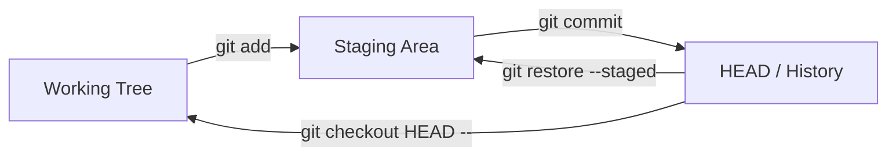
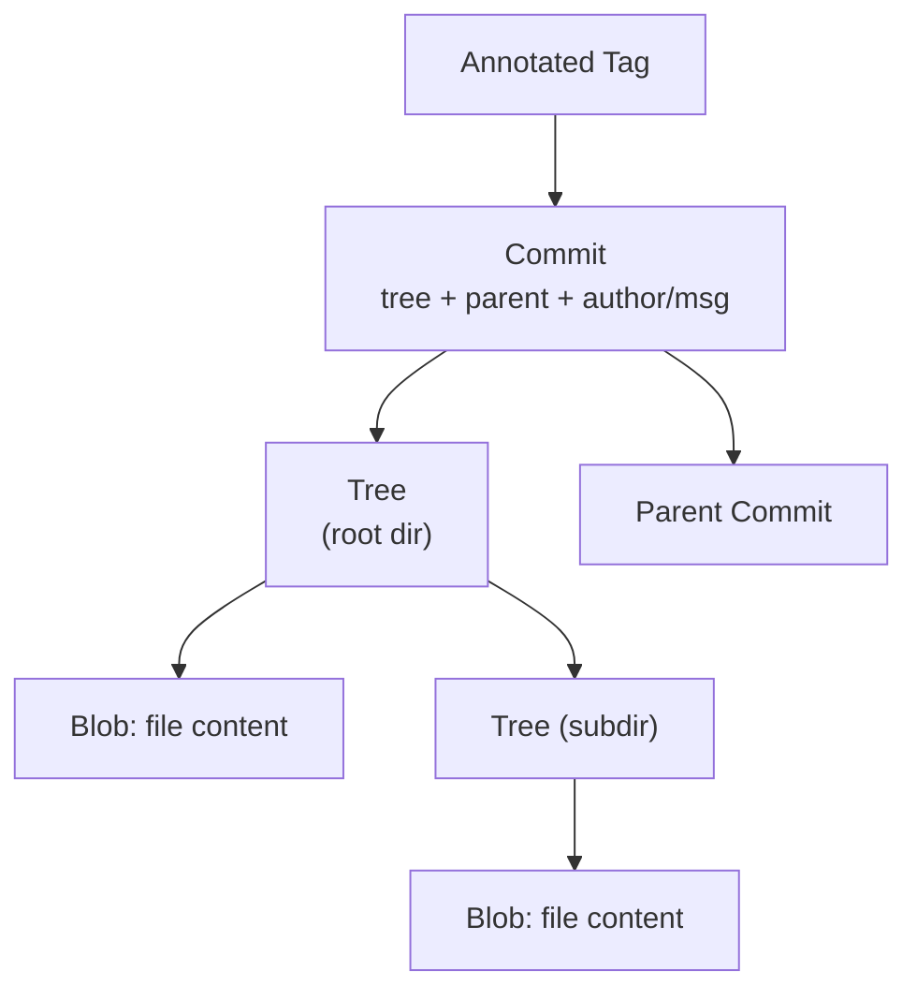
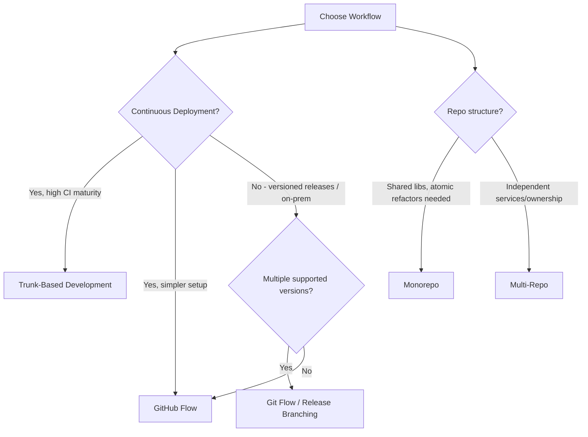

**This is Part 1 of 4. [Continue with Part 2 →](pathname:///archon/agentic-systems/coding-tools/parts/09-git-github-platform-engineering-handbook-part2) for GitHub Platform Depth & CI/CD.**

# Git, GitHub Platform & Platform Engineering Handbook

Quick-reference handbook covering Git foundations, GitHub platform features, CI/CD workflows, security, governance, and enterprise-scale platform engineering patterns. Updated for 2026 with AI-assisted workflows and modern supply chain security.

---

## PART 1 — Git Foundations

### Core Concepts at a Glance

| Term | Definition | Mutates history? |
| --- | --- | --- |
| **Repository** | Object DB + refs + config (`.git/`) | — |
| **Working Tree** | Checked-out files on disk | No |
| **Staging Area (Index)** | Pending snapshot for next commit | No |
| **Commit** | Immutable snapshot + parent link, SHA-addressed | No (immutable) |
| **Branch** | Movable named pointer to a commit | No |
| **Tag** | Fixed label, usually for releases | No |
| **HEAD** | "You are here" pointer (branch or commit) | No |
| **Reflog** | Local log of ref movements (recovery tool, ~90 days) | No |
| **Merge** | Combine histories → new merge commit | Adds, doesn't rewrite |
| **Rebase** | Replay commits onto new base | **Yes** — new hashes |
| **Cherry-pick** | Copy one commit's diff elsewhere | New commit, new hash |

### Git Objects

| Object | Contains |
| --- | --- |
| **Blob** | Raw file content (no name/metadata) |
| **Tree** | Directory listing: mode, type, hash, filename |
| **Commit** | Tree pointer + parent(s) + author/date/message |
| **Annotated Tag** | Pointer + metadata + optional GPG signature |

Key properties:
- SHA = `hash(type + size + content)` → content-addressed, dedup'd, tamper-evident.
- **Pack files** (`.pack` + `.idx`) = compressed, delta-encoded loose objects → smaller repo, faster clone.
- **GC**: unreachable objects (after reset/rebase) survive via reflog (~90d) then get pruned by `git gc --prune`.

### Merge vs Rebase vs Cherry-pick — When to Use

| Action | Use when | Avoid when |
| --- | --- | --- |
| **Merge** | Shared/long-lived branches; want true history of divergence | History clutter isn't a concern |
| **Rebase** | Cleaning up a *local/unshared* feature branch before PR | Branch already pushed & others built on it |
| **Cherry-pick** | Backporting one fix (e.g., hotfix → release branch) | Repeated bulk-syncing between branches |

### Quick Diagram — Working Tree → Staging → Commit

---

## PART 2 — Git CLI Complete Cheat Sheet

### Repository Management

| Command | Purpose | Common Flags | When to Use |
| --- | --- | --- | --- |
| `git init` | Create new repo | `--bare`, `--object-format=sha256` | Starting a new project |
| `git clone <url>` | Copy remote repo + history | `--depth=1` (shallow), `--branch <b>`, `--recurse-submodules` | Getting an existing repo locally / CI checkout |
| `git config` | Set config (user, aliases, behavior) | `--global`, `--local`, `--list` | Identity setup, repo-specific overrides |
| `git remote` | Manage remote connections | `-v`, `add`, `remove`, `rename`, `set-url` | Linking to GitHub/GitLab, multi-remote setups |

### Daily Development

| Command | Purpose | Common Flags | When to Use |
| --- | --- | --- | --- |
| `git status` | Show working tree/staging state | `-s` (short) | Before/after every change |
| `git add` | Stage changes | `-p` (patch/hunks), `-A`, `.` | Preparing a commit |
| `git commit` | Record staged snapshot | `-m`, `-am`, `--amend`, `-S` (sign) | Saving logical units of work |
| `git push` | Upload commits to remote | `-u`, `--force`, `--force-with-lease`, `--tags` | Sharing work |
| `git pull` | Fetch + integrate remote changes | `--rebase`, `--ff-only` | Syncing local branch with remote |

**Recovery note**: `--force-with-lease` > `--force` — fails safely if remote has commits you haven't seen.

### Branching

| Command | Purpose | Common Flags | When to Use |
| --- | --- | --- | --- |
| `git branch` | List/create/delete branches | `-a`, `-d`, `-D`, `-m`, `-vv` | Branch management |
| `git switch` | Switch branches (modern) | `-c` (create+switch), `-d` (detach) | Preferred over checkout for branch switching |
| `git checkout` | Switch branches / restore files (legacy, multi-purpose) | `-b`, `--`, `-- <file>` | Older syntax; still used for detached HEAD, file restore |
| `git merge` | Combine branch histories | `--no-ff`, `--squash`, `--abort` | Integrating completed feature into target branch |
| `git rebase` | Replay commits on new base | `-i`, `--onto`, `--abort`, `--continue` | Clean up local history before PR |
| `git cherry-pick` | Apply one commit elsewhere | `-x` (record origin), `--no-commit` | Backport a single fix |

### History & Inspection

| Command | Purpose | Common Flags | When to Use |
| --- | --- | --- | --- |
| `git log` | View commit history | `--oneline`, `--graph`, `--all`, `-p`, `--stat`, `-- <path>` | Reviewing history, debugging |
| `git show` | Show a specific object/commit | `<commit>:<path>` | Inspect one commit's full diff/content |
| `git blame` | Per-line authorship | `-L <range>`, `-w` (ignore whitespace) | Tracing when/why a line changed |
| `git diff` | Show changes between states | `--staged`, `HEAD~1`, `<branch1>..<branch2>` | Reviewing before commit/PR |

### Recovery

| Command | Purpose | Common Flags | When to Use | Recovery Scope |
| --- | --- | --- | --- | --- |
| `git reset` | Move HEAD/branch pointer | `--soft`, `--mixed` (default), `--hard` | Undo commits (soft=keep staged, hard=discard all) | Reflog recovers commits, **hard discards working tree changes** |
| `git revert` | New commit that undoes a prior commit | `-n` (no auto-commit), `-m` (for merge commits) | Undo on **shared/public** branches safely | Fully recoverable — adds history, doesn't rewrite |
| `git restore` | Restore working tree/staged files | `--staged`, `--source=<commit>` | Discard local edits or unstage files | Working tree changes lost unless committed/stashed |
| `git clean` | Remove untracked files | `-f`, `-d`, `-x` (incl. ignored), `-n` (dry run) | Clear build artifacts, scratch files | **Not recoverable** — always `-n` first |
| `git reflog` | Show local ref history | `show`, `expire` | Recover "lost" commits after reset/rebase | Primary recovery tool, ~90-day window |

### Advanced

| Command | Purpose | Common Flags | When to Use |
| --- | --- | --- | --- |
| `git stash` | Shelve uncommitted changes | `push -m`, `pop`, `apply`, `list`, `-u` (untracked) | Context-switch without committing |
| `git bisect` | Binary-search history for a bad commit | `start`, `good`, `bad`, `run <script>` | Finding which commit introduced a regression |
| `git worktree` | Multiple working trees from one repo | `add`, `list`, `remove` | Work on hotfix + feature simultaneously, no stash needed |
| `git notes` | Attach metadata to commits w/o changing them | `add`, `show`, `list` | CI results, review annotations on immutable commits |
| `git sparse-checkout` | Check out only part of repo tree | `init --cone`, `set <paths>` | Huge monorepos — only pull needed subdirectories |
| `git submodule` | Embed another repo at a path | `add`, `update --init --recursive`, `sync` | Shared library as a pinned external dependency |
| `git filter-repo` | Rewrite history (remove files/paths) | `--path`, `--invert-paths` | Purge secrets/large files from entire history |

---

## PART 3 — Git Internals

### How Git Stores Data

### Internals Commands

| Command | Purpose | When to Use |
| --- | --- | --- |
| `git cat-file -p <hash>` | Pretty-print any object's content | Inspect raw blob/tree/commit objects |
| `git cat-file -t <hash>` | Show object type | Debugging object references |
| `git rev-parse` | Resolve refs/shorthand to full SHA | Scripting, resolving `HEAD`, `HEAD~2`, etc. |
| `git hash-object <file>` | Compute the blob hash of a file (without storing) | Verify content matches a known object |
| `git fsck` | Check repo integrity, find dangling objects | Corruption checks, recovery before `gc` |

### Refs, Tags, Packfiles, GC

| Concept | Location | Notes |
| --- | --- | --- |
| **Refs** | `.git/refs/heads/`, `.git/refs/tags/`, `.git/refs/remotes/` | Plain files (or packed-refs) pointing to SHAs |
| **HEAD** | `.git/HEAD` | Symbolic ref → `refs/heads/<branch>` |
| **Packfiles** | `.git/objects/pack/*.pack` + `.idx` | Compressed, delta-encoded object storage |
| **Loose objects** | `.git/objects/xx/yyyy...` | Pre-pack storage; compacted by `git gc` |
| **Garbage Collection** | `git gc`, `git gc --prune=now` | Repacks loose objects, prunes unreachable objects past reflog expiry |

**Lifecycle**: commit becomes unreachable (reset/rebase/amend) → stays recoverable via reflog (~90d default) → `git gc --prune` removes it once expired.

---

## PART 4 — Git Workflow Strategies

### Comparison Matrix

| Strategy | Pros | Cons | Scaling Limit | Best Team Size |
| --- | --- | --- | --- | --- |
| **GitHub Flow** | Simple: `main` + short-lived feature branches + PR + deploy | No formal release branches; needs strong CI/CD & feature flags | Scales well with good CI | Small–large, continuous deployment shops |
| **Git Flow** | Structured (develop/release/hotfix/feature branches), good for versioned releases | Heavyweight, slow, merge-conflict prone, poor fit for CD | Struggles with high commit velocity | Teams shipping versioned/on-prem software |
| **Trunk-Based Development** | Single shared trunk, tiny short-lived branches (≤1 day), feature flags for incomplete work | Requires excellent test automation & flags discipline | Scales very well (Google-style) | Medium–large, high CI maturity |
| **Release Branching** | Stabilize a branch for release while `main` moves on; cherry-pick fixes | Cherry-pick overhead, divergence risk | Moderate — many concurrent releases get painful | Teams w/ multiple supported versions |
| **Monorepo Workflow** | Atomic cross-project commits, unified tooling/CI, easy refactors | Tooling complexity, CI scaling, access-control challenges | Needs sparse-checkout/VFS at scale | Platform teams, shared-library-heavy orgs |
| **Multi-Repo Workflow** | Clear ownership boundaries, independent versioning/CI | Cross-repo changes are hard, dependency drift | Coordination overhead grows with repo count | Org with clear service boundaries (microservices) |

### Decision Tree

### Enterprise Adoption Notes

- **GitHub Flow + Trunk-Based** is the dominant pattern for SaaS/cloud-native orgs (2024–2026 norm), paired with feature flags (LaunchDarkly, etc.) and merge queues.
- **Git Flow** persists in regulated/on-prem/embedded software where releases are infrequent and versioned support windows are long.
- **Monorepos** require investment in sparse-checkout, CODEOWNERS-based path ownership, and CI path-filtering (only build affected projects) to remain viable past a few hundred engineers.

---

## PART 5 — GitHub Platform Deep Dive

### Core Collaboration Features

| Feature | Purpose | Workflow Use | Governance / Enterprise Notes |
| --- | --- | --- | --- |
| **Repositories** | Code + history container | Base unit of access control & CI | Visibility (public/private/internal), org-owned vs personal |
| **Organizations** | Container for repos, teams, billing | Central admin for company/product | SSO, SCIM, audit log scope (Part 21) |
| **Teams** | Group users for permissions | Map to squads/departments | Nested teams, repo-level permission grants |
| **Pull Requests** | Propose & review code changes | Core review/merge unit | Required reviews, status checks, merge queue |
| **Issues** | Track bugs/tasks/requests | Backlog, bug tracking | Templates, labels, linked PRs |
| **Discussions** | Async Q&A / RFC-style conversation | Design discussions, community Q&A | Not tied to code changes; good for ADRs |
| **Projects** | Kanban/table/roadmap views over issues+PRs | Sprint planning, roadmaps | Custom fields, automation (see Part 8) |
| **Labels** | Categorize issues/PRs | Triage, filtering | Org-wide label sets via templates |
| **Milestones** | Group issues/PRs by release/date | Release planning | Progress tracking per milestone |
| **Templates** | Pre-filled issue/PR forms | Standardize bug reports, PR checklists | `.github/ISSUE_TEMPLATE/`, `PULL_REQUEST_TEMPLATE.md` |
| **Draft PRs** | PR not yet ready for review | WIP visibility, early CI feedback | Prevents premature review/merge |
| **Saved Replies** | Reusable comment snippets | Faster triage responses | Personal or org-level canned responses |

### Pull Requests — Review & Merge

| Feature | What It Does | When to Use |
| --- | --- | --- |
| **Reviews** | Approve / request changes / comment | Standard code review gate |
| **Required Reviews** | Branch protection rule requiring N approvals | Enforce review on protected branches (main, release) |
| **Review Assignment** | Auto-assign reviewers (round-robin, CODEOWNERS) | Balance review load across team |
| **Auto-merge** | Merge automatically once checks/reviews pass | Reduce manual babysitting of green PRs |
| **Merge Queue** | Serializes merges, re-tests against latest base before merging | High-traffic `main` branches — prevents "semantic conflict" breakage |

### Merge Strategies

| Strategy | Result | Best For | Avoid When |
| --- | --- | --- | --- |
| **Merge Commit** | Preserves full branch history + adds merge commit | Need full audit trail of feature development | History readability matters more than detail |
| **Squash Merge** | All PR commits → one commit on target branch | Clean linear history, one commit per feature/PR | Need to preserve granular commit-by-commit history |
| **Rebase Merge** | PR commits replayed individually onto target, no merge commit | Linear history while preserving individual commits | PR has messy/WIP commits not worth preserving |

**Recommendation**: Squash merge for most product repos (clean `main`, easy revert of whole features); merge commits for release-branch integrations where you need full traceability.

### CODEOWNERS

| Aspect | Detail |
| --- | --- |
| **File location** | `.github/CODEOWNERS`, `CODEOWNERS`, or `docs/CODEOWNERS` |
| **Purpose** | Auto-request review from path-specific owners |
| **Governance use** | Enforce that infra/security-sensitive paths require specific team approval |
| **Security implication** | Combine with required reviews + branch protection to prevent unreviewed changes to CI configs, secrets handling, IaC |
| **Anti-pattern** | One catch-all `* @whole-org-team` — defeats the purpose, causes review bottlenecks |

---

**This is Part 1 of 4. [Continue with Part 2 →](pathname:///archon/agentic-systems/coding-tools/parts/09-git-github-platform-engineering-handbook-part2) for GitHub Platform Depth & CI/CD.**

## Related

- [GitHub Copilot Big Wins & Automation Research Playbook](10-github-copilot-big-wins-research.md) — the automation playbook that builds on this platform handbook.
- [Git Internals](48-git-internals.md) — deeper technical detail underneath this platform handbook.
