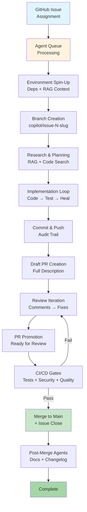

**RESEARCH COMPILATION  ·  MAY 2026**

# GitHub Copilot Big Wins & Automation Research Playbook

How Elite Engineering Teams Automated Branching,

PR Creation, Code Review & Deployment — Verified Results

**90%** Fortune 100

**55%** Faster Dev

**4.7M** Paid Subs

#### Compiled from: GitHub Blog, Microsoft Research, Accenture RCT,

Harness SEI, GitHub Docs, DevOps.com, and community case studies Version 1.0  ·  For Engineering Leaders & Platform Teams

## GitHub Copilot Agentic Architecture Overview



## Table of Contents

|**01**|**Executive Summary & Key Metrics**|
|---|---|
||Real numbers from verified studies|
|**02**|**How the Coding Agent Branches & Creates PRs**|

Architecture, security model, lifecycle

|**03**<br/>**The Big**|**Win Case Studies**|
|---|---|

Accenture RCT, Impact, Saxo Bank, Harness SEI

##### 04 Multi-Agent Orchestration Patterns

Orchestra, Squad, Mission Control, Fleet

##### 05 Automation Techniques & Approaches

6 proven strategies with implementation details

##### 06 PR Gate Standards & Best Practices

Industry-validated quality gates

##### 07 Branch Strategy for Agentic Workflows

Naming, protection rules, bypass patterns

##### 08 Skill Agents & Hook Architecture

##### The enforcement layer under every agent **09 Deployment Gate Patterns**

##### Staging → prod progression with confidence gates **10 The WRAP Framework & Prompt Standards**

Issue engineering for agent success

##### **11 Lessons Learned & Anti-Patterns** What NOT to do — from real teams **12 Implementation Roadmap** 0 → 90-day rollout plan

## 01 Executive Summary & Key Metrics

Verified data from controlled trials, enterprise deployments, and GitHub's own research

GitHub Copilot has crossed the threshold from productivity experiment to enterprise standard. With over 20 million total users, 4.7 million paid subscribers as of January 2026, and deployment across 90% of Fortune 100 companies, the evidence base for Copilot's impact is now deep enough to extract reliable patterns. This report focuses exclusively on verified, quantified outcomes — not marketing claims — and the specific automation techniques that drove them.

|**55%**|**84%**|**10.6%**|**3.5h**|
|---|---|---|---|
|Faster Code<br/>Completion Tasks|Increase in<br/>Successful Builds|More PRs<br/>per Developer|Reduction in<br/>Cycle Time|
|**23%**|**96%**|**90%**|**4,800%**|
|Coding Efficiency<br/>Gain (Impact)|Day-One<br/>Adoption Rate|Developer Job<br/>Satisfaction|ROI Reported<br/>(Impact Study)|

### Sources Behind the Numbers

|**Metric**<br/>55% faster coding|**Source**<br/>GitHub internal research|**Study Type**<br/>Controlled trial|**Year**<br/>2024-25|
|---|---|---|---|
|84% more successful build|sSecond Talent / GitHub research|Enterprise survey|2025|
|10.6% more PRs, -3.5h cy|cleHarness SEI / customer study|Before/after analysis|2025|
|23% coding efficiency +17|% quality<br/>Impact case study|Single-org deployment|2025|
|96% day-one adoption, 90|% satisfaction<br/>Accenture RCT (50K+ devs)|Randomized controlled tr|ial 2024|
|4,800% ROI ($76,600 net a|nnual)<br/>Impact myBiz case study|ROI calculation|2025|
|56% SWE-bench pass rate|GitHub / Claude 3.7 Sonnet eval|Benchmark|2025|
|80% new devs use Copilot|in week 1<br/>GitHub Octoverse 2025|Platform telemetry|2025|

## 02 How the Coding Agent Branches & Creates PRs

The complete technical lifecycle — from issue assignment to merged code

The GitHub Copilot coding agent operates as an asynchronous, cloud-native software engineer. Understanding its branch and PR lifecycle is essential before building automation on top of it. Unlike IDE-based tools that run locally and synchronously, the cloud agent works in an ephemeral GitHub Actions environment and manages its own git operations entirely.

### The Complete Branch & PR Lifecycle

### 1 Issue Assignment

You assign a GitHub Issue to @copilot (via UI, API, GitHub Actions label trigger, or Jira/Linear integration). The agent adds an I reaction and enters queue.

### 2 Environment Spin-Up

Copilot spins up an ephemeral GitHub Actions runner. It clones the repository, installs dependencies per copilot-setup-steps.yml, and initializes its RAG context using GitHub Code Search across the entire codebase.

### 3 Branch Creation

The agent creates a uniquely named branch (pattern: `copilot/issue-{N}-{slug}`). Critically: the agent can ONLY push to branches it created. Your default branch and team branches are protected by default.

### 4 Research & Planning

Using the RAG index + GitHub MCP server, the agent reads related issues, historic PRs, CODEOWNERS, and custom instructions. It builds an implementation plan before writing any code.

### 5 Implementation Loop

The agent writes code across multiple files, runs your test suite, linters, and type-checkers. It self-heals failures — reading error output and iterating until tests pass or hitting the session limit.

### 6 Commit & Push

Every iteration is committed with a descriptive message and pushed to its branch. This creates a live audit trail visible in session logs — every reasoning step, tool call, and code change is traceable.

### 7 Draft PR Creation

The agent opens a Draft PR (not ready for review) with a full description: what changed, why, which files, and acceptance criteria coverage. PR requires human approval before any CI/CD workflows run.

### 8 Review Iteration

Reviewers leave comments on the PR. The agent reads all comments in the next session and proposes fixes — either automatically or when re-prompted. This loop continues until all reviewers are satisfied.

### 9 PR Promotion

Once the developer is ready, the Draft PR is promoted to Ready for Review. Required status checks (your CI gate) must pass. Required reviewers (the person who assigned the task cannot self-approve) must approve.

### 10 Merge & Cleanup

PR merges to main. The agent's branch is deleted. The issue is automatically closed. Any configured post-merge agents (doc updater, changelog generator) fire via GitHub Actions.

### Security Model — Built-In Guarantees

The coding agent enforces a multi-layer security model that cannot be overridden by prompts. These are platform-level constraints, not soft guidelines:

|**Security Control**<br/>Branch isolation|**Behavior**<br/>Agent can only push to branches it created. Zero access to main, develop, or any human-created branch.|
|---|---|
|No self-approval|The developer who assigned the issue cannot approve the resulting PR. Required reviews rules are alwa|
|Controlled internet access|The agent's network egress is restricted to a customizable allowlist. No exfiltration paths.|
|CI gate before execution|GitHub Actions workflows do NOT run on the agent's PR until a human approves. Code runs in sandboxe|
|Policy inheritance|All existing branch protection rules, rulesets, and org policies apply to the agent exactly as they do to hum|
|Session logs|Every tool call, reasoning step, and file change is logged and viewable. No black-box execution.|

## 03 The Big Win Case Studies

Verified outcomes from real deployments — with specific metrics and what they actually did

### Accenture (50,000+ Developers)

###### RANDOMIZED CONTROLLED TRIAL

GitHub partnered with Accenture to conduct one of the largest randomized controlled trials of an AI coding tool in history — 50,000+ developers, multiple months, telemetry + surveys.

- 96% of developers who installed the IDE extension received and accepted suggestions on day one

- 81.4% installed the Copilot IDE extension on the same day they received their license

- 67% used Copilot at least 5 days per week; average 3.4 days/week usage

- 90% reported higher job fulfillment; 95% said they enjoyed coding more

- 43% found it 'extremely easy to use' — lowest barrier to adoption of any enterprise tool studied

- Only 1 minute from first suggestion seen to first suggestion accepted

#### How They Did It

Structured rollout: licenses distributed in cohorts, onboarding playbooks, communities of practice, telemetry monitoring via Harness SEI to measure PR velocity and cycle time.

#### Key Lesson

*Adoption is not the bottleneck. 96% day-one usage proves the tool sells itself. The bottleneck is governance and workflow integration.*

### Impact (Development Agency)

###### BEFORE/AFTER DEPLOYMENT STUDY

Impact integrated Copilot across their development team to address repetitive coding tasks, slow cycles, and inconsistent documentation. They measured ROI explicitly.

- 23% increase in coding efficiency measured over multiple months

- 17% improvement in code quality metrics

- Automated documentation generation cut review time significantly

- $76,600 annual net ROI — almost 4,800% return on Copilot investment

- 100% of developers would recommend Copilot to peers

- Debugging time reduced; developers could identify and fix issues faster

#### How They Did It

Focus on three specific pain points: boilerplate generation, documentation automation, and debugging assistance. Measured before/after with explicit ROI calculation.

#### Key Lesson

*Targeting specific pain points (docs, boilerplate, debug) and measuring them explicitly generates the most defensible ROI calculations.*

### Harness SEI Customer Study (50 Developers)

###### CONTROLLED BEFORE/AFTER

A Harness SEI customer study ran 50 developers for 2 months without Copilot, then multiple months with it, measuring PR activity and cycle time with engineering intelligence tooling.

- 10.6% increase in average number of pull requests per developer per month

- 3.5-hour reduction in average cycle time (task initiation → deployment)

- 2.4% improvement in cycle time percentage terms

- Increased collaboration measured by PR review frequency

- More rapid iteration cycles — developers shipped in smaller, more frequent batches

#### How They Did It

Used Harness SEI (Software Engineering Intelligence) to instrument both the no-Copilot and Copilot phases. No self-reporting — all metrics from actual git and CI telemetry.

#### Key Lesson

*The right measurement instrument matters. Telemetry-based measurement (not self-reports) is the only credible way to prove Copilot's impact to skeptical engineering leadership.*

### Saxo Bank

###### FINANCIAL SERVICES ENTERPRISE

Saxo Bank, a global fintech firm with strict regulatory and security requirements, adopted GitHub Copilot to accelerate coding while maintaining compliance posture.

- Significant acceleration in coding speed measured across engineering teams

- Developers unblocked from routine boilerplate in regulated financial code

- Copilot integrated into existing security-compliant workflow without policy violations

- Reduction in time-to-PR for standard feature development

#### How They Did It

Worked within existing compliance framework: enterprise IP indemnity, no customer data in prompts, audit logs for all AI-generated code. Phased rollout starting with internal tooling before customer-facing code.

#### Key Lesson

*Financial services can deploy Copilot without compromising compliance. The key is using Enterprise tier (IP indemnity + no training on your code) and keeping sensitive data out of prompts.*

### Global Logistics Leader (via Brillio)

###### SUPPLY CHAIN ENGINEERING

A global logistics company worked with Brillio to deploy GitHub Copilot across their engineering org, focusing on supply chain and operations software development.

- 25% increase in development speed across the engineering organization

- Faster onboarding for new team members using Copilot-assisted code exploration

- Reduction in code review cycles as Copilot-suggested code was more consistent

- Improved documentation coverage across legacy supply chain codebases

#### How They Did It

Integrated Copilot into existing sprint workflow. Used custom instructions to encode domain-specific patterns (EDI formats, logistics APIs). Measured velocity via sprint completion rates.

#### Key Lesson

*Domain-specific custom instructions in copilot-instructions.md produce dramatically better*

*suggestions in specialized industries. Generic Copilot < Copilot with your patterns encoded.*

### Microsoft Internal (All Engineers)

###### LARGEST SINGLE DEPLOYMENT

Microsoft has deployed GitHub Copilot to nearly all of its engineers — the largest single enterprise deployment. Microsoft is effectively 'customer zero' for all Copilot features.

- Nearly all Microsoft engineers use Copilot as part of daily development

- Copilot coding agent used for backlog reduction — routine issues assigned to agents

- Agentic workflows tested in production before being released to customers

- Agents deployed for documentation updates, test generation, and bug fixes at scale

- Mission Control used for parallel agent orchestration across multiple repos simultaneously

#### How They Did It

Internal dogfooding: every new Copilot feature is deployed internally before GA. Engineering teams use mission control to orchestrate multiple agents in parallel, dramatically increasing throughput on large codebases.

#### Key Lesson

*The most impactful use case for large engineering orgs is parallel agent orchestration — assigning many tasks simultaneously and reviewing the resulting PRs rather than writing code linearly.*

## 04 Multi-Agent Orchestration Patterns

Proven architectural patterns for coordinating multiple AI agents — from community and GitHub engineering

The biggest productivity multiplier identified across all case studies is not a single agent working better — it is multiple specialized agents working in parallel, each optimized for one role. These are the four patterns that have proven out in production.

### The Orchestra Pattern

Origin: Community (ShepAlderson/copilot-orchestra)

A Conductor agent orchestrates specialized subagents (Planning, Implementation, Code Review) through a complete development cycle. The critical rule: no agent can review its own work.

#### Execution Phases

**1.** Planning Subagent → creates implementation plan with TDD test specs

**2.** Implementation Subagent → writes code to make tests pass

**3.** Code Review Subagent → reviews the implementation (not the implementer)

**4.** If NEEDS_REVISION → loops back to a NEW implementation subagent instance

**5.** If APPROVED → Conductor commits and documents the phase

#### Key Insight

*Preventing self-review is the critical mechanism. The orchestration layer enforces this: the*

*original agent cannot revise its own rejected work. A fresh agent picks it up, eliminating anchoring bias.*

#### Best For

Feature development cycles, refactoring, and any task requiring high code quality assurance.

### The Squad Pattern

Origin: GitHub Engineering (bradygaster/squad-cli)

Two commands (npm install -g squad-cli, squad init) drop a pre-configured AI team into any repository: Lead, Frontend Developer, Backend Developer, and Tester — each with repository-native context.

#### Execution Phases

**1.** squad init → drops agent definitions + team decision history files

**2.** Describe task in natural language → Coordinator routes to specialists

**3.** Frontend and Backend specialists work in parallel on their domains

**4.** Tester writes test suite; if tests fail, backend specialist is rejected

**5.** Documentation specialist opens the pull request with full context

#### Key Insight

*Repository-native state is the secret. Agents load shared team decisions and project history files committed to the repo. They don't need context re-injected every session — it persists as git artifacts.*

#### Best For

Full-stack feature development, any team wanting multi-agent without heavy orchestration infrastructure.

### Mission Control Pattern

Origin: GitHub Official (Agent HQ)

A unified dashboard for assigning, monitoring, and steering multiple coding agent sessions across one or many repositories simultaneously. Built into GitHub.com.

#### Execution Phases

**1.** Open Mission Control (github.com/copilot/agents) → Agent HQ

**2.** Assign multiple tasks across repos in minutes from a single prompt interface

**3.** Watch real-time session logs for all parallel agents simultaneously

**4.** Steer mid-run: pause, refine prompt, restart any individual agent

**5.** Jump directly from Mission Control into each resulting PR for review

#### Key Insight

*Shift from coding linearly to orchestrating in parallel. Instead of one task taking 30 min, run 10 tasks simultaneously and review 10 PRs at the end of the same period. The throughput multiplier is dramatic.*

#### Best For

Large-scale refactoring, cross-repo migrations, backlog sprint reduction, and any work that can be parallelized across non-overlapping files.

### The Fleet Pattern (CLI)

Origin: GitHub Copilot CLI (/fleet command)

The /fleet command in Copilot CLI dispatches multiple agent instances in parallel from the terminal. Agents work asynchronously on partitioned workloads.

#### Execution Phases

**1.** Design a prompt that partitions work: declare dependencies, avoid file overlap

**2.** /fleet run --tasks tasks.json → spawns N parallel CLI agents

**3.** Each agent works its partition independently

**4.** Results are returned asynchronously; aggregate and review

**5.** Merge non-conflicting branches sequentially

#### Key Insight

*Work partitioning is the skill. Effective fleet usage requires explicitly declaring which files each agent should touch and what depends on what. Agents working the same files create merge conflicts.*

#### Best For

Terminal-native workflows, scripted batch operations, and teams that prefer CLI over web UI.

## 05 Automation Techniques & Approaches

Six battle-tested techniques for automated issue → branch → PR → merge pipelines

### T1 Label-Triggered Auto-Assignment

The simplest and most widely used trigger pattern. A GitHub Actions workflow watches for specific label combinations on issues and automatically assigns them to @copilot.

#### Implementation

#### Best Practices

I Only auto-assign P2/P3 issues. P0/P1 always go to humans.

- I Require at least two labels (e.g., 'bug' + 'auto-fix') to prevent accidental assignment

- I Add a bot comment explaining the automation so teams don't wonder what happened

- I Set a maximum daily auto-assignment limit to control costs

### T2 Scheduled Log Review** → **Issue Creation

A cron-scheduled GitHub Actions workflow fetches production logs (from Datadog, CloudWatch, Splunk), runs an AI agent to analyze them, and auto-creates labeled issues for detected problems.

#### Implementation

```
# .github/workflows/log-review.yml
```

```
on:
```

#### Best Practices

I Use Datadog/CloudWatch webhooks for P0 alerts — don't wait for the next cron window

- I Deduplicate issues before creation: check if an identical issue exists (open or recently closed)

- I Include the full stack trace, timestamp, and affected service in the issue body

- I Tag issues with environment (prod/staging), service name, and auto-detected severity

### T3 copilot-setup-steps.yml Environment Bootstrapping

A critical but often overlooked configuration file that defines exactly how the agent's ephemeral GitHub Actions environment is set up before it starts coding. Misconfigured environments cause most agent failures.

#### Implementation

#### Best Practices

I Mirror your local dev environment exactly. The agent fails if its environment differs from how tests were designed to run.

I Include all service dependencies (databases, queues, mock APIs) that tests need

I Validate setup-steps work manually by running them in a Codespace first

I Cache aggressively — cold environments slow the agent and burn Actions minutes

### T4 postToolUse Hook** → **Agent Handoff

Using the postToolUse hook to automatically trigger a downstream agent when the coding agent finishes. This creates the multi-agent pipeline without human intervention at each handoff.

#### Implementation

#### Best Practices

I Always check that the agent completed successfully before firing the handoff

- I Log every handoff to an append-only audit file for compliance

- I Use labels to track which stage of the pipeline a PR is in (agent-coding, agent-reviewing, ready-for-human)

- I Implement a circuit breaker: if a PR has been through > 3 agent loops, escalate to human

### T5 Copilot SDK — Embedded Agentic Workflows

The GitHub Copilot SDK (GA January 2026) enables embedding Copilot's full agent runtime into custom applications, CI systems, and internal tools — in Python, Node.js, Go, and .NET.

#### Implementation

#### Best Practices

I BYOK (Bring Your Own Key) is supported — useful for budget isolation across teams

- I Use streaming=True for long-running sessions to avoid timeout issues

- I SDK sessions share the same security model as the UI — no elevated permissions

- I Combine with GitHub Actions for scheduled runs (e.g., daily PR pattern analysis)

### T6 Research Session** → **Branch** → **Deferred PR

A newer workflow pattern (2026) where the agent first researches and plans on a branch without creating a PR. The developer reviews the diff and only promotes to PR when satisfied. Reduces premature PR noise.

#### Implementation

#### Best Practices

I Use research sessions for complex, multi-day tasks where you want to validate approach before committing to a PR

I Set 'create_pr: false' when the task is exploratory or when you need to merge multiple agent outputs first

I Review the implementation plan (output to a file like docs/plans/plan-{issue}.md) before the agent writes code

I Combine with the /fleet command to research multiple approaches in parallel and pick the best one

## 06 PR Gate Standards & Best Practices

Industry-validated quality gates that work with — and protect against — AI-generated code

AI-generated PRs require the same quality gates as human-written code — and in some cases, stricter ones. The volume of AI-generated code is higher and arrives faster, which means your gate automation must be equally fast and reliable. These are the gates that leading engineering teams have standardized on.

|**Gate**<br/>Unit Tests|**Tool/Approach**<br/>Jest / pytest / Go test|**Threshold**<br/>Must pass 100%|**On Failure**<br/>Block merge; comment on PR with failures|
|---|---|---|---|
|Code Coverage|Istanbul / Coverage.py|≥80% lines|Block merge; Copilot re-assigned to add tests|
|Security Scan|Snyk + CodeQL|Zero Critical/High|Block merge; auto-label 'security'; alert #sec-alerts|
|Code Quality|SonarQube / SonarCloud|Quality Gate: Pass|Block merge; Copilot re-assigned to fix hotspots|
|Lint / Format|ESLint / Prettier / Ruff|Zero errors|Block merge (auto-fixable issues auto-committed)|
|AI Code Review|Copilot code review action|No critical findings|Block merge until addressed|
|Secret Detection|GitHub Push Protection|Zero secrets|Block push entirely (not just merge)|
|Dependency Audit|npm audit / pip-audit|Zero known High CVEs|Block merge; auto-create Dependabot PR|
|Performance Budget|Lighthouse CI / k6|Within 10% baseline|Warn (not block); flag for human review|
|CODEOWNERS Review|GitHub CODEOWNERS|All owners approved|Block merge (platform-enforced)|

### The Self-Healing Loop — When Gates Fail

The most powerful pattern observed in production deployments is the self-healing loop: when a PR gate fails, an automated workflow comments on the PR directing Copilot to fix the specific failure. This creates an autonomous remediation cycle with zero human intervention for common failures.

**1.** PR gate fails (test, lint, security, or quality check)

**2.** GitHub Actions workflow detects the failure and reads the error output

**3.** Workflow posts a structured comment on the PR: '@copilot Please fix: [specific error with context]'

**4.** Copilot reads the comment in its next session, understands the exact failure, and pushes a fix

**5.** CI re-runs automatically on the new commit

**6.** Loop continues until all gates pass or a human-escalation threshold is hit (e.g., 3 failed attempts)

### Anti-Patterns in PR Gates

|**Anti-Pattern**<br/>Gating on process, not outcomes|**Why It's Dangerous**<br/>Don't gate on 'did the agent run?' Gate on 'do tests pass?'. Process gates bre|ak when tooling changes|
|---|---|---|
|Skipping gates for 'trivial' changes|AI-generated code that looks trivial is where subtle bugs hide. Apply full gates|to all PRs regardless of|
|Infinite self-healing loops|Always cap self-healing loops at 3-5 iterations. After that, escalate to human.|Uncapped loops burn Ac|
|Not having CODEOWNERS|Without CODEOWNERS, agent PRs can merge without the right team review|ing. Define ownership for|

|**Anti-Pattern**<br/>Over-relying on AI review|**Why It's Dangerous**<br/>Copilot's code review|
|---|---|

---

**This is Part 1 of 2. [Continue with Part 2 →](pathname:///archon/agentic-systems/coding-tools/parts/10-github-copilot-big-wins-research-part2) for branch strategy, skill agents, deployment gates, WRAP framework, lessons learned, and implementation roadmap.**
