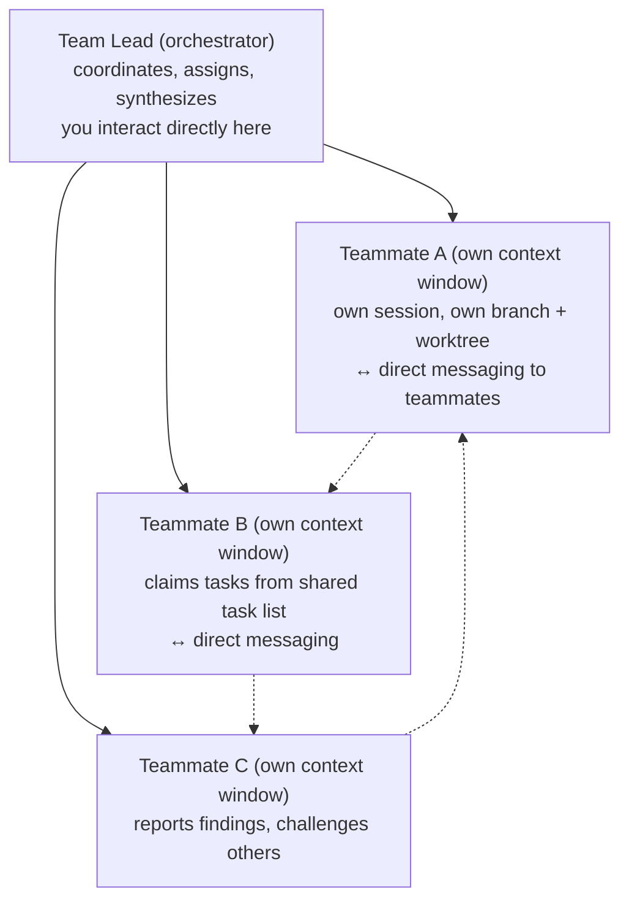
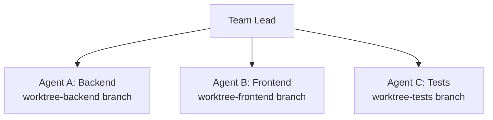

# Claude Code Agents & Parallelism

## Claude Code Agents · Parallelism · Computer Use

Subagents · Agent Teams · Git Worktrees · Background Agents · Task Tool · Computer Use · Model Routing

### Parallelism Decision Matrix — Choose the Right Tool

| Need | Subagents | Agent Teams | Worktrees | Background |
|------|-----------|-------------|-----------|------------|
| Workers report to main | ✓ native | △ via lead | manual | ✓ |
| Workers talk to each other | ✗ isolated | ✓ native | ✗ manual | ✗ |
| Context window isolation | ✓ each own | ✓ each own | ✓ + branch | ✓ |
| Filesystem isolation | ✗ shared | ✗ shared* | ✓ own branch | ✗ |
| You keep working | ✗ blocks | ✗ blocks | ✓ separate | ✓ Ctrl+B |
| Same-file edits safe | ✗ risky | ✗ risky | ✓ own branch | ✗ |
| Token cost | Low–Med | High (3-4×) | Med (per session) | Low–Med |
| Experimental / flag needed | ✗ built-in | ✓ env flag | ✗ built-in | ✗ built-in |

\* Agent Teams + worktrees = full isolation (recommended for large cross-layer refactors)

✓ Subagents: quick focused workers. Agent Teams: workers that debate + coordinate. Worktrees: branch isolation for safe parallelism.

## Git Worktrees — Branch Isolation for Agents

Built-in CLI flag (Claude Code v2.1.50+)

Start session in its own isolated worktree:

```bash
claude --worktree                    # auto-named
claude --worktree bugfix-auth       # named worktree
claude --worktree --tmux             # own tmux session too
```

Manual setup (classic approach):

```bash
git worktree add ../feature-a feature-branch-a
git worktree add ../feature-b feature-branch-b
# Run separate claude sessions in each dir
```

### How Worktrees Solve the Conflict Problem

Without worktrees: Agent A + Agent B both edit src/auth.ts → overwrites, merge conflicts, corrupted context

With worktrees: each agent gets own branch + own directory → no conflicts at filesystem level

### Worktree Lifecycle

- **Created at**: .claude/worktrees/[name]/ — isolated working directory
- **No changes**: Worktree + branch auto-removed when session ends
- **Has changes**: Branch persists — you review + merge manually
- **Gitignore**: Add .claude/worktrees/ to .gitignore to keep clean

**Warning**: Subagents can also use worktrees — ask Claude: "use worktrees for its agents" for batched migrations

## Subagents — Isolated Workers Within a Session

### Built-in Subagents (Auto-invoked)

- **Explore**: Read-only search + analysis. No writes. Delegates when codebase understanding needed without changes.
- **Plan**: Research for planning in plan mode. Prevents infinite nesting (subagents can't spawn subagents).
- **general-purpose**: Complex multi-step: exploration + modification + reasoning. Default for mixed tasks.

### Create Custom Subagents

Project-level example (.claude/agents/code-reviewer.md):

```yaml
---
name: code-reviewer
description: Expert code reviewer. Use proactively after code changes.
model: sonnet # cheaper than opus
tools: [Read, Grep, Glob, Bash]
color: orange
---
You are a senior code reviewer. Focus on security, performance, and best practices.
Return JSON: { file, line, severity, issue, fix }
```

User-level example (~/.claude/agents/debugger.md) — all projects

### Subagent Properties

- **Context**: Own isolated context window — doesn't share with parent
- **Spawning**: Claude invokes when task matches agent description — automatic or on request
- **No nesting**: Subagents cannot spawn other subagents — prevents infinite loops
- **Results**: Return to main conversation — many detailed results can bloat context
- **Inheritance**: Inherits parent CLAUDE.md context — picks up coding standards automatically

### 9-Parallel Code Review Pattern

Run 9 specialist subagents simultaneously:

1. Linter + Static Analysis
2. Code Reviewer (top 5 by impact)
3. Security (injections, auth, secrets)
4. Quality + Style (complexity, duplication)
5. Performance (bottlenecks, O(n²))
6. Test Coverage gaps
7. Dependency audit
8. Documentation completeness
9. Deduplication / reuse opportunities

All run in parallel → comprehensive review fast

### Model Routing for Cost

```bash
# Route subagents to cheaper model
export CLAUDE_CODE_SUBAGENT_MODEL="claude-sonnet-4-6"
# Main session: Opus (complex reasoning)
# Subagents: Sonnet (focused tasks) → saves $$$
```

## Agent Teams — Multi-Session Collaboration (Experimental)

### Enable + Activate

```bash
export CLAUDE_CODE_EXPERIMENTAL_AGENT_TEAMS=1
# Or in settings.json: { "agentTeams": true }

# Verify
echo $CLAUDE_CODE_EXPERIMENTAL_AGENT_TEAMS

# Prompt Claude to form a team:
# "Create a team to refactor the payment module. Spawn 3 teammates:
#  API layer, DB migrations, tests."

# Force Opus (recommended for team lead)
/model opus
```

### Architecture



### Subagents vs Agent Teams

- **Subagents**: Report back in isolation. No inter-agent comms. Run within single session.
- **Agent Teams**: Teammates message each other, share findings, challenge assumptions. Separate sessions.

### Best Use Cases for Teams

- Research + review — multiple teammates investigate different aspects, compare findings
- Cross-layer work — frontend + backend + tests owned by different teammates
- Competing hypotheses — debug: each teammate tests a different theory in parallel
- Architectural debates — teammates argue different approaches, converge on best

### Navigation Commands

- **Shift+Down**: Navigate to individual teammate session directly
- **Progress update**: "What are you working on? Progress update?" to any teammate
- **Stuck agent**: "Stop current task, report findings so far" — then redistribute

**Cost note**: Agent Teams = 3–4× token cost of sequential single session. Only use when coordination value justifies it.

## Background Agents

### How It Works

When Claude spawns a subagent for long task:

```bash
# Press Ctrl+B to background it
Ctrl+B → moves agent to background
      → you keep working on other tasks
      → agent status shown in sidebar

# Track all background agents
/tasks                    # see all running agents + IDs
/stats                    # token usage, streaks, patterns

# Long-running shell commands also backgroundable
# npm install, docker build, ffmpeg
# Background: Ctrl+B while running
```

### Async Session Memory

- **Session summary**: Every session maintains: status, completed work, discussion points, work log
- **/compact**: Executes immediately now — loads summary into fresh context, session continues

Background agents + worktrees = dispatch 5+ tasks and walk away. Each isolated, no conflicts.

## Task Tool — Parallelism Limits

### How the Task Tool Works

Prompt Claude to run N tasks in parallel:

```bash
"Explore codebase using 4 tasks in parallel. Each agent explores different directories."

# Each subagent = own context window via Task Tool
# Output: Task(Explore backend structure) ⎿ Done
```

### Parallelism Behavior

- **Max parallel**: Capped at ~10 simultaneous tasks
- **With level set**: Runs in batches — waits for full batch to complete before next batch starts
- **Without level**: Pulls from queue as soon as one task done — more efficient (streaming)
- **100 tasks**: Supported — queued and processed. Codebase documentation, large refactors.

### Best Prompt for Efficient Queue

Do NOT specify parallelism level → streaming mode:

```bash
"Process all 75 files. For each file, refactor the deprecated function.
Process them as fast as possible — don't wait."

# Claude pulls next task as soon as one finishes
```

Specifying "run 4 parallel" creates fixed batches — less efficient than letting Claude self-manage queue

## Computer Use — Web + Desktop Agent

### Claude in Chrome (Browser Agent)

- **What it does**: Navigate, click, fill forms, read content, manage tabs in Chrome
- **Interface**: Side panel in Chrome — sees what you see, acts on request
- **Auth context**: Uses your logged-in accounts — no re-authentication needed
- **Model (Max)**: Sonnet 4.6 / Opus 4.6 — full capability
- **Model (Pro)**: Haiku 4.5 only — limited capability
- **Token cost**: Browser automation eats usage faster than regular chat

### Developer Build-Test-Verify Pattern

3-tool dev loop:

1. Claude Code CLI → write + edit code
2. Claude in Chrome → test in browser, read console logs
3. Claude Code CLI → debug from console output

Chrome ext reads console directly — no copy/paste

### Research → File Pipeline

Chrome → web research, scrape structured data
\+ Cowork → synthesize into polished deliverable

No copy-pasting between windows

**Pro plan note**: Haiku only for Chrome → upgrade to Max for complex browser automation tasks

## Worktree Patterns — Advanced Use Cases

### Pattern 1: A/B Implementation

Generate multiple solutions, pick best:

```bash
git worktree add trees/impl-1 -b impl-1
git worktree add trees/impl-2 -b impl-2
git worktree add trees/impl-3 -b impl-3

# Same prompt in each → 3 implementations
# Compare, pick winner, merge to main
cd trees/impl-1 && git diff main
cd trees/impl-2 && git diff main
git merge impl-2                      # winner
git worktree remove trees/impl-1
git worktree remove trees/impl-3
```

### Pattern 2: Feature + Hotfix

Work on feature AND fix prod bug in parallel:

```bash
# Main session: feature development
claude                                 # in main repo dir

# New session for urgent hotfix
claude --worktree hotfix-auth-bug

# Both run completely independently
# No stashing. No context switching.
# Merge hotfix → deploy → continue feature
```

### Pattern 3: Large-Scale Migration

Deprecate fn used in 75 files:

```bash
"Find all 75 files with deprecated fn, use worktrees for subagents, refactor
each file in its own isolated context"

# Each file = own worktree branch
# All run in parallel, ~10 at a time
# Merge PRs → complete migration
# Spotify used this: 90% time reduction
```

### Worktrees + Agent Teams = Maximum Isolation

```
Phase 1 (Sequential): Team lead defines architecture

Phase 2 (Parallel with worktrees):



Phase 3 (Sequential): Integration + validation
git merge worktree-backend
git merge worktree-frontend
git merge worktree-tests
```

**Important**: Worktrees share local DB, Docker daemon, ports — only code is isolated, not runtime environment

Two agents modifying DB state at same time = race conditions. Use worktrees for code-only changes.

## Model Routing + Cost Optimization

### Token Cost Hierarchy

- **Opus 4.6**: Highest cost — use for: complex reasoning, team lead, architectural decisions, 1M context tasks
- **Sonnet 4.6**: Mid cost — everyday tasks, standard subagents, code review, most Claude.ai interactions
- **Haiku 4.5**: Lowest cost — high-volume subagents, Chrome on Pro, rapid iteration, simple focused tasks

### Cost Control Commands

```bash
# Route all subagents to cheaper model
export CLAUDE_CODE_SUBAGENT_MODEL="claude-sonnet-4-6"

# Switch model mid-session
/model haiku                          # for simple tasks
/model opus                           # for complex planning

# Monitor cost
/cos                                  # cost + duration current session
/stats                                # usage patterns dashboard

# Reduce context to reduce cost
/compact                              # summarize + fresh context
--max-turns 5                         # bounded scripted queries
```

### Parallel Cost Math

| Approach | Cost | Speed | Notes |
|----------|------|-------|-------|
| Subagents (×4 parallel) | ~2–3× token cost | 4× faster | |
| Agent Teams (×3 teammates) | ~3–4× token cost | 3× faster on complex tasks | |
| Worktrees (manual) | ~N× cost (N sessions) | Controlled | You control timing |
| Pro plan Chrome | Fast usage drain | Fast | Consider Max plan |

### When NOT to Parallelize

- Sequential dependencies (B needs A's output)
- Same-file edits without worktrees
- Tasks &lt; 10 minutes — setup overhead not worth it
- Tight dependencies between subtasks
- Budget-constrained sessions

### Progressive Escalation

Start small → scale as needed:

1. Single session (try first)
2. \+ Subagents (if context fills)
3. \+ Worktrees (if file conflicts)
4. \+ Agent Teams (if coordination needed)
5. \+ Background (if you need to keep working)
