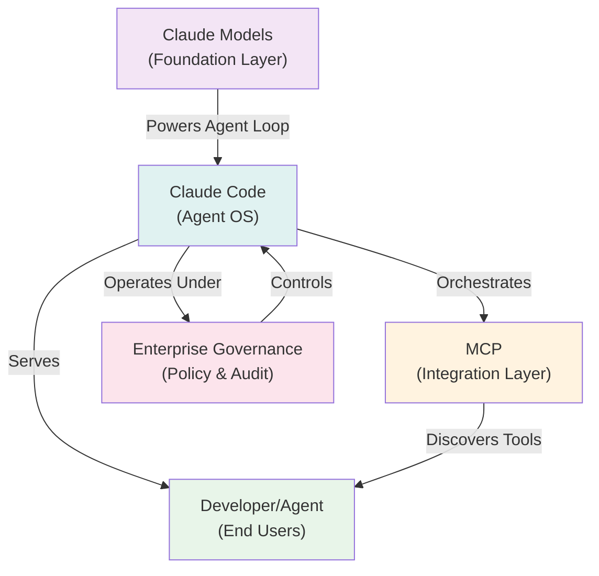

# Claude Ecosystem Research Report

Claude represents a fundamental architectural shift in enterprise AI: from autocomplete tooling to an integrated Agent Operating System that reshapes how organizations build, deploy, and govern AI-augmented systems. This comprehensive analysis examines Claude's positioning across 14 dimensions—from Constitutional AI principles and context engineering to multi-agent topologies, token economics, and the structural transformation of software engineering roles. The research spans technical deep-dives, competitive positioning, security threat modeling, and enterprise adoption patterns, synthesizing insights from ten senior technical roles spanning Anthropic research scientists, software architects, security engineers, and AI economics experts.

**Claude Ecosystem Architecture:** Foundation models power the Claude Code Agent OS, which orchestrates tool integration via MCP while operating under enterprise governance constraints to serve developers and agents.

## Comprehensive Research Report

**14 Phases of Analysis**

Phase 1: Anthropic Philosophy | Phase 2: Claude Code Architecture | Phase 3: Context Engineering | Phase 4: Claude.md Handbook | Phase 5: Subagent Systems | Phase 6: MCP Ecosystem | Phase 7: Agent Configuration

Phase 8: Token Economics | Phase 9: Claude Advocates | Phase 10: Claude Critics & Risks | Phase 11: Enterprise Adoption | Phase 12: AI-Native SDLC

Phase 13: Principal AI Architect Playbook | Phase 14: Future of Agentic Systems

**Research Team:** Anthropic Research Scientist · Claude Code Core Engineer · Distinguished Software Engineer · Principal AI Architect · Enterprise Architect · Agent Systems Researcher · AI Economics Researcher · Security Architect · Platform Engineering Leader · CTO of an AI-Native Organization

**Publication Date: June 2025 · Classification: Internal Strategic**

## Executive Summary

This report represents the most comprehensive independent analysis of the Claude AI ecosystem conducted from the perspective of ten senior technical roles spanning AI research, software engineering, enterprise architecture, security, and product leadership. Our central thesis is transformative: **Claude is not merely a large language model — it is an emergent Agent Operating System, a software engineering platform, and a context engineering framework that is fundamentally reshaping how enterprises build, deploy, and govern AI-augmented software systems.**

### Strategic Findings

#### Constitutional AI Advantage

Anthropic's Constitutional AI and Responsible Scaling Policy create structural differentiation from OpenAI and Google DeepMind. The emphasis on legibility, corrigibility, and staged deployment makes Claude the most enterprise-safe frontier model available in 2025.

#### Claude Code as Agent OS

Claude Code is not an IDE extension — it is an autonomous agent runtime with a persistent loop, tool-invocation model, context compaction engine, and sub-agent delegation system. It represents the first commercially viable 'Agent Operating System' layer on top of a frontier model.

#### Context Engineering Supersedes Prompt Engineering

Context engineering — the deliberate lifecycle management of what information occupies an agent's context window at every moment — is the primary determinant of agent quality, cost, and reliability. Prompt engineering is a subset; context governance is the enterprise discipline.

#### MCP as the AI Integration Standard

The Model Context Protocol is rapidly becoming the lingua franca of AI-to-system integration. Its security model, however, has significant gaps that enterprises must address before production deployment.

#### Token Economics Are Now a FinOps Domain

At scale, token consumption is a major cost driver comparable to cloud compute. Organizations without AI FinOps practices will face budget overruns of 3-10x within 12 months of scaling agentic workloads.

#### 18-Month Transformation Window

Software engineering roles, SDLC processes, and architectural patterns are undergoing the fastest transformation in the discipline's history. Organizations that do not establish an AI Center of Excellence by Q4 2025 risk a 24-month competitive lag.

### Critical Risk Summary

| Risk | Likelihood | Impact | Mitigation Priority |
|---|---|---|---|
| MCP prompt injection / tool poisoning | High | Critical | Immediate |
| Context window data leakage | Medium | High | Immediate |
| Token budget overruns at scale | Very High | High | Short-term |
| Agent overreach in production systems | Medium | Critical | Immediate |
| Supply-chain attacks via MCP registries | Medium | High | Short-term |
| Loss of human oversight in autonomous loops | Medium | Critical | Immediate |
| Governance gap in multi-agent systems | High | High | Short-term |
| Context poisoning via adversarial input | Medium | High | Short-term |

### How to Use This Report

The 14 phases are designed to be consumed sequentially for newcomers or referenced individually by specialists. Each phase concludes with an Enterprise Applicability summary, cost implications, and security implications. Appendix sections provide reference architectures, maturity models, and decision frameworks suitable for immediate organizational use.

## Phase 1: Anthropic Philosophy

### 1.1 Constitutional AI (CAI)

Constitutional AI is Anthropic's foundational alignment methodology. Rather than relying solely on human feedback to shape model behavior, CAI encodes a set of principles — a 'constitution' — against which the model critiques and revises its own outputs. This two-stage process (supervised learning from AI feedback, then RLHF from a preference model trained on constitutionally-filtered data) produces models that are simultaneously more helpful and more resistant to harmful use.

The practical enterprise implication is significant: Claude models exhibit more consistent, auditable refusal behaviors than models trained purely on human preference data, where annotator subjectivity introduces non-determinism. This consistency is critical for regulated industries.

#### Core Constitutional Principles

| Harmlessness | Avoid outputs that are deceptive, harmful, or highly objectionable. |
|---|---|
| Honesty | Only assert things believed to be true; calibrate uncertainty; be transparent. |
| Helpfulness | Genuinely benefit users and operators without sycophancy. |
| Corrigibility | Support human oversight and correction; don't resist shutdown. |
| Non-deception | Never attempt to create false impressions through any means. |
| Non-manipulation | Rely only on legitimate epistemic means to influence beliefs. |

### 1.2 Responsible Scaling Policy (RSP)

Anthropic's Responsible Scaling Policy is a public commitment to staged capability deployment tied to safety evaluations. The policy defines AI Safety Levels (ASL-1 through ASL-4+) analogous to biosafety levels.

Each level unlocks additional capabilities only after passing defined evaluation thresholds. Current frontier models operate at ASL-2 with ASL-3 evaluations underway.

| ASL Level | Capability Threshold | Required Safeguards |
|---|---|---|
| ASL-1 | No meaningful uplift to catastrophic harm | Standard security practices |
| ASL-2 | Early signs of dangerous capability | Enhanced monitoring, limited deployment |
| ASL-3 | Meaningful uplift to CBRN or critical infrastructure attacks | Stringent isolation, government coordination, restricted access |
| ASL-4 | Ability to independently cause catastrophic harm | Effectively no deployment without extraordinary controls |

### 1.3 How Anthropic Differs from Competitors

| Dimension | Anthropic / Claude | OpenAI / GPT | Google DeepMind / Gemini |
|---|---|---|---|
| Core Mission | Long-term AI safety; beneficial AGI | AGI benefit for humanity (commercial pivot) | Scientific excellence; Google integration |
| Alignment Approach | Constitutional AI; interpretability-first | RLHF + GPT-4o; less published methodology | RLHF; Constitutional elements; less transparent |
| Safety Philosophy | "We may be building one of the most dangerous technologies in history" — explicit precaution | Competitive pressure drives faster deployment | DeepMind safety research alongside rapid Google integration |
| Governance Model | PBC (Public Benefit Corporation); independent board | For-profit; Microsoft partnership; complex governance | Google subsidiary; DeepMind autonomy partially preserved |
| Interpretability R&D | Core research pillar (Superposition, Circuits, SAE) | Less published; internal focus | Strong mechanistic interpretability research (team at DMI) |
| Enterprise Suitability | Highest; consistent refusals, auditable behavior | High; broadest ecosystem; less consistent | High; deep Google Workspace integration |
| Agentic Platform | Claude Code; MCP; agent SDK; hooks system | Codex; Operator; ChatGPT plugins | Gemini CLI; Project Astra; Google AI Studio |
| Open Source | Minimal; strategic closed approach | Moderate; API-first | Mixed; some OSS models (Gemma) |

### 1.4 Interpretability Research

Anthropic's interpretability program — covering Superposition, Circuits, Sparse Autoencoders (SAEs), and mechanistic analysis — is the most advanced published effort to understand the internal representations of transformer models. Key findings include:

- Polysemanticity: individual neurons encode multiple concepts simultaneously (superposition hypothesis)
- Circuits: small, reusable subnetworks implement specific algorithmic behaviors (e.g., induction heads)
- Feature geometry: concepts are encoded as directions in activation space, not isolated neurons
- SAE decomposition: sparse autoencoders can identify ~100,000+ interpretable features in frontier models
- Emotion-adjacent features: models appear to have internal 'emotional' states influencing output tone

**Enterprise Implication:** Interpretability research directly enables auditable AI — the ability to understand why a model produced a given output, critical for regulated sectors (banking, healthcare, legal). Anthropic's lead here is a meaningful differentiator for compliance-sensitive deployments.

### 1.5 Alignment Strategy & Long-Term Vision

Anthropic's alignment strategy is predicated on the belief that sufficiently advanced AI systems require not just behavioral training but legible internal structure that can be inspected, corrected, and verified. The long-term vision encompasses:

| Scalable Oversight | Developing techniques for humans to effectively supervise AI systems more capable than themselves |
|---|---|
| Automated Alignment Research | Using AI to accelerate alignment research itself — 'AI for AI safety' |
| Societal Integration | Publishing safety research; engaging policymakers; Claude Economic Index tracking labor displacement |
| Corrigibility at Scale | Maintaining human control even as models become more autonomous and capable |

#### Phase 1 Enterprise Assessment

**Benefits:** Superior safety guarantees, consistent behavior, interpretability roadmap, regulatory alignment, corrigible by design.

**Limitations:** More conservative refusals than competitors in some edge cases; slower capability deployment due to safety gates; less open-source ecosystem.

**Cost Implications:** Safety overheads are internalized by Anthropic; enterprises benefit without additional cost vs. competitors.

**Security Implications:** Constitutional alignment reduces jailbreak surface; interpretability enables anomaly detection; RSP provides supply-chain assurance for capability thresholds.

## Phase 2: Claude Code Architecture

### 2.1 Architectural Overview

Claude Code is a command-line-native agentic coding environment built on top of the Claude API. It is fundamentally different from IDE assistants (Copilot, Cursor) in that it operates as a **persistent autonomous agent** with its own execution loop, tool runtime, file system access, bash execution capability, and sub-agent spawning system.

#### Core Architectural Components

| Component | Description | Enterprise Relevance |
|---|---|---|
| Agent Loop | Persistent ReAct-style loop: Observe→Plan→Act→Reflect→Repeat until task complete or interrupted | Primary execution unit; failure modes propagate through entire session |
| Tool Runtime | Built-in tool set: Read/Write File, Bash, Web Search, Sub-Agent Spawn, MCP tool invocation | Attack surface for prompt injection; must be sandboxed |
| Context Engine | Sliding context window with compaction; CLAUDE.md injection; tool result management | Token cost driver; primary performance lever |
| Permission System | Five-tier model: Auto-approve, Ask-once, Ask-always, Deny-always, Directory-scoped | Primary safety control; must align with least-privilege principle |
| Session Manager | Maintains conversation state; supports resume; tracks tool history | Audit trail source; compliance artifact |
| Sub-Agent Executor | Spawns isolated child agents with scoped permissions and context | Enables parallelism; creates governance complexity |
| MCP Client | Connects to Model Context Protocol servers for external tool/resource access | Integration layer; primary external attack surface |
| Hooks System | Pre/post-tool execution scripts; event-driven automation | Customization layer; security checkpoint injection point |

### 2.2 The Agent Loop in Detail

The Claude Code agent loop implements a variant of the ReAct (Reasoning + Acting) pattern extended with planning and reflection phases. Each iteration:

| 1. Observe | Ingest current context: CLAUDE.md, conversation history, previous tool results, environmental state |
|---|---|
| 2. Think | Chain-of-thought reasoning (visible in extended thinking mode) to plan next action |
| 3. Act | Invoke exactly one tool or produce a final response |
| 4. Integrate | Tool result is appended to context; compaction triggers if approaching context limit |
| 5. Reflect | Assess whether task is complete; determine next step or halt |
| 6. Checkpoint | If permission required (based on permission tier), pause and request human approval |

### 2.3 Permission System Architecture

Claude Code's permission system is the primary mechanism for maintaining human oversight during autonomous execution. It operates on a per-tool, per-path, per-session basis:

| Permission Tier | Behavior | Appropriate Use Cases | Risk Level |
|---|---|---|---|
| Auto-approve | Tool executes without interruption | Read-only ops in sandboxed env | Medium |
| Ask-once | Approve class of action once per session | Trusted write operations in repo | Low-Medium |
| Ask-always | Approve every individual invocation | Destructive or external operations | Low |
| Deny-always | Tool permanently blocked | Production systems, secrets, billing | Minimal |
| Directory-scoped | Allow writes only within specified paths | Feature branch development | Low |

**Security Warning:** The most common misconfiguration is granting auto-approve to bash execution in environments with network access or secret stores. A single prompt injection via a malicious file read can execute arbitrary commands if bash is auto-approved.

### 2.4 Context Compaction Engine

As the agent loop iterates, context grows. Claude Code implements automatic context compaction when the context approaches the model's context limit (200K tokens for Claude 3.x). Compaction uses a secondary Claude call to summarize conversation history while preserving critical state: current task, completed steps, open files, pending actions.

This creates a form of lossy compression. Information lost during compaction cannot be recovered. Enterprise systems must architect for compaction-aware workflows where critical data is persistently stored externally rather than held in context.

### 2.5 Sub-Agent Execution Model

Claude Code can spawn sub-agents — child agent processes that execute autonomously within a scoped context. This enables parallelism (multiple agents working on different files simultaneously) and specialization (dedicated research, coding, testing, or documentation agents).

| Planner Agent | Decomposes high-level tasks into subtasks; coordinates sub-agent dispatch |
|---|---|
| Research Agent | Web search, documentation retrieval, codebase analysis |
| Implementation Agent | Code writing, refactoring, file manipulation |
| Test Agent | Test generation, execution, failure analysis |
| Review Agent | Code review, security scanning, quality assessment |
| Documentation Agent | Docstring generation, README updates, changelog maintenance |

### 2.6 Worktree Isolation

Git worktrees provide filesystem-level isolation for concurrent Claude Code sessions. Each session operates in its own worktree, preventing file-system conflicts while sharing the git object store. This pattern is critical for safe parallelism in enterprise codebases.

**Enterprise Applicability:** Claude Code's architecture maps directly to enterprise CI/CD pipelines. The agent loop can be triggered by PR events; sub-agents can parallelize across microservices; the permission system provides change governance. The primary gaps are audit logging, secret management, and cost controls — all addressable with patterns described in later phases.

## Phase 3: Context Engineering

### 3.1 Why Context Engineering Supersedes Prompt Engineering

Prompt engineering optimizes a single input. Context engineering manages the entire information environment of an AI agent across its operational lifetime. As agents become more capable and sessions longer, the quality of context management becomes the primary determinant of agent effectiveness — dwarfing the marginal gains from prompt optimization.

| Dimension | Prompt Engineering | Context Engineering |
|---|---|---|
| Scope | Single input/output pair | Entire agent session lifecycle |
| Timescale | Milliseconds (inference) | Minutes to hours (sessions) |
| Key Skill | Instruction clarity, few-shot design | Information architecture, lifecycle governance |
| Primary Failure Mode | Ambiguous instruction, missing examples | Context drift, compaction loss, token waste |
| Enterprise Value | Low-medium (easily copied) | High (structural competitive advantage) |
| Maturity Level | Commoditized (2024) | Emerging discipline (2025) |

### 3.2 The Context Lifecycle

| Initialization | CLAUDE.md injection; system prompt construction; memory retrieval from persistent store |
|---|---|
| Active Accumulation | Tool results, conversation turns, and file contents appended to context |
| Compaction Trigger | At ~85% context capacity, compaction summarization executes |
| Lossy Compression | Non-essential history summarized; critical state preserved in structured form |
| Context Recovery | Re-injection of persistent facts post-compaction via memory tools or CLAUDE.md |
| Session Termination | Final state exported to persistent memory; session transcript archived |

### 3.3 Memory System Taxonomy

Claude agents have access to four distinct memory stores, each with different characteristics and appropriate use cases:

| Memory Type | Mechanism | Persistence | Best For |
|---|---|---|---|
| In-Context Memory | Direct content in the context window | Session only | Active working state, recent tool results |
| External Memory | Vector stores, databases, file systems via MCP | Persistent | Knowledge bases, long-term facts, project history |
| In-Weights Memory | Model training data | Permanent (per model version) | General world knowledge, coding patterns, language |
| In-Cache Memory | KV cache (prompt caching) | Hours (API-side) | Repeated large context segments; cost reduction |

### 3.4 Context Debt & Context Entropy

Two failure modes unique to agentic systems require new engineering disciplines:

**Context Debt** accumulates when repeated compaction cycles progressively lose critical information, degrading agent performance over time. Like technical debt, it compounds — each compaction slightly degrades subsequent ones. Mitigation: externalize all persistent facts; use structured state files that survive compaction.

**Context Entropy** describes the increasing disorder of context as unrelated tool results, failed attempts, and abandoned subtasks accumulate. High entropy contexts produce lower-quality reasoning. Mitigation: regular context clearing, structured tool result formatting, explicit irrelevant-result pruning instructions.

### 3.5 Token Efficiency Patterns

- Use structured JSON for tool results rather than prose — 30-50% token reduction with equivalent information
- Implement prompt caching for large, stable context segments (system prompt, large files)
- Use tags with explicit relevance scoring to help agents prune irrelevant content
- Externalize task state to a structured YAML/JSON file and re-inject only current section
- Batch related tool calls when possible; each round-trip adds overhead tokens
- Use sub-agents for isolated subtasks — they start with clean context, preventing entropy accumulation
- Implement context budget alerts: warn at 50%, 75%, 90% context utilization

**Context Maturity Model:** Level 1 (Ad hoc prompts) → Level 2 (CLAUDE.md adoption) → Level 3 (Lifecycle management) → Level 4 (Persistent memory integration) → Level 5 (Automated context governance with cost controls)

## Phase 4: Claude.md Handbook

### 4.1 What Is CLAUDE.md?

CLAUDE.md is the primary mechanism for injecting persistent, project-specific context into a Claude Code session. It is automatically loaded from the repository root (and parent directories) at session initialization. Think of it as the agent's standing orders — the information it needs to function effectively in your specific codebase without consuming context tokens on repeated explanation.

### 4.2 CLAUDE.md Reference Architecture

| Section | Purpose | Example Content | Approx Token Budget |
|---|---|---|---|
| Project Overview | High-level context for the agent | Tech stack, team, product purpose | 100-200 |
| Repository Structure | File system orientation | Key directories, service boundaries | 150-300 |
| Development Commands | Critical runnable commands | Build, test, lint, migrate scripts | 100-200 |
| Architecture Decisions | Why the system is built this way | Key ADRs, patterns to follow | 200-400 |
| Code Style & Conventions | Language-specific standards | Naming, formatting, patterns | 150-300 |
| Security Constraints | What the agent must NOT do | No secrets in logs, no direct DB writes | 100-200 |
| Agent-Specific Instructions | Behavioral guidance for Claude | Communication style, escalation rules | 100-200 |
| MCP Servers Available | Discoverable tools | Server names, purpose, connection hints | 100-200 |
| Known Issues / Gotchas | Project-specific pitfalls | Flaky tests, deprecated patterns | 100-300 |

### 4.3 What Should Never Be in CLAUDE.md

- **Secrets or credentials** — API keys, passwords, tokens (use secret management tools)
- **PII or sensitive data** — customer information, employee records
- **Highly volatile content** — anything that changes daily (use dynamic injection instead)
- **Deeply nested documentation** — link to external docs rather than embedding them
- **Conflicting instructions** — if Claude.md and a user prompt conflict, behavior is undefined
- **Long prose explanations** — use bullet points and structured headers for token efficiency

### 4.4 Multi-Repository Claude.md Strategy

Enterprise codebases typically span dozens to hundreds of repositories. A hierarchical CLAUDE.md strategy prevents duplication while ensuring every repository has appropriate context:

| Global (~/.claude/CLAUDE.md) | Organization-wide conventions, security rules, tool access policy |
|---|---|
| Monorepo Root (./CLAUDE.md) | Project-wide architecture, cross-service patterns, shared tooling |
| Service Root (./services/api/CLAUDE.md) | Service-specific stack, database schema, API contracts |
| Feature Branch (.claude/sprint.md) | Sprint goals, current task list, temporary context |

### 4.5 Anti-Patterns Catalog

**God CLAUDE.md:** A 10,000-token CLAUDE.md that covers everything — most content irrelevant to any given task

**No CLAUDE.md:** Agent relies on in-session discovery; wastes tokens; produces inconsistent behavior

**Stale CLAUDE.md:** Commands or paths that no longer exist; agent wastes cycles on failed operations

**Secret Leakage:** Hardcoded credentials discovered by the agent and inadvertently included in outputs

**Conflicting Instructions:** CLAUDE.md says 'use tabs'; code style says 'use spaces'; agent behavior undefined

**Missing Security Constraints:** No explicit prohibition on dangerous operations; agent may attempt them

**Best Practice:** Treat CLAUDE.md as code. Version it, review it in PRs, test it by starting fresh Claude Code sessions and verifying the agent behaves correctly without additional instruction. Aim for 500-1500 tokens per repository-level CLAUDE.md.

## Phase 5: Subagent Systems

### 5.1 Agent Topology Patterns

The architecture of multi-agent systems fundamentally determines their capabilities, failure modes, and governance requirements. Four primary topologies are observed in production:

| Topology | Structure | Strengths | Weaknesses | Best For |
|---|---|---|---|---|
| Hierarchical | Single planner dispatches specialists; results aggregate upward | Clear accountability; predictable cost; easy to audit | Bottleneck at planner; limited parallelism | Structured tasks with clear decomposition |
| Swarm | Peer agents self-organize; shared task queue | High parallelism; resilient to single-agent failure | Coordination overhead; hard to audit; emergent behavior | Large-scale search/analysis tasks |
| Pipeline | Sequential agents; output of each is input to next | Simple; predictable; easy to monitor | No parallelism; sequential bottleneck; error propagation | ETL-style workflows; code generation pipelines |
| Graph/DAG | Task dependency graph; agents execute when dependencies complete | Optimal parallelism; respects dependencies | Complex orchestration; harder to implement | Complex software projects with many interdependencies |

### 5.2 Agent Specialization Catalog

| Agent Type | Capabilities | Primary Use Cases |
|---|---|---|
| Planner Agent | Receives high-level goals; produces task decomposition; dispatches sub-agents; integrates results | Complex project orchestration; sprint planning; architecture design |
| Research Agent | Web search, documentation retrieval, codebase analysis; produces structured research reports | Technology evaluation; bug investigation; API discovery |
| Implementation Agent | Code writing, refactoring, file manipulation; follows style from CLAUDE.md | Feature development; technical debt reduction; scaffolding |
| Test Agent | Test case generation, test execution, failure analysis, coverage reporting | TDD workflows; regression prevention; quality gates |
| Security Agent | SAST/DAST integration, secret detection, dependency vulnerability scanning, threat modeling | Pre-commit security gates; compliance verification |
| Documentation Agent | Docstring generation, README updates, API documentation, architecture diagrams | Ongoing documentation maintenance; new developer onboarding |
| Review Agent | Code review, architectural coherence, naming convention enforcement, performance analysis | Pre-merge quality gates; PR review automation |
| Validation Agent | Acceptance criteria verification, E2E test execution, stakeholder report generation | Sprint completion validation; release readiness assessment |

### 5.3 Agent Governance Model

As agent systems grow in autonomy and complexity, governance becomes critical. A complete agent governance model addresses six dimensions:

| Authorization | What actions can each agent class perform? Who can spawn which agent types? |
|---|---|
| Audit Logging | Every tool invocation, permission request, and state change must be logged with agent identity |
| Cost Allocation | Token spend attributed per agent, per task, per team for FinOps visibility |
| Error Containment | Failure in one agent must not cascade; circuit breakers between agents |
| Human Oversight | Mandatory human checkpoints for irreversible actions regardless of permission tier |
| Data Governance | What data can each agent access? PII handling; data residency requirements |

### 5.4 Cost & Reliability Models

Multi-agent systems multiply token costs. A naive hierarchical system with 5 specialist agents and a planner will consume 6x the tokens of a single-agent approach, plus coordination overhead. Reliability compounds differently: if each agent has 95% reliability, a 5-agent pipeline has (0.95)^5 = 77% end-to-end reliability without retry logic.

**Reliability Formula:** P(system success) = P(agent_1) × P(agent_2) × ... × P(agent_n) × P(coordination). For P = 0.90 and n = 8 agents: P(system) ≈ 0.43 without retries. Retry budgets and fallback behaviors are not optional in production multi-agent systems.

## Phase 6: MCP Ecosystem

### 6.1 MCP Architecture Overview

The Model Context Protocol (MCP) is an open standard developed by Anthropic that defines a structured communication protocol between AI models (clients) and external systems (servers). MCP replaces ad-hoc tool integration with a discoverable, versioned, typed interface layer. It is rapidly becoming the industry standard for AI-to-system integration.

| Layer | Component | Description |
|---|---|---|
| Transport | stdio / HTTP+SSE / WebSocket | Low-level communication channel between client and server |
| Protocol | JSON-RPC 2.0 | Message framing; request/response; notifications |
| Capability Layer | Tools / Resources / Prompts | What the server exposes; discoverable by the client |
| Identity | Server manifest | Name, version, capability declaration; no cryptographic identity by default |
| Orchestration | MCP Registry / Marketplace | Discovery mechanism for finding MCP servers by capability |

### 6.2 Transport Mechanisms

| stdio (local) | Process communicates via stdin/stdout. Most secure: no network exposure. Default for local tools. |
|---|---|
| HTTP + SSE (remote) | Server-sent events for streaming. Supports remote deployment. Standard for cloud MCP servers. |

**WebSocket (remote)** Bidirectional; supports server-initiated messages. Less common; more complex security posture.

### 6.3 MCP Security Analysis

**Critical Finding:** MCP's security model has significant structural gaps that create enterprise-grade risk in production deployments. Organizations adopting MCP without additional security controls are accepting risk that may not be visible until an incident.

| Vulnerability | Description | Exploitability | Impact | Mitigation |
|---|---|---|---|---|
| Tool Poisoning | Malicious MCP server returns tool results designed to manipulate agent behavior | High | Critical | Tool result sanitization; output validation |
| Prompt Injection via MCP | File contents or API responses contain adversarial instructions that hijack agent behavior | High | Critical | Strict context sandboxing; injection detection |
| No Cryptographic Identity | MCP server manifests are not signed; agent cannot verify server authenticity | Medium | High | Allow-list by URL; certificate pinning for remote |
| Credential Harvesting | Agent instructed to extract secrets and exfiltrate via MCP tool call | Medium | Critical | Secret store isolation; no secrets in context |
| Supply-Chain Attack | Malicious MCP server registered in public registry with legitimate-looking name | Medium | High | Private registries only; vendor review process |
| Over-Privileged Servers | MCP server granted filesystem/network access beyond its stated purpose | Low | High | Least-privilege MCP permissions; sandboxing |
| Confused Deputy | Agent uses high-privilege MCP server in low-trust context due to prompt manipulation | Medium | High | Context-aware authorization; privilege escalation controls |

### 6.4 Enterprise MCP Blueprint

A secure enterprise MCP architecture requires six control layers:

**Private Registry** Internal MCP server registry with mandatory security review and provenance tracking

| Identity & Auth | mTLS for remote servers; API key rotation; per-server OAuth scopes |
|---|---|
| Input/Output Validation | Schema validation for all tool calls; injection pattern detection on tool results |
| Network Segmentation | MCP servers in isolated VPC segments; allow-list egress; no production DB direct access |
| Audit Logging | Every MCP tool invocation logged with agent identity, timestamp, parameters, results |
| Rate Limiting & Circuit Breakers | Per-server rate limits; automatic isolation on anomalous behavior patterns |

**Recommendation:** Treat every MCP server as an untrusted third-party library. Apply the same security review process you would for an npm or PyPI package with production system access. Never allow a public MCP server access to credentials, production databases, or sensitive file systems.

## Phase 7: Agent Configuration Systems

### 7.1 Claude Code Configuration Hierarchy

| Layer | Mechanism | Scope | Mutability |
|---|---|---|---|
| Global | ~/.claude/settings.json + ~/.claude/CLAUDE.md | All sessions for this user | User-controlled |
| Project | ./CLAUDE.md + ./.claude/settings.json | All sessions in this repo | Team-controlled via VCS |
| Session | Runtime instructions; /commands; imported context | Single session | Agent + user at runtime |
| Sub-Agent | Spawned with scoped context and permission subset | Single sub-agent lifetime | Parent agent |

### 7.2 Hooks System

Hooks are user-defined scripts that execute at defined points in the agent loop: PreToolUse, PostToolUse, Notification, and Stop. They enable powerful customizations without modifying the agent's core behavior:

| PreToolUse | Validate, transform, or block tool calls before execution. Security checkpoint. |
|---|---|
| PostToolUse | Process, log, or transform tool results. Audit trail injection. |
| Notification | Trigger external alerts on agent events. Slack, PagerDuty integration. |
| Stop | Execute cleanup on session end. State persistence. Report generation. |

### 7.3 Slash Commands

Slash commands are project-defined workflow shortcuts stored in .claude/commands/. They allow teams to codify common agent workflows as reusable, parameterized commands that any team member can invoke consistently:

- /review — run the full code review agent pipeline on the current branch
- /test-coverage — execute test agent and generate coverage report
- /security-scan — invoke security agent with OWASP checklist
- /doc-update — synchronize documentation with recent code changes
- /release-prep — run validation, changelog, and version bump agents

### 7.4 Competitive Platform Comparison

| Feature | Claude Code | Cursor | GitHub Copilot | Gemini CLI | Devin | OpenHands |
|---|---|---|---|---|---|---|
| Agent Loop | Full autonomous loop | Composer (semi-auto) | Workspace (limited) | Full loop | Full autonomous | Full loop |
| Context Config | CLAUDE.md + Settings | Rules files | .github/copilot-instructions.md | GEMINI.md | Proprietary | config.toml |
| MCP Support | Native; first-class | Limited/experimental | Limited | Native (partial) | None | Partial |
| Sub-Agents | Native parallelism | None | None | Experimental | Internal only | Native |
| Hooks System | Full pre/post hooks | None | None | Limited | None | Partial |
| Permission System | 5-tier granular | Limited | Basic | Basic | Platform-controlled | Configurable |
| Open Source | No (API) | No | No | Partial | No | Yes (Apache) |
| Enterprise Controls | API + usage policies | Business plans | Enterprise Copilot | Google Workspace | Devin Enterprise | Self-host |
| Primary Strength | Agent OS platform | IDE integration | GitHub integration | Google ecosystem | Fully autonomous | Openness |

**Continued in [Part 2](parts/23-claude-ecosystem-research-report-part2.md)**: Agent Configuration Systems, Token Economics, Advocates & Critics, Risk Register, Enterprise Adoption, AI-Native Software Engineering, Principal AI Architect Playbook, Future of Agentic Systems, Appendices.

## Related Documentation

- [GitHub Copilot Enterprise Agent Platform](47-github-copilot-enterprise-research-2026.md) — Comprehensive analysis of GitHub Copilot's evolution and enterprise deployment
- [Agent Skills Complete Playbook 2026](../core/16-agent-skills-complete-playbook-2026.md) — Design patterns for composable agent capabilities
