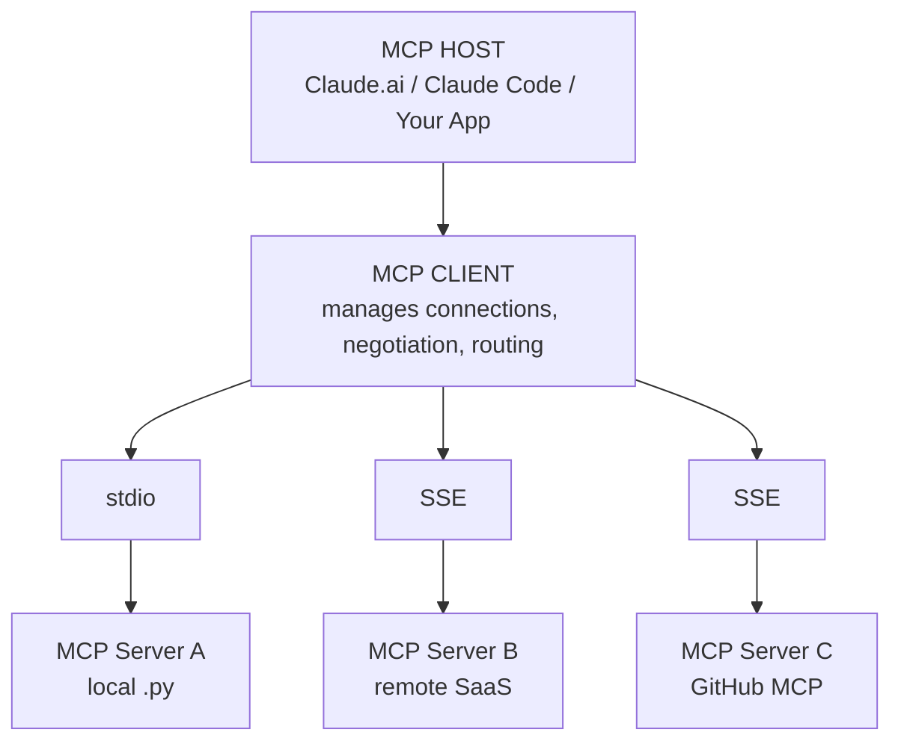

# Model Context Protocol (MCP) — Complete Reference

Architecture, three primitives, Python SDK, transport layers, security patterns, sampling, roots, and real-world integrations

**Domain 3 — 18% of CCA-F Exam**

**Claude Certified Architect (CCA-F) | Professional Enterprise Architect | May 2026**

## What You Will Master in This Module

- MCP architecture: client, server, host — lifecycle and capability negotiation
- Tools (Claude-controlled), Resources (App-controlled), Prompts (User-controlled)
- Full production MCP server in Python — all three primitives with error handling
- Transport: stdio (local) vs StreamableHTTP (remote) — trade-offs and config
- Sampling: server-initiated LLM calls — architecture and security implications
- Roots: file access control boundaries — production security pattern
- Security checklist: least privilege, input validation, sandboxing, audit logging
- Real-world integrations: Gmail, Google Drive, GitHub, Slack MCP servers
- Production patterns: stateless vs stateful, retry, scaling, MCP Inspector

## 4.1 MCP Architecture & the Three Primitives

The Model Context Protocol is Anthropic's open standard (MIT) for connecting LLMs to external tools and data. The three primitives are the most-tested CCA-F concept because they define who controls each interaction.



### The Controller Distinction — #1 Tested MCP Concept

| Primitive | Control | Description & Behavior | Examples |
|-----------|---------|------------------------|----------|
| **Tools** | Model-controlled | Functions Claude invokes autonomously based on context. CAN have side effects. Claude reads description to decide when. High-risk tools should require user confirmation. | search_db, send_email, create_ticket, run_query, write_file, execute_code |
| **Resources** | App-controlled | Read-only data the HOST APPLICATION exposes. Claude does NOT autonomously choose to access resources. Application/user selects which resources to surface. | `file:///docs/policy.md`, `db://schema/customers`, `git://repo/main/src`, `api://reports/monthly` |
| **Prompts** | User-controlled | Pre-built templates users invoke by name. Appear as slash commands (/code-review) or template options in the host application UI. | `/customer-360 {id}`, `/code-review`, `/generate-report {period}`, `/debug-error {msg}` |

## 4.2 Production MCP Server — Python SDK

```python
from mcp.server import Server
from mcp.server.stdio import stdio_server
from mcp.types import Tool, Resource, Prompt, TextContent, GetPromptResult, PromptMessage
import asyncio, json, logging

server = Server('enterprise-crm', version='2.0.0')
logger = logging.getLogger(__name__)

# TOOLS (Claude decides when to call)

@server.list_tools()
async def list_tools():
    return [Tool(
        name='search_customers',
        description='''
Search CRM by name, email, or company.
USE WHEN: finding contact info, purchase history, account status.
DO NOT USE FOR: creating/updating records.
Returns: up to 10 matching records with relevance scores.
''',
        inputSchema={
            'type':'object',
            'properties':{
                'query':{'type':'string'},
                'limit':{'type':'integer','default':5}
            },
            'required':['query']
        }
    )]

@server.call_tool()
async def call_tool(name: str, arguments: dict):
    try:
        if name == 'search_customers':
            q = str(arguments.get('query',''))[:200]  # Sanitize input
            results = await crm.search(q, arguments.get('limit',5))
            logger.info(f'search_customers: {len(results)} results')
            return [TextContent(type='text', text=json.dumps(results, indent=2))]
        return [TextContent(type='text', text=f'Unknown tool: {name}', isError=True)]
    except Exception as e:
        logger.error(f'Tool {name} failed: {e}', exc_info=True)
        return [TextContent(type='text', text='Internal error.', isError=True)]

# RESOURCES (Application controls what's exposed)

@server.list_resources()
async def list_resources():
    return [
        Resource(uri='crm://schema/v2', name='CRM Schema', mimeType='application/json'),
        Resource(uri='crm://policies/sla', name='SLA Policy', mimeType='text/markdown'),
    ]

@server.read_resource()
async def read_resource(uri: str) -> str:
    if uri == 'crm://schema/v2':
        return json.dumps(CRM_SCHEMA)
    if uri == 'crm://policies/sla':
        return SLA_POLICY_MARKDOWN
    raise ValueError(f'Unknown URI: {uri}')

# PROMPTS (User explicitly invokes by name)

@server.list_prompts()
async def list_prompts():
    return [Prompt(
        name='customer-360',
        description='Full customer 360-degree view',
        arguments=[{'name':'customer_id','required':True}]
    )]

@server.get_prompt()
async def get_prompt(name: str, arguments: dict) -> GetPromptResult:
    if name == 'customer-360':
        cid = arguments.get('customer_id','unknown')
        return GetPromptResult(messages=[PromptMessage(
            role='user',
            content=TextContent(
                type='text',
                text=f'Using search_customers + crm://schema/v2, give a 360 view of customer {cid}.'
            )
        )])

if __name__ == '__main__':
    asyncio.run(stdio_server(server))
```

## 4.3 Transport, Security & Production Patterns

| Feature | stdio | StreamableHTTP/SSE |
|---------|-------|-------------------|
| **Deployment** | Local — same machine | Remote — any network host |
| **Authentication** | Process-level (none needed) | API keys / OAuth / JWT — REQUIRED |
| **Network** | OS pipes — zero exposure | HTTP + TLS — network exposed |
| **Scaling** | Single process | Horizontal behind load balancer |
| **Best for** | Dev tools, local scripts, Claude Code | Production SaaS, team-shared, cloud |
| **Claude Code config** | type:stdio, command:python srv.py | type:sse, url:https://mcp.company.com/v1 |

### Security Checklist — Enterprise MCP Deployment

| Control | Implementation |
|---------|-----------------|
| **Least privilege** | Each server gets only permissions it needs. File server: only declared root paths. DB server: read-only role only. |
| **Input validation** | Validate and sanitize ALL tool arguments. Use length limits, type checks, and allow-lists. Treat arguments as untrusted. |
| **Path traversal** | Resolve paths with os.path.realpath(). Verify within declared Roots before any file operation. Reject paths outside. |
| **SQL injection** | Always use parameterized queries. Never concatenate user arguments into SQL strings. |
| **Sandboxing** | Run servers in containers: no internet access (unless needed), read-only rootfs, CPU/memory limits. |
| **Audit logging** | Log every tool call: timestamp, server, tool, argument hashes, result status, duration. Send to SIEM. |
| **Prompt injection** | Treat tool results as untrusted data. Wrap in XML with 'untrusted' label before injecting to Claude context. |
| **Error messages** | Return generic errors to Claude. Log details server-side only. Never expose stack traces or paths. |

**Critical:** MCP servers inherit OS permissions of the launching process. Never run MCP servers as root or with broad filesystem access. A compromised server can read files, call networks, and execute commands at that permission level.
