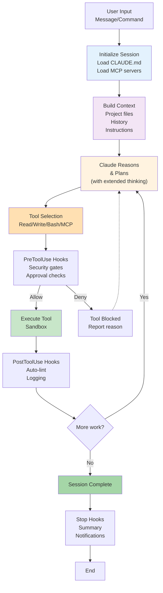

# Claude Code CLI — Zero to Mastery 2026

Complete guide to Claude Code — from installation and first run through advanced hooks, skills, MCP integration, and CI/CD production patterns. Audience: developers new to Claude Code through advanced production users.

## Claude Code Architecture Overview



---

## 1. What Is Claude Code?

Claude Code is Anthropic's official **agentic CLI** — a command-line tool that wraps Claude models in a continuous agent loop, giving the model the ability to read files, write code, run shell commands, call MCP servers, and interact with your development environment autonomously.

### The Agent Loop

User message → Claude reasons and plans → Claude calls tools (read/write/bash/MCP) → Tool results returned → Claude continues reasoning → Loop until task complete or user interrupts → Final response

### What Makes It Different from Claude.ai Chat

| Feature | Claude.ai Chat | Claude Code CLI |
| --- | --- | --- |
| File system access | No | Yes (configurable scope) |
| Shell command execution | No | Yes (with confirmation) |
| MCP server integration | Limited | Full |
| Custom slash commands | No | Yes |
| Hooks (automated reactions) | No | Yes |
| CLAUDE.md instructions | No | Yes |
| Skills system | No | Yes |
| CI/CD integration | No | Yes |
| IDE extensions | No | VS Code, JetBrains |

---

## 2. Prerequisites and Installation

### Prerequisites

- **Node.js** 18 or higher
- **npm** or compatible package manager
- A **Claude subscription** (Pro or higher) or a valid **Anthropic API key**
- Git (recommended, required for many workflows)

### Installation

```bash
npm install -g @anthropic-ai/claude-code
```

Verify the installation:

```bash
claude --version
claude /doctor        # Runs environment diagnostics
```

### Authentication

**Claude Subscription (Recommended):**
```bash
claude /login
# Opens browser for OAuth login — no API key needed
```

**API Key:**
```bash
export ANTHROPIC_API_KEY="sk-ant-..."
claude
```

**AWS Bedrock:**
```bash
export ANTHROPIC_API_KEY="unused"
export CLAUDE_CODE_USE_BEDROCK=1
export AWS_REGION="us-east-1"
# Ensure AWS credentials are configured via standard AWS methods
claude
```

**Google Vertex AI:**
```bash
export ANTHROPIC_API_KEY="unused"
export CLAUDE_CODE_USE_VERTEX=1
export CLOUD_ML_REGION="us-east5"
export ANTHROPIC_VERTEX_PROJECT_ID="your-project-id"
claude
```

---

## 3. First Run Walkthrough

```bash
# Navigate to your project directory
cd /path/to/your/project

# Start Claude Code
claude

# Claude Code starts an interactive session
# Try your first message:
> What files are in this project?

# Claude will use its file tools to explore and report back.
# Try a coding task:
> Explain what the main.py file does and suggest 3 improvements.

# Claude reads main.py, analyzes it, and responds.
# Approve or reject suggested changes interactively.
```

### Key Interactive Patterns

| Action | What to Do |
| --- | --- |
| Accept a proposed change | Press `y` or `Enter` when prompted |
| Reject a proposed change | Press `n` |
| Interrupt the agent | Press `Ctrl+C` |
| Exit Claude Code | Type `/quit` or press `Ctrl+D` |
| See available commands | Type `/help` |
| Check session cost | Type `/cost` |

---

## 4. Core Workflow: Ask → Plan → Edit → Verify

Claude Code is most effective when you treat it as a collaborative pair programmer operating in a structured loop:

### Step 1: Ask

Describe what you want clearly. Provide context about constraints, preferred patterns, and what success looks like:

```
> Refactor the DataProcessor class in src/processor.py to use a pipeline
  pattern. It must remain backward compatible with existing callers.
  Use our existing logging infrastructure (see utils/logger.py).
```

### Step 2: Plan

Claude will often produce a plan before writing code. Review it and course-correct before allowing execution:

```
> Before making any changes, show me your plan and list all files you intend
  to modify. Wait for my approval before proceeding.
```

### Step 3: Edit

Claude proposes and applies changes. Each file write is shown with a diff. You can approve or reject per-file.

### Step 4: Verify

Always verify changes work before moving on:

```
> Run the test suite for the processor module. Fix any failures you caused.
```

### Effective Prompting Patterns for Claude Code

```
# Scope the task explicitly
> Fix only the authentication bug in src/auth/jwt.py — do not touch other files.

# Provide constraints up front
> Implement the caching layer. Use Redis only — no in-memory fallback.
  Match the existing pattern in src/cache/session_cache.py.

# Request a plan first for large tasks
> I want to migrate our ORM from SQLAlchemy to SQLModel.
  First, analyze the scope: list all affected files and estimate risk.
  Do not make any changes yet.
```

---

## 5. CLAUDE.md: Project Instructions

### What Is CLAUDE.md?

`CLAUDE.md` is a Markdown file that Claude Code reads automatically at the start of every session. It provides project-specific context, constraints, conventions, and instructions that persist without re-stating them in every prompt.

### CLAUDE.md Hierarchy

Claude Code reads `CLAUDE.md` files from multiple locations and merges them in order:

| Location | Purpose | Scope |
| --- | --- | --- |
| `~/.claude/CLAUDE.md` | User-level preferences, personal style | All projects |
| Parent directories (walking up from CWD) | Monorepo / workspace-level instructions | All sub-projects |
| `<project-root>/CLAUDE.md` | Project-specific conventions | Current project |
| `<project-root>/.claude/CLAUDE.md` | (alternative location, same behavior) | Current project |

More specific files override more general ones for conflicting instructions.

### Writing Effective CLAUDE.md Files

A high-quality `CLAUDE.md` covers:

```markdown
# CLAUDE.md

## Project Overview
Brief description of what this project does and its tech stack.

## Build & Test Commands
- Build: `npm run build`
- Test: `pytest tests/ -x`
- Lint: `ruff check . && mypy src/`
- Format: `black src/`

## Code Conventions
- Python: type hints required on all public functions
- Error handling: always use custom exceptions from src/errors.py
- Logging: use structlog, never print()
- Tests: every public function must have at least one test

## Architecture Constraints
- Do not introduce new dependencies without asking first
- The API layer (src/api/) must not import from src/data/ directly — go through src/services/
- All database access must go through the repository pattern in src/repositories/

## File Structure
- src/api/          — FastAPI route handlers
- src/services/     — Business logic
- src/repositories/ — Database access layer
- src/models/       — Pydantic models and DB schemas
- tests/            — Mirror structure of src/

## What NOT to Do
- Never commit secrets or API keys
- Never use `os.system()` — use `subprocess` with explicit args
- Never catch bare `Exception` — catch specific exception types
```

### CLAUDE.md Best Practices

- Keep it concise — Claude reads it every session; bloated files dilute signal
- Use exact command strings for build, test, and lint
- Describe architecture boundaries explicitly (what can import what)
- List the antipatterns most common in your codebase
- Update it when conventions change — stale CLAUDE.md is misleading

---

## 6. Slash Commands Reference

Slash commands are Claude Code's built-in interactive commands. All verified commands as of 2026:

| Command | Purpose |
| --- | --- |
| `/help` | Show all available commands and their descriptions |
| `/clear` | Clear the current conversation context |
| `/compact` | Summarize and compress the conversation to reduce token usage |
| `/config` | Open the Claude Code configuration settings |
| `/cost` | Show token usage and estimated cost for the current session |
| `/doctor` | Run environment diagnostics (auth, connectivity, config) |
| `/init` | Generate a `CLAUDE.md` file for the current project |
| `/login` | Authenticate with Anthropic (opens browser OAuth flow) |
| `/logout` | Revoke current authentication |
| `/memory` | Open and edit the persistent memory file (`MEMORY.md`) |
| `/mcp` | Manage MCP server connections — list, add, remove |
| `/model` | Switch the active model for the current session |
| `/pr-comments` | Fetch and display comments from the current pull request |
| `/quit` | Exit Claude Code |
| `/release-notes` | Show what changed in the current Claude Code version |
| `/review` | Request a code review of recent changes |
| `/status` | Show current session status (auth, model, tokens used) |
| `/terminal-setup` | Configure terminal integration settings |
| `/vim` | Toggle Vim keybindings mode |

---

## 7. Memory System

### How Memory Works

Claude Code maintains persistent memory across sessions via the **MEMORY.md** file located at `~/.claude/MEMORY.md`. This persists information between separate `claude` invocations, unlike the in-session context which is cleared between sessions.

### Using /memory

```bash
# Open the memory file for viewing and editing
/memory
```

Claude Code opens your `MEMORY.md` in your configured editor. You can:

- Add facts you want Claude to remember across sessions
- Remove outdated information
- Structure preferences in any Markdown format

### What to Store in Memory

Good candidates for persistent memory:

```markdown
# ~/.claude/MEMORY.md

## My Preferences
- Prefer functional patterns over OOP when both work
- Always add type hints to Python
- Use descriptive variable names over abbreviations
- Test-driven approach: write tests before implementation

## Frequent Projects
- ~/projects/api-server: FastAPI, PostgreSQL, Redis. Main branch: main.
- ~/projects/ml-pipeline: PyTorch, DVC, Weights & Biases. Main branch: develop.

## Common Commands I Forget
- Deploy staging: `make deploy-staging ENV=staging`
- Run integration tests: `pytest tests/integration -m "not slow"`

## Team Context
- PR reviews go to #engineering-review Slack channel
- Release cadence: Tuesdays and Thursdays
```

### What Not to Store

- Secrets, API keys, or credentials — never
- Project-specific conventions — put those in the project's CLAUDE.md instead
- Task-specific instructions — state those in the session

---

**This is Part 1 of 2. [Continue with Part 2 →](pathname:///archon/agentic-systems/coding-tools/parts/33-claude-code-complete-2026-part2) for hooks, MCP integration, custom commands, skills, permissions, CI/CD, IDE extensions, token optimization, cost controls, guardrails, and troubleshooting.**
