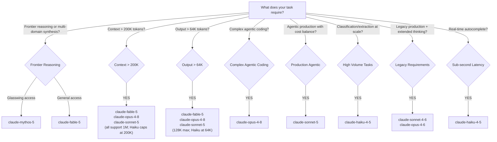

# Claude Models 2026 — Complete Reference

Single source of truth. All other pages in this docs site link here for model IDs, pricing, context limits, and platform availability. Do not duplicate this information elsewhere.

---

## 1. Model Family Overview

### Current Models

| Model | API Alias | Tier | GA Date | Context | Max Output | Input $/1M | Output $/1M | Best For |
| --- | --- | --- | --- | --- | --- | --- | --- | --- |
| Claude Fable 5 | `claude-fable-5` | Frontier | Jun 9, 2026 | 1M tokens | 128K tokens | $10.00 | $50.00 | Long-horizon agents, frontier reasoning, multi-domain synthesis |
| Claude Mythos 5 | `claude-mythos-5` | Frontier (Glasswing) | Jun 9, 2026 | 1M tokens | 128K tokens | $10.00 | $50.00 | Same as Fable 5; Project Glasswing access only |
| Claude Opus 4.8 | `claude-opus-4-8` | High-Capability | 2025 | 1M tokens | 128K tokens | $5.00 | $25.00 | Complex agentic coding, enterprise work, deep reasoning |
| Claude Sonnet 5 | `claude-sonnet-5` | Advanced | Jun 30, 2026 | 1M tokens | 128K tokens | $3.00† | $15.00† | Best speed/intelligence balance; agentic and production workloads |
| Claude Haiku 4.5 | `claude-haiku-4-5` | Speed | 2025 | 200K tokens | 64K tokens | $1.00 | $5.00 | Classification, extraction, real-time apps |

† Introductory pricing through **August 31, 2026**: $2.00 input / $10.00 output. Standard pricing from September 1, 2026: $3.00 / $15.00.

### Legacy Models (Still Available)

| Model | API Alias | Context | Max Output | Input $/1M | Thinking |
| --- | --- | --- | --- | --- | --- |
| Claude Opus 4.7 | `claude-opus-4-7` | 1M tokens | 128K tokens | $5.00/$25.00 | Adaptive |
| Claude Opus 4.6 | `claude-opus-4-6` | 1M tokens | 128K tokens | $5.00/$25.00 | Both (adaptive + extended) |
| Claude Sonnet 4.6 | `claude-sonnet-4-6` | 1M tokens | 128K tokens | $3.00/$15.00 | Both (adaptive + extended) |

**Model ID aliases:** Use the bare alias shown above (e.g., `claude-haiku-4-5`, `claude-sonnet-5`). Never append date suffixes in code — aliases always resolve to the correct pinned version. The full pinned ID for Haiku 4.5 is `claude-haiku-4-5-20251001`; everywhere else use the alias.

**300K output beta:** Claude Opus 4.8, Opus 4.7, Opus 4.6, Sonnet 5, and Sonnet 4.6 support up to 300K output tokens on the Batch API using the `output-300k-2026-03-24` beta header.

---

## 2. Claude Fable 5 Deep-Dive

### Overview

Claude Fable 5 (`claude-fable-5`) is Anthropic's most capable widely released model, reaching general availability on **June 9, 2026**. It is designed for long-running autonomous agents, complex multi-domain synthesis, and tasks requiring the highest possible intelligence ceiling.

**Specs:** 1M context · 128K output · $10.00/$50.00 per MTok · Adaptive thinking (always on)

### Key Capabilities

- **Adaptive Thinking always on** — Fable 5 reasons on every request. You do not enable or disable thinking explicitly; thinking depth is controlled via `output_config.effort`.
- **1M token context** — fits entire large codebases, book-length documents, long conversation histories.
- **128K token output** — long-form documents, full code files, detailed reports in a single completion.
- **New tokenizer** — same tokenizer as Opus 4.7/4.8 and Sonnet 5. Migrating from Opus 4.6, Sonnet 4.6, or Haiku 4.5 requires re-baselining token counts (~30% increase for the same text).
- **`refusal` stop reason** — safety classifiers may decline a request (HTTP 200, `stop_reason: "refusal"`, empty or partial content). Pre-output refusals are not billed.
- **30-day data retention required** — Fable 5 is not available under zero-retention configurations.

### Adaptive Thinking API — Effort Control

Do NOT pass `budget_tokens` to Fable 5. Passing `{"type": "disabled"}` or `{"type": "enabled", "budget_tokens": N}` to Fable 5 returns **HTTP 400**. Use `output_config.effort` to control thinking depth instead.

```python
import anthropic

client = anthropic.Anthropic()

# Correct: omit thinking param (or use {"type": "adaptive"}); use effort for depth control
response = client.messages.create(
    model="claude-fable-5",
    max_tokens=8192,
    output_config={"effort": "high"},  # "low" | "medium" | "high" | "xhigh" | "max"
    # Recommended: enable server-side fallback to handle refusal stop reason
    betas=["server-side-fallback-2026-06-01"],
    fallbacks=[{"model": "claude-opus-4-8"}],
    messages=[{"role": "user", "content": "Analyze this architecture and propose improvements..."}]
)

# Always check stop_reason before reading content
if response.stop_reason == "refusal":
    print(f"Request declined. Served by: {response.model}")
else:
    for block in response.content:
        if block.type == "thinking":
            # Raw chain-of-thought is never returned. thinking.thinking is empty by default.
            # Pass output_config={"thinking": {"display": "summarized"}} to get a readable summary.
            print(f"[Thinking summary]: {block.thinking}")
        else:
            print(f"[Answer]: {block.text}")
```

### Refusal Handling and Fallbacks

Fable 5 can return `stop_reason: "refusal"`. Anthropic recommends enabling server-side fallbacks:

```python
response = client.messages.create(
    model="claude-fable-5",
    max_tokens=4096,
    output_config={"effort": "medium"},
    betas=["server-side-fallback-2026-06-01"],
    fallbacks=[{"model": "claude-opus-4-8"}],
    messages=[{"role": "user", "content": user_message}]
)
# On refusal, the request is transparently re-served by Opus 4.8.
# Check response.model to see which model actually served the response.
```

### When to Use Fable 5

- Tasks requiring **multi-domain synthesis** (legal + technical + financial in one pass)
- Documents exceeding the range where Opus 4.8 quality is sufficient
- Output quality directly drives business value (customer-facing reports, critical code)
- Long-horizon agentic tasks spanning many minutes
- Accuracy is more important than cost

**Cost guardrail:** At $10/$50/M, Fable 5 costs 2× Opus 4.8 on input and output. Route only tasks that genuinely require frontier capability. See Section 14 for routing patterns.

---

## 3. Claude Sonnet 5 Deep-Dive

### Overview

Claude Sonnet 5 (`claude-sonnet-5`) reached general availability on **June 30, 2026** as Anthropic's flagship **balanced model** — the best combination of speed and intelligence at this tier. It is designed for agentic workflows, coding, tool use, and production workloads where Opus-tier cost is not justified.

**Specs:** 1M context · 128K output · Adaptive thinking · $3/$15 standard ($2/$10 intro through Aug 31 2026)

### Key Capabilities

- **Most agentic Sonnet yet** — multi-step planning, browser/terminal operations, tool orchestration, autonomous execution without explicit prompting
- **Adaptive thinking on by default** — Sonnet 5 reasons adaptively; effort defaults to `high` on the API and Claude Code
- **1M context / 128K output** — same ceiling as Fable 5
- **New tokenizer** — same tokenizer as Opus 4.7/4.8 and Fable 5; re-baseline token counts when migrating from Sonnet 4.6 or older

### Pricing Window

**Introductory pricing** through **August 31, 2026**: $2.00 input / $10.00 output per million tokens. From **September 1, 2026**: $3.00 input / $15.00 output per million tokens (same as Sonnet 4.6).

### Thinking API for Sonnet 5

Sonnet 5 uses the same adaptive thinking model as Opus 4.8. Control depth via `effort`:

```python
import anthropic

client = anthropic.Anthropic()

response = client.messages.create(
    model="claude-sonnet-5",
    max_tokens=4096,
    output_config={"effort": "high"},  # defaults to "high" on Claude API; set explicitly to change
    messages=[{"role": "user", "content": "Build a multi-step plan for this architecture migration..."}]
)
print(response.content[0].text)
```

### Validated Agentic Capabilities

| Task Type | Capability |
| --- | --- |
| Browser automation | Navigate, click, fill forms, extract structured page data |
| Terminal operations | Run shell commands, parse output, iterate on results |
| Multi-step code generation | Plan → implement → test → fix loop autonomously |
| Tool orchestration | Parallel and sequential tool calls within a single session |
| Long document workflows | Ingest → analyze → synthesize → structured output |
| Agent orchestration | Act as orchestrator directing sub-agents |

### When to Use Sonnet 5

- **Primary model for new agentic pipelines** — Claude Code CLI, Agent SDK orchestrators, browser automation
- Production workloads where Fable 5 quality is not required
- High-throughput pipelines with cost sensitivity (especially during introductory pricing)
- Tasks requiring adaptive reasoning with 1M context and 128K output
- Cases where Haiku quality is insufficient but Opus cost is not justified

---

## 4. Claude Opus 4.8

### Overview

Claude Opus 4.8 (`claude-opus-4-8`) is Anthropic's recommended model for **complex agentic coding and enterprise work**. It provides high-capability reasoning with 1M context, 128K output, and adaptive thinking at the $5/$25 per MTok tier.

**Specs:** 1M context · 128K output · $5.00/$25.00 per MTok · Adaptive thinking · Effort defaults to `high`

### Key Use Cases

| Domain | Example Task |
| --- | --- |
| Complex coding | Refactoring large codebases, architecture analysis, multi-file generation |
| Agentic engineering | Orchestrating sub-agents, long-horizon code tasks |
| Deep reasoning | Multi-hop inference over long technical documents |
| Long documents | 100K–1M token contract or research paper analysis |
| Enterprise work | Structured data extraction, report generation at scale |

### Thinking API for Opus 4.8

Opus 4.8 uses adaptive thinking. The `effort` parameter defaults to `high`:

```python
import anthropic

client = anthropic.Anthropic()

response = client.messages.create(
    model="claude-opus-4-8",
    max_tokens=8192,
    output_config={"effort": "high"},  # "low" | "medium" | "high" | "xhigh" | "max"
    messages=[{"role": "user", "content": "Review this 50-file Python codebase for security vulnerabilities..."}]
)

for block in response.content:
    if block.type == "thinking":
        print(f"[Reasoning]: {block.thinking}")
    else:
        print(f"[Answer]: {block.text}")
```

**`budget_tokens` on Opus 4.8:** Like Fable 5, Opus 4.8 does NOT support `budget_tokens`. Use `output_config.effort` instead. Extended thinking (`{"type": "enabled", "budget_tokens": N}`) is supported only on Opus 4.6, Sonnet 4.6, Haiku 4.5, and older models.

### When to Use Opus 4.8 vs. Fable 5

| Factor | Use Opus 4.8 | Use Fable 5 |
| --- | --- | --- |
| Cost sensitivity | Moderate ($5/$25/M) | Higher cost justified by quality ($10/$50/M) |
| Refusal risk | Standard stop reasons | Add fallback logic for `refusal` stop reason |
| Retention policy | Standard or zero-retention | 30-day retention required |
| Task complexity | Complex coding, enterprise work | Frontier reasoning, multi-domain synthesis |
| Both support | 1M context, 128K output, adaptive thinking | |

### Legacy Opus Models

**Opus 4.7** (`claude-opus-4-7`) — same specs as Opus 4.8; introduced the new tokenizer and `xhigh` effort level. Adaptive thinking only; `budget_tokens` removed. Still available as a legacy model.

**Opus 4.6** (`claude-opus-4-6`) — 1M context, 128K output, $5/$25. Supports **both** extended thinking (old `budget_tokens` style) and adaptive thinking. Uses the pre-Opus-4.7 tokenizer.

---

## 5. Claude Sonnet 4.6

### Overview

Claude Sonnet 4.6 (`claude-sonnet-4-6`) is a **legacy model** that remains widely used in production. With the release of Sonnet 5, new agentic and production workloads should prefer Sonnet 5. Sonnet 4.6 remains fully supported with no announced deprecation.

**Specs:** 1M context · 128K output · $3.00/$15.00 per MTok · Both adaptive and extended thinking

### When to Keep Sonnet 4.6

- Existing pipelines with proven stability and no business need to upgrade
- Systems requiring extended thinking (`budget_tokens`) style rather than adaptive `effort`
- Cost parity with Sonnet 5 standard pricing (same $3/$15/M from Sep 1 2026)
- Applications validated on Sonnet 4.6 with no tokenizer-migration budget

### Migration Path to Sonnet 5

When planning migration from Sonnet 4.6 to Sonnet 5:

1. **Tokenizer change** — Sonnet 5 uses the new tokenizer; expect ~30% more tokens for the same text
2. **Thinking API shift** — Sonnet 5 uses adaptive thinking via `effort`; extended thinking (`budget_tokens`) is not available
3. **Output format** — Sonnet 5 may structure responses differently; validate with regression tests
4. **Context and output headroom** — both support 1M context and 128K output; no capacity change needed
5. **Pricing** — Sonnet 5 is cheaper through August 31, 2026; standard pricing is identical from Sep 1

```python
import anthropic

client = anthropic.Anthropic()

production_prompt = "Your actual production prompt here..."

# Check tokenizer impact when migrating from Sonnet 4.6 to Sonnet 5
for model in ["claude-sonnet-4-6", "claude-sonnet-5"]:
    count = client.messages.count_tokens(
        model=model,
        messages=[{"role": "user", "content": production_prompt}]
    )
    print(f"{model}: {count.input_tokens:,} tokens")
# Sonnet 5 will report roughly 30% more tokens for the same text
```

---

## 6. Claude Haiku 4.5

### Overview

Claude Haiku 4.5 (`claude-haiku-4-5`) is the **speed-optimized tier** — the fastest response times at the lowest cost per token. Purpose-built for tasks where latency and throughput are the primary constraints.

**Specs:** 200K context · 64K output · $1.00/$5.00 per MTok · Extended thinking (not adaptive)

**Model ID:** Use the alias `claude-haiku-4-5`. The full pinned ID is `claude-haiku-4-5-20251001`, but always use the bare alias in code and configuration.

**Thinking API for Haiku 4.5:** Haiku 4.5 supports **extended thinking** (`{"type": "enabled", "budget_tokens": N}`) but does **not** support adaptive thinking. This is the opposite of Fable 5 and Opus 4.8, which only support adaptive thinking.

### Haiku 4.5 Best Use Cases

| Use Case | Why Haiku Fits |
| --- | --- |
| Text classification | Binary or multi-class decisions at scale |
| Entity extraction | Named entity recognition from structured text |
| Intent detection | User query routing in chatbots |
| Short summarization | Abstractive summaries of known-small documents |
| Guardrail checks | Pre/post filter on user inputs or model outputs |
| Retrieval re-ranking | Scoring passage relevance at high volume |
| Autocomplete / suggestions | Low-latency code or text suggestion |
| Translation (simple) | Known-domain text translation at scale |
| Sentiment analysis | Opinion mining at large scale |

### Extended Thinking with Haiku 4.5

```python
import anthropic

client = anthropic.Anthropic()

# Haiku 4.5 uses the OLD extended thinking API (budget_tokens)
response = client.messages.create(
    model="claude-haiku-4-5",
    max_tokens=4096,
    thinking={"type": "enabled", "budget_tokens": 2000},
    messages=[{"role": "user", "content": "Classify this text and explain your reasoning..."}]
)

for block in response.content:
    if block.type == "thinking":
        print(f"[Thinking]: {block.thinking}")
    else:
        print(f"[Answer]: {block.text}")
```

### Haiku Cost at Scale

At 10M daily classifications (500 input + 100 output tokens per request):

| Model | Cost/Request | Daily Cost | Monthly Cost |
| --- | --- | --- | --- |
| `claude-haiku-4-5` | ~$0.0010 | ~$10,000 | ~$300,000 |
| `claude-sonnet-4-6` | ~$0.0030 | ~$30,000 | ~$900,000 |
| `claude-sonnet-5` (intro) | ~$0.0020 | ~$20,000 | ~$600,000 |
| `claude-sonnet-5` (standard) | ~$0.0030 | ~$30,000 | ~$900,000 |
| `claude-opus-4-8` | ~$0.0075 | ~$75,000 | ~$2,250,000 |
| `claude-fable-5` | ~$0.0100 | ~$100,000 | ~$3,000,000 |

*(Input: 500 tokens; Output: 100 tokens. Haiku remains 3–10× cheaper than higher tiers.)*

**Always benchmark Haiku first.** For many classification and extraction tasks, Haiku quality is indistinguishable from Sonnet.

---

## 7. Model Selection Decision Tree



### Quick Reference Card

| Task | Primary Choice | Fallback |
| --- | --- | --- |
| Novel research synthesis | `claude-fable-5` | `claude-opus-4-8` |
| Complex agentic coding | `claude-opus-4-8` | `claude-sonnet-5` |
| Agentic automation (production) | `claude-sonnet-5` | `claude-opus-4-8` |
| Code review (large PR) | `claude-opus-4-8` | `claude-sonnet-5` |
| Code review (small PR) | `claude-sonnet-5` | `claude-haiku-4-5` |
| Text classification | `claude-haiku-4-5` | `claude-sonnet-5` |
| Customer-facing chat | `claude-sonnet-5` | `claude-sonnet-4-6` |
| Long document Q&A (> 200K) | `claude-fable-5` | `claude-opus-4-8` |
| Real-time autocomplete | `claude-haiku-4-5` | — |
| Bulk batch processing | `claude-haiku-4-5` (batch API) | `claude-sonnet-5` (batch API) |
| Safety / guardrail filter | `claude-haiku-4-5` | `claude-sonnet-5` |
| Project Glasswing workloads | `claude-mythos-5` | `claude-fable-5` |

---

## 8. Pricing Reference

### Standard API Pricing

| Model | Input $/1M | Output $/1M | Cache Write $/1M | Cache Read $/1M |
| --- | --- | --- | --- | --- |
| `claude-fable-5` | $10.00 | $50.00 | $12.50 | $1.00 |
| `claude-mythos-5` | $10.00 | $50.00 | $12.50 | $1.00 |
| `claude-opus-4-8` | $5.00 | $25.00 | $6.25 | $0.50 |
| `claude-opus-4-7` | $5.00 | $25.00 | $6.25 | $0.50 |
| `claude-opus-4-6` | $5.00 | $25.00 | $6.25 | $0.50 |
| `claude-sonnet-5` (intro, through Aug 31, 2026) | $2.00 | $10.00 | $2.50 | $0.20 |
| `claude-sonnet-5` (standard, from Sep 1, 2026) | $3.00 | $15.00 | $3.75 | $0.30 |
| `claude-sonnet-4-6` | $3.00 | $15.00 | $3.75 | $0.30 |
| `claude-haiku-4-5` | $1.00 | $5.00 | $1.25 | $0.10 |

### Batch API Pricing (50% Discount)

| Model | Batch Input $/1M | Batch Output $/1M |
| --- | --- | --- |
| `claude-fable-5` | $5.00 | $25.00 |
| `claude-mythos-5` | $5.00 | $25.00 |
| `claude-opus-4-8` | $2.50 | $12.50 |
| `claude-sonnet-5` (intro) | $1.00 | $5.00 |
| `claude-sonnet-5` (standard) | $1.50 | $7.50 |
| `claude-sonnet-4-6` | $1.50 | $7.50 |
| `claude-haiku-4-5` | $0.50 | $2.50 |

### Prompt Caching Pricing Rules

- **Cache write price** = standard input price × 1.25 (writing to cache costs slightly more)
- **Cache read price** = approximately 10% of standard input price
- **Minimum cacheable block** = 1,024 tokens
- **Cache TTL** = 5 minutes (ephemeral cache type)
- **Maximum cache breakpoints** = 4 per request

### Additional Billing Rules

- **Fable 5 / Mythos 5 refusals** with `stop_reason: "refusal"` and zero output tokens are **not billed**
- **Thinking tokens** (content in `thinking` blocks) **are billed** as output tokens on all models
- **Cache misses** after TTL expiry are billed at full standard input price

---

**This is Part 1 of 2. [Continue with Part 2 →](pathname:///archon/agentic-systems/coding-tools/parts/35-claude-models-2026-part2) for context window guide, platform availability, migration strategy, deprecation timeline, token counting, cost optimization, rate limits, best practices, and antipatterns.**
