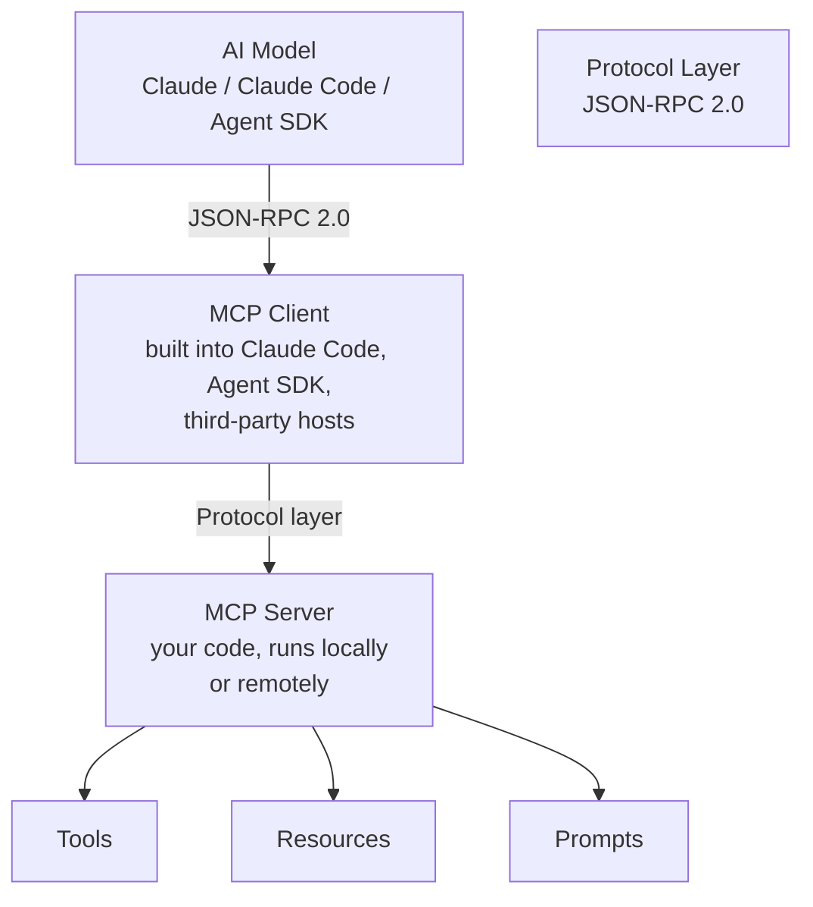

# MCP Deep Guide — Server Development & Enterprise Integration

This is the single source of truth for the Model Context Protocol (MCP) across this documentation site. It covers the protocol architecture, all three primitives, building production servers in Python and TypeScript, the 2026 protocol evolution, enterprise governance, security, and testing.

For Claude Agent SDK usage of MCP as a client, see [Claude Agent SDK — Production Reference](pathname:///archon/agentic-systems/coding-tools/30-claude-agent-sdk-production). For enterprise cloud deployment of MCP at scale, see [Claude Enterprise Deployment 2026](pathname:///archon/agentic-systems/coding-tools/34-claude-enterprise-2026).

---

## 1. What Is MCP

### Protocol Overview

The **Model Context Protocol (MCP)** is an open standard published by Anthropic (November 2024) that defines how AI models communicate with external tools, data sources, and services. It creates a reusable, interoperable interface layer so that integrations built once work with any MCP-compatible client — Claude, Claude Code, the Agent SDK, or third-party AI systems.

MCP solves a fragmentation problem: before MCP, every AI tool integration was a bespoke adapter. With MCP, you build a server once and any MCP client can use it.

### JSON-RPC 2.0 Foundation

MCP messages are encoded as **JSON-RPC 2.0** over a transport layer (stdio or HTTP). Every interaction is a request/response pair with a numeric `id`, a `method` string, and a `params` object.

```json
// Client → Server: invoke a tool
{
  "jsonrpc": "2.0",
  "id": 1,
  "method": "tools/call",
  "params": {
    "name": "query_database",
    "arguments": { "sql": "SELECT count(*) FROM users" },
    "_meta": {
      "traceparent": "00-4bf92f3577b34da6a3ce929d0e0e4736-00f067aa0ba902b7-01"
    }
  }
}

// Server → Client: tool result
{
  "jsonrpc": "2.0",
  "id": 1,
  "result": {
    "content": [
      { "type": "text", "text": "{\"count\": 42317}" }
    ]
  }
}
```

### Client-Server Model

The MCP architecture follows a layered JSON-RPC 2.0 model over stdio or HTTP transport:



The MCP Server is the implementation you build. It registers tools, resources, and prompts and responds to the client's JSON-RPC requests. It can connect to databases, APIs, file systems, or any other backend.

### Why MCP vs Custom Tool Use

| Dimension | Custom Tool Use | MCP |
| ----------- | ----------------- | ----- |
| Portability | Per-application wiring | Works with any MCP client |
| Discovery | Static tool list | Dynamic at runtime via `tools/list` |
| Ecosystem | Build everything | 19,831+ public servers (July 2026) |
| Protocol standard | None | Open spec, multiple SDKs |
| Enterprise governance | Per-org config | Okta/Entra ID provisioning, central allow-lists |
| Caching | Manual | Built-in `ttlMs`/`cacheScope` (2026 RC) |
| Tracing | Manual | W3C Trace Context in `_meta` (2026 RC) |

---

## 2. The Three Primitives

MCP defines exactly three primitive types. Everything in the protocol is built from these.

### Primitive 1: Tools — Executable Functions

**Tools** are functions the model can call. They are the primary mechanism for AI-driven action. Tools are synchronous from the model's perspective: the client calls the tool, waits for the result, and the model processes it.

```json
{
  "name": "create_ticket",
  "description": "Create a Jira ticket. Use when the user asks to file a bug, track a task, or log an issue.",
  "inputSchema": {
    "type": "object",
    "properties": {
      "title": {
        "type": "string",
        "description": "A brief, descriptive title for the ticket"
      },
      "description": {
        "type": "string",
        "description": "Full issue description including steps to reproduce if a bug"
      },
      "priority": {
        "type": "string",
        "enum": ["low", "medium", "high", "critical"],
        "description": "Issue priority level"
      },
      "project_key": {
        "type": "string",
        "description": "Jira project key, e.g. 'ENG' or 'INFRA'"
      }
    },
    "required": ["title", "description", "project_key"]
  }
}
```

**Tool design rules:**

- The `description` field must explain **when to use the tool**, not just what it does. The model reads this to decide whether to call it.
- Parameter `description` fields are used by the model to fill argument values — make them precise.
- Return structured JSON so the model can reason over the result rather than parsing prose.
- Idempotent tools (read-only, safe to retry) must be clearly distinguished from destructive ones.
- Keep tool names as verbs: `create_ticket`, `query_database`, `send_email` — not `ticket`, `database`, `email`.

### Primitive 2: Resources — Read-Only Data

**Resources** are URI-addressable data sources the model can read. They are intended for pulling data into context, not for taking actions. Resources appear in the model's context window when explicitly included.

```json
{
  "uri": "postgres://analytics/monthly_kpis",
  "name": "Monthly KPIs",
  "description": "Live monthly KPI data: revenue, DAU, churn rate, and NPS from the analytics database",
  "mimeType": "application/json"
}
```

**Resource URI schemes** (by convention):

| Scheme | Example | Typical Content |
| -------- | --------- | ----------------- |
| `file://` | `file:///var/data/schema.sql` | Local files |
| `postgres://` | `postgres://db/table_name` | Database query results |
| `https://` | `https://api.company.com/config` | REST API responses |
| `git://` | `git://repo/main/README.md` | Git repository content |
| Custom | `hr://org-chart` | Any domain-specific data |

**Supported MIME types:**

- `text/plain` — plain text
- `application/json` — structured data
- `text/html` — HTML documents
- `text/markdown` — Markdown
- `image/png`, `image/jpeg` — images (returned as base64)
- `application/pdf` — PDF documents

**Resource templates** allow dynamic URI construction:

```json
{
  "uriTemplate": "postgres://analytics/users/{user_id}/activity",
  "name": "User Activity",
  "description": "Activity log for a specific user ID",
  "mimeType": "application/json"
}
```

### Primitive 3: Prompts — Reusable Templates

**Prompts** are parameterised message templates the model can invoke. They reduce prompt engineering duplication and ensure consistent framing of common tasks across a team or product.

```json
{
  "name": "code_review",
  "description": "Run a structured code review with configurable depth and focus area",
  "arguments": [
    {
      "name": "language",
      "description": "Programming language of the code to review",
      "required": true
    },
    {
      "name": "focus",
      "description": "Review focus: 'security', 'performance', 'style', or 'correctness'",
      "required": false
    },
    {
      "name": "depth",
      "description": "Review depth: 'quick' (5 min) or 'thorough' (full review)",
      "required": false
    }
  ]
}
```

In Claude Code, prompts are invoked as slash commands: `/mcp__<server_name>__<prompt_name>`.

---

## 3. Architecture

### Protocol Lifecycle

The complete MCP handshake and runtime flow follows a four-phase lifecycle:

1. **Initialisation** — client and server exchange capabilities and protocol version
2. **Discovery** — client fetches lists of available tools, resources, and prompts
3. **Runtime Invocation** — client calls tools, reads resources, or gets prompts
4. **Shutdown** — connection closes and server cleans up resources

```
1. Initialisation
   Client → Server: initialize (client capabilities, protocol version)
   Server → Client: initialize result (server capabilities, server info)
   Client → Server: initialized (notification)

2. Discovery
   Client → Server: tools/list
   Server → Client: [list of tool definitions]

   Client → Server: resources/list
   Server → Client: [list of resource definitions]

   Client → Server: prompts/list
   Server → Client: [list of prompt definitions]

3. Runtime Invocation
   Client → Server: tools/call { name, arguments, _meta }
   Server → Client: { content: [...], isError: false }

   Client → Server: resources/read { uri }
   Server → Client: { contents: [{ uri, mimeType, text | blob }] }

   Client → Server: prompts/get { name, arguments }
   Server → Client: { messages: [...] }

4. Shutdown
   Client → Server: (connection close)
   Server: cleanup
```

### Stateless Architecture (2026-07-28 RC)

The MCP 2026-07-28 Release Candidate introduces a **stateless protocol core**. This is the most significant architectural change since the protocol's launch.

**What changed:**

- No sticky sessions — the server must not require session affinity
- Standard HTTP round-robin load balancers work without modification
- The `Mcp-Method` header in every request enables stateless routing
- Server state must be externalised to a shared store (Redis, Postgres) or be entirely stateless

**What this means for deployments:**

Before the 2026-07-28 RC (stateful model):
```
Client ---> Server Instance A (session pinned)
```

After the 2026-07-28 RC (stateless model):
```
Request 1 ---> Load Balancer ---> Server Instance A
Request 2 ---> Load Balancer ---> Server Instance B
Request 3 ---> Load Balancer ---> Server Instance A
(any instance can handle any request)
```

The key difference is that any request can now hit any server instance. The `Mcp-Method` header in HTTP requests signals which MCP method is being called, enabling middleware and load balancers to make routing decisions without inspecting the JSON body.

```http
POST /mcp HTTP/1.1
Content-Type: application/json
Mcp-Method: tools/call
Authorization: Bearer <token>
traceparent: 00-4bf92f3577b34da6a3ce929d0e0e4736-00f067aa0ba902b7-01

{"jsonrpc":"2.0","id":1,"method":"tools/call","params":{...}}
```

---

## 4. Transport Options

### stdio (Local Transport)

Best for Claude Code integrations where the MCP server runs as a local subprocess. The client launches the server process and communicates over stdin/stdout.

**When to use stdio:**

- Local development tools (file system access, local database connections)
- Claude Code integrations installed per-developer
- Processes that need OS-level access (Docker, local shells)
- Situations where network access adds unnecessary complexity

**Claude Code configuration:**

```json
{
  "mcpServers": {
    "company-tools": {
      "command": "python",
      "args": ["-m", "company_mcp_server"],
      "env": {
        "DATABASE_URL": "${DATABASE_URL}",
        "HR_API_TOKEN": "${HR_API_TOKEN}"
      }
    }
  }
}
```

**Process lifecycle:** The client starts the server process when needed and kills it on disconnect. Design stdio servers to start fast (less than 2 seconds) and to handle clean shutdown on SIGTERM.

### Streamable HTTP (Remote Transport)

Replaces Server-Sent Events (SSE) as the remote transport standard in the **2025-11-25 spec**. SSE is formally deprecated for new server implementations.

**When to use Streamable HTTP:**

- Remote servers serving multiple clients or teams
- Enterprise deployments with centralised access control
- Servers that require OAuth 2.1 authentication
- Stateless horizontally-scalable deployments (2026-07-28 RC)

**Client configuration:**

```json
{
  "mcpServers": {
    "enterprise-tools": {
      "url": "https://mcp.company.internal/mcp",
      "headers": {
        "Authorization": "Bearer ${MCP_TOKEN}"
      }
    }
  }
}
```

**Transport comparison:**

| Dimension | stdio | Streamable HTTP |
| ----------- | ------- | ----------------- |
| Setup complexity | Minimal | Requires HTTP server |
| Authentication | OS-level (process owner) | OAuth 2.1 / Bearer token |
| Multi-client | No (single process) | Yes (horizontal scale) |
| Network required | No | Yes |
| Load balancing | Not applicable | Standard HTTP LB |
| Deployment target | Developer laptop / CI | Production cluster |
| 2026 stateless support | Not applicable | Yes (via Mcp-Method header) |

---

## 5. Building a Server: FastMCP (Python)

FastMCP is the recommended Python framework for building MCP servers. It provides decorator-based APIs that eliminate boilerplate and handle the JSON-RPC protocol layer automatically.

### Installation

```bash
pip install fastmcp
```

For production servers, pin versions and use a virtual environment:

```bash
pip install "fastmcp>=2.0" httpx asyncpg
```

### Complete FastMCP Walkthrough

```python
# company_mcp_server/__main__.py
import asyncio
import json
import time
from datetime import datetime
from typing import Annotated

import httpx
import asyncpg
from fastmcp import FastMCP, Context

# Create the server with a human-readable name
mcp = FastMCP(
    name="company-tools",
    version="1.2.0",
    description="Internal tools for the engineering team: HR data, analytics, and code utilities",
)

# --- Database connection (shared across tools) ---

db_pool: asyncpg.Pool | None = None

async def get_db() -> asyncpg.Pool:
    global db_pool
    if db_pool is None:
        db_pool = await asyncpg.create_pool(dsn=os.environ["DATABASE_URL"], min_size=2, max_size=10)
    return db_pool

# --- Tools ---

@mcp.tool()
async def get_employee_info(employee_id: str) -> dict:
    """
    Retrieve employee information from the HR system.

    Use when asked about team members, reporting structure, department,
    or contact information. Provide the employee ID (format: E followed
    by 3-6 digits, e.g. E001 or E42317).
    """
    if not employee_id.upper().startswith("E") or not employee_id[1:].isdigit():
        return {"error": f"Invalid employee ID format: {employee_id!r}. Expected format: E001"}

    async with httpx.AsyncClient(timeout=10.0) as client:
        response = await client.get(
            f"https://hr.company.internal/api/employees/{employee_id.upper()}",
            headers={"Authorization": f"Bearer {os.environ['HR_API_TOKEN']}"},
        )
        if response.status_code == 404:
            return {"error": f"Employee {employee_id} not found"}
        response.raise_for_status()
        return response.json()

@mcp.tool()
async def query_analytics(
    sql: str,
    database: Annotated[str, "Target database: 'production' or 'staging'"] = "production",
) -> list[dict]:
    """
    Run a read-only SQL query against the analytics database.

    Use when asked about user counts, revenue figures, event metrics,
    or any quantitative business data. Only SELECT statements are permitted.
    Maximum 1,000 rows returned.
    """
    # Enforce read-only access
    cleaned = sql.strip().upper()
    if not cleaned.startswith("SELECT"):
        return [{"error": "Only SELECT queries are permitted. Got: " + sql[:80]}]

    pool = await get_db()
    async with pool.acquire() as conn:
        rows = await conn.fetch(sql + " LIMIT 1000")
        return [dict(r) for r in rows]

@mcp.tool()
async def search_knowledge_base(
    query: str,
    top_k: Annotated[int, "Number of results to return (1-20)"] = 5,
) -> list[dict]:
    """
    Search the internal knowledge base for documentation, runbooks, and policies.

    Use when asked about internal processes, how-to guides, incident runbooks,
    or company policies. Returns ranked results with title, excerpt, and URL.
    """
    top_k = max(1, min(20, top_k))  # Clamp to [1, 20]
    async with httpx.AsyncClient(timeout=15.0) as client:
        response = await client.post(
            "https://kb.company.internal/api/search",
            json={"query": query, "top_k": top_k},
            headers={"Authorization": f"Bearer {os.environ['KB_API_TOKEN']}"},
        )
        response.raise_for_status()
        return response.json()["results"]

# --- Resources ---

@mcp.resource("hr://org-chart")
async def org_chart() -> str:
    """
    Current organisational chart as JSON.
    Updated nightly from the HR system.
    """
    async with httpx.AsyncClient() as client:
        resp = await client.get(
            "https://hr.company.internal/api/org-chart",
            headers={"Authorization": f"Bearer {os.environ['HR_API_TOKEN']}"},
        )
        resp.raise_for_status()
        return resp.text  # Returns JSON string

@mcp.resource("analytics://dashboards/{dashboard_id}")
async def get_dashboard(dashboard_id: str) -> str:
    """
    Retrieve a specific analytics dashboard by ID.
    URI pattern: analytics://dashboards/<dashboard_id>
    """
    pool = await get_db()
    async with pool.acquire() as conn:
        row = await conn.fetchrow(
            "SELECT id, name, config, updated_at FROM dashboards WHERE id = $1",
            dashboard_id,
        )
        if row is None:
            return json.dumps({"error": f"Dashboard {dashboard_id} not found"})
        return json.dumps(dict(row), default=str)

# --- Prompts ---

@mcp.prompt()
async def onboarding_checklist(role: str, start_date: str) -> str:
    """
    Generate a 30-60-90 day onboarding plan for a new employee.

    Arguments:
    - role: Job title/role of the new hire (e.g. 'Senior Backend Engineer')
    - start_date: Start date in YYYY-MM-DD format (e.g. '2026-08-01')
    """
    return (
        f"Create a detailed 30-60-90 day onboarding plan for a new {role} starting on {start_date}.\n\n"
        "Include the following sections:\n"
        "1. **Week 1** — Access setup, team introductions, tooling orientation\n"
        "2. **Month 1 (Days 1-30)** — Learning resources, first projects, key meetings\n"
        "3. **Month 2 (Days 31-60)** — Increasing ownership, first deliverables, feedback loops\n"
        "4. **Month 3 (Days 61-90)** — Full contribution, OKR alignment, 90-day review\n\n"
        "For each section include: concrete tasks, success criteria, and who to talk to."
    )

@mcp.prompt()
async def incident_runbook(service_name: str, severity: str = "medium") -> str:
    """
    Generate an incident response runbook template for a specific service.

    Arguments:
    - service_name: Name of the affected service (e.g. 'payment-api', 'user-db')
    - severity: Incident severity — 'low', 'medium', 'high', or 'critical' (default: medium)
    """
    escalation = {
        "low": "Team channel only. No pager.",
        "medium": "Team channel + team lead. Acknowledge within 30 min.",
        "high": "Page on-call engineer. Acknowledge within 15 min.",
        "critical": "Page on-call + engineering manager + CTO. Acknowledge within 5 min.",
    }.get(severity, "Unknown severity level")

    return (
        f"# Incident Runbook: {service_name} — Severity: {severity.upper()}\n\n"
        f"## Escalation Policy\n{escalation}\n\n"
        "## Initial Steps\n"
        "1. Acknowledge the alert and post in #incidents channel\n"
        f"2. Check {service_name} service health dashboard\n"
        "3. Review recent deployments in the last 2 hours\n"
        "4. Check error rate and latency metrics\n\n"
        "## Investigation Checklist\n"
        "- [ ] Check application logs for ERROR/FATAL entries\n"
        "- [ ] Check infrastructure metrics (CPU, memory, disk, network)\n"
        "- [ ] Check database connection pool and query latency\n"
        "- [ ] Check upstream dependencies for degradation\n"
        "- [ ] Check downstream impact on dependent services\n\n"
        "## Resolution\n"
        "- Document root cause in the incident ticket\n"
        "- Write a post-mortem within 48 hours if severity high/critical\n"
    )

# --- Server entry point ---

if __name__ == "__main__":
    import os
    mcp.run()  # Defaults to stdio transport; use mcp.run(transport="http") for Streamable HTTP
```

### @mcp.tool() — Decorator Details

The `@mcp.tool()` decorator:

- Infers the JSON schema from Python type annotations (including `Annotated` for descriptions)
- Uses the docstring as the tool's `description` field — write it from the model's perspective
- Returns value is automatically serialised to the `content` array
- Raises exceptions are converted to `isError: true` responses with the exception message

```python
from typing import Annotated
from fastmcp import FastMCP

mcp = FastMCP("example")

@mcp.tool()
async def calculate_roi(
    initial_investment: Annotated[float, "Initial investment amount in USD"],
    final_value: Annotated[float, "Final portfolio value in USD"],
    years: Annotated[int, "Investment duration in years (1-30)"],
) -> dict:
    """
    Calculate annualised ROI for an investment.
    Use when asked about investment returns, portfolio performance, or yield.
    """
    if years < 1 or years > 30:
        return {"error": "Years must be between 1 and 30"}
    if initial_investment <= 0:
        return {"error": "Initial investment must be positive"}

    total_return = (final_value - initial_investment) / initial_investment
    annualised_roi = (1 + total_return) ** (1 / years) - 1

    return {
        "initial_investment_usd": initial_investment,
        "final_value_usd": final_value,
        "total_return_pct": round(total_return * 100, 2),
        "annualised_roi_pct": round(annualised_roi * 100, 2),
        "years": years,
    }
```

### @mcp.resource() with URI Templates

```python
@mcp.resource("config://services/{service_name}/env/{environment}")
async def service_config(service_name: str, environment: str) -> str:
    """
    Retrieve the configuration for a specific service and environment.
    Valid environments: 'development', 'staging', 'production'.
    """
    valid_envs = {"development", "staging", "production"}
    if environment not in valid_envs:
        return json.dumps({"error": f"Invalid environment: {environment!r}"})

    config = await config_store.get(service_name, environment)
    if config is None:
        return json.dumps({"error": f"No config found for {service_name}/{environment}"})

    # Redact secrets before returning
    safe_config = {
        k: "***REDACTED***" if any(s in k.lower() for s in ("key", "secret", "password", "token"))
        else v
        for k, v in config.items()
    }
    return json.dumps(safe_config, indent=2)
```

### @mcp.prompt()

```python
@mcp.prompt()
async def security_review(
    code: str,
    language: str,
    focus: str = "all",
) -> str:
    """
    Run a security-focused code review.
    Arguments:
    - code: The code to review
    - language: Programming language
    - focus: 'injection', 'auth', 'crypto', 'disclosure', or 'all'
    """
    focus_instructions = {
        "injection": "Focus exclusively on injection flaws: SQL, command, LDAP, XPath injection.",
        "auth": "Focus on authentication and authorisation flaws, broken access control, JWT issues.",
        "crypto": "Focus on cryptographic failures: weak algorithms, hardcoded keys, insecure random.",
        "disclosure": "Focus on sensitive data exposure: logging secrets, error messages revealing internals.",
        "all": "Perform a comprehensive security review covering OWASP Top 10.",
    }.get(focus, "Perform a comprehensive security review.")

    return (
        f"Perform a security review of this {language} code.\n\n"
        f"Review scope: {focus_instructions}\n\n"
        "For each finding:\n"
        "1. Severity: Critical / High / Medium / Low\n"
        "2. CWE ID if applicable\n"
        "3. Vulnerable line(s)\n"
        "4. Description of the risk\n"
        "5. Remediation with corrected code\n\n"
        f"Code to review:\n```{language}\n{code}\n```"
    )
```

### Middleware (FastMCP)

FastMCP middleware intercepts every request and response. Use it for audit logging, rate limiting, authentication, and tracing.

```python
import time
import structlog
from fastmcp import FastMCP

log = structlog.get_logger()
mcp = FastMCP("secure-tools")

@mcp.middleware
async def audit_middleware(message, call_next):
    """Log every tool call with timing and outcome."""
    start = time.monotonic()
    method = getattr(message, "method", "unknown")
    tool_name = None

    if method == "tools/call":
        tool_name = getattr(message.params, "name", None)

    try:
        result = await call_next(message)
        duration_ms = round((time.monotonic() - start) * 1000)
        log.info(
            "mcp_request",
            method=method,
            tool_name=tool_name,
            duration_ms=duration_ms,
            success=True,
        )
        return result
    except Exception as exc:
        duration_ms = round((time.monotonic() - start) * 1000)
        log.error(
            "mcp_request_error",
            method=method,
            tool_name=tool_name,
            duration_ms=duration_ms,
            error=str(exc),
            error_type=type(exc).__name__,
        )
        raise

@mcp.middleware
async def rate_limit_middleware(message, call_next):
    """Simple in-process rate limiting per tool."""
    if getattr(message, "method", None) == "tools/call":
        tool_name = getattr(message.params, "name", "unknown")
        key = f"rate:{tool_name}"

        # Use Redis or in-memory sliding window
        call_count = await rate_store.increment(key, window_seconds=60)
        limits = {"query_analytics": 100, "send_email": 10, "run_code": 20}
        limit = limits.get(tool_name, 200)

        if call_count > limit:
            raise PermissionError(
                f"Rate limit exceeded for tool '{tool_name}': "
                f"{call_count}/{limit} calls per minute"
            )

    return await call_next(message)
```

---

## 6. TypeScript MCP SDK

### Installation

```bash
npm install @modelcontextprotocol/sdk
```

### High-Level Server (Recommended)

The `McpServer` class (added in SDK 1.x) provides a high-level API with automatic schema inference from Zod validators.

```typescript
import { McpServer } from "@modelcontextprotocol/sdk/server/mcp.js";
import { StdioServerTransport } from "@modelcontextprotocol/sdk/server/stdio.js";
import { z } from "zod";

const server = new McpServer({
  name: "company-tools",
  version: "1.0.0",
});

// Register a tool with Zod schema validation
server.tool(
  "query_database",
  "Run a read-only SQL query against the analytics database. "
    + "Use for revenue, user, and event data. SELECT only.",
  {
    sql: z.string().describe("A SQL SELECT statement"),
    database: z.enum(["production", "staging"]).default("production"),
  },
  async ({ sql, database }) => {
    if (!sql.trim().toUpperCase().startsWith("SELECT")) {
      return {
        content: [{ type: "text", text: JSON.stringify({ error: "Only SELECT queries permitted" }) }],
        isError: true,
      };
    }
    const rows = await db.query(sql, database);
    return {
      content: [{ type: "text", text: JSON.stringify(rows) }],
    };
  }
);

// Register a resource
server.resource(
  "config://app/settings",
  "Application settings (read-only)",
  async (uri) => ({
    contents: [{
      uri: uri.href,
      mimeType: "application/json",
      text: JSON.stringify(await loadAppSettings()),
    }],
  })
);

// Register a prompt
server.prompt(
  "code_review",
  "Structured code review with configurable focus",
  [
    { name: "language", description: "Programming language", required: true },
    { name: "focus", description: "security | performance | style | correctness", required: false },
  ],
  async ({ language, focus = "correctness" }) => ({
    messages: [{
      role: "user",
      content: {
        type: "text",
        text: `Review this ${language} code for ${focus}. List findings with severity, location, and fix.`,
      },
    }],
  })
);

// Connect via stdio
const transport = new StdioServerTransport();
await server.connect(transport);
```

### Streamable HTTP Server (TypeScript)

```typescript
import { McpServer } from "@modelcontextprotocol/sdk/server/mcp.js";
import { StreamableHTTPServerTransport } from "@modelcontextprotocol/sdk/server/streamableHttp.js";
import express from "express";

const app = express();
app.use(express.json());

const server = new McpServer({ name: "remote-tools", version: "1.0.0" });
// ... register tools, resources, prompts ...

// Create a stateless transport (one per request — no session state)
app.post("/mcp", async (req, res) => {
  const transport = new StreamableHTTPServerTransport({
    sessionId: undefined,  // Stateless: no session ID
  });
  await server.connect(transport);
  await transport.handleRequest(req, res, req.body);
});

app.listen(3000, () => console.log("MCP server listening on :3000"));
```

---

## 7. MCP 2026 Features (2026-07-28 RC)

### Stateless Architecture

Covered in §3. Summary: no sticky sessions, `Mcp-Method` header routing, standard HTTP round-robin LB.

### ttlMs and cacheScope — Response Caching

The 2026-07-28 RC adds `ttlMs` and `cacheScope` to `tools/list` and `resources/list` responses. Clients use these hints to cache the list without polling.

```python
# FastMCP: annotate tools with cache hints
@mcp.tool(cache={"ttl_ms": 300_000, "scope": "global"})  # Cache tool list for 5 min globally
async def get_exchange_rates(base_currency: str) -> dict:
    """
    Get current exchange rates for a base currency.
    Rates are cached for 5 minutes. Use for currency conversion and FX analysis.
    """
    async with httpx.AsyncClient() as client:
        resp = await client.get(f"https://api.exchangerate.host/latest?base={base_currency}")
        return resp.json()["rates"]
```

`cacheScope` values:

| Scope | Meaning |
| ------- | --------- |
| `"session"` | Cache per client session only |
| `"user"` | Cache per authenticated user |
| `"global"` | Shared cache across all sessions and users |

### Extensions Framework

The 2026-07-28 RC introduces a formal **Extensions framework** for capabilities beyond the three core primitives. Two extensions are defined in the RC:

1. **MCP Apps** — server-rendered UIs within MCP (see §8)
2. **Tasks** — long-running async work with status polling (see §9)

Extensions are declared in the server's `initialize` response under `capabilities.extensions`:

```json
{
  "capabilities": {
    "tools": {},
    "resources": {},
    "prompts": {},
    "extensions": {
      "apps": { "version": "1.0" },
      "tasks": { "version": "1.0" }
    }
  }
}
```

### W3C Trace Context Propagation

Every MCP message (request and response) carries W3C Trace Context in the `_meta` field. This enables end-to-end distributed tracing through AI model → MCP client → MCP server → backend services.

```json
// Request from client to server
{
  "jsonrpc": "2.0",
  "id": 42,
  "method": "tools/call",
  "params": {
    "name": "query_analytics",
    "arguments": { "sql": "SELECT count(*) FROM users" },
    "_meta": {
      "traceparent": "00-4bf92f3577b34da6a3ce929d0e0e4736-00f067aa0ba902b7-01",
      "tracestate": "dd=p:00f067aa0ba902b7;s:1",
      "baggage": "userId=123,tenantId=acme"
    }
  }
}
```

**Propagating trace context in FastMCP:**

```python
from opentelemetry.propagate import extract, inject
from opentelemetry import trace

tracer = trace.get_tracer("mcp-server")

@mcp.middleware
async def trace_middleware(message, call_next):
    # Extract W3C trace context from _meta
    meta = getattr(getattr(message, "params", None), "_meta", {}) or {}
    carrier = {
        "traceparent": meta.get("traceparent", ""),
        "tracestate": meta.get("tracestate", ""),
    }
    ctx = extract(carrier)

    method = getattr(message, "method", "unknown")
    with tracer.start_as_current_span(f"mcp.{method}", context=ctx) as span:
        if method == "tools/call":
            span.set_attribute("mcp.tool.name", message.params.name)
        result = await call_next(message)
        return result
```

### Formal Deprecation Policy

The 2026-07-28 RC introduces a formal deprecation policy:

- Features are marked deprecated with a `deprecated_since` field in capability responses
- Deprecated features remain supported for a minimum of **12 months** after the release that deprecates them
- The deprecated `SSE` transport is supported until **July 2027** at minimum
- Clients can check `deprecated_since` to plan migrations

---

## 8. MCP Apps

MCP Apps is an extension (2026-07-28 RC) that lets MCP servers render interactive UIs directly within MCP-compatible hosts (Claude Code, Claude Desktop, enterprise shells).

### Use Cases

- Dashboard widgets embedded in Claude Code sidebars
- Approval UIs for HITL workflows surfaced without leaving the AI assistant
- Interactive configuration panels for MCP servers themselves

### Building an MCP App

```python
from fastmcp import FastMCP
from fastmcp.extensions.apps import MCPApp, AppView

mcp = FastMCP("dashboard-server")

@mcp.app("revenue-dashboard")
class RevenueDashboard(MCPApp):
    title = "Q2 Revenue Dashboard"
    description = "Live revenue metrics for the current quarter"

    async def render(self, ctx: AppView) -> str:
        """Returns server-rendered HTML (or Markdown for simple views)"""
        metrics = await get_revenue_metrics()

        return ctx.html(f"""
        <div class="dashboard">
          <h2>Q2-2026 Revenue</h2>
          <div class="metric">
            <span class="label">Total Revenue</span>
            <span class="value">${metrics['total_usd']:,.0f}</span>
          </div>
          <div class="metric">
            <span class="label">Growth vs Q1</span>
            <span class="value">{metrics['growth_pct']:+.1f}%</span>
          </div>
          <div class="metric">
            <span class="label">Active Customers</span>
            <span class="value">{metrics['active_customers']:,}</span>
          </div>
        </div>
        """)

    async def on_action(self, action: str, data: dict) -> dict:
        """Handle user interactions within the app"""
        if action == "refresh":
            return {"status": "ok", "metrics": await get_revenue_metrics()}
        raise ValueError(f"Unknown action: {action}")
```

---

## 9. Tasks Extension

The Tasks extension (2026-07-28 RC) enables MCP servers to expose **long-running asynchronous operations** that the client can initiate and poll for completion, rather than waiting synchronously.

### When to Use Tasks

- Operations that take more than a few seconds (data exports, report generation, batch processing)
- Operations where partial progress updates are useful
- Operations that may need to be cancelled

### Building a Task

```python
from fastmcp import FastMCP
from fastmcp.extensions.tasks import Task, TaskStatus

mcp = FastMCP("batch-processor")

@mcp.task()
async def generate_annual_report(
    year: int,
    regions: list[str],
    task: Task,
) -> dict:
    """
    Generate the annual revenue report for specified regions.
    This is a long-running task — use tasks/status to poll for completion.
    """
    total_steps = len(regions)

    for i, region in enumerate(regions):
        await task.update_progress(
            progress=(i / total_steps),
            message=f"Processing region {region} ({i + 1}/{total_steps})",
        )
        report_data = await generate_region_report(year, region)
        await task.store_partial_result(region, report_data)

    final_report = await compile_full_report(year, regions)
    return {"report_url": final_report.url, "page_count": final_report.pages}
```

**Client interaction with Tasks:**

```json
// 1. Start the task
{"method": "tasks/start", "params": {"name": "generate_annual_report", "arguments": {"year": 2026, "regions": ["APAC", "EMEA", "AMER"]}}}
// → {"task_id": "task-abc123", "status": "running"}

// 2. Poll for status
{"method": "tasks/status", "params": {"task_id": "task-abc123"}}
// → {"status": "running", "progress": 0.33, "message": "Processing region EMEA (2/3)"}

// 3. Get result when done
{"method": "tasks/result", "params": {"task_id": "task-abc123"}}
// → {"status": "completed", "result": {"report_url": "...", "page_count": 47}}

// 4. Cancel if needed
{"method": "tasks/cancel", "params": {"task_id": "task-abc123"}}
```

---

## 10. Authorization & Security

### OAuth 2.1 (Mandated by 2025-11-25 Spec)

The 2025-11-25 spec mandates **OAuth 2.1** for authentication on HTTP-transported MCP servers. OAuth 2.1 requires PKCE (Proof Key for Code Exchange) for all clients, including confidential ones.

```python
from fastmcp import FastMCP
from fastmcp.auth import OAuth2Provider

mcp = FastMCP("secure-server")

# Configure OAuth 2.1 with PKCE
oauth = OAuth2Provider(
    issuer="https://auth.company.internal",
    audience="mcp-company-tools",
    algorithms=["RS256"],
    jwks_uri="https://auth.company.internal/.well-known/jwks.json",
    require_pkce=True,  # Mandatory per OAuth 2.1
)

mcp.configure_auth(oauth)

@mcp.tool()
async def sensitive_query(sql: str, ctx: Context) -> list[dict]:
    """
    Run an analytics query. Requires 'analytics:read' scope.
    """
    # Check scopes from the validated JWT
    if "analytics:read" not in ctx.auth.scopes:
        raise PermissionError("Requires 'analytics:read' scope")

    pool = await get_db()
    async with pool.acquire() as conn:
        rows = await conn.fetch(sql + " LIMIT 100")
        return [dict(r) for r in rows]
```

### Authorization Hardening (2026-07-28 RC)

The 2026-07-28 RC strengthens authorization with:

- **Server-side tool allow-lists** — servers declare which tools require which OAuth scopes
- **Dynamic capability scoping** — servers can return different tool lists based on the authenticated identity
- **Token binding** — requests can be bound to a specific TLS session to prevent token theft

```python
# Dynamic tool list based on authenticated identity
@mcp.tools_list_hook
async def filter_tools_by_role(ctx: Context) -> list[str] | None:
    """Return None to allow all tools, or a list of allowed tool names."""
    role = ctx.auth.claims.get("role", "viewer")

    role_tools = {
        "viewer":  ["get_employee_info", "search_knowledge_base"],
        "analyst": ["get_employee_info", "search_knowledge_base", "query_analytics"],
        "engineer":["get_employee_info", "search_knowledge_base", "query_analytics", "run_code"],
        "admin":   None,  # All tools
    }
    return role_tools.get(role, ["search_knowledge_base"])  # Default: minimal access
```

---

**This is Part 1 of 2. [Continue with Part 2 →](pathname:///archon/agentic-systems/coding-tools/parts/39-mcp-deep-guide-part2) for enterprise deployment, ecosystem, inspection, best practices, antipatterns, guardrails, governance, performance, testing, and evaluation.**

## Related

- [MCP Cheat Sheet](17-cheatsheet-3-mcp.md) — a quick-reference companion to this deep guide.
- [Model Context Protocol (MCP) — Complete Reference](26-module-4-mcp.md) — the curriculum-style companion reference.
