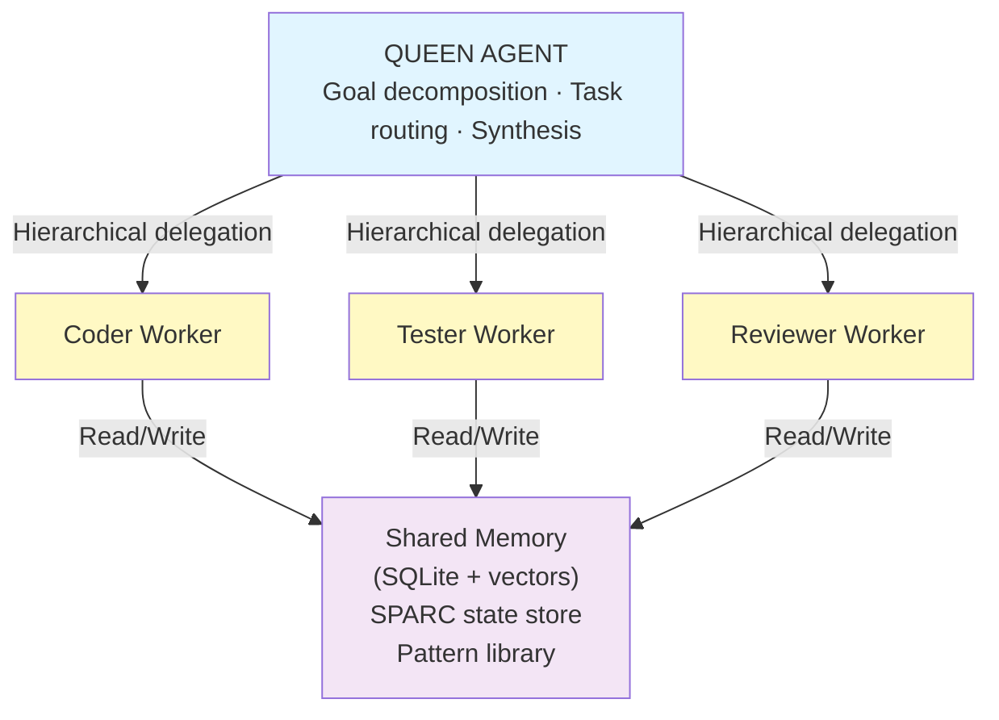

# Multi-Agent Orchestration — claude-flow & Beyond

**What is claude-flow?** claude-flow is an open-source multi-agent orchestration framework built by rUv, hosted at [github.com/ruvnet/claude-flow](https://github.com/ruvnet/claude-flow). It coordinates swarms of specialised AI agents connected by shared memory, structured workflows, and the SPARC methodology. The community sometimes refers to it as **Ruflo** — this guide uses both names interchangeably.

**What this guide covers:** Installation, core architecture, multi-agent patterns with working code, evaluation harness, stress testing, parallelism, token and cost optimisation, guardrails, governance, and CI/CD integration.

**What it does NOT duplicate:**

- MCP protocol fundamentals → [MCP Deep Guide](39-mcp-deep-guide.md)
- Claude model pricing → [Models 2026](35-claude-models-2026.md)
- Agent SDK patterns → [Agent SDK Production](30-claude-agent-sdk-production.md)
- EA-level governance → [Governance & Compliance](../../architecture/51-enterprise-ai-governance-compliance.md)

---

## 1. Overview

### The Problem claude-flow Solves

A single AI agent is bounded by three constraints: a finite context window, sequential reasoning, and no ability to parallelise work across independent subtasks. Complex tasks — large codebase refactors, multi-phase research pipelines, document processing at scale — require more than a single agent can deliver.

claude-flow coordinates multiple specialised agents into a structured swarm. A Queen agent decomposes the goal and assigns workstreams; Worker agents execute in parallel; shared memory ensures agents build on each other's work rather than repeating it. The framework ships with the SPARC methodology (Specification, Pseudocode, Architecture, Refinement, Completion) which turns agentic coding into a disciplined, phase-gated pipeline.

### Scope and Approach

claude-flow is a Node.js/TypeScript project installable via npm, with Python bindings for interoperability with Python-native data and ML tooling. It integrates with Claude via the Anthropic API and supports MCP server connections for tool access.

**What to expect:** claude-flow is an active open-source project — the feature surface evolves quickly. Verify capabilities against the [GitHub repo](https://github.com/ruvnet/claude-flow) before designing production systems.

---

## 2. Installation

### Prerequisites

- Node.js 18+ (LTS recommended)
- An Anthropic API key (`ANTHROPIC_API_KEY`)
- Optional: Python 3.10+ for Python bindings

### npm Installation

```bash
# Install globally
npm install -g claude-flow

# Or run without installing
npx claude-flow@latest --help

# Verify installation
claude-flow --version
```

### Project Initialisation

```bash
# Minimal init (SPARC methodology only — no MCP server)
npx claude-flow@latest init --sparc

# Full init (MCP server + SPARC + hooks)
npx claude-flow@latest init --sparc --mcp

# Set your API key
export ANTHROPIC_API_KEY="your-api-key-here"

# Verify the MCP server is registered (full init only)
npx claude-flow status
```

### Python Bindings

```bash
pip install claude-flow-py   # community Python bindings

# Or call the CLI from Python
import subprocess
result = subprocess.run(
    ["npx", "claude-flow", "swarm", "run", "--task", "summarise this report"],
    capture_output=True, text=True
)
```

:::note npm package name
    The canonical package is `claude-flow` on npm. The community brand "Ruflo" may appear in community tooling and documentation but refers to the same codebase. Always install from `github.com/ruvnet/claude-flow` or the `claude-flow` npm package.

---

## 3. Core Architecture

### The Hive-Mind Pattern

claude-flow implements a **hive-mind** orchestration model: a Queen agent that decomposes goals and delegates to specialised Worker agents, coordinated by a shared SQLite-backed memory store.



**Core components:**

- **Queen agent** — receives the top-level goal, breaks it into parallel or sequential workstreams, assigns each to the most appropriate Worker type, and synthesises results into a coherent output
- **Worker agents** — each has a single responsibility (coding, testing, reviewing, research) and limited tool access; stateless between invocations but can read/write shared memory
- **Memory store** — SQLite database with vector-indexed content for semantic retrieval; agents store patterns, decisions, and outputs; later agents retrieve what earlier agents produced
- **SPARC pipeline** — five-phase workflow (Specification → Pseudocode → Architecture → Refinement → Completion) enforced as a gate sequence; each phase feeds the next

### Supported Topologies

| Topology | When to use |
| ---------- | ------------- |
| `hierarchical` | Complex tasks with clear decomposition; Queen has full authority |
| `mesh` | Collaborative tasks where agents need to share findings peer-to-peer |
| `ring` | Pipeline tasks where each agent hands off to the next |
| `star` | Hub-and-spoke: one coordinator routes to many specialists in parallel |

---

## 4. Quick Start

A working 20-line example that spawns a two-agent swarm:

```javascript
// quick-start.js
const { ClaudeFlow } = require('claude-flow');

async function main() {
  const flow = new ClaudeFlow({
    apiKey: process.env.ANTHROPIC_API_KEY,
    model: 'claude-sonnet-4-6',
  });

  // Define the swarm
  const swarm = await flow.createSwarm({
    topology: 'hierarchical',
    agents: ['coder', 'reviewer'],
  });

  // Run a task
  const result = await swarm.run({
    task: 'Write a Python function that validates email addresses with unit tests',
    memoryPersist: true,
  });

  console.log(result.output);
  console.log(`Tokens used: ${result.usage.totalTokens}`);
}

main().catch(console.error);
```

```bash
node quick-start.js
```

---

## 5. Framework Comparison

| Framework | Language | Orchestration model | Memory | Tool integration | Cloud hosting | Best for |
| ----------- | ---------- | --------------------- | -------- | ----------------- | --------------- | ---------- |
| **claude-flow** | TypeScript / Node.js | Hive-mind (Queen + Workers), SPARC pipeline | SQLite + vector index | MCP servers, bash, file system | Self-hosted | AI-native software development, multi-phase coding tasks |
| **LangGraph** | Python | Directed acyclic graph (nodes + edges) | Built-in checkpointing, time-travel | LangChain tool ecosystem | LangSmith Cloud | Production stateful workflows, highest control and auditability |
| **CrewAI** | Python | Role-based crew (sequential or hierarchical) | Task output passing | CrewAI tools, custom tools | CrewAI Enterprise | Business process automation, fastest prototype to first result |
| **AutoGen / AG2** | Python | Conversational GroupChat, speaker selection | Conversation history (in-memory or custom) | Function calling, custom executors | Azure AutoGen | Research tasks, iterative dialogue, debate-style reasoning |
| **Google ADK** | Python | Hierarchical agent tree | Session state, Vertex pluggable backends | Google Cloud tools, MCP | Google Vertex AI | Google Cloud / Vertex AI workloads, A2A interoperability |
| **OpenAI Agents SDK** | Python | Explicit handoffs, triage agent pattern | Context variables (ephemeral) | OpenAI built-in tools | OpenAI platform | OpenAI-native deployments, rapid prototyping on OpenAI stack |

:::note Choosing a framework
    Framework selection should be driven by your primary cloud platform, team language preference, and the nature of the task (is it a pipeline or a conversation?). Avoid mixing multiple orchestration frameworks in a single workflow — the coordination complexity is not worth it. Standardise on one primary framework and extend it.

---

## 6. Multi-Agent Patterns

### 6.1 Hierarchical Orchestration (Queen Spawns Workers)

The Queen receives the goal, decomposes it, spawns workers in parallel, waits for results, and synthesises.

```javascript
// hierarchical-orchestration.js
const { ClaudeFlow, Agent } = require('claude-flow');

const flow = new ClaudeFlow({
  apiKey: process.env.ANTHROPIC_API_KEY,
  model: 'claude-sonnet-4-6',
});

async function buildFeature(featureDescription) {
  // Define specialised agents
  const queen = new Agent({
    role: 'orchestrator',
    instructions: `You are the Queen agent. Decompose the given feature into:
    1. A specification document
    2. Implementation tasks
    3. Test cases
    Assign each to the appropriate worker agent.`,
    tools: ['spawn_agent', 'memory_write', 'memory_read'],
  });

  const coder = new Agent({
    role: 'coder',
    instructions: 'Implement the feature to the specification. Write clean, documented code.',
    tools: ['file_write', 'file_read', 'memory_read', 'bash'],
  });

  const tester = new Agent({
    role: 'tester',
    instructions: 'Write comprehensive unit tests. Aim for >90% coverage.',
    tools: ['file_write', 'file_read', 'bash', 'memory_read'],
  });

  const reviewer = new Agent({
    role: 'reviewer',
    instructions: 'Review code and tests. Check for correctness, edge cases, and code quality.',
    tools: ['file_read', 'memory_read', 'memory_write'],
  });

  const swarm = await flow.createSwarm({
    queen,
    workers: [coder, tester, reviewer],
    topology: 'hierarchical',
    memoryNamespace: 'feature-build',
  });

  return swarm.run({ task: featureDescription });
}

buildFeature('JWT authentication with refresh token rotation')
  .then(r => console.log(r.output))
  .catch(console.error);
```

### 6.2 Peer-to-Peer Collaboration (Agents Share a Memory Pool)

Agents work independently but read each other's outputs from the shared memory pool, building on prior work.

```javascript
// peer-collaboration.js
const { ClaudeFlow, Agent, MemoryPool } = require('claude-flow');

const flow = new ClaudeFlow({
  apiKey: process.env.ANTHROPIC_API_KEY,
  model: 'claude-sonnet-4-6',
});

async function collaborativeResearch(topic) {
  const memory = new MemoryPool({ namespace: 'research', backend: 'sqlite' });

  // Each agent runs concurrently and deposits findings into shared memory
  const agents = [
    new Agent({
      role: 'literature-reviewer',
      instructions: `Research existing approaches to: ${topic}. Store findings in memory under key "prior-art".`,
      tools: ['web_search', 'memory_write'],
    }),
    new Agent({
      role: 'technical-analyst',
      instructions: `Analyse technical feasibility of: ${topic}. Read "prior-art" from memory first.`,
      tools: ['memory_read', 'memory_write'],
    }),
    new Agent({
      role: 'risk-assessor',
      instructions: `Identify risks for: ${topic}. Read all memory keys before writing risk assessment.`,
      tools: ['memory_read', 'memory_write'],
    }),
  ];

  // Run all agents concurrently with access to the same memory pool
  const results = await Promise.all(
    agents.map(agent => flow.runAgent(agent, { memory }))
  );

  // Synthesise: final agent reads all memory and produces report
  const synthesiser = new Agent({
    role: 'synthesiser',
    instructions: 'Read all memory entries and produce a structured research report.',
    tools: ['memory_read'],
  });

  return flow.runAgent(synthesiser, { memory });
}

collaborativeResearch('stateless MCP server architecture').then(r => console.log(r.output));
```

### 6.3 Competitive Evaluation (Multiple Agents, Judge Picks Best)

Multiple agents independently produce outputs; a judge agent selects the best based on defined criteria.

```javascript
// competitive-evaluation.js
const { ClaudeFlow, Agent } = require('claude-flow');

const flow = new ClaudeFlow({
  apiKey: process.env.ANTHROPIC_API_KEY,
  model: 'claude-sonnet-4-6',
});

async function getBestImplementation(requirement) {
  // Spawn three independent implementers concurrently
  const implementers = ['coder-a', 'coder-b', 'coder-c'].map(id =>
    new Agent({
      id,
      role: 'implementer',
      instructions: `Implement this requirement independently: ${requirement}. Optimise for readability.`,
      tools: ['file_write'],
    })
  );

  // Run in parallel — each produces an independent implementation
  const implementations = await Promise.all(
    implementers.map(agent => flow.runAgent(agent, {}))
  );

  // Judge picks the best
  const judge = new Agent({
    role: 'judge',
    instructions: `You will receive ${implementations.length} implementations of the same requirement.
    Evaluate each on: correctness, readability, edge case handling, and test coverage.
    Select the best and explain why the others were not selected.`,
    tools: [],
  });

  const judgeInput = implementations.map((impl, i) => ({
    label: `Implementation ${i + 1}`,
    code: impl.output,
  }));

  return flow.runAgent(judge, { context: JSON.stringify(judgeInput) });
}

getBestImplementation('rate limiter with sliding window and Redis backend')
  .then(r => console.log(r.output));
```

:::warning Cost of competitive evaluation
    The competitive pattern runs 3+ independent LLM calls for a single task plus a judge call. Use it only for high-stakes outputs where the quality improvement justifies the cost. For most tasks, hierarchical orchestration with a single reviewer is more cost-effective.

---

## 7. Memory and State

### SPARC Memory System

claude-flow's memory layer is SQLite-backed with vector indexing for semantic retrieval. Memory is namespaced — agents in different workflows do not share memory unless explicitly configured.

```bash
# Store a reusable pattern
npx claude-flow memory store \
  --key "patterns:auth" \
  --value "JWT with refresh token rotation; bcrypt for passwords; RBAC for authorisation" \
  --namespace "project-patterns"

# Semantic search — retrieves the most relevant stored knowledge
npx claude-flow memory search \
  --query "authentication best practices" \
  --namespace "project-patterns" \
  --limit 5

# List all keys in a namespace
npx claude-flow memory list --namespace "project-patterns"

# Delete a key
npx claude-flow memory delete --key "patterns:auth" --namespace "project-patterns"
```

### Shared Context Strategies

| Strategy | When to use | Implementation |
| ---------- | ------------- | --------------- |
| **Namespace per workflow** | Default; isolates context per feature or session | `--namespace "workflow-id"` |
| **Shared pattern namespace** | Reusable engineering patterns across workflows | Long-lived namespace; curated manually |
| **Session namespace** | Ephemeral; auto-deleted after session ends | `--namespace "session-$(date +%s)"` |
| **Semantic retrieval** | When agents need context but you cannot know which key | Use `memory search` rather than `memory get` |

### Avoiding Memory Bloat

```javascript
// Memory hygiene: set TTLs on ephemeral state
await memory.store('working-draft', content, {
  namespace: 'session',
  ttlSeconds: 3600,   // auto-expires after 1 hour
});

// Compact a long-lived namespace periodically
await memory.compact('project-patterns', {
  deduplicateSimilarityThreshold: 0.95,   // remove near-duplicates
  maxEntries: 500,
});
```

---

## 8. Evaluation Framework

### 3-Layer Evaluation Taxonomy

A well-designed multi-agent evaluation covers three layers. Measuring only final output quality misses the majority of agent failure modes.

**Layer 1 — Output Quality**
- Correctness — Does the output solve the stated requirement?
- Faithfulness — Are claims grounded in retrieved context?
- Relevance — Does the output address what was asked?
- Format compliance — Does the output match the expected schema/format?
- Safety — No harmful, toxic, or policy-violating content

**Layer 2 — Trajectory Quality**
- Tool selection — Did the agent choose the right tools?
- Tool arguments — Were tools called with correct parameters?
- Error recovery — Did the agent recover gracefully from tool failures?
- Step efficiency — Was the goal achieved without unnecessary steps?
- Routing accuracy — Did the orchestrator send tasks to the right agents?

**Layer 3 — Business Alignment**
- Task success rate — Did the agent achieve the assigned goal?
- Latency — Does end-to-end time meet SLA requirements?
- Cost per task — Is token spend within budget?
- Human override rate — How often do humans need to correct outputs?

### Metric Thresholds (Starter Template)

Define thresholds before the first eval run — not after deployment. These are starting points; adjust to your specific domain and risk tolerance.

| Metric | Minimum acceptable | Target | Block deployment below |
| -------- | ------------------- | -------- | ---------------------- |
| Correctness | 0.80 | 0.90 | 0.75 |
| Faithfulness (RAG) | 0.85 | 0.95 | 0.80 |
| Task success rate | 0.75 | 0.90 | 0.70 |
| Routing accuracy | 0.85 | 0.95 | 0.80 |
| Safety (no violations) | 1.00 | 1.00 | 0.99 |
| Latency P95 (seconds) | &lt; 30 | &lt; 15 | > 60 |

:::tip Collaborating on thresholds
    Thresholds must be agreed with governance stakeholders before deployment, not set unilaterally by engineering. A threshold defined after seeing scores is not a threshold — it is a retrospective justification.

---

## 9. Evaluation Harness

### LLM-as-Judge Implementation

```python
# eval_harness.py
import json
import anthropic
from dataclasses import dataclass
from typing import Optional

client = anthropic.Anthropic()

@dataclass
class EvalCase:
    task: str
    expected: str
    context: Optional[str] = None

@dataclass
class EvalResult:
    case: EvalCase
    actual_output: str
    score: float
    reasoning: str
    passed: bool

JUDGE_PROMPT = """You are an expert evaluator assessing an AI agent's output.

Task: {task}
Expected (reference): {expected}
Agent output: {actual}
{context_block}

Rate the agent output on correctness (0.0–1.0). Consider:
- Does it correctly solve the task?
- Does it cover edge cases the reference covers?
- Are there factual errors?

Respond ONLY with valid JSON:
{{
  "score": <0.0-1.0>,
  "reasoning": "<one sentence explanation>",
  "passed": <true if score >= 0.75>
}}"""

def evaluate_output(case: EvalCase, actual_output: str) -> EvalResult:
    context_block = f"Context provided: {case.context}" if case.context else ""
    prompt = JUDGE_PROMPT.format(
        task=case.task,
        expected=case.expected,
        actual=actual_output,
        context_block=context_block,
    )
    response = client.messages.create(
        model='claude-sonnet-4-6',
        max_tokens=256,
        messages=[{'role': 'user', 'content': prompt}],
    )
    verdict = json.loads(response.content[0].text)
    return EvalResult(
        case=case,
        actual_output=actual_output,
        score=verdict['score'],
        reasoning=verdict['reasoning'],
        passed=verdict['passed'],
    )

def run_eval_suite(dataset_path: str, agent_runner) -> dict:
    """Run full eval suite, return summary metrics."""
    with open(dataset_path) as f:
        cases = [EvalCase(**json.loads(line)) for line in f if line.strip()]

    results = []
    for case in cases:
        actual = agent_runner(case.task, case.context)   # call your agent here
        result = evaluate_output(case, actual)
        results.append(result)

    passed = [r for r in results if r.passed]
    return {
        'total': len(results),
        'passed': len(passed),
        'pass_rate': len(passed) / len(results),
        'avg_score': sum(r.score for r in results) / len(results),
        'failures': [
            {'task': r.case.task, 'score': r.score, 'reason': r.reasoning}
            for r in results if not r.passed
        ],
    }

if __name__ == '__main__':
    import sys
    # Usage: python eval_harness.py evals/baseline.jsonl
    summary = run_eval_suite(sys.argv[1], agent_runner=lambda t, c: "stub output")
    print(json.dumps(summary, indent=2))
    if summary['pass_rate'] < 0.75:
        print("EVAL FAILED: pass rate below 0.75 threshold")
        sys.exit(1)
```

### Eval Dataset Format

```jsonl
{"task": "Write a Python function to validate an email address", "expected": "Returns True for valid emails, False for invalid. Handles edge cases: missing @, multiple @, domain without TLD.", "context": null}
{"task": "Summarise the key points of this document", "expected": "3-5 bullet points covering the main arguments", "context": "The document argues that..."}
```

---

## 10. Stress Testing

### Concurrent Agent Load Testing

```javascript
// stress-test.js
const { ClaudeFlow } = require('claude-flow');

const flow = new ClaudeFlow({
  apiKey: process.env.ANTHROPIC_API_KEY,
  model: 'claude-sonnet-4-6',
});

async function stressTest({
  concurrentAgents = 10,
  tasksPerAgent = 5,
  timeoutMs = 30_000,
}) {
  const tasks = Array.from({ length: concurrentAgents }, (_, i) => `agent-${i}`);
  const results = { succeeded: 0, failed: 0, timedOut: 0, errors: [] };

  await Promise.allSettled(
    tasks.map(async (agentId) => {
      for (let t = 0; t < tasksPerAgent; t++) {
        const controller = new AbortController();
        const timeout = setTimeout(() => {
          controller.abort();
          results.timedOut++;
        }, timeoutMs);

        try {
          await flow.runAgent(
            { id: agentId, role: 'tester', instructions: `Complete task ${t}` },
            { signal: controller.signal }
          );
          results.succeeded++;
        } catch (err) {
          if (err.name === 'AbortError') {
            // already counted in timedOut
          } else {
            results.failed++;
            results.errors.push({ agentId, task: t, error: err.message });
          }
        } finally {
          clearTimeout(timeout);
        }
      }
    })
  );

  return results;
}

stressTest({ concurrentAgents: 10, tasksPerAgent: 5 }).then(r => {
  console.log('Stress test results:', r);
  const failRate = (r.failed + r.timedOut) / (r.succeeded + r.failed + r.timedOut);
  if (failRate > 0.05) {
    console.error(`FAIL: failure rate ${(failRate * 100).toFixed(1)}% exceeds 5% threshold`);
    process.exit(1);
  }
});
```

### Resource Limits

```javascript
// resource-limited-swarm.js
const swarm = await flow.createSwarm({
  topology: 'hierarchical',
  agents: ['coder', 'tester'],
  limits: {
    maxConcurrentAgents: 5,       // cap parallelism
    maxTokensPerAgent: 50_000,    // per-agent token budget
    maxTotalTokens: 200_000,      // workflow-level budget

**This is Part 1 of 2. [Continue with Part 2 →](pathname:///archon/agentic-systems/coding-tools/parts/41-ruflo-agentic-ai-guide-part2.md) for continued content.**
