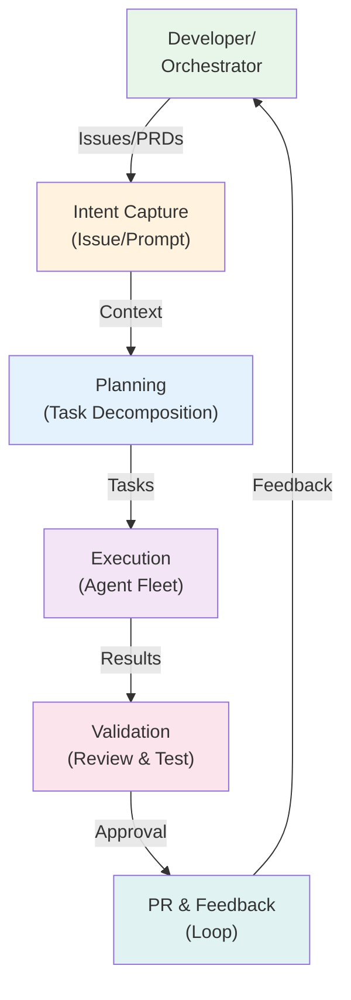

# GitHub Copilot Enterprise Agent Platform

GitHub Copilot's evolution from autocomplete to a full-stack software engineering operating system represents the most dramatic transformation in enterprise developer tools within the past five years. As the platform approaches 20 million users and 90% Fortune 100 adoption, the shift from suggestion-based assistance to autonomous multi-agent task execution marks a fundamental architectural and business inflection point. This comprehensive research synthesizes GitHub's strategy, Copilot's technical architecture, security threat landscape, enterprise adoption patterns, and the emerging role of AI agents in software development workflows.

**Agentic DevOps Loop:** GitHub Copilot transforms intent through planning and autonomous execution, with human validation at each critical gate, creating a feedback loop that continuously improves agent capabilities.

## Comprehensive Research Report: 15-Phase Analysis

**From Autocomplete to Software Engineering Operating System**

**Research Council:** GitHub Distinguished Engineer · Microsoft Technical Fellow · Principal AI Architect · Enterprise Architect · Platform Engineering Leader · AI Economics Researcher · DevEx Researcher · Security Architect · Software Engineering Researcher · CTO — AI-Native Enterprise

**Key Metrics (June 2026)**

- 20M+ Total Copilot Users
- 90% Fortune 100 Adoption
- 55% Developer Speed Gain (Accenture Study)
- 42% Market Share (AI Coding Category)
- $0.01 Per AI Credit (Token Billing Model)

**Produced:** June 2026 Research Council | **Classification:** Enterprise Confidential | **Coverage:** Build 2025 → Build 2026 + Live Research | **Phases:** 15 Research Phases — 14 Deliverables

## Table of Contents

| | | |
|---|---|---|
| **01** | **Executive Summary** | 3 |
| **02** | **Microsoft + GitHub Strategy** | 4 |
| **03** | **Copilot Evolution Timeline** | 6 |
| **04** | **Copilot Agent Architecture** | 8 |
| **05** | **Agent Orchestration & Multi-Agent Systems** | 10 |
| **06** | **Copilot SDK & Extensibility** | 12 |
| **07** | **Memory, Context & Context Engineering** | 14 |
| **08** | **GitHub as Software Engineering OS** | 16 |
| **09** | **AI-Native SDLC Blueprint** | 18 |
| **10** | **Copilot Best Practices Catalog** | 20 |
| **11** | **Security Architecture & Threat Model** | 22 |
| **12** | **AI FinOps & Token Economics** | 24 |
| **13** | **Enterprise Adoption Framework** | 26 |
| **14** | **Competitive Analysis & Decision Matrix** | 28 |
| **15** | **Principal AI Architect Playbook** | 30 |
| **16** | **Future of Software Engineering** | 32 |
| **17** | **Anti-Patterns Catalog** | 34 |
| **18** | **Enterprise Reference Architecture** | 35 |

## 01 — Executive Summary

GitHub Copilot has undergone one of the most dramatic product transformations in enterprise software history. What launched in 2021 as an intelligent autocomplete tool has become, by mid-2026, a full-stack Software Engineering Operating System — hosting 20 million users, serving 90% of Fortune 100 companies, and generating more revenue than GitHub itself did when Microsoft acquired it for $7.5 billion in 2018.

The Microsoft Build 2026 conference (June 2-3, San Francisco) marked a decisive architectural inflection point. Satya Nadella declared Copilot the entry point to Microsoft's "agentic era," where AI agents act autonomously on behalf of developers and enterprises. Three flagship announcements crystallized this shift: Project Polaris (Microsoft's proprietary AI coding model replacing GPT-4 Turbo), multi-agent VS Code support, and the standalone GitHub Copilot desktop application for orchestrating parallel agent fleets.

### Strategic Impact Summary

| Strategic | Copilot is Microsoft's most critical enterprise distribution vehicle for AI — larger than Azure AI Foundry in developer mindshare and growing at 400% YoY. |
|---|---|
| Architectural | The platform has evolved from single-model inference to a multi-agent orchestration layer with isolated git worktree environments, parallel execution, and a published SDK. |
| Economic | June 1, 2026 token-based billing transition ends the "unlimited" era. AI Credits at $0.01/credit require enterprise FinOps governance — unbounded agent sessions produce unbounded invoices. |
| Security | CVE-2025-53773 (prompt injection enabling YOLO mode), IDEsaster (100% of tested AI IDEs vulnerable), and hallucination squatting represent active, documented threat vectors requiring architectural mitigations. |
| Competitive | Claude Code dominates complex autonomous tasks (42% enterprise coding workloads, highest SWE-bench scores). Cursor leads IDE-native experience. Copilot wins on ecosystem integration, enterprise controls, and price. |
| Future | Gartner: 75% of developers will orchestrate rather than code by end of 2026. Microsoft CTO: 95% of code will be AI-generated. The human role shifts to architecture, governance, and agent supervision. |

This report synthesizes research across 15 phases, spanning Microsoft and GitHub strategy, architectural evolution, agent topology, SDK design, context engineering, security threats, AI FinOps, enterprise adoption patterns, and competitive positioning. It is designed for Principal AI Architects, CTOs, Platform Engineering Leaders, and Enterprise Architects making strategic decisions about the AI-native software development stack.

## 02 — Microsoft + GitHub AI Strategy

### Strategic Positioning

Microsoft's AI strategy is a three-pillar architecture: an open model ecosystem (Azure AI Foundry with 1,900+ models), a unified agent runtime (Copilot Platform spanning cloud, edge, and on-device), and an AI-first application model. Copilot is the primary consumer-facing expression of all three pillars for developers.

The Microsoft-OpenAI exclusive partnership ended in April 2026 — a pivotal strategic shift. Project Polaris, Microsoft's proprietary coding model, replaces GPT-4 Turbo as the default Copilot engine in August 2026. This gives Microsoft end-to-end ownership of its most widely used developer product for the first time, eliminating dependency risk and enabling full model optimization for coding workloads.

### Thomas Dohmke Vision (GitHub CEO)

*"GitHub is where the world's developers work on their projects. Now, it's becoming the place where they collaborate with agents in a configurable, steerable, and verifiable way. It's vital that organizations and developers are ready to embrace these agents without compromising their security posture."*

### Developer Platform Growth Metrics

| Metric | Value | Timeframe | Significance |
|---|---|---|---|
| Monthly Commits | 1.4 billion | Build 2026 | Near-doubled YoY, agent-driven |
| GitHub Actions Minutes | 2 billion/week | Build 2026 | Agent compute backbone |
| Total Users | 20M+ | July 2025 | 5M added in 3 months |
| Paid Subscribers | 4.7M | January 2026 | 75% YoY growth |
| Fortune 100 Adoption | 90% | July 2025 | Infrastructure-grade penetration |
| Market Share (AI coding) | 42% | Mid-2025 | Category leader |
| AI Coding Market Size | $7.37B | 2025 | Growing to $26B by 2030 |

### Competitive Moat Analysis

- **GitHub ecosystem lock-in:** 150M+ developer accounts, dominant code hosting, CI/CD through Actions — competitors must integrate with GitHub rather than replace it.
- **Microsoft enterprise distribution:** Copilot ships bundled with Microsoft 365, Azure, and existing EA agreements — zero-friction procurement for enterprise IT.
- **Model sovereignty (Project Polaris):** First-party model eliminates OpenAI dependency and enables cost optimization unavailable to competitors relying on third-party inference.
- **MCP + SDK platform play:** By publishing Model Context Protocol and the Copilot SDK, Microsoft creates an ecosystem moat — third parties build on Copilot, not against it.
- **Actions compute integration:** Agent workloads run on the same CI/CD infrastructure teams already trust — no new security reviews, no new vendor relationships.

### Build 2026 — Key Announcements Summary

| Announcement | Impact | Timeline |
|---|---|---|
| Project Polaris (in-house coding model) | Replaces GPT-4 Turbo; Microsoft model sovereignty | August 2026 |
| GitHub Copilot Desktop App | Multi-agent orchestration surface; worktree isolation | GA June 2026 |
| Multi-Agent VS Code Extension | Orchestrator + parallel subagent architecture | GA Build 2026 |
| Copilot Platform APIs | Copilot as fabric across all Microsoft products | Preview June 2026 |
| Autonomous Agent Mode (Enterprise) | Write/test/commit full feature branches autonomously | July 2026 |
| Copilot Workspace GA | Issue-to-PR autonomous planning surface | GA Build 2026 |
| Windows Copilot Runtime | On-device Phi-4-Silicon SLM; cross-platform agents | Windows 2026 Update |
| Usage-Based Billing (AI Credits) | $0.01/credit token pricing replaces PRUs | June 1, 2026 |

## 03 — Copilot Evolution Timeline

GitHub Copilot has progressed through eight distinct capability generations in less than five years, each representing a fundamental expansion of both the model of interaction and the scope of autonomous action.

| 2021 | **Autocomplete (Technical Preview)** - Single-line and multi-line code completion from OpenAI Codex. Context window: current file only. Interaction: passive, inline suggestion. |
|---|---|
| 2022 | **Copilot GA + Chat Beta** - Commercial launch at $10/month. Chat introduced (GitHub.com + IDEs). Context: open tabs. First "conversation" model of coding assistance. |
| 2023 | **Copilot Enterprise Launch** - Organization-level deployment. Private codebase indexing for retrieval-augmented suggestions. Coding guidelines, audit logs, SSO. Context: whole repository via semantic search. |
| Early 2025 | **Agent Mode + MCP** - Fundamental paradigm shift: from suggestion to autonomous execution. Agent Mode translates natural language to multi-file edits, terminal commands, and self-healing error loops. MCP enables tool integration with 250+ external services. |
| May 2025 | **Coding Agent (Build 2025)** - Asynchronous agent spun up on GitHub Actions runners. Accepts GitHub Issues as input. Generates PRs, responds to feedback, iterates. First true background execution model. |
| Dec 2025 | **Copilot Memory Preview** - GitHub-hosted repository-scoped memory. Cross-agent shared insights. copilot-instructions.md four-tier instruction hierarchy reaches maturity. Context engineering becomes first-class discipline. |
| Jan 2026 | **SDK Technical Preview** - Copilot agentic engine made programmable via JSON-RPC. Node.js, Python, Go, .NET support. Developers can embed Copilot planning, tool invocation, and execution in any application. |
| Jun 2026 | **Multi-Agent Desktop + Polaris** - Standalone desktop app. Parallel agent sessions in isolated worktrees. Project Polaris replaces GPT-4. VS Code multi-agent architecture with orchestrator + subagent topology. Usage-based billing. Autonomous Agent Mode for Enterprise. |

### Capability Maturity Model

| Dimension | Gen 1 (2021) | Gen 4 (2025) | Gen 8 (2026) |
|---|---|---|---|
| Context Window | Current file | Repository + MCP | 1M tokens + persistent memory |
| Autonomy | Passive suggestion | Active execution | Parallel autonomous agents |
| Interaction Model | Inline completion | Chat + commands | Issue→PR pipeline |
| Compute | Inference only | Actions integration | Dedicated agent environments |
| Memory | None | Session only | Repository-scoped persistent memory |
| Extensibility | None | Extensions | SDK + MCP + custom agents |
| Enterprise Controls | Basic | SSO + audit logs | FinOps + governance + policy |
| Multi-model | GPT-3.5 only | Multi-model choice | Polaris default + 20+ model options |

## 04 — Copilot Agent Architecture

The Copilot agent architecture as of Build 2026 represents a multi-layer system spanning from user intent capture through planning, execution, validation, and feedback loops. Understanding this architecture is essential for enterprise governance, security posture, and integration design.

### Agent Lifecycle — Five Phases

| 1. Intent Capture | Developer assigns GitHub Issue or types natural language prompt in IDE/CLI/Desktop App. Intent is enriched with repository context, copilot-instructions.md rules, and memory snapshots. |
|---|---|
| 2. Planning | Orchestrator agent decomposes intent into a task graph: file discovery, change identification, dependency analysis, test requirements. Project Polaris (or selected model) generates a structured plan with explicit tool calls and expected outcomes. |
| 3. Execution | Executor agents spin up in isolated GitHub Actions runner environments. Each agent gets its own git worktree (git worktree add) so parallel agents cannot conflict. Agents write files, run commands, execute test suites, and invoke MCP tools (databases, APIs, CI systems) as needed. |
| 4. Validation | Review agents analyze generated code for correctness, security issues, and style conformance. Test agents run the generated test suite. Copilot respects branch protection rules — no force pushes, no merges without human approval. Automated workflows require explicit human trigger. |
| 5. PR + Feedback Loop | Agent opens a Pull Request with structured diff, explanation, and test results. Human reviewers provide feedback comments. Agent reads comments and iterates — the Agentic DevOps Loop. Copilot Memory captures learnings for future sessions. |

### Multi-Agent Topology (Build 2026)

The VS Code multi-agent architecture introduces an orchestrator-subagent pattern. Rather than routing all tasks through a single Copilot instance, an orchestrator agent spawns parallel subagents assigned to discrete workstreams. Subagents operate with isolated context windows, preventing cross-contamination and enabling specialized agent profiles.

| Agent Type | Responsibility | Context Scope | Isolation Model |
|---|---|---|---|
| Orchestrator | Task decomposition, subagent spawning, result aggregation | Full repository + plan | Main worktree |
| Linting Agent | Code style, formatting, static analysis | Changed files only | Isolated worktree |
| Test Generation Agent | Unit/integration test creation and execution | Module under change | Isolated worktree |
| Documentation Agent | Docstrings, README updates, changelogs | Changed files + docs | Isolated worktree |
| Security Review Agent | Vulnerability scanning, dependency checks | Full diff + CVE database | Isolated worktree |
| Cloud Agent | Infrastructure provisioning, deployment scripts | IaC files + cloud context | Isolated worktree |
| Review Agent | PR summary, change explanation, risk flags | Full diff + history | Read-only |

### Compute Layer: GitHub Actions Integration

All Copilot agent compute runs on GitHub Actions — the largest CI/CD ecosystem with 25,000+ marketplace actions and 40 million daily jobs. This design decision gives Copilot agents access to trusted, auditable, reproducible compute environments without introducing new infrastructure. Enterprise teams can use self-hosted runners to keep agent execution within their network perimeter.

## 05 — Copilot SDK & Extensibility

Launched in technical preview January 22, 2026, the GitHub Copilot SDK represents the platform's most significant extensibility announcement since the launch of Copilot Extensions. The SDK exposes the same production-tested agentic engine that powers Copilot CLI — including planning, tool invocation, file modification, and context management — as a programmable, embeddable runtime for any application.

### Core SDK Capabilities

| Production Execution Loop | The identical battle-tested agentic engine used by millions of Copilot daily active users. No simplified or watered-down version. |
|---|---|
| JSON-RPC Interface | Language-agnostic communication protocol. SDK launches Copilot CLI binary and communicates via structured JSON-RPC messages. |
| Tool Extensibility | Define custom agents, skills, and tools. Extend the runtime with domain-specific capabilities. |
| MCP Server Integration | Automatic MCP server discovery and integration. Connect agents to databases, APIs, and external systems. |
| Runtime Model Discovery | Query available models dynamically. No hardcoded assumptions that break on model updates. |
| AI Credits Billing Integration | Transparent usage tracking against Copilot quota. No separate metering infrastructure required. |
| Permission Handlers | Sandbox tool execution for security-conscious enterprise deployments. Granular control over what agents can do. |
| Multi-Language Support | Node.js/TypeScript, Python, Go, .NET GA. Java in development. |

### Enterprise Use Cases

- **Custom Code Review Bots:** Embed Copilot reasoning in domain-specific review automation with organization coding standards.
- **Intelligent Build Systems:** CI/CD pipelines that reason about failures, suggest fixes, and generate remediation PRs automatically.
- **Issue Triage Automation:** AI-powered issue classification, severity assessment, and assignment routing.
- **Deployment Intelligence:** Agentic deployment scripts that analyze risk, run validations, and handle rollback logic.
- **Mobile App Integration:** Server-side SDK integration enabling Copilot capabilities in React Native and mobile developer tools.
- **Custom Editor Products:** ISVs can embed Copilot agentic capabilities directly into specialized development environments.

### SDK Architecture Notes

The SDK requires a Node.js runtime and the Copilot CLI binary, which manages communication via JSON-RPC. This creates an important architectural constraint: mobile applications (e.g., React Native) cannot directly use the SDK and require a server-side proxy layer. Enterprise architects must account for this in deployment topologies.

### Extensibility Tracks

| Track | Mechanism | Use Case | Maturity |
|---|---|---|---|
| SDK | JSON-RPC + Copilot CLI binary | Embed Copilot engine in custom apps | Technical Preview |
| MCP | Model Context Protocol servers | Connect agents to external tools | GA (250+ servers) |
| Copilot Extensions | VS Code extension API | IDE-level custom behaviors | GA |
| Custom Instructions | .github/copilot-instructions.md | Team coding standards enforcement | GA |
| Agent Skills | Open standard (Anthropic origin) | Cross-platform reusable agent behaviors | Preview |
| Copilot Tuning | Low-code model customization | Organization-specific model behavior | Preview |

## 06 — Memory, Context & Context Engineering

Context engineering — the systematic discipline of delivering the right information, in the right format, to the AI at the right time — has emerged as a critical competency for organizations seeking to maximize Copilot effectiveness. GitHub formalized this framework in January 2026, describing three primary techniques and a four-tier instruction hierarchy.

### Four-Tier Instruction Hierarchy

| Priority 1 — Personal Instructions | User GitHub profile settings. Global preferences applying across all projects. First 200 lines auto-loaded into agent context at session start. |
|---|---|
| Priority 2 — Repository Instructions | .github/copilot-instructions.md. Markdown format for natural language coding standards. Repository-wide context for all Copilot features. Available since October 2024. |
| Priority 3 — Path-Specific Instructions | .github/instructions/*.instructions.md. YAML frontmatter for path matching. Scope rules to specific directories or file patterns. Available since July 2025. |
| Priority 4 — Reusable Prompts | .github/prompts/*.prompts.md. Triggered via slash commands (/create-react-form, etc.). Standardize frequent tasks across the team. |

### Copilot Memory System

Released in December 2025 preview, Copilot Memory introduces GitHub-hosted, repository-scoped persistent memory for agents. Unlike the local memory tool (user-only, markdown file), Copilot Memory is shared across multiple Copilot surfaces: coding agent, code review agent, and Copilot CLI.

- Repository-scoped: memories tied to specific repositories, created only by write-access contributors.
- Cross-agent: insights learned by one Copilot agent are available to all other agents in the same repository.
- Auto-capture: agents automatically extract tightly-scoped insights ("memories") during work sessions.
- Human governance: repository owners can review and delete stored memories in Repository Settings.
- Off by default: must be explicitly enabled — individual (Pro/Pro+) or organization policy.
- VS Code integration requires github.copilot.chat.copilotMemory.enabled setting.

### Comparison: Context Engineering Across Platforms

| Dimension | Copilot | Claude Code | Cursor |
|---|---|---|---|
| Instruction File | copilot-instructions.md | CLAUDE.md | .cursorrules |
| Memory Scope | Repository (shared across agents) | Project + user (CLAUDE.md) | Project (.cursor/rules) |
| Persistence | GitHub-hosted (cloud) | Local file + optional MCP | Local file |
| Cross-Agent Sharing | Yes (Copilot Memory) | Yes (shared CLAUDE.md) | No (per-session) |
| Max Context Window | ~128K (model dependent) | 1M tokens (GA) | 200K tokens |
| RAG/Codebase Index | VS Code workspace index | Full codebase traversal | Local vector index |
| Context Engineering Maturity | High (4-tier hierarchy) | Very High (1M window) | High (local index) |

### Context Debt — An Emerging Risk

As organizations accumulate copilot-instructions.md files, memory entries, and custom prompts, a new form of technical debt emerges: context debt. Stale instructions conflict with current practices, outdated memory entries mislead agents, and competing priority levels create unpredictable behavior. Enterprise architects must treat context as governed infrastructure — versioned, reviewed, and periodically audited.

## 07 — GitHub as Software Engineering OS

GitHub's strategic trajectory follows a clear progression: Repository → Platform → Operating System. By deeply integrating AI agents into every GitHub primitive — Issues, Pull Requests, Actions, Projects, Discussions, Security Advisories — GitHub is becoming the runtime layer through which all software engineering work passes, regardless of which editor or language is used.

### GitHub Primitives as OS Components

| GitHub Primitive | OS Analog | AI-Native Evolution |
|---|---|---|
| Issues | Task Queue / Scheduler | Agent work items — autonomously picked up, executed, resolved |
| Pull Requests | Change Management / IPC | Agent-generated diffs with structured metadata and review loops |
| Actions | Process Scheduler / Compute | Agent execution environment — isolated, auditable, scalable |
| Repositories | File System | Indexed, context-aware, memory-attached knowledge bases |
| Copilot Memory | Persistent Storage | Cross-session, cross-agent shared learning layer |
| Models API | AI Runtime | On-demand model inference with routing and caching |
| MCP Servers | Device Drivers | Standardized connectors to external systems and tools |
| Copilot Desktop App | Process Manager / Shell | Multi-agent orchestration, monitoring, and control surface |
| Projects | Project Manager | AI-assisted sprint planning, backlog grooming, progress tracking |
| Code Review | Quality Gate | AI pre-review before human review — 8M+ PRs reviewed by April 2025 |

## 08 — AI-Native SDLC Blueprint

### Traditional vs AI-Native SDLC

| SDLC Phase | Traditional | AI-Native (Copilot-Augmented) | Speed Change |
|---|---|---|---|
| Planning | Human sprint planning, story writing | AI generates stories from intent; estimates velocity | 60% faster |
| Design | Architecture diagrams, ADRs | AI drafts architecture from requirements; generates ADRs | 40% faster |
| Implementation | Developer writes all code | Agent writes routine code; human writes business logic | 55% faster |
| Code Review | Peer review only (9.6 day avg) | AI pre-review + peer review (2.4 day avg) | 75% faster |
| Testing | Manual + scripted tests | AI generates test suites; runs in agent environment | 50% faster |
| Security | Scheduled SAST scans | Continuous AI security review on every PR | Continuous |
| Documentation | Post-hoc, often skipped | AI generates docs in real time as code changes | Automatic |
| Deployment | Manual runbooks | AI-generated deployment scripts with rollback logic | 30% faster |
| Monitoring | Dashboard review | AI anomaly detection with suggested remediations | Proactive |

### The Agentic DevOps Loop

The Agentic DevOps Loop represents the core workflow pattern of AI-native software delivery: Intent → Plan → Execute → Review → Merge → Deploy → Monitor → Intent. In this loop, human developers operate primarily at the Intent and Review stages, while AI agents handle Plan through Deploy autonomously. Each loop iteration produces measurable artifacts (PRs, test results, deployment records) that feed back into the next iteration as context.

**Key Metric:** *GitHub reports pull request cycle time dropping from 9.6 days to 2.4 days — a 75% reduction — when Copilot agents are active in the review and implementation loop. This metric represents the most dramatic SDLC improvement in the Copilot dataset.*

## 09 — Copilot Best Practices Catalog

### Context Engineering

- Write copilot-instructions.md before enabling Copilot for any team — define language conventions, error handling patterns, API documentation standards, and test framework expectations.
- Use path-specific instructions (.github/instructions/*.instructions.md) to scope rules to React components, Python services, IaC files, and SQL — prevent cross-domain interference.
- Treat copilot-instructions.md as code: version-control, PR review, and changelog it. Review quarterly for staleness (context debt).
- Seed Copilot Memory with architectural decisions, known pitfalls, and team preferences before first agent session to accelerate ramp-up.
- Create reusable prompts (.github/prompts/) for common operations: create-feature, add-tests, generate-docs, review-security. Standardize team workflows.

### Agent Governance

- Enable human-in-the-loop approval for all autonomous agent actions before any PR merge. Never configure autopilot mode without approval gates in regulated environments.
- Use self-hosted GitHub Actions runners for agent compute in environments with data residency requirements. All agent execution stays within network perimeter.
- Configure branch protection rules before enabling Coding Agent. Copilot respects them — this is your primary guardrail against runaway agent changes.
- Set spending caps in GitHub organization settings before June 1, 2026 billing transition. Tag high-usage repos with budget alerts. Agent sessions in monorepos can exhaust monthly credits rapidly.
- Audit agent-generated PRs with a human security review before merging. AI review does not replace human judgment for security-critical paths.

### Productivity Patterns

- Use Copilot agents for greenfield feature branches; use chat/inline for incremental changes in stable code. Match the tool to the task granularity.
- Assign well-scoped GitHub Issues to the Coding Agent: single-feature, clear acceptance criteria, referenced files. Ambiguous issues produce ambiguous PRs.
- Run parallel agent sessions for independent tasks (linting, documentation, testing) to maximize throughput. Use git worktree isolation to prevent conflicts.
- Use the Copilot Desktop App for fleet management when coordinating 3+ simultaneous agent sessions. VS Code for individual sessions, Desktop for orchestration.
- Review agent output with the same rigor as junior developer output. Copilot generates correct code 55% of the time on hard LeetCode problems — always verify business logic.

### Model Selection

- Use Project Polaris (August 2026 default) for standard coding tasks. Cheaper, faster, and Microsoft-sovereign.
- Enable Claude Sonnet or GPT-4.1 for complex architectural reasoning tasks where Polaris underperforms. Model selection is now per-session.
- Use lightweight models for linting, documentation, and formatting agents. Reserve frontier models for planning and complex generation.
- Monitor credit consumption by model in the Billing Overview dashboard. Frontier model sessions cost 10-30x more than lightweight model sessions.

## 10 — Security Architecture & Threat Model

GitHub Copilot's agentic capabilities introduce a qualitatively new security surface. Unlike passive autocomplete, agents that execute terminal commands, modify files, call external APIs, and open pull requests represent active attack surfaces. Multiple CVEs, academic research (IDEsaster), and production incidents in 2025-2026 have validated these risks as real, exploited, and material.

### Active Threat Vectors

**CVE-2025-53773 — Prompt Injection / YOLO Mode** Exploits Copilot's ability to modify .vscode/settings.json without user approval. Enables YOLO mode, allowing arbitrary command execution. Creates "ZombAI" botnets that spread via Git. Fixed in VS 2022 v17.14.12. **MITIGATION:** Immediate VS update; restrict agent file write permissions; human approval for all configuration file changes.

**IDEsaster — Universal AI IDE Attack Chain** Research proving 100% of tested AI IDEs vulnerable to novel attack chain. Attack vectors: malicious MCP servers, rule files, deeplinks, file names. **MITIGATION:** Only use AI IDEs with trusted projects; vet all MCP servers; configure human-in-the-loop verification.

**Hallucination Squatting** Copilot suggests non-existent package names. Attackers register malicious packages. **MITIGATION:** Automated dependency verification in CI; package lockfiles; approved registry allowlists.

**Secrets Exposure (AI-assisted commits)** AI-assisted commits expose secrets at 3.2% vs 1.5% for human-only (2x+ rate). 34% YoY increase in hardcoded credentials. **MITIGATION:** Pre-commit secrets scanning; content exclusion for .env files; never include secrets in agent context.

**Training Data Poisoning** Intentional seeding of public repos with insecure code to poison future Copilot suggestions. **MITIGATION:** SAST on all suggestions; prefer private codebase training in Enterprise tier.

**Vendor Lock-in / Platform Risk** Deep GitHub integration creates switching friction. Polaris migration may break SDK integrations. **MITIGATION:** Abstract agent interfaces; maintain model-agnostic prompt libraries.

### Security Architecture Recommendations

- Implement "Secure for AI" principles: treat AI configuration files (.vscode/settings.json, copilot-instructions.md, MCP config) as security-critical infrastructure requiring change control.
- Establish an MCP server allowlist. Audit all MCP servers before deployment. Treat MCP servers as third-party dependencies with the same security review process.
- Deploy GitHub Advanced Security (secret scanning, code scanning, dependency review) as a complement to Copilot — not a replacement for it.
- Implement AI-specific DLP policies: content exclusion for files containing PII, credentials, proprietary algorithms, and regulated data (PHI, PCI, ITAR).
- Require human approval on all agent-generated PRs touching authentication, authorization, cryptography, and data access paths.
- Run regular red team exercises specifically targeting AI agent surfaces: prompt injection via Issue comments, malicious MCP server tests, configuration file tampering scenarios.

## 11 — AI FinOps & Token Economics

June 1, 2026 marks the end of the "unlimited" era for GitHub Copilot. The transition from Premium Request Units (PRUs) to usage-based GitHub AI Credits (1 credit = $0.01, measured in input + output + cached tokens) transforms Copilot from a predictable SaaS expense into a metered cloud resource requiring active FinOps governance.

### AI Credits — Plan Entitlements

| Plan | Price | Monthly AI Credits | Included Value | Flex Allotment |
|---|---|---|---|---|
| Copilot Free | $0/month | ~50 credits | $0.50 | None |
| Copilot Pro | $10/month | 1,500 credits | $15.00 | 500 credits |
| Copilot Pro+ | $39/month | 7,000 credits | $70.00 | 3,100 credits |
| Copilot Max | $100/month | 20,000 credits | $200.00 | 10,000 credits |
| Copilot Business | $19/user/month | 1,900/seat | $19.00/seat | None |
| Copilot Enterprise | $39/user/month | 3,900/seat | $39.00/seat | None |

**Critical Risk:** *No default spending cap on additional usage. An unmanaged autonomous agent session in a large monorepo can exhaust monthly credits in hours. Organizations must configure spending controls before enabling Autonomous Agent Mode.*

### Copilot FinOps Framework

| Visibility | Deploy Billing Overview dashboards. Track credit consumption by user, team, repository, and model. Build alerts for &gt;80% monthly credit utilization. Tag repositories with cost center labels. |
|---|---|
| Optimization | Select lightweight models for routine tasks (linting, docs). Reserve frontier models (Claude, GPT-4.1) for complex planning. Minimize context window for simple tasks. Cache common context via instructions files. |
| Governance | Set organizational spending caps. Require manager approval for Copilot Max subscriptions. Define agent session time limits. Block unbounded autopilot mode for junior engineers. |
| Education | Train engineers on model cost multipliers. Publish internal guidelines on appropriate model selection. Show real-time credit consumption during agent sessions to encourage mindful usage. |

### Cost Explosion Patterns to Watch

- **Monorepo Agent Sessions:** Large context window traversal across a 1M+ line monorepo can consume 500k+ tokens per session at frontier model rates.
- **Recursive Agent Loops:** Agents that fail, retry, and re-plan in loops without progress limits can generate unbounded token consumption.
- **Unindexed Codebase Context:** Agents that read entire repositories file-by-file instead of using semantic search generate 10-100x unnecessary tokens.
- **Frontier Model for Routine Tasks:** Using Claude or GPT-4.1 for linting or docstring generation costs 10-30x more than a lightweight model with identical output quality.
- **Long Conversation Threads:** Chat sessions that accumulate without context pruning grow quadratically in token cost as history is re-sent each turn.

**Continued in [Part 2](parts/47-github-copilot-enterprise-research-2026-part2.md)**: Enterprise Adoption Framework, Competitive Analysis, Principal AI Architect Playbook, Future of Software Engineering, Anti-Patterns Catalog, Enterprise Reference Architecture, Sources, Related Documentation.

## Related

- [Git Internals](48-git-internals.md) — the next section in this series.
