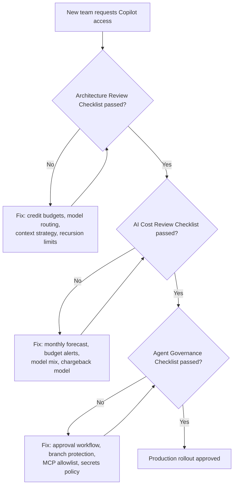

## Why This Matters

Preventing common anti-patterns across 100 documented failure modes ensures your enterprise achieves predictable ROI from AI-assisted development. This part catalogs root causes, impacts, and mitigations — and provides checklists and strategic roadmaps for scaling AI governance as your organization grows through 2030.

---

## SECTION 08 – ANTI-PATTERNS

### 100 Anti-Patterns: Root Cause, Impact, Mitigation

#### How to Use This Section

Anti-patterns are grouped into 10 categories of 10. Each entry shows root cause, impact (cost / quality / security), and mitigation. Use as a training guide, architecture review checklist, and onboarding resource.

#### Category A — Context & Prompt Anti-Patterns (#1–10)

**#1 Full Repository Stuffing**
- **Root Cause:** Laziness / lack of scoping. Agent given repo root as working directory.
- **Impact:** Agent receives 500K–5M tokens per request. Can exhaust monthly credits in a single session.
- **Mitigation:** Mandate Content Exclusion. Agent must receive explicit file list, not directory root.

**#2 Conversation History Bloat**
- **Root Cause:** Long chat threads never reset.
- **Impact:** 20-turn conversation sends 20× the initial context. Exponential token growth.
- **Mitigation:** Reset conversation after each task. Enforce session length limits in enterprise policy.

**#3 Vague Unscoped Questions**
- **Root Cause:** "How does auth work?" triggers full-repo RAG retrieval vs. targeted function lookup.
- **Impact:** 50–200× more context than necessary. Low-quality answers from retrieval noise.
- **Mitigation:** Train: always name the file, function, or module. Use copilot-instructions.md to enforce scoping.

**#4 Context Dumping (Paste Everything)**
- **Root Cause:** Developer pastes entire stack trace, full file, and complete error log into chat.
- **Impact:** 2–10× token waste. Most pasted content is irrelevant to the actual question.
- **Mitigation:** Teach surgical prompting: extract the 10 relevant lines, not the 1,000-line file.

**#5 Redundant System Prompt Boilerplate**
- **Root Cause:** Custom instructions include 2,000-token boilerplate repeated across every interaction.
- **Impact:** 20–30% of all input tokens wasted on static, unchanged instructions.
- **Mitigation:** Minimize copilot-instructions.md. Use prompt caching. Keep instructions under 200 tokens.

**#6 Speculative Multi-Variant Generation**
- **Root Cause:** "Show me 5 ways to implement this." 80% of output is discarded.
- **Impact:** 4–5× output token cost for same net result as targeted single implementation.
- **Mitigation:** Ask for one best implementation. Iterate if needed. Variants are cheap to request individually.

**#7 Model Curiosity Overuse**
- **Root Cause:** Defaulting to Claude Opus or GPT-5 "because it's the best" for trivial formatting.
- **Impact:** 5–37× cost premium for zero quality improvement on mechanical tasks.
- **Mitigation:** Economy model as org default. Escalation only after 2 failed attempts on lower tier.

**#8 Open Tab Context Bleed**
- **Root Cause:** Editor sends all 20 open tabs as implicit context, even when unrelated to the task.
- **Impact:** 5–10× unnecessary input tokens. Context pollution reduces answer quality.
- **Mitigation:** Use #file references explicitly. Close irrelevant tabs. Configure editor context limits.

**#9 Unnecessary Chain-of-Thought Expansion**
- **Root Cause:** Prompts demand "think step by step in detail" for trivially simple tasks.
- **Impact:** 3–10× output token inflation. Reasoning tokens cost the same as answer tokens.
- **Mitigation:** Reserve extended reasoning prompts for genuinely complex tasks only.

**#10 Regeneration Without Diagnosis**
- **Root Cause:** Answer is wrong → developer clicks Regenerate 5 times hoping for different result.
- **Impact:** 5× cost for same quality. Underlying prompt issue is never identified or fixed.
- **Mitigation:** Diagnose before retry: refine the prompt or add the missing context. Max 1 retry per task.

#### Category B — Agent Anti-Patterns (#11–20)

**#11 Infinite Reflection Loops**
- **Root Cause:** Agent told to "keep improving until perfect." No stopping criterion defined.
- **Impact:** Unbounded token consumption. Can run for hours burning all available credits.
- **Mitigation:** Mandatory stopping criteria: max iterations, output similarity detection (stop if unchanged).

**#12 Uncontrolled Agent Delegation**
- **Root Cause:** Agent spawns sub-agents without budget allocation; sub-agents spawn their own.
- **Impact:** Exponential credit consumption. 3-level recursion = 27 minimum agent calls.
- **Mitigation:** Hard recursion depth limit (max 2). Each delegation must specify a credit budget.

**#13 Context Replay Without Compression**
- **Root Cause:** Agent replays full conversation history + all tool outputs at every single step.
- **Impact:** Step N costs N× step 1. A 20-step agent accumulates 20× the initial context.
- **Mitigation:** Compress completed steps to summaries every 5 iterations. Budget per-step context size.

**#14 Retry Loops on Logic Errors**
- **Root Cause:** Agent retries failed tool call without diagnosing why it failed.
- **Impact:** N retries × full context = N× wasted tokens with identical outcome and failure.
- **Mitigation:** Retry only on transient errors (rate limit, timeout). Logic errors → escalate to human.

**#15 Runaway Cloud Agent Sessions**
- **Root Cause:** Cloud agent runs for hours on Actions runners with no budget cap configured.
- **Impact:** AI Credits AND Actions minutes consumed simultaneously. Single task can cost $500+.
- **Mitigation:** Mandatory budget cap per cloud agent task. Timeout after N minutes. Human approval for &gt;100 credit tasks.

**#16 Ambiguous Task Specification**
- **Root Cause:** Agent given "improve the codebase" with no specific scope.
- **Impact:** Agent searches entire repo, makes unsolicited changes, consumes large context budget.
- **Mitigation:** All tasks must specify: target files, success criteria, explicit out-of-scope constraints.

**#17 Fleet Mode Without Cost Planning**
- **Root Cause:** Parallel agent fleet launched to process 50 issues simultaneously with no budget allocation.
- **Impact:** 50× token consumption simultaneously. Can exhaust org credit pool in hours.
- **Mitigation:** Fleet tasks require FinOps approval. Each agent in fleet must have individual credit budget.

**#18 Agent Hallucination Retry Spiral**
- **Root Cause:** Agent generates wrong code → test fails → retries with more context → still wrong.
- **Impact:** 3–5 retry cycles × growing context = 15× initial cost with no improvement in output.
- **Mitigation:** After 2 failed attempts, escalate to human with diagnostic summary. Do not auto-retry loop.

**#19 Tool Definition Bloat**
- **Root Cause:** Agent given access to 50 tools; all tool definitions sent in every request as context.
- **Impact:** 2K–10K tokens per request consumed by unused tool descriptions.
- **Mitigation:** Scope tools to task. Provide only the 3–5 tools relevant to the current task scope.

**#20 Agent Without Checkpointing**
- **Root Cause:** Long-running agent has no state persistence. If interrupted, all progress lost.
- **Impact:** Double token consumption when agent restarts and must repeat already-completed work.
- **Mitigation:** Checkpoint every 10 steps. Serialize state to storage. Resume from last checkpoint on restart.

#### Category C — Model Selection Anti-Patterns (#21–30)

**#21 Premium Model as Org Default**
- **Root Cause:** Enterprise sets Claude Opus or GPT-5 as org default. All tasks use premium tier.
- **Impact:** 7–37× cost premium over appropriate routing. Budget exhausted on trivial tasks.
- **Mitigation:** Set economy model as org default. Premium models require explicit selection + justification.

**#22 No Model Tiering Policy**
- **Root Cause:** No guidance given to developers on which model to use for which task type.
- **Impact:** Random model selection. Developers always choose the strongest available.
- **Mitigation:** Publish and train on the 3-tier model routing guide. Embed in developer onboarding.

**#23 Single Model for All Agent Steps**
- **Root Cause:** Agent uses same premium model for planning, execution, and validation — all at equal cost.
- **Impact:** 3–5× overspend vs. using economy for planning/validation, premium only for execution.
- **Mitigation:** Multi-model agent: economy for planning, standard for execution, standard for validation.

**#24 Long-Context Surcharge Unawareness**
- **Root Cause:** Developers unaware that GPT-5.5 and Gemini Pro apply surcharges for large prompts.
- **Impact:** Silent 2× cost multiplier on large-context requests. Unexpected overage charges.
- **Mitigation:** Document long-context surcharge thresholds (272K for GPT-5.5, 200K for Gemini Pro).

**#25 Ignoring Cached Token Discounts**
- **Root Cause:** Developers don't know cached tokens cost less. No optimization for reusable context.
- **Impact:** Missing 30–60% savings on repeated static context (system prompts, codebase summaries).
- **Mitigation:** Structure prompts to maximize cache hits. Put stable content before dynamic content.

**#26 Model Lock-in Without Review**
- **Root Cause:** Team chose GPT-4 in 2024 and never updated model selection as cheaper alternatives emerged.
- **Impact:** 2–10× overspend vs. current economy models with equivalent capability for the task.
- **Mitigation:** Quarterly model capability and pricing review. Update routing policy with new entrants.

**#27 Opus for Code Formatting**
- **Root Cause:** Developer uses highest-available model for formatting, linting, simple transforms.
- **Impact:** 50–75× cost premium. Formatting is mechanical — no reasoning advantage from premium model.
- **Mitigation:** Enforce Tier 1 model for mechanical tasks via routing policy or developer education.

**#28 Mixing Models Without Cost Awareness**
- **Root Cause:** Developer switches models mid-session with no awareness of per-model cost differential.
- **Impact:** Unpredictable billing. One conversation shifts from $0.01/turn to $1.00/turn silently.
- **Mitigation:** Show estimated cost per turn in IDE. Alert when model switch increases per-turn cost &gt;3×.

**#29 Auto Model Selection Misunderstood**
- **Root Cause:** Enterprise enables "auto model selection" assuming it optimizes for cost. It optimizes for quality.
- **Impact:** Auto selection defaults to more capable (expensive) models. Budget higher than expected.
- **Mitigation:** Set hard cost caps to bound auto selection. Understand it routes for quality, not economy.

**#30 Not Using Included (Free) Models**
- **Root Cause:** Developers don't know which models are included (zero AI Credits) vs. metered on their plan.
- **Impact:** Spending credits on tasks the included model handles equally well at zero cost.
- **Mitigation:** Document included models prominently. Default IDE to included model. Metered models require opt-in.

#### Categories D–J — Additional 70 Anti-Patterns (#31–100)

**D — CODE REVIEW (#31–40)**

- **#31** Copilot review on every commit → Trigger only on PRs marked "ready for review"
- **#32** Reviewing AI-generated code with same model → Use different tier; human review for security paths
- **#33** PR review without diff scoping → Configure review to use diff context, not full file
- **#34** Non-licensed user review at scale → Disable; unbounded billing risk to org
- **#35** Duplicate review on iterative PRs → Incremental review: only review changed hunks since last run
- **#36** Review on auto-generated files → Content exclusion policy for generated file patterns
- **#37** Using review as architecture consultation → Separate consultation (chat) from review
- **#38** Reviewing binary / non-code files → File type exclusion in review policy
- **#39** Actions runner cost ignored → Track AI Credits AND Actions minutes in FinOps dashboard
- **#40** No review quality measurement → Track: comment acceptance rate, defects found, time saved

**E — GOVERNANCE (#41–50)**

- **#41** No budget caps set → Mandatory hard caps before enabling additional usage
- **#42** No model whitelist → Configure org-level approved model list immediately
- **#43** No audit logging → Stream GitHub audit logs to enterprise SIEM
- **#44** No content exclusion policy → Define exclusions for secrets, PII, regulated paths
- **#45** Shared API keys in agent workflows → Agents use GitHub Actions secrets only; rotate post-session
- **#46** No chargeback model → Implement using billing API data; allocate to cost centers
- **#47** Promo credits treated as permanent → Plan governance for post-September 2026 standard rates
- **#48** No developer education program → Mandatory training before tool access is granted
- **#49** Agent with production write access → Feature branches only; main requires human PR approval
- **#50** No cost spike incident response → Alert on 2× day-over-day spend increase; publish runbook

**F — SECURITY (#51–60)**

- **#51** Prompts with plaintext secrets → Secret scanning required pre-prompt submission
- **#52** Sending PII to cloud models → Data classification + content exclusion enforcement
- **#53** Agent with production DB write → Read-only access; human-in-the-loop for any writes
- **#54** Unreviewed AI security code → Mandatory human review for auth, crypto, session mgmt
- **#55** Prompt injection via MCP servers → Allowlist MCP; validate all server responses
- **#56** Agent ingesting malicious issue content → Sanitize external content before agent ingestion
- **#57** Copilot on regulated codebases → FedRAMP model selection for regulated workloads
- **#58** No license check on AI output → Code referencing policy; review for copyleft snippets
- **#59** Copilot access to secrets managers → Separate agent identity; per-task secret scoping
- **#60** No IP indemnification config → Configure per GitHub's enterprise IP policy

**G — ARCHITECTURE (#61–70)**

- **#61** No RAG for large codebases → Implement semantic search before giving agents repo access
- **#62** Full re-index on every commit → Incremental index updates only; full reindex weekly at most
- **#63** Monolithic agent for all tasks → Decompose into specialized agents with defined scopes
- **#64** No context budget enforcement → Architectural requirement: every agent has a context budget
- **#65** Synchronous blocking agent calls → Async agent architecture for long tasks
- **#66** No shared prompt library → Build team/org prompt library for common task patterns
- **#67** 1M token context as first resort → Context window is escape valve, not default strategy
- **#68** Ignoring semantic caching → Cache responses for identical/similar queries; 30–60% savings
- **#69** No agent observability → Instrument every call: model, tokens, cost, latency, success/fail
- **#70** Embedding model mismatch → Use code-specialized embeddings for code RAG, not text models

**H — WORKFLOW (#71–80)**

- **#71** AI for every task regardless of fit → Not every task benefits from AI. Apply judgment.
- **#72** No review of AI-generated code → Always review; treat as junior developer output
- **#73** Bulk processing without batching → Batch similar tasks; shared context reduces per-task cost
- **#74** Using chat for code completion → Use tab completion (free); not chat for inline suggestions
- **#75** Ignoring inline suggestions → Low acceptance = model-task mismatch, not a reason to use chat
- **#76** Copilot for non-code domains → Use purpose-built tools for legal, financial analysis
- **#77** AI making architecture decisions → AI suggests, humans decide. Not the reverse.
- **#78** No version control for prompts → Treat prompts as code. Store in repo, version, review.
- **#79** Skipping documentation features → Docstrings: highest ROI, lowest cost AI activity
- **#80** Unbudgeted agents in CI pipelines → Gate agent use in CI with explicit credit budget per pipeline

**I — OBSERVABILITY (#81–90)**

- **#81** No token usage monitoring → Pull billing API daily; alert on anomalies immediately
- **#82** Monthly-only billing review → Weekly minimum; monthly is too slow to prevent runaway spend
- **#83** No per-model cost attribution → Tag usage by model in FinOps dashboard
- **#84** No developer-facing cost feedback → Show developers weekly credit consumption in Slack/email
- **#85** Budget alerts at 100% not 70/90% → Alert at 70% (warning) and 90% (critical). 100% is too late.
- **#86** Org-level caps only (no user caps) → User-level caps prevent individual bad actors from exhausting pool
- **#87** FinOps and Engineering siloed → AI FinOps requires joint ownership: engineer + finance co-own
- **#88** No ROI measurement → Measure productivity gains, not just spend. Cost without value = easy cut.
- **#89** Treating AI cost as IT overhead → AI coding cost should map to engineering output
- **#90** No cost trend analysis → Track month-over-month cost per developer. Rising trend = intervention.

**J — FINOPS (#91–100)**

- **#91** Benchmark without task equivalence → Compare models on same tasks, not general benchmarks
- **#92** Annual plan with monthly usage spikes → Monitor usage pattern; annual may cost more in low months
- **#93** No cost forecasting → Forecast next month's spend on trend. Prevents end-of-month surprises.
- **#94** Duplicate tool subscriptions → Audit: Copilot + Cursor + Claude Code per dev = 3× seat cost
- **#95** Ignoring flex credit terms → Understand credit expiration terms per plan
- **#96** No cost-per-outcome metric → Track cost/PR merged, cost/bug fixed; not raw token counts
- **#97** Shared accounts (multi-user, one seat) → Policy violation + billing anomaly. Enforce single-user.
- **#98** No quarterly model pricing review → Prices change. Update routing policy quarterly.
- **#99** Included credits treated as free → Every credit has value. Optimize within included budget too.
- **#100** No post-incident cost review → After any spike: root cause analysis, policy update, team debrief.

---

## SECTION 09 – PRINCIPAL ARCHITECT PLAYBOOK

### Enterprise-Scale Checklists & Readiness Frameworks

*Enterprise readiness gate: a team must clear all three checklists — architecture, AI cost, and agent governance — before Copilot access moves to production.*

#### Architecture Review Checklist

- ☐ Agent workflows have explicit credit budget, max steps, and stopping criteria defined
- ☐ Model routing policy documented — Tier 1 / 2 / 3 task categories clearly defined and trained on
- ☐ Context strategy specified: RAG vs. GraphRAG vs. Full-context — with written rationale
- ☐ Context compression applied for agent sessions longer than 10 steps
- ☐ Agent recursion depth limited (maximum 2 sub-agent nesting levels)
- ☐ Checkpointing implemented for all long-running agent tasks (&gt;10 steps)
- ☐ Tool definitions scoped to task — not all tools sent with every request
- ☐ Token consumption estimated per workflow before production deployment
- ☐ RAG index uses code-specialized embedding model and AST-level chunking
- ☐ Semantic caching implemented for repeated query patterns (&gt;30% expected cache rate)

#### AI Cost Review Checklist

- ☐ Monthly credit forecast created for all teams based on actual usage patterns
- ☐ Budget alerts configured at 70% and 90% per user and per org
- ☐ Hard caps set on additional usage before additional usage is enabled
- ☐ Model mix reviewed: premium model usage under 15% of total spend
- ☐ Included (zero-credit) models identified and set as org default
- ☐ Promotional credit expiration (September 1, 2026) planned for in budget projections
- ☐ Top 10 credit consumers reviewed weekly by team lead or FinOps DRI
- ☐ Chargeback model implemented and cost allocated to appropriate cost centers
- ☐ Cost-per-PR and cost-per-developer tracked as normalized efficiency metrics
- ☐ ROI measurement: productivity gain quantified against credit spend quarterly

#### Agent Governance Checklist

- ☐ Cloud agent enabled only for teams with explicit business case and approved budget
- ☐ Agent approval workflow implemented for all sessions estimated at &gt;50 credits
- ☐ All agents operate on feature branches only; main branch requires human PR approval
- ☐ External API access via agents reviewed by security team before enablement
- ☐ MCP server connections restricted to org-approved allowlist
- ☐ Non-licensed user code review disabled (or explicitly approved with billing understanding)
- ☐ Fleet mode requires FinOps pre-approval with per-agent credit allocation specified
- ☐ Agent access to secrets via GitHub Actions secrets only — no hardcoded credentials
- ☐ Agent session logs retained for audit compliance period
- ☐ Incident response runbook published for runaway agent cost spikes

#### Security Checklist

- ☐ Content exclusion configured for PII, secrets, regulated data, and generated file paths
- ☐ GitHub audit log streaming enabled to enterprise SIEM with required retention period
- ☐ IP indemnification policy configured per organizational IP strategy
- ☐ Code referencing policy configured (duplicate detection for copyleft risk management)
- ☐ AI-generated security code (auth, crypto, session) flagged for mandatory human review
- ☐ FedRAMP model selection configured for regulated workloads and environments
- ☐ Agent read-only access to production systems enforced — no production write permissions
- ☐ Prompt injection risk assessed for agents that ingest external data (issues, PRs, comments)
- ☐ Data residency requirements met for all models and data processed
- ☐ Annual red team exercise: attempt to exfiltrate secrets via agent prompt manipulation

#### FinOps Checklist

- ☐ Billing API integration active — daily credit consumption data flowing to FinOps dashboard
- ☐ Actions minutes tracked separately alongside AI credits for code review cost visibility
- ☐ Developer-facing weekly spend report published (Slack or email digest)
- ☐ Quarterly model pricing review scheduled in engineering calendar
- ☐ Cost anomaly detection implemented — alert on 2× day-over-day spend increase
- ☐ Tool consolidation audit complete — duplicate subscriptions eliminated
- ☐ Post-September 2026 budget (post-promo standard rates) approved by finance leadership
- ☐ Outcome metrics (cost/PR, cost/bug fixed) tracked alongside raw spend metrics
- ☐ Annual ROI review scheduled with Engineering and Finance leadership
- ☐ Budget owner and FinOps DRI formally assigned for all AI coding tools

#### Scale-Specific Recommendations

| Dimension | 500 Developers | 5,000 Developers | 50,000 Developers |
|---|---|---|---|
| Recommended Plan | Copilot Business | Copilot Enterprise | Copilot Enterprise + custom negotiation |
| Budget governance | Org-level caps + team alerts | Cost-center allocation + user caps | Hierarchical: BU → org → team → user |
| Model policy | 3-tier routing guide + default model setting | Enforced allowlist + approval workflow for premium | Role-based model access: SDE vs. principal |
| Agent governance | Team-level agent approval process | Org-level policy + FinOps review required | Enterprise agent platform with unified logging |
| FinOps maturity | Weekly manual review by FinOps DRI | Automated dashboard + weekly anomaly alerts | Real-time dashboard + ML anomaly detection |
| Context strategy | RAG per team repository | Enterprise RAG platform + GraphRAG for cross-repo | Centralized context platform as shared service |
| Security controls | Policy + content exclusion config | SIEM integration + quarterly red team exercise | Dedicated AI security team + SOC integration |
| Developer education | Onboarding module + Slack tips channel | LMS course + AI champion program | Guild model + embedded AI coaches per org |
| ROI measurement | Manual quarterly developer survey | Automated DORA + AI metrics pipeline | Engineering intelligence platform integration |
| Estimated monthly base spend | $9,500–$19,000/mo | $95K–$195K/mo | $950K–$2M/mo |

---

## SECTION 10 – FUTURE OUTLOOK

### Enterprise AI Coding Roadmap 2026–2030

#### Key Trends

**TOKEN ECONOMICS DEFLATION**

Model costs have historically halved every 6–12 months. Economy models in 2026 cost what frontier models cost in 2024. By 2028, today's premium tasks will be economy-priced. Build routing systems that automatically benefit from price drops without manual intervention.

**OUTCOME-BASED BILLING**

Early signals of shift from token-based to outcome-based pricing: "per PR merged," "per bug fixed." GitHub and competitors will pilot outcome billing for agentic products. Enterprise procurement will demand this model by 2028. Prepare contracts and measurement infrastructure now.

**CONTEXT ENGINEERING AS CORE SKILL**

Prompt engineering is table stakes. Context engineering — knowing what to retrieve, when, and how much — becomes the highest-leverage skill. Codebases with well-maintained RAG indexes will see 70–90% lower per-task token costs vs. those without. This is a compounding architectural advantage.

#### 2026–2030 Enterprise Adoption Roadmap

**H2 2026 — Governance Foundation**

Establish controls before promotional credits expire.

1. Implement enterprise credit governance and hard budget caps
2. Build FinOps dashboards from billing API
3. Train all developers on token economics and model routing
4. Establish model routing policy and enforce via org settings
5. Deploy RAG for the top 10 largest repositories
6. Optimize budgets for post-promotional rates effective September 1, 2026

**2027 — Context Platform & Agent Maturity**

Centralize context engineering as shared infrastructure.

1. Deploy GraphRAG for cross-repo dependency analysis
2. Mature agent framework with budget-aware orchestration and automated checkpointing
3. Introduce AI FinOps as a dedicated function with a named DRI
4. Begin outcome measurement programs — cost per engineering output
5. Evaluate and consolidate AI tool subscriptions across the organization

**2028 — Autonomous Engineering Workflows**

Semi-autonomous feature development for well-scoped tasks.

1. AI agents handle routine maintenance (dependency updates, security patches, documentation)
2. Humans focus on architecture, requirements, and final review
3. Outcome-based billing pilots begin with vendors
4. Engineering intelligence platforms replace manual DORA metric tracking
5. Model costs drop to economy-tier equivalent for today's premium tasks

**2029 — AI-First Software Organization**

Full-stack AI observability across the SDLC.

1. Every code change carries AI attribution metadata
2. AI handles 50–70% of routine coding tasks autonomously
3. Engineering roles shift to higher-leverage: architecture, strategy, oversight, creative problem-solving
4. Outcome-based billing mainstream across leading AI coding vendors

**2030 — Autonomous Software Engineering**

AI systems capable of end-to-end feature delivery.

1. For well-defined problems: AI handles requirements → implementation → testing → deployment
2. Human engineers focus on strategy, creativity, ethics, and governance
3. Token costs near zero for economy-tier tasks
4. New billing model emerges: software-as-a-service for AI engineering output

#### Immediate Actions — Next 90 Days

**GOVERNANCE (DO NOW)**

1. Set hard budget caps before promotional credits expire (Sep 1, 2026)
2. Audit current model usage — identify premium model overuse patterns
3. Deploy Content Exclusion for all sensitive paths
4. Configure billing API → FinOps dashboard integration
5. Implement 3-tier model routing policy organization-wide

**PLATFORM (6–12 MONTHS)**

1. Launch developer education program on token economics
2. Build enterprise RAG platform for top repositories
3. Implement budget-aware agent framework
4. Establish AI FinOps function with dedicated DRI
5. Build cost-per-outcome metrics: cost per PR, cost per bug fixed

#### The Core Principle

The June 2026 billing transition is not a cost problem — it is a transparency opportunity. For the first time, engineering organizations can see exactly what AI compute they consume and what value they receive. The organizations that build governance, measurement, and optimization infrastructure now will have a compounding advantage: lower costs, higher productivity, and the data to prove ROI — while competitors pay 10× more for the same engineering outcomes.

---

## Related Links

- [Copilot Enterprise Playbook Part 1](../07-copilot-enterprise-playbook.md) — Economics, Coding Workflow Optimization, Agent Mode, Enterprise Governance, Context Engineering, Model Routing
