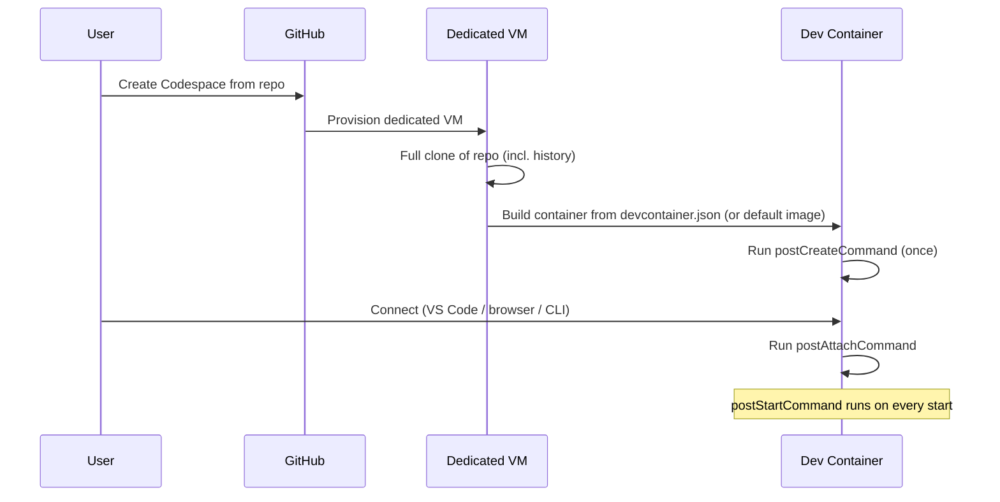
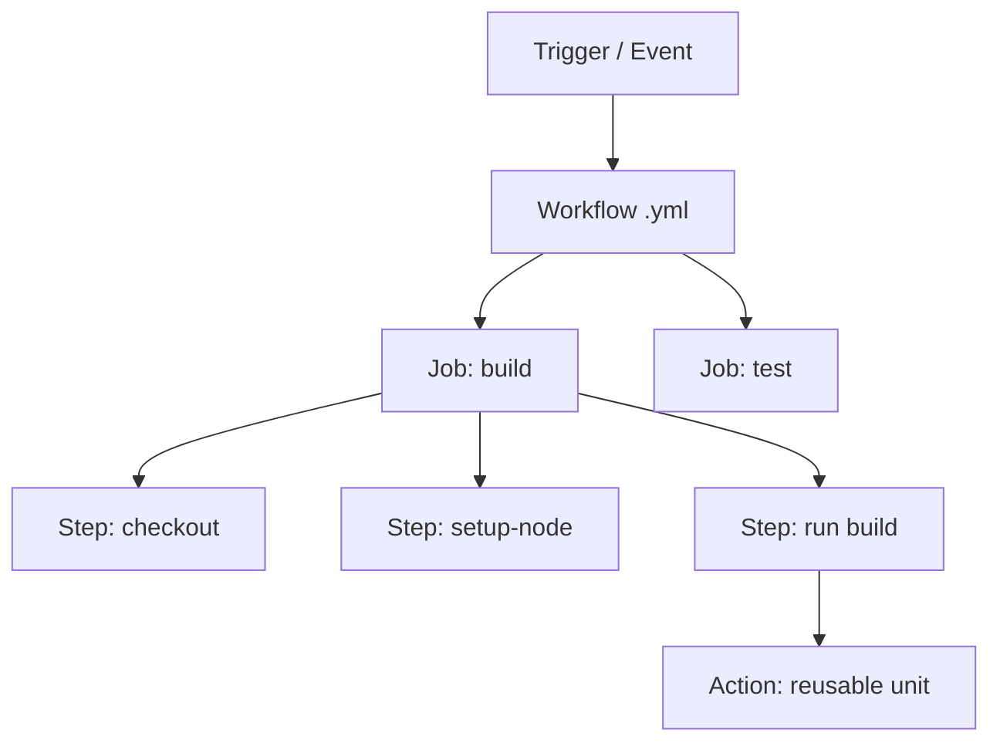
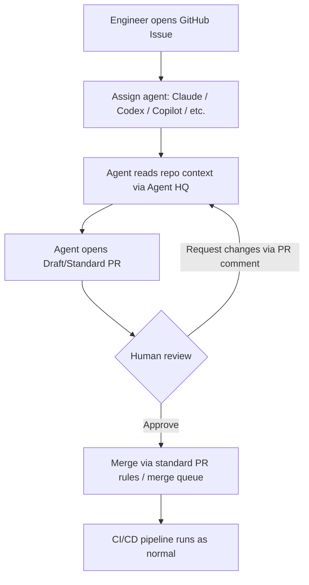

**This is Part 2 of 4. [Continue with Part 3 →](pathname:///archon/agentic-systems/coding-tools/parts/09-git-github-platform-engineering-handbook-part3) for Security, Quality & Governance. [Back to Part 1](pathname:///archon/agentic-systems/coding-tools/09-git-github-platform-engineering-handbook) for Git Foundations.**

# GitHub Platform Depth & CI/CD

Comprehensive coverage of GitHub platform features, documentation hosting, CI/CD automation, and Python engineering toolchain patterns.

---

## PART 6 — GitHub Wiki

### Overview and Use Cases

| Aspect | Detail |
| --- | --- |
| **Architecture** | Git-backed repo (`<repo>.wiki.git`), Markdown pages, cloneable/editable like code |
| **Use cases** | Runbooks, architecture docs, onboarding guides, SOPs |
| **Strength** | Zero extra tooling, versioned, integrated with repo permissions |
| **Weakness** | Weak search, no rich nesting/taxonomy, no diagrams-as-code rendering beyond Mermaid |

### Wiki vs Alternatives

| Tool | Best For | Weakness |
| --- | --- | --- |
| **GitHub Wiki** | Lightweight, repo-scoped docs | Poor cross-repo search/structure |
| **Confluence** | Org-wide structured knowledge base, rich permissions | Separate tool, sync drift from code |
| **Notion** | Flexible docs + databases, great UX | Not git-versioned, harder to enforce as source-of-truth |
| **MkDocs** | Markdown → static docs site, versioned with code | Requires CI/Pages setup |
| **Docusaurus** | Feature-rich docs site (versioning, search, React) | Heavier setup/maintenance |

**Recommendation**: Use MkDocs/Docusaurus + GitHub Pages for product/API docs that need versioning and search; GitHub Wiki for lightweight team runbooks; Confluence/Notion for cross-team org knowledge.

---

## PART 7 — GitHub Pages

### What It Is and Common Uses

| Aspect | Detail |
| --- | --- |
| **What it is** | Free static site hosting directly from a repo (branch or `/docs` folder, or Actions-built artifact) |
| **Common uses** | Product docs, API reference, engineering handbooks, internal developer portals |
| **Static site generators** | Jekyll (native support, no build step needed), MkDocs (Python/Markdown), Docusaurus (React/Markdown) |

### Deployment Workflow


### Minimal MkDocs to Pages Workflow

```yaml
name: Deploy Docs
on:
  push:
    branches: [main]
permissions:
  pages: write
  id-token: write
jobs:
  deploy:
    runs-on: ubuntu-latest
    steps:
      - uses: actions/checkout@v4
      - uses: actions/setup-python@v5
        with:
          python-version: '3.12'
      - run: pip install mkdocs-material
      - run: mkdocs build
      - uses: actions/upload-pages-artifact@v3
        with:
          path: site
      - uses: actions/deploy-pages@v4
```

**When to use**: Public/internal docs that should be versioned alongside code and built via CI. **When not to use**: Anything needing server-side logic, auth-gated content (without extra proxy), or dynamic data.

---

## PART 8 — GitHub Projects

### Core Features and Use Cases

| Feature | Description | Use Case |
| --- | --- | --- |
| **Boards** | Kanban-style columns (To Do / In Progress / Done) | Sprint boards, simple workflow tracking |
| **Tables** | Spreadsheet-like view of issues/PRs with custom fields | Backlog grooming, filtering/sorting at scale |
| **Roadmaps** | Timeline/Gantt-style view | Quarter/release planning |
| **Custom Fields** | Add fields (priority, estimate, team, sprint) to items | Tailor tracking to team's process |
| **Automation (workflows)** | Auto-move items based on PR/issue state changes | Reduce manual board grooming |

### Use Cases

- Sprint planning (board + custom fields for story points)
- Roadmaps (timeline view across milestones)
- Incident tracking (label + project combo for postmortem follow-ups)
- Release tracking (table view filtered by milestone/label)

### Comparison vs Dedicated PM Tools

| Tool | Strength | Weakness vs GitHub Projects |
| --- | --- | --- |
| **Jira** | Mature workflows, extensive reporting, enterprise integrations | Separate from code, sync overhead, cost at scale |
| **Azure Boards** | Deep Azure DevOps integration, enterprise reporting | Best only if already on Azure DevOps |
| **Linear** | Fast UX, opinionated workflows, great keyboard-driven flow | Separate billing/tool, requires GitHub sync for code linkage |
| **Asana** | General-purpose PM, non-eng friendly | Weak code/issue linkage |
| **GitHub Projects** | Native issue/PR linkage, free with GitHub, good for eng-only teams | Less mature reporting/cross-team PM features |

**Recommendation**: GitHub Projects for engineering-only teams wanting tight code/issue coupling without extra tooling/cost. Jira/Linear when product/eng/design need shared cross-functional workflows and richer reporting.

---

## PART 9 — GitHub Packages

### Package Registry Types

| Registry Type | Package Format | Typical Command |
| --- | --- | --- |
| **Container Registry (GHCR)** | OCI/Docker images | `docker push ghcr.io/org/app:tag` |
| **npm** | Node packages | `npm publish --registry=https://npm.pkg.github.com` |
| **PyPI-compatible** | Python packages | `twine upload --repository-url https://pypi.pkg.github.com/...` (via configured index) |
| **Maven** | Java/JVM artifacts | `mvn deploy` (with GitHub Packages repo configured) |
| **NuGet** | .NET packages | `dotnet nuget push --source github` |

### Package Management Strategy Notes

- **Scoping**: GitHub Packages are tied to org/repo permissions — good for internal/private packages shared across an org's repos.
- **Container images**: GHCR is the most commonly adopted (vs Docker Hub) for private images due to unified auth with GitHub Actions (`GITHUB_TOKEN`).
- **Public package registries** (npmjs.com, PyPI, Docker Hub) remain standard for OSS; GitHub Packages typically used for internal/private artifacts.
- **Supply chain**: Pair with SBOM generation and image signing (Cosign) — see Part 19.

---

## PART 10 — GitHub Releases

### Core Concepts

| Concept | Description |
| --- | --- |
| **Tags** | Git tags (usually annotated) mark the exact commit for a release |
| **Release Notes** | Markdown description attached to a tag; can be auto-generated from merged PRs |
| **Changelogs** | Often generated from conventional commits or PR labels |
| **Semantic Versioning** | `MAJOR.MINOR.PATCH` — breaking / feature / fix |
| **Automated Releases** | CI creates tag + release + changelog + artifacts on merge to main or on manual trigger |

### Automated Release Example

```yaml
- uses: softprops/action-gh-release@v2
  with:
    generate_release_notes: true
    files: dist/*.tar.gz
```

**Best practice**: Use Conventional Commits (`feat:`, `fix:`, `chore:`) + `semantic-release` or `release-please` to fully automate version bumps, changelogs, and tagging.

---

## PART 11 — GitHub Codespaces

### What It Is

| Aspect | Detail |
| --- | --- |
| **What it is** | Cloud-hosted, container-based dev environments defined via `.devcontainer/devcontainer.json` |
| **Dev Containers** | Standardized image + tooling/extensions, reproducible across all team members |
| **Prebuilds** | Pre-build the container/dependencies on push so Codespaces start in seconds |
| **Why it exists** | Eliminates "works on my machine", removes local setup friction, enables ephemeral/disposable environments |

### Comparison with Alternatives

| Option | Strength | Weakness |
| --- | --- | --- |
| **Codespaces** | Zero local setup, scales with GitHub permissions, prebuilds | Per-hour cost, requires good devcontainer config |
| **Local Development** | Full control, no usage cost, offline-capable | Environment drift, onboarding friction |
| **Gitpod** | Similar cloud dev-env model, multi-VCS support | Separate billing/platform from GitHub |
| **DevBox (Jetify)** | Reproducible local envs via Nix, no cloud dependency | Still local — doesn't solve "needs powerful cloud compute" |
| **VS Code Remote (SSH/Containers)** | Use existing remote servers/containers, no new platform | Requires you to manage the remote infra yourself |

**When to use**: Onboarding (new hires productive in minutes), short-lived contributions (OSS contributors, contractors), consistent environments for large teams. **When not to use**: Heavy local-hardware-dependent work (GPU-bound ML training without cloud GPU SKUs), cost-sensitive teams with already-standardized local setups.

---

## PART 11b — Dev Containers & Codespaces Deep Dive

### Core Concept

`devcontainer.json` describes a reproducible dev environment — OS image, runtimes, CLIs, editor extensions, env vars, ports, and lifecycle scripts — consumed by VS Code Dev Containers, GitHub Codespaces, JetBrains Gateway, and the standalone `devcontainer` CLI. File is JSONC (comments/trailing commas allowed), lives at `.devcontainer/devcontainer.json`.

### How Codespaces Works (Lifecycle)



Key points:
- No `devcontainer.json` → GitHub uses a default image with many languages/runtimes preinstalled.
- Repo is cloned **before** the container is built — git template-dir hooks won't auto-apply; configure hooks via `postCreateCommand`.
- Public dotfiles repo (if enabled) is cloned into the container and its install script runs automatically.

### Config Building Blocks

| Element | Purpose |
| --- | --- |
| `image` / `build.dockerfile` / `dockerComposeFile` | Base environment definition |
| `features` | Composable add-ons (install CLIs like node, python, gh, terraform without writing Dockerfile RUN lines) |
| `customizations.vscode.extensions` | Auto-install editor extensions |
| `forwardPorts` | Auto-forward container ports to local browser |
| `postCreateCommand` | Runs once after container creation (install deps, seed DB) |
| `postStartCommand` | Runs on every container start |
| `postAttachCommand` | Runs when a client connects/attaches |
| `remoteUser` | User the container runs as |
| `mounts` / storage config | Mount/persist directories from codespace to underlying VM |

### Example Config

```json
{
  "image": "mcr.microsoft.com/devcontainers/python:3.12",
  "features": {
    "ghcr.io/devcontainers/features/node:1": { "version": "20" },
    "ghcr.io/devcontainers/features/github-cli:1": {}
  },
  "postCreateCommand": "pip install -r requirements.txt",
  "forwardPorts": [8000],
  "customizations": {
    "vscode": { "extensions": ["ms-python.python", "charliermarsh.ruff"] }
  }
}
```

### Adding Features

Edit `devcontainer.json` directly, or in VS Code: Command Palette → "Codespaces: Add Dev Container Configuration Files" → browse Features marketplace → commit. New codespaces pick up changes automatically; existing codespaces require pull + rebuild.

### Collaboration & Enterprise Notes

| Capability | Detail |
| --- | --- |
| **Live collaboration** | Multiple devs can join the same running codespace for simultaneous editing/debugging — useful for pairing, live PR review |
| **Persistent storage** | Configure mounts to persist specific directories on the underlying VM across rebuilds |
| **Data residency** | Enterprise Codespaces infrastructure supports regional data-residency compliance requirements |
| **Prebuilds** | Pre-build the container image on push so new codespaces start in seconds instead of minutes |

### When to Use vs Not

| Use Codespaces / Dev Containers when | Avoid / reconsider when |
| --- | --- |
| Onboarding speed matters (new hires productive in minutes) | Heavy local-hardware-bound work (GPU training without cloud GPU SKUs) |
| Team suffers "works on my machine" drift | Already-standardized local setups with low drift, cost-sensitive |
| OSS/contractor contributors need disposable environments | Strict offline-development requirements |
| Same config should work locally (VS Code Dev Containers) and in cloud (Codespaces) for full parity | — |

---

## PART 12 — GitHub CLI (`gh`)

### Installation and Authentication

| Aspect | Detail |
| --- | --- |
| **Installation** | `brew install gh` / `winget install GitHub.cli` / apt/dnf packages |
| **Authentication** | `gh auth login` (browser or token-based), `gh auth status` |
| **Architecture** | Thin wrapper over GitHub REST/GraphQL APIs + git; extensible via `gh extension` |

### Core Commands

| Command | Purpose | When to Use |
| --- | --- | --- |
| `gh repo create` | Create new repo (local+remote) | New project bootstrap |
| `gh repo clone` | Clone with auth handled | Standard clone shortcut |
| `gh issue create` / `gh issue list` | Manage issues from terminal | Triage without context-switching to browser |
| `gh pr create` | Open PR from current branch | After pushing feature branch |
| `gh pr view` | View PR details/diff | Review in terminal |
| `gh pr merge` | Merge a PR | Finalize after approval |
| `gh workflow list` | List Actions workflows | Check available CI workflows |
| `gh run list` / `gh run view` | List/inspect workflow runs | Debug CI from terminal |
| `gh release create` | Create a release + upload assets | Release automation/scripting |

### Automation Example

```bash
# Create issue, then PR referencing it, then watch CI
gh issue create --title "Fix login bug" --body "Repro steps..."
gh pr create --fill --base main
gh run watch
```

---

## PART 13 — GitHub Actions Complete Guide

### Core Concept Hierarchy



### Key Concepts

| Concept | Description | When to Use |
| --- | --- | --- |
| **Workflow** | YAML file in `.github/workflows/`, triggered by events | One per pipeline (CI, release, deploy) |
| **Job** | Group of steps on one runner; jobs run in parallel by default | Split build/test/deploy stages |
| **Step** | Single command or action invocation | Smallest unit of execution |
| **Action** | Reusable packaged step (Docker, JS, or composite) | Don't reinvent common tasks (checkout, setup-lang) |
| **Composite Action** | Bundle multiple steps into one reusable action | Share multi-step logic across workflows/repos |
| **Reusable Workflow** | Entire workflow called via `workflow_call` | Standardize CI across many repos org-wide |
| **Matrix Builds** | Run job across combinations (OS x version x ...) | Test across multiple environments |
| **Artifacts** | Files passed between jobs / downloadable after run | Build outputs, test reports, coverage |
| **Secrets** | Encrypted values (org/repo/environment scoped) | API keys, credentials (prefer OIDC where possible) |
| **Variables** | Non-secret config values (org/repo/environment) | Feature flags, environment names |
| **Environments** | Named deployment targets w/ protection rules | Require approval before prod deploy |
| **Self-hosted Runners** | Your own compute instead of GitHub-hosted | Special hardware, network access, cost control |
| **OIDC Authentication** | Short-lived cloud credentials via token exchange, no stored secrets | AWS/Azure/GCP deploys (see Part 22) |

### Trigger Reference

| Trigger | When to Use |
| --- | --- |
| `push` | Run on commits to specified branches |
| `pull_request` | CI checks on PRs (tests, lint, security scans) |
| `schedule` (cron) | Nightly builds, scheduled cleanup/reports |
| `workflow_dispatch` | Manual trigger from UI/API with inputs |
| `release` | Run when a release is published |
| `workflow_call` | Make workflow reusable/callable by others |

---

## PART 14 — Most Common GitHub Actions

| Action | Purpose | Popularity | Enterprise Usage | Alternatives |
| --- | --- | --- | --- | --- |
| `actions/checkout` | Clone repo into runner | Near-universal (first step in ~all workflows) | Standard everywhere | N/A |
| `actions/cache` | Cache deps/build outputs between runs | Very high | Speeds up CI cost & time at scale | `actions/setup-*` built-in caching |
| `actions/setup-python` | Install/configure Python | Very high | Pin versions org-wide via reusable workflows | `uv`-based setup |
| `actions/setup-node` | Install/configure Node.js | Very high | Same as above for JS/TS | `volta`, manual install |
| `actions/setup-java` | Install/configure JDK | High (JVM shops) | Standardize JDK versions | `sdkman`-based setup |
| `docker/build-push-action` | Build & push Docker images | Very high | Combine with GHCR/ECR + Cosign signing | `kaniko`, manual docker CLI |
| `github/codeql-action` | SAST scanning (CodeQL) | High (Advanced Security users) | Required in regulated orgs | Semgrep, SonarQube |
| `aws-actions/configure-aws-credentials` | OIDC-based AWS auth | High (AWS shops) | Replaces long-lived AWS keys | Static `AWS_ACCESS_KEY_ID` secrets (discouraged) |
| `azure/login` | OIDC-based Azure auth | High (Azure shops) | Same pattern for Azure | Service principal secrets (discouraged) |
| `google-github-actions/auth` | OIDC-based GCP auth | High (GCP shops) | Same pattern for GCP | Service account key JSON (discouraged) |

---

## PART 14b — AI Agent Platforms on GitHub (2026)

> Landscape moves fast — verify current state via GitHub docs before relying on specifics below.

### GitHub Agent HQ

| Aspect | Detail |
| --- | --- |
| **What it is** | A platform feature for orchestrating AI agents from multiple providers (OpenAI, Anthropic, Google, custom) directly inside GitHub, acting as a unified control center. |
| **Status** | Launched in public preview across GitHub, GitHub Mobile, and VS Code for Copilot subscribers, integrating Claude and Codex alongside Copilot. |
| **Core value prop** | Removes multi-day setup friction by embedding agent context directly in the platform, and shifts the question from "which single AI assistant is best" to "how does a fleet of agents improve the whole workflow." |
| **Primary workflow** | Open or create a GitHub issue describing the task, pick an agent, and a PR appears — typically within 5–20 minutes depending on agent and task complexity. You can also direct an agent via PR comment to make follow-up changes. |
| **PR transparency** | Agent-authored PRs are clearly marked with the agent's identity, include a full run trace of tool calls/files/commands, a token/cost summary, and signed commits. |
| **Governance controls** | Org admins can require human approval before agents push to protected branches, allow/restrict draft PRs from agents, and set other guardrails under Copilot → Agent HQ settings. |
| **Ecosystem direction** | Additional agents (e.g., Google's Jules, Cognition's Devin, xAI) are being integrated, alongside a Copilot Metrics Dashboard (public preview) for comparing agent performance, and an MCP Registry in VS Code connecting agents to external tools like Stripe, Figma, and Sentry. |

### Agent HQ Workflow Diagram



Local interaction with an agent-authored PR:

```bash
gh pr checkout 42        # check out the agent's branch
npm install && npm test  # validate locally
# Leave a follow-up instruction as a PR comment for the agent to act on
```

### GitHub Copilot — 2026 Capability Map

| Capability | Description | Plan Tier |
| --- | --- | --- |
| **Inline completions** | Original autocomplete feature — single-line, multi-line, and full-function suggestions as you type | All tiers |
| **Coding Agent** | Fully autonomous PR creation from an assigned issue/task | Pro+/Enterprise (via Agent HQ) |
| **Agentic Code Review** | Gathers full project context before suggesting changes, and can pass suggestions to the coding agent to generate fix PRs automatically | Higher tiers |
| **GitHub Spark** | Natural-language app building — describe an app in plain English and get generated code with a live preview | Pro+ ($39/month) and Enterprise ($39/user/month) |
| **Semantic code search** | Context-aware search across codebase semantics, not just text | Higher tiers |
| **IDE breadth** | Available across more platforms than competitors — VS Code, JetBrains IDEs, Eclipse, Xcode, etc. | Varies by tier |

### GitHub Spark — When to Use

- **Use for**: rapid prototyping of internal tools, proof-of-concept UIs, "idea to working prototype" bridging for non-specialist builders.
- **Don't use for**: production-grade systems without subsequent engineering review — generated apps still need standard code review, security scanning (Part 18), and CI/CD onboarding like any other code.
- **Workflow fit**: Spark output should land in a normal repo/PR flow — treat it as a fast-start scaffold, not a bypass of platform engineering controls.

### Multi-Agent Decision Matrix

| Need | Recommended Approach |
| --- | --- |
| Autonomous PR for well-scoped issue | Assign via Agent HQ to coding agent (Copilot/Claude/Codex) |
| Deep reasoning / complex refactor across files | Claude (via Agent HQ or Claude Code directly) |
| Fast prototype / internal tool from a description | GitHub Spark, then promote to standard repo workflow |
| Org-wide agent performance comparison | Copilot Metrics Dashboard |
| Connect agents to external SaaS (Stripe, Figma, Sentry) | MCP Registry (VS Code) |
| Compliance/governance over agent actions | Agent HQ org settings: required human approval, branch protection, audit logging |

**Security note**: Agent-authored commits being signed and run-traced directly support the supply-chain and audit requirements covered in Parts 19–21 — treat agent identity like any other CI identity requiring least-privilege scoping.

---

## PART 15 — Python Engineering Toolchain

### Dependency Management

| Tool | Strength | Weakness | Recommendation |
| --- | --- | --- | --- |
| **uv** | Extremely fast (Rust-based), drop-in for pip/venv/poetry workflows, lockfiles | Newer, smaller ecosystem of guides | **Default choice for new projects (2025–2026)** |
| **Poetry** | Mature, lockfile + packaging in one tool, good dependency resolution | Slower than uv, occasional resolver edge cases | Solid if already adopted; migrate to uv opportunistically |
| **pip** | Universal, simplest, always available | No lockfile by default, manual venv management | Fine for scripts/simple cases; pair with `pip-tools` for repeatability |
| **pip-tools** | Adds lockfiles (`requirements.in` → `.txt`) on top of pip | Two-file workflow, manual venv | Lightweight upgrade path from raw pip |
| **PDM** | PEP 582/621 native, fast | Smaller community vs Poetry/uv | Niche choice; uv generally preferred now |

### uv Quickstart

```bash
uv init myproject
uv add requests
uv run python main.py
uv lock && uv sync
```

### Formatting

| Tool | Command | Notes |
| --- | --- | --- |
| **Black** | `black .` / `black --check .` | Opinionated, zero-config formatter — standard default |
| **isort** | `isort .` | Import sorting; often run via Ruff instead now |

### Linting

| Tool | Command | Comparison |
| --- | --- | --- |
| **Ruff** | `ruff check .` / `ruff check . --fix` | Rust-based, extremely fast, replaces Flake8 + isort + many plugins; **2025–2026 default** |
| **Flake8** | `flake8 .` | Mature, plugin ecosystem, slower; largely superseded by Ruff |
| **Pylint** | `pylint src/` | Deepest static analysis (design/convention checks), slowest, noisiest by default |

### Linting Tool Comparison

| Criterion | Ruff | Flake8 | Pylint |
| --- | --- | --- | --- |
| Speed | Very fast | Moderate | Slow |
| Config simplicity | High | Moderate | Low (verbose) |
| Depth of checks | High (growing) | Moderate (plugin-dependent) | Very high |
| Recommended role | Primary linter+formatter helper | Legacy/incremental migration | Supplementary deep-analysis pass |

### Type Checking

| Tool | Performance | Accuracy | IDE Integration |
| --- | --- | --- | --- |
| **MyPy** | Moderate | High, most mature type-checking rules | Good (most editors) |
| **Pyright** | Fast (incremental, used by Pylance) | High, excellent inference | Best-in-class in VS Code |

**Recommendation**: Pyright/Pylance for editor feedback (fast, incremental); MyPy in CI for strict, repo-wide enforcement (`mypy .`).

### Testing — Pytest

| Command | Purpose |
| --- | --- |
| `pytest` | Run all tests |
| `pytest -v` | Verbose output |
| `pytest --cov` | With coverage (requires `pytest-cov`) |
| `pytest -k "pattern"` | Run tests matching name pattern |
| `pytest -x` | Stop on first failure |

### Testing Concepts

| Concept | Description |
| --- | --- |
| **Unit Tests** | Isolated, fast, no external dependencies |
| **Integration Tests** | Test interactions across components/services |
| **Fixtures** | Reusable setup/teardown (`@pytest.fixture`) |
| **Mocking** | Replace dependencies (`unittest.mock`, `pytest-mock`) |
| **Parameterization** | `@pytest.mark.parametrize` — run same test with multiple inputs |

### Coverage

```bash
coverage run -m pytest
coverage report
coverage html   # generate browsable report
```

### Documentation

| Tool | Best For |
| --- | --- |
| **MkDocs** | Markdown-based docs, fast setup, Material theme popular |
| **Sphinx** | Auto-generated API docs from docstrings, reStructuredText, long-standing standard for libraries |

### Packaging

| Tool | Command | Notes |
| --- | --- | --- |
| **build** | `python -m build` | PEP 517 standard build frontend |
| **hatch** | `hatch build` | Modern project management + packaging |
| **poetry build** | `poetry build` | If using Poetry for deps |
| **uv build** | `uv build` | If using uv for deps — fastest, consistent toolchain |

---

**This is Part 2 of 4. [Continue with Part 3 →](pathname:///archon/agentic-systems/coding-tools/parts/09-git-github-platform-engineering-handbook-part3) for Security, Quality & Governance. [Back to Part 1](pathname:///archon/agentic-systems/coding-tools/09-git-github-platform-engineering-handbook) for Git Foundations.**
