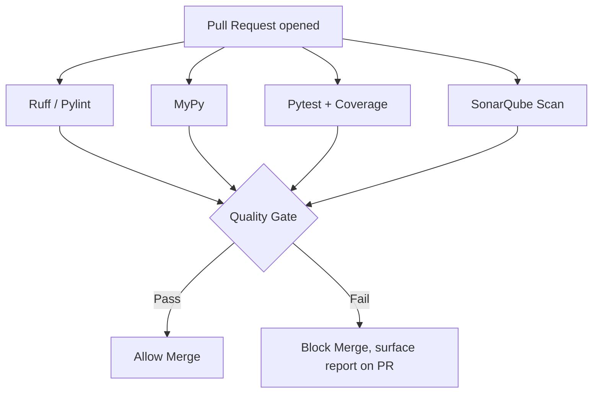
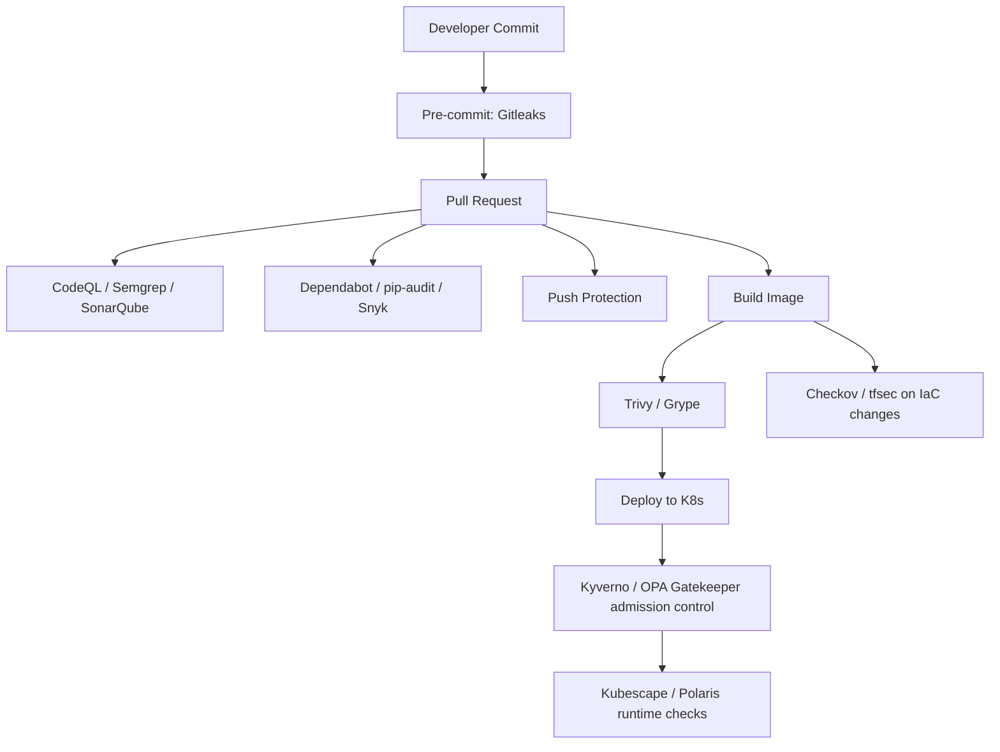
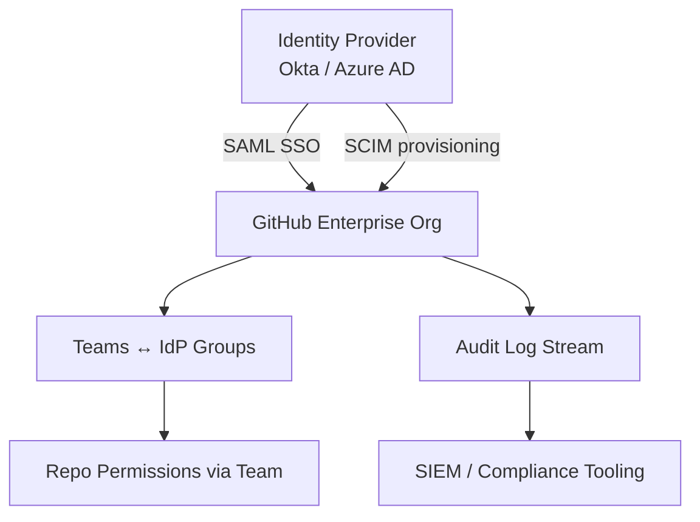
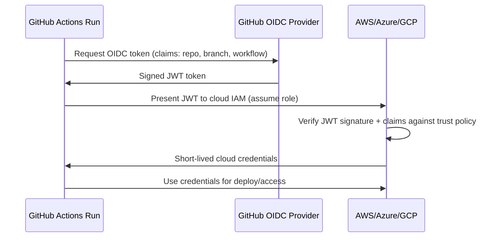
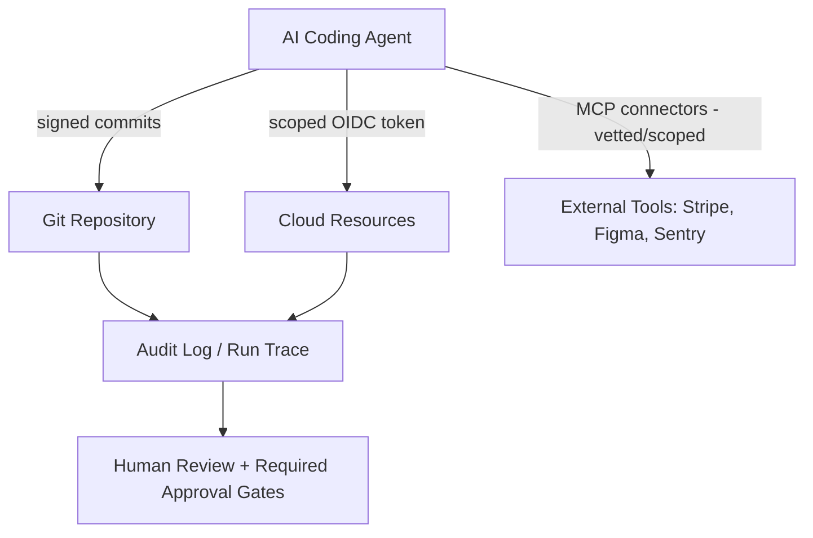

**This is Part 3 of 4. [Continue with Part 4 →](pathname:///archon/agentic-systems/coding-tools/parts/09-git-github-platform-engineering-handbook-part4) for Enterprise Scale, Governance & Metrics. [Back to Part 2](pathname:///archon/agentic-systems/coding-tools/parts/09-git-github-platform-engineering-handbook-part2) for Platform Depth & CI/CD.**

# Security, Quality & Governance

Comprehensive coverage of code quality, security scanning, supply chain integrity, compliance frameworks, and governance patterns for enterprise GitHub deployments.

---

## PART 16 — Software Quality Engineering

| Concept | Description | Tooling |
| --- | --- | --- |
| **Code Quality** | Adherence to style, conventions, complexity limits | Ruff, Pylint |
| **Technical Debt** | Accumulated cost of shortcuts/suboptimal code | SonarQube debt ratio metric |
| **Maintainability** | Ease of future modification (complexity, duplication) | SonarQube maintainability rating |
| **Reliability** | Likelihood of bugs in production | SonarQube reliability rating, test coverage |
| **Test Coverage** | Percentage of code exercised by tests | `coverage.py`, Codecov |
| **Quality Gates** | Pass/fail criteria blocking merge/release | SonarQube Quality Gate, CI required checks |

### Quality Gate Strategy



**Best practice**: Start gates as "warn only" on existing codebases (avoid blocking on pre-existing debt), then ratchet to "blocking on new code" (SonarQube's "new code" period concept) before full-repo enforcement.

---

## PART 17 — SonarQube Deep Dive

### Architecture and Capabilities

| Aspect | Detail |
| --- | --- |
| **Architecture** | Server (web UI + DB) + Scanner (CLI/CI plugin) that analyzes code and uploads results |
| **Scanners** | `sonar-scanner` CLI, language-specific (Maven/Gradle/.NET/JS) integrations |
| **Quality Gates** | Configurable pass/fail conditions (e.g., coverage on new code >= 80%, zero new bugs) |
| **Security Hotspots** | Code patterns needing manual security review (not auto-fail, but flagged) |
| **Coverage** | Imported from test tool reports (e.g., `coverage.xml`) |
| **Duplication** | Percentage of duplicated code blocks |
| **Technical Debt** | Estimated remediation time for all issues |

### Key Metrics

| Metric | What It Measures |
| --- | --- |
| **Bugs** | Code that is demonstrably wrong / will misbehave |
| **Vulnerabilities** | Exploitable security weaknesses |
| **Code Smells** | Maintainability issues (not bugs, but bad practice) |
| **Reliability Rating** | A–E based on bug severity/density |
| **Security Rating** | A–E based on vulnerability severity/density |
| **Maintainability Rating** | A–E based on technical debt ratio |

### SonarQube Scan in GitHub Actions

```yaml
# Example: SonarQube scan in GitHub Actions
- uses: SonarSource/sonarqube-scan-action@v4
  env:
    SONAR_TOKEN: ${{ secrets.SONAR_TOKEN }}
    SONAR_HOST_URL: ${{ secrets.SONAR_HOST_URL }}
- uses: SonarSource/sonarqube-quality-gate-action@v1
  timeout-minutes: 5
  env:
    SONAR_TOKEN: ${{ secrets.SONAR_TOKEN }}
```

---

## PART 18 — DevSecOps Toolchain

### Toolchain by Category

| Category | Tools | Purpose |
| --- | --- | --- |
| **SAST** | CodeQL, Semgrep, SonarQube | Find vulnerable code patterns via static analysis |
| **Dependency Scanning** | Dependabot, Snyk, pip-audit, Safety | Detect known-vulnerable dependencies (CVEs) |
| **Secret Detection** | GitHub Secret Scanning, Push Protection, Gitleaks, TruffleHog | Catch committed credentials/keys |
| **Container Security** | Trivy, Grype | Scan container images for CVEs/misconfig |
| **Infrastructure Security** | Checkov, tfsec, Terrascan | Scan IaC (Terraform/CloudFormation) for misconfig |
| **Kubernetes Security** | Kubescape, Polaris, Kyverno, OPA Gatekeeper | Cluster config/policy enforcement |

### Pipeline Architecture



### Tool Selection Notes

| Decision | Guidance |
| --- | --- |
| CodeQL vs Semgrep | CodeQL: deep semantic analysis, GitHub-native, free for public repos, part of GHAS (cost for private). Semgrep: faster, simpler rules, easier custom rule authoring, good OSS tier. |
| Gitleaks vs TruffleHog | Both scan for secrets; Gitleaks is lighter/faster for CI; TruffleHog adds verification (checks if found secrets are *live*). |
| Trivy vs Grype | Both solid for container/image CVE scanning; Trivy also covers IaC/SBOM/secret scanning in one tool — often preferred for breadth. |
| Kyverno vs OPA/Gatekeeper | Kyverno: Kubernetes-native YAML policies, easier to author. OPA/Gatekeeper: Rego-based, more powerful/general but steeper learning curve. |

### Example: Trivy Container Scan

```yaml
- uses: aquasecurity/trivy-action@v0
  with:
    image-ref: 'myorg/myapp:${{ github.sha }}'
    severity: 'CRITICAL,HIGH'
    exit-code: '1'
```

---

## PART 19 — Supply Chain Security

### Key Concepts

| Concept | Description | Tooling |
| --- | --- | --- |
| **SBOM** (Software Bill of Materials) | Inventory of all components/dependencies in a build | Syft (generate), formats: SPDX, CycloneDX |
| **SPDX / CycloneDX** | Standard SBOM formats | Interchangeable via Syft/other generators |
| **Cosign / Sigstore** | Sign & verify container images and artifacts | `cosign sign`, `cosign verify` |
| **SLSA Levels 1–4** | Supply-chain integrity framework — increasing build provenance guarantees | Self-assessed or via attestation tooling |
| **Dependency Confusion** | Attack: malicious package with same name as internal/private package gets installed from public registry | Scoped package names, private registry priority config |
| **Typosquatting** | Attack: malicious package named similarly to popular package | Dependency pinning, lockfiles, automated scanning (pip-audit/Snyk) |
| **Malicious Packages** | Compromised/intentionally malicious published packages | SCA tools, lockfile review, minimal dependency footprint |

### SLSA Levels Summary

| Level | Requirement Summary |
| --- | --- |
| **SLSA 1** | Build process documented, provenance exists |
| **SLSA 2** | Provenance generated by build service, tamper-resistant |
| **SLSA 3** | Hardened build platform, provenance non-falsifiable |
| **SLSA 4** | Two-person review of all changes, hermetic/reproducible builds |

### SBOM Generation and Image Signing

```bash
# SBOM generation + image signing example
syft myorg/myapp:latest -o cyclonedx-json > sbom.json
cosign sign --key cosign.key myorg/myapp:latest
cosign verify --key cosign.pub myorg/myapp:latest
```

**Real-world relevance**: Incidents like the `event-stream`/`ua-parser-js`/`xz-utils` compromises illustrate why SBOM + signing + SCA scanning are now baseline requirements in regulated and enterprise software supply chains.

---

## PART 20 — GitHub Advanced Security (GHAS)

### Feature Overview

| Feature | Description | Cost/Licensing Note |
| --- | --- | --- |
| **CodeQL** | Semantic SAST | Free for public repos; licensed per-committer for private repos under GHAS |
| **Dependabot** | Automated dependency update PRs + vulnerability alerts | Free for all repos (alerts); update PRs free |
| **Secret Scanning** | Detects committed secrets across history | Free alerts for public repos; GHAS for private |
| **Push Protection** | Blocks pushes containing detected secrets | Part of Secret Scanning (GHAS for private repos) |
| **Dependency Review** | PR-time diff of dependency changes + vuln info | GHAS feature for private repos |
| **Security Campaigns** | Org-wide tracked remediation initiatives for vuln backlogs | GHAS Enterprise feature |
| **Security Overview** | Org/repo-level dashboard of security posture | GHAS |

**Enterprise adoption**: GHAS licensing is typically per active committer; cost-justify by prioritizing rollout on internet-facing/high-risk repos first, then expanding. Combine with CODEOWNERS-enforced review of security findings.

---

## PART 21 — Identity, Governance & Compliance

### Key Concepts

| Concept | Description | Enterprise Pattern |
| --- | --- | --- |
| **SAML SSO** | Org authentication delegated to external IdP (Okta, Azure AD, etc.) | Required for most enterprise plans; enforced org-wide |
| **SCIM** | Automated user provisioning/deprovisioning from IdP | New hires auto-get GitHub access; offboarding auto-revokes |
| **Enterprise Managed Users (EMU)** | GitHub accounts fully owned/controlled by the enterprise (no personal account crossover) | High-compliance orgs (finance, gov, healthcare) |
| **RBAC** | Role-based access: org owner, member, team maintainer, repo admin/write/read | Map roles to least-privilege needs per repo/team |
| **Audit Logs** | Record of admin/security-relevant actions org-wide | SIEM integration, compliance evidence (SOC2, ISO27001) |
| **Compliance Reporting** | Exportable evidence of access controls, branch protections, review enforcement | Audits — pair with required-review + CODEOWNERS history |

### Enterprise Identity Architecture



**Best practice**: Map GitHub Teams 1:1 to IdP groups via SCIM so access changes happen at the IdP, not in GitHub directly — single source of truth for joiner/mover/leaver processes.

---

## PART 22 — OIDC and Secretless Authentication

### Traditional Secrets vs OIDC

| Aspect | Long-lived Secrets | OIDC (Token Exchange) |
| --- | --- | --- |
| **Storage** | Static keys stored in GitHub Secrets | Nothing stored — short-lived token issued per run |
| **Rotation** | Manual/periodic | Automatic (tokens expire in minutes) |
| **Blast radius if leaked** | High — valid until rotated | Low — expires almost immediately, scoped to one run |
| **Setup complexity** | Low (paste a key) | Moderate (configure trust relationship/IdP federation) |

### How OIDC Works



### Provider Setup Patterns

| Cloud | Mechanism | Action |
| --- | --- | --- |
| **AWS** | IAM OIDC Identity Provider + IAM Role trust policy scoped to repo/branch | `aws-actions/configure-aws-credentials` |
| **Azure** | Federated credentials on App Registration | `azure/login` with `client-id`/`tenant-id`/`subscription-id` |
| **GCP** | Workload Identity Federation pool + provider | `google-github-actions/auth` |

### AWS OIDC Example

```yaml
permissions:
  id-token: write
  contents: read
steps:
  - uses: aws-actions/configure-aws-credentials@v4
    with:
      role-to-assume: arn:aws:iam::123456789012:role/github-actions-deploy
      aws-region: us-east-1
```

**Best practice**: Scope cloud IAM trust policies to specific repo + branch + environment claims (not just "any token from this GitHub org") to prevent lateral movement via forked-repo PR workflows.

---

## PART 23 — GitHub Copilot and AI Development

> Core Agent HQ / Copilot / Spark coverage lives in Part 14b. This section covers the remaining comparison/landscape items.

### Copilot CLI & Coding Agent Commands

| Command | Purpose |
| --- | --- |
| `gh copilot suggest` | Suggest a shell command for a described task |
| `gh copilot explain` | Explain what a given shell command does |

### AI Coding Tool Landscape Comparison

| Tool | Interface | Strength | Best Fit |
| --- | --- | --- | --- |
| **GitHub Copilot** | IDE-embedded (broadest IDE support), Agent HQ | Inline completions, agentic PR review, ecosystem breadth | Teams standardized on GitHub + multiple IDEs |
| **Claude Code** | Terminal-based agent | Deep reasoning, multi-file refactors, strong tool-use | Complex refactors, agentic terminal workflows |
| **ChatGPT (Codex)** | Web/IDE, Agent HQ | General-purpose + autonomous coding agent | Broad task range, available via Agent HQ |
| **Gemini CLI** | Terminal-based agent | Google ecosystem integration | GCP-heavy environments |
| **Aider** | Terminal, git-native pair programming | Lightweight, direct git integration, model-agnostic | Devs wanting minimal-overhead AI pairing in git repos |
| **Cline** | VS Code extension, agentic | Autonomous file edits + terminal commands inside editor | VS Code users wanting agent-in-editor without full Agent HQ |
| **OpenCode** | Terminal-based, open source | Model-agnostic, self-hostable | Orgs wanting open-source/self-hosted agent tooling |

**Decision guidance**: Most orgs in 2026 don't pick one tool — Agent HQ explicitly supports running multiple agents side-by-side on the same issue/PR for comparison (see Part 14b). Standardize on *governance* (required approvals, signed commits, audit logging) rather than a single agent.

---

## PART 24 — AI Security

### Risk Categories

| Risk | Description | Mitigation |
| --- | --- | --- |
| **Prompt Injection** | Malicious instructions embedded in content the AI processes (issue text, file contents, web pages) override intended behavior | Treat all external content as untrusted data, not instructions; sandbox agent actions; require human approval for sensitive operations |
| **Tool Abuse** | Agent misuses available tools (e.g., excessive API calls, destructive file operations) | Least-privilege tool scoping, dry-run modes, rate limits |
| **Agent Security** | Autonomous agents with repo/cloud access become high-value attack targets/vectors | Signed commits, scoped credentials (OIDC), audit trails (Part 14b) |
| **MCP Security** | Model Context Protocol connects agents to external tools/data — each connector expands attack surface | Vet MCP servers, scope permissions per-connector, monitor usage |
| **RAG Security** | Retrieval-augmented generation can leak sensitive indexed data or be poisoned via injected documents | Access-control retrieval at the same level as source data; sanitize ingested content |
| **Data Leakage** | Sensitive code/secrets sent to external AI providers | Review data-handling/training-opt-out policies, use enterprise tiers with zero-retention guarantees |

### AI Security Testing Tools

| Tool | Purpose |
| --- | --- |
| **Promptfoo** | Test/eval prompts and LLM app outputs for regressions, security issues |
| **Garak** | LLM vulnerability scanner (probes for prompt injection, jailbreaks, etc.) |
| **Lakera** | Real-time prompt injection / AI guardrail detection |
| **Protect AI** | ML/AI supply chain security (model scanning, MLSecOps) |

### Agent Security Architecture



**Best practice**: Apply the same supply-chain rigor to AI agents as to any CI identity — least privilege, short-lived credentials, full audit trail, and mandatory human approval before agent-authored changes touch protected branches or production infrastructure.

---

**This is Part 3 of 4. [Continue with Part 4 →](pathname:///archon/agentic-systems/coding-tools/parts/09-git-github-platform-engineering-handbook-part4) for Enterprise Scale, Governance & Metrics. [Back to Part 2](pathname:///archon/agentic-systems/coding-tools/parts/09-git-github-platform-engineering-handbook-part2) for Platform Depth & CI/CD.**
