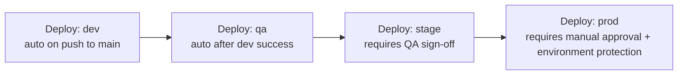
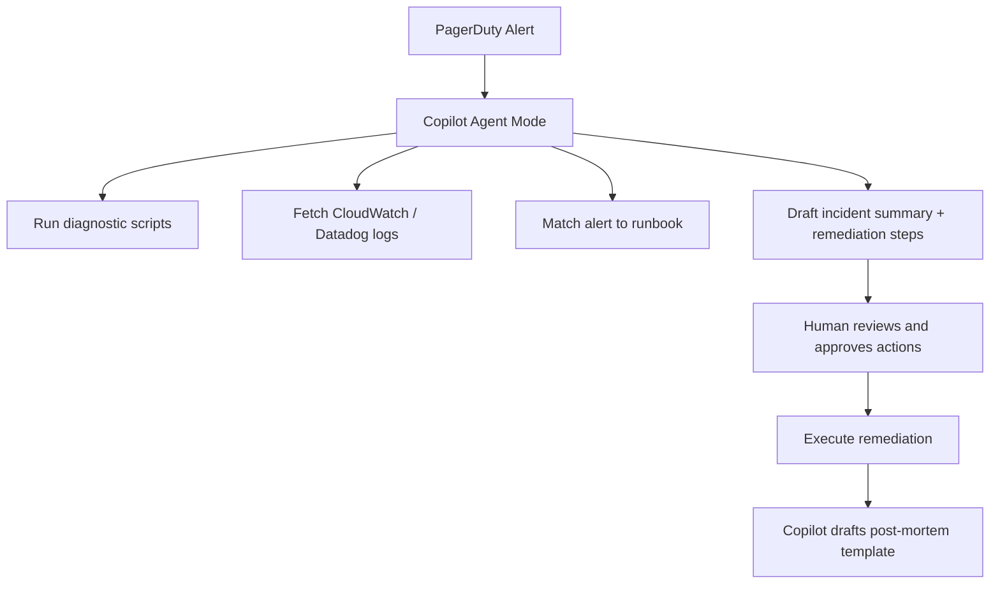
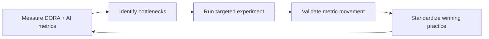

**This is Part 4 of 4 — the final part. [Back to Part 3](pathname:///archon/agentic-systems/coding-tools/parts/09-git-github-platform-engineering-handbook-part3) for Security, Quality & Governance. [Back to Part 1](pathname:///archon/agentic-systems/coding-tools/09-git-github-platform-engineering-handbook) for Git Foundations.**

# Enterprise Scale, Governance & Metrics

Complete production workflows, enterprise governance patterns, Copilot at scale, AI-assisted platform engineering, and metrics frameworks for measuring platform engineering success.

---

## PART 25 — Complete Production GitHub Actions Workflows

### Python CI (Ruff, Black, MyPy, Pytest, Coverage)

```yaml
name: Python CI
on:
  pull_request:
  push:
    branches: [main]

jobs:
  ci:
    runs-on: ubuntu-latest
    steps:
      - uses: actions/checkout@v4
      - uses: astral-sh/setup-uv@v3
      - run: uv sync
      - run: uv run ruff check .
      - run: uv run black --check .
      - run: uv run mypy .
      - run: uv run pytest --cov --cov-report=xml
      - uses: codecov/codecov-action@v4
        with:
          files: coverage.xml
```

### Python DevSecOps (Bandit, Semgrep, pip-audit, Trivy, Gitleaks, CodeQL, SonarQube)

```yaml
name: Python DevSecOps
on:
  pull_request:

jobs:
  security:
    runs-on: ubuntu-latest
    permissions:
      contents: read
      security-events: write
    steps:
      - uses: actions/checkout@v4
        with: { fetch-depth: 0 }

      - name: Gitleaks (secret scan)
        uses: gitleaks/gitleaks-action@v2

      - name: Bandit (Python SAST)
        run: |
          pip install bandit
          bandit -r src/ -f json -o bandit-report.json

      - name: Semgrep
        uses: returntocorp/semgrep-action@v1

      - name: pip-audit (dependency CVEs)
        run: |
          pip install pip-audit
          pip-audit

      - name: CodeQL Init
        uses: github/codeql-action/init@v3
        with: { languages: python }
      - name: CodeQL Analyze
        uses: github/codeql-action/analyze@v3

      - name: SonarQube Scan
        uses: SonarSource/sonarqube-scan-action@v4
        env:
          SONAR_TOKEN: ${{ secrets.SONAR_TOKEN }}

  container-scan:
    runs-on: ubuntu-latest
    steps:
      - uses: actions/checkout@v4
      - run: docker build -t myapp:${{ github.sha }} .
      - uses: aquasecurity/trivy-action@v0
        with:
          image-ref: myapp:${{ github.sha }}
          severity: 'CRITICAL,HIGH'
          exit-code: '1'
```

### Docker Build & Push (GHCR + Cosign)

```yaml
name: Docker Build
on:
  push:
    branches: [main]

permissions:
  contents: read
  packages: write
  id-token: write   # for keyless cosign signing

jobs:
  build:
    runs-on: ubuntu-latest
    steps:
      - uses: actions/checkout@v4
      - uses: docker/login-action@v3
        with:
          registry: ghcr.io
          username: ${{ github.actor }}
          password: ${{ secrets.GITHUB_TOKEN }}
      - uses: docker/build-push-action@v6
        id: build
        with:
          push: true
          tags: ghcr.io/${{ github.repository }}:${{ github.sha }}
      - name: Sign image (keyless)
        run: |
          cosign sign --yes ghcr.io/${{ github.repository }}@${{ steps.build.outputs.digest }}
```

### Kubernetes Deploy (OIDC + Helm)

```yaml
name: Deploy to EKS
on:
  workflow_dispatch:

permissions:
  id-token: write
  contents: read

jobs:
  deploy:
    runs-on: ubuntu-latest
    environment: production
    steps:
      - uses: actions/checkout@v4
      - uses: aws-actions/configure-aws-credentials@v4
        with:
          role-to-assume: arn:aws:iam::123456789012:role/github-actions-eks
          aws-region: us-east-1
      - run: aws eks update-kubeconfig --name prod-cluster
      - run: helm upgrade --install myapp ./chart --set image.tag=${{ github.sha }}
```

### Terraform Plan/Apply

```yaml
name: Terraform
on:
  pull_request:
  push:
    branches: [main]

permissions:
  id-token: write
  contents: read
  pull-requests: write

jobs:
  terraform:
    runs-on: ubuntu-latest
    steps:
      - uses: actions/checkout@v4
      - uses: aws-actions/configure-aws-credentials@v4
        with:
          role-to-assume: arn:aws:iam::123456789012:role/github-actions-terraform
          aws-region: us-east-1
      - uses: hashicorp/setup-terraform@v3
      - run: terraform init
      - run: terraform validate
      - run: tfsec .
      - run: terraform plan -out=tfplan
      - if: github.ref == 'refs/heads/main'
        run: terraform apply -auto-approve tfplan
```

### Release Automation (Conventional Commits → semantic-release)

```yaml
name: Release
on:
  push:
    branches: [main]

permissions:
  contents: write
  issues: write
  pull-requests: write

jobs:
  release:
    runs-on: ubuntu-latest
    steps:
      - uses: actions/checkout@v4
        with: { fetch-depth: 0 }
      - uses: actions/setup-node@v4
        with: { node-version: 20 }
      - run: npx semantic-release
        env:
          GITHUB_TOKEN: ${{ secrets.GITHUB_TOKEN }}
```

### Multi-Environment Promotion (Dev → QA → Stage → Prod)



```yaml
name: Promote
on:
  workflow_dispatch:
    inputs:
      target:
        type: choice
        options: [dev, qa, stage, prod]

jobs:
  deploy:
    runs-on: ubuntu-latest
    environment: ${{ inputs.target }}   # environment protection rules enforce approvals for stage/prod
    steps:
      - uses: actions/checkout@v4
      - run: ./deploy.sh ${{ inputs.target }} ${{ github.sha }}
```

**Pattern**: Use GitHub Environments with protection rules (required reviewers, wait timers, deployment branch restrictions) to gate `stage`/`prod` — this is the primary mechanism for promotion governance without separate tooling.

---

## PART 26 — Enterprise GitHub Governance

> Governance at scale means codified, automated rules — not manual review checklists. Everything in this section should be configured as code and enforced via the GitHub API or Terraform provider, not clicked through the UI.

### Branch Protection Rules

Branch protection rules prevent force-pushes, require reviews, and gate merges behind status checks — applied per branch pattern, most commonly `main` and `release/**`.

| Setting | Recommended Value | Rationale |
| --- | --- | --- |
| **Require a pull request before merging** | Enabled | No direct pushes to protected branches |
| **Required approving reviews** | 2 (1 for small teams) | Dual control; prevents solo merges |
| **Dismiss stale reviews on new commits** | Enabled | Prevents approving a safe diff, then pushing unsafe code |
| **Require review from Code Owners** | Enabled | Subject-matter experts review their domains |
| **Require status checks to pass** | CI, security scans | Enforces quality gates |
| **Require branches to be up to date** | Enabled | Prevents stale-branch merges that bypass CI |
| **Require signed commits** | Enabled for regulated envs | Non-repudiation, supply-chain integrity |
| **Require linear history** | Optional | Cleaner history; blocks merge commits |
| **Restrict who can push** | Specific teams only | Limit blast radius of credentials compromise |
| **Require deployments to succeed** | Enabled for prod branches | Ties merge to environment health |

### Terraform: GitHub Branch Protection

```yaml
resource "github_branch_protection" "main" {
  repository_id = github_repository.myrepo.node_id
  pattern       = "main"

  required_pull_request_reviews {
    required_approving_review_count = 2
    dismiss_stale_reviews           = true
    require_code_owner_reviews      = true
  }

  required_status_checks {
    strict   = true
    contexts = ["ci", "security-scan", "sonarqube"]
  }

  enforce_admins         = true
  require_signed_commits = true
  allows_force_pushes    = false
  allows_deletions       = false
}
```

### CODEOWNERS Configuration

`CODEOWNERS` (`.github/CODEOWNERS`, `CODEOWNERS`, or `docs/CODEOWNERS`) maps file patterns to owning teams. Owners are automatically added as required reviewers on PRs touching their files.

```gitignore
# .github/CODEOWNERS

# Global fallback — any file not matched below requires platform team review
*                           @myorg/platform-team

# Infrastructure as Code
/terraform/                 @myorg/infrastructure
/kubernetes/                @myorg/infrastructure @myorg/security

# Application code by team
/services/payments/         @myorg/payments-team
/services/identity/         @myorg/identity-team @myorg/security

# Security-sensitive files always need security team sign-off
*.env.example               @myorg/security
/scripts/deploy*            @myorg/security @myorg/platform-team

# Documentation
/docs/                      @myorg/docs-team
```

**Best practices:**

- Keep CODEOWNERS files small and navigable — granular is good, but hundreds of entries become unmanageable.
- Use team slugs (`@org/team`), not individual usernames — individuals leave; teams persist.
- Review CODEOWNERS quarterly; stale owners block PRs without anyone noticing until it's urgent.

### Organization Policies

Organization-level policies (GitHub Enterprise Cloud) cascade down to all repositories:

| Policy Area | Setting | Recommendation |
| --- | --- | --- |
| **Repository creation** | Members cannot create public repos | Prevent accidental public exposure |
| **Repository forking** | Disable forking of private repos | Data containment |
| **Default branch name** | `main` | Standardize across all repos |
| **Base permissions** | Read | Least-privilege baseline |
| **Two-factor authentication** | Required for all members | Baseline security hygiene |
| **GitHub Actions permissions** | Allow only org-owned and approved actions | Prevent supply-chain attacks via untrusted actions |
| **Workflow permissions** | Read repository contents (default) | Workflows request additional permissions explicitly |
| **Actions: Allow GitHub-created actions** | Yes | Safe baseline |
| **Actions: Allow Marketplace verified actions** | Case by case | Review before org-wide approval |
| **Copilot access** | Managed seat assignment | No open self-signup in regulated orgs |

### Merge Queue and Rulesets

**Merge Queue** (GitHub Enterprise) serializes merges into protected branches, running CI against the merged result of all queued PRs — prevents the "works on my branch" race condition:

```yaml
merge_queue:
  merge_method: squash
  min_entries_to_merge: 1
  max_entries_to_merge: 5
  min_entries_to_merge_wait_minutes: 5
  check_response_timeout_minutes: 60
  grouping_strategy: ALLGREEN
```

**Rulesets** replace the older branch protection rules with organization-wide policies and support bypass actors:

```yaml
ruleset:
  name: "Enterprise Main Branch Protection"
  target: branch
  enforcement: active
  conditions:
    ref_name:
      include: ["~DEFAULT_BRANCH", "refs/heads/release/**"]
  bypass_actors:
    - actor_type: OrganizationAdmin
      bypass_mode: always
  rules:
    - type: pull_request
      parameters:
        required_approving_review_count: 2
        dismiss_stale_reviews_on_push: true
        require_code_owner_review: true
    - type: required_status_checks
      parameters:
        strict_required_status_checks_policy: true
        required_status_checks:
          - context: "ci"
          - context: "sonarqube"
    - type: non_fast_forward
    - type: deletion
    - type: signed_commits
```

**Rulesets over branch protection rules when**: you need org-wide policies applied across 50+ repos, you need bypass actor support (break-glass for admins), or you manage GitHub Enterprise.

### Best Practices

1. Manage all branch protection rules and rulesets as code (Terraform + GitHub provider), never manually in the UI — UI drift is invisible and unauditable.
2. Enforce 2FA at the org level and rotate PAT scopes quarterly; prefer fine-grained PATs or OIDC over classic PATs.
3. Use merge queues on high-velocity repos (>10 PRs/day) — flaky merges waste developer time and erode trust in CI.
4. Review CODEOWNERS files in quarterly platform reviews; dead-team owners silently break review requirements.
5. Enable "Require deployments to succeed" on `main` only after your deployment environments are stable — enabling prematurely blocks legitimate hotfixes.

---

## PART 27 — GitHub Advanced Security (GHAS) — Deep Dive

> GHAS is GitHub's security layer for private repos. Core features: CodeQL (SAST), Secret Scanning + Push Protection, Dependabot, and Dependency Review.

### CodeQL Configuration and Tuning

CodeQL performs semantic code analysis — it understands code as data flow, not just text patterns.

```yaml
name: CodeQL

on:
  push:
    branches: [main]
  pull_request:
    branches: [main]
  schedule:
    - cron: '0 2 * * 1'   # weekly full scan on Monday 02:00 UTC

permissions:
  actions: read
  contents: read
  security-events: write

jobs:
  analyze:
    name: Analyze (${{ matrix.language }})
    runs-on: ubuntu-latest
    strategy:
      fail-fast: false
      matrix:
        language: [python, javascript-typescript]

    steps:
      - uses: actions/checkout@v4

      - name: Initialize CodeQL
        uses: github/codeql-action/init@v3
        with:
          languages: ${{ matrix.language }}
          queries: security-extended,security-and-quality

      - name: Autobuild
        uses: github/codeql-action/autobuild@v3

      - name: Perform CodeQL Analysis
        uses: github/codeql-action/analyze@v3
        with:
          category: "/language:${{ matrix.language }}"
          upload: true
```

**Query suites:**

| Suite | Scope | Use when |
| --- | --- | --- |
| `security-extended` | OWASP Top 10 + more security queries | Baseline security scanning |
| `security-and-quality` | Security + code quality / correctness | Full-fidelity scan, slower |
| Custom `.ql` files | Domain-specific patterns | Internal API misuse, compliance rules |

### Secret Scanning and Push Protection

Secret scanning scans every push for 200+ credential patterns (API keys, tokens, certificates). Push Protection blocks the push before the secret hits the remote.

```yaml
paths-ignore:
  - "tests/fixtures/**"
  - "docs/examples/**"

custom_patterns:
  - name: "Internal API Key"
    pattern: "INTERNAL_API_KEY_[A-Z0-9]{32}"
    secret_group: 1
```

**Push Protection bypass workflow:**

1. Developer attempts push → blocked by push protection.
2. Developer reviews the flagged secret: if truly a false positive, they select a reason in the GitHub UI and bypass.
3. Bypass is logged in the audit log with the reason — reviewable by security teams.
4. Security team reviews bypass logs weekly; escalates any non-false-positive bypasses.

**Remediation playbook when a real secret is detected:**

1. Revoke the secret immediately at the provider (before doing anything else).
2. Rotate to a new credential.
3. Remove from history: `git filter-repo --path-glob '*.env' --invert-paths` or BFG Repo Cleaner.
4. Force-push the cleaned history (requires branch protection bypass — use break-glass).
5. Alert affected systems and review audit logs for unauthorized use of the exposed credential.

### Dependabot Configuration

```yaml
version: 2
updates:
  - package-ecosystem: pip
    directory: "/"
    schedule:
      interval: weekly
      day: monday
      time: "06:00"
      timezone: "UTC"
    open-pull-requests-limit: 10
    labels: ["dependencies", "security"]
    reviewers:
      - "myorg/platform-team"
    groups:
      dev-dependencies:
        patterns: ["pytest*", "ruff*", "mypy*"]
        update-types: ["minor", "patch"]

  - package-ecosystem: npm
    directory: "/frontend"
    schedule:
      interval: weekly
    ignore:
      - dependency-name: "lodash"
        versions: ["*"]

  - package-ecosystem: docker
    directory: "/"
    schedule:
      interval: monthly

  - package-ecosystem: github-actions
    directory: "/"
    schedule:
      interval: weekly
    groups:
      github-actions-updates:
        patterns: ["*"]
```

### GHAS Org Policies

| Policy | Enforcement |
| --- | --- |
| Enable secret scanning on all new repos | Org setting → Code security and analysis → Auto-enable |
| Require CodeQL to pass before merge | Branch protection → Required status checks → `CodeQL` |
| Block push protection bypass for high-severity patterns | GitHub Enterprise org policy |
| Security overview dashboard | Org → Security tab — aggregated view across all repos |
| Security campaigns | Org → Security → Campaigns — tracked remediation sprints for vuln backlogs |

### Dependency Review Action

```yaml
name: Dependency Review
on: [pull_request]

permissions:
  contents: read
  pull-requests: write

jobs:
  dependency-review:
    runs-on: ubuntu-latest
    steps:
      - uses: actions/checkout@v4
      - uses: actions/dependency-review-action@v4
        with:
          fail-on-severity: high
          deny-licenses: GPL-3.0, AGPL-3.0
          comment-summary-in-pr: always
```

---

## PART 28 — GitHub Copilot Enterprise at Scale

### Seat Management

| Task | How |
| --- | --- |
| Assign seats | GitHub org → Settings → Copilot → Seat management → Add teams/members |
| Bulk-assign via API | `PUT /orgs/{org}/copilot/billing/selected_teams` |
| Remove seats | Revoke from seat management; billing stops at next billing cycle |
| SSO-linked assignment | Assign teams mapped from IdP groups via SCIM (Enterprise Managed Users) |
| Seat utilization report | Copilot Metrics API: `GET /orgs/{org}/copilot/metrics` |

```bash
gh api /orgs/myorg/copilot/billing/seats --paginate | jq '.seats[] | {login: .assignee.login, last_activity: .last_activity_at}'
```

**Seat hygiene**: Run a monthly automated report; deprovision seats unused for 30+ days.

### AI Credits Governance

Effective June 1, 2026, GitHub Copilot uses AI Credits billing for premium features:

| Plan | Included credits/user/month | Credit value |
| --- | --- | --- |
| Copilot Business | 1,900 credits | $19 worth |
| Copilot Enterprise | 3,900 credits | $39 worth |

Credits are pooled at the enterprise level. 100 Business users = 190,000 shared credits/month.

### Budget Control and Cost Optimization

```bash
gh api --method PATCH /orgs/myorg/settings/billing/actions \
  --field selected_actions_runner_types='all' \
  --field spending_limit=500
```

**Budget alert workflow:**

1. Configure spend alerts at 50%, 75%, 90%, 100% of monthly budget.
2. Alert routes to `#platform-eng-alerts` Slack channel via GitHub webhook.
3. At 90%: review top consumers via Copilot Metrics API, identify optimization opportunities.
4. At 100%: premium features throttle; communicate to affected teams proactively.

**Cost optimization levers:**

| Lever | Estimated Credit Saving | Trade-off |
| --- | --- | --- |
| Use GPT-4o for completion, Claude/Gemini only for complex chat | 20–40% | Slightly less reasoning depth on completions |
| Disable Copilot code review for low-risk repos | Per-review saving | Less automated review coverage |
| Batch coding agent tasks (one agent session vs. many) | 15–30% | Slightly longer iteration cycle |
| Set model selection policy to "standard" for test/dev environments | Significant | Devs on dev environments use cheaper model tier |
| Use `.copilotignore` to exclude generated files, fixtures, vendor code | 5–15% | No suggestions in excluded files |

### Codebase Indexing and Fine-Tuned Models

Codebase indexing gives Copilot semantic understanding of your entire repository. Setup: GitHub org → Settings → Copilot → Codebase indexing → Enable for repository.

**Optimizing index quality:**

- Keep the repo's default branch clean — the index reflects `main`, not feature branches.
- Add a `copilot-instructions.md` with project conventions describing architecture, naming patterns, preferred libraries, and patterns to avoid.

**Fine-Tuned Custom Models** are supported on Copilot Enterprise for orgs with sufficient code volume. Custom models improve code completion suggestions aligned to your naming conventions, internal APIs, and patterns. Training data is your repos (GitHub never uses it for shared models), and data never leaves your enterprise isolation boundary.

### Enterprise MCP Admin

MCP (Model Context Protocol) connects Copilot to external tools. Enterprise admins control this via:

| Control | Location | Purpose |
| --- | --- | --- |
| **Allow-list** | Org → Settings → Copilot → MCP → Allowed servers | Prevent developers from connecting arbitrary MCP servers |
| **Audit logs** | Org → Settings → Audit log → filter: `copilot.mcp` | Track which MCP servers were used, by whom, when |
| **Policy enforcement** | Org policy: "Allow only approved MCP servers" | Enforced client-side; MCP connection blocked if server not on allow-list |
| **Per-repo override** | Repo → Settings → Copilot → MCP | Allow specific repos to use additional approved servers |

### Enterprise Data Privacy

| Guarantee | Status |
| --- | --- |
| Code is not used to train shared Copilot models | With signed Data Processing Agreement (DPA) |
| Prompts and suggestions are not stored beyond session | Enterprise tier with zero-retention option |
| Data residency | Available for Enterprise; region selection during org setup |
| SOC 2 Type II | Certified; report available under NDA |
| GDPR compliance | Covered by GitHub's DPA for Enterprise |

**Practical step**: Request and sign the GitHub Data Processing Agreement (DPA) before deploying Copilot Enterprise in any regulated environment.

---

## PART 29 — AI-Assisted Platform Engineering

### Copilot Agent Mode for Infrastructure

Agent mode reads multiple files, proposes cross-file edits, runs terminal commands, and monitors output — exactly the workflow needed for infrastructure work.

**IaC Generation Pattern:**

```
Task for Copilot agent mode:
"Create a production-ready Terraform module for an EKS cluster in us-east-1.
Requirements:
- Node groups: one on-demand (t3.xlarge, min 2 / max 10) and one spot (m5.large, min 0 / max 20)
- VPC: use the existing module at modules/vpc, passing vpc_id and subnet_ids
- IRSA roles for: ALB controller, Cluster Autoscaler, ExternalDNS
- CloudWatch logging for control plane components: api, audit, authenticator
- Encrypt secrets with KMS (use existing key at var.kms_key_arn)
- Outputs: cluster_endpoint, cluster_name, node_group_role_arns
Follow the existing module structure in modules/rds/ as a template."
```

**Agent mode workflow for IaC:**

1. Assign the task in VS Code or JetBrains agent mode.
2. Agent reads existing modules, variable conventions, provider versions.
3. Agent proposes file structure: `main.tf`, `variables.tf`, `outputs.tf`, `versions.tf`.
4. Review the plan before execution (Plan Mode).
5. Agent runs `terraform validate` and `terraform plan` — monitors output, fixes errors.
6. Human reviews the plan output before approving `terraform apply`.

### Runbook Automation

Convert runbooks from Confluence/Notion into executable scripts with Copilot:

```
Task:
"Convert the attached incident runbook for 'Database connection pool exhausted' into:
1. A bash diagnostic script that collects: active connections per app, slow queries, pool config
2. A Python remediation script that: rotates the connection pool, sends a Slack alert, creates a PagerDuty incident
3. A GitHub Actions workflow that runs the diagnostic on a manual trigger and uploads the report as an artifact
Use the existing Slack webhook from secrets.SLACK_WEBHOOK_URL and PagerDuty token from secrets.PD_TOKEN."
```

### Self-Service Infrastructure via Copilot Coding Agent

Use issue templates that pre-assign to `copilot` for standardized infra requests:

```markdown
name: "New Service Infrastructure Request"
description: "Request standard infrastructure for a new microservice"
labels: ["infra-request", "copilot"]
assignees: ["copilot"]
body:
  - type: input
    id: service-name
    attributes:
      label: "Service Name"
      placeholder: "payments-processor"
  - type: dropdown
    id: tier
    attributes:
      label: "Service Tier"
      options: ["tier-1 (99.99%)", "tier-2 (99.9%)", "tier-3 (99.5%)"]
  - type: input
    id: team
    attributes:
      label: "Owning Team"
```

The Copilot coding agent:

1. Reads the issue, extracts `service-name`, `tier`, and `team`.
2. Searches the repo for the existing service template (e.g., `templates/microservice/`).
3. Generates: Terraform module, Kubernetes deployment manifest, GitHub Actions CI workflow, Datadog dashboard JSON.
4. Opens a PR with all files, referencing the issue.
5. Platform engineer reviews and merges — standard governance applies.

### AI-Assisted Incident Response



**Guardrails for AI-assisted incident response:**

- Agent mode has read access to logs and metrics tools via MCP; write access to infrastructure is gated behind explicit human approval.
- All agent actions during incidents are logged to the audit trail (MCP audit logs + agent session trace).
- Copilot drafts remediation commands; humans execute — no autonomous infra changes during incidents.
- Post-mortem draft is a starting point, not a finished document; SRE reviews before publishing.

### Drift Detection Workflow

```yaml
name: Infrastructure Drift Detection
on:
  schedule:
    - cron: '0 6 * * *'
  workflow_dispatch:

permissions:
  contents: read
  id-token: write
  issues: write

jobs:
  drift:
    runs-on: ubuntu-latest
    steps:
      - uses: actions/checkout@v4
      - uses: aws-actions/configure-aws-credentials@v4
        with:
          role-to-assume: ${{ vars.TERRAFORM_ROLE_ARN }}
          aws-region: us-east-1
      - uses: hashicorp/setup-terraform@v3
      - run: |
          terraform init -backend-config="bucket=${{ vars.TF_STATE_BUCKET }}"
          terraform plan -detailed-exitcode -out=drift.plan 2>&1 | tee drift-report.txt
        id: plan
        continue-on-error: true
      - name: Create issue on drift detected
        if: steps.plan.outcome == 'failure'
        uses: actions/github-script@v7
        with:
          script: |
            const fs = require('fs');
            const report = fs.readFileSync('drift-report.txt', 'utf8');
            github.rest.issues.create({
              owner: context.repo.owner,
              repo: context.repo.repo,
              title: `Infrastructure drift detected — ${new Date().toISOString().split('T')[0]}`,
              body: `## Drift Report\n\`\`\`\n${report.slice(0, 60000)}\n\`\`\`\n\nAssigned to @myorg/platform-team for review.`,
              labels: ['infrastructure', 'drift'],
              assignees: ['platform-oncall']
            });
```

---

## PART 30 — Measuring Platform Engineering Success

### DORA Metrics

DORA (DevOps Research and Assessment) defines four key metrics that predict organizational performance:

| Metric | Definition | Elite | High | Medium | Low |
| --- | --- | --- | --- | --- | --- |
| **Deployment Frequency** | How often code deploys to production | On-demand (multiple/day) | Weekly–monthly | Monthly–6 months | >6 months |
| **Lead Time for Changes** | Commit → production | <1 hour | 1 day–1 week | 1 week–1 month | >1 month |
| **Change Failure Rate** | % deploys causing incident/rollback | 0–5% | 5–10% | 10–15% | 15–50% |
| **Time to Restore Service** | Incident → resolved | <1 hour | <1 day | 1 day–1 week | >1 week |

### Collecting DORA Metrics from GitHub

```python
import httpx
from datetime import datetime

def get_lead_time(org: str, repo: str, token: str, days: int = 30) -> list[float]:
    """Return lead times in hours for merged PRs in last N days."""
    headers = {"Authorization": f"Bearer {token}"}
    prs = httpx.get(
        f"https://api.github.com/repos/{org}/{repo}/pulls",
        params={"state": "closed", "per_page": 100},
        headers=headers
    ).json()

    lead_times = []
    for pr in prs:
        if not pr.get("merged_at"):
            continue
        merged_at = datetime.fromisoformat(pr["merged_at"].replace("Z", "+00:00"))
        commits = httpx.get(pr["commits_url"], headers=headers).json()
        if not commits:
            continue
        first_commit_at = datetime.fromisoformat(
            commits[0]["commit"]["author"]["date"].replace("Z", "+00:00")
        )
        lead_times.append((merged_at - first_commit_at).total_seconds() / 3600)
    return lead_times
```

### AI Productivity Metrics

GitHub's Copilot Metrics API provides data on AI adoption and impact:

```bash
gh api /orgs/myorg/copilot/metrics \
  --field start_date=2026-06-01 \
  --field end_date=2026-06-30 \
  | jq '.[] | {date, total_active_users, total_suggestions_count, total_acceptances_count, acceptance_rate: (.total_acceptances_count / .total_suggestions_count * 100)}'
```

| Metric | Formula | Target | Notes |
| --- | --- | --- | --- |
| **Completion acceptance rate** | acceptances / suggestions | >30% | Consistent below 20% = context quality issue |
| **Active seat ratio** | active_users / assigned_seats | >80% | Below 60% = adoption or UX friction |
| **AI-assisted PRs ratio** | PRs with Copilot activity / total PRs | Trending up | Tracks adoption depth |
| **Coding agent PR rate** | Agent-authored PRs / total PRs | 10–30% for eligible tasks | Measures automation uptake |
| **Code review turnaround** | Time from PR open to first review | Decreasing trend | Copilot review should accelerate this |
| **Credit utilization** | credits_used / credits_allocated | 70–90% | Below 70% = underuse; above 90% = risk of cap |

### AI Credits ROI Analysis

Justify Copilot investment to leadership with a structured ROI framework:

```
AI Credits ROI Model (per 100 developers, Business plan):

COST
  Seat cost:          100 × $19/user/month = $1,900/month
  Overage credits:    Estimated $200/month average
  Total monthly cost: ~$2,100/month

PRODUCTIVITY GAIN (industry data: 15–55% faster on assisted tasks)
  Conservative: 20% faster on tasks Copilot assists
  If Copilot assists 30% of developer time:
    Effective gain: 0.20 × 0.30 = 6% per developer
  100 developers × avg $150k fully-loaded cost / 12 months = $12,500/dev/month
  6% productivity gain: $750/developer/month
  Team total gain: $75,000/month

  ROI ratio: $75,000 / $2,100 = 35.7x
  Payback period: <1 month

QUALITY GAIN (harder to quantify but significant)
  - Fewer defects from AI-assisted code review
  - Faster security vulnerability remediation (GHAS + Copilot review)
  - Reduced onboarding time (new hires productive faster with AI assistance)
```

**Presenting ROI to executives:**

- Lead with the acceptance rate and active seat ratio — these prove adoption.
- Pair with a developer survey (quarterly NPS for Copilot) — qualitative reinforcement.
- Track a "before/after" baseline: measure average PR lead time and change failure rate in the 3 months before Copilot rollout vs. after. The DORA improvement is the most compelling executive-level evidence.

### Quarterly Platform Engineering Review Template

| Section | Metrics | Owner |
| --- | --- | --- |
| **Deployment Health** | Deployment frequency, change failure rate, MTTR | Platform lead |
| **Developer Velocity** | Lead time, PR cycle time, review turnaround | Dev experience team |
| **AI Adoption** | Copilot active seat ratio, acceptance rate, coding agent PR rate | AI enablement team |
| **AI Cost** | Credits used vs. allocated, feature breakdown, overage trend | FinOps / platform lead |
| **Security Posture** | Open CodeQL findings, Dependabot PR backlog, secret scanning bypass count | Security team |
| **Governance** | Branch protection coverage, CODEOWNERS coverage, ruleset drift | Platform lead |
| **Capacity** | Actions minutes used, self-hosted runner utilization, Codespaces spend | Platform lead |

### Continuous Improvement Loop



**Experiment examples:**

- "Will adding Copilot as required reviewer on all PRs reduce change failure rate?" — A/B across two similar teams for one quarter.
- "Will switching completions model from GPT-4o to standard tier for dev environment reduce credits spend without impacting acceptance rate?" — Monitor for 4 weeks.
- "Will issue templates with auto-assign to `copilot` reduce time-to-PR for standard infra requests?" — Track lead time for infra issues before/after.

### Best Practices

1. Baseline DORA metrics before Copilot rollout — you cannot show improvement without a starting point.
2. Review AI productivity metrics monthly; share quarterly trend report with engineering leadership.
3. Pair quantitative metrics (acceptance rate) with qualitative (developer survey) — one without the other misses the full picture.
4. Attribute productivity gains conservatively in ROI models; inflated numbers invite skepticism and erode trust when reality doesn't match.
5. Track credit utilization by feature (completions vs. chat vs. agent vs. code review) to identify where investment delivers most value.

---

**This handbook is a living document. Review and extend quarterly as the GitHub platform evolves.**

**[Back to Part 1](pathname:///archon/agentic-systems/coding-tools/09-git-github-platform-engineering-handbook) for Git Foundations. [Back to Part 2](pathname:///archon/agentic-systems/coding-tools/parts/09-git-github-platform-engineering-handbook-part2) for Platform Depth & CI/CD. [Back to Part 3](pathname:///archon/agentic-systems/coding-tools/parts/09-git-github-platform-engineering-handbook-part3) for Security, Quality & Governance.**
