## Deployment & Orchestration Architecture

```mermaid
graph LR
    subgraph Deploy["Deployment Pipeline"]
        direction TB
        Dev["Development<br/>Auto Gate"] --> Staging["Staging<br/>Smoke Tests"]
        Staging --> StagingVal["Staging Validation<br/>Perf Check"]
        StagingVal --> Canary["Canary Deploy<br/>5% Traffic"]
        Canary --> Monitor["Monitor & Validate<br/>1-24hrs"]
    end
    
    subgraph Orchestration["Multi-Agent Patterns"]
        Orchestra["Orchestra Pattern<br/>Conductor + Specialists"]
        Squad["Squad Pattern<br/>Pre-configured Team"]
        Mission["Mission Control<br/>Parallel Assignment"]
        Fleet["Fleet Pattern<br/>CLI Dispatch"]
    end
    
    subgraph Production["Production"]
        Monitor -->|Error Rate OK| FullProd["Full Production Deploy"]
        Monitor -->|Issues Detected| Rollback["Automated Rollback"]
        FullProd --> PostDeploy["Post-Deploy Monitoring<br/>Log Analysis + Auto-Remediate"]
    end
    
    Orchestration -.->|Coordinate| Deploy
    
    style Dev fill:#e3f2fd
    style Staging fill:#fff3e0
    style Canary fill:#f3e5f5
    style FullProd fill:#c8e6c9
    style Rollback fill:#ffcdd2
```



## 07 Branch Strategy for Agentic Workflows

Naming conventions, protection rules, and bypass patterns optimized for AI agents

### Branch Naming Convention

Copilot coding agent automatically uses: copilot/issue-{N}-{slug}. For custom agents and SDK-based workflows, standardize on:

|**Agent Type**<br>Copilot cloud agent (auto)|**Branch Pattern**<br>copilot/issue-{N}-{slug}|**Example**<br>copilot/issue-42-fix-auth-timeout|
|---|---|---|
|Custom fix agent|agent/fix/{issue-N}-{slug}|agent/fix/issue-42-auth-timeout|
|Custom feature agent|agent/feat/{issue-N}-{slug}|agent/feat/issue-99-oauth-pkce|
|Research session|agent/research/{issue-N}-{slug}|agent/research/issue-15-perf-audit|
|Doc update agent|agent/docs/{issue-N}-{slug}|agent/docs/issue-33-api-changelog|
|Multi-agent parallel|agent/parallel/{run-id}/{task}|agent/parallel/run-001/task-auth|

### Branch Protection Rules for Agentic Repos

|**Rule**<br>Require status checks|**Setting**<br>**Rationale**<br>All CI gates must pass; strict=true (branch must be up**t**o date)<br>Prevents agen PRs from merging with stale base|
|---|---|
|Require PR reviews|≥1 human approver; dismiss stale reviews; require code owner review<br>The human who assigned cannot self-approve — enforced by plat|
|Require last push approval|Enabled<br>If Copilot pushes after human approval, re-approval required|
|Block direct pushes|Enabled for main + develop<br>Nobody (including Copilot) commits directly to protected branches|
|Copilot as bypass actor|Add ONLY for specific rulesets where needed (e.g.,**c**ommit author rules)<br>Targeted ex eption, not blanket bypass|
|Require signed commits|Optional but recommended for EnterpriseProvides cryptographic proof of commit origin|
|Allow force push|Never for main/develop<br>Preserves audit trail of all agent commits|

### Ruleset Strategy (Not Branch Protection Rules)

GitHub Rulesets (the newer system) are preferred over legacy Branch Protection Rules for agentic workflows. Key advantage: Rulesets support bypass actors with fine-grained conditions, allowing Copilot to be granted specific exceptions without removing all protections.

## 08 Skill Agents & Hook Architecture

The enforcement and capability layers that make agents reliable and safe

### The Primitive Stack — What Goes Where

Understanding the precise role of each primitive prevents over-engineering. Skills add capability. Hooks add enforcement. These are not interchangeable.

|**Primitive**<br>Instructions (.md)|**Lifetime**<br>Always on|**Can Be Bypassed By Model**<br>No (always injected)|**?**<br>**Primary Use**<br>Coding standards, style rules|
|---|---|---|---|
|Prompts (.prompt.md)|Manually invoked|N/A (not auto-loaded)|Repeatable tasks via slash cmd|
|Skills (SKILL.md folder|) Auto-discovered or /cmd|No (loaded into context)|Specialized task procedures|
|Custom Agents (.agen|t.md)<br>Persistent per session|No (sets agent persona)|Role-specific AI specialists|
|MCP Servers|Session-scoped|No (tools available)|Live external data & actions|
|Hooks (.github/hooks/*|.json)<br>Event-triggered|NO — deterministic shell|Policy enforcement, gates|

### Essential Skills for Agentic Pipelines

#### Log Analyzer

SKILL.md instructs agent to: run parse_logs.py, group errors by root cause, determine severity/frequency, output JSON report, create GitHub Issues per unique error with stack trace. Bundled asset: parse_logs.py

#### Issue Triage

SKILL.md instructs agent to: classify issue type, determine P0-P3 severity, assign labels, check for duplicates, route to correct team per component ownership map, generate triage comment. Bundled asset: triage_rules.yaml

#### PR Reviewer

SKILL.md instructs agent to: analyze diff against SonarQube/Snyk output, categorize findings CRITICAL|HIGH|MEDIUM|LOW, post structured inline comments, block PR on CRITICAL, notify #security-alerts Slack channel.

#### Doc Generator

SKILL.md instructs agent to: read merged commits and PR descriptions, generate CHANGELOG entry in Keep a Changelog format, update API docs if src/api/ changed, update README sections matching changed features. Commits with [skip ci].

#### Postmortem Writer

SKILL.md instructs agent to: read incident timeline from PagerDuty MCP, extract root cause from logs, identify contributing factors, draft 5-Why analysis, create postmortem document following team template.

### Hook Architecture — The Enforcement Layer

Hooks are deterministic shell scripts that fire at key lifecycle points. Unlike instructions (which the model reads but could theoretically ignore), hooks run outside the model entirely. They receive JSON context via stdin and output approve/deny decisions. This is your policy layer — the thing that cannot be prompted away.

|**Hook Event**<br>preToolUse|**Fires When**<br>Before any tool call|**Recommended Use**<br>Security gate: block writes to protected paths, deny secret injection|
|---|---|---|
|postToolUse|After any tool call|Audit log: append every action to compliance record|
|agentStop|Agent session completes|Handoff: trigger review agent; send Slack notification|
|subagentStop|Subagent finishes|Pipeline: pass output to next agent in chain|
|sessionStart|New agent session begins|Setup: verify environment, notify stakeholders|
|sessionEnd|Session ends (success or fail)|Cleanup: archive logs, update dashboards|
|errorOccurred|Any error in agent flow|Alert: PagerDuty for P0 errors; Slack for others|
|userPromptSubmitted|Before Copilot processes prom|ptGuard: detect prompt injection attempts|

#### The Security Gate Hook — Production Pattern

|`# .github/hooks/security-gate.sh`<br>`#!/bin/bash`<br>`set -euo pipefail`<br>`INPUT=$(cat)   # JSON piped via stdin from hook runtime`<br>`TOOL=$(echo "$INPUT" | jq -r '.tool // empty')`<br>`FILE_PATH=$(echo "$INPUT" | jq -r '.args.path // empty')`<br>`CONTENT=$(echo "$INPUT" | jq -r '.args.content // empty')`<br>`# 1. Block writes to protected paths`<br>`PROTECTED_PATHS=(".env" ".env.*" "terraform/prod/" "secrets/" ".github/workflows/")`|
|---|
|`for PROTECTED in "${PROTECTED_PATHS[@]}"; do`<br>`if [[ "$FILE_PATH" == *"$PROTECTED"* ]]; then`<br>`jq -n --arg r "Protected path: $FILE_PATH"       '{"decision":"deny","reason":$r}'`|
|`exit 0`<br>`fi`<br>`done`|
|`# 2. Detect secrets in content being written`<br>`SECRET_PATTERNS=(`<br>`'password[[:space:]]*=[[:space:]]*["'][^"']+'`<br>`'api_key[[:space:]]*=[[:space:]]*[A-Za-z0-9+/]{20,}'`<br>`'AKIA[0-9A-Z]{16}'   # AWS Access Ke`|
|`y`<br>`'ghp_[A-Za-z0-9]{36}'  # GitHub PAT`<br>`)`<br>`for PATTERN in "${SECRET_PATTERNS[@]}"; do`<br>`if echo "$CONTENT" | grep -qE "$PATTERN"; then`|

|`jq -n '{"decision":"deny","reason":"Potential secret in write content"}'`<br>`exit 0`<br>`fi`<br>`done`|
|---|
|`# 3. Append to audit log`<br>`echo "$(date -u +%Y-%m-%dT%H:%M:%SZ) TOOL=$TOOL PATH=$FILE_PATH" \`<br>`>> .github/audit/agent-audit.log`<br>`jq -n '{"decision":"approve"}'`|

## 09 Deployment Gate Patterns

How to gate staging and production deployments after AI-generated code merges

### Environment Gate Strategy

|**Environment**<br>development|**Required Approvers**<br>0 (auto)|**Wait Timer**<br>0 min|**What Runs**<br>Unit tests, lint, type check|
|---|---|---|---|
|staging|0 (auto)|0 min|Full CI gate + integration tests + smoke tests|
|staging-validation|0 (auto)|5 min|Performance baseline, error rate check, log review|
|production|1 human required|5 min|Final security scan, manual smoke test option|
|production-monitoring|0 (auto)|10 min post-deploy|Log review agent, error rate gate, auto-rollback|

### The Staging Gate Workflow

|`# .github/workflows/staging-gate.yml`<br>`jobs:`<br>`deploy-staging:`<br>`environment: staging     # 0 required reviewers — fully automated`<br>`steps:`<br>`- name: Deploy to staging`<br>`run: kubectl set image deploy/app app=$IMAGE -n staging`<br>`staging-smoke-tests:`<br>`needs: deploy-staging`<br>`steps:`<br>`- name: Wait for rollout`<br>`run: kubectl rollout status deploy/app -n staging --timeout=5m`<br>`- name: Run smoke tests`<br>`run: npm run test:smoke -- --env=staging`<br>`- name: Performance baseline check`<br>`run: |`<br>`npm run perf:check -- --budget=.github/perf-budget.json`|
|---|
|`# Fail if P95 latency > 200ms or error rate > 0.1%`<br>`log-review-after-staging:`<br>`needs: deploy-staging`<br>`steps:`<br>`- name: Monitor staging logs (5 min window)`<br>`run: |`<br>`sleep 300  # Wait 5 min for steady state`<br>`python .github/agents/log_agent.py \`<br>`--env staging --window 5m \`<br>`--fail-on-error-rate 0.01 \`|

```
            --fail-on-severity P1
```

### Production Gate with Auto-Rollback

### Deployment Decision Matrix

|**Signal**<br>Error rate post-deploy|**Threshold**<br>> 0.5% sustained 5 min|**Action**<br>Auto-rollback + P0 incident creation|
|---|---|---|
|P95 latency regression|> 20% above baseline|Auto-rollback + flag for performance review|
|Test failures (smoke)|Any failure|Block deploy; Copilot auto-assigned to investigate|
|Security scan result|Any Critical CVE|Block deploy; human review required immediately|
|Log error rate|> 1% of requests erroring|Auto-rollback; create issue with error sample|
|Deployment rollout|Fails to complete in 10 min|Rollback + alert on-call engineer|
|Post-deploy clean run|0 errors, perf within budget, 10|min window clean<br>Mark deployment successful|

## 10 The WRAP Framework & Prompt Standards

Writing effective issues and prompts that maximize agent success rate

The most common reason Copilot coding agent underperforms is not the agent itself — it is the quality of the issue it was given. GitHub's own research and the engineering community have converged on the WRAP framework for writing agent-effective issues.

### W — What

Describe the specific outcome you want, not the implementation. What should be true when this is done? What are the acceptance criteria? Include screenshots, log snippets, or error messages.

#### Example

### R — References

Link every relevant piece of context: related issues, PRs that touched this area, the file paths most likely involved, external docs or specs, and any previous fix attempts.

#### Example

```
Include: 'Related to #42. See src/auth/jwt.ts:L45. Token validation spec: [link]. Previous attempt:
PR #38 was reverted due to regression in /api/refresh.'
```

### A — Acceptance Criteria

Write explicit, testable acceptance criteria as a checklist. The agent uses these to validate its own work and to know when it is done.

#### Example

### P — Pointers

Point to specific files, functions, API contracts, or patterns to follow. Tell the agent what NOT to change. Include the coding standards relevant to this area.

#### Example

```
Hint: Focus on src/auth/jwt.ts validateToken(). Do not change the token generation in src/auth/gener
ate.ts. Follow the error format in src/errors/http.ts. Tests should go in src/auth/__tests__/jwt.tes
t.ts.
```

### Additional Prompt Standards for Agent Effectiveness

|**Standard**<br>Be specific about scope|**Implementation**<br>Explicitly state what the agent should NOT change. Agents tend to over-refactor when given broad latitu|
|---|---|
|Include the definition of done|End every issue with: 'This issue is complete when all acceptance criteria are checked and the PR passe|
|Reference the test file|Tell the agent exactly where tests should go. If you don't, it may create test files in unexpected locations.|
|Attach visual context|The coding agent can see images in issues. Attach screenshots of bugs, mockups of features, or archite|
|Set complexity expectations|If a task requires changing > 5 files or touching a critical system, say so. The agent adjusts its planning d|
|Use issue templates|Create a standard GitHub Issue template pre-populated with WRAP structure. Enforce it via issue forms|

## 11 Lessons Learned & Anti-Patterns

What NOT to do — extracted from real team failures and community discussions

### Anti-Patterns That Hurt Real Teams

### Assigning P0/P1 incidents to Copilot

#### Symptom

Agent produces a technically correct fix that misses the operational urgency. Spends 30 min on an outage that needed a 2-line hotfix in 5 min.

#### Fix

Hard rule: P0/P1 always go to humans. Auto-label these with 'escalate-human'. Reserve agents for P2/P3 and below.

### No copilot-setup-steps.yml (or a broken one)

#### Symptom

Agent environment differs from local dev. Tests fail on the agent but pass locally. Agent wastes entire 60-min session fighting environment issues instead of the actual task.

#### Fix

Test your setup-steps in a GitHub Codespace first. Mirror your local environment exactly including service containers and env vars.

### Vague issues without acceptance criteria

#### Symptom

Agent 'completes' the task but the output doesn't match what the developer wanted. Requires multiple iterations that could have been avoided with a clear spec.

#### Fix

Enforce the WRAP framework via GitHub Issue Templates. Auto-created issues from the log agent should be pre-populated with WRAP fields.

### Uncapped agent self-healing loops

#### Symptom

A PR with a flaky test causes the agent to loop 20+ times, burning all Actions minutes for the day and stalling the entire pipeline.

#### Fix

Cap loops at 3-5 attempts. After the cap, post a 'needs-human' label and notify the on-call engineer. Never let loops run unbounded.

### Agents working on overlapping files in parallel

#### Symptom

Two parallel agents both modify the same utility file. Both PRs succeed individually but create merge conflicts that require manual resolution.

#### Fix

Before dispatching parallel agents, analyze file dependencies. Use Mission Control's partitioning guidance. Document file ownership in AGENTS.md.

### Treating AI review as a replacement for human review

#### Symptom

Copilot's code review misses a subtle architectural issue that a senior developer would have caught. The bug ships to production.

#### Fix

AI review is a supplement, not a replacement. Always require at least 1 human approver. Use CODEOWNERS to route critical areas to seniors.

### Not monitoring agent API costs

#### Symptom

Agentic workflows running on every PR quietly accumulate large API bills. GitHub Blog documented this exact issue at GitHub itself.

#### Fix

Instrument every agentic workflow with cost tracking. Set budget alerts. Optimize prompt sizes. GitHub's own team found and fixed inefficiencies in their own production workflows.

### Session time limit surprises (60 min default)

#### Symptom

Agent is deep into a complex task when the 60-minute session limit hits. Work is lost. Community discussions show this is a very common pain point.

#### Fix

Break complex issues into smaller sub-tasks. The agent can commit partial progress to its branch — design issues to be completable in < 45 min of actual work.

### Signals That Your Agentic Workflow Is Mature

- P2/P3 bugs go from log detection → deployed fix with zero human touches

- Agent PRs pass your CI gate on first attempt > 70% of the time

- Developers spend time reviewing and approving, not writing boilerplate

- Session logs are checked regularly to improve future issue quality

- You have a documented agent escalation path that everyone knows

- Agent API costs are instrumented and within budget

- WRAP-formatted issues are the norm, not the exception

- Branch naming convention is consistent and auditable

## 12 Implementation Roadmap

A practical 0 → 90-day plan for adopting agentic workflows

|**Phase**<br>Foundation|**Weeks**<br>1-2|**Focus**<br>**Success Metric**<br>Enable Copilot Enterprise/Business. Deploy to pilot team (5-10 devs). Set up copilot-instructions.md. Validate set<br>96%+ day-one adoption; setup-steps passing|
|---|---|---|
|First Automation|3-4|Build label-triggered auto-assignment. Write first 3 skill**s**(log-analyzer, issue-triage, doc-ge**n**erator). Set up PR ga<br>Fir t agent PR merged; all gates passi g|
|Pipeline Integra|tion5-6|Connect log monitoring→issue creation. Add preToolUse security hook. Set up postToolUse audit logging. Conf<br>First fully automated log→issue→fix→PR cycle|
|Multi-Agent Exp|ansion<br>7-8|Deploy code review agent. Add Mission Control for parallel orchestratio**n**. Instrument API costs. Write anti-pattern<br>Parallel agents run ing; costs monitored|
|Deployment Ga|tes9-10|Add staging environment gates. Add post-deploy log mon**i**toring. Implement auto-rollb**a**ck. Add production human<br>Full p peline: log→issue→PR→st ging→prod|
|Scale & Optimiz|e11-12|Measure ROI explicitly (PR velocity, cycle time, build success rate). Optimize prompt quality us**i**ng session log an<br>Documented ROI; organization-wide adopt on|

### Minimum Viable Agentic Stack

The smallest configuration that delivers real automated value — start here before adding complexity:

|**File / Config**<br>.github/copilot-instructions.md|**Purpose**<br>Global coding standards, style rules, testing requirements|
|---|---|
|.github/copilot-setup-steps.yml|Environment bootstrap: dependencies, services, env vars|
|.github/agents/fix.agent.md|Fix-focused custom agent with security constraints|
|.github/skills/log-analyzer/|Log analysis skill with parse_logs.py|
|.github/hooks/security-gate.json + .sh|preToolUse hook blocking protected paths and secrets|
|.github/workflows/auto-assign-copilot.yml|Label-triggered assignment to @copilot|
|.github/workflows/pr-quality-gate.yml|CI gate: tests + security + lint + AI review|
|Branch protection: main|Required reviews: 1 human. Required checks: all CI gates.|

### Key Resources

|**Resource**<br>GitHub Copilot Docs|**Location**<br>docs.github.com/en/copilot|
|---|---|
|Copilot Feature Matrix|docs.github.com/en/copilot/reference/copilot-feature-matrix|
|Awesome Copilot (community agents, skills,|hooks)<br>github.com/github/awesome-copilot|
|Copilot Orchestra Pattern|github.com/ShepAlderson/copilot-orchestra|
|Squad Multi-Agent Pattern|github.blog (search: 'How Squad runs coordinated AI agents')|
|Mission Control Guide|github.blog (search: 'orchestrate agents using mission control')|
|Trust Layer Article|github.blog (search: 'Trust Layer for Copilot Coding Agents')|
|Copilot SDK Docs|docs.github.com/en/copilot/copilot-sdk|

This report was compiled from: GitHub Blog, GitHub Docs, Accenture RCT (GitHub partnership), Harness SEI case study, Impact case study, DevOps.com, AI Native Dev, GitHub Community discussions, Microsoft Tech Community, and the github/awesome-copilot repository.

Compiled May 2026 · For Engineering Leaders & Platform Teams · Not for external distribution

---

**This is Part 2 of 2. [Back to Part 1 ←](pathname:///archon/agentic-systems/coding-tools/10-github-copilot-big-wins-research) for executive summary, case studies, multi-agent orchestration patterns, automation techniques, and PR gate standards.**
