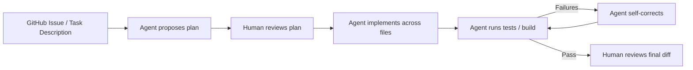
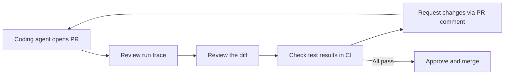

## Why This Matters

Advanced GitHub Copilot workflows — chat, agent mode, MCP integration, and code review — unlock autonomous problem-solving and cross-file refactoring at scale. Understanding billing mechanics and credit allocation is essential for cost management in production.

---

## 6. Chat Interface

### VS Code Copilot Chat

Open with Ctrl+Shift+I (Windows/Linux) / Cmd+Shift+I (macOS), or click the chat icon in the sidebar.

**Chat participants (slash commands):**

| Command | Purpose |
| --- | --- |
| /explain | Explain selected code |
| /fix | Suggest a fix for selected code or error |
| /tests | Generate unit tests for selected code |
| /doc | Generate documentation/docstrings |
| /optimize | Suggest performance improvements |
| @workspace | Include workspace context in the query |
| @vscode | Query about VS Code settings/commands |
| @terminal | Get help with terminal commands |

**Inline chat (in-editor):**

Select code → Ctrl+I / Cmd+I → type your instruction. Example: select a function → "/fix the off-by-one error in the loop".

### JetBrains Chat

Open via right-click in editor → Copilot → Open Copilot Chat, or use the Copilot Chat tool window. Alt+\ opens inline chat for a selected code block.

### GitHub.com Copilot Chat

Accessible at github.com → Copilot icon. Supports querying across repositories (with codebase indexing on Enterprise), creating issues, PRs, and branches directly from chat, and explaining files, commits, and PRs.

**Example prompts:**

```
# Explain a PR
"Explain what this pull request changes and why."

# Cross-repo question (Enterprise)
"How does the authentication flow work in the payments-service repo?"

# Generate from spec
"Create a FastAPI endpoint POST /users that accepts name and email,
validates email format, creates a user in the database using the
User model from src/models/user.py, and returns the created user."
```

---

## 7. Agent Mode

Agent mode transforms Copilot from a suggestion engine into an autonomous implementer. It reads multiple files, proposes cross-file edits, runs terminal commands, monitors output, and self-fixes build failures.

### Agent Mode vs Chat Mode

| Capability | Chat Mode | Agent Mode |
| --- | --- | --- |
| Answer questions | Yes | Yes |
| Suggest code for single file | Yes | Yes |
| Read multiple files automatically | No | Yes |
| Propose cross-file edits | No | Yes |
| Run terminal commands | No | Yes |
| Monitor command output | No | Yes |
| Self-fix build/test failures | No | Yes |
| Autonomous task loop | No | Yes |

### Enabling Agent Mode

**VS Code:** Agent mode is GA (since April 2025). Open Copilot Chat panel. At the top, switch from "Chat" to "Agent" in the mode dropdown. Alternatively, use the command palette → "GitHub Copilot: Open Agent Mode".

**JetBrains:** Agent mode reached full parity with VS Code in July 2025, full feature parity in March 2026. Open Copilot Chat tool window. Click the "Agent" tab at the top. For custom agents: Copilot Settings → Agents → Configure.

### Giving Agent Mode Tasks

**Anatomy of a good agent task:**

```
[Context] This is a FastAPI application with a PostgreSQL database.
[Task] Add a rate-limiting middleware that:
  - Limits each user to 100 requests per minute
  - Uses Redis for the counter (connection from src/cache.py)
  - Returns HTTP 429 with a Retry-After header when limit is exceeded
  - Includes the limit and remaining count in every response header
[Constraints]
  - Follow the middleware pattern in src/middleware/auth.py
  - Add tests in tests/test_rate_limiting.py
  - Update the README.md usage section
```

### The Issue → Plan → Implement → Validate Loop



### Agent Mode with Terminal Commands

Agent mode can execute terminal commands — running tests, build tools, linters, and package managers.

```
Task: "Add a new dependency httpx to this project, install it,
update the requirements file, and verify existing tests still pass."
```

Agent will:
1. Run pip install httpx (or uv add httpx based on project conventions)
2. Update requirements.txt or pyproject.toml
3. Run pytest to verify
4. Report results and fix any failures

Terminal Command Guardrails: Agent mode shows you each terminal command before executing and asks for confirmation on potentially destructive operations (file deletion, network calls, database modifications). Configure auto-approve for safe commands only — never auto-approve destructive operations.

### Plan Mode

Plan mode lets you review the agent's proposed work before any files are changed or commands are executed.

```
# In VS Code agent mode: click "Plan" instead of "Execute"
# The agent produces a detailed plan:
# 1. Files to create: src/middleware/rate_limit.py, tests/test_rate_limiting.py
# 2. Files to modify: src/main.py (add middleware registration), README.md
# 3. Commands to run: uv add redis, pytest tests/test_rate_limiting.py
# → Review the plan → Click "Execute" to proceed, or edit the plan
```

**When to use plan mode:** Always on unfamiliar codebases, large refactors, or tasks touching more than 5 files. Plan mode costs fewer credits than execution — catch incorrect understanding early.

### Sub-Agents

Sub-agents are specialized agents delegated specific aspects of a larger task. In March 2026, Copilot reached full parity for sub-agent delegation:

```
Main task: "Implement user authentication with GitHub OAuth"

Agent automatically delegates:
  Sub-agent 1: Research — reads OAuth library docs, existing auth code
  Sub-agent 2: Backend — implements OAuth callback handler, session management
  Sub-agent 3: Frontend — adds login button, handles redirect
  Sub-agent 4: Tests — writes integration tests for the full flow
  Sub-agent 5: Docs — updates README with OAuth setup instructions
```

### Custom Agents

Custom agents extend Copilot with domain-specific behavior — your own system prompt, tool access, and expertise.

**VS Code Configuration:**

```json
// .github/copilot-agents/infrastructure-agent.json
{
  "name": "Infrastructure Agent",
  "description": "Specialized for Terraform and Kubernetes work in this repo",
  "systemPrompt": "You are an infrastructure engineer specializing in AWS EKS and Terraform. This repository manages production infrastructure for our e-commerce platform. Always follow our module patterns in /modules, use the variable naming conventions in /modules/README.md, and run terraform validate after every change. Never use latest tags for container images.",
  "tools": ["file_editor", "terminal", "mcp_terraform_docs"],
  "model": "claude-sonnet-5"
}
```

**JetBrains Configuration:**

Access via Copilot Settings → Agents → New Agent → fill in name, system prompt, and tool access.

---

## 8. MCP Integration

**Important:** GitHub Copilot Extensions were deprecated in November 2025. All extension functionality has been replaced by Model Context Protocol (MCP) servers. If you have existing Extensions configured, migrate to MCP equivalents.

### What MCP Is

Model Context Protocol (MCP) is an open standard for connecting AI models to external tools and data sources. An MCP server exposes tools (callable functions) and resources (data) that Copilot can use during agent mode and chat sessions.

**MCP is GA** in VS Code, JetBrains, Eclipse, and Xcode as of 2026.

### Adding MCP Servers in VS Code

```json
// .vscode/mcp.json (project-level) or User Settings → MCP
{
  "servers": {
    "github": {
      "command": "npx",
      "args": ["-y", "@modelcontextprotocol/server-github"],
      "env": {
        "GITHUB_PERSONAL_ACCESS_TOKEN": "${env:GITHUB_TOKEN}"
      }
    },
    "postgres": {
      "command": "npx",
      "args": ["-y", "@modelcontextprotocol/server-postgres"],
      "env": {
        "POSTGRES_URL": "${env:DATABASE_URL}"
      }
    },
    "filesystem": {
      "command": "npx",
      "args": ["-y", "@modelcontextprotocol/server-filesystem", "/workspace/data"]
    }
  }
}
```

After saving, VS Code Copilot Chat shows the connected MCP tools in the "Tools" section of the chat panel.

### Adding MCP Servers in JetBrains

1. File → Settings → Tools → GitHub Copilot → MCP Servers.
2. Click "+" → Add server → specify command, args, and environment variables.
3. Restart the MCP connection (Tools → GitHub Copilot → Restart MCP).

### Enterprise MCP Administration

Enterprise admins manage MCP from a single control plane:

| Control | Location | Purpose |
| --- | --- | --- |
| Allow-list | Org Settings → Copilot → MCP → Allowed servers | Prevent unapproved MCP server connections |
| Audit logs | Org → Audit log → filter: copilot.mcp | Track MCP server usage by user and time |
| Policy enforcement | "Allow only approved MCP servers" org policy | Blocked at the client; engineers cannot connect non-approved servers |
| Per-repo override | Repo Settings → Copilot → MCP | Permit additional approved servers for specific repos |

```bash
# Query MCP audit logs via gh CLI
gh api /orgs/myorg/audit-log \
  --field phrase='action:copilot.mcp' \
  --field per_page=100 \
  | jq '.[] | {actor: .actor, action: .action, server: .mcp_server, at: .created_at}'
```

### Building a Custom MCP Server

An MCP server exposes tools that Copilot can call. Here is a minimal Python example connecting Copilot to an internal knowledge base:

```python
# internal_kb_mcp_server.py
from mcp.server import Server
from mcp.server.stdio import stdio_server
from mcp import types
import httpx

app = Server("internal-knowledge-base")

@app.list_tools()
async def list_tools() -> list[types.Tool]:
    return [
        types.Tool(
            name="search_runbooks",
            description="Search internal runbooks for operational procedures",
            inputSchema={
                "type": "object",
                "properties": {
                    "query": {"type": "string", "description": "Search query"},
                    "category": {
                        "type": "string",
                        "enum": ["incident", "deployment", "database", "networking"],
                        "description": "Runbook category filter"
                    }
                },
                "required": ["query"]
            }
        )
    ]

@app.call_tool()
async def call_tool(name: str, arguments: dict) -> list[types.TextContent]:
    if name == "search_runbooks":
        async with httpx.AsyncClient() as client:
            response = await client.get(
                "https://internal-kb.example.com/api/search",
                params={"q": arguments["query"], "category": arguments.get("category")},
                headers={"Authorization": f"Bearer {INTERNAL_KB_TOKEN}"}
            )
        results = response.json()
        return [types.TextContent(
            type="text",
            text="\n\n".join(f"# {r['title']}\n{r['content']}" for r in results["results"])
        )]

if __name__ == "__main__":
    import asyncio
    asyncio.run(stdio_server(app))
```

```json
// Register the server in .vscode/mcp.json:
{
  "servers": {
    "internal-kb": {
      "command": "python",
      "args": ["internal_kb_mcp_server.py"],
      "env": { "INTERNAL_KB_TOKEN": "${env:INTERNAL_KB_TOKEN}" }
    }
  }
}
```

### Example: Database Query MCP Server

Connect Copilot to your development database so agent mode can query schema and sample data without leaving the IDE:

```python
# db_query_mcp.py — READ-ONLY access to dev database
import asyncpg
from mcp.server import Server
from mcp import types

app = Server("dev-database")

@app.list_tools()
async def list_tools():
    return [
        types.Tool(
            name="query_schema",
            description="Get the schema for a database table",
            inputSchema={"type": "object", "properties": {"table": {"type": "string"}}, "required": ["table"]}
        ),
        types.Tool(
            name="run_select",
            description="Run a SELECT query on the development database (read-only, LIMIT enforced)",
            inputSchema={"type": "object", "properties": {"sql": {"type": "string"}}, "required": ["sql"]}
        )
    ]

@app.call_tool()
async def call_tool(name: str, arguments: dict):
    conn = await asyncpg.connect(DEV_DATABASE_URL)
    try:
        if name == "query_schema":
            rows = await conn.fetch(
                "SELECT column_name, data_type, is_nullable FROM information_schema.columns WHERE table_name = $1",
                arguments["table"]
            )
            return [types.TextContent(type="text", text=str(rows))]
        elif name == "run_select":
            sql = arguments["sql"].strip()
            # Enforce read-only: reject any statement that is not SELECT
            if not sql.upper().startswith("SELECT"):
                raise ValueError("Only SELECT statements are permitted")
            # Enforce row limit
            if "LIMIT" not in sql.upper():
                sql = sql + " LIMIT 50"
            rows = await conn.fetch(sql)
            return [types.TextContent(type="text", text=str(rows))]
    finally:
        await conn.close()
```

**Security note:** MCP servers that access databases must use read-only database credentials, enforce query allow-lists or statement type filtering, never connect to production databases, and be registered in the Enterprise MCP allow-list.

---

## 9. Copilot Code Review

### Agentic Review (March 5, 2026)

Since March 5, 2026, Copilot's code review has used an agentic architecture. Instead of reviewing only the diff, Copilot now explores the repository structure, reads related files referenced in the diff, traces cross-file dependencies (imports, calls, type references), and understands the full context of the change before commenting.

This means Copilot will catch issues like breaking a contract that callers in other files depend on, introducing a pattern inconsistent with the rest of the codebase, and missing updates to related tests or documentation.

### Assigning Copilot to PR Review

**Manual Assignment:**
On any open PR, access Reviewers panel → Search for "Copilot" → Add as reviewer. Copilot runs its agentic analysis and posts inline comments.

**Automatic Assignment via CODEOWNERS:**
```
# .github/CODEOWNERS
# Auto-assign Copilot as reviewer for all PRs
*    @copilot

# Or scope to specific areas:
/src/api/    @copilot @myorg/api-team
/terraform/  @copilot @myorg/infrastructure
```

**Via Branch Protection:**
Settings → Branches → main → Require pull request → Add copilot to required reviewers.

### Configuring Review Scope

```yaml
# .github/copilot-review-config.yml
review:
  focus:
    - security       # security vulnerabilities
    - correctness    # logic errors and bugs
    - performance    # performance anti-patterns
    - style          # code style (if no linter enforces it)
  ignore_paths:
    - "migrations/**"    # auto-generated migration files
    - "*.generated.*"    # generated code
  comment_level: detailed   # minimal | standard | detailed
```

### Review Quality

Copilot review quality is highest when the PR is well-scoped (one concern per PR), the PR description explains the intent (Copilot reads it as context), a copilot-instructions.md exists (see Section 12), and related files are in the same repository (cross-repo context requires Enterprise codebase indexing).

**Credits Consumed:** Copilot code review consumes GitHub Actions minutes (for the agentic run) plus AI Credits. Monitor via the Copilot Metrics API. For very large PRs (500+ file changes), consider splitting before requesting review — both for Copilot quality and human reviewers.

---

## 10. Copilot Coding Agent

### What the Coding Agent Does

The Copilot coding agent is an autonomous developer. Assign it a GitHub issue and it reads the issue description and linked context, explores the repository to understand the codebase, creates a new branch, implements the changes across however many files are needed, runs tests and fixes failures, and opens a pull request with the implementation and a run trace.

### Assigning the Coding Agent

**Method 1: Issue assignee:**
```bash
# Via gh CLI
gh issue create --title "Add rate limiting to API endpoints" \
  --body "Implement Redis-based rate limiting: 100 req/min per user. See src/middleware/ for patterns." \
  --assignee copilot

# Or assign on an existing issue:
gh issue edit 42 --add-assignee copilot
```

**Method 2: GitHub UI:**
1. Open any GitHub issue.
2. Assignees panel → type copilot → select the Copilot coding agent.
3. The agent starts working immediately.

**Method 3: Issue Templates with Auto-Assign:**
```yaml
# .github/ISSUE_TEMPLATE/feature-request.yml
assignees:
  - copilot
```

### Writing Good Issues for the Coding Agent

The quality of the agent's output depends heavily on issue quality.

**High-quality issue example:**
```markdown
## Task: Add email validation to the user registration endpoint

**Context**: The POST /api/v1/users endpoint in src/api/users.py currently
accepts any string for the email field. We need proper validation.

**Requirements**:
1. Validate email format using email-validator library (already in pyproject.toml)
2. Check if email domain has valid MX records (use validate_email with check_deliverability=True)
3. Return HTTP 422 with error detail {"field": "email", "error": "Invalid email format"}
   if validation fails
4. Add tests in tests/test_api/test_users.py following existing test patterns
5. Update the API docs in docs/api/users.md

**Do not change**: Authentication logic, database schema, or other endpoints.

**Acceptance criteria**: All existing tests pass; 3 new tests cover: valid email, invalid format, invalid domain.
```

### Review Workflow After Agent Implementation



**Reviewing agent-authored PRs:**
- Check the run trace (in the PR description) — see every file read, every command run.
- Verify the diff is scoped to the described task; agent should not have touched unrelated files.
- Run the tests locally if the task is security-sensitive.
- Leave feedback as a PR comment — the agent responds and pushes updates.

### GitHub Actions Integration

The coding agent uses GitHub Actions as its compute backend. This workflow is automatically created when coding agent is enabled and can be customized:

```yaml
# .github/workflows/copilot-agent.yml
name: Copilot Coding Agent
on:
  issues:
    types: [assigned]

jobs:
  copilot-agent:
    if: github.event.assignee.login == 'copilot'
    runs-on: ubuntu-latest
    permissions:
      contents: write
      pull-requests: write
      issues: write
    steps:
      - uses: actions/checkout@v4
      - uses: github/copilot-agent@v1
        with:
          github-token: ${{ secrets.GITHUB_TOKEN }}
```

For comprehensive GitHub Actions YAML patterns including security scanning, container builds, Kubernetes deploys, and multi-environment promotion, see the Git & GitHub Platform Engineering Handbook.

---

## 11. AI Credits Billing

### Credit System Explained

From June 1, 2026, GitHub Copilot uses a credit system for premium feature consumption:

- 1 credit = $0.01 USD
- Credits are included with your plan subscription at a 1:1 ratio to subscription cost.
- Credits are consumed by premium features beyond the base completion quota.
- Enterprise-level credits pool across all users in the organization.

### Credit Allocation by Plan

| Plan | Monthly cost | Included credits | Credits value |
| --- | --- | --- | --- |
| Business | $19/user/month | 1,900 credits/user | $19 worth |
| Enterprise | $39/user/month | 3,900 credits/user | $39 worth |

**Enterprise pooling example:**
- 100 Business users → 190,000 shared credits/month ($1,900 worth).
- 50 Enterprise users → 195,000 shared credits/month ($1,950 worth).
- Credits are shared across the org; heavy agent-mode users consume from the same pool as light users.

### Per-Feature Credit Costs

| Feature | Credit consumption | Notes |
| --- | --- | --- |
| Inline completions (standard model) | Included in base quota | No credit charge for completions within quota |
| Inline completions (premium model) | Low per completion | Charged when exceeding base quota |
| Chat (standard model) | Low per message | GPT-4o tier |
| Chat (premium model: Claude/Gemini) | Moderate per message | Higher reasoning cost |
| Agent mode session | Moderate to high | Scales with task complexity and file reads |
| Coding agent (issue → PR) | High | Full autonomous implementation run |
| Agentic code review | Moderate | Plus GitHub Actions minutes |
| Codebase indexing queries | Low | Enterprise only |

### Enterprise Pool Management

```bash
# Check current credit usage via GitHub API
gh api /orgs/myorg/copilot/billing \
  | jq '{credits_used: .cycle_credits_used, credits_limit: .cycle_credits_limit, utilization_pct: (.cycle_credits_used / .cycle_credits_limit * 100)}'

# Get per-user breakdown
gh api /orgs/myorg/copilot/billing/seats --paginate \
  | jq '.seats[] | {user: .assignee.login, credits_used: .credits_used_this_cycle}'

# Top consumers this month
gh api /orgs/myorg/copilot/billing/seats --paginate \
  | jq '[.seats[] | {user: .assignee.login, credits: .credits_used_this_cycle}] | sort_by(-.credits) | .[0:10]'
```

### Budget Alerts and Caps

Configure alerts at the organization level:
1. GitHub org → Settings → Billing → Copilot → Spending limit.
2. Set a hard cap (e.g., $500/month overage cap — stops billing after credits exhausted).
3. Configure alerts via webhook: Settings → Webhooks → add endpoint → filter billing.* events.

```python
# Example webhook handler for budget alerts
from fastapi import FastAPI, Request
import httpx

app = FastAPI()

@app.post("/github/billing-webhook")
async def billing_alert(request: Request):
    payload = await request.json()
    if payload.get("action") == "threshold_reached":
        threshold_pct = payload["threshold_percentage"]
        credits_used = payload["credits_used"]
        # Alert to Slack
        await httpx.post(SLACK_WEBHOOK_URL, json={
            "text": f"Copilot Credits Alert: {threshold_pct}% of monthly budget used ({credits_used} credits). Review top consumers."
        })
```

### Cost Optimization Strategies

| Strategy | Estimated Saving | Implementation |
| --- | --- | --- |
| Use GPT-4o for completions; premium models only for complex tasks | 20–40% | Team policy + model selection guide |
| Disable code review for low-risk/auto-generated repos | Per-review savings | CODEOWNERS — exclude from Copilot review |
| Use .copilotignore to exclude vendor/generated code | 5–15% | Create .copilotignore at repo root |
| Batch coding agent tasks (one well-scoped issue vs. many small ones) | 15–30% | Issue writing standards |
| Set standard model for dev/test environments | 20–35% | Org policy: premium models for prod-grade work only |
| Deprovision unused seats monthly | 10–20% seat cost | Monthly seat utilization review |

---

## Related Links

- [GitHub Copilot Zero to Hero Part 1](../11-github-copilot-zero-to-hero.md) — What Is Copilot, Plans, Setup, Model Selection, Code Completion
- [GitHub Copilot Zero to Hero Part 3](11-github-copilot-zero-to-hero-part3.md) — Enterprise Features, Parallelism, Token Optimization, Guardrails, Explainability, HITL
- [GitHub Copilot Zero to Hero Part 4](11-github-copilot-zero-to-hero-part4.md) — RAI and Compliance, Best Practices, Antipatterns, Keyboard Shortcuts, Troubleshooting
