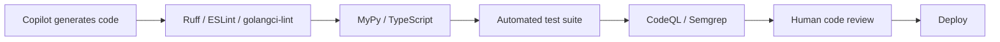
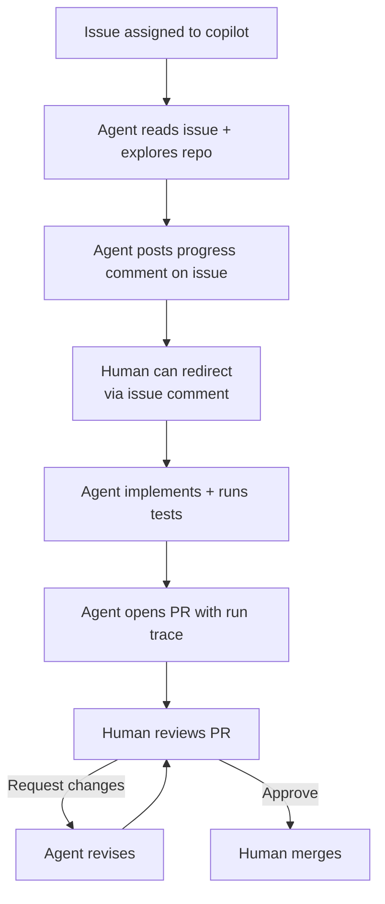

## Why This Matters

Deploying Copilot at enterprise scale requires governance, cost controls, output validation, and human oversight. This part covers administration, optimization, and safety frameworks for production deployments.

---

## 12. Enterprise Features

### Admin Console: Seat Management

GitHub org → Settings → Copilot → Manage seats:

```bash
# Assign seats to a team via API
gh api --method PUT /orgs/myorg/copilot/billing/selected_teams \
  --field selected_teams='["platform-team", "backend-team"]'

# Remove a specific user's seat
gh api --method DELETE /orgs/myorg/copilot/billing/selected_users \
  --field selected_usernames='["former-contractor"]'

# Audit seat assignments
gh api /orgs/myorg/copilot/billing/seats --paginate \
  | jq '.seats[] | {user: .assignee.login, assigned_at: .created_at, last_active: .last_activity_at}'
```

### Policy Controls

| Policy | Location | Options |
| --- | --- | --- |
| Suggestions matching public code | Org → Copilot → Policies | Allow / Block |
| Copilot in GitHub.com | Org → Copilot → Policies | Enabled / Disabled |
| Copilot Chat | Org → Copilot → Policies | Enabled / Disabled |
| Copilot in CLI | Org → Copilot → Policies | Enabled / Disabled |
| Coding agent | Org → Copilot → Policies | Enabled / Disabled |
| MCP servers | Org → Copilot → MCP | Allow-list |

### Codebase Indexing Setup and Optimization

Codebase indexing enables Copilot to give suggestions and chat responses that understand your full repository structure.

**Enabling:**
1. Org → Settings → Copilot → Codebase indexing.
2. Select repositories to index.
3. Initial index builds on next push to default branch.

**Optimizing index quality:**

```markdown
# .github/copilot-instructions.md
<!-- This file is read by Copilot for every suggestion and chat in this repo -->

## Project Overview
FastAPI microservice for the payments domain. Handles payment processing,
refunds, and subscription billing for B2B customers.

## Architecture
- API layer: src/api/ — FastAPI routers, one file per domain entity
- Service layer: src/services/ — business logic, no direct DB access
- Repository layer: src/repositories/ — SQLAlchemy ORM, async sessions
- Database: PostgreSQL 15 via asyncpg; migrations in alembic/versions/

## Conventions
- All async: use async def for routes, services, and repositories
- Error handling: raise DomainError subclasses from src/exceptions.py
- Logging: structured logs via src/logging.py — never use print()
- Testing: pytest with factories in tests/factories/

## What to Avoid
- Raw SQL strings — always SQLAlchemy ORM
- Synchronous DB calls — always await
- Hardcoded environment variables — use src/config.py Settings class
```

**Index freshness:** The index reflects the default branch (usually main). Feature branch suggestions may lag until the feature is merged.

### Fine-Tuned Custom Models

Available on Copilot Enterprise for organizations with sufficient code volume.

| Aspect | Detail |
| --- | --- |
| Scope | Code completion suggestions only (not chat, agent, or review) |
| Benefit | Suggestions aligned to your naming conventions, internal APIs, domain patterns |
| Training data | Your chosen repositories; GitHub uses a separate fine-tuning pipeline that never shares data with the shared model |
| Governance | Opt specific repos in/out; legal/compliance review required before enabling |

**Pre-enablement governance checklist:**
- [ ] Legal review: confirm included repos contain no third-party code with ML-training restrictions in license terms.
- [ ] Security review: ensure no secrets or PII exist in training repos (run GHAS secret scanning first).
- [ ] Document: record which repos are included, the model version deployed, and the retraining cadence.
- [ ] Monitor: compare acceptance rates before/after fine-tuning to validate improvement.

### SSO/SCIM Provisioning

```
IdP (Okta/Azure AD/Ping) → SAML SSO → GitHub Enterprise
    ↓
SCIM Provisioner → GitHub teams → Copilot seat groups
    ↓
Result: Copilot access follows HR system lifecycle
  - New hire → onboarding adds to team → Copilot seat auto-assigned
  - Offboarding → team removal → seat auto-deprovisioned
```

**Practical setup (Okta example):**
1. Add GitHub as a SAML application in Okta.
2. Configure SCIM provisioning (Okta → GitHub app → Provisioning → Enable SCIM).
3. Map Okta groups to GitHub teams.
4. Assign GitHub teams to Copilot in org settings.

### Data Privacy

| Guarantee | Condition |
| --- | --- |
| Your code is not used to train shared Copilot models | Requires signed Data Processing Agreement (DPA) |
| Prompts not retained beyond session | Enterprise tier with zero-retention configuration |
| Data residency (region selection) | Available; configured during Enterprise org setup |
| SOC 2 Type II certification | GitHub certified; report available under NDA |
| GDPR compliance | Covered by GitHub's DPA for Enterprise customers |

**DPA is not automatic:** The zero-training guarantee requires a signed DPA. Request it proactively through your GitHub account team before deploying Copilot Enterprise in any environment that processes personal data or operates under HIPAA, PCI-DSS, or similar regulations.

### Audit Logs

Enterprise audit logs capture all Copilot activity:

```bash
# Copilot usage by user (last 30 days)
gh api /orgs/myorg/audit-log \
  --field phrase='action:copilot' \
  --field per_page=100 \
  | jq 'group_by(.actor) | map({user: .[0].actor, events: length}) | sort_by(-.events)'

# Code review events
gh api /orgs/myorg/audit-log \
  --field phrase='action:copilot.code_review' \
  | jq '.[] | {actor: .actor, repo: .repo, pr: .pull_request_id, at: .created_at}'

# MCP server connections
gh api /orgs/myorg/audit-log \
  --field phrase='action:copilot.mcp' \
  | jq '.[] | {actor: .actor, server: .mcp_server, at: .created_at}'
```

---

## 13. Parallelism

### Multiple Copilot Sessions

You can run Copilot in parallel across different contexts:

- **Dual IDE instances**: Run VS Code and JetBrains simultaneously with different files open — Copilot operates independently per IDE instance.
- **Multiple chat panels**: Open multiple Copilot Chat panels in VS Code (command: "GitHub Copilot: New Chat") for parallel conversation threads on different topics.
- **Copilot App + IDE**: Use the Copilot App for managing coding agent tasks while working in your IDE with completions active.

### Concurrent Coding Agent Tasks

The coding agent can handle multiple issues in parallel — each runs in its own branch:

```bash
# Assign multiple issues to Copilot simultaneously
gh issue edit 101 --add-assignee copilot
gh issue edit 102 --add-assignee copilot
gh issue edit 103 --add-assignee copilot
# Each starts a separate agent session with its own branch
```

**Parallel agent best practices:**
- Use independent, non-overlapping issues — agents working on overlapping files will create merge conflicts.
- Monitor progress via the GitHub Copilot dashboard or gh run list.
- Review PRs as they come in — don't let multiple agent PRs accumulate unreviewed.

### Parallel Agent Mode Tasks (VS Code)

In VS Code, you can open multiple agent mode sessions for different workspace concerns:

```
Session 1: "Refactor the authentication module to use OIDC"
Session 2: "Add monitoring instrumentation to the payments service"
Session 3: "Generate unit tests for all uncovered functions in src/utils/"
```

Each session has its own context and does not interfere with the others (assuming non-overlapping file scope).

---

## 14. Token and Cost Optimization

### Model Selection Per Task

| Task | Recommended Model | Rationale |
| --- | --- | --- |
| Inline completions (all) | GPT-4o (default) | Speed + cost; sufficient for completions |
| Quick chat questions | GPT-4o | Low-complexity queries don't need deep reasoning |
| Complex architecture discussion | Claude Sonnet | Better reasoning for design questions |
| Agent mode on large codebase | Claude Sonnet | Long-context, multi-file reasoning |
| Security review | Claude Sonnet | Thorough, explains reasoning |
| Automated code review (PR) | GPT-4o or Claude | Balance speed vs. depth per team preference |
| Coding agent (issue resolution) | Claude Sonnet | Complex autonomous task; quality &gt; speed |

### Credit Monitoring Workflow

Set up a weekly credit review cadence:

```bash
#!/bin/bash
# weekly_credits_report.sh — run via cron or GitHub Actions schedule

ORG="myorg"
MONTH_START=$(date -d "$(date +%Y-%m-01)" +%Y-%m-%d)
TODAY=$(date +%Y-%m-%d)

# Fetch current usage
USAGE=$(gh api /orgs/$ORG/copilot/billing \
  | jq '{used: .cycle_credits_used, limit: .cycle_credits_limit, pct: (.cycle_credits_used / .cycle_credits_limit * 100 | floor)}')

# Top 10 consumers
TOP_USERS=$(gh api /orgs/$ORG/copilot/billing/seats --paginate \
  | jq '[.seats[] | {user: .assignee.login, credits: .credits_used_this_cycle}] | sort_by(-.credits) | .[0:10]')

echo "=== Weekly Copilot Credits Report ($TODAY) ==="
echo "Usage: $USAGE"
echo "Top consumers: $TOP_USERS"
```

### Disabling Expensive Features for Teams

For teams that don't benefit from premium features, disable at the repo or team level:

```yaml
# CODEOWNERS — exclude from Copilot auto-review (saves review credits)
# generated/**  (no CODEOWNERS entry = no auto-review)

# Org policy — disable coding agent for test/staging repos
# Org → Settings → Copilot → Policies → Repositories → select repos → disable coding agent
```

### .copilotignore File

Exclude files from Copilot context to reduce credit consumption and avoid suggestions in irrelevant files:

```gitignore
# .copilotignore
# Vendor code — no suggestions needed
vendor/
node_modules/
.venv/

# Generated code — don't suggest changes to auto-generated files
migrations/versions/
src/generated/
*.generated.py
*.pb.go

# Test fixtures — don't use as context (may contain sensitive-looking fake data)
tests/fixtures/

# Large data files — not useful context
data/*.csv
data/*.parquet
*.json.gz
```

### Context Window Management in Agent Mode

Agent mode reads files to build context. Long files consume more tokens (credits):

- **Prefer small, focused files** — a 500-line file is better than a 5,000-line monolith for agent context.
- **Use descriptive module structure** — well-named modules help the agent navigate without reading everything.
- **Scope agent tasks narrowly** — "Fix the null pointer in payments.py line 142" consumes far fewer tokens than "Fix all bugs in the payments service".
- **Plan mode first** — use plan mode to review what files the agent intends to read before it reads them; cancel if scope is too broad.

---

## 15. Guardrails

### Content Exclusions (.copilotignore)

See Section 14 for .copilotignore syntax. Use it to exclude:
- Files containing secrets or credentials (defense-in-depth beyond GHAS).
- Files with highly sensitive business logic you don't want sent to the AI provider.
- Third-party licensed code where the license may restrict use as AI training data.

### Sensitive File Exclusions via Org Policy

Organization admins can exclude files from Copilot context at the org level:

```
Org → Settings → Copilot → Content exclusions
Add exclusion patterns:
  - **/.env
  - **/secrets/**
  - **/credentials/**
  - **/private/**
```

These exclusions apply to all repositories in the organization — no local .copilotignore needed.

### IP Indemnification

Copilot Business and Enterprise plans include IP indemnification: if a Copilot suggestion matching public code leads to a copyright claim, GitHub defends you and covers damages, provided you had the "matching public code" filter enabled.

**Enable the filter:** Org → Settings → Copilot → Policies → Suggestions matching public code → Block.

**Warning:** IP indemnification applies only when the "matching public code" filter is set to Block. If the filter is set to Allow, indemnification does not apply.

### Output Validation Workflows

Never deploy Copilot-generated code without validation:



**For agent mode specifically:**
1. Agent mode changes must go through your normal PR + CI pipeline — no bypassing CI because the code was AI-generated.
2. If the agent runs tests and they pass locally but fail in CI, investigate — the agent's environment may differ from CI.
3. Security-sensitive changes (auth, crypto, data access) require human security review regardless of agent confidence.

---

## 16. Explainability

### Requesting Code Explanations

Use Copilot Chat to explain code you (or it) wrote:

```
# Select code → /explain

"Explain this code step by step, including:
1. What each function does
2. What edge cases it handles
3. What edge cases it does NOT handle
4. Any security concerns"
```

### Reasoning Traces in Chat

When using premium models (Claude Sonnet), ask for explicit reasoning:

```
"Before suggesting a solution, explain your understanding of the problem,
what approaches you considered, why you chose this approach over alternatives,
and what assumptions you're making."
```

### Agent Mode Run Traces

All agent mode sessions produce a run trace visible in VS Code (agent mode panel → "View Trace" after task completion) or in Coding agent PRs (the PR description includes a full trace of files read, commands run, and decisions made).

The run trace shows which files were read (and why), which files were modified (and the proposed edits), which commands were executed and their output, and how the agent responded to errors.

This trace is your explainability artifact for audit purposes — save it for compliance-sensitive work.

### Explaining Copilot Decisions to Stakeholders

When justifying AI-assisted code in regulated environments:

1. Save the agent run trace as a PR attachment or link from the PR description.
2. Document the human review steps taken (who reviewed, what they checked).
3. Note which validation workflows ran (CI checks, security scans).
4. Record the final approval decision (who approved the PR).

This creates an audit trail: AI proposed → human validated → CI confirmed → human approved.

---

## 17. Human-in-the-Loop (HITL)

### Agent Mode Confirmation Dialogs

Agent mode gates potentially impactful actions behind human confirmation:

| Action Type | Default Behavior |
| --- | --- |
| File creation/modification | Auto-proceed (shows diff) |
| Running read-only terminal commands | Auto-proceed |
| Installing packages | Prompt for confirmation |
| Deleting files | Always prompt |
| Running tests | Auto-proceed |
| Network requests from scripts | Prompt for confirmation |
| Database modifications | Always prompt |

**Configure confirmation policy** in VS Code Settings:

```json
{
  "github.copilot.agent.confirmTerminalCommands": "always",  // or "risky" or "never"
  "github.copilot.agent.autoApproveFileChanges": false
}
```

**Recommendation:** Set confirmTerminalCommands to "risky" (the default) for development workflows. Set to "always" for production-adjacent repositories.

### Plan Review Before Execution

Always use Plan Mode for tasks that touch more than 5 files, involve schema changes, modify authentication/authorization/security logic, delete or rename files, or change external API contracts.

```
# VS Code: Click "Plan" in the agent mode panel
# JetBrains: Click "Generate Plan" before "Execute"

# Review the plan output:
# - Does it correctly identify which files need changing?
# - Is the scope correct (not too broad, not missing files)?
# - Are the proposed commands safe?
# → Only then click "Execute"
```

### PR Review Gates

Agent-authored PRs (from the coding agent or agent mode) must go through the same review process as human-authored PRs:

- Branch protection rules apply — agent cannot bypass required reviews.
- CI must pass — agent's code is not exempt from test failures or security scans.
- CODEOWNERS reviews are required — code owners review agent changes in their domain.
- Merge queue applies — if enabled, agent PRs queue like any other PR.

**Do not:** merge agent PRs without review. Even when the agent reports "all tests pass," a human reviewer must confirm the implementation is correct and secure.

### Coding Agent HITL Checkpoints



---

## Related Links

- [GitHub Copilot Zero to Hero Part 1](../11-github-copilot-zero-to-hero.md) — What Is Copilot, Plans, Setup, Model Selection, Code Completion
- [GitHub Copilot Zero to Hero Part 2](11-github-copilot-zero-to-hero-part2.md) — Chat Interface, Agent Mode, MCP Integration, Code Review, Coding Agent, Billing
- [GitHub Copilot Zero to Hero Part 4](11-github-copilot-zero-to-hero-part4.md) — RAI and Compliance, Best Practices, Antipatterns, Keyboard Shortcuts, Troubleshooting
