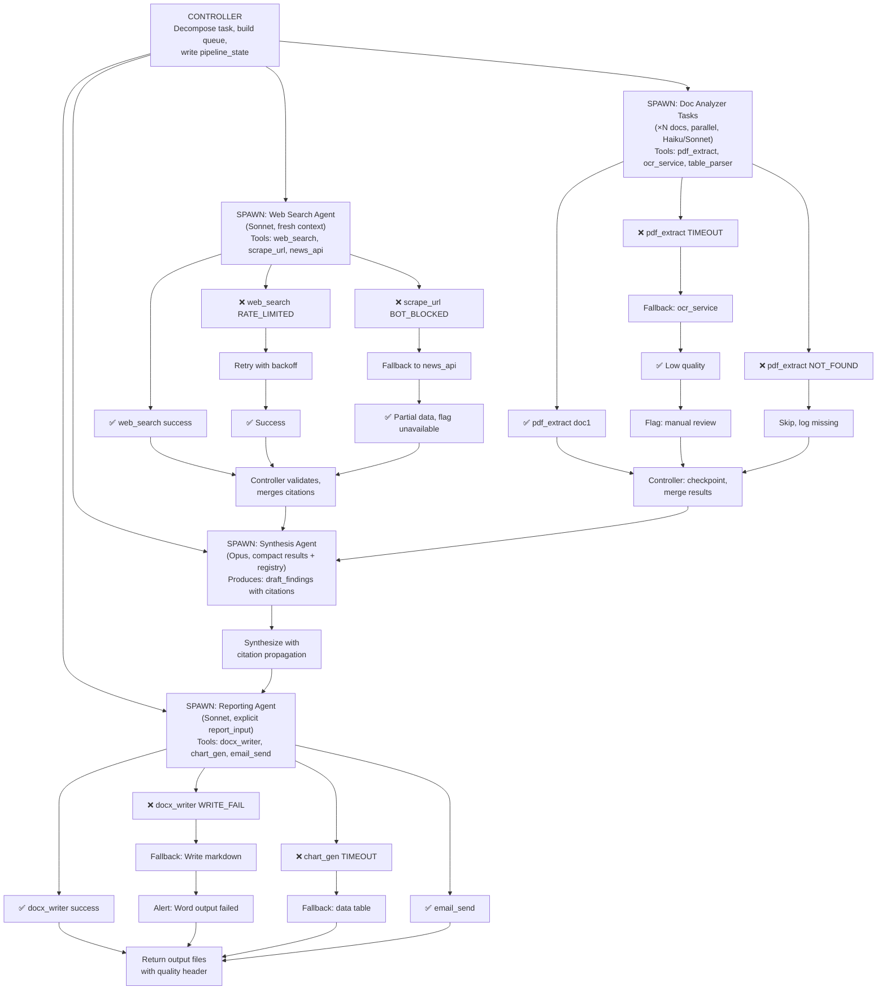

# MCP Pipeline Error & Context Handling — Part 2

**This is Part 2 of 2. [Return to Part 1 ←](pathname:///archon/agentic-systems/coding-tools/14-cheatsheet-11-mcp-pipeline-errors) for MCP error types, web search, and document analyzer handling.**

## REPORTING AGENT — ERRORS, CITATIONS & MISSING DATA

### What reporting agent receives

Controller passes this explicit packet:

```python
report_input = {
    "synthesized_findings": [...],  # from synthesis pass
    "citation_registry": { ... },  # complete source map
    "manual_review_queue": [...],  # items flagged
    "data_quality_issues": {
        "web_q2": "RATE_LIMITED — data may be incomplete",
        "doc_1": "OCR fallback — verify numbers manually"
    },
    "missing_sources": [
        {
            "source_id": "bloomberg_live",
            "reason": "AUTH_FAILED"
        }
    ],
    "style_guide": "executive_brief",
    "output_format": "docx + email_summary"
}
```

### How to handle missing citations

System prompt for reporting agent:

"For every factual claim, add [source_id] inline. If source_id is in citation_registry → use it. If source_id is [INFERRED] → mark as ¹ with note: 'This claim could not be independently verified.' If source_id is in missing_sources → mark as [⚠ SOURCE UNAVAILABLE: reason] If data_quality_issues flag exists for source → add ✱ footnote: 'Data from this source may be incomplete — reason' Append sections to report: References (all citation_registry sources used) Data Quality Notes (all flags and caveats) Manual Review Required (all manual_review_queue items)"

### MCP tool errors in reporting

| Tool | Handling |
|---|---|
| docx_writer FAIL | Retry × 1. If still fails → write Markdown fallback to local file. Controller alerts human that Word output failed. |
| chart_gen FAIL | Include data table instead of chart. Mark [CHART_GENERATION_FAILED — see data table]. Never silently omit data. |
| email_send FAIL | Save email body to file. Return success with note "email delivery failed — saved to report_email.txt for manual send". |
| AUTH_FAILED on send | Escalate to human immediately. Do not retry. Log attempted recipient + subject for human to use. |

### Report quality header (auto-generated)

Reporting agent always prepends this block:

**DATA QUALITY SUMMARY**

- Sources used: `{n}` of `{total_attempted}`
- Sources unavailable: `{missing_sources}`
- OCR fallbacks: `{ocr_count}` documents
- Items needing review: `{manual_review_count}`
- Unverified claims: `{inferred_count}` marked [INFERRED]
- See 'Data Quality Notes' section for full details.

Transparent error surfacing in the report itself is better than a clean report that hides data gaps. Readers know what to verify.

## COMPLETE PIPELINE — HAPPY PATH + ALL ERROR BRANCHES



**Pipeline flow overview:**

1. **Controller** starts: decomposes task, builds queue, writes initial pipeline_state
2. **Web Search Agent** executes searches with error handling:
   - RATE_LIMITED errors → retry with backoff
   - BOT_BLOCKED → fallback to alternative source (news_api)
   - Results → merged into citation_registry
3. **Doc Analyzer** processes documents in parallel:
   - TIMEOUT failures → retry with ocr_service fallback
   - NOT_FOUND → skip and log
   - Results → checkpointed for recovery
4. **Synthesis Agent** combines all results with full citation propagation
5. **Reporting Agent** generates final output:
   - WRITE_FAIL → markdown fallback
   - TIMEOUT → data table instead of chart
   - Final report includes all quality headers and flags

## 3-TIER RETRY SYSTEM — WHAT ESCALATES WHERE

### Tier 1 — Agent self-retry (no controller involved)

**Trigger:** tool is_error:true, transient failures

**Who:** Agent itself, via agentic loop

**Max:** 2 retries

**Logic:**
- Attempt 1: exact retry
- Attempt 2: modified params (shorter query, smaller range)
- Fail → escalate to Tier 2

**Applies to:** TIMEOUT, EMPTY_RESULT, PARSE_FAIL

**NOT for:** AUTH_FAILED, NOT_FOUND (pointless to retry)

### Tier 2 — Controller routes to fallback tool

**Trigger:** Agent reports errors[] in return schema

**Who:** Controller, after receiving agent result

**Logic:**
- web_search fails → route to news_api
- pdf_extract fails → route to ocr_service
- docx_writer fails → route to markdown Write
- chart_gen fails → include data table instead
- RATE_LIMITED → add to retry_queue, continue others

**Update:** pipeline_state.tasks[id].status = "partial"

### Tier 3 — Human escalation (non-recoverable)

**Trigger:** AUTH_FAILED, all fallbacks exhausted, manual_review_queue has critical items

**Who:** Controller → human_escalation MCP tool

**Message includes:**
- run_id for state recovery
- exact error + tool that failed
- what data is missing as a result
- suggested action (rotate key, verify source)
- pipeline_state checkpoint path for resume

Human fixes credential, controller resumes: `controller.resume_from(checkpoint_path)`

Only failed tasks re-run — completed tasks skipped.

**NEVER retry AUTH_FAILED.** Rotating credentials requires human action. Every retry is wasted tokens and delays escalation.

## Error → impact → report handling

| Error | Report Impact | Report Label |
|---|---|---|
| TIMEOUT (all fallbacks fail) | Section missing | [SOURCE_UNAVAILABLE] |
| EMPTY_RESULT | No data for topic | [NO_DATA_FOUND] |
| OCR_FALLBACK | Numbers may be wrong | ✱ low confidence |
| AUTH_FAILED | Entire source missing | [⚠ CREDENTIAL ERROR] |
| NOT_FOUND | Doc unavailable | [SOURCE_MISSING] |
| INFERRED claim | Not independently verified | [INFERRED] |
| PROMPT_INJECT blocked | Source sanitized | [CONTENT_SANITIZED] |

## CONTEXT STRATEGY PER AGENT

### Each agent's context discipline

**Controller (Opus):** Receives compact results only. 80% budget reserved for state + registry. Never reads full docs.

**Web Search (Sonnet):** Fresh context. Only given: task spec + query list + citation schema. Returns compact JSON. Context used for searching, not accumulating.

**Doc Analyzer (Haiku):** One doc per Task. Chunk large docs into sub-Tasks. Returns ≤500 token compact result. Never returns full doc text.

**Synthesis (Opus):** Receives: 50 compact results + citation_registry. Allocates 60% context to inputs, 40% for generation.

**Reporting (Sonnet):** Receives: synthesis draft + citation_registry + error context. Context mainly consumed by generation of final report.

### What NEVER goes in any agent's context

- ✗ Full document text (pass URL or chunk ID instead)
- ✗ Raw API response dumps (parse + extract first)
- ✗ Prior agent's reasoning chains (only output)
- ✗ All 50 result objects to synthesis agent in full
- ✗ Credentials or API keys
- ✗ Previous session history (explicitly summarize)

## CONTEXT FILL THRESHOLDS & ACTIONS

| Fill % | Action | Command |
|---|---|---|
| &lt; 50% | Normal operation | — |
| 50–70% | Write checkpoint to state_store | MCP state_store.save() |
| 70–85% | Compact with preservation instructions | /compact "preserve: ..." |
| 85–95% | Compact immediately + write emergency state | Write("state.json") then /compact |
| &gt; 95% | Write state, fresh session with state.json | claude -p "resume from state.json" |

## Token cost by model for this pipeline

- **Controller:** Opus 2–5M tokens/run (complex reasoning)
- **Web Search:** Sonnet 200K–500K/run (search + extract)
- **Doc Analyzer:** Haiku 50K–100K/doc (cheap per doc)
- **Synthesis:** Opus 1–3M tokens/run (quality matters)
- **Reporting:** Sonnet 500K–1M/run (generation)

**Optimization:** Haiku for doc processing saves 10× vs Sonnet — biggest lever in high-volume pipelines

## QUICK-REF: ERROR HANDLING DECISIONS

### Decision: Retry or escalate?

**Is the error transient? (TIMEOUT, RATE_LIMITED)**
- YES: Retry × 2, exponential backoff
- NO: Skip to fallback

**Does a fallback tool exist? (ocr for pdf, news_api for web)**
- YES: Use fallback, flag quality degradation
- NO: Skip to graceful degrade

**Does missing data affect report critically?**
- YES: Escalate to human
- NO: Flag in report, continue

**Is human action required? (AUTH_FAILED, credential rotation)**
- YES: Escalate IMMEDIATELY, no retry
- NO: Handle programmatically

## Report transparency pledge

Every error that affects data completeness MUST appear in the report's Data Quality section. A report that silently omits failed sources is worse than one that transparently flags gaps.

## stop_reason check (always)

The only valid loop termination check:

```python
if response.stop_reason == "end_turn":
    pipeline.advance_to_next_stage()
elif response.stop_reason == "tool_use":
    execute_tools_and_continue()
elif response.stop_reason == "max_tokens":
    append_partial_and_continue()

# NEVER check for "I have finished" in text
```
