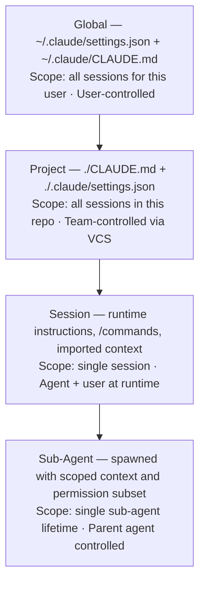

This is part 2 of 2. [Continue from Part 1](../23-claude-ecosystem-research-report.md) for Constitutional AI principles, Claude Code architecture, context engineering, CLAUDE.md handbook, subagent systems, and the MCP ecosystem.

## Phase 7: Agent Configuration Systems

### 7.1 Claude Code Configuration Hierarchy

*Configuration hierarchy from broadest to narrowest scope: global user settings, project-level VCS-tracked config, per-session runtime instructions, and scoped sub-agent overrides.*

| Layer | Mechanism | Scope | Mutability |
|---|---|---|---|
| Global | ~/.claude/settings.json + ~/.claude/CLAUDE.md | All sessions for this user | User-controlled |
| Project | ./CLAUDE.md + ./.claude/settings.json | All sessions in this repo | Team-controlled via VCS |
| Session | Runtime instructions; /commands; imported context | Single session | Agent + user at runtime |
| Sub-Agent | Spawned with scoped context and permission subset | Single sub-agent lifetime | Parent agent |

### 7.2 Hooks System

Hooks are user-defined scripts that execute at defined points in the agent loop: PreToolUse, PostToolUse, Notification, and Stop. They enable powerful customizations without modifying the agent's core behavior:

| PreToolUse | Validate, transform, or block tool calls before execution. Security checkpoint. |
|---|---|
| PostToolUse | Process, log, or transform tool results. Audit trail injection. |
| Notification | Trigger external alerts on agent events. Slack, PagerDuty integration. |
| Stop | Execute cleanup on session end. State persistence. Report generation. |

### 7.3 Slash Commands

Slash commands are project-defined workflow shortcuts stored in .claude/commands/. They allow teams to codify common agent workflows as reusable, parameterized commands that any team member can invoke consistently:

- /review — run the full code review agent pipeline on the current branch
- /test-coverage — execute test agent and generate coverage report
- /security-scan — invoke security agent with OWASP checklist
- /doc-update — synchronize documentation with recent code changes
- /release-prep — run validation, changelog, and version bump agents

### 7.4 Competitive Platform Comparison

| Feature | Claude Code | Cursor | GitHub Copilot | Gemini CLI | Devin | OpenHands |
|---|---|---|---|---|---|---|
| Agent Loop | Full autonomous loop | Composer (semi-auto) | Workspace (limited) | Full loop | Full autonomous | Full loop |
| Context Config | CLAUDE.md + Settings | Rules files | .github/copilot-instructions.md | GEMINI.md | Proprietary | config.toml |
| MCP Support | Native; first-class | Limited/experimental | Limited | Native (partial) | None | Partial |
| Sub-Agents | Native parallelism | None | None | Experimental | Internal only | Native |
| Hooks System | Full pre/post hooks | None | None | Limited | None | Partial |
| Permission System | 5-tier granular | Limited | Basic | Basic | Platform-controlled | Configurable |
| Open Source | No (API) | No | No | Partial | No | Yes (Apache) |
| Enterprise Controls | API + usage policies | Business plans | Enterprise Copilot | Google Workspace | Devin Enterprise | Self-host |
| Primary Strength | Agent OS platform | IDE integration | GitHub integration | Google ecosystem | Fully autonomous | Openness |

## Phase 8: Token Economics

### 8.1 Token Cost Drivers

Token consumption in agentic systems scales non-linearly. Unlike single-turn LLM calls, agent loops re-send the growing conversation history on every iteration, creating a quadratic cost growth pattern unless managed actively. Understanding the cost drivers is prerequisite to effective AI FinOps:

| Cost Driver | Typical % of Token Spend | Optimization Potential |
|---|---|---|
| Context window re-send (conversation history) | 40-60% | High — compaction, state externalization |
| Tool result inclusion in context | 15-30% | High — structured formatting, relevance filtering |
| System prompt / CLAUDE.md | 5-15% | Medium — prompt caching, right-sizing |
| Sub-agent spawning overhead | 10-20% (multi-agent) | Medium — task batching, agent pooling |
| Failed/retried tool calls | 5-15% | High — better error handling, retry budgets |
| Exploratory reasoning (extended thinking) | 10-25% when enabled | Low — necessary for quality |

### 8.2 AI FinOps Framework

AI FinOps applies the principles of cloud financial operations to AI token spend. The framework operates across three capability layers:

**Visibility** Real-time token usage dashboards; per-agent, per-task, per-team attribution; cost anomaly alerting; session cost estimates before execution

| Optimization | Prompt caching for stable context; context compaction tuning; model tier selection (Haiku for simple tasks, Sonnet for standard, Opus for complex); batch API for non-time-critical workloads |
|---|---|
| Governance | Budget limits per team/project; approval workflows for large agent runs; cost-per-outcome tracking; ROI measurement against engineering velocity metrics |

### 8.3 Model Tier Selection Framework

| Task Category | Recommended Model | Rationale | Cost vs Opus |
|---|---|---|---|
| Simple Q&A, routing, classification | Claude Haiku | Sufficient capability; minimal latency | ~20x cheaper |
| Standard coding, analysis, summarization | Claude Sonnet | Balance of capability and cost | ~5x cheaper |
| Complex architecture, novel problem solving | Claude Opus | Maximum capability for high-stakes tasks | Baseline |
| Batch, non-time-critical processing | Batch API + Haiku/Sonnet | 50% cost reduction via batching | 50% discount |
| Large stable context (prompts, docs) | Any + Prompt Caching | 90%+ reduction on cached tokens | ~10x on cached |

### 8.4 Enterprise Token Budget Framework

A sustainable enterprise token budget allocates spend based on value delivered. The recommended allocation:

| Developer productivity agents (coding, review) | 40% of AI budget — directly measurable velocity impact |
|---|---|
| Research & analysis agents | 20% — faster decision-making; competitive intelligence |
| Documentation & communication agents | 15% — quality and consistency improvement |
| Testing & QA agents | 15% — defect prevention; earlier detection |
| Infrastructure & operations agents | 10% — reliability improvement; incident response acceleration |

**ROI Benchmark:** Early adopters report 20-40% reduction in time-to-PR for feature development, 40-60% reduction in code review cycle time, and 30-50% reduction in documentation lag. At fully loaded engineering costs of $200-500/hour, even 30 minutes saved per engineer per day produces ROI of 10-50x the AI token spend at current pricing.

## Phase 9: Claude Advocates & Critics

### 9.1 Emerging Consensus Among Power Users

- CLAUDE.md is mandatory, not optional — agents without it waste significant context on re-explanation
- Context compaction is a feature to design around, not a bug to ignore
- Sub-agents for parallelism pay for themselves on tasks &gt; 2 hours of sequential work
- Permission hygiene is the single most impactful security practice
- Structured output formats (JSON/YAML) dramatically improve agent reliability vs. prose instructions
- Hooks are underutilized — most production teams have not yet discovered their power
- Git worktrees are essential for parallel agent workflows; branches alone are insufficient
- Cost monitoring must be in place before scaling to team-wide deployment
- Extended thinking mode is worth the token cost for architectural decisions
- Agent session transcripts are valuable audit artifacts — store them

### 9.2 Areas of Active Disagreement

**Context Clearing Frequency:** Some advocate clearing context every 30 minutes; others prefer compaction. Evidence suggests task-type determines the right approach.

**Sub-Agent Granularity:** Fine-grained specialists vs. generalist agents that handle multiple steps. No consensus; depends on task structure.

**MCP vs. Direct API Integration:** MCP adds overhead and attack surface; direct API calls are simpler but less composable. Active debate in enterprise contexts.

**Human Checkpoint Frequency:** More checkpoints = safer but slower. Optimal frequency is task-risk-dependent and not yet standardized.

## Phase 10: Risk Register & Threat Model

### 10.1 Comprehensive Risk Register

| Risk ID | Risk | Category | Likelihood | Impact | Status | Mitigation |
|---|---|---|---|---|---|---|
| R-01 | Prompt injection via tool results | Security | High | Critical | Active | Input sanitization; output validation |
| R-02 | Context window exfiltration | Security | Medium | High | Active | No secrets in context; PII controls |
| R-03 | Agent overreach (filesystem/network) | Security | Medium | Critical | Active | Permission tiers; deny lists |
| R-04 | Runaway token spend | Financial | High | High | Active | Budget limits; alerts; FinOps |
| R-05 | Context debt degrading quality | Reliability | High | Medium | Active | State externalization; compaction mgmt |
| R-06 | MCP supply-chain attack | Security | Medium | High | Active | Private registry; security review |
| R-07 | Multi-agent cascade failure | Reliability | Medium | High | Active | Circuit breakers; retry budgets |
| R-08 | Loss of human oversight | Governance | Medium | Critical | Active | Mandatory checkpoints; audit logs |
| R-09 | IP leakage via model training | Legal | Low | High | Monitor | API agreements; data retention policy |
| R-10 | Regulatory non-compliance | Compliance | Medium | High | Active | Data residency; audit trails; access controls |
| R-11 | Adversarial CLAUDE.md injection | Security | Low | High | Monitor | CLAUDE.md version control; review |
| R-12 | Sub-agent privilege escalation | Security | Low | Critical | Active | Permission inheritance limits; sandboxing |

## Phase 11: Enterprise Adoption

### 11.1 Enterprise Adoption Roadmap

| Phase | Timeline | Objectives | Success Metrics |
|---|---|---|---|
| Foundation | Months 1-3 | API access; developer sandbox; CLAUDE.md standards; security policy; first production use cases | 5+ developers active; 2 production integrations; security policy approved |
| Expansion | Months 4-6 | Team-wide rollout; FinOps dashboard; MCP integration; hooks automation; agent playbooks | 50+ developers active; 10+ production workflows; cost per outcome tracked |
| Optimization | Months 7-9 | Multi-agent pipelines; sub-agent specialization; context engineering practices; AI CoE formation | Measurable velocity improvement; cost efficiency targets met; CoE operational |
| Transformation | Months 10-12 | Autonomous SDLC components; agent governance maturity; continuous improvement loops; ROI reporting | 20%+ reduction in cycle time; full audit capability; executive ROI dashboard |

### 11.2 AI Center of Excellence Model

| Principal AI Architect | Platform strategy, agent architecture standards, MCP governance |
|---|---|
| AI Security Lead | Threat modeling, permission policy, MCP security, audit framework |
| AI FinOps Manager | Token budget governance, cost optimization, ROI measurement |
| Context Engineering Lead | CLAUDE.md standards, context patterns, compaction strategy |
| Agent Developer Enablement | Training, documentation, inner developer loop support |
| AI Ethics & Compliance | Regulatory mapping, data governance, bias monitoring |

## Phase 12: AI-Native Software Engineering

### 12.1 The Agentic SDLC

The software development lifecycle is undergoing structural transformation. AI agents are not replacing engineers but are absorbing the most mechanical, repetitive, and context-accumulation-intensive tasks, allowing engineers to operate at higher levels of abstraction:

| SDLC Stage | Traditional | AI-Native 2025 | AI-Native 2027+ |
|---|---|---|---|
| Requirements | Manual docs; stakeholder meetings | AI-assisted spec generation; gap detection | Agent-driven requirements validation with automated acceptance criteria |
| Architecture | ADRs; whiteboard sessions | AI-assisted pattern selection; trade-off analysis | Agent architecture advisors; constraint checking; automated ADR generation |
| Implementation | Manual coding; pair programming | Agent-assisted coding; PR generation | Agent-primary implementation; human review at feature level |
| Testing | Manual test writing; QA cycles | AI test generation; partial automation | Comprehensive agent testing; human oversight of test strategy only |
| Code Review | Peer review; 1-2 day cycles | Agent pre-review; human final review | Agent review primary; human review for architectural changes only |
| Documentation | Post-hoc, often neglected | Agent-generated; human curated | Continuous agent documentation; always current |
| Operations | Manual runbooks; incident response | Agent-assisted diagnosis; runbook automation | Agent-primary incident response; human approval for changes |

### 12.2 Role Evolution Forecast

| Role | 1-Year Outlook | 3-Year Outlook | 5-Year Outlook |
|---|---|---|---|
| Software Engineer | Agent-augmented; +30% productivity | Agent-directed work primary; architect + reviewer role | Principal engineer: problem definition, system design, AI governance |
| QA Engineer | AI test generation adoption | Test strategy; AI execution | Quality architect; AI system validation specialist |
| Technical Writer | AI-generated drafts; human curation | Content strategy; AI execution | Knowledge architect; agent training content |
| DevOps Engineer | AI-assisted incident response | Platform engineering for AI pipelines | AI infrastructure architect; agent deployment specialist |
| Engineering Manager | AI productivity metrics management | Agent governance; team-AI collaboration design | AI-Native org design; human capital strategy |
| Principal Architect | Context engineering; agent architecture | Multi-agent system design; platform strategy | AI systems architect; highest-leverage human role |
| Security Engineer | AI security review; MCP hardening | Agent threat modeling; AI-specific security practices | AI Security Architect; autonomous defense systems |

## Phase 13: Principal AI Architect Playbook

### 13.1 Principal AI Architect Competency Model

The Principal AI Architect is the highest-leverage human role in an AI-native organization. This role sits at the intersection of AI systems design, enterprise architecture, security, economics, and organizational strategy. Mastery requires depth in eight domains:

| Domain | Core Competencies | Mastery Indicators |
|---|---|---|
| Context Engineering | Context lifecycle management; compaction strategy; memory architecture; token efficiency | Designs enterprise context governance; defines CLAUDE.md standards; runs context maturity assessments |
| Agent Architecture | Multi-agent topologies; orchestration patterns; sub-agent specialization; reliability engineering | Authors agent architecture patterns; designs for 99.9% system reliability; quantifies cost/quality tradeoffs |
| MCP & Integration | MCP protocol; security model; enterprise integration patterns; API governance | Defines MCP security policy; designs private MCP registries; leads vendor security evaluations |
| AI Security | Threat modeling; prompt injection; permission systems; supply-chain security | Produces AI threat models; designs defense-in-depth for agentic systems; incident response playbooks |
| AI FinOps | Token economics; cost attribution; budget governance; ROI measurement | Implements FinOps dashboard; achieves 30%+ cost reduction vs naive baselines |
| Enterprise Architecture | Platform strategy; governance models; operating models; change management | Defines AI enterprise reference architecture; leads AI CoE; advises C-suite on AI strategy |
| Organizational Design | Role evolution; skill transitions; team structures; developer experience | Designs AI-native teams; authors role transition frameworks; builds internal AI academies |
| Executive Communication | Translating technical depth to business value; risk communication; roadmap presentation | Presents AI strategy to board; translates risk register to business language; influences investment decisions |

### 13.2 Skills to Master Now (2025)

- Context engineering: lifecycle management, compaction design, memory architecture
- Multi-agent system design: topology patterns, orchestration, failure modes
- MCP security: threat modeling, enterprise controls, private registry design
- AI FinOps: token attribution, budget governance, ROI measurement
- Claude Code platform: hooks, slash commands, permission systems, worktrees
- Prompt caching and batch API optimization
- AI governance frameworks: oversight mechanisms, audit logging, compliance mapping
- Extended thinking integration: when and how to apply for architectural decisions

### 13.3 Skills Becoming Obsolete

- Manual boilerplate code generation (scaffolding, CRUD implementations)
- Single-turn prompt engineering as a standalone discipline
- Manual documentation writing for well-structured code
- Repetitive code review of style/formatting issues
- Manual test case generation for standard scenarios

### 13.4 Decision Framework: When to Use Agents

| Use agents when: | Task takes &gt; 30 minutes manually; requires reading/writing multiple files; involves repetitive structured operations; benefits from parallelism; has clear success criteria that can be verified. |
|---|---|
| Use direct LLM calls when: | Single Q&A interaction; latency is critical; task is simple and well-bounded; cost sensitivity is high. |
| Use humans only when: | Novel ethical judgment required; ambiguous requirements need clarification; irreversible high-stakes decisions; legal or regulatory sign-off required. |
| Use human + agent when: | Complex creative work; architectural decisions; stakeholder-facing outputs; anything with significant political or relational context. |

## Phase 14: Future of Agentic Systems

### 14.1 Near-Term Evolution (12 Months)

- Agent-to-agent communication via MCP becomes standardized; first enterprise multi-agent platforms emerge
- Claude Code integrates with CI/CD natively; agent-generated PRs become standard workflow
- Context windows expand to 1M+ tokens; compaction becomes less critical but still relevant
- Prompt caching becomes universal; base token costs effectively halve for standard workloads
- First regulatory frameworks for agentic AI emerge in EU and US financial services
- Agent security incidents increase; first major public MCP exploit reported
- 80% of software engineering tasks have agent-assist capability; 30% have agent-primary capability

### 14.2 Medium-Term Scenarios (3 Years)

| Scenario | Probability | Description | Enterprise Impact |
|---|---|---|---|
| Optimistic: Augmented Engineering | 40% | AI agents handle 60-70% of implementation work; engineers focus on design, architecture, and stakeholder alignment; productivity 3-5x baseline; costs fall significantly | Massive competitive advantage for early adopters; talent requirements shift toward AI-native generalists |
| Likely: Uneven Transformation | 45% | AI capabilities exceed organizational adoption rates; 30% of firms realize 3x productivity gains while 50% struggle with integration, governance, and change management | Bifurcation between AI-native and traditional firms; M&A; consolidation around AI capability |
| Pessimistic: Regulatory Constraint | 15% | Major AI incidents trigger restrictive regulation; autonomous agent deployment restricted in critical sectors; adoption slows significantly; productivity gains deferred 2-3 years | Compliance costs increase; competitive advantage of early adopters partially protected |

### 14.3 Long-Term Vision (5 Years)

The 5-year horizon involves structural changes that are difficult to predict with confidence but are worth planning for strategically:

**Autonomous Software Factories:** End-to-end software development pipelines requiring minimal human intervention for standard features. Human engineers focus on product strategy, novel problem spaces, and AI governance.

**Agent Operating Systems:** Dedicated runtime environments for AI agents with resource management, scheduling, security isolation, and inter-agent communication infrastructure analogous to traditional OS primitives.

**AI-Native Organizational Structures:** Companies organized around AI agent capabilities rather than human headcount. Small teams of 5-10 humans overseeing agent fleets with productivity equivalent to traditional teams of 50-100.

**Recursive Self-Improvement Risk:** AI systems assisting in their own training and improvement creates acceleration dynamics that require robust governance. Anthropic's RSP is the most credible framework for managing this transition, but implementation will be the defining governance challenge of the decade.

### 14.4 Strategic Recommendations for Enterprise Leaders

| Invest in Context Engineering Now | This is the foundational skill that underlies all agentic capability. The organizations that master it in 2025 will have a 2-3 year advantage. |
|---|---|
| Establish Governance Before Scale | The governance frameworks you establish for 10 agents must scale to 1000. Design them correctly now; retrofitting is 5x more expensive. |
| Build the AI CoE | A dedicated Center of Excellence accelerates adoption, prevents proliferation of incompatible practices, and provides the expertise gravity that retains AI talent. |
| Treat AI Security as Non-Negotiable | The first enterprise AI security incident at a peer company will trigger board-level scrutiny. Be ahead of it with a comprehensive threat model and security architecture. |
| Measure ROI Rigorously | Anecdotal productivity claims don't survive budget cycles. Instrument your agent deployments to produce credible, comparable ROI measurements from day one. |
| Partner with Anthropic | Anthropic's enterprise programs, early access to capabilities, and alignment research insights provide strategic advantage. Formal partnership accelerates all of the above. |

## Appendices

### A1. AI Capability Maturity Model (AI-CMM)

| Level | Name | Characteristics | Typical Timeline |
|---|---|---|---|
| 1 | Initial | Ad hoc AI use; individual tools; no governance; no measurement | 0-3 months |
| 2 | Developing | Team-wide Claude Code adoption; basic CLAUDE.md; some cost tracking | 3-6 months |
| 3 | Defined | Standardized context engineering; MCP governance; FinOps dashboard; AI CoE formed | 6-12 months |
| 4 | Managed | Multi-agent pipelines; quantitative cost/quality targets; security architecture complete | 12-18 months |
| 5 | Optimizing | Continuous improvement loops; agent-generated process improvements; industry benchmark | 18-24+ months |

### A2. MCP Security Maturity Model

| Level | Name | Controls Present |
|---|---|---|
| 1 | Unmanaged | Public MCP servers; no inventory; no monitoring; default permissions |
| 2 | Aware | MCP server inventory; basic allow-list; manual security reviews |
| 3 | Controlled | Private registry; mTLS; input/output validation; audit logging |
| 4 | Hardened | Automated security scanning; anomaly detection; per-server rate limits; circuit breakers |
| 5 | Zero-Trust | Continuous verification; behavioral monitoring; automated threat response; SOC integration |

### A3. Anti-Patterns Catalog Summary

| Anti-Pattern | Category | Symptom | Correction |
|---|---|---|---|
| God CLAUDE.md | Context | Agent confused; slow start; high token baseline | Modular CLAUDE.md hierarchy; right-sized content |
| Auto-approve all | Security | Agent takes unintended destructive actions | Implement permission tiers; deny destructive operations |
| No cost monitoring | FinOps | Budget overruns; no attribution; reactive cuts | Instrument from day one; set budget alerts |
| Sequential when parallel | Architecture | Slow complex tasks; serial bottlenecks | Use sub-agents; worktrees; DAG orchestration |
| Secrets in context | Security | Credential exposure in logs/compaction/output | Secret manager integration; never pass credentials |
| No human checkpoints | Governance | Irreversible changes without review | Mandatory approval for destructive or external actions |
| Single-agent everything | Architecture | Quality degrades on complex multi-step tasks | Specialist sub-agents; clear separation of concerns |
| Ignoring compaction loss | Reliability | Agent forgets early decisions; inconsistent behavior | State externalization; structured progress files |
| Public MCP without review | Security | Unknown capabilities in agent toolset; injection risk | Private registry; vendor review process |
| No audit logging | Compliance | Cannot reconstruct agent actions; compliance failure | Structured logging; session transcript storage |

### A4. Glossary of Key Terms

| Agent Loop | The iterative Observe-Plan-Act-Reflect cycle that drives autonomous agent execution |
|---|---|
| CAI | Constitutional AI — Anthropic's alignment methodology using principles-based self-critique |
| Context Compaction | Lossy summarization of conversation history when approaching context window limits |
| Context Debt | Progressive information loss across multiple compaction cycles degrading agent quality |
| Context Engineering | The discipline of managing the information environment of an AI agent across its lifecycle |
| Context Entropy | Increasing disorder in context due to accumulated irrelevant or contradictory information |
| CLAUDE.md | The primary mechanism for injecting persistent project-specific context into Claude Code sessions |
| Hooks | User-defined scripts executing at pre/post tool invocation points in the agent loop |
| MCP | Model Context Protocol — the open standard for AI-to-system integration developed by Anthropic |
| RSP | Responsible Scaling Policy — Anthropic's staged capability deployment framework |
| Sub-Agent | A child agent process spawned by a parent agent with scoped context and permissions |
| Token Economics | The discipline of managing AI token consumption as a financial resource |
| Worktree | Git worktrees providing filesystem isolation for concurrent Claude Code sessions |

### Report Metadata

| Publication Date | June 2025 |
|---|---|
| Classification | Internal Strategic — Not for External Distribution |
| Research Methodology | Primary: Anthropic documentation, API behavior analysis, open-source code review. Secondary: Community research, conference proceedings, security disclosures. |
| Confidence Level | High for architectural findings (Phases 2-7); Medium for economic projections (Phase 8); Medium-High for role evolution forecasts (Phase 12) |
| Next Review | December 2025 — Quarterly updates recommended given pace of ecosystem development |
| Anthropic Model Version | Based on Claude 3.x family; Claude 4 series developments may alter specific findings |

## Related Documentation

- [GitHub Copilot Enterprise Agent Platform](../47-github-copilot-enterprise-research-2026.md) — Comprehensive analysis of GitHub Copilot's evolution and enterprise deployment
- [Agent Skills Complete Playbook 2026](../../core/16-agent-skills-complete-playbook-2026.md) — Design patterns for composable agent capabilities
