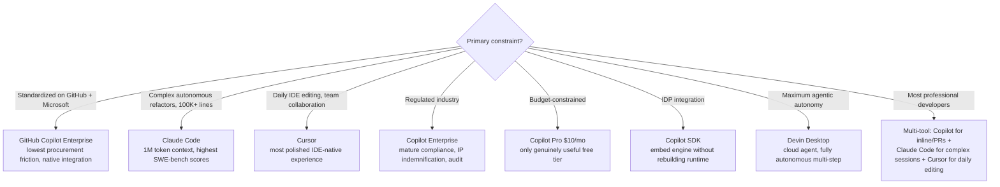

This is part 2 of 2. [Continue from Part 1](../47-github-copilot-enterprise-research-2026.md) for Microsoft/GitHub AI strategy, Copilot architecture, SDK/extensibility, context engineering, SDLC blueprint, best practices, security, and FinOps.

## 12 — Enterprise Adoption Framework

With 90% of Fortune 100 companies deploying Copilot and enterprise customer growth at 75% quarter-over-quarter, GitHub Copilot has crossed the threshold from experimental tool to development infrastructure. This section provides a structured adoption roadmap and AI Center of Excellence model for enterprise organizations.

### Enterprise Adoption Roadmap

#### Phase 0: Foundation (Weeks 1-4)

- Establish AI Center of Excellence (AI CoE) with representatives from Engineering, Security, Legal, and Finance.
- Complete security review: content exclusion policies, data residency requirements, MCP server allowlist.
- Configure organizational GitHub settings: spending caps, policy controls, allowed models list.
- Draft AI coding policy: acceptable use, human review requirements, data classification rules.

#### Phase 1: Pilot (Weeks 4-12)

- Deploy Copilot to a volunteer cohort of 50-100 developers across 3-5 teams with diverse stack profiles.
- Enable inline completion and chat only. No agent mode until pilot cohort is trained on governance.
- Establish baseline metrics: PR cycle time, code review throughput, developer satisfaction scores.
- Run weekly learning sessions. Collect copilot-instructions.md templates from early adopters.

#### Phase 2: Controlled Rollout (Months 3-6)

- Expand to 500-2000 developers. Enable Agent Mode with human-approval requirements on all PRs.
- Publish internal best practices catalog based on pilot learnings.
- Deploy AI FinOps dashboard. Set team-level credit budgets. Train engineering managers on cost governance.
- Enable Copilot Memory for pilot repositories. Begin context engineering training.

#### Phase 3: Full Deployment (Months 6-12)

- Full organization rollout. Enable Copilot Enterprise for all engineering teams.
- Activate Copilot Workspace for issue-to-PR automation on well-scoped backlog items.
- Evaluate Autonomous Agent Mode for non-regulated workloads (internal tooling, test automation).
- Quarterly AI CoE reviews: security incidents, cost optimization opportunities, capability expansion.

#### Phase 4: AI-Native Operations (Year 2+)

- Integrate Copilot SDK into internal developer platforms and CI/CD pipelines.
- Develop custom agents for domain-specific workflows (compliance checking, performance analysis, etc.).
- Shift to outcome-based metrics: features delivered per sprint, security vulnerabilities prevented, MTTR.
- Begin evaluating multi-agent architectures for autonomous delivery of well-defined feature sets.

### Regulated Industry Considerations

| Industry | Key Requirements | Copilot Approach | Risk Level |
|---|---|---|---|
| Banking / Finance | SOX, PCI-DSS, GDPR, model explainability | Enterprise tier, data residency, audit logs, human approval mandatory | High — manage |
| Healthcare | HIPAA, HL7, PHI protection | Content exclusion for PHI files, private codebase only, BAA review | High — manage |
| Government / Defense | FedRAMP, ITAR, clearance requirements | Self-hosted runners, private instance, external model review required | Very High — evaluate |
| Retail / E-commerce | PCI-DSS, CCPA | Enterprise tier, secrets scanning, payment data exclusion | Medium — deploy with controls |
| SaaS / Technology | SOC 2, IP protection | Enterprise tier, IP indemnification, private training only | Low — deploy broadly |

## 13 — Competitive Analysis & Decision Matrix

The AI coding assistant landscape has fragmented dramatically in 2025-2026. Six platforms now serve distinct enterprise personas with meaningfully different architectural philosophies. No single tool wins across all scenarios — the optimal strategy for most enterprises is a complementary multi-tool approach.

### Platform Comparison Matrix

| Dimension | GitHub Copilot | Claude Code | Cursor | Devin/Desktop | Windsurf |
|---|---|---|---|---|---|
| Primary Persona | Enterprise, GitHub-native teams | Power users, complex refactors | IDE-native developers | Fully autonomous tasks | Agentic IDE users |
| Agent Architecture | Multi-agent, worktree isolation | Terminal-native, sequential | IDE orchestrator, Composer 2.5 | Cloud VM, full autonomy | IDE + cloud agent |
| Context Window | ~128K (model dep.) | 1M tokens (GA) | 200K tokens | Full project | 200K tokens |
| GitHub Integration | Native (owns platform) | MCP-based | MCP-based | API-based | MCP-based |
| Enterprise Controls | Mature (SSO, audit, IP indem.) | Team tier, API controls | Business tier, privacy mode | Limited | Limited |
| Pricing (individual) | $10-100/month | $20-200/month (Max) | $20/month | GA, variable | $15/month |
| SWE-Bench Position | Mid (Polaris TBD) | Top 3 (Claude models) | Mid | Mid | Mid |
| Market Share | 42% | ~25% (enterprise coding) | 18% | &lt;5% | &lt;5% |
| Ideal Use Case | Org-wide standardized tooling | Complex architecture, large codebase | Daily IDE editing, multi-file | Delegated autonomous tasks | Agentic IDE work |

### Enterprise Decision Framework

*Enterprise tool-selection decision framework: no single platform wins every scenario — the dominant real-world pattern is a complementary multi-tool stack.*

| Standardized on GitHub + Microsoft stack | GitHub Copilot Enterprise — lowest procurement friction, native integration, existing EA coverage. |
|---|---|
| Complex autonomous refactors, large codebase (100K+ lines) | Claude Code — 1M token context, highest SWE-bench scores, strongest autonomous reasoning. |
| Daily IDE editing, team collaboration | Cursor — most polished IDE-native experience, parallel agent composition, best community. |
| Regulated industry (banking, healthcare, gov) | Copilot Enterprise — most mature compliance controls, IP indemnification, audit infrastructure. |
| Budget-constrained teams | Copilot Pro ($10/month) — only tool with a genuinely useful free tier; unlimited inline completion. |
| Internal developer platform integration | Copilot SDK — embed Copilot engine in custom tooling without rebuilding agent runtime. |
| Maximum agentic autonomy, delegated tasks | Devin Desktop (ex-Windsurf) — cloud agent on VM, designed for fully autonomous multi-step execution. |
| Most professional developers in 2026 | Multi-tool: Copilot for inline + PRs, Claude Code for complex sessions, Cursor for daily editing. |

## 14 — Principal AI Architect Playbook

The Principal AI Architect is the emerging role at the intersection of traditional software architecture, AI platform engineering, and organizational transformation. This playbook defines the competency framework, governance model, and decision authority required to lead an enterprise's AI-native engineering transformation.

### Competency Framework

| Agent Architecture | Design multi-agent topologies. Understand orchestrator-subagent patterns, isolation models, compute substrates, and failure modes. Specify agent boundaries, trust levels, and communication protocols. |
|---|---|
| Context Engineering | Design context hierarchies. Govern instruction files, memory systems, and prompt libraries. Measure and reduce context debt. Optimize token efficiency across agent fleets. |
| AI Security | Model prompt injection attack surfaces. Design "Secure for AI" configuration management. Implement MCP server governance. Specify human-in-the-loop approval requirements. |
| AI Economics | Build FinOps frameworks for token-based billing. Design cost attribution models. Optimize model selection policies. Forecast agent cost at scale. |
| Platform Engineering | Integrate Copilot SDK into internal platforms. Design agent compute infrastructure. Build observability for agent behavior and outcomes. Manage model versioning and migration. |
| Enterprise Transformation | Lead AI CoE. Define AI coding policy. Drive developer upskilling programs. Measure and communicate business outcomes from AI-native engineering. |

### Key Decision Authority

| Decision Domain | Principal AI Architect Authority | Input Required From |
|---|---|---|
| Model selection policy | Set approved model list per task category | Finance (cost), Security (data handling) |
| Agent governance rules | Define approval gates, autonomy levels | Legal, Security, Engineering leadership |
| MCP server allowlist | Approve or reject external integrations | Security, Vendor management |
| Context architecture | Design instruction hierarchy, memory governance | Team leads, DevEx |
| SDK adoption | Approve Copilot SDK embedding in internal tools | Platform engineering, Finance |
| FinOps framework | Set team budgets, spending controls, alerts | Finance, Engineering managers |

## 15 — Future of Software Engineering

The transformation of software engineering is neither a sudden displacement nor a gradual incremental improvement — it is a structural role shift. The developer becomes an architect of intent, a governor of agents, and a guarantor of outcomes. The question is not whether software engineers are needed; the U.S. Bureau of Labor Statistics projects 17% employment growth through 2033. The question is what they will do.

### Forecast: 1-Year, 3-Year, 5-Year

| Horizon | Developer Role | Agent Capability | Architecture Implication |
|---|---|---|---|
| 1 Year (2027) | 75% orchestrate rather than code (Gartner). 60% of new code AI-generated. Junior dev entry bar rises sharply. | Autonomous Agent Mode standard in enterprise. Multi-agent parallel execution routine. Copilot Memory mature. | AI CoE required. FinOps essential. Context engineering a core team skill. Agent security frameworks mature. |
| 3 Years (2029) | 80% of organizations use smaller AI-augmented teams (Gartner). Senior devs: 60% architecture, 30% mentoring, 10% coding. | AI plans, implements, tests, and deploys entire features autonomously. Human sets intent and approves outcomes. | Platform engineering absorbs AI agent infrastructure. SRE extends to agent reliability. New role: AI Guardian. |
| 5 Years (2031) | AI engineer role dominant — designing AI-empowered systems, not writing code. Human expertise irreplaceable for complex innovation. | Agents generate, test, deploy, and monitor software with minimal human involvement for routine workloads. | Intent-to-outcome platforms replace traditional SDKs. Programming languages may abstract to natural language + constraints. |

### Durable vs Obsolete Skills

| Skill Category | Trajectory | Rationale |
|---|---|---|
| System design & architecture | HIGH DEMAND — grows | AI amplifies implementation speed; architecture complexity grows with it |
| Prompt & context engineering | NEW — essential | Primary interface to AI agent capabilities; replaces basic syntax knowledge |
| Agent governance & security | NEW — critical | Every enterprise needs humans who understand agent attack surfaces |
| Business domain knowledge | HIGH DEMAND — grows | AI lacks domain context; humans provide business logic and constraints |
| Boilerplate coding (CRUD) | DECLINING — automate | Copilot generates 90%+ of CRUD patterns correctly today |
| Code review & validation | TRANSFORMING | Shifts from syntax review to architecture and business logic verification |
| AI FinOps & cost governance | NEW — essential | Token-based billing makes cost management a developer skill |
| DevEx & onboarding design | EVOLVING | Designing AI-first developer experiences becomes strategic differentiator |
| Manual test writing | DECLINING — automate | AI generates test suites; humans define test strategy and edge cases |
| Documentation writing | DECLINING — automate | AI generates docs in real time; humans curate and validate accuracy |

### The Paradigm Progression

- **Code First** → **AI Assisted:** Developer writes code; AI suggests completions and improvements. (2021-2024)
- **AI Assisted** → **Agent Driven:** Developer defines tasks; AI agents execute them autonomously. (2025-2026)
- **Agent Driven** → **Intent Driven:** Developer specifies intent (via Issues, PRDs); agents plan and implement. (2026-2028)
- **Intent Driven** → **Outcome Driven:** Developer specifies desired outcome; platform selects, composes, and operates agents to achieve it. (2028+)

## 16 — Anti-Patterns Catalog

| Autopilot Without Approval Gates | Enabling Autonomous Agent Mode without human-approval requirements on all PRs. Consequence: agents merge code without review, bypassing quality and security controls. |
|---|---|
| Ambiguous Issue Assignment | Assigning poorly-scoped GitHub Issues ("fix the bugs") to Coding Agent. Consequence: agent produces broad, unpredictable changes that require extensive rework. |
| Context Debt Accumulation | Allowing copilot-instructions.md files to grow stale without review cycles. Consequence: agent behavior drifts from team standards; conflicting rules cause unpredictable output. |
| Frontier Model for Routine Tasks | Using Claude/GPT-4.1 for linting, docstring generation, or formatting. Consequence: 10-30x unnecessary token cost with identical output quality. |
| Unbounded Agent Sessions | Running agent sessions on large monorepos without context limits, time limits, or spending caps. Consequence: unexpected invoices; June 2026 billing change makes this immediately expensive. |
| Unvetted MCP Server Integration | Connecting arbitrary MCP servers from the marketplace without security review. Consequence: IDEsaster-class attack surface; malicious MCP server can compromise agent context. |
| Treating AI Review as Human Review | Relying exclusively on Copilot's AI code review without human security review for sensitive code paths. Consequence: security vulnerabilities in authentication, authorization, and data access code. |
| Vendor Lock-in Without Abstraction | Building internal tooling directly against Copilot SDK APIs without abstraction layers. Consequence: Polaris migration (August 2026) and future API changes require full rewrites. |
| Skipping Secrets Scanning | Allowing AI-assisted commits without pre-commit secrets detection. Consequence: 3.2% exposure rate (2x human baseline); hardcoded credentials in public repositories. |
| No AI FinOps Governance | Deploying Copilot Enterprise without spending controls, dashboards, or credit budgets. Consequence: departments exceed budgets in first month of autonomous agent adoption. |

## 17 — Enterprise Reference Architecture

The following reference architecture represents a production-grade GitHub Copilot deployment for a mid-to-large enterprise (1,000-10,000 developers) with regulated workloads, multi-cloud infrastructure, and strict governance requirements.

### Developer Layer

- GitHub Copilot Desktop App — Multi-agent fleet orchestration surface for parallel workstreams
- VS Code + Copilot Extension — Primary daily development with inline completion, chat, and agent mode
- Copilot CLI — Terminal-based agent interactions for DevOps and platform engineers
- JetBrains/Eclipse/Xcode — Copilot extension support for non-VS Code development teams

### Context Layer

- copilot-instructions.md — Repository-level coding standards, naming conventions, error handling patterns
- Path-specific instructions — Language/framework-specific rules scoped to directory patterns
- Copilot Memory — Repository-scoped shared persistent memory across all Copilot agents
- Reusable Prompts — Standardized slash commands for common team operations
- Personal Instructions — Individual developer preferences across all workspaces

### Agent Layer

- Orchestrator Agent — Task decomposition, subagent spawning, result aggregation (Project Polaris default)
- Coding Agent — Asynchronous implementation, triggered from GitHub Issues via Copilot Workspace
- Test Agent — Test suite generation and execution in isolated worktree environment
- Security Agent — Vulnerability analysis, dependency scanning, SAST integration via MCP
- Documentation Agent — Real-time docstring, README, and changelog generation
- Review Agent — PR summarization, risk flagging, compliance checking

### Compute Layer

- GitHub Actions Runners (GitHub-hosted) — Default agent compute; 40M+ daily jobs capacity
- Self-Hosted Runners — Enterprise-network agent compute for data residency requirements
- Git Worktrees — Isolation primitive enabling parallel agent execution on same repository
- Copilot Workspace — Structured planning environment for issue-to-PR pipeline

### Integration Layer

- Model Context Protocol (MCP) — 250+ servers: databases, APIs, cloud services, monitoring tools
- Copilot SDK — Embed agent engine in internal platforms, CI/CD, and custom developer tools
- GitHub REST/GraphQL APIs — Programmatic access to Issues, PRs, Actions, Repositories
- Azure AI Foundry — Enterprise model routing, fine-tuning, and evaluation pipeline

### Governance Layer

- AI Center of Excellence — Policy, standards, training, and capability development
- AI FinOps Dashboard — Credit consumption by user/team/repo/model; spending alerts and caps
- Security Controls — Content exclusion policies, MCP allowlist, secrets scanning, audit logs
- Compliance Framework — SOC 2, GDPR, HIPAA controls; data residency configuration
- Human Approval Gates — Mandatory review before merge on all agent-generated PRs

## Research Council — Sources & Evidence

This report synthesizes live research conducted June 2026 across primary sources including GitHub and Microsoft official documentation, Build 2026 announcements, academic publications, and analyst research. All statistics cited reflect the most current publicly available data as of June 6, 2026.

### GitHub Official

- github.blog — Coding Agent announcement (May 2025), SDK launch (Jan 2026), Usage-based billing (April 2026)
- docs.github.com — Copilot Memory, Usage-Based Billing for Organizations, Agent documentation
- github.blog/changelog — Copilot Memory early access (Dec 2025)
- GitHub Copilot Customization Architecture (Lawrence Hwang, GitHub Gist)

### Microsoft Official

- Microsoft Build 2026 Keynotes — Satya Nadella, Panos Panay (June 2-3, 2026, Fort Mason, San Francisco)
- techcommunity.microsoft.com — Building Agents with GitHub Copilot SDK (Jan 2026)
- code.visualstudio.com/docs — Memory in VS Code agents, Subagents, Multi-Agent Development
- windowsnews.ai — Build 2026: Microsoft Turns Windows, Copilot, and Azure into Agent Platform

### Analyst & Research

- Gartner — 75% of developers will orchestrate rather than code by end of 2026 (October 2025)
- Gartner — 80% of organizations evolve to smaller AI-augmented teams by 2030
- Deloitte — 2026 Software Industry Outlook (February 2026)
- Accenture/GitHub — 4,800 developer productivity study: 55% faster task completion
- GitHub/Accenture — PR cycle time: 9.6 days → 2.4 days (75% reduction)
- arxiv.org — Security Concerns in Generative AI Coding Assistants (April 2026)
- arxiv.org — SOK: Hallucinations and Security Risks in AI-Assisted Development (Feb 2026)

### Security Research

- CVE-2025-53773 — GitHub Copilot RCE via prompt injection (disclosed June 2025, patched August 2025)
- IDEsaster research — 24 CVEs, 100% of tested AI IDEs vulnerable (December 2025)
- Checkmarx — GitHub Copilot Security: Risks, Built-In Controls, Best Practices
- GitGuardian — GitHub Copilot Privacy: Key Risks and Secure Usage Best Practices
- Cloud Security Alliance — AI-Generated Code Security: Vibe Coding (March 2026)

### Market & Competitive

- DevOps.com — GitHub Copilot Gets Its Own App (Build 2026)
- TechTimes — Project Polaris, Multi-Agent VS Code at Build 2026
- SitePoint — Claude Code vs Cursor vs Copilot 2026 Comparison (April 2026)
- Medium/Kanerika — Copilot vs Claude Code vs Cursor vs Windsurf 2026 (April 2026)
- Lushbinary — AI Coding Agents 2026 Pricing & Features Compared
- QuantumRun Consulting — GitHub Copilot Statistics 2026

### Produced by the Research Council — June 2026

GitHub Copilot: Enterprise Agent Platform — Comprehensive 15-Phase Research Report

*This document is intended for enterprise architecture, platform engineering, and technology leadership audiences. All data reflects publicly available information as of June 6, 2026.*

## Related Documentation

- [Claude Ecosystem Research Report](../23-claude-ecosystem-research-report.md) — Comprehensive analysis of Claude platform capabilities and ecosystem
- [A2A Protocol: Deep Research & Critical Analysis](../../core/17-a2a-deep-research.md) — Technical standards for agent-to-agent communication
