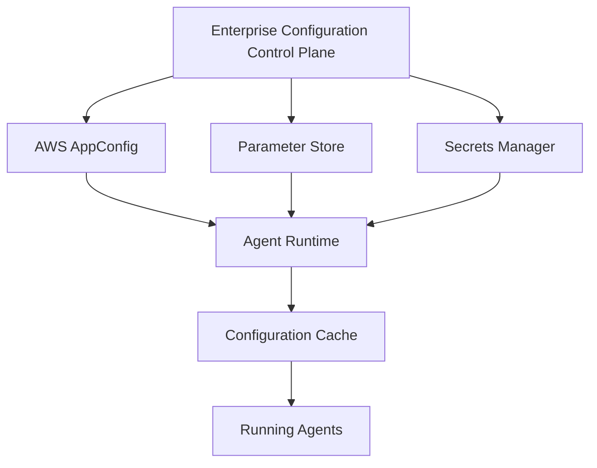

This document is part of the Enterprise Agent Builder Platform architecture reference series, focusing on enterprise configuration & parameter management for agentic ai platforms on aws.

Enterprise configuration management architecture showing the layered approach to managing configuration in Agentic AI systems on AWS. Configuration flows from centralized control plane through multiple AWS services to distributed agent runtimes with local caching for resilience.

# Enterprise Configuration & Parameter Management
for Agentic AI Platforms on AWS
### 2026 Edition
A comprehensive architecture-level research report covering how modern
enterprises design, govern, secure, and operate centralized configuration
management for large-scale Agentic AI platforms.
Document Type Scope
Primary Cloud Classification Edition
Architecture Reference Enterprise Agent Builder Platform AWS (multi-cloud considerations included) Internal — Architecture Review 2026 | v1.0
### Table of Contents
### Executive Summary
### Part 1 — Configuration Taxonomy
|**Part 0** **Part 1**|
I Infrastructure & Application Configuration I Runtime, Agent & Workflow Configuration I Security, Compliance & Governance Configuration I AI-Specific Configuration Categories
### Part 2 — Enterprise Architecture Patterns
|**Part 2**|
I Configuration as Code & GitOps I Dynamic Runtime & Externalized Configuration I Progressive Delivery & Feature Flags I Internal Developer Platforms & Golden Paths
### Part 3 — AWS Services Deep Dive
|**Part 3**|
I AWS Systems Manager Parameter Store I AWS AppConfig I AWS Secrets Manager I AWS Cloud Map & Service Discovery I DynamoDB, S3 & EventBridge for Configuration I Bedrock AgentCore Runtime I ECS / EKS / Lambda Integration
### Part 4 — Runtime Configuration
|**Part 4**|
I Dynamic Refresh Patterns I Push vs Pull Models I Configuration Cache & Distributed Cache I Failure Recovery & Rollback
### Part 5 — Feature Flag Platforms
|**Part 5**|
I AWS AppConfig Feature Flags I LaunchDarkly, Split, Unleash, OpenFeature I Progressive Rollout Strategies
### Part 6 — Secrets Management
|**Part 6**|
I AWS Secrets Manager Deep Dive I HashiCorp Vault I Cross-Account & Multi-Region Secrets I Dynamic Secrets & Certificate Management
### Part 7 — Configuration Hierarchy Design
|**Part 7**|
I Hierarchy Levels & Inheritance I Override Precedence & Conflict Resolution I Version Management & Dependencies
|**Part 8 — Configuration Schema Design**|**Part 8**|
|IAgent, Workflow & Prompt Schemas||
|IModel, Policy & Knowledge Base Schemas ISchema Evolution & Backward Compatibility||
|**Part 9 — Configuration Lifecycle**|**Part 9**|
|IDesign through Deployment IVersioning, Rollback & Archival IGovernance, Ownership & Audit||
|**Part 10 — Platform Engineering**|**Part 10**|
|IInternal Developer Platform Design ISelf-Service Portal & Configuration APIs IGitOps, Terraform & Service Catalog||
|**Part 11 — Security & Zero Trust**|**Part 11**|
|IABAC, RBAC & Cedar Policy||
|IConfig Encryption & Tamper Detection ISupply Chain Security & Provenance||
|**Part 12 — Observability**|**Part 12**|
|IConfiguration Change Monitoring IPropagation Delay & Failure Detection IAudit Logs & Compliance Reports||
|**Part 13 — AI-Specific Requirements**|**Part 13**|
|IPrompt Registry & Versioning IModel Registry & Routing IMCP, Tool & Agent Registries IRAI Policies & Safety Rules||
|**Part 14 — Configuration Delivery**|**Part 14**|
|IPull, Push & Streaming Models IEventBridge, Kafka & Redis Patterns IHybrid Delivery Best Practices||
|**Part 15 — Developer Experience**|**Part 15**|
|ISDK Design & REST/GraphQL APIs IHot Reload & Offline Mode ITesting & Mocking Configuration||
|**Part 16 — Anti-Patterns**|**Part 16**|
|IConfiguration Sprawl & Secret Leakage ICommon Enterprise Failures||
|**Part 17 — Best Practices Catalog**|**Part 17**|
|INaming Standards & Hierarchy||
|IOwnership, Documentation & Governance ISecurity, Resilience & Automation||
|**Part 18 — Comparison Matrix (40+ Criteria)**|**Part 18**|
|**Part 19 — Reference Architecture**|**Part 19**|
|IConfiguration Control Plane Design IMulti-Account AWS Organizations||
|ISequence Diagrams||
|IHigh Availability & Disaster Recovery||
|**Decision Matrix & Technology Selection**|**Appendix A**|
|**Implementation Roadmap (4 Phases)**|**Appendix B**|
|**RFC Template & Implementation Checklist**|**Appendix C**|
### Executive Summary
As enterprises scale Agentic AI platforms to support hundreds or thousands of autonomous agents across multiple teams, environments, and cloud regions, configuration management emerges as a foundational architectural discipline — one that determines whether those platforms are safe, governable, cost-effective, and operationally resilient.
This report provides a comprehensive, architecture-level analysis of how leading organizations design, govern, secure, and operate centralized configuration management for large-scale Agentic AI platforms on AWS. It synthesizes lessons from AWS, Microsoft, Google, Netflix, Uber, Airbnb, LinkedIn, Anthropic, Databricks, and others where publicly available, producing actionable recommendations for enterprise Agent Builder platforms.
### Key Findings
• **Configuration is a first-class platform concern.** Modern Agentic AI systems require more configuration categories (20+) than traditional applications, spanning infrastructure, runtime, model, prompt, memory, RAI policy, cost governance, and compliance domains. Treating configuration as an afterthought leads to sprawl, drift, and safety incidents.
• **No single AWS service solves the complete problem.** The optimal architecture combines AWS AppConfig (dynamic flags and feature rollout), Parameter Store (static non-sensitive values), Secrets Manager (credentials and API keys), DynamoDB (custom configuration service), and S3 (large configuration artifacts) in a layered, purpose-built configuration plane.
• **Runtime hot-reloading is non-negotiable for AI agents.** Unlike traditional microservices, AI agents must update LLM model selections, prompt versions, RAI guardrails, knowledge base references, and kill switches without redeployment. This requires event-driven refresh mechanisms anchored to EventBridge, SQS, and local configuration caches.
• **Hierarchical configuration with inheritance is the enterprise standard.** A 14-level hierarchy (Enterprise → Org → BU → Platform → Environment → Region → Tenant → Project → Agent → Workflow → Tool → Session → User → Request) enables reuse, override, and governance at every scope without configuration duplication.
• **Security must be embedded by design.** Configuration planes must implement Zero Trust with ABAC using AWS IAM and Cedar policy, short-lived credentials, configuration signing (KMS), tamper detection, and complete audit trails via CloudTrail and OpenTelemetry.
• **Developer experience determines adoption.** Platform teams must invest in self-service portals, typed SDKs, CLI tooling, GitOps workflows, and configuration testing frameworks. Poor DX causes teams to bypass governance and hardcode values — the most dangerous anti-pattern for AI systems.
• **Progressive delivery is mandatory for AI configuration changes.** Prompt version updates, model changes, and guardrail modifications must support canary rollout, A/B testing, and instant kill switches. A bad prompt update can cause cascading failures across all agent instances globally within seconds.
### Strategic Recommendations
|**Phase**|**Label**|**Key Actions**|
|Immediate (0–90 days)|PoC|Establish naming conventions, Parameter Store hierarchy, and Secrets Manager baseline. Implement AppConfig for feature flags. Create configuration ownership model.|
|Short-term (90–180 days)|MVP|Deploy centralized Configuration Control Plane on ECS/EKS. Implement GitOps via CodePipeline. Build developer SDK. Enable AppConfig agents with local caching.|
|Medium-term (180–365 days)|Enterprise Scale|Implement full 14-level hierarchy with inheritance engine. Deploy Prompt Registry with versioning and approval workflows. Enable canary rollout for all configuration types.|
|Long-term (12–24 months)|Global|Achieve global multi-region configuration federation. Implement AI-driven configuration optimization. Deploy configuration marketplace for cross-team reuse. Enable sovereign deployments with local configuration replicas.|
I Critical Risk: Enterprise Agent Builder Platforms without proper configuration governance face significant risks including prompt injection via misconfigured guardrails, cost overruns from uncontrolled model selection, compliance violations from misconfigured RAI policies, and cascading failures from uncontrolled configuration updates. The investment in a proper configuration plane pays back within the first quarter of operation at scale.
## Configuration Taxonomy
What Exactly Constitutes Configuration in Modern Agentic AI Systems
Modern Agentic AI systems require a dramatically expanded understanding of configuration. Unlike traditional applications where configuration means environment variables and database connection strings, AI agent platforms must manage 22 distinct configuration categories across the full agent lifecycle — from infrastructure provisioning to real-time safety policy enforcement.
### 1. Infrastructure Configuration
- VPC IDs, subnet IDs, security group IDs • S3 bucket names, DynamoDB table names • ECS cluster ARNs, EKS cluster endpoints, • Regional endpoint overrides Lambda function ARNs • Availability zone configuration • Load balancer ARNs, target group ARNs • Auto-scaling policies and thresholds
- RDS endpoints, ElastiCache cluster endpoints
### 2. Application Configuration
- Service endpoints and base URLs • Retry policies (backoff strategy, max retries, jitter) • Thread pool sizes, connection pool sizes • Timeout configurations (connection, read, write) • Cache TTLs and eviction policies • Batch sizes and parallelism settings • Circuit breaker thresholds • Health check intervals
### 3. Runtime Configuration
- Feature flags (agent capabilities on/off) • Rate limits per tenant/agent/user • Kill switches (emergency stop for agents or tools) • Traffic routing weights • A/B test assignments • Experiment group assignments • Canary rollout percentages • Dark launch flags
### 4. Agent Configuration
- Agent identity and description • Human approval thresholds (when to escalate) • Agent role and permission group • Memory type (short-term / long-term / episodic) • Max concurrent sessions • Planning strategy (ReAct / Plan-and-Execute / • Agent behavioral constraints Tree-of-Thought) • Multi-agent routing rules and orchestration mode
### 5. Workflow Configuration
- Step definitions and DAG structure • Compensation/rollback actions
- Conditional branching rules
- Parallel execution limits
- Step timeout and retry policies
- Human-in-the-loop trigger conditions
- Workflow version and activation flags
- Input/output schema references
### 6. Tool Configuration
- Tool endpoint URLs (REST/gRPC/MCP) • Tool health check endpoints • Tool authentication method and credential • Tool timeout and retry policy references • Tool capability declarations • Tool input/output schemas • Tool version pinning
- Tool rate limits and quota settings
### 7. Prompt Configuration
- Prompt template versions and ARNs
- System prompt references (Prompt Registry)
- Few-shot example references
  - Chain-of-thought instructions • Persona definitions
  - Language and localization settings
- Output format specifications • Prompt approval status and rollback version
### 8. Model Configuration
- Foundation Model IDs (Bedrock model IDs)
- Model version pinning
- Temperature, top-p, top-k sampling parameters
- Max token limits (input + output)
• Stop sequences • Response format (JSON mode, structured output) • Model fallback chains • Embedding model selection
### 9. Memory Configuration
- Short-term memory window size (context tokens) • Memory compression strategy • Long-term memory store references (vector DB • Session persistence settings ARNs) • Cross-session memory policies • Memory retrieval strategy (similarity threshold, • Memory access control rules
- Memory retrieval strategy (similarity threshold, top-k)
- Memory TTL and expiration policies
### 10. Security Configuration
- IAM role ARNs and permission boundaries
- OAuth 2.0 client IDs and token endpoint URLs
- API Gateway authorizer references
- VPC endpoint configurations
- TLS certificate ARNs • KMS key ARNs for encryption
- WAF rule group references
- Network firewall policy ARNs
### 11. Authorization Configuration
- RBAC role definitions
- ABAC attribute schemas
- Cedar policy store references
- OPA policy bundle URLs
- Permission group membership rules
- Scope definitions for OAuth
- Resource-level permission matrices
- Cross-tenant isolation rules
### 12. Feature Configuration
- Feature flags per agent type • Dependency flags (features requiring other • Capability enablement by environment features) • Beta feature opt-in lists • Feature expiration dates • Graduated rollout targeting rules • Feature flag evaluation context schema • Override rules for specific tenants/users
### 13. Experiment Configuration
- Experiment IDs and hypothesis definitions • Experiment start/end dates • Treatment assignment rules • Early stopping criteria • Sample size and statistical power settings • Holdout group configuration • Metric collection configuration • Result analysis endpoints
- **14. Cost Governance Configuration** • Monthly token budget per agent/tenant • Token counting strategy • Cost alert thresholds • Cost allocation tags • Model tier restrictions (e.g., no GPT-4 in dev) • Budget exhaustion behavior (throttle vs block) • Batch inference vs real-time routing thresholds • Reserved capacity allocations
- **15. Observability Configuration** • OpenTelemetry collector endpoints • Metric export intervals • Phoenix/Langfuse server URLs • Alert routing configurations • Trace sampling rates • Dashboard template references • Log levels per component • SLO definitions and error budgets
### 14. Cost Governance Configuration
### 15. Observability Configuration
### 16. Compliance Configuration
- Data residency requirements (allowed regions) • Audit log requirements • Data classification policies • Regulatory framework references (SOC2, GDPR, • Retention periods per data type HIPAA) • PII detection and masking rules • Right-to-erasure policy references • Consent management configurations
### 17. Operational Configuration
- On-call rotation references • Deployment freeze periods • Incident severity thresholds • Capacity reservation settings • Runbook URLs per failure mode • DR failover trigger conditions • Maintenance window definitions • Chaos engineering parameters
### 18. Tenant Configuration
- Tenant ID and display name • Tenant data isolation mode (shared/dedicated) • Tenant tier (Basic/Pro/Enterprise) • Billing account references • Custom domain configurations • Tenant-specific model allowlists • Tenant-specific feature overrides • White-label branding configuration
### 19. Environment Configuration
- Environment name (dev/test/uat/prod) • Environment-specific secret store references
- Environment-specific endpoint overrides
  - Approval workflow requirements by environment
- Debug flags (verbose logging in dev only) • Environment promotion rules
- Mock service endpoints for testing • Blue/green environment routing weights
### 20. Disaster Recovery Configuration
- RTO/RPO targets per service
- Backup schedule definitions
- Failover region priority order
  - Warm standby vs cold standby settings
  - Configuration snapshot frequency
  - DR test schedule and runbook references
- Data replication lag thresholds • Cross-region replication ARNs
### 21. Policy Configuration
- RAI (Responsible AI) policy references
  - Bias detection policy versions
- Guardrail configuration (Bedrock Guardrails • Toxicity filter configurations ARNs) • Output validation rule references
- Constitutional AI policy document references
  - Escalation policy for policy violations
- Content moderation threshold settings
### 22. Context Engineering Configuration
- Context window budget allocation strategy
  - Context priority rules (recency vs relevance)
- RAG retrieval configuration (top-k, similarity threshold) • Dynamic context injection rules
  - Conversation history truncation strategy
  - Context validation schemas
- Knowledge Base ARNs and index references
- Context compression settings
## Enterprise Architecture Patterns
### Configuration as Code (CaC)
Configuration as Code treats every configuration artifact — parameter definitions, feature flag schemas, secret references, agent blueprints — as version-controlled source code with the same review, testing, and deployment rigor as application code.
- All configuration stored in Git repositories alongside infrastructure code
- Pull requests required for any configuration change (no direct console edits in prod)
- Automated linting, schema validation, and policy checks in CI pipelines
- GitOps operators (Flux, ArgoCD) reconcile desired state to actual state
- Immutable configuration artifacts (versioned S3 objects, Parameter Store versions)
- Configuration changes trigger deployment pipelines, not manual steps
**Enterprise Adoption:** Netflix pioneered CaC for their distributed systems with Archaius. AWS CodePipeline with CloudFormation/Terraform represents the AWS-native implementation. For AI platforms, prompt templates and agent schemas must be included in the CaC scope.
### GitOps for Configuration
GitOps extends CaC by making Git the single source of truth for both infrastructure and configuration, with automated reconciliation ensuring the deployed state always matches the Git state. This is the enterprise standard for Kubernetes-based platforms.
- Git repository per environment (or branch-per-environment strategy)
- Automated drift detection alerts when deployed state diverges from Git
- Reconciliation loop continuously syncs configuration from Git to runtime
- Rollback is a Git revert — simple, auditable, and reversible
- Signed commits (GPG) enforce configuration provenance
- Branch protection rules prevent unauthorized configuration changes
**Enterprise Adoption:** Kubernetes-based Agent Builder platforms should use FluxCD or ArgoCD for GitOps. AWS CodePipeline with SSM Parameter Store provides an AWS-native alternative. Anthropic and similar AI infrastructure teams use GitOps for model deployment pipelines.
### Externalized Configuration
The Externalized Configuration pattern (from the 12-Factor App methodology) separates configuration from code entirely, injecting all environment-specific values at runtime from an external configuration service rather than bundling them in container images or deployment packages.
- Zero hardcoded values in application code or container images
- Configuration injected via environment variables, mounted files, or SDK calls
- Configuration service acts as the authoritative source (AppConfig, Parameter Store)
- Applications fail fast at startup if required configuration is missing
- Configuration schema validation enforced at injection time
- Supports multiple configuration sources with clear precedence order
**Enterprise Adoption:** AWS Lambda, ECS, and EKS all support externalized configuration natively via environment variables, SSM Parameter Store integration, and Secrets Manager. The AWS AppConfig Agent extension provides a local proxy for ECS/EKS workloads.
### Hierarchical Configuration with Inheritance
A hierarchical configuration model organizes configuration in a tree structure where lower levels inherit from higher levels and can selectively override specific values. This dramatically reduces duplication and simplifies multi-environment, multi-tenant configuration management.
- Enterprise-level defaults apply everywhere unless overridden
- Environment-level overrides (dev gets verbose logging, prod gets minimal)
- Tenant-level overrides (Enterprise tier gets different model limits)
- Agent-level overrides for specific behavioral customizations
- Merge strategy defined per configuration key (last-wins, deep-merge, append)
- Circular reference detection in inheritance chains
**Enterprise Adoption:** AWS AppConfig supports hierarchical configuration profiles. Spring Cloud Config pioneered this pattern in the Java ecosystem. For Agentic AI platforms, the hierarchy must extend to the agent, workflow, and session levels.
### Progressive Delivery
Progressive delivery applies continuous deployment techniques — canary releases, feature flags, ring deployments, A/B tests — to configuration changes, allowing teams to validate configuration changes with a subset of agents/tenants before full rollout.
- Configuration changes deployed to canary agents (1% → 10% → 50% → 100%)
- Automated rollback on error rate increase or latency degradation
- Feature flags enable runtime toggling without deployment
- A/B testing framework measures impact of configuration changes
- Ring deployment: dev → internal users → beta customers → general availability
- Kill switches provide instant global rollback capability
**Enterprise Adoption:** LaunchDarkly and AWS AppConfig provide native progressive delivery for configuration. For AI platforms, prompt version rollouts and model upgrades must use progressive delivery to prevent quality regressions from reaching all users simultaneously.
### Configuration Federation
Configuration Federation allows multiple teams and systems to own and manage different portions of the configuration namespace, while a central configuration plane provides unified access, governance, and observability across all configuration sources.
- Each platform team owns their configuration namespace
- Central platform provides discovery, caching, and governance layer
- Configuration consumers get a unified API regardless of backend source
- Cross-team configuration dependencies are explicitly declared and versioned
- Federation layer enforces naming conventions and schema standards
- Circular dependency detection across team boundaries
**Enterprise Adoption:** Uber's configuration management at scale uses federation where team-owned stores are aggregated by a central configuration mesh. For an Enterprise Agent Builder Platform, each AI team manages their agent configs while the platform team governs the shared guardrails, models, and security policies.
### Policy-Driven Configuration
Policy-Driven Configuration uses declarative policy engines (OPA, Cedar, AWS SCPs) to automatically enforce constraints on configuration values — preventing invalid, unsafe, or non-compliant configurations from being deployed regardless of who submits the change.
- OPA policies validate configuration changes in CI pipelines
- Cedar policies enforce real-time configuration access control
- AWS Service Control Policies prevent cross-account configuration leakage
- Automated remediation for configuration drift
- Policy-as-code versioned alongside configuration
- Compliance reporting generated from policy evaluation results
**Enterprise Adoption:** HashiCorp Sentinel and AWS Config Rules implement policy-driven configuration. For Agentic AI platforms, policies must enforce RAI guardrail minimums, cost limit maximums, and required observability configuration.
### Intent-Driven Configuration
Intent-Driven Configuration allows developers to declare what they need (high throughput agent, cost-optimized agent, safety-critical agent) and lets the platform translate intents into concrete configuration values — abstracting implementation details from agent developers.
- Agent developers specify intent profiles (FAST, SAFE, CHEAP, BALANCED)
- Platform translates intent to concrete model, prompt, and resource configuration
- Intent profiles are platform-maintained and optimized continuously
- Developers can override specific values while keeping intent profile baseline
- Intent profiles are versioned and A/B tested for quality
- New model releases automatically update intent profile mappings
**Enterprise Adoption:** This pattern is emerging in enterprise AI platforms where developers should not need to know specific Bedrock model IDs or optimal temperature settings. The platform maintains curated profiles that encode best practices and safety defaults.
### Internal Developer Platform (IDP) for Configuration
An IDP provides the developer-facing interface for configuration management: a self-service portal, CLI tools, Terraform providers, and configuration APIs that make it easy to correctly create, update, and consume configuration without deep knowledge of underlying infrastructure.
- Self-service configuration portal with form-based agent creation
- Golden path templates for common agent archetypes
- Configuration CLI with tab completion and validation
- Terraform provider for infrastructure-as-code configuration
- Configuration marketplace for sharing reusable components
- Automated documentation generation from configuration schemas
**Enterprise Adoption:** Platform engineering teams at companies like Spotify (Backstage), Airbnb, and Shopify have built IDPs that include configuration management as a core capability. For Agentic AI platforms, Backstage plugins for agent configuration represent the current state of the art.
## AWS Services Deep Dive
### Comprehensive Evaluation of AWS Configuration Services
### AWS Systems Manager Parameter Store
Hierarchical key-value store for non-secret configuration values, supporting plain text (Standard Tier) and encrypted (SecureString) parameters.
**Latency:** 5–15ms (Standard), 15–30ms (SecureString/KMS) **Availability:** 99.9% SLA **Throughput:** 40–1000 TPS depending on tier **Value size:** 4KB (Standard) / 8KB (Advanced) **Versions:** Up to 100 per parameter **Cost:** Free (Standard) / $0.05 per Advanced parameter/month **Hot Reload:** Not native — requires polling or EventBridge **Rollback:** Manual version retrieval (GetParameter with version label)
|• Native AWS integration — works seamlessly with IAM, Lambda, ECS, EKS, CloudFormation • Hierarchical namespacing with path-based organization (/platform/env/service/key) • CloudFormation and Terraform native support (SSM Parameter references) • Free tier for Standard parameters (up to 10,000 parameters) • GetParametersByPath API enables bulk retrieval by prefix • Event-driven updates via EventBridge when parameters change • CloudTrail audit logging for all parameter access and modifications • AWS Lambda Extensions support for local parameter caching • Parameter versioning (up to 100 versions per parameter)|• No native dynamic refresh/push notification to running applications • API throughput limits: 40 TPS (Standard) / 1000 TPS (Advanced) — can bottleneck at scale • No feature flag semantics — purely key-value, no targeting or rollout logic • Maximum value size: 4KB (Standard) / 8KB (Advanced) • Cross-region replication requires custom implementation • No built-in schema validation or type safety • SecureString requires KMS calls which add latency • Hierarchical path limit: 15 levels deep • No native configuration grouping or atomic multi-parameter updates|
|→Static non-sensitive configuration (endpoints, ARNs, region names) →CloudFormation/Terraform variable injection →Environment-specific baseline configuration →Infrastructure parameter sharing across accounts (cross-account SSM) → Application startup configuration (not runtime-hot-reloaded)|Secrets and credentials (use Secrets Manager instead) Feature flags with targeting rules (use AppConfig) High-frequency runtime configuration reads (>100 TPS per parameter) Large configuration documents (>8KB) Configuration requiring atomic updates across multiple parameters|
### AWS AppConfig
Managed configuration deployment service with built-in progressive rollout, automated validation, deployment strategies, and real-time configuration distribution to running applications. The primary choice for dynamic, hot-reloadable configuration.
**Latency:** &lt;1ms (agent cache hit), 10–50ms (cache miss / API call) **Availability:** 99.9% SLA
**Max Doc Size:** 1MB
**Cache TTL:** Configurable (default 90s for AppConfig Agent) **Rollback:** Automatic on CW alarm or manual stop-deployment **Cost:** $0.0008 per deployment + $0.0008 per 1000 client calls **Hot Reload:** Yes — long-poll or agent-based
**Feature Flags:** Native (simple), advanced requires Evidently/LaunchDarkly
• Built-in deployment strategies: Linear, Exponential, • Maximum configuration document size: 1MB — AllAtOnce with configurable bake times insufficient for very large agent schemas • Automated rollback on CloudWatch alarm triggers • No native multi-level hierarchy (must implement via • Configuration validation via Lambda validators or conventions) JSON Schema • Targeting rules (per-user/per-tenant flags) require • AppConfig Agent (Lambda Extension / sidecar) AWS Evidently or LaunchDarkly provides local caching with sub-millisecond reads • Pricing adds up at scale: $0.0008 per configuration • Supports multiple configuration types: Feature deployment + client calls Flags, Freeform (JSON/YAML/text) • Learning curve for deployment strategy • Native integration with Bedrock, Lambda, ECS, configuration EKS • No built-in A/B testing or experiment framework • Configuration environments and applications • Configuration retrieval requires knowledge of provide logical grouping application/environment/profile structure • Long-poll API enables efficient change detection • Limited querying capabilities (no configuration without excessive API calls search) • Canary and blue/green deployment support • AWS IAM and resource-based policies for fine-grained access control
|→Feature flags and kill switches for agents and tools →Dynamic runtime configuration (prompt versions, model parameters) →Progressive rollout of configuration changes (canary, linear)|Secrets and credentials (use Secrets Manager) Infrastructure-level configuration (CloudFormation parameters) Very large configuration documents (>1MB)  Fine-grained user/tenant targeting without Evidently|
|→Any configuration that must update without agent redeployment →Freeform JSON configuration documents for complex agent schemas|High-frequency writes (AppConfig is primarily read-optimized)|
### AWS Secrets Manager
Managed secrets storage with automatic rotation, cross-account access, multi-region replication, and tight IAM integration for managing credentials, API keys, OAuth client secrets, and other sensitive configuration values.
**Latency:** 20–50ms (API), 1–5ms (SDK cache hit) **Availability:** 99.99% SLA **Max Size:** 65KB per secret **Rotation:** Built-in for RDS/Redshift, Lambda for custom **Replication:** Multi-region (eventual consistency) **Cost:** $0.40/secret/month + $0.05/10K API calls **Hot Reload:** Via SDK caching client (configurable TTL) **Audit:** Full CloudTrail logging
|**STRENGTHS**|**WEAKNESSES**|
|• Automatic secret rotation for supported databases (RDS, Redshift, Elasticsearch) • Custom Lambda rotation functions for any secret type (OAuth tokens, API keys) • Cross-account access via resource-based policies without credential sharing|• Cost: $0.40 per secret/month + $0.05 per 10,000 API calls — expensive at scale • No native dynamic injection (applications must call API or use SDK caching client) • Rotation requires careful implementation to avoid race conditions|
|• Multi-region secret replication for global applications • AWS SDK caching client reduces API calls and latency|• No secret templating or secret schema validation • Cross-region replication is eventually consistent (not real-time) • Maximum secret size: 65KB|
|• Fine-grained IAM policies at secret level (including VPC conditions) • Complete CloudTrail audit log for all secret access         |• Not designed for non-secret configuration (use Parameter Store) • Rotation windows can cause brief downtime if not |
|• Secret versioning with staging labels (AWSCURRENT, AWSPENDING, AWSPREVIOUS) • Integration with Parameter Store (for referencing secrets from CloudFormation) • Tag-based access control enables ABAC patterns|implemented correctly|
|→Database passwords (RDS, Aurora, DynamoDB|Non-sensitive configuration values (use Parameter|
|DAX)|Store — 10x cheaper)|
|→OAuth client secrets and tokens →API keys for external services (OpenAI,|High-frequency reads without caching (expensive at scale)|
|Anthropic, third-party tools)|Feature flags or dynamic runtime configuration|
|→TLS certificate private keys|Configuration requiring sub-millisecond access|
|→Encryption keys that need rotation →Service-to-service credentials|without caching|
### AWS AppConfig with Evidently
AWS CloudWatch Evidently provides enterprise feature flagging, A/B testing, and experimentation on top of AppConfig, enabling per-user/per-tenant targeting with statistical analysis of configuration change impacts.
**Targeting:** Segment-based (user attributes, custom rules) **Rollout:** Percentage-based with traffic splits **A/B Testing:** Native statistical significance **Integration:** CloudWatch Metrics, AppConfig **Cost:** Pay-per-evaluation after free tier **Hot Reload:** Yes, via AppConfig
**STRENGTHS**
• Percentage-based feature rollout with targeting • Less mature than LaunchDarkly for complex rules targeting scenarios • Built-in A/B testing with statistical significance • SDK ecosystem smaller than commercial calculation alternatives • Integration with AppConfig for configuration • No built-in code reference management delivery • Experiment analysis requires CloudWatch • Real-time experiment metric collection via expertise CloudWatch • No native integration with third-party analytics • Segment-based targeting (by user attributes, platforms tenant tier, region) • Pricing model can be complex for large-scale • Overrides for specific users/tenants experiments (whitelist/blacklist) • Launch events for progressive feature enablement • No SDK dependency for basic flag evaluation (REST API)
|→A/B testing prompt variants →Progressive rollout of new model versions| Complex multi-dimensional targeting (use LaunchDarkly)|
|→Tenant-tier based feature enablement|Non-AWS environments|
|→Experiment-driven agent capability rollout|Require rich SDK ecosystem across many languages|
### DynamoDB-backed Configuration Service
A custom configuration microservice built on DynamoDB provides maximum flexibility for enterprise-specific configuration schemas, complex queries, hierarchical inheritance, and integration with existing governance workflows.
**Latency:** &lt;1ms (DAX cache), 1–3ms (DynamoDB direct) **Availability:** 99.999% (Global Tables) **Throughput:** Unlimited (with proper key design) **Item Size:** 400KB per item **Hot Reload:** Yes (via Streams + Lambda/SNS/SQS/EventBridge) **Replication:** Global Tables (active-active, &lt;1s replication) **Cost:** Variable — DynamoDB pricing + service infrastructure **Rollback:** Custom implementation required
**STRENGTHS**
|• Unlimited flexibility for configuration schema and query patterns • DynamoDB Streams enable real-time push notification of configuration changes|• Requires building and maintaining a custom service (significant engineering investment) • Need to implement all governance, validation, and rollout logic from scratch|
|• Single-digit millisecond latency with DAX caching • Hierarchical configuration via DynamoDB partition/sort key design • Native support for complex configuration documents (JSON up to 400KB per item) • Global Tables provide multi-region active-active replication • DynamoDB Streams + Lambda enable event-driven configuration propagation • No vendor lock-in to specific configuration semantics|• DynamoDB table design is critical — mistakes are costly to fix • Must implement own SDK, API, and developer tooling • Operational overhead of managing the service itself • Requires careful capacity planning (on-demand vs provisioned throughput) • Hot partition risk if many agents read the same configuration key simultaneously|
|• Can implement custom inheritance, conflict resolution, and versioning logic • Point-in-time recovery for configuration history||
|→Complex configuration schemas not supported by|Simple key-value configuration (use Parameter|
|AppConfig (>1MB, complex hierarchies) →Configuration requiring complex query patterns (search by agent type, tenant, capability) → Multi-tenant configuration with complex inheritance rules|Store — lower operational overhead) Secrets (use Secrets Manager) Teams without DynamoDB expertise MVP/PoC phase — too much engineering investment up-front|
|→Configuration marketplace — searchable, tagged, reusable components →Audit history and configuration lineage tracking||
### Bedrock AgentCore Runtime
AWS Bedrock AgentCore Runtime provides managed infrastructure for deploying AI agents at scale, with built-in configuration integration, memory management, tool connectivity, and observability — specifically designed for Agentic AI workloads.
**Launch Year:** 2024 (GA 2025) **Scaling:** Auto-scaling (managed) **Model Support:** Bedrock-native models **Tool Integration:** Lambda, API, MCP **Observability:** CloudWatch, X-Ray native **Memory:** Built-in session + external store
|• Native integration with Bedrock models, knowledge bases, and guardrails|• Relatively new service (2024/2025) — not yet production-proven at large enterprise scale|
|• Built-in session management and agent memory • Managed tool connectivity (API, Lambda, MCP|• Limited to AWS Bedrock model ecosystem (not model-agnostic)|
|server integration) • Auto-scaling for concurrent agent execution • Native observability integration with CloudWatch and X-Ray|• Less flexibility for custom agent frameworks (LangChain, custom Python) • Vendor lock-in risk for core agent orchestration • Pricing model still evolving|
|• IAM-native access control for agent permissions • Integration with Parameter Store and Secrets Manager for agent configuration • Multi-agent orchestration support • Built-in retry and timeout handling • Bedrock Guardrails integration for real-time safety enforcement|• Limited support for complex multi-step workflow orchestration|
|→AWS-native agent deployments using Bedrock models → Rapid agent deployment without custom infrastructure →Agents requiring built-in memory and tool management →Enterprises wanting fully managed agent runtime|Multi-cloud or model-agnostic agent frameworks Complex custom agent orchestration patterns Organizations with strict vendor lock-in policies|