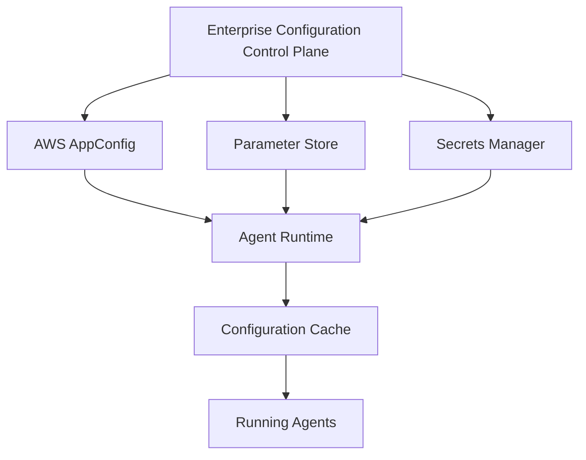

This document is part of the Enterprise Agent Builder Platform architecture reference series, focusing on enterprise promptops: prompt lifecycle management for aws agentcore runtime.




Enterprise configuration management architecture showing the layered approach to managing configuration in Agentic AI systems on AWS. Configuration flows from centralized control plane through multiple AWS services to distributed agent runtimes with local caching for resilience.

**ENTERPRISE PROMPTOPS PROMPT LIFECYCLE MANAGEMENT FOR AWS AGENTCORE RUNTIME**
Arize AX · Phoenix · LangSmith · Langfuse · Braintrust · MLflow 24-Part Research Report — Arize AX vs AWS-Native vs All Alternatives
**2026 Edition**
**Classification**
Enterprise Research
**Coverage**
24 Parts · PromptOps Maturity · Registry · Governance · RAI · Security · Architecture · Decision Matrix
**Primary Focus**
AWS AgentCore Runtime + Arize AX/Phoenix — Reference Architecture & Platform Selection
**Edition**
June 2026
## Table of Contents
### Executive Summary
|**Part 1**|PromptOps Evolution & Maturity Model|
|**Part 2**|The Complete Prompt Lifecycle|
|**Part 3**|Prompt Registry Design|
|**Part 4**|AWS AgentCore Runtime Integration|
|**Part 5**|Dynamic Prompt Update Architecture|
|**Part 6**|Running Conversations & Session Consistency|
|**Part 7**|Prompt Version Routing|
|**Part 8**|Prompt Governance|
|**Part 9**|Responsible AI Integration|
|**Part 10**|Security Hardening|
|**Part 11**|AWS AgentCore Runtime — Capabilities & Gaps|
|**Part 12**|Arize AX — Deep Dive|
|**Part 13**|Phoenix — Deep Dive|
|**Part 14**|AWS-Native Alternative|
|**Part 15**|Platform Comparison Matrix|
|**Part 16**|Agent Runtime Integration Patterns|
|**Part 17**|Multi-Agent Systems|
|**Part 18**|Prompt Template Systems|
|**Part 19**|Enterprise Reference Architecture|
|**Part 20**|PromptOps CI/CD|
|**Part 21**|Anti-Patterns|
|**Part 22**|Complete Enterprise Reference Architecture|
|**Part 23**|Decision Matrix|
|**Part 24**|Implementation Blueprint|
|**Appendix A**|Capability Heat Map|
|**Appendix B**|Prompt Governance Model|
|**Appendix C**|Final Recommendation|
## Executive Summary
Prompts are the behaviour layer of enterprise AI. As organizations deploy autonomous agents on AWS AgentCore Runtime, the discipline of **PromptOps** — systematic lifecycle management of prompts from authoring through retirement — has moved from optional engineering hygiene to a compliance and operational necessity.
This research answers a single strategic question for regulated enterprises running AWS AgentCore Runtime: **Should Arize AX become the central Prompt Lifecycle platform, or should AWS-native capabilities own lifecycle management?**
### Key Findings
### The Gap is Real
AWS AgentCore Runtime (GA October 2025) provides excellent agent execution infrastructure but has no built-in prompt registry, approval workflow, semantic versioning, or evaluation pipeline. These must come from external platforms or be built.
### Arize AX is Observability-First
Arize AX is the industry leader for production LLM observability and online evaluation — processing 1 trillion spans monthly — but prompt lifecycle management (versioning, approval workflow, CI/CD gating) is not its primary product surface. The Prompt IDE and Prompt Learning features exist but are experimentation-oriented, not registry-oriented.
### Humanloop is Gone
Anthropic acquired Humanloop in July 2025 and shut it down September 8, 2025. Teams migrating from Humanloop should prioritise Langfuse (open-source), Braintrust (eval-CI/CD), or Agenta (OSS lifecycle).
### No Single Platform Covers All 24 Dimensions
The research confirms a capability gap across all platforms: none provides complete authoring + registry + versioning + approval + CI/CD + deployment + runtime routing + online monitoring + rollback in one unified system.
### Recommended Architecture
AWS + Arize AX for production observability and online evaluation, paired with either Langfuse (data-sovereignty) or Braintrust (eval-gated CI/CD) for prompt lifecycle management, and AWS AppConfig for zero-downtime runtime delivery.
### Compliance Urgency
EU AI Act high-risk (Annex III) enforcement begins December 2, 2027 — deferred from August 2026 by the Digital Omnibus; Article 50 transparency applies from August 2, 2026. Prompt behavior is now an auditable artifact. Organizations must demonstrate versioned, approved, human-reviewed prompt governance or face regulatory exposure.
**Strategic Recommendation: Do not attempt to build PromptOps entirely on AWS-native services — the operational complexity is prohibitive. Do not make Arize AX the sole lifecycle platform — it lacks the registry and CI/CD gating layer. The winning architecture is AWS AppConfig (delivery) + Arize AX (observability) + Langfuse or Braintrust (registry/CI/CD) — governed by GitOps, policy-as-code, and human approval workflows.**
How the discipline evolved from prompt engineering to autonomous prompt optimization — and where enterprises sit in 2026.
### The Eight Stages of PromptOps Evolution
PromptOps has matured through distinct phases, each adding governance, tooling, and automation. Understanding the progression reveals why enterprises in 2026 face a critical inflection point.
|**Stage 1: Prompt**<br/>**Engineering (2022–2023)**|Individual practitioners manually craft prompts in playgrounds. No version control.<br/>No evaluation. No governance. Prompts live in notebooks, READMEs, or<br/>application code strings. Works at individual scale; fails completely at team scale.|M|
|**Stage 2: Prompt**<br/>**Management (2023)**|Teams begin storing prompts in shared files, Git repositories, or basic CMS-style<br/>tools. PromptLayer (2022) emerges as first dedicated tool. Basic logging of<br/>inputs/outputs. No systematic evaluation or approval.|M|
|**Stage 3: Prompt Versioning**<br/>**(2023–2024)**|Semantic versioning applied to prompts. Rollback capability. LangSmith Prompt<br/>Hub, MLflow Prompt Registry, Langfuse prompt versioning introduced. Evaluation<br/>tied to specific versions. The 'Git for prompts' metaphor becomes industry<br/>standard.|M|
|**Stage 4: Prompt Registry**<br/>**(2024)**|Centralized registry with metadata, tags, ownership, lineage, and dependency<br/>graphs. Discovery by semantic search. Multi-environment promotion (dev→<br/>staging→prod). Evaluation history attached to each version. First enterprise<br/>governance layers appear.|M|
|**Stage 5: Prompt**<br/>**Deployment (2024–2025)**|Prompts deployed as first-class infrastructure artifacts. CI/CD pipelines with quality<br/>gates. A/B testing and canary deployments. Zero-downtime updates via<br/>AppConfig/feature flags. Champion/challenger routing. Braintrust eval-gated CI<br/>becomes reference pattern.|M|
|**Stage 6: Runtime Prompt**<br/>**Orchestration (2025)**|Dynamic routing at runtime: model-specific prompts, tenant-specific variants,<br/>context-sensitive selection. Prompt Gateway pattern emerges. Session-aware<br/>version pinning. Background polling with TTL-based cache invalidation. Pub/Sub<br/>prompt updates.|M|
|**Stage 7: Autonomous**<br/>**Prompt Optimization**<br/>**(2025–2026)**|LLM-driven prompt improvement loops. Production failures automatically become<br/>evaluation cases. DSPy-style optimization with compiled prompts. Arize AX Prompt<br/>Learning, Braintrust Loop AI, FutureAGI self-improvement. Human approval gates<br/>remain mandatory for production.|M|
|**Stage 8: Self-Healing**<br/>**Prompts (Emerging**<br/>**2026–2027)**|Agents monitor their own prompt performance, detect drift, generate improvement<br/>candidates, run offline evaluation, and propose PRs — with humans in the approval<br/>loop. Policy-driven auto-rollback on quality degradation. The prompt becomes a<br/>living, self-maintaining artifact.||
### PromptOps Maturity Model — Levels 0–5
**Level 0 Chaotic**
|Prompts embedd<br/>ownership. Produ<br/>Individual heroics|ed in source code or spreadsheets. No versioning. No<br/>ction incidents from uncontrolled changes. No evaluation.<br/>required.|*~15% of enterprises in 2026*|
|**Level 1**|**Initial**||
|Prompts in Git fil<br/>deployment. One|es. Basic README documentation. Ad-hoc testing before<br/>person owns 'the AI stuff'. Manual senior approval.|*~35% of enterprises in 2026*|
|**Level 2**|**Defined**||
|Dedicated promp<br/>suite for major ag|t repository with metadata. CI validates schema. Evaluation<br/>ents. Defined ownership. Basic versioning with rollback.|*~28% of enterprises in 2026*|
|**Level 3**|**Managed**||
|Centralized prom<br/>evaluation gates.<br/>updates via App|pt registry. Semantic search. Approval workflows. Automated<br/>RAI review. Cost monitoring. Developer portal. Zero-downtime<br/>Config.|*~15% of enterprises in 2026*|
|**Level 4**|**Quantitative**||
|Online evaluation<br/>Cross-team mark<br/>AX or equivalent|in production. A/B testing. Automatic regression detection.<br/>etplace. AIBOM. Full lineage. Compliance automation. Arize<br/>in production.|*~6% of enterprises in 2026*|
|**Level 5**|**Optimizing**||
|Autonomous pro<br/>models. Policy-dr<br/>prompts.|mpt improvement with human approval. Predictive quality<br/>iven rollback. Cross-organizational federation. Self-healing|*&lt;1% of enterprises in 2026*|
### PART 2
# The Complete Prompt Lifecycle
18-stage end-to-end lifecycle from business requirement through audit archive — with ownership, tooling, and governance at each stage.
Every production prompt must traverse a defined lifecycle. Skipping stages — especially RAI validation, red team testing, and formal approval — is the primary cause of production AI safety incidents. The lifecycle is not a waterfall; prompts cycle through improvement loops continuously.
|**1. Business Requirement**|Product Owner documents business capability, constraints, success metrics, and<br/>regulatory context. AI Architect reviews feasibility. Risk classification assigned<br/>(low/medium/high/critical).|M|
|**2. Prompt Authoring**|Prompt Engineer designs system/task/chain prompts. Iterative playground<br/>experimentation (Arize Prompt IDE, Langfuse). Template system selected (Jinja2,<br/>Mustache, structured JSON). v0.1.0-alpha tagged.|M|
|**3. Peer Review**|Second engineer reviews for quality, tone, safety, standards compliance. GitHub<br/>PR with checklist. Reviewer must not be the author. Automated linting enforced.|M|
|**4. RAI Validation**|Responsible AI Officer reviews against AI Constitution, bias criteria, fairness<br/>requirements, transparency obligations. Hallucination risk assessed. Structured<br/>RAI checklist completed.|M|
|**5. Security Review**|AI Security Architect checks for prompt injection vulnerabilities, PII leakage<br/>patterns, secret exposure, privilege escalation risks, and supply chain integrity.<br/>OWASP Agentic AI Top 10 checklist.|M|
|**6. PII Review**|Data Privacy team scans for PII in prompt templates, few-shot examples, and<br/>knowledge base references. GDPR/CCPA/HIPAA compliance validated. Data<br/>classification assigned.|M|
|**7. Red Team Testing**|Adversarial testing against jailbreak, prompt injection, indirect injection, tool<br/>poisoning, and boundary-pushing scenarios. Safety team and/or external red team.<br/>Required for high/critical risk.|M|
|**8. Evaluation**|Automated evaluation suite: unit tests, integration tests, regression vs golden<br/>datasets, LLM-as-judge scoring. Quality gate thresholds defined. Evaluation<br/>platform (Arize AX, Braintrust, Langfuse) runs suite.|M|
|**9. Approval**|Governance Board review for high-risk. RAI Officer + CISO sign-off. Approval<br/>workflow (Tier 1–5 based on risk). Cryptographic approval record attached to asset<br/>version.|M|
|**10. Versioning**|Semantic version assigned (MAJOR.MINOR.PATCH). Immutable release created.<br/>Cryptographic hash generated. Signed by release manager. Compatibility matrix<br/>updated. Metadata record completed.|M|
|**11. Deployment**|Promoted to staging registry. Integration tests run. Canary deployment to 5%<br/>traffic. Blue-green switch after validation window. AppConfig deployment strategy<br/>configured.|M|
|**12. Rollout**|Progressive traffic ramp: 5%→25%→50%→100% over 24–72 hours.<br/>Automated quality monitoring during ramp. Rollback trigger if quality metrics breach<br/>thresholds.|M|
|**13. Runtime Selection**|At agent invocation, Prompt Gateway selects correct version based on routing<br/>policy: model, tenant, A/B experiment, agent type, context. Session-level version<br/>pinning applied.|M|
|**14. Monitoring**|Production observability via Arize AX: latency, token cost, quality scores, safety<br/>violations, hallucination rates, drift detection. Alerts to PagerDuty/Slack.|M|
|**15. Incident Response**|On quality alert: incident created, on-call notified, root cause analysis started.<br/>Traffic can be diverted or rolled back within minutes. Post-incident review within<br/>48h.|M|
|**16. Rollback**|One-command rollback to previous stable version. Session consistency maintained<br/>(active sessions continue on current version, new sessions get rolled-back<br/>version). Full audit log of rollback event.|M|
|**17. Retirement**|Deprecation notice issued (30+ days). Migration guide published. Traffic gradually<br/>migrated to successor. Final retirement removes from active registry. Archive<br/>record created.|M|
|**18. Audit Archive**|Immutable archive with complete history: all versions, evaluations, approvals,<br/>deployments, incidents, and retirement record. Retained per regulatory<br/>requirements (7+ years for financial, healthcare).||
### Lifecycle Ownership Matrix
|**Stage**|**Primary Owner**|**Approver**|**Tooling**|
|Requirement–Design|AI Product Owner|AI Architect|Jira, ADR|
|Authoring|Prompt Engineer|Tech Lead|IDE, Git, Arize Prompt IDE|
|Peer Review|Senior Engineer|Team Lead|GitHub PR, Checklist|
|RAI Validation|RAI Officer|RAI Officer|RAI Checklist, Arize Evals|
|Security Review|AI Security Architect|CISO|OWASP Checklist, Scanners|
|PII Review|Data Privacy Team|Privacy Officer|PII Scanner, Classification Tool|
|Red Team|Security Team|CISO + RAI Officer|Red Team Platform, Promptfoo|
|Evaluation|Evaluation Engineer|Quality Gate (automated)|Arize AX, Braintrust, Langfuse|
|Approval|Governance Board|CISO + RAI Officer|Approval Workflow Engine|
|Versioning–Deploy|AI Platform Engineer|Release Manager|Registry, AppConfig, CDK|
|Monitoring|SRE|On-Call Engineer|Arize AX, CloudWatch|
|Rollback|SRE / On-Call|Incident Commander|Registry API, AppConfig|
|Archive|AI Platform Engineer|Compliance Team|S3 Glacier, CloudTrail|
## Prompt Registry Design
Enterprise prompt registry architecture — metadata model, versioning, lineage, dependency graphs, and implementation patterns.
A prompt registry is the authoritative source of truth for approved, versioned, discoverable prompts consumed at runtime. It is architecturally distinct from a repository (source control) and a configuration store (runtime delivery). All three are required in a production PromptOps stack.
### Registry vs Repository vs Configuration Store
|**Layer**|**Purpose**|**Examples**|**Enterprise Role**|
|Repository|Source control, version history,<br/>collaboration, PR workflow|Git (GitHub/GitLab/CodeCommit)|Authoring, peer review,<br/>branching, history|
|Registry|Discovery, governance, evaluation<br/>history, lineage, deployment|MLflow Prompt Registry, Langfuse<br/>Prompts, Custom|Approval gate, semantic search,<br/>dependency graph|
|Configuration Store|Runtime delivery, hot reload,<br/>caching, A/B routing|AWS AppConfig, Parameter Store,<br/>Redis|Zero-downtime updates, canary<br/>routing, TTL cache|
### Universal Prompt Registry Metadata Schema
```
# Prompt Registry Schema v2.0 (YAML)
id:               'prompt-uuid-v4'          # Globally unique, immutable
name:             'customer-support-system'  # Human-readable slug
version:          '2.3.1'                    # SemVer — MAJOR.MINOR.PATCH
type:             'system|task|chain|eval|safety|routing'
lifecycle_state:  'draft|review|approved|active|deprecated|retired'
created_at:       '2026-03-15T09:00:00Z'
owner:
  team:           'customer-experience'
  email:          'cx-ai@company.com'
  cost_center:    'CC-1042'
model_compatibility:
  - 'claude-sonnet-4-6'
  - 'claude-opus-4-6'
template_engine:  'jinja2'
parameters:       ['customer_name', 'product_id', 'context']
tags:             ['domain:cx', 'language:en', 'pii:low']
security:
  classification: 'internal'         # public|internal|confidential|restricted
  pii_risk:       'low'              # none|low|medium|high
  signed_hash:    'sha256:abc123...' # Tamper detection
  signer:         'release-manager@company.com'
evaluation:
  quality_score:  0.94
  safety_score:   0.99
  last_eval_run:  'eval-run-uuid-001'
  eval_suite:     'cx-eval-suite-v3'
governance:
  rai_approved:   true
  rai_officer:    'rai@company.com'
  security_approved: true
  approval_date:  '2026-03-20'
  review_cycle:   '90d'
lineage:
  derived_from:   'prompt-uuid-previous-version'
  authoring_tool: 'arize-prompt-ide'
  eval_runs:      ['eval-run-uuid-001', 'eval-run-uuid-002']
dependencies:
  macros:         ['safety-clause-v1', 'brand-voice-v2']
  tools:          ['tool-crm-lookup-v3']
  models:         ['claude-sonnet-4-6']
benchmark_history:
  - version: '2.3.0'
    score:   0.91
    date:    '2026-02-01'
```
### Key Registry Capabilities
### Semantic Search
Vector-based discovery across prompt names, descriptions, capabilities, and tags. Engineers find existing prompts before creating duplicates.
### Semantic Versioning
MAJOR for behavioral breaking changes; MINOR for backward-compatible capability additions; PATCH for typos and documentation. Pre-release suffixes (-alpha, -beta, -rc) block production promotion.
### Immutable Versions
Once a version is released, its content is immutable. Signed SHA-256 hash attached at release. Any tampering is detectable.
### Signed Prompts
Release manager signs the prompt hash using organizational PKI. Runtime validates signature before loading. Prevents supply-chain attacks.
### Lineage Tracking
Full provenance graph: derived-from, authoring tool, evaluation run IDs, model used in testing. Enables impact analysis when a dependency changes.
### Dependency Graph
Tracks which macros, tools, and models each prompt version depends on. Breaking change in a dependency triggers re-evaluation of all dependents.
### Evaluation History
All evaluation runs linked to specific prompt versions. Score trends over time. Benchmark comparisons across versions visible in single view.
### Rollback Support
One-API-call rollback to any previous stable version. Rollback event logged with reason. Active sessions optionally migrated or grandfathered.
### Approval Records
Digital approval records attached to each version. Multi-stage workflow audit trail. Cannot be manually overridden outside the workflow.
### PART 4
## AWS AgentCore Runtime Integration
Where prompts should live, how AgentCore retrieves them, caching strategies, and propagation patterns.
AWS AgentCore Runtime (GA October 2025) is a serverless execution environment for AI agents. It provides session isolation, authentication, observability, and up-to-8-hour autonomous execution. It does NOT provide a built-in prompt registry, versioning, or approval workflow.
### Prompt Storage Options — Comparison
|**Storage Option**|**Use Case**|**Latency**|**Versioning**|**Governance**|**Recommendation**|
|Embedded in code|Prototype only|0ms|Git only|None|IAnti-pattern|
|S3 Object|Large prompts,<br/>binary assets|50–200m<br/>s|S3<br/>Versioning|S3 policies|IILast resort|
|SSM Parameter Store|Simple, small configs|20–50ms|Parameter<br/>history|IAM|IIToo simple|
|Secrets Manager|Prompt templates<br/>with secrets|30–60ms|Version<br/>history|IAM + rotation|IIMisuse of intent|
|DynamoDB|Structured prompt<br/>registry|2–10ms|Custom<br/>versioning|IAM + custom|IGood for custom registry|
|AWS AppConfig|Dynamic config<br/>delivery|1–5ms<br/>(cached)|Deployment<br/>versions|IAM +<br/>validators|IBest for delivery layer|
|External Registry<br/>(Langfuse/Braintrust)|Full lifecycle<br/>management|10–50ms<br/>(cached)|Full semver<br/>+ lineage|Full<br/>governance|IBest for governance layer|
|Redis Cache|Hot prompt cache in<br/>agent|0.5–2ms|Cache<br/>invalidation|None (cache<br/>only)|IRequired at scale|
### Recommended Architecture: Layered Prompt Delivery
The production pattern uses three layers: the Registry (governance), AppConfig (delivery), and an in-process cache (performance). This separation keeps concerns clean and enables zero-downtime updates.
|**Layer 1: Prompt Registry**<br/>**(Langfuse / Braintrust /**<br/>**MLflow)**|Authoritative source of truth. Stores approved, versioned prompts with full<br/>metadata, lineage, evaluation history, and governance records. Engineers interact<br/>with this layer for authoring, review, and approval.|M|
|**Layer 2: AWS AppConfig**<br/>**(Delivery)**|Pulls approved prompt versions from the registry on release. Applies deployment<br/>strategies (instant, linear, canary). Serves to AgentCore via sidecar/Lambda<br/>extension. Handles rollback. Exposes localhost HTTP endpoint to agents.|M|
|**Layer 3: In-Process Cache**<br/>**(Redis / Local LRU)**|Agent caches the current prompt version in memory or Redis with a configurable<br/>TTL (default: 60s). Background poller checks AppConfig for new versions. On TTL<br/>expiry or poll response, cache refreshed without restarting agent.||
### Prompt Cache & Bedrock Prompt Caching
AWS Bedrock offers built-in **Prompt Caching** (GA 2025) which caches processed token KV-states at the model layer, reducing latency and cost for long, repeated system prompts. Key details:
- Default TTL: 5 minutes. Extended TTL: 1 hour available for Claude Opus 4.5, Haiku 4.5, Sonnet 4.5.
- Cache checkpoint markers embedded in system prompt signals Bedrock to cache from beginning of prompt up to that point.
- Cache hit: ~10x faster response, ~80% lower token cost for cached portion.
- Cache invalidation: automatic on TTL expiry. Manual: update the prompt content (hash mismatch invalidates).
- Critical: Bedrock prompt caching operates at the MODEL layer, not the application layer. It is complementary to, not a replacement for, AppConfig delivery or Registry versioning.
- Multi-region: Bedrock prompt caching works with cross-region inference for HA deployments.
How to update prompts without redeploying, restarting, or interrupting running agents.
Zero-downtime prompt updates are the single most operationally complex challenge in PromptOps. Agents may run for hours; sessions may number in the tens of thousands. This part covers all major architectural patterns and their tradeoffs.
### Update Architectures — Comparison
|**Pattern**|**Latency to**<br/>**Update**|**Complexit**<br/>**y**|**Session Safety**|**Best For**|
|Hot Reload / AppConfig Poll|30–120s|Low|New sessions<br/>only|Standard production deployments|
|TTL Cache with Background<br/>Refresh|TTL + poll<br/>interval|Low|Session-configura<br/>ble|High-volume, cost-sensitive|
|Webhook / Push<br/>(EventBridge)|~1s|Medium|Configurable|Time-critical updates (safety patches)|
|Redis Pub/Sub|~10ms|Medium|Per-subscriber|Multi-agent, real-time coordination|
|SNS→SQS Fan-out|1–10s|Medium-Low|Message-driven|Multi-region, async broadcast|
|Prompt Gateway (API)|On-demand|High|Per-request|Fine-grained routing, A/B testing|
|Feature Flags<br/>(LaunchDarkly-style)|~1s|Medium|User/session<br/>targeting|Canary rollouts, tenant control|
### Recommended Pattern: AppConfig + Redis Pub/Sub
For most enterprise AgentCore deployments, the optimal architecture combines AWS AppConfig for governed delivery with Redis Pub/Sub for real-time invalidation:
```
# Agent startup: initialize prompt cache
CACHE = {}
CACHE_TTL = 60  # seconds
def get_prompt(prompt_id: str, session_version: str = None) -> str:
    # 1. Session-pinned version (for running conversations)
    if session_version:
        return fetch_from_registry(prompt_id, session_version)
    # 2. Check local cache (TTL-based)
    cached = CACHE.get(prompt_id)
    if cached and (time.time() - cached['ts']) < CACHE_TTL:
        return cached['content']
    # 3. Fetch from AppConfig (sidecar on localhost:2772)
    resp = requests.get(
        f'http://localhost:2772/applications/prompts/environments/prod/configurations/{prompt_id}'
    )
    prompt = resp.json()['content']
    CACHE[prompt_id] = {'content': prompt, 'ts': time.time()}
    return prompt
# Redis pub/sub invalidation listener (background thread)
def invalidation_listener():
    r = redis.Redis(host=REDIS_HOST)
    pubsub = r.pubsub()
    pubsub.subscribe('prompt-invalidations')
    for msg in pubsub.listen():
        if msg['type'] == 'message':
            prompt_id = msg['data'].decode()
            CACHE.pop(prompt_id, None)  # Force next fetch from AppConfig
```
### AWS AppConfig Deployment Strategies
AppConfig supports several deployment strategies matching different risk profiles:
|**Strategy**|**Duration**|**Use Case**|**Rollback**|
|Instant (AllAtOnce)|0 min|Low-risk patches, typos, metadata|Manual or automated|
|Linear 10%/min for 10min|10 min|Standard changes, minor versions|Automated on alarm|
|Canary 5% for 15min, then 95%|15 min|Feature additions, MINOR bumps|Automated on quality<br/>alarm|
|Exponential Ramp|30–60 min|High-risk MAJOR version changes|Automated on any alarm|
|Manual Bake Time|Custom|Safety-critical prompts|Manual sign-off required|
### Prompt CDN / Prompt Gateway Pattern
For global, high-throughput deployments, a Prompt Gateway (API service) centralizes routing, caching, and policy enforcement across all agents and regions:
- Single endpoint for all agent prompt requests: GET
- /v1/prompts/{id}?version=latest&tenant;=acme&model;=claude-sonnet
- Gateway applies routing policy: A/B assignment, canary percentage, tenant overrides, model-specific variants
- Redis cluster behind gateway provides sub-millisecond cache hits at scale
- Gateway publishes invalidation events on update, all downstream caches refresh
- Gateway enforces authorization: only authorized agents can access specific prompts
- Gateway logs every prompt access for audit trail
What happens when Prompt v15 is updated to v16 while 10,000 sessions are running.
Session consistency is the most nuanced operational challenge in PromptOps. The question 'should active sessions migrate to the new version?' has no universal answer — it depends on risk profile, compliance requirements, and whether the version change is behavioral or cosmetic.
### Session Consistency Strategies
|**Strategy**|**Behavior**|**Use Case**|**Risk**|
|Pin to session-start<br/>version|Session uses version active at<br/>session creation for entire lifetime|Long-running workflows,<br/>high-stakes agentic tasks|Low — deterministic per<br/>session|
|Migrate active sessions at<br/>checkpoint|At next natural pause point,<br/>session migrates to new version|Conversational agents with clear<br/>turn boundaries|Medium — requires<br/>checkpoint detection|
|Immediate migration|All sessions switch to new version<br/>immediately on update|Cosmetic changes, safety patches,<br/>critical fixes only|High — breaks session<br/>determinism|
|Tenant-controlled<br/>migration|Each tenant controls their own<br/>migration timing|Multi-tenant SaaS, enterprise<br/>customers with compliance<br/>requirements|Low — customer controls<br/>risk|
|Model/runtime decides|Agent framework detects version<br/>update and decides per session<br/>context|Advanced agentic frameworks with<br/>session state awareness|Medium — framework<br/>dependent|
### Recommended Pattern: Session Version Pinning
The safest production pattern for regulated enterprises pins the prompt version at session creation and stores it in session state. New sessions pick up the current approved version; running sessions are guaranteed consistency:
```
# Session creation: pin prompt version
def create_session(user_id: str) -> dict:
    current_version = registry.get_active_version('customer-support-system')
    session = {
        'session_id': str(uuid.uuid4()),
        'user_id': user_id,
        'prompt_versions': {
            'customer-support-system': current_version,  # Pinned at session start
            'safety-guardrails': registry.get_active_version('safety-guardrails'),
        },
        'created_at': datetime.utcnow().isoformat(),
        'pinned': True,
    }
    # Store in AgentCore Memory or DynamoDB with TTL
    memory_store.put(f'session:{session["session_id"]}', session, ttl=86400)
    return session
# Session invocation: use pinned version
def get_prompt_for_session(session_id: str, prompt_id: str) -> str:
    session = memory_store.get(f'session:{session_id}')
    pinned_version = session['prompt_versions'].get(prompt_id)
    return registry.get_prompt(prompt_id, version=pinned_version)
```
### Exception: Safety Patches
Safety and security patches must be propagated to ALL active sessions immediately. The pattern:
- Tag the update as SAFETY_PATCH in registry metadata
- On deployment, set override_pin=true flag in AppConfig configuration
- Prompt Gateway detects override flag and bypasses session pinning for this specific prompt
- All in-flight sessions receive the patched version on their next prompt fetch (within TTL or invalidation signal)
- Event logged: 'SAFETY_OVERRIDE applied to N active sessions at T'
### How Leading Platforms Handle Session Consistency
|**Platform**|**Session Consistency Approach**|
|AWS AppConfig|No session concept — delivers configuration to all consumers. Application must implement session<br/>pinning.|
|Arize AX|Traces capture prompt version used per span. No native session version pinning — application<br/>responsibility.|
|Langfuse|Prompt versions stored with full history. Application resolves version at session start. Session<br/>metadata can store version.|
|Braintrust|Experiment-level version pinning for offline eval. Production version delivered via API. Session<br/>pinning is application responsibility.|
|LangSmith|Prompt Hub provides version-specific fetch by hash. Application implements session-level version<br/>lock.|
|AgentCore Memory|Stores session state including version metadata in persistent memory. Version pinning<br/>implementable via Memory service.|
A/B testing, canary deployments, champion/challenger, and dynamic routing patterns.
### Routing Strategy Matrix
|**Strategy**|**Mechanism**|**Traffic Split**|**Rollback**|**Best For**|
|A/B Testing|Random assignment to A or B at<br/>session start. Consistent within<br/>session. Statistical significance<br/>required for promotion.|50/50 or custom<br/>split|Kill switch to<br/>100%<br/>champion|Quality comparisons<br/>between versions|
|Canary Deployment|Small % to new version, gradually<br/>increase. Monitor quality metrics<br/>during ramp.|5%→25%→<br/>50%→100%|Automatic on<br/>alarm|Standard version<br/>promotion|
|Champion/Challenger|Champion gets 90%, challenger<br/>10%. Challenger promoted if it<br/>wins over time.|90/10 continuous|Drop<br/>challenger|Continuous improvement<br/>testing|
|Shadow Prompts|All traffic to champion. Shadow<br/>prompt receives same inputs,<br/>outputs discarded. Compare<br/>quality offline.|100% champion +<br/>shadow|N/A (shadow is<br/>passive)|Safe pre-production<br/>validation|
|Regional Rollout|New version deployed to one<br/>region first. Promote globally after<br/>regional validation.|Regional gate|Regional<br/>rollback|Multi-region compliance<br/>deployments|
|Tenant Rollout|Enterprise tenants opt into new<br/>version. Others stay on current.|Per-tenant|Per-tenant<br/>rollback|Enterprise SaaS with<br/>compliance requirements|
|Model-Specific|Different prompt version for<br/>different foundation models<br/>(Claude vs GPT).|By model ID|Per-model<br/>rollback|Multi-model deployments|
|Agent-Type Routing|Planner, Worker, Evaluator agents<br/>get different prompt variants.|By agent role|Per-role<br/>rollback|Multi-agent systems|
### Automatic Rollback Triggers
Production prompt deployments must have automatic rollback armed before any traffic reaches the new version. Key triggers:
- Quality score drops more than X% below baseline (configurable per prompt, default: 5%)
- Safety score drops below absolute threshold (default: 0.95)
- Error rate exceeds threshold (default: 2x baseline)
- Latency p99 exceeds SLO (default: 2x baseline)
- Hallucination rate spike detected by online evaluation
- Manual rollback triggered by on-call engineer
- Policy violation detected by guardrail engine
```
# Prompt routing policy (stored in AppConfig or registry)
routing_policy:
  prompt_id: 'customer-support-system'
  strategy: 'canary'
  versions:
    - version: '2.3.1'
      weight: 95
      label: 'champion'
    - version: '2.4.0-rc1'
      weight: 5
      label: 'canary'
  rollback_triggers:
    quality_score_delta: -0.05
    safety_score_min: 0.95
    error_rate_multiplier: 2.0
  auto_rollback: true
  rollback_target: '2.3.1'
  evaluation_window_minutes: 30
```
RBAC, approval workflows, audit trails, digital signatures, and compliance frameworks.
Prompt governance is not bureaucracy — it is risk management. With EU AI Act high-risk enforcement beginning December 2, 2027 (Annex III; Article 50 transparency already applies from August 2026), and prompt behavior now an auditable artifact, governance is a compliance requirement, not an option.
### RBAC — Prompt Permission Model
|**Role**|**Creat**<br/>**e**|**Read**|**Evalu**<br/>**ate**|**Appro**<br/>**ve**|**Publis**<br/>**h**|**Depre**<br/>**cate**|**Rollba**<br/>**ck**|**Delete**|**Audit**|
|---|---|---|---|---|---|---|---|---|---|
|Prompt Engineer|I|I|I|I|I|I|I|I|I|
|Senior Engineer|I|I|I|I(Tier<br/>1–2)|I|I|I|I|I|
|Tech Lead|I|I|I|I(Tier<br/>1–3)|I(Sta<br/>ging)|I|I|I|I|
|RAI Officer|I|I|I|I(RAI<br/>gate)|I|I|I|I|I|
|CISO|I|I|I|I(Sec<br/>urity<br/>gate)|I|I|I|I|I|
|AI Platform Eng.|I|I|I|I|I<br/>(Prod)|I|I|I|I|
|Governance Board|I|I|I|I(Tier<br/>4–5)|I|I|I|I|I|
|Compliance Auditor|I|I|I|I|I|I|I|I|I|
### Approval Workflow Tiers
|**Tier 1 — Automated (0**<br/>**humans)**|PATCH changes: typos, metadata, documentation. CI validates schema and tests<br/>pass. Auto-approved. SLA: 5 minutes. No human review.|M|
|**Tier 2 — Peer Review (1**<br/>**human)**|Standard MINOR changes (non-safety). Single senior engineer approval via PR<br/>review. Evaluation gate must pass. SLA: 24 hours.|M|
|**Tier 3 — Team Lead + RAI**<br/>**(2 humans)**|Capability additions, new tool bindings, new parameters. Team Lead + RAI Officer<br/>approval. Evaluation + safety test gates. SLA: 48 hours.|M|
|**Tier 4 — Governance Board**<br/>**(4+ humans)**|MAJOR versions, safety-critical prompts, high-risk agents, external tool<br/>integrations. Formal governance board sign-off. Full red team test. SLA: 5 business<br/>days.|M|
|**Tier 5 — Emergency Track**<br/>**(2 humans parallel)**|Production incident / safety vulnerability only. CISO + RAI Officer parallel approval.<br/>SLA: 2 hours. Mandatory post-incident review within 48h.||
### Policy-as-Code with OPA
Approval workflows and promotion gates are enforced as machine-readable OPA (Open Policy Agent) Rego policies evaluated in CI/CD pipelines:
```
# OPA Policy: production promotion gate
package promptops.promotion
deny[msg] {
    input.target_env == "production"
    input.prompt.governance.rai_approved != true
    msg := "RAI approval required for production promotion"
}
deny[msg] {
    input.target_env == "production"
    input.prompt.evaluation.quality_score < 0.90
    msg := sprintf("Quality score %.2f below threshold 0.90", [input.prompt.evaluation.quality_score])
}
deny[msg] {
    input.target_env == "production"
    input.prompt.evaluation.safety_score < 0.95
    msg := "Safety score below mandatory threshold 0.95"
}
deny[msg] {
    input.version_type == "MAJOR"
    count(input.governance_approvals) < 4
    msg := "MAJOR version requires 4 governance board approvals"
}
```
### Digital Signatures & Audit Trail
- Every released prompt version is signed by the release manager using organizational PKI. SHA-256 content hash embedded in registry metadata.
- AgentCore agent verifies signature at load time. Unsigned or tampered prompts are rejected and incident logged.
- All lifecycle events (create, review, approve, deploy, rollback, retire) written to CloudTrail and immutable audit log.
- Audit records retained per regulatory requirements: 7 years for financial services, 10 years for healthcare, minimum 3 years for all.
- Compliance reports auto-generated from audit log: who approved what, when, with what evaluation scores.
## Responsible AI Integration
How Prompt Lifecycle integrates with RAI: risk scoring, safety testing, prompt injection defenses, and guardrails.
### Prompt Risk Scoring Framework
Every prompt must be assigned a risk score before entering the approval workflow. The score determines which approval tier is required and which security controls apply.
|**Risk Dimension**|**Low**|**Medium**|**High**|**Critical**|
|Output Scope|Internal read-only<br/>summaries|Customer-facing text|Financial<br/>recommendations|Medical/legal decisions|
|PII Access|None|Name/email|Financial data|Health data, SSN|
|Tool Access|None|Read-only APIs|Write APIs|System-level<br/>commands|
|Regulatory Context|None|GDPR tangential|GDPR/CCPA direct|EU AI Act high-risk|
|Audience|Internal teams|SME customers|General public|Vulnerable populations|
|Autonomy Level|Human-in-loop every<br/>step|Supervised automation|Supervised autonomy|Full autonomy, high<br/>stakes|
### Security Threat Taxonomy for Prompts
### Direct Prompt Injection
User crafts input designed to override system prompt instructions or jailbreak model safety. OWASP LLM01 — top vulnerability 2025–2026.
### Indirect Prompt Injection
Adversarial instructions embedded in external content (web pages, documents, emails) that the agent retrieves and processes. CVE-2025-32711 (EchoLeak) demonstrated data exfiltration from M365 Copilot via this vector.
### Tool Poisoning
MCP tool descriptions or OpenAPI specs contain hidden instructions that hijack agent behavior when the tool schema is included in the context window.
### Memory Poisoning
Adversarial content stored in agent long-term memory (AgentCore Memory) that activates malicious behavior on retrieval in future sessions.
### Context Poisoning
Injected content in RAG-retrieved documents or knowledge bases that manipulates agent reasoning.
### Prompt Leakage
System prompt contents extracted via prompt injection, side-channel attacks, or model verbatim output. Trade secrets and safety rules exposed.
### Supply Chain Attack
Prompt registry compromised, signed prompts replaced with tampered versions. Signature verification is the primary defense.
### Defense Layers
|**Defense Layer**|**Implementation**|**AWS Service / Tool**|
|Input Sanitization|Strip XML/HTML markers, unusual unicode,<br/>instruction-like patterns from user inputs before<br/>appending to prompt context|Lambda pre-processing, custom sanitizer|
|Bedrock Guardrails|Content filters (hate, violence, sexual, misconduct)<br/>and PII redaction. Up to 88% harmful content block<br/>rate per AWS benchmark.|Amazon Bedrock Guardrails|
|Amazon Model Armor|Additional safety layer for prompt injection detection<br/>and content policy enforcement at the model<br/>invocation layer.|Amazon Model Armor (Preview 2026)|
|OPA Policy Engine|Policy-as-code enforces prompt risk scores, approval<br/>requirements, tool access restrictions|OPA on EKS / Lambda|
|Cedar Policy|Fine-grained authorization for which agents can<br/>access which tools, enforced at AgentCore Gateway<br/>layer|AgentCore Policy (GA March 2026)|
|Constitutional AI|System-level constitutional constraints embedded in<br/>Claude models via Anthropic training. Defense in<br/>depth.|Claude models on Bedrock|
|LLM Firewall|Classifiers scanning inputs AND outputs for injection<br/>patterns, harmful content, PII|Custom Lambda + Bedrock Classify|
|Output Validation|Structured output parsing with schema validation.<br/>JSON/XML mode enforcement.|Pydantic, jsonschema, Instructor|
|Red Team Testing|Regular adversarial testing by security team and/or<br/>Promptfoo (acquired by OpenAI, still OSS)|Promptfoo, internal red team|
### AgentCore Policy (GA March 2026)
AgentCore Policy, reaching GA in March 2026, enforces behavioral boundaries for agents using natural language policy definitions, verified outside the agent's reasoning loop before reaching tools or data. Key capabilities:
- Natural language policy definitions: 'Agent can issue refunds up to $100 without human approval'
- Policies verified by automated reasoning (same technology as IAM and S3 policy verification)
- Checked at AgentCore Gateway before each tool invocation — agent cannot bypass
- Integrates with Salesforce, Slack, and other third-party systems in access control decisions
- Policy violations logged, alerted, and trigger human escalation
## Security Hardening
Signed prompts, encrypted storage, secrets separation, multi-region replication, and tamper detection.
### Secrets Separation Pattern
Prompts and secrets must NEVER co-exist. The pattern: prompts contain placeholder variables; secrets are injected at runtime from Secrets Manager.
```
# WRONG — Secret in prompt (critical anti-pattern)
system_prompt = """
You are a customer support agent. Use API key sk-abc123xyz to look up orders.
"""
# CORRECT — Secret reference, injected at runtime
system_prompt_template = """
You are a customer support agent for {{company_name}}.
Customer context: {{customer_data}}
# Note: tool credentials are managed by AgentCore Identity — not in prompt
"""
def render_prompt(template: str, context: dict) -> str:
    # Tool credentials fetched by AgentCore Identity, NOT injected into prompt
    return jinja2.Template(template).render(**context)
```
### Prompt Integrity Verification
Before loading any prompt into an agent, verify the cryptographic signature matches the registry record:
```
import hashlib, json
from cryptography.hazmat.primitives import hashes, serialization
from cryptography.hazmat.primitives.asymmetric import ec
def verify_prompt_integrity(prompt_content: str, metadata: dict) -> bool:
    # Recompute content hash
    content_hash = hashlib.sha256(prompt_content.encode()).hexdigest()
    if content_hash != metadata['signed_hash'].replace('sha256:', ''):
        logger.error('PROMPT_TAMPER_DETECTED', prompt_id=metadata['id'])
        raise SecurityException('Prompt content hash mismatch — possible tampering')
    return True  # Signature valid
```
### Security Controls Summary
|**Control**|**Implementation**|**AWS Service**|
|Encryption at rest|AES-256 for all prompt storage — DynamoDB, S3, Parameter<br/>Store|AWS KMS + default encryption|
|Encryption in transit|TLS 1.3 for all prompt delivery (AppConfig, registry API, Redis)|ACM + PrivateLink|
|IAM least privilege|Per-agent IAM roles with minimum permissions. No wildcard<br/>permissions.|IAM with SCPs|
|Multi-account isolation|Prod registry in dedicated security account. Cross-account<br/>read via Resource-Based Policies|AWS Organizations + SCPs|
|Multi-region replication|Prompt registry data replicated across primary + DR region.<br/>RPO &lt; 1 hour.|DynamoDB Global Tables or S3 CRR|
|Audit logging|All registry API calls logged. Immutable. CloudTrail + S3<br/>Object Lock.|CloudTrail + S3 Object Lock|
|Secret rotation|Signing keys rotated quarterly. Automated via Secrets<br/>Manager rotation Lambda.|Secrets Manager + Lambda|
|Supply chain integrity|All prompts signed at release. Signature verified at load.<br/>Registry content integrity monitored.|Custom KMS + Lambda verifier|
|Access reviews|Quarterly RBAC access reviews. Automated access removal<br/>for inactive users.|IAM Access Analyzer + custom<br/>Lambda|
|Prompt injection scanning|Pre-merge automated scanning for injection patterns in prompt<br/>templates|Custom Lambda in CI/CD|
## AWS AgentCore Runtime — PART 11 Capabilities & Gaps
What AgentCore provides natively, what it expects external systems to provide, and the PromptOps gap analysis.
### What AgentCore Runtime Provides (GA October 2025)
- **Serverless Execution:** Deploy any Python agent (LangGraph, Strands, OpenAI SDK) with zero infrastructure
- management. Auto-scaling.
- **Session Isolation:** Complete execution isolation per session. Security boundary enforced at platform layer.
- **AgentCore Identity:** Agents securely access AWS services and third-party tools (GitHub, Salesforce, Slack)
- via OAuth, token management, and audit trails.
- **AgentCore Gateway:** Transforms REST APIs and Lambda functions into agent-ready tools with semantic
- routing. MCP protocol support.
- **AgentCore Memory:** Persistent session memory across conversations. Long-term knowledge storage.
- **AgentCore Browser:** Managed web browser instances for web automation workflows.
- **AgentCore Code Interpreter:** Isolated environment for code execution.
- **AgentCore Observability:** CloudWatch integration with OTel compatibility (Arize Phoenix, Arize AX,
- LangSmith, Langfuse).
- **AgentCore Policy (GA March 2026):** Natural language behavioral boundaries verified by automated
- reasoning outside agent loop.
- **AgentCore Registry (Preview April 2026):** Skill/tool catalog — metadata storage, NOT a prompt registry.
- **Hot Reload (local dev only):** agentcore dev provides local hot reload for agent code. Production does NOT
- have hot reload.
- **Built-in Evaluator (Preview):** Quality evaluation via agentcore add evaluator command. Limited — not a full
- evaluation platform.
### What AgentCore Does NOT Provide (as of June 2026)
**Critical Gap: AgentCore has no built-in prompt registry, prompt versioning, prompt approval workflow, semantic versioning, evaluation history, or prompt-level lineage tracking. These must be supplied by external platforms or custom-built.**
- No prompt registry (AgentCore Registry is a skill/tool catalog, not a prompt registry)
- No prompt versioning with semver, lineage, or evaluation history
- No approval workflow for prompts
- No zero-downtime prompt hot-reload in production (must use AppConfig or equivalent)
- No A/B testing or canary routing for prompts (must build or use external system)
- No prompt-level CI/CD quality gates
- No prompt-level RBAC (only agent-level IAM)
- No offline evaluation pipeline integrated with prompt versions
- No prompt signature verification
### What AgentCore Expects External Systems to Provide
|**Capability**|**Recommended External System**|
|Prompt Registry|Langfuse, Braintrust, MLflow Prompt Registry, or custom DynamoDB|
|Prompt Versioning & Lineage|Langfuse, Braintrust, MLflow, or custom Git + DynamoDB|
|Approval Workflow|Custom workflow engine (Step Functions + Lambda) or enterprise system<br/>(ServiceNow, Jira)|
|Zero-Downtime Updates|AWS AppConfig (primary recommendation)|
|A/B / Canary Routing|Custom Prompt Gateway on Lambda/ECS + AppConfig|
|Evaluation Pipeline|Arize AX, Braintrust, Langfuse, or MLflow Evaluations|
|Online Observability|Arize AX (primary), Langfuse, LangSmith|
|RAI Review|Custom checklist + Arize AX evaluators + Amazon Bedrock Guardrails|
|Prompt-level RBAC|Custom DynamoDB + IAM or external registry RBAC|
|Audit Trail|AWS CloudTrail + immutable S3 + custom audit API|