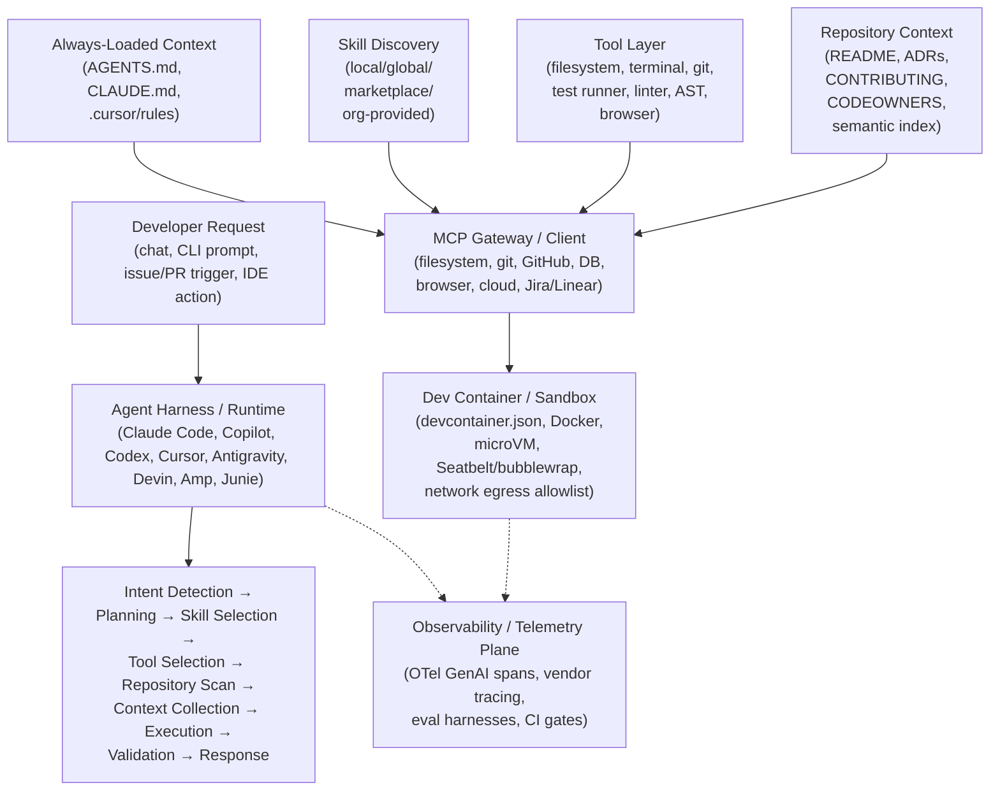

# Agent Skills for AI Coding Assistants — Executive Summary & Reference Architecture

*A vendor-neutral, implementation-focused research package on how AI coding assistants package, discover, execute, and govern Agent Skills (2025–2026). Companion files listed at the bottom.*

---

## 1. The landscape moved fast — read this before anything else

This space changed materially even within H1 2026. Load-bearing facts for everything that follows:

- **`SKILL.md` became the cross-tool standard for coding agents specifically**, not just Claude Code. GitHub Copilot added support in April 2026; VS Code shipped it in Stable in January 2026 with a `/create-skill` command; OpenAI Codex CLI, Cursor, Gemini CLI, JetBrains, and 20+ other tools now read the same file format. A skill authored once works, largely unmodified, across most of the ecosystem.
- **A second, complementary standard — `AGENTS.md`** — emerged independently (jointly from OpenAI, Google, Cursor, Sourcegraph/Factory, and others) as the "README for agents": always-loaded, project-root, no frontmatter. It is functionally distinct from Skills and the two are frequently confused. Getting this distinction right is the single most important conceptual move in this whole package (Part 1, file `01`).
- **Empirical data changes the "how to write instructions" conversation.** A widely cited Vercel evaluation found that Skills invoked with no steering instruction in `AGENTS.md` were ignored by the agent 56% of the time; explicitly telling the agent in `AGENTS.md` when to invoke a given skill raised pass rates from 53% to 79%. Skills are not self-triggering by default in practice as reliably as their design intends — this has direct instructions-engineering implications (file `05`).
- **Consolidation reshaped the vendor map mid-research.** Cognition folded Windsurf into Devin Desktop (windsurf.com/pricing now redirects to devin.ai/pricing); Cursor acquired Continue.dev; Google retired Gemini CLI in favor of Antigravity CLI (announced May 19, 2026, cutover June 18, 2026); Sourcegraph spun out Amp as a standalone company. Any comparison table has a shelf life measured in months in this category.
- **Security research caught up to adoption, hard.** A named attack framework (AIShellJack) demonstrated 41–84% success rates injecting malicious instructions via rules files across platforms; a systematic CVE review found double-digit named vulnerabilities across Cursor, Copilot, Codex CLI, Windsurf, Junie, Roo Code, and Claude Code in 2025–2026 alone, most rooted in the same pattern: **an agent treats repository-supplied text (a rules file, a filename, an issue body) as trusted instruction.**

---

## 2. Core definitions used throughout this package

| Term | Definition |
| --- | --- |
| **Skill** | An on-demand-loaded, named unit of procedural knowledge (`SKILL.md` + optional scripts/references/assets) that a coding agent discovers via its `name`/`description` and loads in full only when a task matches. |
| **AGENTS.md / CLAUDE.md / GEMINI.md** | An always-loaded, project- or user-scoped context file — the "persistent baseline," analogous to onboarding docs a new hire reads on day one, not a specialized procedure they consult only when needed. |
| **Custom Instructions / Rules** | Vendor-native flavors of the always-loaded concept (`.cursor/rules/*.mdc`, `.clinerules/`, `.roo/rules/`, `.windsurf/rules/`, `.github/copilot-instructions.md`) — pre-`AGENTS.md` and still in heavy use, often with glob-scoping frontmatter that `AGENTS.md` itself lacks. |
| **Tool** | A single, callable, typed capability (filesystem read/write, terminal exec, git operation, test runner) the agent's harness exposes to the model. |
| **MCP Server** | A process exposing tools/resources over the Model Context Protocol — the mechanism by which a coding agent reaches an external system (GitHub, Jira, a database, a browser) beyond its built-in tool set. |
| **Extension / Plugin** | A distribution/packaging mechanism (a VS Code extension, a Codex plugin, a Claude Code plugin) that may bundle one or more Skills, MCP server configs, hooks, and UI surfaces together. |
| **Agent** | The runtime loop (harness) that consumes AGENTS.md, Skills, Tools, and MCP servers to plan and execute a coding task. |

**The one distinction that resolves the most confusion:** *AGENTS.md is what the agent always knows about your project; a Skill is what the agent knows how to do, loaded only when relevant.* Confusing the two is the most common authoring mistake in this space (file `01`, file `05`).

---

## 3. Master reference architecture

**Reading the diagram:**

- **Always-loaded context** and **Skills** are architecturally distinct planes even though both often live under `.github/`, `.claude/`, or similar directories — one is a cost paid every turn, the other is paid only on match (file `01`, `05`).
- **Repository context** (README, ADRs, CODEOWNERS, semantic index) is a first-class input to both planes, not an afterthought — the agent's context-collection step increasingly retrieves from this material dynamically rather than relying solely on what's pre-loaded (file `06`).
- **The Dev Container / sandbox layer** is what makes "safe autonomy" possible at all — nearly every mainstream agent now defaults to some form of OS-level or container-level isolation specifically because rules-file and repository-content injection attacks are real and already cataloged with CVEs (file `10`).
- **MCP is the uniform way agents reach beyond their built-in tool set** — filesystem, git, and terminal are typically native/built-in; everything else (GitHub issues, Jira, databases, browsers) is typically MCP-mediated in 2026 tooling.

---

## 4. What belongs where — the one-page responsibility matrix

(Full version with rationale in file `04`.)

| Concern | Skill | AGENTS.md/Rules | Tool | MCP Server | Extension/IDE | Language Server | Dev Container |
| --- | :---: | :---: | :---: | :---: | :---: | :---: | :---: |
| "How to do X, step by step" (occasional) | ✅ | | | | | | |
| "Always true about this repo" (every turn) | | ✅ | | | | | |
| Single typed capability (read file, run tests) | | | ✅ | ✅ (hosts) | | | |
| Reach an external system (GitHub, Jira, DB) | | | | ✅ | | | |
| UI surface, chat participant, editor integration | | | | | ✅ | | |
| Symbol lookup, type info, diagnostics | | | | | | ✅ | |
| Reproducible, isolated execution environment | | | | | | | ✅ |
| Glob-scoped rule ("only for `*.tsx`") | | ✅ (frontmatter) | | | | | |
| Cross-tool portability | ✅ (spec-conformant) | ✅ (AGENTS.md) | depends | ✅ (protocol-native) | ❌ | ❌ | ✅ (devcontainer.json) |

---

## 5. Key findings

1. **Skills and always-loaded instruction files solve different problems and both are necessary** — the field converged on this two-plane model (progressive-disclosure Skills + always-on AGENTS.md/rules) independently across nearly every major vendor by mid-2026, mirroring exactly the same "system prompt vs. skill" split the enterprise business-agent world reached (see the companion enterprise research package).
2. **Skills without explicit steering underperform.** The empirical Vercel finding (56% ignore rate without a pointer, 79% pass rate with one) means the recommended pattern is: put your highest-leverage context directly in AGENTS.md, and have AGENTS.md itself tell the agent when to reach for a given skill — not "author good skills and hope."
3. **Repository-supplied text is now a proven attack surface, not a theoretical one.** Rules File Backdoor / README injection / filename injection are documented, named, CVE-backed techniques with measured 41–84% success rates against real tooling. Any organization allowing agents to auto-load repository-committed instruction files needs a review/trust gate on those files equivalent to code review — a gate most teams do not yet have (file `10`).
4. **Sandboxing is the dominant, converging mitigation**, not prompt-level defense. Every major agent (Claude Code, Codex CLI, Gemini/Antigravity, Cursor) now ships some form of OS-level (Seatbelt/Landlock/bubblewrap) or container/microVM isolation by default or as a strongly recommended default, because — per the vendors' own data — sandboxing measurably reduces both incident rate and permission-prompt fatigue (Anthropic reports an 84% reduction in permission prompts under sandboxing).
5. **Duplication and fragmentation are worse here than in enterprise business agents**, because individual developers, not a central platform team, are usually the ones authoring skills and rules files — five nearly-identical instruction files (`.cursorrules`, `CLAUDE.md`, `.windsurfrules`, `.clinerules`, `AGENTS.md`) per repository is the observed norm, not the exception, and most teams manage this today with symlinks or sync scripts rather than real governance (file `11`).
6. **The market itself is consolidating faster than any comparison table can track** — plan any internal tooling investment around the *interoperable standards* (SKILL.md, AGENTS.md, MCP) rather than any single vendor's current feature set, given the pace of acquisitions and shutdowns observed even within this research window.

---

## 6. Package contents

### Coding Assistant Research (12 parts)

| File | Covers |
| --- | --- |
| Part 1 — Foundations: What Is a Coding Skill? | Skill vs. Agent/Slash Command/Prompt/Tool/MCP Tool/IDE Action |
| Part 2 — Skill Anatomy & Metadata Schema | Internal structure, metadata schema, Deliverable 4 |
| Part 3 — Discovery & Execution Lifecycle | Discovery, execution flow, sequence diagrams, Deliverable 2 |
| Part 4 — Skills vs. MCP & Responsibility Stack | Responsibility matrix, Deliverable 3 |
| Part 5 — Tool Definitions & Instructions Engineering | Tool definitions, instruction-writing best practice, Deliverable 5 |
| Part 6 — Repository Context Engineering | README/ADR/CODEOWNERS/semantic-index retrieval, Deliverable 6 |
| Part 7 — VS Code & Dev Containers Integration | VS Code APIs, Dev Containers, reproducibility, Deliverable 7 |
| Part 8 — MCP Integration & Memory | MCP trust/versioning, memory architecture |
| Part 9 — Multi-Agent & Observability | Multi-agent orchestration, tracing, Deliverable 9 |
| Part 10 — Governance & Security | Governance model, security, prompt injection, sandboxing, CVEs |
| Part 11 — Evaluation, Reusability & Deduplication | Evaluation, reusability, anti-duplication |
| Part 12 — Enterprise Workflows & Comparative Analysis | Workflows, vendor comparison, patterns, Deliverables 1 & 10 |

---

## 7. How to use this package

- **Platform/DevEx teams** standardizing tooling org-wide: `00 → 01 → 04 → 06 → 09 → 10`.
- **Individual engineers** optimizing their own setup: `01 → 05 → 07`.
- **Security/AppSec teams**: `09`, then `10` for CVE catalog and AIShellJack findings.
- **Anyone comparing specific vendors** (Copilot, Claude Code, Cursor, Codex, Devin, Amp, Junie): `12`, cross-referenced against `04`.

*All platform facts reflect publicly documented state as of July 2026. Given the pace of change evidenced throughout this research (multiple vendor shutdowns, rebrands, and acquisitions occurred during the research window itself), re-verify current product state before any procurement or migration decision.*
