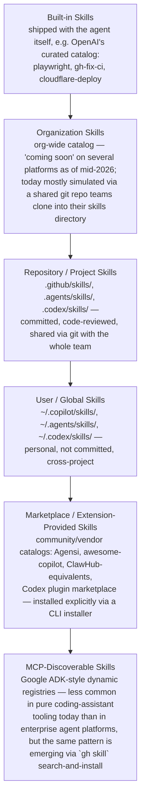
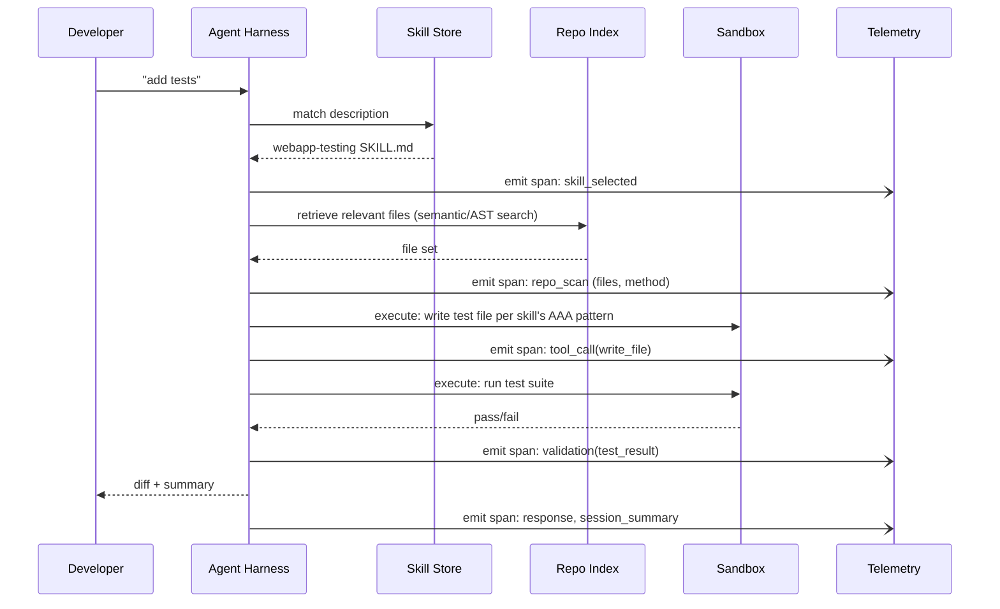
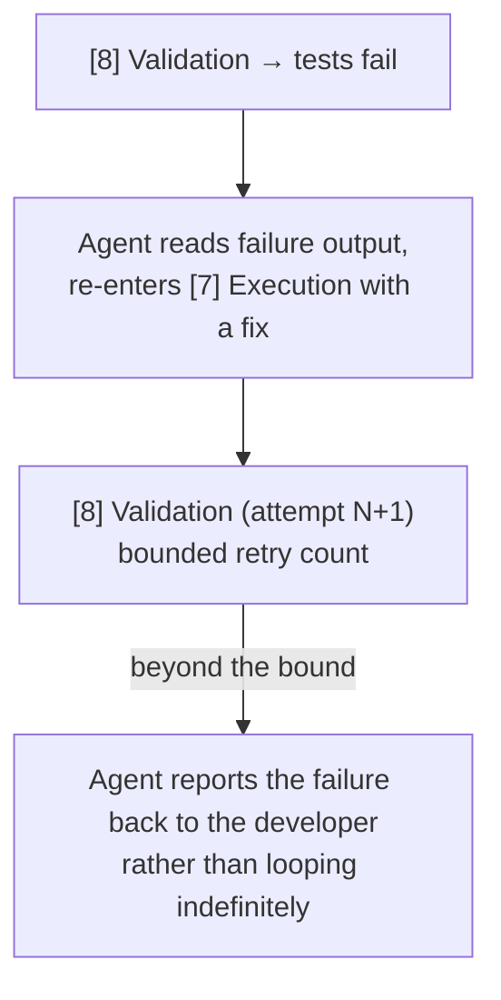
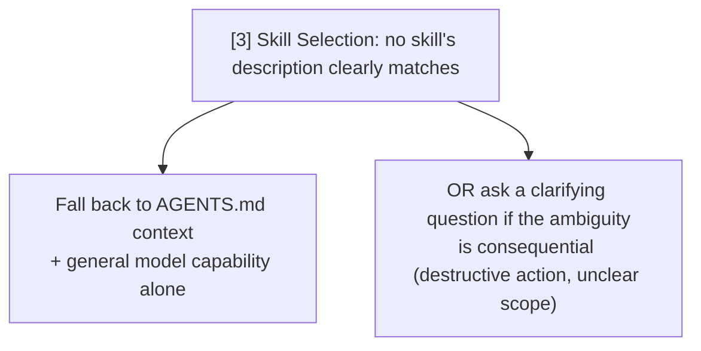
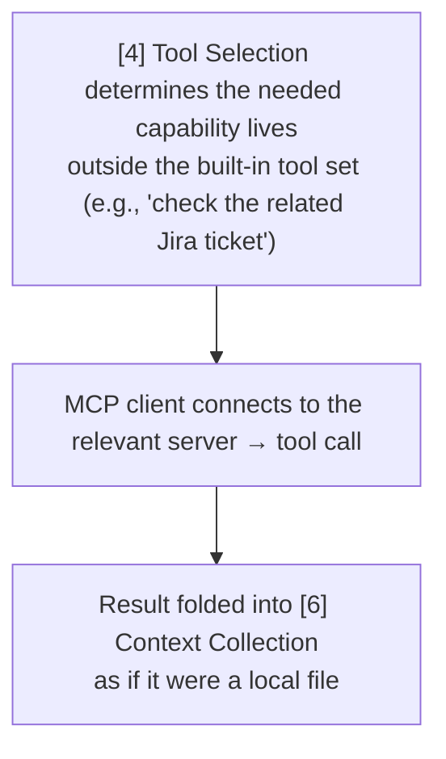
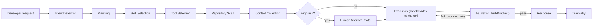

# Part 3 — Skill Discovery & Part 4 — Execution Lifecycle (+ Deliverable 2)

## PART A: Discovery

### 3.1 The discovery hierarchy

*Discovery hierarchy for agent skills, from narrowest to broadest scope: built-in, then organization, repository, user, marketplace, and finally MCP-discoverable registries.*

### 3.2 Lookup mechanisms

| Mechanism | How it works | Where observed |
| --- | --- | --- |
| **Keyword/description matching** | Agent compares the user's request text against every loaded skill's `description` | Universal baseline mechanism across all SKILL.md-compatible tools |
| **Slash/explicit invocation** | User types `/skill-name` or `$skill-name`, bypassing matching entirely | Copilot (`/name`), Codex (`$name`), Claude Code (`/name`) |
| **Semantic/embedding search** | Registry-level search over skill descriptions for near-miss phrasing | `gh skill` search across GitHub-hosted skill repos; marketplace search (Agensi and similar) |
| **Provenance-based update checks** | Installed skill's frontmatter carries source repo/ref/tree-SHA; CLI checks upstream for changes | `gh skill update`, which reads its own previously-written provenance metadata |
| **Static registration** | Skills placed in a fixed directory, loaded at session start | Default behavior for local/project/personal skills in nearly every tool |
| **Dynamic/on-demand fetch** | Agent fetches a skill from a remote registry mid-session | Less common in pure coding tools than in enterprise platforms (Google ADK); Codex's `$skill-installer` is the closest coding-tool analogue, though it is typically a one-time install step, not a per-turn dynamic fetch |

### 3.3 Ranking and caching

- **Ranking** is largely implicit today (best-match-by-description), not yet a formalized quality-score-driven ranking system like the enterprise registries in the companion package — this is a maturity gap worth flagging for any org building internal tooling on top of these ecosystems.
- **Caching**: once loaded for a session, a skill's content typically stays resident for that session/conversation; most tools reload from disk on session restart rather than maintaining a long-lived server-side cache (consistent with the local-first, filesystem-based design of nearly every coding-assistant Skill implementation, in contrast to the server-hosted registries common in enterprise platforms).

---

## PART B: Execution Lifecycle (Deliverable 2)

### 4.1 Stage-by-stage flow

```mermaid
flowchart TD
    R[Developer Request] --> S1
    S1["[1] Intent Detection<br/>Agent classifies what kind of task this is<br/>(bug fix, feature, review, refactor, question)"] --> S2
    S2["[2] Planning<br/>Agent decomposes into steps; decides whether AGENTS.md<br/>context alone suffices or a Skill is needed"] --> S3
    S3["[3] Skill Selection<br/>Match request against loaded skill descriptions;<br/>load full SKILL.md (+ referenced files) on match"] --> S4
    S4["[4] Tool Selection<br/>Within the skill's guidance (or the agent's own judgment),<br/>pick specific tools: read_file, run_terminal, git_diff, etc."] --> S5
    S5["[5] Repository Scan<br/>Retrieve relevant files via semantic index, AST/tree-sitter<br/>navigation, grep/ripgrep, or embeddings — not the whole repo"] --> S6
    S6["[6] Context Collection<br/>Assemble AGENTS.md + skill instructions + retrieved files<br/>+ repo docs (README, ADRs) + prior conversation state"] --> S7
    S7["[7] Execution<br/>Tool calls actually run: edits written, commands executed,<br/>typically inside a sandbox/dev container"] --> S8
    S8["[8] Validation<br/>Compile/build check, linter, test suite run —<br/>'it compiles and the tests pass' as the completion bar"] --> S9
    S9["[9] Response<br/>Diff/PR/summary presented to the developer, following<br/>the skill's declared output format if one exists"] --> S10
    S10["[10] Telemetry<br/>Spans emitted for every step above to the observability plane"]
```

*The ten-stage execution lifecycle, from developer request through intent detection, planning, skill/tool selection, repository scan, context assembly, execution, validation, response, and telemetry.*

### 4.2 Sequence diagram — single-skill, single-tool happy path

*Happy-path sequence for a single skill, single tool call: the harness matches a skill, scans the repo, executes and validates, then responds — emitting a telemetry span at every step.*

### 4.3 Failure and multi-step paths

**A. Validation failure loop**

*A directly observed anti-pattern is unbounded fix-retry loops burning tokens/time without escalating — the bounded retry count exists to prevent it.*

**B. Skill-not-found / ambiguous match**

**C. Cross-tool delegation (MCP-mediated)**

**D. Human approval gate**
Triggered for destructive or high-risk actions (force-push, `rm -rf`, deploying to production, auto-approving further tool calls) — the lifecycle pauses between [6] and [7]. This checkpoint is precisely what several documented CVEs (file `10`) attack: tricking the agent into silently modifying its own approval settings to skip this gate.

### 4.4 Deliverable 2 — the complete flow, one more time as a single artifact

*The complete lifecycle end to end, showing the optional human approval gate before execution and the bounded retry loop on validation failure.*
