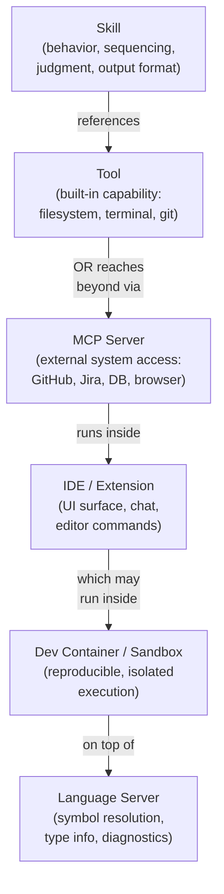

# Skills vs. MCP & the Full Responsibility Stack

## The Layered Stack for Coding Agents

## What Belongs in Each Layer

| Layer | Owns | Does NOT own |
| --- | --- | --- |
| **Skill** | Procedure, sequencing, project-specific judgment, output-format conventions | File I/O, process execution, protocol handshakes |
| **AGENTS.md/Rules** | Always-true facts and boundaries (stack, conventions, verification steps) | Deep multi-step procedures (that's a Skill's job) |
| **Tool** (built-in) | Filesystem, terminal, git, basic search (grep/ripgrep) — typically shipped natively by the harness | Business/procedural judgment about when to use them |
| **MCP Server** | Auth boundary + protocol framing for any *external* system: GitHub issues/PRs, Jira, Linear, databases, browsers, cloud providers, Kubernetes, Terraform | Editor UI, language-specific diagnostics |
| **IDE/Extension** | Chat UI, inline suggestions, commands, editor lifecycle hooks, workspace/task/debug APIs | Deep procedural knowledge (delegates to Skills), external system access (delegates to MCP) |
| **Language Server (LSP)** | Ground-truth symbol resolution, type info, diagnostics, go-to-definition | Anything LLM-mediated — LSP is deterministic, non-generative infrastructure |
| **Dev Container/Sandbox** | Reproducible OS/dependency environment, isolation boundary | Application logic, procedural knowledge |

## The Specific Chain

Skills reference Tools by name/intent in their instructions ("use the test-runner tool"). Tools are exposed by either the IDE (VS Code's built-in file/terminal/git tools) or the CLI (Claude Code's, Codex's own built-in tool set). Git and Filesystem are near-universally *built-in* tools in every mainstream coding agent — a deliberate design choice for latency and reliability; MCP is reserved for genuinely external systems. Terminal access is likewise typically native, wrapped in a sandbox rather than routed through MCP. Docker and Cloud access are mixed: some agents shell out to the docker/cloud CLI as a terminal command; others use a dedicated MCP server. Language Server sits underneath tools — an agent's "find all references" tool is typically implemented *using* LSP under the hood, but the model never talks to the language server directly.

## Avoiding Duplication Across This Stack

The most common coding-assistant-specific duplication failure mode: **the same primitive capability (file read, terminal exec, git diff) is reimplemented slightly differently by every IDE/CLI surface**, because each vendor ships its own built-in tool set rather than sharing one.

This means:

- **Skills should never assume a specific tool name/signature** beyond the small set of near-universal primitives (read, write, search, run-command, git-diff) — a skill written against one vendor's exact tool name will silently fail on another vendor's harness.
- **MCP servers are the correct place to consolidate genuinely duplicated *external-system* integrations.** If three different teams each hand-roll a "call our internal deployment API" skill with embedded curl commands, that's a sign a shared internal MCP server is missing.
- **Don't build a skill to wrap a single MCP tool 1:1.** If a skill's entire content is "call the `create_pull_request` MCP tool with these arguments," that's a thin, low-value wrapper — the tool's own description should already carry that guidance.

## Responsibility Matrix (Deliverable 3)

| Question | Skill | AGENTS.md/Rules | Tool | MCP Server | Extension/IDE | Language Server | Dev Container |
| --- | :---: | :---: | :---: | :---: | :---: | :---: | :---: |
| Defines *when/why* to approach a task a certain way | ✅ | partial | | | | | |
| States facts true on every single turn | | ✅ | | | | | |
| Executes a file read/write | | | ✅ | possible | | | |
| Executes a terminal command | | | ✅ | possible | | | |
| Reaches GitHub/Jira/a database/a browser | | | | ✅ | | | |
| Provides chat UI / inline suggestions | | | | | ✅ | | |
| Resolves symbols/types/diagnostics | | | | | | ✅ | |
| Guarantees a reproducible environment | | | | | | | ✅ |
| Isolates the agent from the host OS | | | | | | | ✅ |
| Should be code-reviewed like source | ✅ | ✅ | n/a | yes | n/a | n/a | ✅ |
| Should be portable across agent vendors | ✅ | ✅ | rarely | ✅ | ❌ | ❌ | ✅ |
