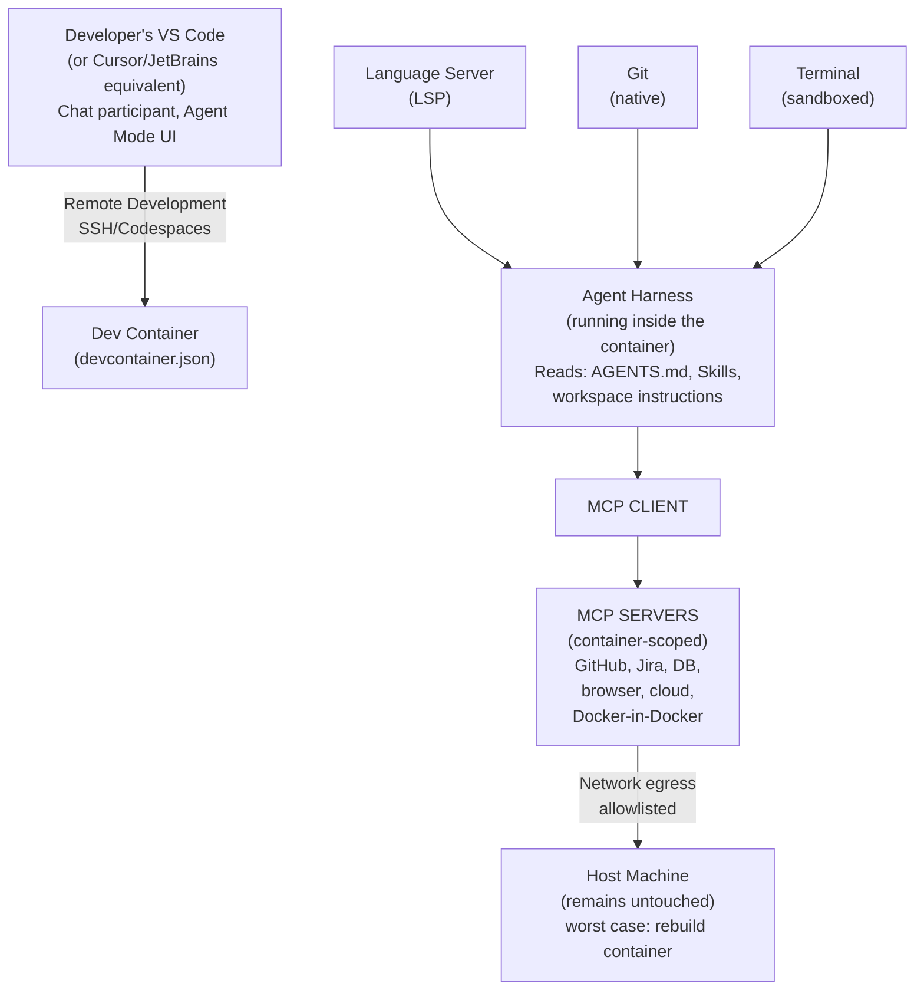

# VS Code & Dev Containers Integration

## What VS Code Contributes That a Standalone CLI Agent Cannot

VS Code is the most common host surface studied across this research, and it contributes several capabilities a bare terminal-based agent does not have natively:

| VS Code capability | What it adds |
| --- | --- |
| **Language Server Protocol (LSP) integration** | Ground-truth symbol resolution, type info, and diagnostics the agent's tools can consult, rather than re-deriving structure via text search alone |
| **Workspace APIs** | Structured knowledge of open folders, multi-root workspaces, and settings scope — informs which AGENTS.md/rules apply |
| **Task APIs** | Reuses the project's own defined build/test/lint tasks (`tasks.json`) rather than the agent guessing shell commands |
| **Terminal APIs** | Integrated terminal the agent can drive, with output capture, distinct from a detached shell process |
| **Git APIs** | Structured diff/staging/branch state via VS Code's own Git extension model, rather than shelling out to `git` and parsing text |
| **Debug APIs** | Programmatic breakpoint/step/inspect access — the basis for any agent capability that goes beyond static analysis into runtime inspection |
| **Testing APIs** | Structured test discovery and result reporting (pass/fail/skip per test), rather than parsing raw test-runner stdout |
| **Problem Matchers** | Structured compiler/linter error parsing tied to specific file/line, feeding directly into the Validation lifecycle stage |
| **Notebook APIs** | Cell-level structure for Jupyter-style workflows, relevant for data/ML-adjacent coding tasks |
| **Extension APIs** | The mechanism by which Copilot, Cursor-as-VS-Code-fork, and third-party agent extensions plug into all of the above |
| **Agent Mode / Chat Participants** | A structured way for multiple agents (`@workspace`, `@terminal`, custom participants) to coexist and be addressed distinctly |
| **Prompt Files / Workspace Instructions** | `.github/instructions/*.instructions.md` with `applyTo` glob-pattern frontmatter — scoped instructions distinct from both AGENTS.md and Skills |
| **Profiles** | Isolated configuration sets (extensions, settings) — useful for maintaining separate agent/tooling configurations per project type |
| **Remote Development** | SSH/Codespaces/Dev Container remoting — the agent and its tools run *where the code actually lives*, not on the developer's local machine |

**The synthesis**: a standalone CLI agent has to reimplement approximations of several of these; a VS Code-hosted agent can consume the IDE's own structured, already-correct implementations instead. This is a genuine capability delta, not just a UX preference — it's why several CLI-first tools also ship dedicated VS Code extensions.

## Dev Containers

### What a Dev Container Gives an Agent That a Bare Host Environment Doesn't

- **Reproducibility**: `.devcontainer/devcontainer.json` pins the exact OS image, language runtime versions, and installed tooling — eliminating the "works on my machine, fails for the agent" class of failure.
- **Environment consistency improving agent quality**: an agent working against a known-good, matching environment produces fewer spurious "fix" attempts caused by local environment drift.
- **Dependency drift prevention**: Container Features and pinned base images (by digest, not tag) ensure the agent and every human teammate build against identical dependency graphs.
- **Security isolation**: this is the *dominant* driver of Dev Container adoption for agents specifically. Running an agent with broad, unattended permissions is explicitly recommended *only* inside an isolated container/sandbox.

### Components

| Component | Role for an agent workflow |
| --- | --- |
| `.devcontainer/devcontainer.json` | Main configuration VS Code reads to build/attach |
| Container Features | Modular, composable installs (language runtimes, CLIs) without hand-rolling a Dockerfile |
| Prebuilds | Pre-baked images/layers to cut container startup time — matters for agent iteration speed |
| Volumes | Persist state (package caches, agent memory files) across container rebuilds |
| Environment variables / Secrets | Injected at container-start from the host, never baked into the image or committed |
| Extensions / Language Servers / Debuggers | Auto-installed inside the container per `devcontainer.json` |
| MCP Servers | Can run *inside* the container too, sandboxing the agent's external-system access alongside everything else |
| Docker-in-Docker | Needed when the agent's own task involves building/running containers as part of its work |
| GitHub Codespaces / Remote Containers / WSL / Remote SSH | Deployment surfaces for the same devcontainer.json — local, cloud, or hybrid |

### The Security Caveat (Important)

Multiple independent sources converge on the same warning: **a Dev Container is not automatically a security sandbox against a malicious/compromised repository.** Running an agent with elevated, unattended permissions inside a devcontainer *does* protect the host machine, but if the project itself is untrusted, the devcontainer's credentials can still be exfiltrated by a successfully-injected agent.

The correct mental model: **Dev Containers solve reproducibility and host-isolation; they do not, by themselves, solve the "untrusted repository content" trust problem**. Additional controls needed are network egress allowlists, credential proxies, and true microVM-level isolation for genuinely untrusted code.

## Reference Architecture: VS Code + Dev Containers + Language Servers + MCP + Git Working Together

**Key components:**

- **VS Code layer**: Chat participant and Agent Mode UI
- **Dev Container**: Reproducible environment with devcontainer.json, Language Server, Git, and sandboxed Terminal
- **Agent Harness**: Runs inside the container, reads AGENTS.md, Skills, and workspace instructions
- **MCP Gateway**: Connects to container-scoped MCP servers for GitHub, Jira, databases, browsers, cloud services, and Docker-in-Docker
- **Host protection**: Network egress is allowlisted (npm/PyPI registry, GitHub, model API only) — the difference between "convenience isolation" and real security isolation

This composed architecture is what several vendors now publish as reference material directly — the pattern has moved from ad hoc community workaround to vendor-endorsed default practice within roughly a year.
