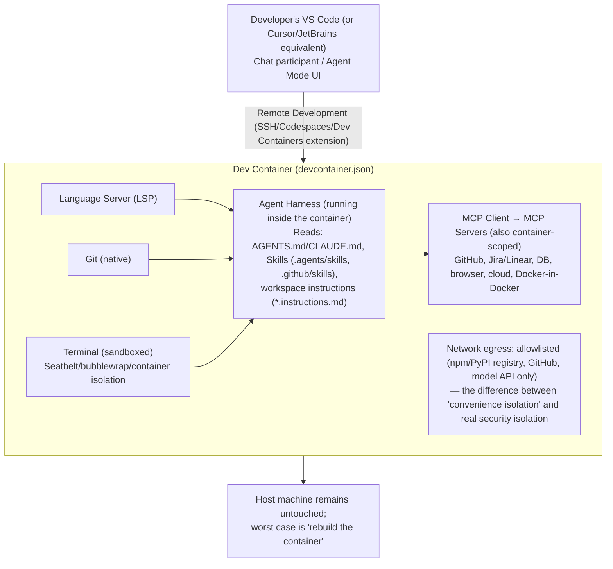

# Part 9 — VS Code Enhancement & Part 10 — Dev Containers (+ Deliverable 7)

## PART A: What VS Code contributes that a standalone CLI agent cannot

VS Code is the most common host surface studied across this research, and it contributes several capabilities a bare terminal-based agent (Claude Code without an IDE, raw Codex CLI) does not have natively:

| VS Code capability | What it adds |
| --- | --- |
| **Language Server Protocol (LSP) integration** | Ground-truth symbol resolution, type info, and diagnostics the agent's tools can consult, rather than re-deriving structure via text search alone |
| **Workspace APIs** | Structured knowledge of open folders, multi-root workspaces, and settings scope — informs which AGENTS.md/rules apply |
| **Task APIs** | Reuses the project's own defined build/test/lint tasks (`tasks.json`) rather than the agent guessing shell commands |
| **Terminal APIs** | Integrated terminal the agent can drive, with output capture, distinct from a detached shell process |
| **Git APIs** | Structured diff/staging/branch state via VS Code's own Git extension model, rather than shelling out to `git` and parsing text |
| **Debug APIs** | Programmatic breakpoint/step/inspect access — the basis for any agent capability that goes beyond static analysis into runtime inspection |
| **Testing APIs** | Structured test discovery and result reporting (pass/fail/skip per test), rather than parsing raw test-runner stdout |
| **Problem Matchers** | Structured compiler/linter error parsing tied to specific file/line, feeding directly into the Validation lifecycle stage (file `03`) |
| **Notebook APIs** | Cell-level structure for Jupyter-style workflows, relevant for data/ML-adjacent coding tasks |
| **Extension APIs** | The mechanism by which Copilot, Cursor-as-VS-Code-fork, and third-party agent extensions plug into all of the above |
| **Agent Mode / Chat Participants** | A structured way for multiple agents (`@workspace`, `@terminal`, custom participants) to coexist and be addressed distinctly within one chat surface |
| **Prompt Files / Workspace Instructions** | `.github/instructions/*.instructions.md` with `applyTo` glob-pattern frontmatter — scoped instructions distinct from both AGENTS.md (always-on) and Skills (fully on-demand); a third, glob-triggered tier |
| **Profiles** | Isolated configuration sets (extensions, settings) — useful for maintaining separate agent/tooling configurations per project type without cross-contamination |
| **Remote Development** | SSH/Codespaces/Dev Container remoting — the agent and its tools run *where the code actually lives*, not on the developer's local machine, which matters for large monorepos and for security isolation (Part B below) |

**The synthesis**: a standalone CLI agent has to reimplement approximations of several of these (its own file-search, its own diff logic, its own test-result parsing); a VS Code-hosted agent can consume the IDE's own structured, already-correct implementations instead. This is a genuine capability delta, not just a UX preference — it's why several CLI-first tools (Claude Code, Codex, Gemini/Antigravity) also ship dedicated VS Code extensions rather than treating the terminal as sufficient.

## PART B: Dev Containers

### 10.1 What a Dev Container gives an agent that a bare host environment doesn't

- **Reproducibility**: `.devcontainer/devcontainer.json` pins the exact OS image, language runtime versions, and installed tooling — eliminating the "works on my machine, fails for the agent" class of failure. Community guidance is explicit that this is now considered a baseline expectation for serious agent deployments, not a nice-to-have.
- **Environment consistency improving agent quality**: an agent working against a known-good, matching environment produces fewer spurious "fix" attempts caused by local environment drift (wrong dependency version, missing system library) that would otherwise look like real code bugs.
- **Dependency drift prevention**: Container Features and pinned base images (by digest, not tag, per multiple vendor security guides) ensure the agent and every human teammate build against identical dependency graphs.
- **Security isolation**: this is the *dominant* driver of Dev Container adoption for agents specifically, not just reproducibility. Running an agent with broad, unattended permissions (`--dangerously-skip-permissions`-style flags) is explicitly recommended *only* inside an isolated container/sandbox, precisely because of the prompt-injection and repository-trust attacks catalogued in file `10`.

### 10.2 Components

| Component | Role for an agent workflow |
| --- | --- |
| `.devcontainer/devcontainer.json` | Main configuration VS Code (and increasingly Cursor, via an extension) reads to build/attach |
| Container Features | Modular, composable installs (language runtimes, CLIs) without hand-rolling a Dockerfile from scratch |
| Prebuilds | Pre-baked images/layers to cut container startup time — matters for agent iteration speed |
| Volumes | Persist state (package caches, agent memory files) across container rebuilds |
| Environment variables / Secrets | Injected at container-start from the host, never baked into the image or committed — a repeatedly emphasized security requirement across every guide reviewed |
| Extensions / Language Servers / Debuggers | Auto-installed inside the container per `devcontainer.json`, so the agent's environment matches what a human teammate would also have |
| MCP Servers | Can run *inside* the container too, sandboxing the agent's external-system access alongside everything else |
| Docker-in-Docker | Needed when the agent's own task involves building/running containers as part of its work (common in platform-engineering and CI-adjacent tasks) |
| GitHub Codespaces / Remote Containers / WSL / Remote SSH | Deployment surfaces for the same devcontainer.json — local, cloud, or hybrid, without changing the underlying reproducibility guarantee |

### 10.3 The security caveat (important, and specific to agent use)

Multiple independent sources converge on the same warning: **a Dev Container is not automatically a security sandbox against a malicious/compromised repository.** Running an agent with elevated, unattended permissions inside a devcontainer *does* protect the host machine, but if the project itself is untrusted, the devcontainer's credentials (API keys, git tokens mounted or forwarded into it) can still be exfiltrated by a successfully-injected agent — a documented, real risk, not a hypothetical one. The correct mental model: **Dev Containers solve reproducibility and host-isolation; they do not, by themselves, solve the "untrusted repository content" trust problem** (file `10` covers the additional controls needed — network egress allowlists, credential proxies, and true microVM-level isolation for genuinely untrusted code).

### 10.4 Deliverable 7 — Reference Architecture: VS Code + Dev Containers + Language Servers + MCP + Git Working Together

*Reference architecture: the developer's editor connects into a Dev Container over Remote Development; inside, the language server, Git, and a sandboxed terminal feed the agent harness, which drives MCP-mediated tool access behind an allowlisted network egress — keeping the host machine untouched even in the worst case.*

This composed architecture is what several vendors now publish as reference material directly (Anthropic's own reference devcontainer for Claude Code with baked-in firewall rules is a concrete, cited example) — the pattern has moved from ad hoc community workaround to vendor-endorsed default practice within roughly a year.
